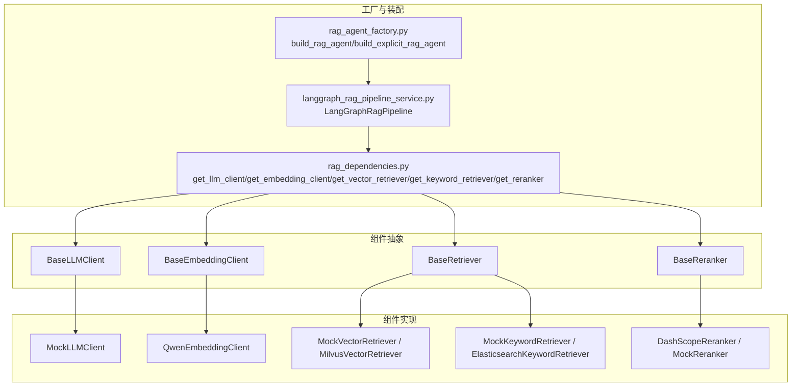
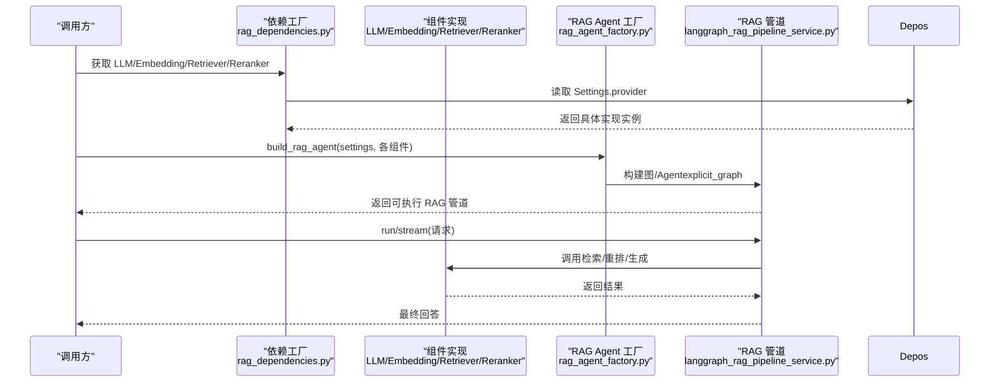
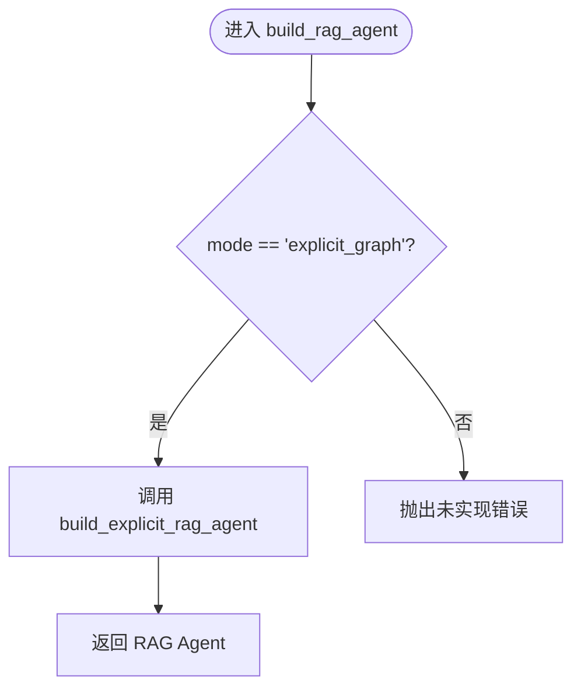
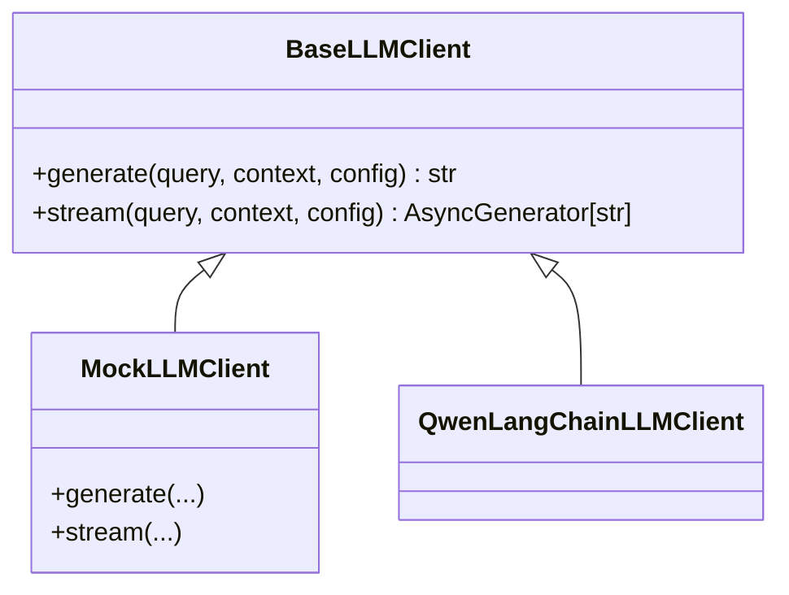
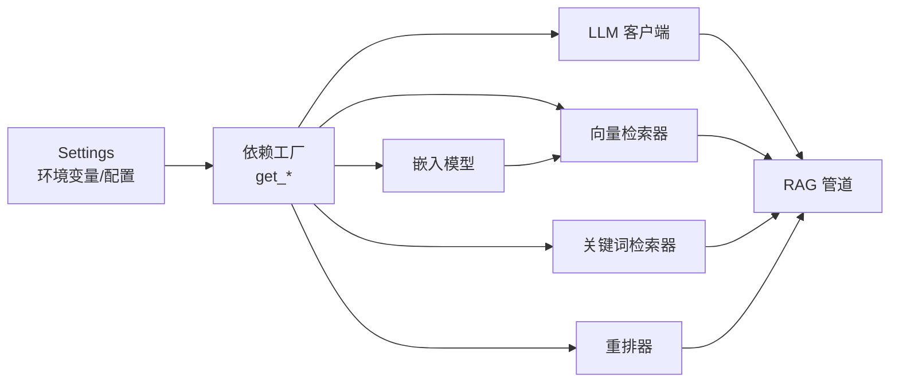

# 工厂模式

<cite>
**本文引用的文件**
- [rag_agent_factory.py](file://src/fast_app/agents/runtime/rag_agent_factory.py)
- [rag_dependencies.py](file://src/fast_app/dependencies/rag_dependencies.py)
- [base.py（LLM）](file://src/fast_app/components/llms/base.py)
- [mock_llm_client.py](file://src/fast_app/components/llms/mock_llm_client.py)
- [base.py（Embedding）](file://src/fast_app/components/embeddings/base.py)
- [mock_embedding_client.py](file://src/fast_app/components/embeddings/mock_embedding_client.py)
- [base.py（Retriever）](file://src/fast_app/components/retrievers/base.py)
- [base.py（Reranker）](file://src/fast_app/components/rerankers/base.py)
- [langgraph_rag_pipeline_service.py](file://src/fast_app/services/rag/langgraph_rag_pipeline_service.py)
- [test_rag_provider_matrix.py](file://scripts/tests/rag_memory/test_rag_provider_matrix.py)
</cite>

## 目录
1. [简介](#简介)
2. [项目结构](#项目结构)
3. [核心组件](#核心组件)
4. [架构总览](#架构总览)
5. [详细组件分析](#详细组件分析)
6. [依赖关系分析](#依赖关系分析)
7. [性能考虑](#性能考虑)
8. [故障排查指南](#故障排查指南)
9. [结论](#结论)
10. [附录：扩展与自定义指南](#附录：扩展与自定义指南)

## 简介
本文件围绕“工厂模式”在 RAG Agent 创建与组件实例化中的应用展开，重点说明以下方面：
- RagAgentFactory 如何根据配置动态组装不同类型的 RAG Agent。
- 组件工厂的设计模式：嵌入模型工厂、LLM 客户端工厂、检索器工厂、重排器工厂等。
- 工厂方法的注册机制与依赖注入集成方式。
- 测试环境中的 Mock 对象创建与管理。
- 如何扩展工厂功能并实现自定义组件注册。

该仓库采用“配置驱动 + 依赖注入”的工厂模式：通过环境变量或配置文件选择 provider，再由依赖层统一创建具体实现，上层业务只面向抽象接口调用，从而获得高内聚、低耦合、易替换、易测试的系统。

## 项目结构
与工厂模式相关的代码主要分布在以下位置：
- 组件抽象与实现：components/llms、components/embeddings、components/retrievers、components/rerankers
- 依赖装配与工厂函数：dependencies/rag_dependencies.py
- Agent 装配入口：agents/runtime/rag_agent_factory.py
- 服务层使用工厂产物：services/rag/langgraph_rag_pipeline_service.py
- 测试矩阵：scripts/tests/rag_memory/test_rag_provider_matrix.py

图表来源
- [rag_dependencies.py:69-163](file://src/fast_app/dependencies/rag_dependencies.py#L69-L163)
- [rag_agent_factory.py:15-57](file://src/fast_app/agents/runtime/rag_agent_factory.py#L15-L57)
- [langgraph_rag_pipeline_service.py:74-97](file://src/fast_app/services/rag/langgraph_rag_pipeline_service.py#L74-L97)

章节来源
- [rag_dependencies.py:69-163](file://src/fast_app/dependencies/rag_dependencies.py#L69-L163)
- [rag_agent_factory.py:15-57](file://src/fast_app/agents/runtime/rag_agent_factory.py#L15-L57)
- [langgraph_rag_pipeline_service.py:74-97](file://src/fast_app/services/rag/langgraph_rag_pipeline_service.py#L74-L97)

## 核心组件
- 抽象基类
  - LLM 客户端：定义 generate/stream 接口，屏蔽不同后端差异。
  - 嵌入模型：定义 embed_query/embed_documents 接口，屏蔽向量生成细节。
  - 检索器：定义 retrieve 接口，屏蔽向量/关键词检索差异。
  - 重排器：定义 rerank 接口，屏蔽重排序逻辑差异。
- 具体实现
  - LLM：MockLLMClient（本地稳定输出）、QwenLangChainLLMClient（真实后端）。
  - 嵌入：QwenEmbeddingClient（真实后端）、MockEmbeddingClient（确定性向量，用于测试）。
  - 检索：MilvusVectorRetriever/ElasticsearchKeywordRetriever（真实存储），以及对应的 Mock 实现。
  - 重排：DashScopeReranker（真实服务）、MockReranker（无操作或固定策略）。
- 工厂与装配
  - 依赖层提供 get_* 工厂函数，按 Settings 中的 provider 字段返回对应实现。
  - RagAgentFactory 将已装配好的组件组合为 RAG Agent（当前支持 explicit_graph 模式）。
  - 服务层 LangGraphRagPipeline 在构造时一次性装配图结构，请求时复用。

章节来源
- [base.py（LLM）:9-26](file://src/fast_app/components/llms/base.py#L9-L26)
- [base.py（Embedding）:4-13](file://src/fast_app/components/embeddings/base.py#L4-L13)
- [base.py（Retriever）:6-13](file://src/fast_app/components/retrievers/base.py#L6-L13)
- [base.py（Reranker）:6-14](file://src/fast_app/components/rerankers/base.py#L6-L14)
- [mock_llm_client.py:17-203](file://src/fast_app/components/llms/mock_llm_client.py#L17-L203)
- [mock_embedding_client.py:4-30](file://src/fast_app/components/embeddings/mock_embedding_client.py#L4-L30)
- [rag_dependencies.py:69-163](file://src/fast_app/dependencies/rag_dependencies.py#L69-L163)
- [rag_agent_factory.py:15-57](file://src/fast_app/agents/runtime/rag_agent_factory.py#L15-L57)
- [langgraph_rag_pipeline_service.py:74-97](file://src/fast_app/services/rag/langgraph_rag_pipeline_service.py#L74-L97)

## 架构总览
下图展示了从配置到组件装配、再到 RAG Agent 构建与执行的完整流程。

图表来源
- [rag_dependencies.py:69-163](file://src/fast_app/dependencies/rag_dependencies.py#L69-L163)
- [rag_agent_factory.py:36-57](file://src/fast_app/agents/runtime/rag_agent_factory.py#L36-L57)
- [langgraph_rag_pipeline_service.py:74-97](file://src/fast_app/services/rag/langgraph_rag_pipeline_service.py#L74-L97)

## 详细组件分析

### RagAgentFactory：动态装配 RAG Agent
- 作用：接收已装配好的组件（向量检索、关键词检索、LLM、重排器），根据 mode 选择装配策略。
- 当前模式：
  - explicit_graph：调用底层图构建器，将组件注入到 LangGraph 图中，形成可执行 RAG Agent。
  - create_agent：预留后续阶段实现，当前会抛出错误提示。
- 关键点：
  - 不关心组件内部实现，仅依赖抽象接口。
  - 通过 Settings 控制参数（如 rerank_top_k）。
  - 可选注入 PromptGuardService 和 MarkdownParentContextExpander 增强能力。

图表来源
- [rag_agent_factory.py:36-57](file://src/fast_app/agents/runtime/rag_agent_factory.py#L36-L57)

章节来源
- [rag_agent_factory.py:15-57](file://src/fast_app/agents/runtime/rag_agent_factory.py#L15-L57)

### LLM 客户端工厂：get_llm_client
- 依据 settings.llm_provider 选择实现：
  - mock：返回 MockLLMClient，提供稳定、可观测的输出。
  - qwen：返回 QwenLangChainLLMClient，对接真实大模型。
- 异常处理：不支持的 provider 抛出应用级错误，便于快速定位配置问题。

图表来源
- [base.py（LLM）:9-26](file://src/fast_app/components/llms/base.py#L9-L26)
- [mock_llm_client.py:17-203](file://src/fast_app/components/llms/mock_llm_client.py#L17-L203)
- [rag_dependencies.py:69-80](file://src/fast_app/dependencies/rag_dependencies.py#L69-L80)

章节来源
- [rag_dependencies.py:69-80](file://src/fast_app/dependencies/rag_dependencies.py#L69-L80)
- [base.py（LLM）:9-26](file://src/fast_app/components/llms/base.py#L9-L26)
- [mock_llm_client.py:17-203](file://src/fast_app/components/llms/mock_llm_client.py#L17-L203)

### 嵌入模型工厂：get_embedding_client
- 依据 settings.embedding_provider 选择实现：
  - qwen：返回 QwenEmbeddingClient。
  - 其他值：抛出错误。
- 测试场景可使用 MockEmbeddingClient（由测试或自定义装配注入），以稳定维度与确定性向量验证数据管道。

章节来源
- [rag_dependencies.py:83-93](file://src/fast_app/dependencies/rag_dependencies.py#L83-L93)
- [base.py（Embedding）:4-13](file://src/fast_app/components/embeddings/base.py#L4-L13)
- [mock_embedding_client.py:4-30](file://src/fast_app/components/embeddings/mock_embedding_client.py#L4-L30)

### 检索器工厂：get_vector_retriever / get_keyword_retriever
- 向量检索器：
  - mock：返回 MockVectorRetriever。
  - milvus：返回 MilvusVectorRetriever，需注入 embedding_client 与共享的 milvus_client。
- 关键词检索器：
  - mock：返回 MockKeywordRetriever。
  - elasticsearch：返回 ElasticsearchKeywordRetriever，需注入共享的 elasticsearch_client。
- 这些工厂从 app.state 中取生命周期内的外部 client，避免重复创建连接。

章节来源
- [rag_dependencies.py:97-140](file://src/fast_app/dependencies/rag_dependencies.py#L97-L140)
- [base.py（Retriever）:6-13](file://src/fast_app/components/retrievers/base.py#L6-L13)

### 重排器工厂：get_reranker
- none/mock：返回 MockReranker，跳过或简化重排。
- dashscope：返回 DashScopeReranker，需注入共享的 httpx 客户端。
- 不支持的 provider：抛出应用级错误。

章节来源
- [rag_dependencies.py:143-163](file://src/fast_app/dependencies/rag_dependencies.py#L143-L163)
- [base.py（Reranker）:6-14](file://src/fast_app/components/rerankers/base.py#L6-L14)

### 服务层装配：LangGraphRagPipeline
- 在构造时调用 build_rag_agent，将检索、重排、LLM 等组件注入到 LangGraph 图中。
- 图结构固定，每次请求变化的是 initial_state，提升性能与一致性。
- 同时创建 retrieve_node、build_context_node、route_query_node、direct_answer_node 等节点。

章节来源
- [langgraph_rag_pipeline_service.py:74-97](file://src/fast_app/services/rag/langgraph_rag_pipeline_service.py#L74-L97)

## 依赖关系分析
- 松耦合：上层仅依赖抽象接口；具体实现通过工厂函数按需装配。
- 集中式装配：所有 provider 分支集中在 dependencies/rag_dependencies.py，便于维护与扩展。
- 生命周期管理：外部 client（Milvus、Elasticsearch、httpx）通过 app.state 共享，避免重复创建。
- 测试友好：通过环境变量切换 provider，无需重启服务即可验证多组合。

图表来源
- [rag_dependencies.py:69-163](file://src/fast_app/dependencies/rag_dependencies.py#L69-L163)
- [langgraph_rag_pipeline_service.py:74-97](file://src/fast_app/services/rag/langgraph_rag_pipeline_service.py#L74-L97)

章节来源
- [rag_dependencies.py:69-163](file://src/fast_app/dependencies/rag_dependencies.py#L69-L163)

## 性能考虑
- 图结构一次性构建：LangGraph 图在 pipeline 构造时构建，请求时仅更新状态，减少开销。
- 外部连接复用：通过 app.state 共享 Milvus、Elasticsearch、httpx 客户端，避免频繁建立连接。
- 流式输出：LLM 支持 stream，降低首字节延迟，提升用户体验。
- 重排策略可调：通过 Settings.rerank_top_k 控制召回数量与重排成本。
- Mock 组件加速测试：MockLLMClient/MockEmbeddingClient 等避免网络与模型加载开销。

[本节为通用性能建议，不直接分析具体文件]

## 故障排查指南
- 常见错误：不支持的 provider 名称会导致工厂抛出应用级错误。检查环境变量或配置文件中的 provider 字段是否拼写正确。
- 外部依赖未初始化：若使用需要 app.state 的组件（如 Milvus、Elasticsearch、httpx），请确保应用启动时已初始化并挂载到 app.state。
- 测试隔离：在多场景矩阵测试中，注意清理 Settings 缓存并恢复环境变量，避免上一组配置污染下一组。
- 超时与重试：对真实外部服务（LLM、Milvus、ES）应结合超时与重试策略，避免阻塞。

章节来源
- [rag_dependencies.py:69-163](file://src/fast_app/dependencies/rag_dependencies.py#L69-L163)
- [test_rag_provider_matrix.py:131-161](file://scripts/tests/rag_memory/test_rag_provider_matrix.py#L131-L161)

## 结论
本项目通过“配置驱动 + 依赖注入”的工厂模式，实现了：
- 清晰的职责边界：抽象接口与具体实现分离。
- 灵活的装配策略：通过 provider 配置动态选择实现。
- 良好的可测试性：Mock 组件与测试矩阵覆盖多种组合。
- 可扩展的架构：新增 provider 只需在依赖工厂中添加分支，并在组件目录中实现对应类。

## 附录：扩展与自定义指南

### 新增 LLM 提供商
- 步骤：
  1. 在 components/llms 下实现新的 LLM 客户端，继承 BaseLLMClient 并实现 generate/stream。
  2. 在 dependencies/rag_dependencies.py 的 get_llm_client 中添加 provider 分支，返回新实现。
  3. 通过环境变量设置 LLM_PROVIDER 为新值进行验证。
- 参考路径：
  - [base.py（LLM）:9-26](file://src/fast_app/components/llms/base.py#L9-L26)
  - [rag_dependencies.py:69-80](file://src/fast_app/dependencies/rag_dependencies.py#L69-L80)

### 新增嵌入模型提供商
- 步骤：
  1. 在 components/embeddings 下实现新的嵌入客户端，继承 BaseEmbeddingClient。
  2. 在 get_embedding_client 中添加 provider 分支。
  3. 如需测试，可使用 MockEmbeddingClient 保证稳定性。
- 参考路径：
  - [base.py（Embedding）:4-13](file://src/fast_app/components/embeddings/base.py#L4-L13)
  - [rag_dependencies.py:83-93](file://src/fast_app/dependencies/rag_dependencies.py#L83-L93)
  - [mock_embedding_client.py:4-30](file://src/fast_app/components/embeddings/mock_embedding_client.py#L4-L30)

### 新增检索器提供商
- 步骤：
  1. 在 components/retrievers 下实现新的检索器，继承 BaseRetriever。
  2. 在 get_vector_retriever 或 get_keyword_retriever 中添加分支。
  3. 如需外部连接，从 app.state 获取共享 client。
- 参考路径：
  - [base.py（Retriever）:6-13](file://src/fast_app/components/retrievers/base.py#L6-L13)
  - [rag_dependencies.py:97-140](file://src/fast_app/dependencies/rag_dependencies.py#L97-L140)

### 新增重排器提供商
- 步骤：
  1. 在 components/rerankers 下实现新的重排器，继承 BaseReranker。
  2. 在 get_reranker 中添加分支。
  3. 如需 HTTP 客户端，从 app.state 获取共享 httpx 客户端。
- 参考路径：
  - [base.py（Reranker）:6-14](file://src/fast_app/components/rerankers/base.py#L6-L14)
  - [rag_dependencies.py:143-163](file://src/fast_app/dependencies/rag_dependencies.py#L143-L163)

### 在测试中使用 Mock 与矩阵
- 使用 test_rag_provider_matrix.py 可在同一进程内切换 provider 组合，验证依赖装配与链路连通性。
- 关键要点：
  - 临时覆盖环境变量后清除 Settings 缓存。
  - 每个用例结束后恢复环境变量，避免相互污染。
  - 对带 close() 的对象进行资源释放。
- 参考路径：
  - [test_rag_provider_matrix.py:131-161](file://scripts/tests/rag_memory/test_rag_provider_matrix.py#L131-L161)
  - [test_rag_provider_matrix.py:177-194](file://scripts/tests/rag_memory/test_rag_provider_matrix.py#L177-L194)

### 自定义 RAG Agent 装配模式
- 当前 RagAgentFactory 支持 explicit_graph 模式；create_agent 模式预留后续实现。
- 如需扩展：
  1. 在 rag_agent_factory.py 中实现新的装配逻辑。
  2. 在 build_rag_agent 中添加分支，返回新模式的 Agent。
  3. 在服务层或 API 层传入相应 mode 参数。
- 参考路径：
  - [rag_agent_factory.py:36-57](file://src/fast_app/agents/runtime/rag_agent_factory.py#L36-L57)