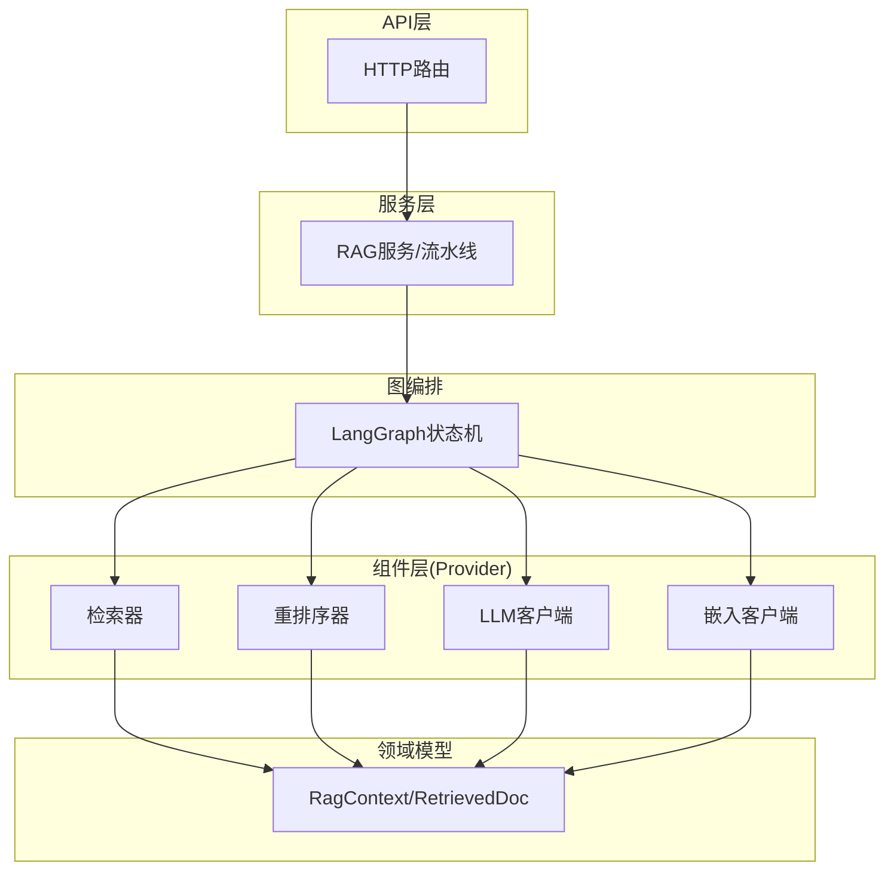
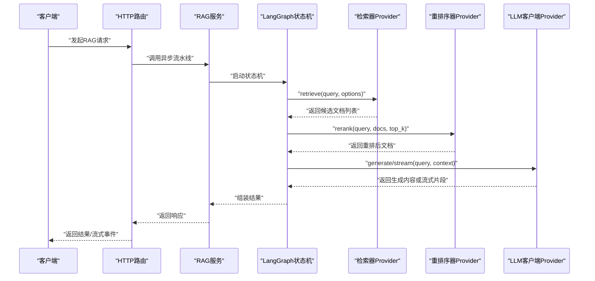
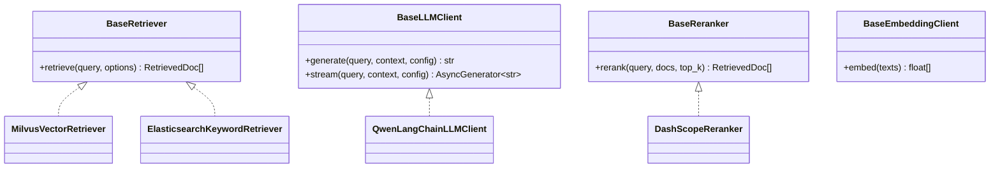
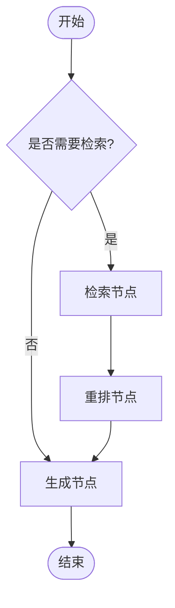
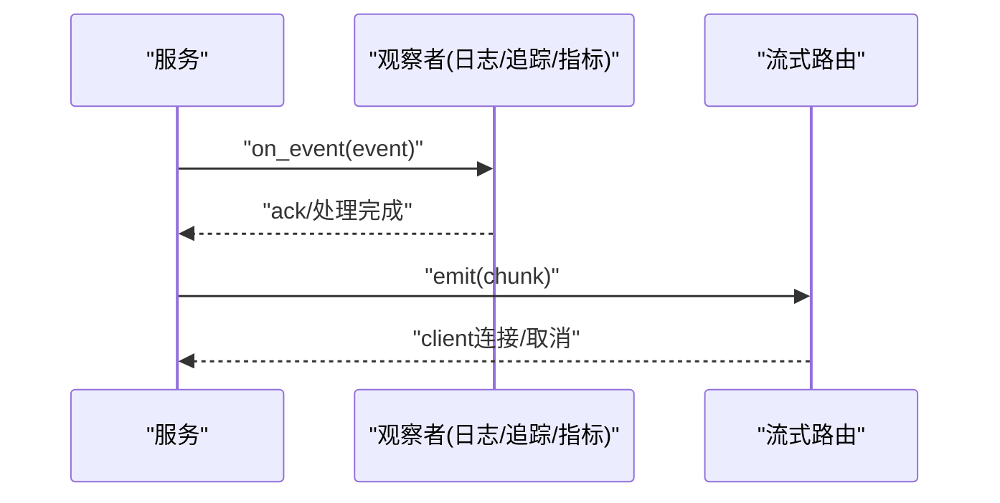
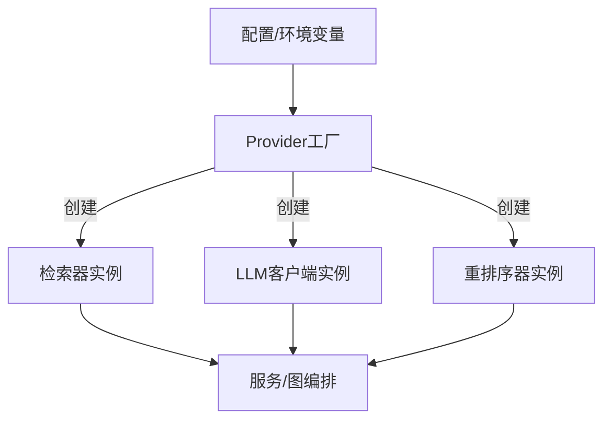
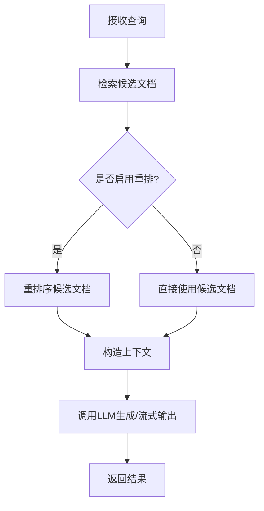
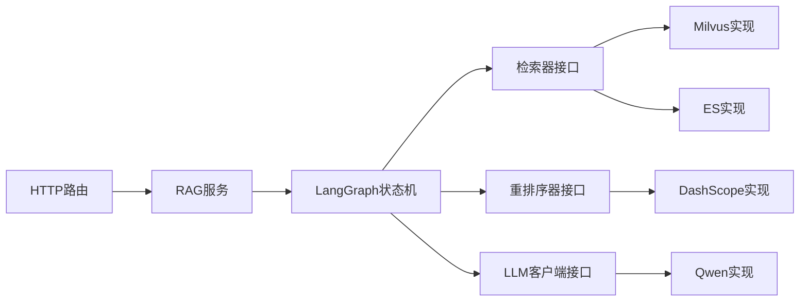

# 核心设计模式

<cite>
**本文引用的文件**
- [检索器抽象基类](file://python-agent-study/src/fast_app/components/retrievers/base.py)
- [LLM客户端抽象基类](file://python-agent-study/src/fast_app/components/llms/base.py)
- [重排序器抽象基类](file://python-agent-study/src/fast_app/components/rerankers/base.py)
- [RAG状态定义](file://python-agent-study/src/fast_app/graph/rag/rag_state.py)
- [领域模型（RAG上下文与文档）](file://python-agent-study/src/fast_app/domain/rag_models.py)
- [LangGraph RAG节点示例](file://python-agent-study/src/app/langgraph_rag_nodes_demo.py)
- [LangGraph最小示例](file://python-agent-study/src/app/langgraph_minimal_demo.py)
- [LangGraph流式更新示例](file://python-agent-study/src/app/langgraph_stream_updates_demo.py)
- [RAG依赖注入](file://python-agent-study/src/fast_app/dependencies/rag_dependencies.py)
- [RAG服务（异步流水线）](file://python-agent-study/src/fast_app/services/rag/async_rag_pipeline.py)
- [错误响应与异常处理](file://python-agent-study/src/fast_app/core/error_responses.py)
- [异常处理器](file://python-agent-study/src/fast_app/core/exception_handlers.py)
- [请求上下文](file://python-agent-study/src/fast_app/core/request_context.py)
- [日志配置](file://python-agent-study/src/fast_app/core/logging.py)
- [延迟追踪](file://python-agent-study/src/fast_app/core/latency.py)
- [结构化输出](file://python-agent-study/src/fast_app/core/structured_output.py)
- [嵌入客户端抽象基类](file://python-agent-study/src/fast_app/components/embeddings/base.py)
- [Qwen LLM客户端实现](file://python-agent-study/src/fast_app/components/llms/qwen_langchain_llm_client.py)
- [DashScope重排序器实现](file://python-agent-study/src/fast_app/components/rerankers/dashscope_reranker.py)
- [Milvus向量检索器实现](file://python-agent-study/src/fast_app/components/retrievers/milvus_vector_retriever.py)
- [Elasticsearch关键词检索器实现](file://python-agent-study/src/fast_app/components/retrievers/elasticsearch_keyword_retriever.py)
- [Mock组件（用于测试）](file://python-agent-study/src/fast_app/components/llms/mock_llm_client.py)
- [Mock重排序器](file://python-agent-study/src/fast_app/components/rerankers/mock_reranker.py)
- [Mock向量检索器](file://python-agent-study/src/fast_app/components/retrievers/mock_vector_retriever.py)
- [Mock关键词检索器](file://python-agent-study/src/fast_app/components/retrievers/mock_keyword_retriever.py)
- [主应用入口](file://python-agent-study/src/fast_app/main.py)
- [聊天路由](file://python-agent-study/src/fast_app/api/chat_routes.py)
- [RAG聊天路由](file://python-agent-study/src/fast_app/api/rag_chat_routes.py)
- [流式路由](file://python-agent-study/src/fast_app/api/stream_routes.py)
</cite>

## 目录
1. [简介](#简介)
2. [项目结构](#项目结构)
3. [核心组件](#核心组件)
4. [架构总览](#架构总览)
5. [详细组件分析](#详细组件分析)
6. [依赖关系分析](#依赖关系分析)
7. [性能考量](#性能考量)
8. [故障排查指南](#故障排查指南)
9. [结论](#结论)
10. [附录](#附录)

## 简介
本文件聚焦于代码库中的核心设计模式，系统性阐述 Provider 模式在检索器、LLM 客户端、重排序器等组件中的应用；解释 LangGraph 状态机模式在 Agent 工作流中的实现；说明事件驱动架构、观察者模式、工厂模式的典型使用场景；并给出如何通过抽象基类与接口定义构建可插拔架构的实践。文档面向高级开发者，提供扩展与自定义实现的指导，包含最佳实践与常见陷阱。

## 项目结构
本项目采用分层与模块化组织：
- components：以 Provider 模式为核心，定义检索器、LLM 客户端、重排序器、嵌入等能力抽象与具体实现。
- graph：基于 LangGraph 的状态机与工作流编排，包括 RAG、Agent、Research 等流程。
- services：业务服务层，组合 components 与 graph，封装复杂流程（如异步 RAG 流水线）。
- api：HTTP 接口层，将外部请求映射到服务调用。
- domain：领域模型与数据契约（如 RagContext、RetrievedDoc、RetrievalOptions）。
- core：横切关注点（日志、错误、延迟追踪、结构化输出、请求上下文）。
- dependencies：依赖注入与装配，集中管理 Provider 实例化与生命周期。

图表来源
- [主应用入口](file://python-agent-study/src/fast_app/main.py)
- [RAG服务（异步流水线）](file://python-agent-study/src/fast_app/services/rag/async_rag_pipeline.py)
- [LangGraph最小示例](file://python-agent-study/src/app/langgraph_minimal_demo.py)
- [领域模型（RAG上下文与文档）](file://python-agent-study/src/fast_app/domain/rag_models.py)

章节来源
- [主应用入口](file://python-agent-study/src/fast_app/main.py)
- [RAG服务（异步流水线）](file://python-agent-study/src/fast_app/services/rag/async_rag_pipeline.py)
- [LangGraph最小示例](file://python-agent-study/src/app/langgraph_minimal_demo.py)
- [领域模型（RAG上下文与文档）](file://python-agent-study/src/fast_app/domain/rag_models.py)

## 核心组件
- 检索器 Provider：统一检索接口，屏蔽底层存储差异（向量、关键词、混合）。
- LLM 客户端 Provider：统一生成与流式接口，屏蔽不同 LLM 后端差异。
- 重排序器 Provider：对候选结果进行相关性重排，提升最终质量。
- 嵌入客户端 Provider：将文本转换为向量表示，供检索器使用。
- LangGraph 状态机：以状态为中心编排多阶段流程（检索、重排、生成），支持条件分支与循环控制。
- 依赖注入与工厂：集中装配 Provider，支持运行时切换与测试替换。

章节来源
- [检索器抽象基类](file://python-agent-study/src/fast_app/components/retrievers/base.py)
- [LLM客户端抽象基类](file://python-agent-study/src/fast_app/components/llms/base.py)
- [重排序器抽象基类](file://python-agent-study/src/fast_app/components/rerankers/base.py)
- [嵌入客户端抽象基类](file://python-agent-study/src/fast_app/components/embeddings/base.py)
- [LangGraph最小示例](file://python-agent-study/src/app/langgraph_minimal_demo.py)
- [LangGraph流式更新示例](file://python-agent-study/src/app/langgraph_stream_updates_demo.py)
- [RAG依赖注入](file://python-agent-study/src/fast_app/dependencies/rag_dependencies.py)

## 架构总览
下图展示了从 HTTP 请求到 LangGraph 状态机，再到各 Provider 的调用链路与数据流转。

图表来源
- [聊天路由](file://python-agent-study/src/fast_app/api/chat_routes.py)
- [RAG聊天路由](file://python-agent-study/src/fast_app/api/rag_chat_routes.py)
- [流式路由](file://python-agent-study/src/fast_app/api/stream_routes.py)
- [RAG服务（异步流水线）](file://python-agent-study/src/fast_app/services/rag/async_rag_pipeline.py)
- [LangGraph最小示例](file://python-agent-study/src/app/langgraph_minimal_demo.py)
- [LangGraph流式更新示例](file://python-agent-study/src/app/langgraph_stream_updates_demo.py)

## 详细组件分析

### Provider 模式：检索器、LLM 客户端、重排序器
- 抽象基类定义统一接口，确保不同实现可互换。
- 通过依赖注入在运行时选择具体实现，便于测试与扩展。
- 领域模型作为输入输出契约，保证一致性。

图表来源
- [检索器抽象基类](file://python-agent-study/src/fast_app/components/retrievers/base.py)
- [LLM客户端抽象基类](file://python-agent-study/src/fast_app/components/llms/base.py)
- [重排序器抽象基类](file://python-agent-study/src/fast_app/components/rerankers/base.py)
- [嵌入客户端抽象基类](file://python-agent-study/src/fast_app/components/embeddings/base.py)
- [Milvus向量检索器实现](file://python-agent-study/src/fast_app/components/retrievers/milvus_vector_retriever.py)
- [Elasticsearch关键词检索器实现](file://python-agent-study/src/fast_app/components/retrievers/elasticsearch_keyword_retriever.py)
- [Qwen LLM客户端实现](file://python-agent-study/src/fast_app/components/llms/qwen_langchain_llm_client.py)
- [DashScope重排序器实现](file://python-agent-study/src/fast_app/components/rerankers/dashscope_reranker.py)

章节来源
- [检索器抽象基类](file://python-agent-study/src/fast_app/components/retrievers/base.py)
- [LLM客户端抽象基类](file://python-agent-study/src/fast_app/components/llms/base.py)
- [重排序器抽象基类](file://python-agent-study/src/fast_app/components/rerankers/base.py)
- [嵌入客户端抽象基类](file://python-agent-study/src/fast_app/components/embeddings/base.py)
- [Milvus向量检索器实现](file://python-agent-study/src/fast_app/components/retrievers/milvus_vector_retriever.py)
- [Elasticsearch关键词检索器实现](file://python-agent-study/src/fast_app/components/retrievers/elasticsearch_keyword_retriever.py)
- [Qwen LLM客户端实现](file://python-agent-study/src/fast_app/components/llms/qwen_langchain_llm_client.py)
- [DashScope重排序器实现](file://python-agent-study/src/fast_app/components/rerankers/dashscope_reranker.py)

### LangGraph 状态机模式：Agent 工作流
- 以状态为中心，将检索、重排、生成等步骤建模为节点，边根据状态决定下一步。
- 支持条件边、循环与终止条件，适合复杂决策流程。
- 结合流式更新，可实现增量输出与实时反馈。

图表来源
- [LangGraph最小示例](file://python-agent-study/src/app/langgraph_minimal_demo.py)
- [LangGraph流式更新示例](file://python-agent-study/src/app/langgraph_stream_updates_demo.py)
- [RAG状态定义](file://python-agent-study/src/fast_app/graph/rag/rag_state.py)

章节来源
- [LangGraph最小示例](file://python-agent-study/src/app/langgraph_minimal_demo.py)
- [LangGraph流式更新示例](file://python-agent-study/src/app/langgraph_stream_updates_demo.py)
- [RAG状态定义](file://python-agent-study/src/fast_app/graph/rag/rag_state.py)

### 事件驱动架构与观察者模式
- 事件驱动：通过流式路由与服务层发布事件（如进度、中间结果），消费者订阅并处理。
- 观察者模式：在服务或组件中维护观察者集合，状态变化时通知观察者（例如日志、追踪、指标收集）。
- 在本项目中，流式更新与日志/追踪模块可作为事件与观察者的载体。

图表来源
- [流式路由](file://python-agent-study/src/fast_app/api/stream_routes.py)
- [日志配置](file://python-agent-study/src/fast_app/core/logging.py)
- [延迟追踪](file://python-agent-study/src/fast_app/core/latency.py)

章节来源
- [流式路由](file://python-agent-study/src/fast_app/api/stream_routes.py)
- [日志配置](file://python-agent-study/src/fast_app/core/logging.py)
- [延迟追踪](file://python-agent-study/src/fast_app/core/latency.py)

### 工厂模式与依赖注入
- 工厂模式：按配置或运行时参数创建具体 Provider 实例（如选择不同检索器或 LLM 后端）。
- 依赖注入：集中管理 Provider 生命周期与装配，便于测试替换与配置切换。
- 建议将工厂与注入逻辑放在 dependencies 层，保持服务与图编排的纯净。

图表来源
- [RAG依赖注入](file://python-agent-study/src/fast_app/dependencies/rag_dependencies.py)
- [RAG服务（异步流水线）](file://python-agent-study/src/fast_app/services/rag/async_rag_pipeline.py)

章节来源
- [RAG依赖注入](file://python-agent-study/src/fast_app/dependencies/rag_dependencies.py)
- [RAG服务（异步流水线）](file://python-agent-study/src/fast_app/services/rag/async_rag_pipeline.py)

### 可插拔架构：抽象基类与接口
- 通过抽象基类定义稳定接口，具体实现按需替换，降低耦合度。
- 领域模型作为契约，确保跨组件数据一致。
- 建议在新增 Provider 时遵循以下原则：
  - 仅暴露必要方法，避免过度设计。
  - 明确输入输出类型与约束。
  - 提供 Mock 实现以便单元测试。

章节来源
- [检索器抽象基类](file://python-agent-study/src/fast_app/components/retrievers/base.py)
- [LLM客户端抽象基类](file://python-agent-study/src/fast_app/components/llms/base.py)
- [重排序器抽象基类](file://python-agent-study/src/fast_app/components/rerankers/base.py)
- [嵌入客户端抽象基类](file://python-agent-study/src/fast_app/components/embeddings/base.py)
- [领域模型（RAG上下文与文档）](file://python-agent-study/src/fast_app/domain/rag_models.py)

### 代码级流程图：检索-重排-生成

图表来源
- [RAG服务（异步流水线）](file://python-agent-study/src/fast_app/services/rag/async_rag_pipeline.py)
- [LangGraph最小示例](file://python-agent-study/src/app/langgraph_minimal_demo.py)

章节来源
- [RAG服务（异步流水线）](file://python-agent-study/src/fast_app/services/rag/async_rag_pipeline.py)
- [LangGraph最小示例](file://python-agent-study/src/app/langgraph_minimal_demo.py)

## 依赖关系分析
- 组件间松耦合：通过抽象基类与领域模型解耦，服务层只依赖接口。
- 图编排与 Provider 分离：LangGraph 负责流程控制，Provider 专注单一职责。
- 依赖注入集中管理：避免硬编码实例化，提高可测试性与可配置性。

图表来源
- [RAG服务（异步流水线）](file://python-agent-study/src/fast_app/services/rag/async_rag_pipeline.py)
- [LangGraph最小示例](file://python-agent-study/src/app/langgraph_minimal_demo.py)
- [Milvus向量检索器实现](file://python-agent-study/src/fast_app/components/retrievers/milvus_vector_retriever.py)
- [Elasticsearch关键词检索器实现](file://python-agent-study/src/fast_app/components/retrievers/elasticsearch_keyword_retriever.py)
- [DashScope重排序器实现](file://python-agent-study/src/fast_app/components/rerankers/dashscope_reranker.py)
- [Qwen LLM客户端实现](file://python-agent-study/src/fast_app/components/llms/qwen_langchain_llm_client.py)

章节来源
- [RAG服务（异步流水线）](file://python-agent-study/src/fast_app/services/rag/async_rag_pipeline.py)
- [LangGraph最小示例](file://python-agent-study/src/app/langgraph_minimal_demo.py)
- [Milvus向量检索器实现](file://python-agent-study/src/fast_app/components/retrievers/milvus_vector_retriever.py)
- [Elasticsearch关键词检索器实现](file://python-agent-study/src/fast_app/components/retrievers/elasticsearch_keyword_retriever.py)
- [DashScope重排序器实现](file://python-agent-study/src/fast_app/components/rerankers/dashscope_reranker.py)
- [Qwen LLM客户端实现](file://python-agent-study/src/fast_app/components/llms/qwen_langchain_llm_client.py)

## 性能考量
- 检索策略：优先使用向量检索获取高召回，再结合关键词检索提升精确度；必要时引入混合检索。
- 重排序：仅在候选集规模较大时启用，避免不必要的开销。
- 流式输出：对长文本生成采用流式，降低首字延迟，提升用户体验。
- 并发与超时：对外部服务调用设置合理超时与重试策略，防止雪崩。
- 缓存与去重：对热点查询与重复文档进行缓存与去重，减少重复计算。
- 资源隔离：不同 Provider 的资源池独立管理，避免相互影响。

[本节为通用指导，不直接分析具体文件]

## 故障排查指南
- 错误分类：区分用户错误、外部服务错误与系统错误，分别记录与上报。
- 异常处理：在 API 层统一捕获并转换为用户可读的错误响应。
- 日志与追踪：关键路径打点，记录请求ID、耗时、上下游调用链。
- 降级与回退：当某 Provider 不可用时，自动切换到备选实现或返回兜底结果。
- 常见问题：
  - 检索结果为空：检查索引状态、查询词预处理、过滤条件。
  - 重排序失败：校验输入格式、网络超时、配额限制。
  - LLM 生成异常：检查提示词、上下文长度、模型可用性。

章节来源
- [错误响应与异常处理](file://python-agent-study/src/fast_app/core/error_responses.py)
- [异常处理器](file://python-agent-study/src/fast_app/core/exception_handlers.py)
- [请求上下文](file://python-agent-study/src/fast_app/core/request_context.py)
- [日志配置](file://python-agent-study/src/fast_app/core/logging.py)
- [延迟追踪](file://python-agent-study/src/fast_app/core/latency.py)

## 结论
本项目通过 Provider 模式、LangGraph 状态机、事件驱动与依赖注入，构建了高内聚、低耦合、可扩展的 RAG 与 Agent 架构。抽象基类与领域模型确保了组件间的稳定契约，工厂与注入机制提升了可测试性与可配置性。建议在生产环境中持续优化检索策略、重排序时机与流式输出体验，并完善错误处理与监控体系。

[本节为总结，不直接分析具体文件]

## 附录
- 最佳实践
  - 明确接口边界：每个 Provider 只做一件事，避免功能膨胀。
  - 使用 Mock 覆盖测试：快速验证流程与边界条件。
  - 配置外置化：将 Provider 选择与参数放入配置中心或环境变量。
  - 可观测性优先：埋点、日志、追踪贯穿全链路。
- 常见陷阱
  - 过度耦合：在图中直接依赖具体实现，导致难以替换。
  - 忽略超时与重试：外部调用不稳定引发级联失败。
  - 上下文过大：超过模型限制导致生成失败或成本飙升。
  - 未做结果去重：重复文档影响重排序效果与用户体验。
- 扩展与自定义
  - 新增检索器：继承检索器抽象基类，实现 retrieve 方法，并在依赖注入中注册。
  - 新增 LLM 后端：实现 LLM 客户端抽象基类，支持 generate 与 stream。
  - 新增重排序器：实现 rerank 方法，接入图编排的重排节点。
  - 调整状态机：在 LangGraph 中添加节点与条件边，实现新流程。

[本节为补充信息，不直接分析具体文件]