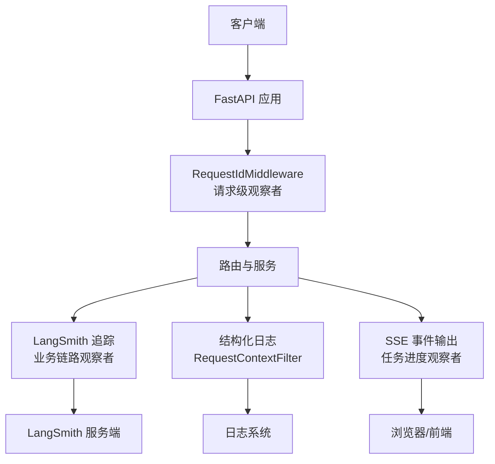
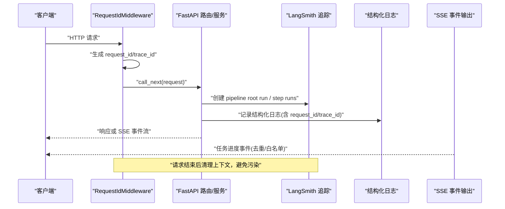
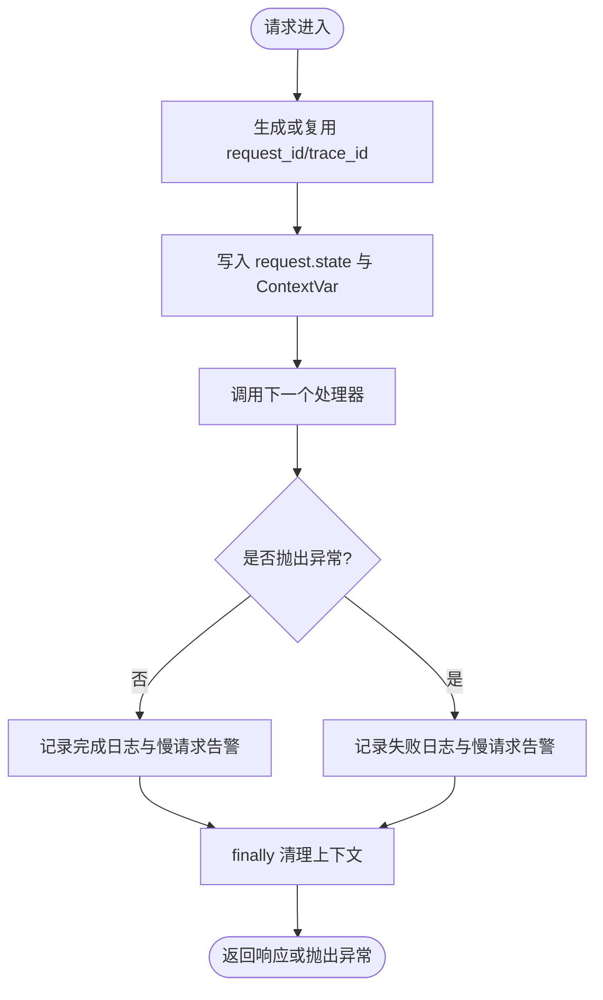
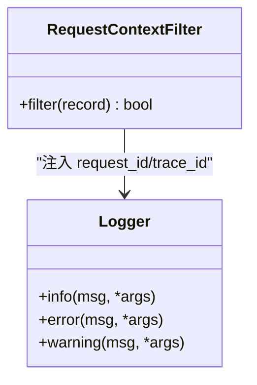
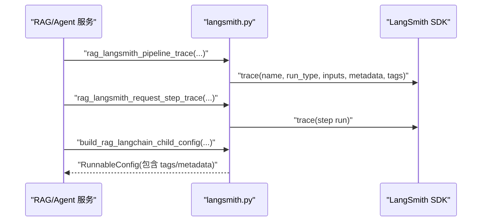
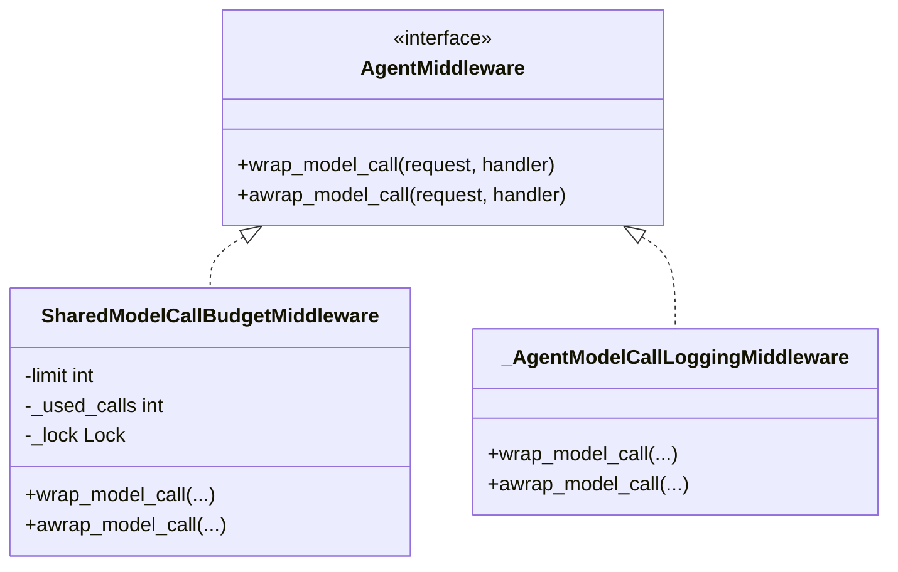
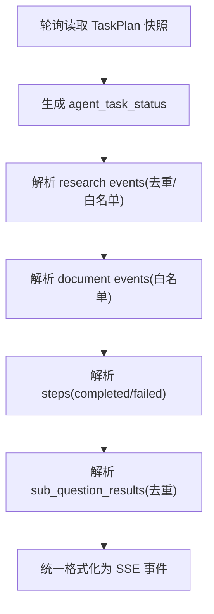
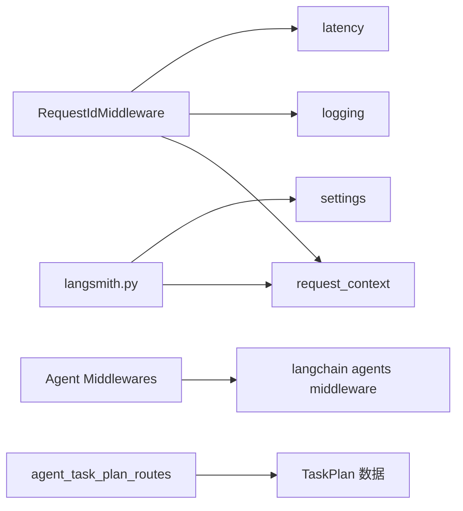

# 观察者模式

<cite>
**本文引用的文件**
- [src/fast_app/middlewares/request_id_middleware.py](file://src/fast_app/middlewares/request_id_middleware.py)
- [src/fast_app/middlewares/request_size_middleware.py](file://src/fast_app/middlewares/request_size_middleware.py)
- [src/fast_app/core/request_context.py](file://src/fast_app/core/request_context.py)
- [src/fast_app/core/logging.py](file://src/fast_app/core/logging.py)
- [src/fast_app/core/latency.py](file://src/fast_app/core/latency.py)
- [src/fast_app/core/langsmith.py](file://src/fast_app/core/langsmith.py)
- [src/fast_app/agents/runtime/langchain_agent_middlewares.py](file://src/fast_app/agents/runtime/langchain_agent_middlewares.py)
- [src/fast_app/api/agent_task_plan_routes.py](file://src/fast_app/api/agent_task_plan_routes.py)
- [learning-docs/phase-13/废弃-13-3-middleware经验迁移-能力增强放在哪一层.md](file://learning-docs/phase-13/废弃-13-3-middleware经验迁移-能力增强放在哪一层.md)
</cite>

## 目录
1. [简介](#简介)
2. [项目结构](#项目结构)
3. [核心组件](#核心组件)
4. [架构总览](#架构总览)
5. [详细组件分析](#详细组件分析)
6. [依赖关系分析](#依赖关系分析)
7. [性能考虑](#性能考虑)
8. [故障排查指南](#故障排查指南)
9. [结论](#结论)
10. [附录：扩展可观测性的实践](#附录：扩展可观测性的实践)

## 简介
本文件围绕“观察者模式”在该工程中的可观测性实现进行系统化说明。重点覆盖以下方面：
- LangSmith 追踪作为“业务链路事件”的发布者与订阅者机制
- 结构化日志与请求 ID 中间件如何以横切方式观察 HTTP 请求生命周期
- Agent 运行时中间件对模型调用、工具调用的观察与限流
- SSE 任务进度事件在 API 层的事件化输出，体现“状态快照到前端事件”的发布-订阅思想
- 如何在不同层级（HTTP、Agent、Pipeline、组件）插入横切关注点，解耦各组件通信

该工程并未使用传统意义上的全局事件总线，而是通过“中间件链 + 上下文变量 + 统一 trace 封装 + SSE 事件输出”的组合，实现了类似观察者模式的解耦与可观测性。

## 项目结构
从可观测性视角看，系统由四层组成：
- HTTP 层：请求进入时生成并传播 request_id/trace_id，记录耗时与慢请求，属于最外层的“请求级观察者”
- 应用上下文：通过 ContextVar 将请求上下文贯穿异步调用栈，使下游模块无需显式传递即可读取
- 业务链路层：LangSmith 追踪为 RAG/Agent/Pipeline 提供统一的“步骤级”与“根运行级”观察点
- 外部交互层：SSE 将后台任务状态变化转换为前端可消费的事件流

**图表来源**
- [src/fast_app/middlewares/request_id_middleware.py:19-97](file://src/fast_app/middlewares/request_id_middleware.py#L19-L97)
- [src/fast_app/core/request_context.py:1-38](file://src/fast_app/core/request_context.py#L1-L38)
- [src/fast_app/core/logging.py:8-76](file://src/fast_app/core/logging.py#L8-L76)
- [src/fast_app/core/langsmith.py:34-319](file://src/fast_app/core/langsmith.py#L34-L319)
- [src/fast_app/api/agent_task_plan_routes.py:436-629](file://src/fast_app/api/agent_task_plan_routes.py#L436-L629)

**章节来源**
- [src/fast_app/middlewares/request_id_middleware.py:19-97](file://src/fast_app/middlewares/request_id_middleware.py#L19-L97)
- [src/fast_app/core/request_context.py:1-38](file://src/fast_app/core/request_context.py#L1-L38)
- [src/fast_app/core/logging.py:8-76](file://src/fast_app/core/logging.py#L8-L76)
- [src/fast_app/core/langsmith.py:34-319](file://src/fast_app/core/langsmith.py#L34-L319)
- [src/fast_app/api/agent_task_plan_routes.py:436-629](file://src/fast_app/api/agent_task_plan_routes.py#L436-L629)

## 核心组件
- 请求 ID 与上下文传播：通过中间件生成 request_id/trace_id，写入请求对象和 ContextVar，供后续所有模块读取
- 结构化日志过滤器：自动把 request_id/trace_id 注入每条日志，便于跨服务关联
- LangSmith 追踪封装：提供配置开关、元数据构造、标签构造、根 run 与 step run 的统一入口，屏蔽底层 SDK 细节
- Agent 运行时中间件：对模型调用与工具调用进行预算控制、PII 脱敏、调用边界日志记录
- SSE 任务进度事件：将后台任务的状态快照转化为前端可消费的有序事件流，具备去重与白名单过滤

**章节来源**
- [src/fast_app/middlewares/request_id_middleware.py:19-97](file://src/fast_app/middlewares/request_id_middleware.py#L19-L97)
- [src/fast_app/core/logging.py:8-76](file://src/fast_app/core/logging.py#L8-L76)
- [src/fast_app/core/langsmith.py:34-319](file://src/fast_app/core/langsmith.py#L34-L319)
- [src/fast_app/agents/runtime/langchain_agent_middlewares.py:28-172](file://src/fast_app/agents/runtime/langchain_agent_middlewares.py#L28-L172)
- [src/fast_app/api/agent_task_plan_routes.py:436-629](file://src/fast_app/api/agent_task_plan_routes.py#L436-L629)

## 架构总览
下图展示一次 RAG 请求从进入 FastAPI 到输出 LangSmith 追踪与结构化日志的整体流程，体现“请求级观察者 → 业务链路观察者 → 外部事件观察者”的分层解耦。

**图表来源**
- [src/fast_app/middlewares/request_id_middleware.py:28-97](file://src/fast_app/middlewares/request_id_middleware.py#L28-L97)
- [src/fast_app/core/langsmith.py:221-319](file://src/fast_app/core/langsmith.py#L221-L319)
- [src/fast_app/core/logging.py:8-76](file://src/fast_app/core/logging.py#L8-L76)
- [src/fast_app/api/agent_task_plan_routes.py:436-629](file://src/fast_app/api/agent_task_plan_routes.py#L436-L629)

## 详细组件分析

### 请求 ID 中间件：HTTP 请求级观察者
- 职责：生成并传播 request_id/trace_id；记录 HTTP 总耗时；记录慢请求；异常路径记录错误类型；最终清理上下文
- 观察者模式体现：中间件作为“请求生命周期”的观察者，在不侵入路由逻辑的前提下，统一收集指标与日志
- 关键行为：
  - 从请求头获取或生成 request_id，并设置到 request.state 与 ContextVar
  - 使用计时器计算延迟，记录成功与失败两种路径
  - 通过阈值判断是否记录慢请求告警
  - finally 中清理上下文，防止并发请求互相污染

**图表来源**
- [src/fast_app/middlewares/request_id_middleware.py:28-97](file://src/fast_app/middlewares/request_id_middleware.py#L28-L97)
- [src/fast_app/core/latency.py:7-37](file://src/fast_app/core/latency.py#L7-L37)

**章节来源**
- [src/fast_app/middlewares/request_id_middleware.py:19-97](file://src/fast_app/middlewares/request_id_middleware.py#L19-L97)
- [src/fast_app/core/latency.py:7-37](file://src/fast_app/core/latency.py#L7-L37)

### 结构化日志与请求上下文：日志级观察者
- 职责：为日志附加 request_id/trace_id；格式化字段；在应用启动时注册过滤器
- 观察者模式体现：日志框架作为“日志事件”的观察者，自动从上下文提取追踪信息，无需业务代码手动拼接
- 关键点：
  - RequestContextFilter 从 ContextVar 读取 request_id/trace_id 并注入日志记录
  - setup_logging 在根 logger 与各 handler 上添加过滤器，保证全局生效
  - format_log_fields 统一序列化复杂类型，避免日志格式破坏

**图表来源**
- [src/fast_app/core/logging.py:8-76](file://src/fast_app/core/logging.py#L8-L76)

**章节来源**
- [src/fast_app/core/logging.py:8-76](file://src/fast_app/core/logging.py#L8-L76)
- [src/fast_app/core/request_context.py:1-38](file://src/fast_app/core/request_context.py#L1-L38)

### LangSmith 追踪：业务链路观察者
- 职责：根据配置启用/禁用追踪；构造统一的 metadata/tags；创建 pipeline root run 与 step run；为 LangChain 子调用提供 RunnableConfig
- 观察者模式体现：业务代码只需调用统一封装函数，即可将任意步骤纳入 LangSmith 追踪树，形成“步骤级观察者”
- 关键点：
  - is_langsmith_enabled 同时检查开关与凭证，避免无效网络访问
  - build_rag_langsmith_inputs/metadata/tags 标准化输入与环境信息
  - rag_langsmith_pipeline_trace 创建根运行，rag_langsmith_request_step_trace/state_step_trace 创建步骤运行
  - build_rag_langchain_child_config/pipeline_child_config 将当前追踪上下文传递给子调用

**图表来源**
- [src/fast_app/core/langsmith.py:34-319](file://src/fast_app/core/langsmith.py#L34-L319)
- [src/fast_app/core/langsmith.py:497-574](file://src/fast_app/core/langsmith.py#L497-L574)

**章节来源**
- [src/fast_app/core/langsmith.py:34-319](file://src/fast_app/core/langsmith.py#L34-L319)
- [src/fast_app/core/langsmith.py:497-574](file://src/fast_app/core/langsmith.py#L497-L574)

### Agent 运行时中间件：模型与工具调用观察者
- 职责：限制模型调用次数、限制工具调用次数、PII 脱敏、记录模型调用边界日志、共享预算控制
- 观察者模式体现：通过 AgentMiddleware 在模型调用前后插入横切逻辑，实现对 Agent 执行过程的细粒度观察与控制
- 关键点：
  - SharedModelCallBudgetMiddleware 使用进程内计数器与锁，协调多 Agent 共享预算
  - ModelCallLimitMiddleware/ToolCallLimitMiddleware 提供默认限流策略
  - _AgentModelCallLoggingMiddleware 记录模型调用开始与结束，便于审计与排障

**图表来源**
- [src/fast_app/agents/runtime/langchain_agent_middlewares.py:28-172](file://src/fast_app/agents/runtime/langchain_agent_middlewares.py#L28-L172)

**章节来源**
- [src/fast_app/agents/runtime/langchain_agent_middlewares.py:28-172](file://src/fast_app/agents/runtime/langchain_agent_middlewares.py#L28-L172)

### SSE 任务进度事件：状态快照到前端事件的观察者
- 职责：将 TaskPlan 快照中的状态与新增事件转换为 SSE 事件；对重复事件进行去重；仅暴露允许的前端事件
- 观察者模式体现：API 层作为“任务状态”的观察者，轮询读取最新快照，并将增量变化以事件形式推送给前端
- 关键点：
  - _task_plan_progress_events 负责状态事件、研究事件、文档事件、步骤事件转换
  - seen_sub_questions/seen_steps/seen_research_events 用于去重
  - allowed_document_events 白名单控制前端可见事件集
  - _format_sse_event 统一事件格式

**图表来源**
- [src/fast_app/api/agent_task_plan_routes.py:436-629](file://src/fast_app/api/agent_task_plan_routes.py#L436-L629)

**章节来源**
- [src/fast_app/api/agent_task_plan_routes.py:436-629](file://src/fast_app/api/agent_task_plan_routes.py#L436-L629)

### 请求大小限制中间件：安全型观察者
- 职责：在进入路由前基于 Content-Length 快速拦截超大请求体，避免后续解析开销
- 观察者模式体现：作为 HTTP 边界的“安全观察者”，在不读取 body 的情况下做出早期决策
- 关键点：
  - 区分普通请求与上传请求的路径，采用不同上限
  - 记录用户错误类别与错误码，便于前端提示与后端审计

**章节来源**
- [src/fast_app/middlewares/request_size_middleware.py:20-85](file://src/fast_app/middlewares/request_size_middleware.py#L20-L85)

## 依赖关系分析
- RequestIdMiddleware 依赖：
  - 上下文：request_context.set_request_context/reset_request_context/get_request_id/get_trace_id
  - 日志：logging.format_log_fields/get_logger
  - 延迟：latency.start_timer/elapsed_ms/log_slow_operation
- 结构化日志依赖：
  - request_context 提供的 ContextVar
  - logging.setup_logging 注册 RequestContextFilter
- LangSmith 追踪依赖：
  - settings 配置项（tracing、api_key、project、endpoint）
  - request_context 提供的 request_id/trace_id
  - schemas.rag_chat_schema 的请求模型
- Agent 中间件依赖：
  - langchain.agents.middleware 提供的基类与官方中间件
  - settings 提供的默认限流参数
- SSE 事件依赖：
  - TaskPlan 数据结构（ResearchTaskPlan/DocumentTaskPlan）
  - JSON 编码与事件格式化

**图表来源**
- [src/fast_app/middlewares/request_id_middleware.py:1-16](file://src/fast_app/middlewares/request_id_middleware.py#L1-L16)
- [src/fast_app/core/request_context.py:1-38](file://src/fast_app/core/request_context.py#L1-L38)
- [src/fast_app/core/logging.py:1-76](file://src/fast_app/core/logging.py#L1-L76)
- [src/fast_app/core/latency.py:1-37](file://src/fast_app/core/latency.py#L1-L37)
- [src/fast_app/core/langsmith.py:1-319](file://src/fast_app/core/langsmith.py#L1-L319)
- [src/fast_app/agents/runtime/langchain_agent_middlewares.py:1-172](file://src/fast_app/agents/runtime/langchain_agent_middlewares.py#L1-L172)
- [src/fast_app/api/agent_task_plan_routes.py:436-629](file://src/fast_app/api/agent_task_plan_routes.py#L436-L629)

**章节来源**
- [src/fast_app/middlewares/request_id_middleware.py:1-16](file://src/fast_app/middlewares/request_id_middleware.py#L1-L16)
- [src/fast_app/core/request_context.py:1-38](file://src/fast_app/core/request_context.py#L1-L38)
- [src/fast_app/core/logging.py:1-76](file://src/fast_app/core/logging.py#L1-L76)
- [src/fast_app/core/latency.py:1-37](file://src/fast_app/core/latency.py#L1-L37)
- [src/fast_app/core/langsmith.py:1-319](file://src/fast_app/core/langsmith.py#L1-L319)
- [src/fast_app/agents/runtime/langchain_agent_middlewares.py:1-172](file://src/fast_app/agents/runtime/langchain_agent_middlewares.py#L1-L172)
- [src/fast_app/api/agent_task_plan_routes.py:436-629](file://src/fast_app/api/agent_task_plan_routes.py#L436-L629)

## 性能考虑
- 中间件应轻量：RequestIdMiddleware 仅做 ID 生成、上下文设置、计时与日志，不阻塞业务
- 慢请求告警：通过阈值判断记录 slow_operation，避免高频日志影响性能
- LangSmith 追踪开关：is_langsmith_enabled 在未启用时直接返回 nullcontext，减少不必要开销
- SSE 去重：使用 seen_* 集合避免重复推送，降低带宽与前端处理压力
- 日志过滤：RequestContextFilter 仅在必要时注入字段，避免额外序列化成本

[本节为通用指导，不直接分析具体文件]

## 故障排查指南
- 无法关联日志与追踪：
  - 确认 RequestIdMiddleware 已正确设置 request_id/trace_id 并清理上下文
  - 确认 logging.setup_logging 已注册 RequestContextFilter
- LangSmith 无数据：
  - 检查 is_langsmith_enabled 条件（tracing 开关与 API Key）
  - 确认构建的 metadata/tags 包含必要字段
- SSE 事件重复或缺失：
  - 检查 seen_sub_questions/seen_steps/seen_research_events 去重逻辑
  - 确认 allowed_document_events 白名单是否包含目标事件
- 模型调用超限：
  - 检查 Agent 中间件的 limit 配置与 SharedModelCallBudgetMiddleware 的计数逻辑

**章节来源**
- [src/fast_app/middlewares/request_id_middleware.py:28-97](file://src/fast_app/middlewares/request_id_middleware.py#L28-L97)
- [src/fast_app/core/logging.py:8-76](file://src/fast_app/core/logging.py#L8-L76)
- [src/fast_app/core/langsmith.py:34-319](file://src/fast_app/core/langsmith.py#L34-L319)
- [src/fast_app/api/agent_task_plan_routes.py:436-629](file://src/fast_app/api/agent_task_plan_routes.py#L436-L629)
- [src/fast_app/agents/runtime/langchain_agent_middlewares.py:28-172](file://src/fast_app/agents/runtime/langchain_agent_middlewares.py#L28-L172)

## 结论
该工程通过分层中间件与统一追踪封装，实现了类似观察者模式的解耦可观测性：
- HTTP 层中间件观察请求生命周期
- 日志过滤器观察上下文变化
- LangSmith 追踪观察业务步骤
- Agent 中间件观察模型与工具调用
- SSE 事件观察任务状态变化

这种设计避免了在业务代码中硬耦合横切关注点，提升了可维护性与可扩展性。

[本节为总结，不直接分析具体文件]

## 附录：扩展可观测性的实践
- 自定义指标收集：
  - 在中间件中增加自定义字段（如业务维度标签），并通过 format_log_fields 输出
  - 在 LangSmith step run 中追加自定义 metadata，便于 UI 筛选
- 告警触发：
  - 基于 latency.log_slow_operation 的阈值机制，扩展更多慢操作场景
  - 在 Agent 中间件中增加异常计数与阈值告警
- 自定义观察者（示例思路）：
  - 新增一个 AgentMiddleware，记录特定工具的调用频率与错误率
  - 在 SSE 事件中添加新的业务事件类型，并在白名单中声明
  - 在 LangSmith 中为新增步骤创建 step run，并附带 request_id/trace_id

[本节为通用指导，不直接分析具体文件]