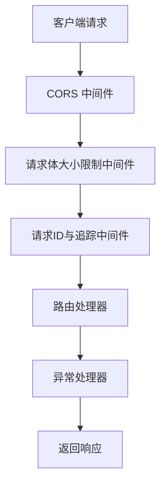
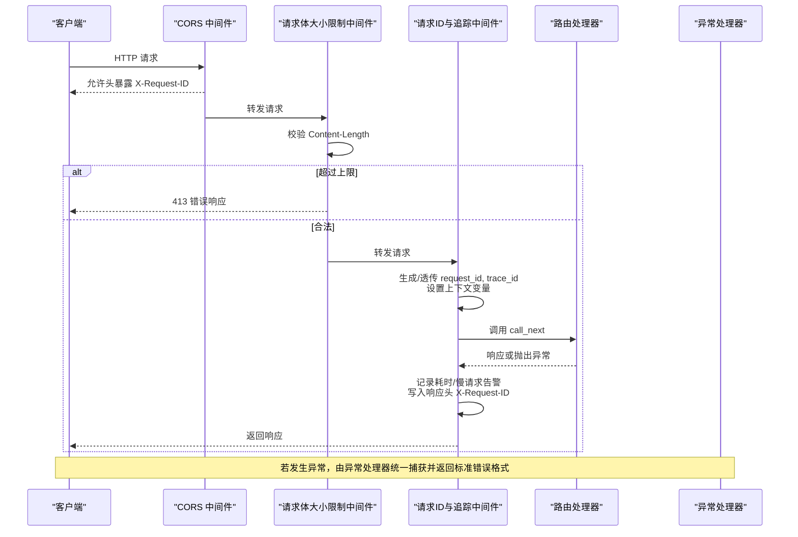
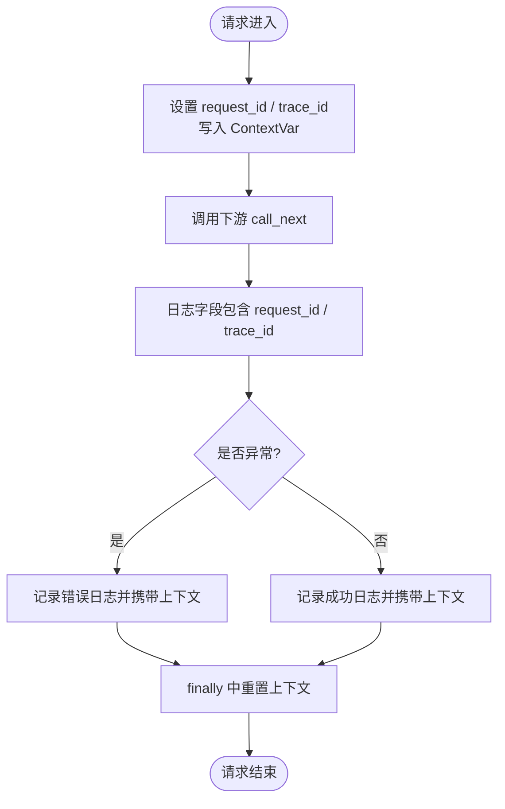
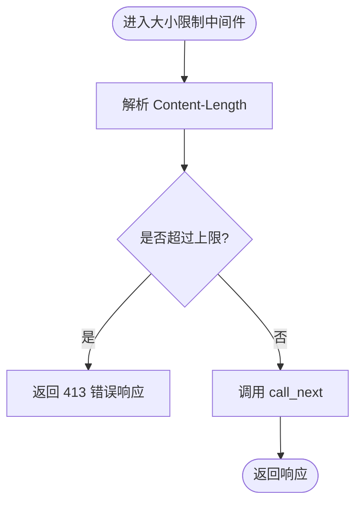
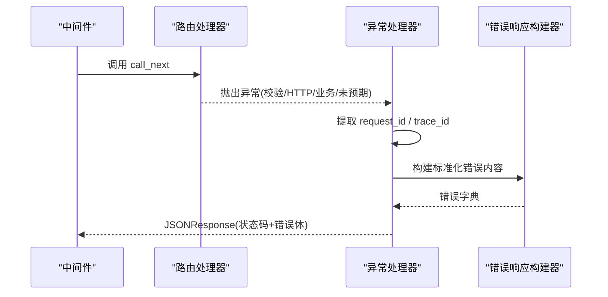
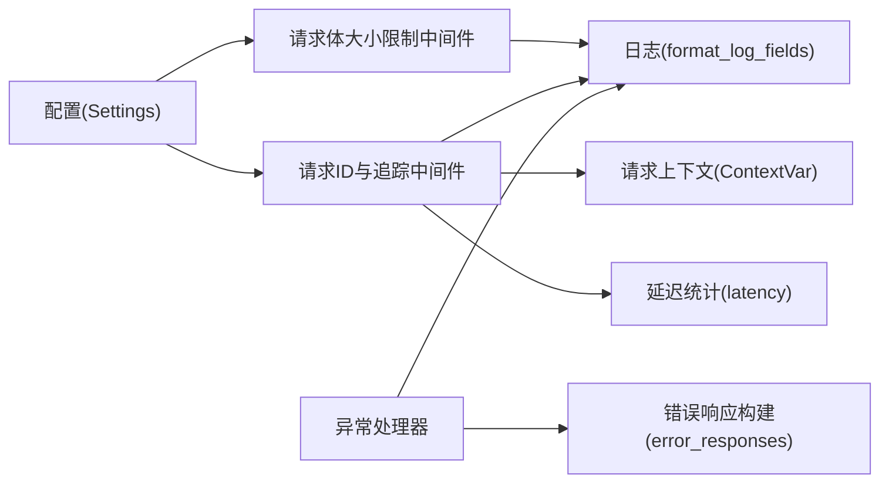
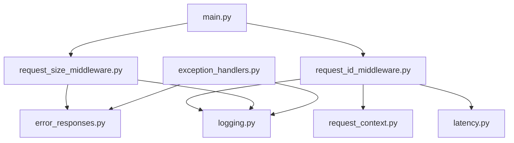

# 中间件通信

<cite>
**本文引用的文件**
- [src/fast_app/main.py](file://src/fast_app/main.py)
- [src/fast_app/middlewares/request_id_middleware.py](file://src/fast_app/middlewares/request_id_middleware.py)
- [src/fast_app/middlewares/request_size_middleware.py](file://src/fast_app/middlewares/request_size_middleware.py)
- [src/fast_app/core/request_context.py](file://src/fast_app/core/request_context.py)
- [src/fast_app/core/logging.py](file://src/fast_app/core/logging.py)
- [src/fast_app/core/latency.py](file://src/fast_app/core/latency.py)
- [src/fast_app/core/config.py](file://src/fast_app/core/config.py)
- [src/fast_app/core/exception_handlers.py](file://src/fast_app/core/exception_handlers.py)
- [src/fast_app/core/error_responses.py](file://src/fast_app/core/error_responses.py)
</cite>

## 目录
1. [简介](#简介)
2. [项目结构](#项目结构)
3. [核心组件](#核心组件)
4. [架构总览](#架构总览)
5. [详细组件分析](#详细组件分析)
6. [依赖关系分析](#依赖关系分析)
7. [性能考量](#性能考量)
8. [故障排查指南](#故障排查指南)
9. [结论](#结论)
10. [附录：自定义中间件示例](#附录自定义中间件示例)

## 简介
本文件聚焦于 FastAPI 应用的中间件通信机制，围绕请求拦截、响应修改、异常处理、上下文传递、链路追踪与日志关联进行系统化说明。文档基于仓库中的实际代码实现，给出执行顺序、数据流、错误处理链以及扩展方式，帮助读者理解并安全地扩展请求处理管道。

## 项目结构
FastAPI 应用通过 lifespan 启动时完成日志与外部资源初始化，并在应用实例上按顺序注册中间件与路由。中间件层位于请求进入路由之前，负责跨切面能力（如请求体大小限制、请求 ID 注入、慢请求告警等）。异常处理器在请求生命周期结束时统一捕获并格式化错误响应。



图表来源
- [src/fast_app/main.py:132-156](file://src/fast_app/main.py#L132-L156)
- [src/fast_app/middlewares/request_size_middleware.py:20-85](file://src/fast_app/middlewares/request_size_middleware.py#L20-L85)
- [src/fast_app/middlewares/request_id_middleware.py:19-97](file://src/fast_app/middlewares/request_id_middleware.py#L19-L97)
- [src/fast_app/core/exception_handlers.py:26-153](file://src/fast_app/core/exception_handlers.py#L26-L153)

章节来源
- [src/fast_app/main.py:132-170](file://src/fast_app/main.py#L132-L170)

## 核心组件
- 请求上下文：使用 contextvars 维护 request_id 与 trace_id，贯穿整个异步调用栈，便于日志与链路追踪。
- 请求ID与追踪中间件：生成或透传 X-Request-ID，设置上下文，记录耗时与慢请求告警，清理上下文。
- 请求体大小限制中间件：基于 Content-Length 快速拒绝超大请求，避免后续解析开销。
- 日志系统：通过过滤器将 request_id 与 trace_id 注入到所有日志输出中。
- 异常处理器：统一捕获验证错误、HTTP 异常、业务异常与未预期异常，构造标准化错误响应。
- 配置管理：通过 Settings 集中管理阈值、开关与外部服务参数，供中间件与异常处理器读取。

章节来源
- [src/fast_app/core/request_context.py:1-39](file://src/fast_app/core/request_context.py#L1-L39)
- [src/fast_app/middlewares/request_id_middleware.py:1-97](file://src/fast_app/middlewares/request_id_middleware.py#L1-L97)
- [src/fast_app/middlewares/request_size_middleware.py:1-110](file://src/fast_app/middlewares/request_size_middleware.py#L1-L110)
- [src/fast_app/core/logging.py:1-77](file://src/fast_app/core/logging.py#L1-L77)
- [src/fast_app/core/exception_handlers.py:1-153](file://src/fast_app/core/exception_handlers.py#L1-L153)
- [src/fast_app/core/config.py:18-176](file://src/fast_app/core/config.py#L18-L176)

## 架构总览
下图展示了请求从进入应用到返回响应的完整路径，包括中间件顺序、上下文注入、日志关联与异常处理。



图表来源
- [src/fast_app/main.py:132-156](file://src/fast_app/main.py#L132-L156)
- [src/fast_app/middlewares/request_size_middleware.py:20-85](file://src/fast_app/middlewares/request_size_middleware.py#L20-L85)
- [src/fast_app/middlewares/request_id_middleware.py:19-97](file://src/fast_app/middlewares/request_id_middleware.py#L19-L97)
- [src/fast_app/core/exception_handlers.py:26-153](file://src/fast_app/core/exception_handlers.py#L26-L153)

## 详细组件分析

### 请求上下文与链路追踪
- 使用 ContextVar 保存 request_id 与 trace_id，提供 set/reset 接口，确保异步并发下的隔离性。
- 中间件在请求开始时设置上下文，在 finally 中清理，避免上下文泄漏。
- 日志过滤器自动附加 request_id 与 trace_id，使全链路日志可关联。



图表来源
- [src/fast_app/core/request_context.py:1-39](file://src/fast_app/core/request_context.py#L1-L39)
- [src/fast_app/middlewares/request_id_middleware.py:28-97](file://src/fast_app/middlewares/request_id_middleware.py#L28-L97)
- [src/fast_app/core/logging.py:8-26](file://src/fast_app/core/logging.py#L8-L26)

章节来源
- [src/fast_app/core/request_context.py:1-39](file://src/fast_app/core/request_context.py#L1-L39)
- [src/fast_app/core/logging.py:1-77](file://src/fast_app/core/logging.py#L1-L77)

### 请求拦截与响应修改
- 请求体大小限制中间件仅读取 Content-Length，不消费 body，避免破坏后续流式读取；对特定上传路由放宽上限。
- 请求ID中间件在响应阶段写入 X-Request-ID 头，便于客户端与网关侧关联。



图表来源
- [src/fast_app/middlewares/request_size_middleware.py:20-85](file://src/fast_app/middlewares/request_size_middleware.py#L20-L85)

章节来源
- [src/fast_app/middlewares/request_size_middleware.py:1-110](file://src/fast_app/middlewares/request_size_middleware.py#L1-L110)
- [src/fast_app/middlewares/request_id_middleware.py:28-67](file://src/fast_app/middlewares/request_id_middleware.py#L28-L67)

### 异常处理链
- 统一注册异常处理器，覆盖参数校验、HTTP 异常、业务异常与未预期异常。
- 所有异常路径均记录结构化日志，并返回包含 request_id 与 trace_id 的标准化错误体。



图表来源
- [src/fast_app/core/exception_handlers.py:26-153](file://src/fast_app/core/exception_handlers.py#L26-L153)
- [src/fast_app/core/error_responses.py:7-64](file://src/fast_app/core/error_responses.py#L7-L64)

章节来源
- [src/fast_app/core/exception_handlers.py:1-153](file://src/fast_app/core/exception_handlers.py#L1-L153)
- [src/fast_app/core/error_responses.py:1-64](file://src/fast_app/core/error_responses.py#L1-L64)

### 中间件间的依赖关系与配置管理
- 中间件顺序：CORS → 请求体大小限制 → 请求ID与追踪 → 路由。该顺序保证先做边界保护，再注入上下文与追踪。
- 配置来源：Settings 提供阈值与开关，例如慢请求阈值、最大请求体字节数、上传路由放宽策略等。
- 依赖关系：
  - 请求ID中间件依赖上下文模块与延迟统计工具。
  - 大小限制中间件依赖错误响应构建与日志格式化。
  - 异常处理器依赖错误响应构建与上下文获取。



图表来源
- [src/fast_app/core/config.py:18-176](file://src/fast_app/core/config.py#L18-L176)
- [src/fast_app/middlewares/request_size_middleware.py:20-85](file://src/fast_app/middlewares/request_size_middleware.py#L20-L85)
- [src/fast_app/middlewares/request_id_middleware.py:19-97](file://src/fast_app/middlewares/request_id_middleware.py#L19-L97)
- [src/fast_app/core/exception_handlers.py:26-153](file://src/fast_app/core/exception_handlers.py#L26-L153)

章节来源
- [src/fast_app/core/config.py:18-176](file://src/fast_app/core/config.py#L18-L176)
- [src/fast_app/main.py:132-156](file://src/fast_app/main.py#L132-L156)

## 依赖关系分析
- 直接依赖：
  - main.py 引入中间件与路由，并按序注册。
  - 中间件依赖 core 层的上下文、日志、延迟统计与错误响应。
  - 异常处理器依赖错误响应构建与日志格式化。
- 间接依赖：
  - 日志过滤器依赖上下文获取函数。
  - 配置通过 Settings 被多处读取，形成松耦合的配置中心。



图表来源
- [src/fast_app/main.py:132-156](file://src/fast_app/main.py#L132-L156)
- [src/fast_app/middlewares/request_size_middleware.py:1-110](file://src/fast_app/middlewares/request_size_middleware.py#L1-L110)
- [src/fast_app/middlewares/request_id_middleware.py:1-97](file://src/fast_app/middlewares/request_id_middleware.py#L1-L97)
- [src/fast_app/core/request_context.py:1-39](file://src/fast_app/core/request_context.py#L1-L39)
- [src/fast_app/core/latency.py:1-38](file://src/fast_app/core/latency.py#L1-L38)
- [src/fast_app/core/logging.py:1-77](file://src/fast_app/core/logging.py#L1-L77)
- [src/fast_app/core/exception_handlers.py:1-153](file://src/fast_app/core/exception_handlers.py#L1-L153)
- [src/fast_app/core/error_responses.py:1-64](file://src/fast_app/core/error_responses.py#L1-L64)

章节来源
- [src/fast_app/main.py:132-170](file://src/fast_app/main.py#L132-L170)

## 性能考量
- 低侵入拦截：大小限制中间件仅读取 Content-Length，避免读取 body 带来的额外开销。
- 慢请求告警：基于 perf_counter 计算耗时，超过阈值时记录慢操作日志，便于定位瓶颈。
- 上下文隔离：ContextVar 保证高并发下上下文不串扰，减少锁竞争。
- 配置化阈值：通过 Settings 调整慢请求阈值与请求体上限，平衡安全性与吞吐。

[本节为通用性能建议，无需具体文件引用]

## 故障排查指南
- 413 请求体过大：检查客户端发送的 Content-Length 与服务器配置的 max_request_body_bytes / max_upload_request_body_bytes。
- 缺少 X-Request-ID：确认 CORS 已暴露该响应头，且请求ID中间件已正确写入。
- 日志无上下文：确认日志系统在启动时已添加 RequestContextFilter，且中间件在 finally 中重置了上下文。
- 异常未捕获：检查异常类型是否被对应处理器覆盖，确认异常处理器注册顺序与路由加载顺序。

章节来源
- [src/fast_app/middlewares/request_size_middleware.py:61-82](file://src/fast_app/middlewares/request_size_middleware.py#L61-L82)
- [src/fast_app/middlewares/request_id_middleware.py:28-67](file://src/fast_app/middlewares/request_id_middleware.py#L28-L67)
- [src/fast_app/core/logging.py:8-26](file://src/fast_app/core/logging.py#L8-L26)
- [src/fast_app/core/exception_handlers.py:26-153](file://src/fast_app/core/exception_handlers.py#L26-L153)

## 结论
本项目通过清晰的中间件顺序与统一的上下文、日志与异常处理机制，实现了安全的请求拦截、可靠的链路追踪与一致的错误响应。配置集中化管理使得行为可调可控，便于在不同环境部署与调优。扩展新中间件时，应遵循现有模式：优先低侵入、明确依赖、完善日志与异常处理，并确保上下文在 finally 中清理。

[本节为总结性内容，无需具体文件引用]

## 附录：自定义中间件示例
以下示例展示如何扩展现有请求处理管道，实现一个通用的“请求审计”中间件。该中间件会在请求进入时记录审计信息，在响应返回后追加审计结果，并在异常时记录失败原因。

```python
from starlette.middleware.base import BaseHTTPMiddleware
from starlette.requests import Request
from starlette.responses import Response

from fast_app.core.logging import get_logger, format_log_fields
from fast_app.core.request_context import get_request_id, get_trace_id

logger = get_logger(__name__)

class AuditMiddleware(BaseHTTPMiddleware):
    def __init__(self, app, audit_enabled: bool = True):
        super().__init__(app)
        self.audit_enabled = audit_enabled

    async def dispatch(self, request: Request, call_next) -> Response:
        if not self.audit_enabled:
            return await call_next(request)

        request_id = get_request_id() or "-"
        trace_id = get_trace_id() or "-"

        logger.info(
            "audit %s",
            format_log_fields(
                event="http.request.audit.start",
                method=request.method,
                path=request.url.path,
                request_id=request_id,
                trace_id=trace_id,
            ),
        )

        try:
            response = await call_next(request)
            logger.info(
                "audit %s",
                format_log_fields(
                    event="http.request.audit.finish",
                    method=request.method,
                    path=request.url.path,
                    status_code=response.status_code,
                    request_id=request_id,
                    trace_id=trace_id,
                ),
            )
            return response
        except Exception as exc:
            logger.error(
                "audit %s",
                format_log_fields(
                    event="http.request.audit.failed",
                    method=request.method,
                    path=request.url.path,
                    error_type=type(exc).__name__,
                    request_id=request_id,
                    trace_id=trace_id,
                ),
            )
            raise
```

- 注册位置：在 main.py 中按所需顺序插入，例如放在请求ID中间件之后、路由之前。
- 配置开关：通过 Settings 控制 audit_enabled，便于灰度开启。
- 注意事项：不要阻塞 I/O；尽量轻量；确保异常时继续抛出，交由异常处理器统一处理。

[本节为概念性示例，不直接映射到仓库具体文件]