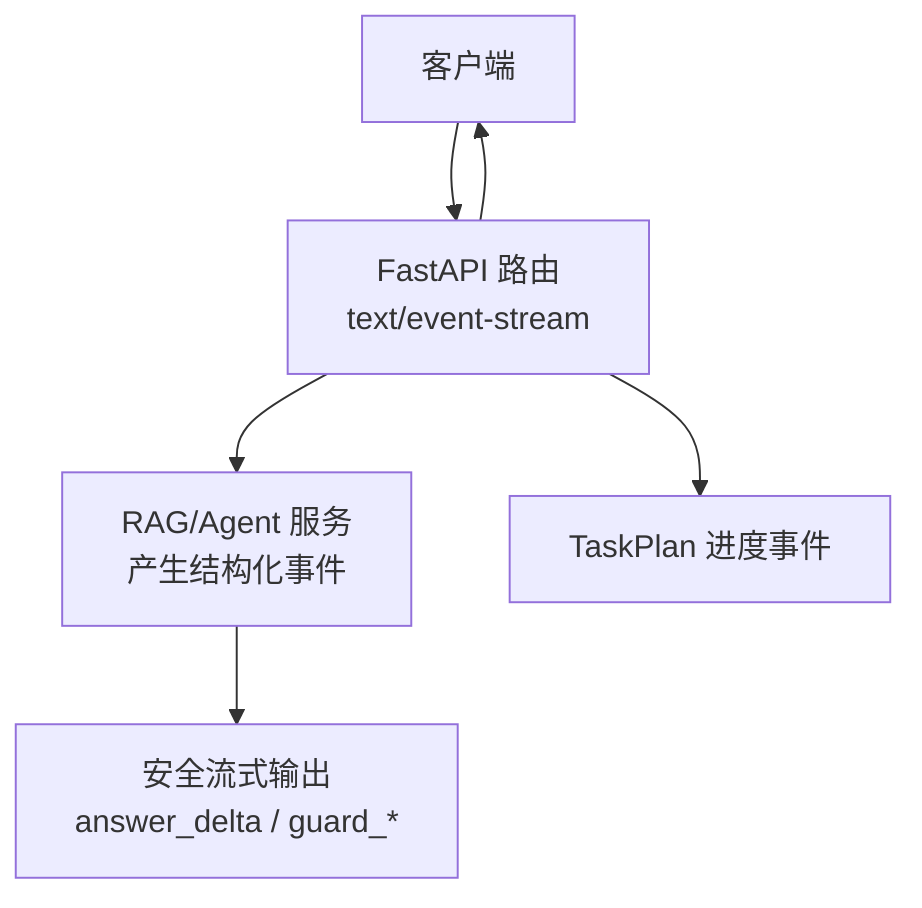
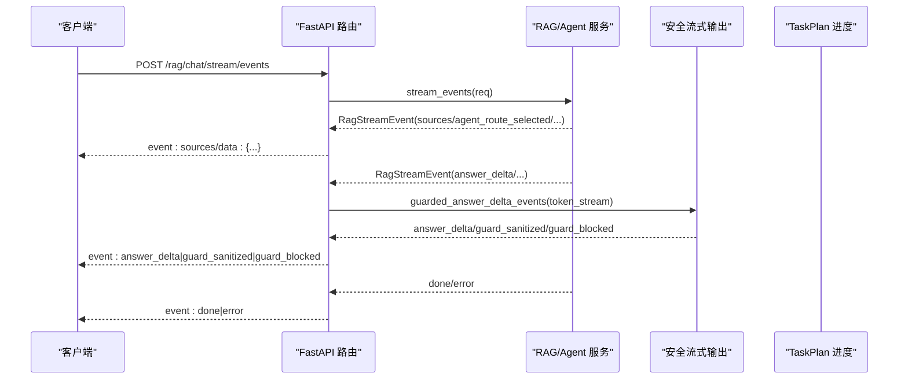
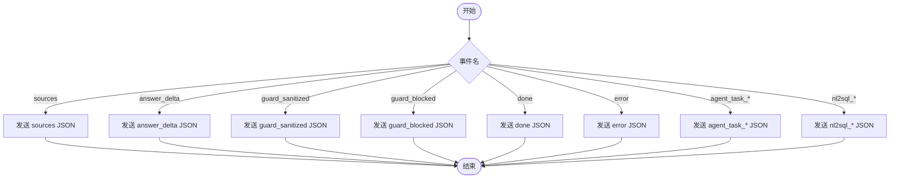
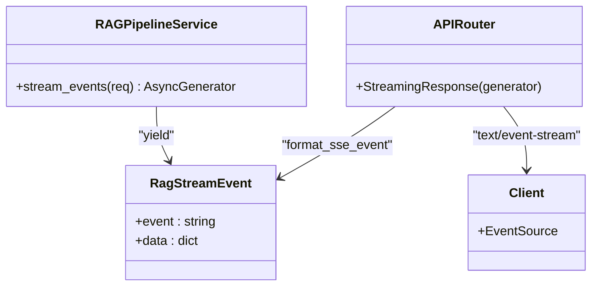
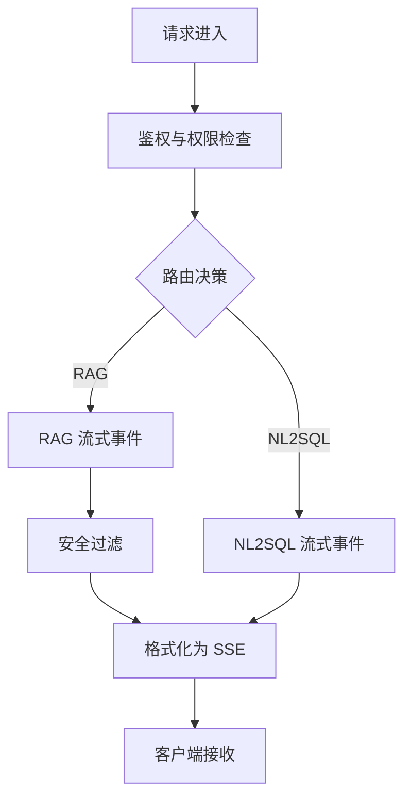
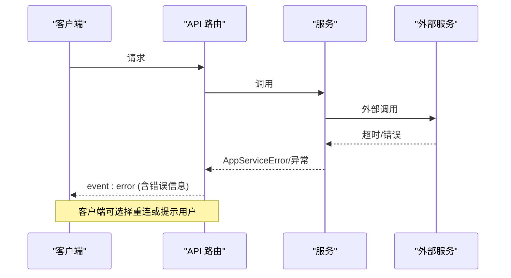
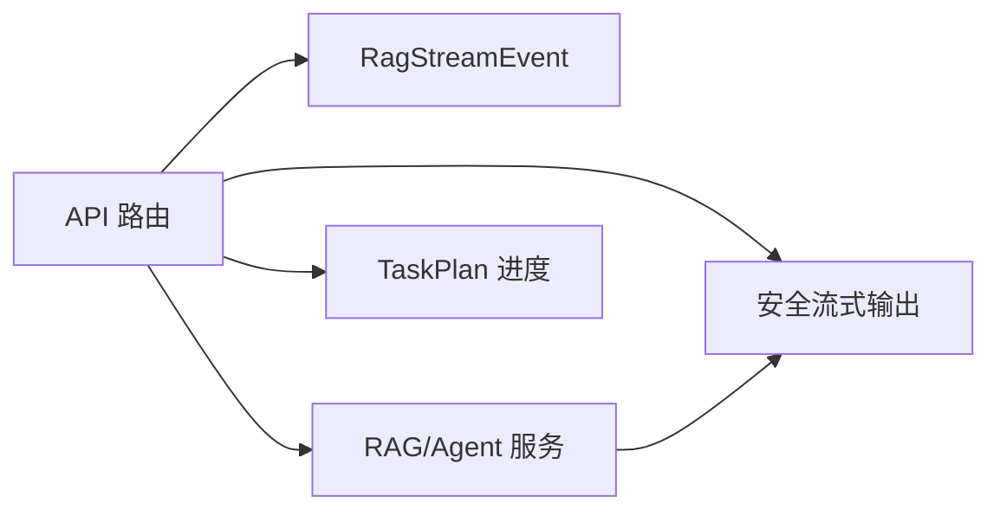
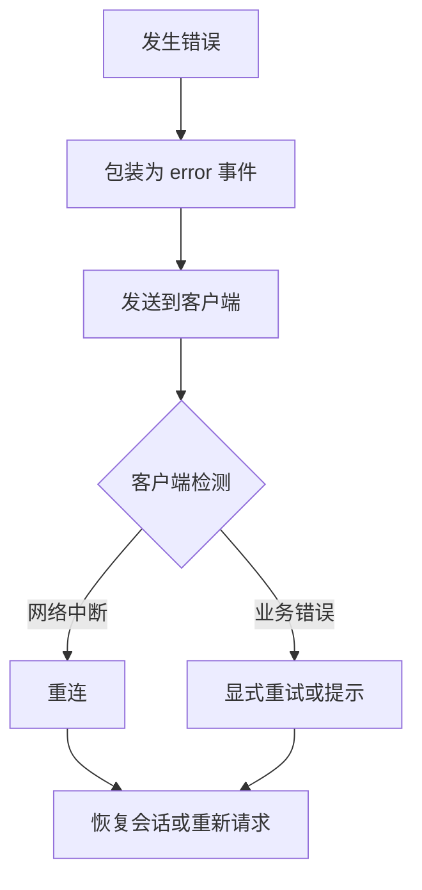
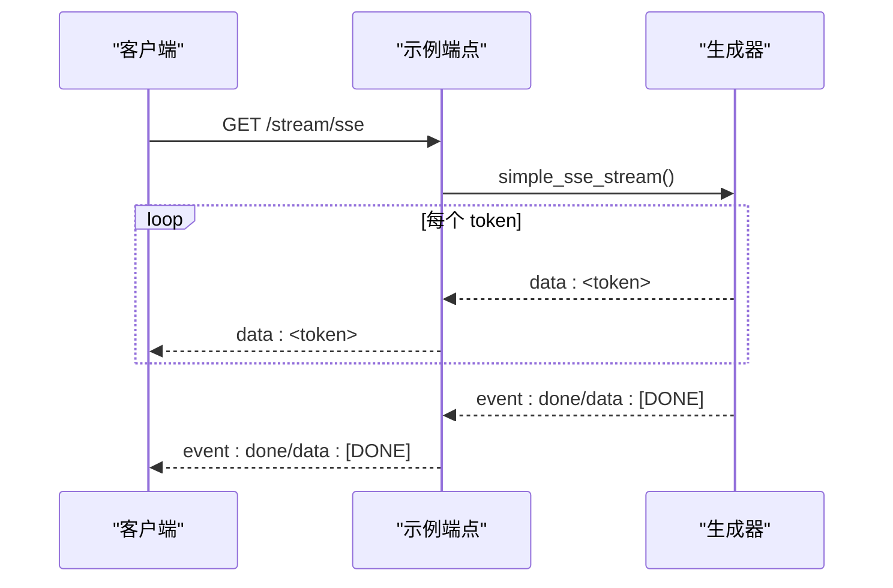

# 事件驱动通信

<cite>
**本文引用的文件**
- [stream_routes.py](file://src/fast_app/api/stream_routes.py)
- [rag_stream_models.py](file://src/fast_app/domain/rag_stream_models.py)
- [guarded_streaming.py](file://src/fast_app/services/rag/guarded_streaming.py)
- [rag_chat_routes.py](file://src/fast_app/api/rag_chat_routes.py)
- [agent_task_plan_routes.py](file://src/fast_app/api/agent_task_plan_routes.py)
- [rag_agent_pipeline_service.py](file://src/fast_app/services/rag/rag_agent_pipeline_service.py)
- [9-8-超时重试降级与fallback.md](file://learning-docs/phase-9/9-8-超时重试降级与fallback.md)
- [20-3-接口文档整理.md](file://learning-docs/phase-20/20-3-接口文档整理.md)
- [test_rag_chat_api.py](file://scripts/tests/rag_memory/test_rag_chat_api.py)
</cite>

## 目录
1. [简介](#简介)
2. [项目结构](#项目结构)
3. [核心组件](#核心组件)
4. [架构总览](#架构总览)
5. [详细组件分析](#详细组件分析)
6. [依赖关系分析](#依赖关系分析)
7. [性能与背压](#性能与背压)
8. [故障处理与重连策略](#故障处理与重连策略)
9. [实现示例与最佳实践](#实现示例与最佳实践)
10. [结论](#结论)

## 简介
本文件围绕基于 SSE（Server-Sent Events）的事件驱动通信进行系统化说明，覆盖事件类型定义、消息格式、连接管理、发布订阅模式、事件过滤与路由、背压处理、错误恢复与重连策略，并提供架构图、序列图与故障转移流程。该方案在项目中以 FastAPI 的 StreamingResponse 为基础，将业务层产生的结构化事件转换为标准 SSE 文本流推送给客户端。

## 项目结构
SSE 相关能力分布在以下位置：
- API 层：负责接收请求、调用服务、生成 SSE 响应
- 领域模型：定义结构化事件名称和事件载体
- 安全流式输出：对 LLM token 流进行安全检查并产出安全事件
- 任务计划与进度：通过 SSE 推送后台任务执行状态
- 测试与文档：验证协议与约定

**图表来源**
- [rag_chat_routes.py:277-311](file://src/fast_app/api/rag_chat_routes.py#L277-L311)
- [guarded_streaming.py:36-133](file://src/fast_app/services/rag/guarded_streaming.py#L36-L133)
- [agent_task_plan_routes.py:268-353](file://src/fast_app/api/agent_task_plan_routes.py#L268-L353)

**章节来源**
- [stream_routes.py:11-38](file://src/fast_app/api/stream_routes.py#L11-L38)
- [rag_stream_models.py:5-46](file://src/fast_app/domain/rag_stream_models.py#L5-L46)
- [rag_chat_routes.py:208-311](file://src/fast_app/api/rag_chat_routes.py#L208-L311)

## 核心组件
- 结构化事件模型：统一事件名与数据载荷，便于 API 层包装为 SSE
- 安全流式输出：对 token 流进行句子级缓冲与安全检测，产出 answer_delta、guard_sanitized、guard_blocked
- API 路由：提供多种 SSE 端点，包括简单文本流、SSE 演示、结构化 RAG 流、NL2SQL 流、TaskPlan 进度流
- 错误与完成事件：统一 error 与 done 事件，保证前端可识别结束与异常

**章节来源**
- [rag_stream_models.py:5-46](file://src/fast_app/domain/rag_stream_models.py#L5-L46)
- [guarded_streaming.py:36-133](file://src/fast_app/services/rag/guarded_streaming.py#L36-L133)
- [rag_chat_routes.py:208-311](file://src/fast_app/api/rag_chat_routes.py#L208-L311)
- [agent_task_plan_routes.py:436-446](file://src/fast_app/api/agent_task_plan_routes.py#L436-L446)

## 架构总览
SSE 事件从业务服务产生，经 API 层格式化后以 text/event-stream 推送到客户端。结构化事件包含 sources、answer_delta、guard_*、done、error 等；特殊场景如 NL2SQL 会发送 nl2sql_sql_generated、nl2sql_result；TaskPlan 会发送 agent_task_* 系列事件。

**图表来源**
- [rag_chat_routes.py:218-274](file://src/fast_app/api/rag_chat_routes.py#L218-L274)
- [rag_agent_pipeline_service.py:993-1020](file://src/fast_app/services/rag/rag_agent_pipeline_service.py#L993-L1020)
- [guarded_streaming.py:36-133](file://src/fast_app/services/rag/guarded_streaming.py#L36-L133)

## 详细组件分析

### 事件类型与消息格式
- 事件名集合：sources、answer_delta、guard_sanitized、guard_blocked、token、done、error、tool_execution_result、agent_task_*、agent_route_*、nl2sql_* 等
- 消息格式：标准 SSE 行
  - event: <事件名>
  - data: <JSON 或纯文本>
  - 空行分隔
- 兼容模式：旧版 token-only 流直接 yield data 行，新版使用结构化事件

**图表来源**
- [rag_stream_models.py:5-46](file://src/fast_app/domain/rag_stream_models.py#L5-L46)
- [rag_chat_routes.py:208-215](file://src/fast_app/api/rag_chat_routes.py#L208-L215)

**章节来源**
- [rag_stream_models.py:5-46](file://src/fast_app/domain/rag_stream_models.py#L5-L46)
- [rag_chat_routes.py:208-215](file://src/fast_app/api/rag_chat_routes.py#L208-L215)
- [20-3-接口文档整理.md:231-290](file://learning-docs/phase-20/20-3-接口文档整理.md#L231-L290)

### 事件发布订阅模式
- 发布方：RAG/Agent 服务通过异步生成器持续产出 RagStreamEvent
- 订阅方：API 层消费事件并写入 SSE 流；客户端按 event 字段解析
- 去重与顺序：TaskPlan 进度通过 seen_sub_questions 等集合去重，确保同一子问题结果只发送一次；事件顺序遵循生产顺序

**图表来源**
- [rag_agent_pipeline_service.py:993-1020](file://src/fast_app/services/rag/rag_agent_pipeline_service.py#L993-L1020)
- [rag_chat_routes.py:218-274](file://src/fast_app/api/rag_chat_routes.py#L218-L274)

**章节来源**
- [rag_agent_pipeline_service.py:993-1020](file://src/fast_app/services/rag/rag_agent_pipeline_service.py#L993-L1020)
- [agent_task_plan_routes.py:436-446](file://src/fast_app/api/agent_task_plan_routes.py#L436-L446)

### 事件过滤与路由机制
- 路由选择：根据请求参数与权限策略决定走 RAG 还是 NL2SQL 分支
- 事件过滤：API 层仅转发上游业务事件；安全层过滤敏感内容，必要时替换为脱敏文本或阻断后续输出
- 版本感知：done 事件中携带 knowledge_version 与 stale_doc_ids，帮助前端判断源是否过期

**图表来源**
- [rag_chat_routes.py:277-311](file://src/fast_app/api/rag_chat_routes.py#L277-L311)
- [rag_chat_routes.py:314-333](file://src/fast_app/api/rag_chat_routes.py#L314-L333)
- [guarded_streaming.py:36-133](file://src/fast_app/services/rag/guarded_streaming.py#L36-L133)

**章节来源**
- [rag_chat_routes.py:277-333](file://src/fast_app/api/rag_chat_routes.py#L277-L333)
- [guarded_streaming.py:36-133](file://src/fast_app/services/rag/guarded_streaming.py#L36-L133)

### 事件流背压处理
- 服务端侧：使用异步生成器逐条 yield 事件，避免一次性构建大对象；安全层按句子边界或最大长度 flush，控制 chunk 大小
- 客户端侧：应使用流式读取并按事件类型处理；若客户端处理慢，HTTP 层会自然形成背压，导致上游生成器暂停
- 建议：前端限制并发渲染、合并小片段、及时丢弃无关事件

[本节为通用指导，不直接分析具体文件]

### 错误恢复与重连策略
- 错误事件：AppServiceError 与未知异常分别包装为 error 事件，包含错误信息与上下文
- 重试策略：外部 HTTP 调用具备可重试判定与指数退避；长请求禁止 SDK 自动重试，改为任务级 checkpoint 恢复
- 重连建议：客户端检测到 error 或连接中断后，依据 request_id/trace_id 做幂等重连；对于 TaskPlan，可通过查询最终状态决定是否重试

**图表来源**
- [rag_chat_routes.py:160-181](file://src/fast_app/api/rag_chat_routes.py#L160-L181)
- [rag_chat_routes.py:263-274](file://src/fast_app/api/rag_chat_routes.py#L263-L274)
- [9-8-超时重试降级与fallback.md:366-417](file://learning-docs/phase-9/9-8-超时重试降级与fallback.md#L366-L417)

**章节来源**
- [rag_chat_routes.py:160-181](file://src/fast_app/api/rag_chat_routes.py#L160-L181)
- [rag_chat_routes.py:263-274](file://src/fast_app/api/rag_chat_routes.py#L263-L274)
- [9-8-超时重试降级与fallback.md:366-417](file://learning-docs/phase-9/9-8-超时重试降级与fallback.md#L366-L417)

## 依赖关系分析
- API 路由依赖：
  - RAG/Agent 服务：产生结构化事件
  - 安全流式输出：对 token 流进行安全检查
  - TaskPlan 进度：轮询快照并转换为 SSE
- 领域模型依赖：
  - RagStreamEvent 作为跨层契约，约束事件名与数据结构
- 测试与文档：
  - 验证 SSE 协议与事件顺序
  - 明确 token-only 与结构化事件的区别

**图表来源**
- [rag_stream_models.py:5-46](file://src/fast_app/domain/rag_stream_models.py#L5-L46)
- [rag_chat_routes.py:218-311](file://src/fast_app/api/rag_chat_routes.py#L218-L311)
- [agent_task_plan_routes.py:268-353](file://src/fast_app/api/agent_task_plan_routes.py#L268-L353)

**章节来源**
- [rag_stream_models.py:5-46](file://src/fast_app/domain/rag_stream_models.py#L5-L46)
- [rag_chat_routes.py:218-311](file://src/fast_app/api/rag_chat_routes.py#L218-L311)
- [agent_task_plan_routes.py:268-353](file://src/fast_app/api/agent_task_plan_routes.py#L268-L353)

## 性能与背压
- 流式生成：使用异步生成器逐步产出事件，降低内存占用与首包延迟
- 安全缓冲：按句子边界或最大字符数 flush，平衡安全性与实时性
- 事件合并：前端可合并相邻 answer_delta，减少 UI 更新频率
- 资源释放：连接关闭时，生成器停止迭代，释放上游资源

[本节为通用指导，不直接分析具体文件]

## 故障处理与重连策略
- 错误分类：应用错误与内部错误分别包装为 error 事件，附带必要上下文
- 重试边界：外部调用支持可重试判定与退避；长请求禁用 SDK 自动重试，改用任务级 checkpoint 恢复
- 重连流程：客户端检测 error 或断连后，基于 request_id/trace_id 发起重连；对于 TaskPlan，查询最终状态决定是否重试

**图表来源**
- [rag_chat_routes.py:160-181](file://src/fast_app/api/rag_chat_routes.py#L160-L181)
- [rag_chat_routes.py:263-274](file://src/fast_app/api/rag_chat_routes.py#L263-L274)
- [9-8-超时重试降级与fallback.md:366-417](file://learning-docs/phase-9/9-8-超时重试降级与fallback.md#L366-L417)

**章节来源**
- [rag_chat_routes.py:160-181](file://src/fast_app/api/rag_chat_routes.py#L160-L181)
- [rag_chat_routes.py:263-274](file://src/fast_app/api/rag_chat_routes.py#L263-L274)
- [9-8-超时重试降级与fallback.md:366-417](file://learning-docs/phase-9/9-8-超时重试降级与fallback.md#L366-L417)

## 实现示例与最佳实践
- 简单文本流：演示 StreamingResponse 的基本用法
- 简单 SSE：演示 event/done 的标准格式
- 结构化 RAG 流：sources → answer_delta → done/error
- NL2SQL 流：nl2sql_sql_generated → nl2sql_result → done
- TaskPlan 进度：轮询快照，去重发送新增子问题结果

**图表来源**
- [stream_routes.py:25-38](file://src/fast_app/api/stream_routes.py#L25-L38)

**章节来源**
- [stream_routes.py:11-38](file://src/fast_app/api/stream_routes.py#L11-L38)
- [rag_chat_routes.py:277-333](file://src/fast_app/api/rag_chat_routes.py#L277-L333)
- [agent_task_plan_routes.py:268-353](file://src/fast_app/api/agent_task_plan_routes.py#L268-L353)

## 结论
本项目以 FastAPI 的 StreamingResponse 为基础，构建了稳定、可扩展的 SSE 事件驱动通信体系。通过结构化事件模型、安全流式输出、统一错误与完成事件，以及 TaskPlan 进度推送，实现了从业务到前端的可靠事件通道。结合可重试的外部调用与任务级 checkpoint 恢复，系统在长请求与高负载场景下具备良好的鲁棒性。前端应遵循事件协议，合理处理背压与重连，以获得流畅的用户体验。