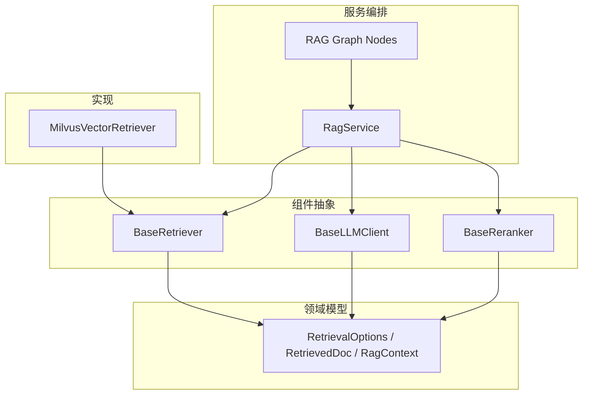
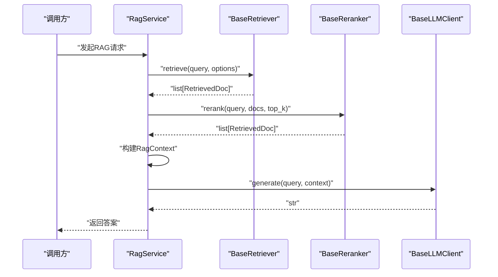
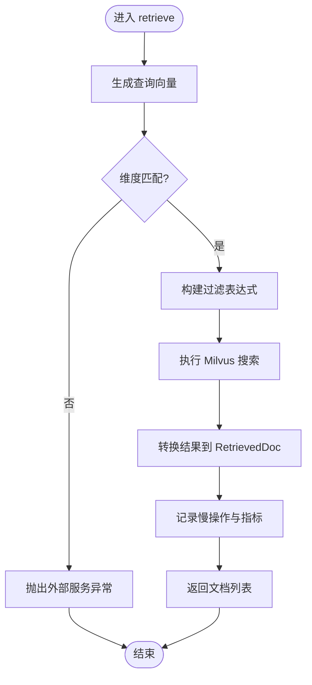
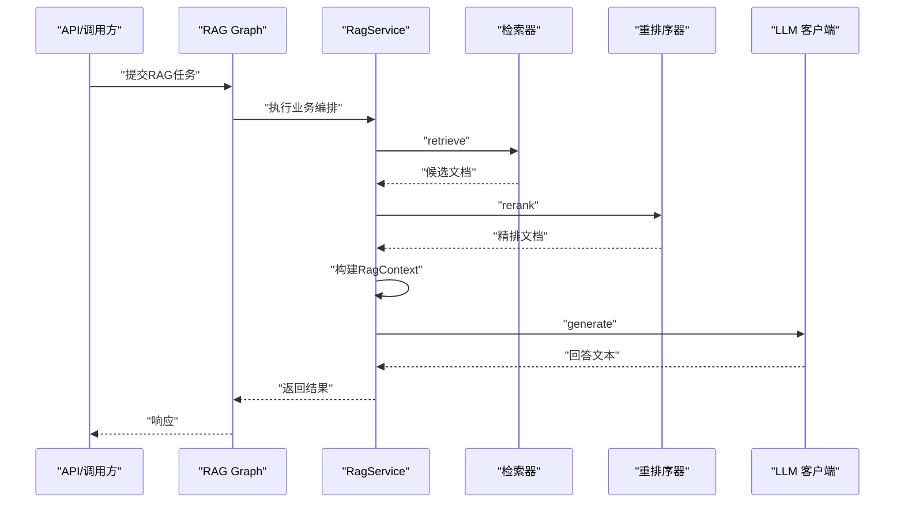
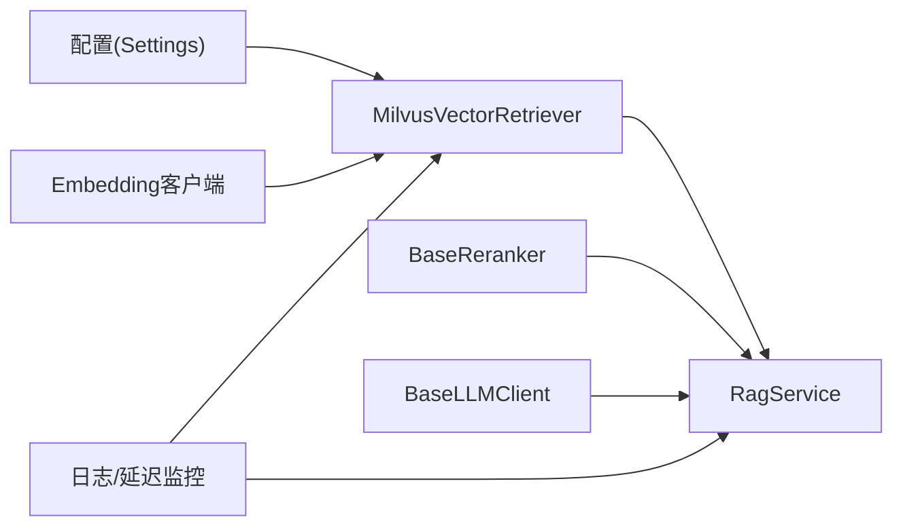

# 同步通信机制

<cite>
**本文引用的文件**
- [src/fast_app/components/retrievers/base.py](file://src/fast_app/components/retrievers/base.py)
- [src/fast_app/components/llms/base.py](file://src/fast_app/components/llms/base.py)
- [src/fast_app/components/rerankers/base.py](file://src/fast_app/components/rerankers/base.py)
- [src/fast_app/domain/rag_models.py](file://src/fast_app/domain/rag_models.py)
- [src/fast_app/components/retrievers/milvus_vector_retriever.py](file://src/fast_app/components/retrievers/milvus_vector_retriever.py)
- [src/fast_app/services/rag/rag_service.py](file://src/fast_app/services/rag/rag_service.py)
- [src/fast_app/graph/rag/rag_graph_nodes.py](file://src/fast_app/graph/rag/rag_graph_nodes.py)
- [src/fast_app/graph/rag/rag_state.py](file://src/fast_app/graph/rag/rag_state.py)
- [src/fast_app/core/config.py](file://src/fast_app/core/config.py)
- [src/fast_app/core/logging.py](file://src/fast_app/core/logging.py)
- [src/fast_app/core/latency.py](file://src/fast_app/core/latency.py)
- [src/fast_app/services/exceptions.py](file://src/fast_app/services/exceptions.py)
</cite>

## 目录
1. [简介](#简介)
2. [项目结构](#项目结构)
3. [核心组件](#核心组件)
4. [架构总览](#架构总览)
5. [详细组件分析](#详细组件分析)
6. [依赖关系分析](#依赖关系分析)
7. [性能考虑](#性能考虑)
8. [故障排查指南](#故障排查指南)
9. [结论](#结论)
10. [附录：同步调用示例与最佳实践](#附录：同步调用示例与最佳实践)

## 简介
本文件聚焦 RAG Pipeline 中的“同步通信机制”，围绕检索器、LLM 客户端、重排序器等组件的接口设计、错误处理、超时控制、重试策略、依赖注入与生命周期管理进行系统化说明。文档同时提供同步调用序列图、异常传播流程图，以及性能优化建议，并给出在现有代码基础上的具体实现路径与参考位置，帮助读者正确落地同步通信。

## 项目结构
RAG 相关能力主要分布在以下模块：
- 组件抽象层：定义检索器、LLM 客户端、重排序器的统一接口，便于替换实现与测试。
- 领域模型：定义检索选项、过滤条件、召回文档、评分明细、RAG 上下文等数据结构。
- 服务编排层：串联检索、融合、重排、上下文构建与 LLM 生成等步骤。
- 图编排（LangGraph）：以节点形式组织 RAG 流程，便于追踪与调试。
- 基础设施：配置、日志、延迟监控、外部服务异常封装等。

图表来源
- [src/fast_app/components/retrievers/base.py:1-13](file://src/fast_app/components/retrievers/base.py#L1-L13)
- [src/fast_app/components/llms/base.py:1-27](file://src/fast_app/components/llms/base.py#L1-L27)
- [src/fast_app/components/rerankers/base.py:1-14](file://src/fast_app/components/rerankers/base.py#L1-L14)
- [src/fast_app/domain/rag_models.py:1-80](file://src/fast_app/domain/rag_models.py#L1-L80)
- [src/fast_app/components/retrievers/milvus_vector_retriever.py:155-338](file://src/fast_app/components/retrievers/milvus_vector_retriever.py#L155-L338)
- [src/fast_app/services/rag/rag_service.py](file://src/fast_app/services/rag/rag_service.py)
- [src/fast_app/graph/rag/rag_graph_nodes.py](file://src/fast_app/graph/rag/rag_graph_nodes.py)

章节来源
- [src/fast_app/components/retrievers/base.py:1-13](file://src/fast_app/components/retrievers/base.py#L1-L13)
- [src/fast_app/components/llms/base.py:1-27](file://src/fast_app/components/llms/base.py#L1-L27)
- [src/fast_app/components/rerankers/base.py:1-14](file://src/fast_app/components/rerankers/base.py#L1-L14)
- [src/fast_app/domain/rag_models.py:1-80](file://src/fast_app/domain/rag_models.py#L1-L80)
- [src/fast_app/components/retrievers/milvus_vector_retriever.py:155-338](file://src/fast_app/components/retrievers/milvus_vector_retriever.py#L155-L338)
- [src/fast_app/services/rag/rag_service.py](file://src/fast_app/services/rag/rag_service.py)
- [src/fast_app/graph/rag/rag_graph_nodes.py](file://src/fast_app/graph/rag/rag_graph_nodes.py)

## 核心组件
- 检索器抽象 BaseRetriever：定义统一的异步 retrieve(query, options) -> list[RetrievedDoc] 接口，所有检索实现需遵循该契约。
- LLM 客户端抽象 BaseLLMClient：定义 generate 与 stream 两个接口，generate 用于同步获取完整文本；stream 用于流式输出。
- 重排序器抽象 BaseReranker：定义 rerank(query, docs, top_k) -> list[RetrievedDoc] 接口，对候选文档进行精排。
- 领域模型：
  - RetrievalOptions：top_k、candidate_k、filters、output_fields。
  - RetrievalFilters：source_path、section_path、权限与版本控制等。
  - RetrievedDoc：id、content、score、source、title、metadata、retrieval_sources、scores。
  - RagContext：query、docs、context_text。

这些抽象与模型构成了 RAG Pipeline 的同步通信契约，上层服务通过调用这些接口完成检索、重排与生成的数据流转。

章节来源
- [src/fast_app/components/retrievers/base.py:1-13](file://src/fast_app/components/retrievers/base.py#L1-L13)
- [src/fast_app/components/llms/base.py:1-27](file://src/fast_app/components/llms/base.py#L1-L27)
- [src/fast_app/components/rerankers/base.py:1-14](file://src/fast_app/components/rerankers/base.py#L1-L14)
- [src/fast_app/domain/rag_models.py:1-80](file://src/fast_app/domain/rag_models.py#L1-L80)

## 架构总览
下图展示一次典型 RAG 请求的同步调用链：API 或上游服务调用 RagService，依次触发检索器、可选的重排序器、上下文构建与 LLM 生成。各阶段均基于统一接口进行同步调用，并通过领域模型传递数据。

图表来源
- [src/fast_app/services/rag/rag_service.py](file://src/fast_app/services/rag/rag_service.py)
- [src/fast_app/components/retrievers/base.py:1-13](file://src/fast_app/components/retrievers/base.py#L1-L13)
- [src/fast_app/components/rerankers/base.py:1-14](file://src/fast_app/components/rerankers/base.py#L1-L14)
- [src/fast_app/components/llms/base.py:1-27](file://src/fast_app/components/llms/base.py#L1-L27)

## 详细组件分析

### 检索器：MilvusVectorRetriever
- 职责：将 query 转为向量，构造 Milvus 过滤表达式，执行搜索，转换结果为 RetrievedDoc，记录耗时与指标。
- 关键流程：
  - 生成 embedding 并校验维度，不匹配时抛出外部服务异常。
  - 构建业务与权限过滤表达式，下推到 Milvus 召回阶段。
  - 执行 search，统计命中数与跳过数，记录慢操作。
  - 将原始结果转换为 RetrievedDoc，保留多阶段分数以便后续 RRF/重排使用。
- 错误处理：捕获外部服务异常并包装为 ExternalServiceError，保证上层统一处理。

图表来源
- [src/fast_app/components/retrievers/milvus_vector_retriever.py:182-338](file://src/fast_app/components/retrievers/milvus_vector_retriever.py#L182-L338)
- [src/fast_app/domain/rag_models.py:1-80](file://src/fast_app/domain/rag_models.py#L1-L80)
- [src/fast_app/core/latency.py](file://src/fast_app/core/latency.py)
- [src/fast_app/services/exceptions.py](file://src/fast_app/services/exceptions.py)

章节来源
- [src/fast_app/components/retrievers/milvus_vector_retriever.py:155-338](file://src/fast_app/components/retrievers/milvus_vector_retriever.py#L155-L338)
- [src/fast_app/domain/rag_models.py:1-80](file://src/fast_app/domain/rag_models.py#L1-L80)
- [src/fast_app/core/latency.py](file://src/fast_app/core/latency.py)
- [src/fast_app/services/exceptions.py](file://src/fast_app/services/exceptions.py)

### LLM 客户端：BaseLLMClient
- 职责：提供 generate 与 stream 两种调用方式。同步场景使用 generate 获取完整回答；异步/流式场景使用 stream。
- 同步调用模式：
  - 接收 query 与 RagContext（包含检索文档与上下文文本）。
  - 返回字符串形式的回答。
- 可替换性：通过抽象接口支持不同 LLM 提供商的实现，便于测试与灰度切换。

章节来源
- [src/fast_app/components/llms/base.py:1-27](file://src/fast_app/components/llms/base.py#L1-L27)
- [src/fast_app/domain/rag_models.py:72-80](file://src/fast_app/domain/rag_models.py#L72-L80)

### 重排序器：BaseReranker
- 职责：对检索候选文档进行精排，返回 top_k 文档。
- 输入：query、候选文档列表、top_k。
- 输出：排序后的 RetrievedDoc 列表，供上下文构建与 LLM 使用。

章节来源
- [src/fast_app/components/rerankers/base.py:1-14](file://src/fast_app/components/rerankers/base.py#L1-L14)
- [src/fast_app/domain/rag_models.py:52-70](file://src/fast_app/domain/rag_models.py#L52-L70)

### 服务编排：RagService 与 LangGraph 节点
- RagService：协调检索、重排、上下文构建与 LLM 生成，形成端到端同步调用链。
- LangGraph 节点：将 RAG 流程拆分为多个节点，便于追踪、调试与扩展。
- 状态对象：RAG 状态在节点间传递，确保数据一致性。

图表来源
- [src/fast_app/services/rag/rag_service.py](file://src/fast_app/services/rag/rag_service.py)
- [src/fast_app/graph/rag/rag_graph_nodes.py](file://src/fast_app/graph/rag/rag_graph_nodes.py)
- [src/fast_app/graph/rag/rag_state.py](file://src/fast_app/graph/rag/rag_state.py)

章节来源
- [src/fast_app/services/rag/rag_service.py](file://src/fast_app/services/rag/rag_service.py)
- [src/fast_app/graph/rag/rag_graph_nodes.py](file://src/fast_app/graph/rag/rag_graph_nodes.py)
- [src/fast_app/graph/rag/rag_state.py](file://src/fast_app/graph/rag/rag_state.py)

## 依赖关系分析
- 组件耦合：
  - RagService 依赖 BaseRetriever、BaseReranker、BaseLLMClient 的抽象接口，降低实现耦合。
  - MilvusVectorRetriever 依赖 Settings、Embedding 客户端、MilvusClient，并通过领域模型传递数据。
- 外部依赖：
  - Milvus 向量数据库、LLM 提供商、可能的重排序服务。
- 潜在循环依赖：
  - 当前结构通过抽象与服务编排解耦，未见明显循环依赖。
- 集成点：
  - 配置中心（Settings）提供连接参数与阈值。
  - 日志与延迟监控贯穿各阶段，便于定位瓶颈与问题。

图表来源
- [src/fast_app/core/config.py](file://src/fast_app/core/config.py)
- [src/fast_app/components/retrievers/milvus_vector_retriever.py:155-180](file://src/fast_app/components/retrievers/milvus_vector_retriever.py#L155-L180)
- [src/fast_app/core/logging.py](file://src/fast_app/core/logging.py)
- [src/fast_app/core/latency.py](file://src/fast_app/core/latency.py)

章节来源
- [src/fast_app/core/config.py](file://src/fast_app/core/config.py)
- [src/fast_app/components/retrievers/milvus_vector_retriever.py:155-180](file://src/fast_app/components/retrievers/milvus_vector_retriever.py#L155-L180)
- [src/fast_app/core/logging.py](file://src/fast_app/core/logging.py)
- [src/fast_app/core/latency.py](file://src/fast_app/core/latency.py)

## 性能考虑
- 向量维度校验：在检索器中尽早校验 embedding 维度，避免无效搜索。
- 过滤下推：将业务与权限过滤表达式下推到 Milvus 召回阶段，减少候选集大小。
- 慢操作监控：记录检索、重排、生成阶段的耗时，设置阈值告警。
- 输出字段最小化：仅请求必要字段，减少网络与序列化开销。
- 候选数量控制：合理设置 candidate_k 与 top_k，平衡召回质量与延迟。
- 重试与降级：对外部服务调用实施重试与降级策略，提升鲁棒性。

## 故障排查指南
- 常见错误类型：
  - 外部服务异常：如 Milvus 连接失败、LLM 超时、重排序服务不可用。
  - 数据不一致：embedding 维度不匹配、缺失 id/content 导致跳过。
- 定位方法：
  - 查看检索日志中的事件标记（如 milvus.embedding.finish、milvus.search.start/finish），关注 latency_ms、hit_count、skipped_hit_count。
  - 检查慢操作日志，确认瓶颈所在组件。
  - 核对配置项（如 collection_name、vector_field、embedding_dim）与实际存储一致。
- 恢复策略：
  - 对瞬态错误实施指数退避重试。
  - 对持续失败的服务启用降级（如回退到关键词检索或默认答案）。
  - 对脏数据（缺失 id/content）进行告警与修复。

章节来源
- [src/fast_app/components/retrievers/milvus_vector_retriever.py:198-338](file://src/fast_app/components/retrievers/milvus_vector_retriever.py#L198-L338)
- [src/fast_app/core/logging.py](file://src/fast_app/core/logging.py)
- [src/fast_app/core/latency.py](file://src/fast_app/core/latency.py)
- [src/fast_app/services/exceptions.py](file://src/fast_app/services/exceptions.py)

## 结论
本项目的 RAG Pipeline 通过抽象接口实现了检索器、LLM 客户端与重排序器的解耦，配合领域模型与服务编排，形成了清晰、可观测、可扩展的同步通信机制。借助过滤下推、慢操作监控与异常封装，系统在性能与稳定性方面具备良好基础。建议在接入新组件时严格遵循接口契约，完善重试与降级策略，并持续优化候选数量与输出字段，以获得更优的端到端延迟与准确率。

## 附录：同步调用示例与最佳实践
- 同步调用序列（参考路径）：
  - 检索器调用：参见 [src/fast_app/components/retrievers/base.py:7-13](file://src/fast_app/components/retrievers/base.py#L7-L13)。
  - LLM 生成调用：参见 [src/fast_app/components/llms/base.py:10-17](file://src/fast_app/components/llms/base.py#L10-L17)。
  - 重排序调用：参见 [src/fast_app/components/rerankers/base.py:7-14](file://src/fast_app/components/rerankers/base.py#L7-L14)。
- 错误处理与异常传播（参考路径）：
  - 外部服务异常封装：参见 [src/fast_app/services/exceptions.py](file://src/fast_app/services/exceptions.py)。
  - 检索器异常捕获与日志：参见 [src/fast_app/components/retrievers/milvus_vector_retriever.py:305-338](file://src/fast_app/components/retrievers/milvus_vector_retriever.py#L305-L338)。
- 超时控制与重试（建议实现）：
  - 在调用外部服务前设置超时（如 HTTP 客户端超时、LLM 调用超时）。
  - 对幂等且瞬态错误的调用实施指数退避重试，限制最大重试次数。
  - 对非幂等操作谨慎重试，避免重复副作用。
- 依赖注入与生命周期管理（建议实现）：
  - 使用 FastAPI 依赖注入将 Settings、Embedding 客户端、MilvusClient 等注入到检索器。
  - 在服务启动时创建并复用长连接客户端，在应用关闭时优雅释放资源。
  - 在单元测试中使用 Mock 实现替代真实外部服务，确保隔离与可测性。
- 性能优化清单（参考路径）：
  - 向量维度校验与过滤下推：参见 [src/fast_app/components/retrievers/milvus_vector_retriever.py:198-265](file://src/fast_app/components/retrievers/milvus_vector_retriever.py#L198-L265)。
  - 慢操作监控与阈值告警：参见 [src/fast_app/core/latency.py](file://src/fast_app/core/latency.py)。
  - 日志字段标准化：参见 [src/fast_app/core/logging.py](file://src/fast_app/core/logging.py)。