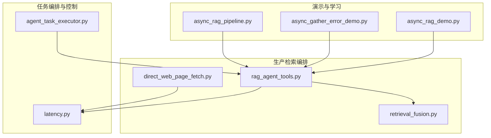
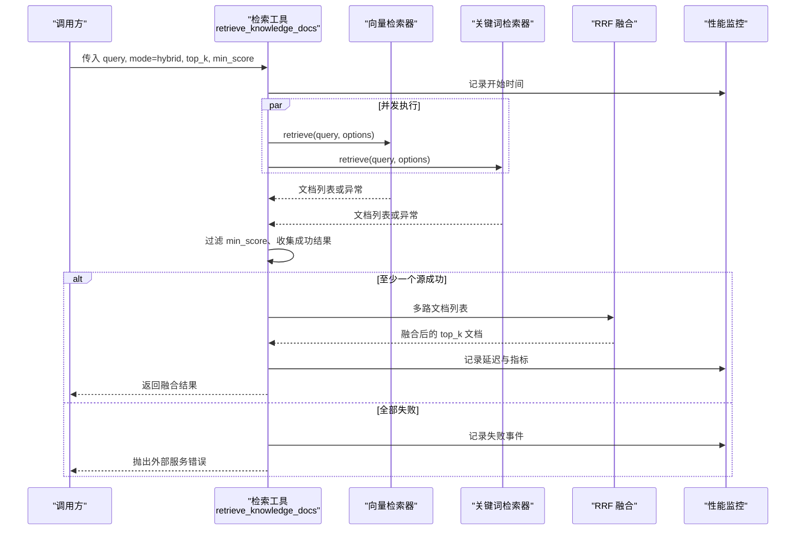
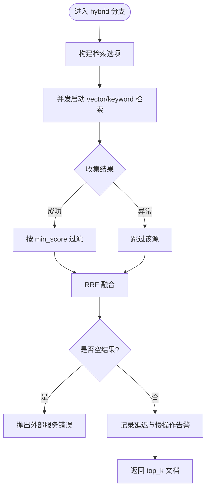
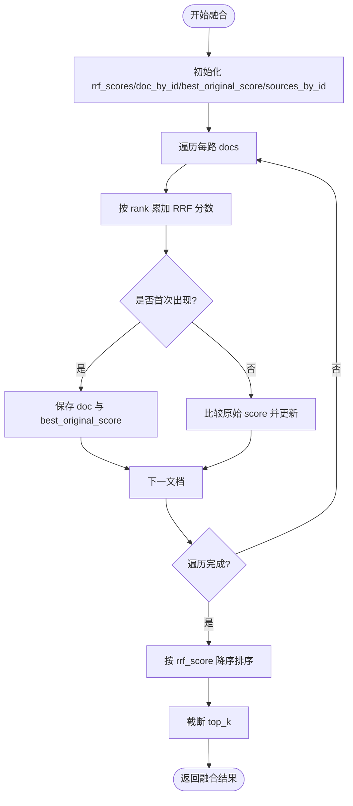
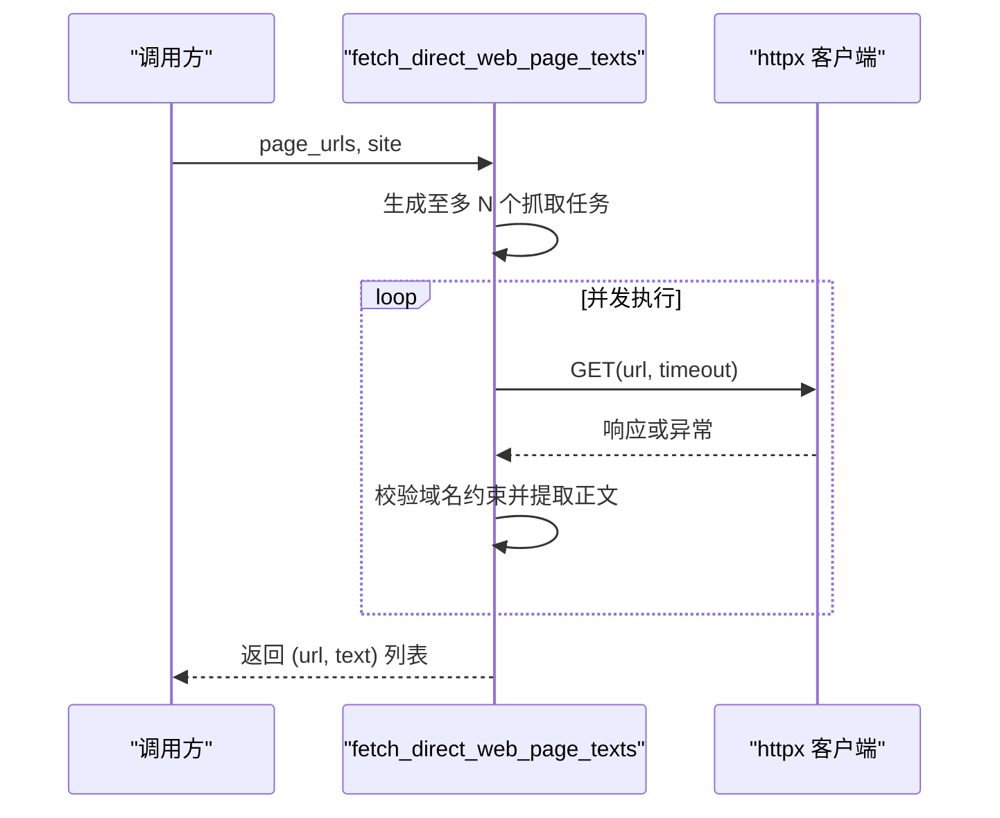
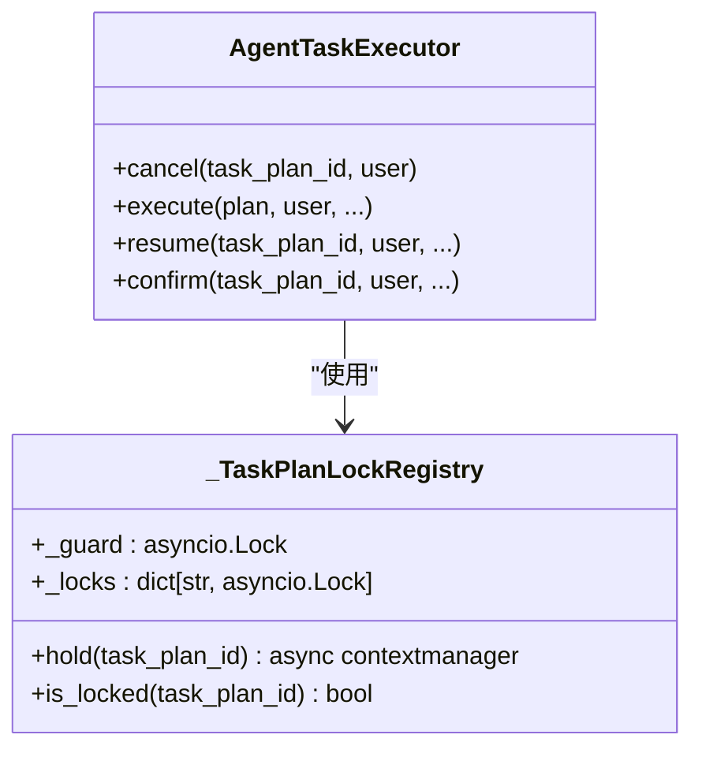
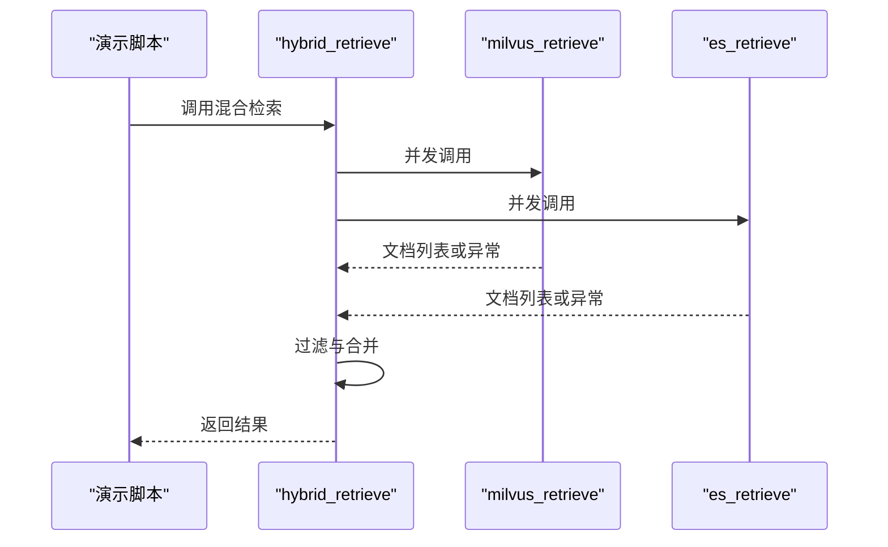
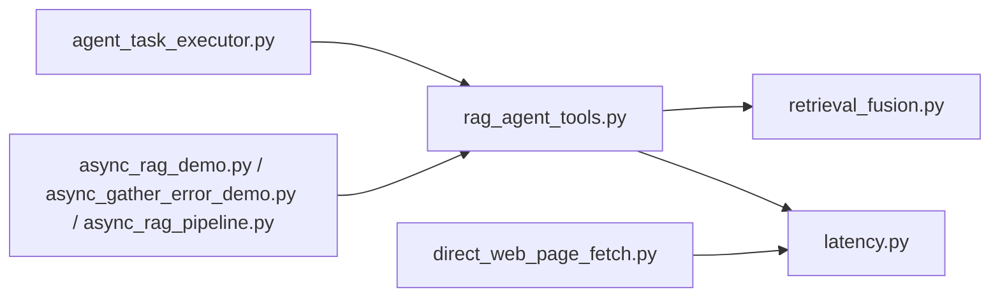

# 并发检索与任务编排

<cite>
**本文引用的文件**
- [async_rag_demo.py](file://src/app/async_rag_demo.py)
- [async_gather_error_demo.py](file://src/app/async_gather_error_demo.py)
- [async_rag_pipeline.py](file://src/app/services/async_rag_pipeline.py)
- [rag_agent_tools.py](file://src/fast_app/agents/tools/rag_agent_tools.py)
- [retrieval_fusion.py](file://src/fast_app/services/rag/retrieval_fusion.py)
- [direct_web_page_fetch.py](file://src/fast_app/services/rag/direct_web_page_fetch.py)
- [agent_task_executor.py](file://src/fast_app/services/agent_tasks/agent_task_executor.py)
- [latency.py](file://src/fast_app/core/latency.py)
</cite>

## 目录
1. [简介](#简介)
2. [项目结构](#项目结构)
3. [核心组件](#核心组件)
4. [架构总览](#架构总览)
5. [详细组件分析](#详细组件分析)
6. [依赖关系分析](#依赖关系分析)
7. [性能考量](#性能考量)
8. [故障排查指南](#故障排查指南)
9. [结论](#结论)
10. [附录](#附录)

## 简介
本文件围绕“并发检索与任务编排”展开，聚焦 asyncio.gather 在混合检索（向量检索 + 关键词检索）中的使用模式，包括：
- 并发执行策略：如何同时发起多个召回源请求并合并结果。
- 异常处理与降级：部分失败时如何继续返回可用结果，以及全失败时的统一错误路径。
- 资源竞争避免：通过进程内锁、有界并发等手段防止重复执行与资源争用。
- 性能监控与调试：延迟统计、慢操作告警、阶段快照与日志埋点。
- 实战示例：基于仓库现有代码的并发检索流程、RRF 融合、Web 全文并发抓取等。

## 项目结构
与并发检索相关的代码主要分布在以下位置：
- 演示与教学示例：src/app 下的异步 RAG 演示脚本，展示基础并发与错误处理。
- 生产级检索工具：fast_app/agents/tools/rag_agent_tools.py，实现 vector/keyword/hybrid 三种模式的检索编排。
- 结果融合：fast_app/services/rag/retrieval_fusion.py，提供 RRF 融合算法。
- Web 全文并发抓取：fast_app/services/rag/direct_web_page_fetch.py，展示有界并发与逐文档回退。
- 任务编排与并发控制：fast_app/services/agent_tasks/agent_task_executor.py，提供任务级互斥锁与取消信号。
- 性能监控：fast_app/core/latency.py，提供延迟测量与慢操作告警。

图表来源
- [async_rag_demo.py:56-62](file://src/app/async_rag_demo.py#L56-L62)
- [async_gather_error_demo.py:32-53](file://src/app/async_gather_error_demo.py#L32-L53)
- [async_rag_pipeline.py:91-128](file://src/app/services/async_rag_pipeline.py#L91-L128)
- [rag_agent_tools.py:94-487](file://src/fast_app/agents/tools/rag_agent_tools.py#L94-L487)
- [retrieval_fusion.py:8-80](file://src/fast_app/services/rag/retrieval_fusion.py#L8-L80)
- [direct_web_page_fetch.py:107-122](file://src/fast_app/services/rag/direct_web_page_fetch.py#L107-L122)
- [agent_task_executor.py:81-132](file://src/fast_app/services/agent_tasks/agent_task_executor.py#L81-L132)
- [latency.py:19-38](file://src/fast_app/core/latency.py#L19-L38)

章节来源
- [async_rag_demo.py:1-87](file://src/app/async_rag_demo.py#L1-L87)
- [async_gather_error_demo.py:1-68](file://src/app/async_gather_error_demo.py#L1-L68)
- [async_rag_pipeline.py:1-223](file://src/app/services/async_rag_pipeline.py#L1-L223)
- [rag_agent_tools.py:1-546](file://src/fast_app/agents/tools/rag_agent_tools.py#L1-L546)
- [retrieval_fusion.py:1-80](file://src/fast_app/services/rag/retrieval_fusion.py#L1-L80)
- [direct_web_page_fetch.py:1-122](file://src/fast_app/services/rag/direct_web_page_fetch.py#L1-L122)
- [agent_task_executor.py:1-624](file://src/fast_app/services/agent_tasks/agent_task_executor.py#L1-L624)
- [latency.py:1-38](file://src/fast_app/core/latency.py#L1-L38)

## 核心组件
- 混合检索编排器：支持 vector、keyword、hybrid 三种模式；hybrid 模式下并发调用向量与关键词检索器，并对结果进行过滤、去重与排序。
- 结果融合器：采用 RRF（Reciprocal Rank Fusion）将多路召回结果按排名权重融合，保留原始最高分文档对象并记录来源集合。
- Web 全文并发抓取：对候选页面并发拉取正文，限制最大页数与超时，单页失败回退为空正文，不向上抛异常。
- 任务编排与并发控制：为每个 TaskPlan 维护进程内互斥锁，防止同一任务被重复确认或恢复；支持取消信号写入并在安全边界停止。
- 性能监控：统一延迟计时与慢操作告警，结合结构化日志字段便于追踪与定位瓶颈。

章节来源
- [rag_agent_tools.py:94-487](file://src/fast_app/agents/tools/rag_agent_tools.py#L94-L487)
- [retrieval_fusion.py:8-80](file://src/fast_app/services/rag/retrieval_fusion.py#L8-L80)
- [direct_web_page_fetch.py:107-122](file://src/fast_app/services/rag/direct_web_page_fetch.py#L107-L122)
- [agent_task_executor.py:81-132](file://src/fast_app/services/agent_tasks/agent_task_executor.py#L81-L132)
- [latency.py:19-38](file://src/fast_app/core/latency.py#L19-L38)

## 架构总览
下图展示了混合检索从入口到召回、融合、输出的整体流程，包含并发执行、异常降级、RRF 融合与慢操作告警。

图表来源
- [rag_agent_tools.py:320-487](file://src/fast_app/agents/tools/rag_agent_tools.py#L320-L487)
- [retrieval_fusion.py:8-80](file://src/fast_app/services/rag/retrieval_fusion.py#L8-L80)
- [latency.py:19-38](file://src/fast_app/core/latency.py#L19-L38)

## 详细组件分析

### 组件A：混合检索编排（vector/keyword/hybrid）
- 设计要点
  - 单源检索：分别封装 vector 与 keyword 的检索逻辑，包含开始/结束/失败日志、慢操作告警、阶段快照记录。
  - 混合检索：使用 asyncio.gather 并发执行两个检索源，内部捕获异常并以 Exception 形式返回，随后过滤成功结果。
  - 结果融合：调用 RRF 融合函数，输出 top_k 文档，并记录输入/唯一/输出计数与延迟。
  - 降级策略：任一源失败不影响其他源；全部失败则抛出统一的外部服务错误。
- 并发控制
  - 通过 gather 并行执行，无全局锁阻塞不同任务；单源内部可配置重试/超时（由 retriever 实现负责）。
- 性能监控
  - 使用 perf_counter 计算延迟，log_slow_operation 在超过阈值时记录警告日志。
  - 结构化日志字段包含 pipeline_provider、tool_name、retrieval_mode、top_k、candidate_k、min_score、source_count 等。

图表来源
- [rag_agent_tools.py:320-487](file://src/fast_app/agents/tools/rag_agent_tools.py#L320-L487)
- [retrieval_fusion.py:8-80](file://src/fast_app/services/rag/retrieval_fusion.py#L8-L80)
- [latency.py:19-38](file://src/fast_app/core/latency.py#L19-L38)

章节来源
- [rag_agent_tools.py:94-487](file://src/fast_app/agents/tools/rag_agent_tools.py#L94-L487)

### 组件B：RRF 融合算法
- 设计要点
  - 对每路召回结果按 rank 累加 1/(k+rank) 得到 RRF 分数。
  - 保留每个 doc.id 的最高原始 score 文档对象，并聚合 retrieval_sources。
  - 最终按 RRF 分数降序截断 top_k。
- 复杂度分析
  - 时间复杂度 O(N)，N 为所有召回文档总数。
  - 空间复杂度 O(U)，U 为唯一文档数。
- 优化机会
  - 若召回量极大，可在过滤阶段提前裁剪 candidate_k，减少后续融合开销。
  - 可考虑并行化跨路扫描（当前顺序扫描已足够高效）。

图表来源
- [retrieval_fusion.py:8-80](file://src/fast_app/services/rag/retrieval_fusion.py#L8-L80)

章节来源
- [retrieval_fusion.py:8-80](file://src/fast_app/services/rag/retrieval_fusion.py#L8-L80)

### 组件C：Web 全文并发抓取（有界并发与逐文档回退）
- 设计要点
  - 限制最多抓取页面数 DIRECT_WEB_FULLTEXT_MAX_PAGES，避免无限并发。
  - 设置超时 DIRECT_WEB_FULLTEXT_TIMEOUT_SECONDS，防止长时间阻塞。
  - 单页失败返回空正文，由调用方回退该文档的搜索摘要；模块本身不抛异常。
- 并发模型
  - 使用 asyncio.gather(*tasks) 并发抓取，任务数量受限于候选 URL 列表长度与最大页数。
- 安全约束
  - 校验重定向终点的域名是否在 site 约束内，防止跨站跳转。

图表来源
- [direct_web_page_fetch.py:107-122](file://src/fast_app/services/rag/direct_web_page_fetch.py#L107-L122)
- [direct_web_page_fetch.py:60-84](file://src/fast_app/services/rag/direct_web_page_fetch.py#L60-L84)

章节来源
- [direct_web_page_fetch.py:1-122](file://src/fast_app/services/rag/direct_web_page_fetch.py#L1-L122)

### 组件D：任务编排与并发控制（TaskPlan 互斥锁）
- 设计要点
  - _TaskPlanLockRegistry 为每个 task_plan_id 维护一把 asyncio.Lock，保证同任务互斥执行。
  - hold() 方法在进入临界区前检查是否已被占用，若已占用直接快速失败（而非排队），避免重复执行。
  - cancel() 不进入任务锁，立即写入取消信号，让运行中的节点在安全边界自行停止。
- 适用场景
  - confirm/retry 等高风险操作需要防重入保护。
  - 长任务中通过状态机在安全边界检查取消信号，及时释放资源。

图表来源
- [agent_task_executor.py:81-132](file://src/fast_app/services/agent_tasks/agent_task_executor.py#L81-L132)
- [agent_task_executor.py:212-278](file://src/fast_app/services/agent_tasks/agent_task_executor.py#L212-L278)
- [agent_task_executor.py:310-339](file://src/fast_app/services/agent_tasks/agent_task_executor.py#L310-L339)
- [agent_task_executor.py:341-442](file://src/fast_app/services/agent_tasks/agent_task_executor.py#L341-L442)
- [agent_task_executor.py:444-496](file://src/fast_app/services/agent_tasks/agent_task_executor.py#L444-L496)

章节来源
- [agent_task_executor.py:81-132](file://src/fast_app/services/agent_tasks/agent_task_executor.py#L81-L132)
- [agent_task_executor.py:212-278](file://src/fast_app/services/agent_tasks/agent_task_executor.py#L212-L278)
- [agent_task_executor.py:310-339](file://src/fast_app/services/agent_tasks/agent_task_executor.py#L310-L339)
- [agent_task_executor.py:341-442](file://src/fast_app/services/agent_tasks/agent_task_executor.py#L341-L442)
- [agent_task_executor.py:444-496](file://src/fast_app/services/agent_tasks/agent_task_executor.py#L444-L496)

### 组件E：演示与教学示例（基础并发与错误处理）
- 基础并发：async_rag_demo.py 展示 Milvus 与 ES 并发检索，合并结果并统计耗时。
- 错误处理：async_gather_error_demo.py 演示 return_exceptions=True 的使用，单个源失败时跳过并继续返回可用结果。
- 管道编排：async_rag_pipeline.py 展示 retrieve_node 在 hybrid 模式下并发召回、过滤、合并与上下文构造。

图表来源
- [async_rag_demo.py:56-62](file://src/app/async_rag_demo.py#L56-L62)
- [async_gather_error_demo.py:32-53](file://src/app/async_gather_error_demo.py#L32-L53)
- [async_rag_pipeline.py:91-128](file://src/app/services/async_rag_pipeline.py#L91-L128)

章节来源
- [async_rag_demo.py:1-87](file://src/app/async_rag_demo.py#L1-L87)
- [async_gather_error_demo.py:1-68](file://src/app/async_gather_error_demo.py#L1-L68)
- [async_rag_pipeline.py:1-223](file://src/app/services/async_rag_pipeline.py#L1-L223)

## 依赖关系分析
- 检索编排依赖
  - rag_agent_tools.py 依赖 BaseRetriever 接口（vector/keyword）、RRF 融合、延迟监控与结构化日志。
  - 混合检索通过 asyncio.gather 并发执行两个检索源，内部捕获异常并降级。
- 结果融合依赖
  - retrieval_fusion.py 依赖 RetrievedDoc 数据模型，计算 RRF 分数并聚合来源集合。
- Web 抓取依赖
  - direct_web_page_fetch.py 依赖 httpx 客户端与页面文本提取逻辑，限制并发规模与超时。
- 任务编排依赖
  - agent_task_executor.py 通过 _TaskPlanLockRegistry 提供进程内互斥，确保 confirm/resume/cancel 的正确性。
- 性能监控依赖
  - latency.py 提供统一的延迟测量与慢操作告警，被检索编排与 Web 抓取复用。

图表来源
- [rag_agent_tools.py:94-487](file://src/fast_app/agents/tools/rag_agent_tools.py#L94-L487)
- [retrieval_fusion.py:8-80](file://src/fast_app/services/rag/retrieval_fusion.py#L8-L80)
- [direct_web_page_fetch.py:107-122](file://src/fast_app/services/rag/direct_web_page_fetch.py#L107-L122)
- [agent_task_executor.py:81-132](file://src/fast_app/services/agent_tasks/agent_task_executor.py#L81-L132)
- [latency.py:19-38](file://src/fast_app/core/latency.py#L19-L38)

章节来源
- [rag_agent_tools.py:94-487](file://src/fast_app/agents/tools/rag_agent_tools.py#L94-L487)
- [retrieval_fusion.py:8-80](file://src/fast_app/services/rag/retrieval_fusion.py#L8-L80)
- [direct_web_page_fetch.py:107-122](file://src/fast_app/services/rag/direct_web_page_fetch.py#L107-L122)
- [agent_task_executor.py:81-132](file://src/fast_app/services/agent_tasks/agent_task_executor.py#L81-L132)
- [latency.py:19-38](file://src/fast_app/core/latency.py#L19-L38)

## 性能考量
- 并发度控制
  - 混合检索：默认并发度为 2（vector + keyword），可通过扩展更多召回源提升吞吐，但需评估下游融合与 LLM 上下文大小。
  - Web 全文抓取：限制最大页面数与超时，避免资源耗尽。
- 延迟与慢操作
  - 使用 perf_counter 计算延迟，log_slow_operation 在超过阈值时记录警告，便于定位瓶颈。
- 内存与对象复制
  - RRF 融合过程中使用字典缓存与 replace 创建新对象，注意在高 QPS 下内存分配与 GC 压力。
- I/O 与网络
  - 检索器与 Web 抓取均依赖网络 I/O，建议配合连接池、超时与重试策略（由具体 retriever/httpx 配置决定）。

[本节提供通用指导，无需特定文件引用]

## 故障排查指南
- 常见错误与定位
  - 检索源失败：在混合检索中，gather 返回 Exception，需检查对应 retriever 的日志与指标（如 VECTOR_RETRIEVAL_FAILED、KEYWORD_RETRIEVAL_FAILED）。
  - 全部失败：当所有召回源均失败时，会抛出外部服务错误；检查网络连通性、认证与配额。
  - Web 抓取失败：单页失败返回空正文，检查域名约束、重定向与超时配置。
  - 任务重复执行：确认 TaskPlan 是否被并发 confirm/retry；检查 _TaskPlanLockRegistry 是否生效。
- 调试技巧
  - 启用结构化日志：关注 event 字段（如 rag.retrieval.hybrid.start/finish、rag.retrieval.source.failed）。
  - 慢操作告警：根据 slow_retrieval_threshold_ms 调整阈值，观察延迟分布。
  - 阶段快照：record_snapshot_retrieval_stage 记录各阶段中间结果，便于回溯。

章节来源
- [rag_agent_tools.py:172-215](file://src/fast_app/agents/tools/rag_agent_tools.py#L172-L215)
- [rag_agent_tools.py:275-318](file://src/fast_app/agents/tools/rag_agent_tools.py#L275-L318)
- [rag_agent_tools.py:375-432](file://src/fast_app/agents/tools/rag_agent_tools.py#L375-L432)
- [direct_web_page_fetch.py:60-84](file://src/fast_app/services/rag/direct_web_page_fetch.py#L60-L84)
- [agent_task_executor.py:81-132](file://src/fast_app/services/agent_tasks/agent_task_executor.py#L81-L132)
- [latency.py:19-38](file://src/fast_app/core/latency.py#L19-L38)

## 结论
本仓库在混合检索与任务编排方面提供了清晰且可扩展的实现：
- 使用 asyncio.gather 实现向量与关键词检索的并发执行，并通过异常捕获与降级策略保证可用性。
- 通过 RRF 融合提升召回稳定性，同时记录来源集合与延迟指标。
- 借助进程内互斥锁与取消信号，确保任务编排的安全性与可控性。
- 提供完善的性能监控与调试手段，便于在生产环境中定位问题与优化性能。

[本节总结内容，无需特定文件引用]

## 附录
- 关键实践清单
  - 混合检索优先使用 gather 并发，return_exceptions=True 用于容错。
  - 对每个召回源进行 min_score 过滤与 top_k 截断，控制上下文大小。
  - 使用 RRF 融合多路结果，记录 input/unique/output 计数与延迟。
  - 对 Web 全文抓取设置并发上限与超时，单页失败回退为空正文。
  - 对 confirm/retry 等高风险操作使用任务级互斥锁，避免重复执行。
  - 使用结构化日志与慢操作告警，持续监控性能与健康度。

[本节提供实践建议，无需特定文件引用]