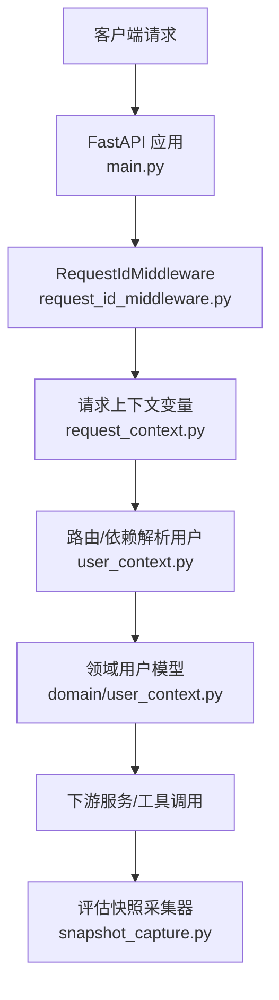
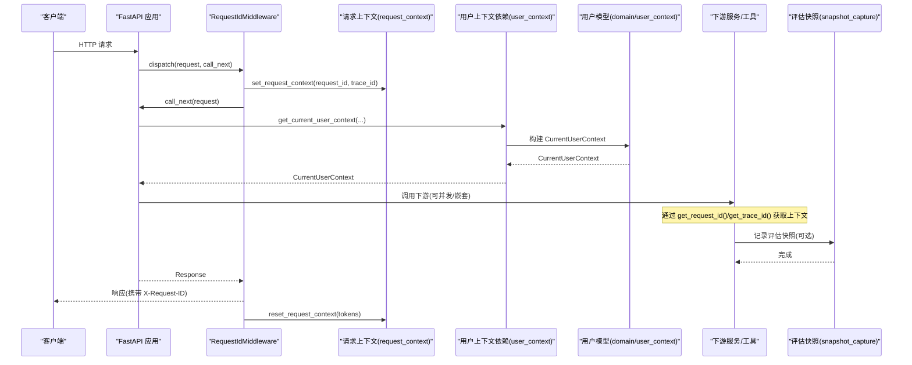
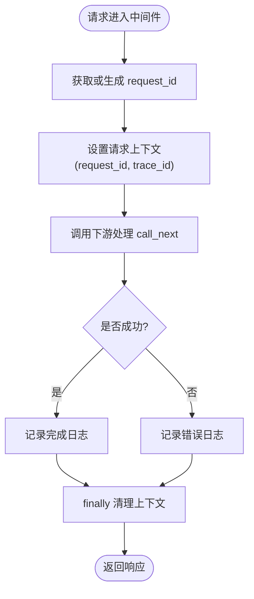
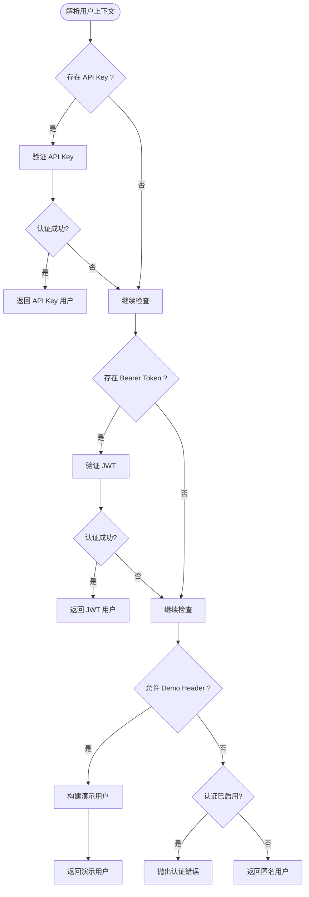
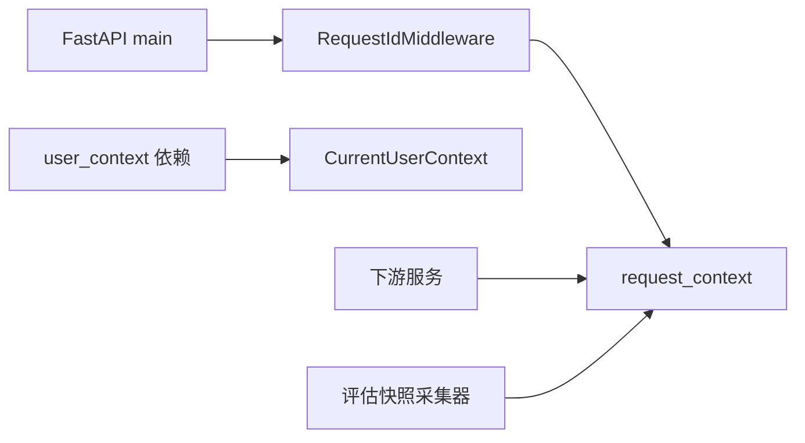

# 异步上下文管理

<cite>
**本文引用的文件**
- [src/fast_app/core/request_context.py](file://src/fast_app/core/request_context.py)
- [src/fast_app/middlewares/request_id_middleware.py](file://src/fast_app/middlewares/request_id_middleware.py)
- [src/fast_app/domain/user_context.py](file://src/fast_app/domain/user_context.py)
- [src/fast_app/dependencies/user_context.py](file://src/fast_app/dependencies/user_context.py)
- [src/fast_app/main.py](file://src/fast_app/main.py)
- [src/fast_app/evaluation/pipeline/snapshot_capture.py](file://src/fast_app/evaluation/pipeline/snapshot_capture.py)
</cite>

## 目录
1. [简介](#简介)
2. [项目结构](#项目结构)
3. [核心组件](#核心组件)
4. [架构总览](#架构总览)
5. [详细组件分析](#详细组件分析)
6. [依赖关系分析](#依赖关系分析)
7. [性能与内存安全](#性能与内存安全)
8. [故障排查指南](#故障排查指南)
9. [结论](#结论)
10. [附录：最佳实践与示例](#附录最佳实践与示例)

## 简介
本文件聚焦于本项目中的异步上下文管理，围绕 Python 的 contextvars 在 FastAPI 请求链路中的使用模式展开。文档涵盖以下主题：
- 请求级上下文：请求标识、追踪标识的注入、传播与清理
- 用户上下文：认证来源、权限快照、部门隔离等
- 会话上下文：结合 Redis 短期记忆与会话状态（概念性说明）
- 上下文隔离、生命周期管理与内存泄漏防护
- 上下文流转图、最佳实践与常见问题解决方案
- 实际使用示例路径，展示如何在异步环境中正确传递业务状态和用户信息

## 项目结构
本项目将“请求上下文”和“用户上下文”解耦为两个层次：
- 请求上下文：通过 contextvars 维护 request_id、trace_id，贯穿整个异步调用链，便于日志追踪与问题定位
- 用户上下文：通过 Pydantic 模型表达当前用户身份、认证来源、权限快照与部门范围，作为领域层数据在不同服务间传递

图表来源
- [src/fast_app/main.py:132-154](file://src/fast_app/main.py#L132-L154)
- [src/fast_app/middlewares/request_id_middleware.py:19-98](file://src/fast_app/middlewares/request_id_middleware.py#L19-L98)
- [src/fast_app/core/request_context.py:1-39](file://src/fast_app/core/request_context.py#L1-L39)
- [src/fast_app/dependencies/user_context.py:16-62](file://src/fast_app/dependencies/user_context.py#L16-L62)
- [src/fast_app/domain/user_context.py:9-54](file://src/fast_app/domain/user_context.py#L9-L54)
- [src/fast_app/evaluation/pipeline/snapshot_capture.py:16-18](file://src/fast_app/evaluation/pipeline/snapshot_capture.py#L16-L18)

章节来源
- [src/fast_app/main.py:132-154](file://src/fast_app/main.py#L132-L154)
- [src/fast_app/middlewares/request_id_middleware.py:19-98](file://src/fast_app/middlewares/request_id_middleware.py#L19-L98)
- [src/fast_app/core/request_context.py:1-39](file://src/fast_app/core/request_context.py#L1-L39)
- [src/fast_app/dependencies/user_context.py:16-62](file://src/fast_app/dependencies/user_context.py#L16-L62)
- [src/fast_app/domain/user_context.py:9-54](file://src/fast_app/domain/user_context.py#L9-L54)
- [src/fast_app/evaluation/pipeline/snapshot_capture.py:16-18](file://src/fast_app/evaluation/pipeline/snapshot_capture.py#L16-L18)

## 核心组件
- 请求上下文变量模块：定义并暴露 request_id、trace_id 的 ContextVar，提供设置与重置接口
- 请求 ID 中间件：在请求进入时生成或复用 request_id，写入响应头，并在 finally 中清理上下文
- 用户上下文依赖：从请求头解析 API Key / Bearer Token / Demo Header，返回 CurrentUserContext
- 用户上下文模型：描述用户身份、认证来源、权限快照、部门范围等
- 评估快照采集器：在评估链路中使用 ContextVar 保存收集器实例，并通过请求上下文关联 trace_id

章节来源
- [src/fast_app/core/request_context.py:1-39](file://src/fast_app/core/request_context.py#L1-L39)
- [src/fast_app/middlewares/request_id_middleware.py:19-98](file://src/fast_app/middlewares/request_id_middleware.py#L19-L98)
- [src/fast_app/dependencies/user_context.py:16-62](file://src/fast_app/dependencies/user_context.py#L16-L62)
- [src/fast_app/domain/user_context.py:9-54](file://src/fast_app/domain/user_context.py#L9-L54)
- [src/fast_app/evaluation/pipeline/snapshot_capture.py:16-18](file://src/fast_app/evaluation/pipeline/snapshot_capture.py#L16-L18)

## 架构总览
下图展示了请求从进入 FastAPI 到最终响应的完整上下文流转过程，包括请求上下文注入、用户上下文解析、以及下游服务对上下文的读取。

图表来源
- [src/fast_app/middlewares/request_id_middleware.py:28-98](file://src/fast_app/middlewares/request_id_middleware.py#L28-L98)
- [src/fast_app/core/request_context.py:24-38](file://src/fast_app/core/request_context.py#L24-L38)
- [src/fast_app/dependencies/user_context.py:16-62](file://src/fast_app/dependencies/user_context.py#L16-L62)
- [src/fast_app/domain/user_context.py:9-54](file://src/fast_app/domain/user_context.py#L9-L54)
- [src/fast_app/evaluation/pipeline/snapshot_capture.py:16-18](file://src/fast_app/evaluation/pipeline/snapshot_capture.py#L16-L18)

## 详细组件分析

### 请求级上下文：request_id 与 trace_id
- 设计要点
  - 使用 ContextVar 存储 request_id 与 trace_id，确保在异步任务、协程、线程池切换时仍保持隔离
  - 中间件负责生成或透传 request_id，并将其注入响应头，便于客户端与网关侧追踪
  - 在 finally 块中严格清理上下文，避免跨请求污染与内存泄漏
- 关键流程
  - 中间件接收请求，提取或生成 request_id，设置 trace_id
  - 调用 call_next 执行后续处理
  - 成功或异常路径均记录日志，finally 中重置上下文

图表来源
- [src/fast_app/middlewares/request_id_middleware.py:28-98](file://src/fast_app/middlewares/request_id_middleware.py#L28-L98)
- [src/fast_app/core/request_context.py:24-38](file://src/fast_app/core/request_context.py#L24-L38)

章节来源
- [src/fast_app/middlewares/request_id_middleware.py:28-98](file://src/fast_app/middlewares/request_id_middleware.py#L28-L98)
- [src/fast_app/core/request_context.py:24-38](file://src/fast_app/core/request_context.py#L24-L38)

### 用户上下文：CurrentUserContext 与依赖解析
- 设计要点
  - 通过 FastAPI 依赖注入解析认证来源：API Key、Bearer Token、Demo Header、匿名
  - 返回不可变的领域模型 CurrentUserContext，包含用户标识、认证来源、权限快照、部门范围等
  - 支持测试与脚本直接构造匿名用户或演示用户上下文
- 关键流程
  - 优先尝试 API Key 认证
  - 其次尝试 Bearer Token 认证
  - 若配置允许，回退到 Demo Header
  - 否则根据认证开关返回匿名或抛出认证错误

图表来源
- [src/fast_app/dependencies/user_context.py:16-62](file://src/fast_app/dependencies/user_context.py#L16-L62)
- [src/fast_app/domain/user_context.py:9-54](file://src/fast_app/domain/user_context.py#L9-L54)

章节来源
- [src/fast_app/dependencies/user_context.py:16-62](file://src/fast_app/dependencies/user_context.py#L16-L62)
- [src/fast_app/domain/user_context.py:9-54](file://src/fast_app/domain/user_context.py#L9-L54)

### 会话上下文：短期记忆与隔离（概念性说明）
- 目标
  - 在多轮对话或长任务中，维护短期会话记忆（如最近消息窗口）、会话状态（如检索参数、权限快照）
  - 以 session_id 为键，结合 Redis TTL 实现自动过期，避免长期驻留导致内存增长
- 建议模式
  - 会话创建：在首次请求时生成 session_id，写入 Redis，并设置合理 TTL
  - 会话更新：每次请求追加消息或更新状态，限制窗口大小（例如保留最近 N 条）
  - 会话读取：按 session_id 拉取最近消息，用于提示词拼接或策略判断
  - 会话销毁：TTL 到期自动清理；或在明确结束信号后主动删除
- 注意
  - 会话上下文不应放入全局静态变量，必须绑定到请求或任务上下文
  - 在高并发场景下，Redis 操作需考虑超时与重试策略

[本节为概念性说明，不直接分析具体代码文件]

### 评估快照采集器中的上下文使用
- 设计要点
  - 使用 ContextVar 保存 EvaluationSnapshotCollector 实例，使评估链路各节点可访问同一收集器
  - 通过请求上下文提供的 trace_id 将评估快照与请求链路关联
- 关键点
  - 在评估入口设置收集器上下文，在出口清理
  - 敏感内容按配置进行明文、脱敏或加密存储，保证安全性

章节来源
- [src/fast_app/evaluation/pipeline/snapshot_capture.py:16-18](file://src/fast_app/evaluation/pipeline/snapshot_capture.py#L16-L18)

## 依赖关系分析
- 中间件依赖请求上下文模块，负责设置与清理
- 路由依赖用户上下文依赖，解析认证并返回领域模型
- 下游服务可通过请求上下文函数获取 trace_id，便于日志与追踪
- 评估快照采集器依赖请求上下文，将评估数据与请求链路关联

图表来源
- [src/fast_app/middlewares/request_id_middleware.py:19-98](file://src/fast_app/middlewares/request_id_middleware.py#L19-L98)
- [src/fast_app/core/request_context.py:1-39](file://src/fast_app/core/request_context.py#L1-L39)
- [src/fast_app/dependencies/user_context.py:16-62](file://src/fast_app/dependencies/user_context.py#L16-L62)
- [src/fast_app/domain/user_context.py:9-54](file://src/fast_app/domain/user_context.py#L9-L54)
- [src/fast_app/evaluation/pipeline/snapshot_capture.py:16-18](file://src/fast_app/evaluation/pipeline/snapshot_capture.py#L16-L18)

章节来源
- [src/fast_app/middlewares/request_id_middleware.py:19-98](file://src/fast_app/middlewares/request_id_middleware.py#L19-L98)
- [src/fast_app/core/request_context.py:1-39](file://src/fast_app/core/request_context.py#L1-L39)
- [src/fast_app/dependencies/user_context.py:16-62](file://src/fast_app/dependencies/user_context.py#L16-L62)
- [src/fast_app/domain/user_context.py:9-54](file://src/fast_app/domain/user_context.py#L9-L54)
- [src/fast_app/evaluation/pipeline/snapshot_capture.py:16-18](file://src/fast_app/evaluation/pipeline/snapshot_capture.py#L16-L18)

## 性能与内存安全
- 性能
  - 请求上下文读写为轻量级操作，适合高频调用
  - 用户上下文解析涉及外部认证服务，应缓存必要结果（如角色/权限快照），减少重复查询
  - 会话上下文使用 Redis 短期存储，注意连接池与超时配置
- 内存安全
  - 必须在 finally 中清理 ContextVar，防止跨请求污染
  - 避免在 ContextVar 中持有大对象引用，仅存放轻量标识或句柄
  - 会话数据设置合理 TTL，避免长期驻留
  - 评估快照中的敏感内容按配置脱敏或加密，降低泄露风险

[本节提供通用指导，不直接分析具体代码文件]

## 故障排查指南
- 常见问题
  - 日志缺失 trace_id：检查中间件是否正确设置并清理上下文
  - 用户上下文为空：确认依赖注入是否生效，认证头是否正确传递
  - 会话数据丢失：检查 Redis 连接、TTL 设置与键命名规范
  - 评估快照不完整：确认收集器上下文是否正确设置与清理
- 排查步骤
  - 在中间件中打印 request_id 与 trace_id，确认贯穿全链路
  - 在用户上下文依赖中打印认证来源与用户标识
  - 在会话存取点打印 session_id 与 TTL
  - 在评估快照采集器中打印 collector 状态与 key ring 配置

章节来源
- [src/fast_app/middlewares/request_id_middleware.py:28-98](file://src/fast_app/middlewares/request_id_middleware.py#L28-L98)
- [src/fast_app/dependencies/user_context.py:16-62](file://src/fast_app/dependencies/user_context.py#L16-L62)
- [src/fast_app/evaluation/pipeline/snapshot_capture.py:16-18](file://src/fast_app/evaluation/pipeline/snapshot_capture.py#L16-L18)

## 结论
本项目通过 contextvars 实现了请求级上下文的稳定传播，结合 FastAPI 依赖注入解析用户上下文，形成清晰的异步上下文管理方案。配合 Redis 短期会话存储与评估快照采集器，能够满足多用户隔离、审计追踪与安全合规的需求。遵循本文的最佳实践与故障排查指南，可有效避免上下文污染与内存泄漏，提升系统的可观测性与稳定性。

[本节为总结性内容，不直接分析具体代码文件]

## 附录：最佳实践与示例
- 最佳实践
  - 始终在中间件或入口处设置请求上下文，并在 finally 中清理
  - 用户上下文通过依赖注入获取，避免在全局变量中持有
  - 会话上下文使用 Redis 短期存储，设置合理 TTL 与窗口大小
  - 评估快照按配置进行脱敏或加密，避免敏感信息泄露
  - 在并发场景中，确保每个协程/任务拥有独立的上下文副本
- 示例路径
  - 请求上下文设置与清理：[src/fast_app/middlewares/request_id_middleware.py:28-98](file://src/fast_app/middlewares/request_id_middleware.py#L28-L98)
  - 请求上下文变量定义：[src/fast_app/core/request_context.py:24-38](file://src/fast_app/core/request_context.py#L24-L38)
  - 用户上下文依赖解析：[src/fast_app/dependencies/user_context.py:16-62](file://src/fast_app/dependencies/user_context.py#L16-L62)
  - 用户上下文模型定义：[src/fast_app/domain/user_context.py:9-54](file://src/fast_app/domain/user_context.py#L9-L54)
  - 评估快照采集器上下文使用：[src/fast_app/evaluation/pipeline/snapshot_capture.py:16-18](file://src/fast_app/evaluation/pipeline/snapshot_capture.py#L16-L18)

[本节提供示例路径，不直接分析具体代码文件]