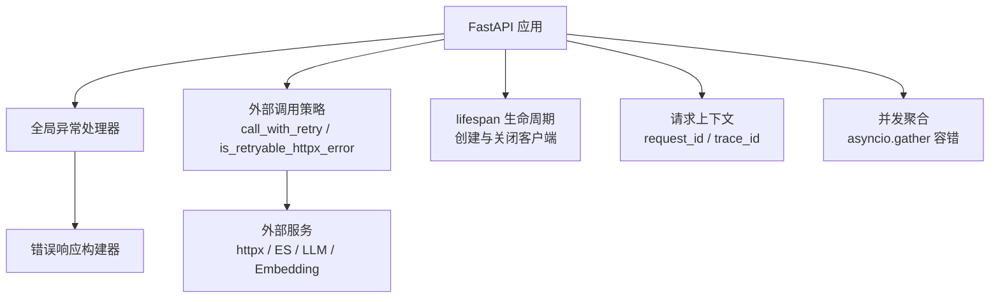
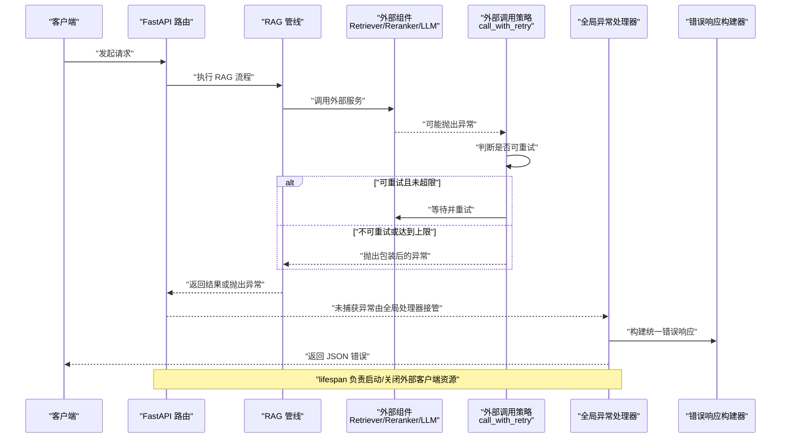
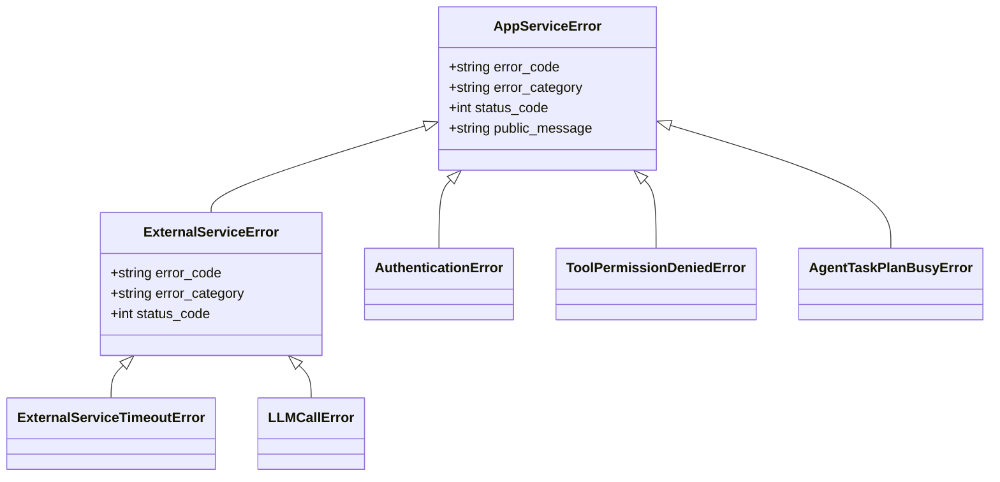
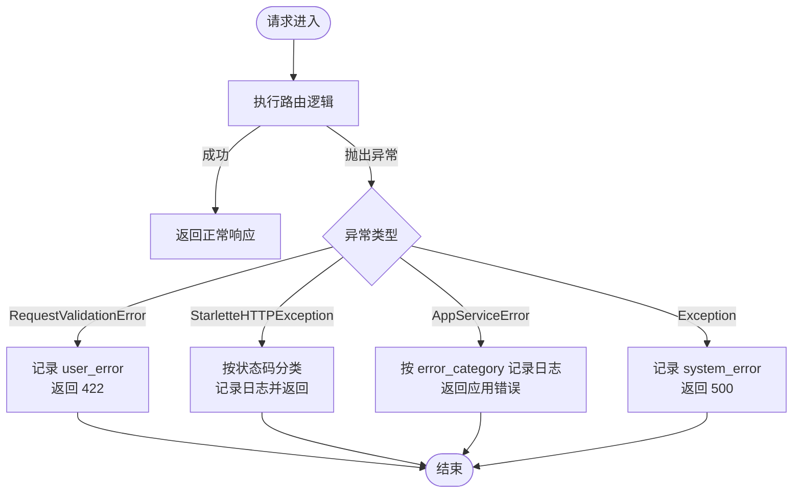
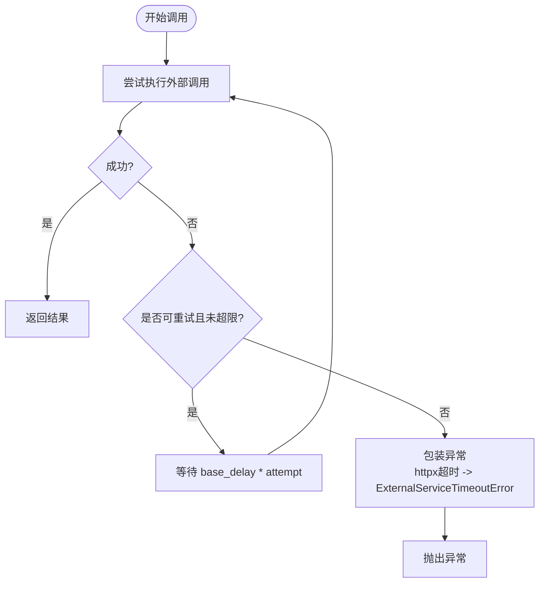
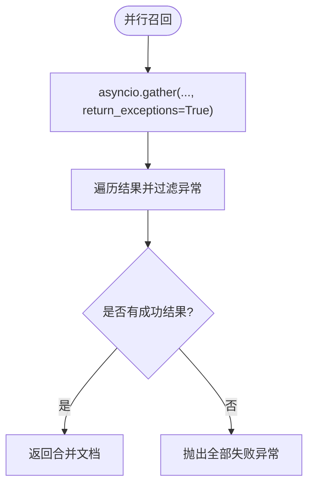
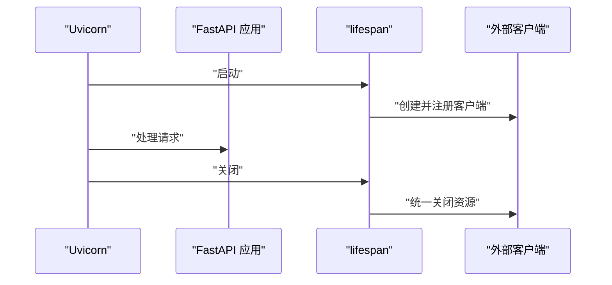
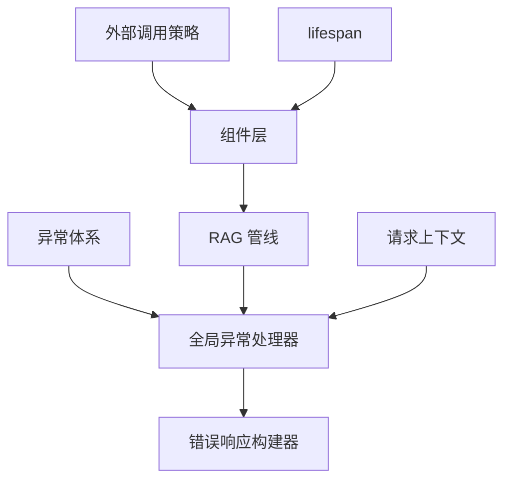

# 异步异常处理与取消

<cite>
**本文引用的文件**
- [src/fast_app/services/exceptions.py](file://src/fast_app/services/exceptions.py)
- [src/fast_app/core/exception_handlers.py](file://src/fast_app/core/exception_handlers.py)
- [src/fast_app/core/error_responses.py](file://src/fast_app/core/error_responses.py)
- [src/fast_app/services/external_call_policy.py](file://src/fast_app/services/external_call_policy.py)
- [src/fast_app/main.py](file://src/fast_app/main.py)
- [src/fast_app/core/request_context.py](file://src/fast_app/core/request_context.py)
- [src/app/async_gather_error_demo.py](file://src/app/async_gather_error_demo.py)
- [learning-docs/phase-9/9-8-超时重试降级与fallback.md](file://learning-docs/phase-9/9-8-超时重试降级与fallback.md)
- [learning-docs/phase-12/12-9-错误日志分层-用户错误-外部服务错误-系统错误.md](file://learning-docs/phase-12/12-9-错误日志分层-用户错误-外部服务错误-系统错误.md)
</cite>

## 目录
1. [简介](#简介)
2. [项目结构](#项目结构)
3. [核心组件](#核心组件)
4. [架构总览](#架构总览)
5. [详细组件分析](#详细组件分析)
6. [依赖关系分析](#依赖关系分析)
7. [性能与稳定性考虑](#性能与稳定性考虑)
8. [故障排查指南](#故障排查指南)
9. [结论](#结论)
10. [附录：实际示例与最佳实践](#附录：实际示例与最佳实践)

## 简介
本文件围绕“异步异常处理与取消”展开，结合仓库中的 FastAPI 应用、RAG 链路和外部调用策略，系统化说明以下主题：
- 异步异常类型与分类：业务异常、外部服务异常、HTTP 异常与未预期异常的边界。
- 异常传播机制：从组件层到 Pipeline、再到 HTTP 层的统一处理路径。
- 取消信号与优雅关闭：应用生命周期管理、资源释放与上下文清理。
- 自定义异常设计：基类、子类、错误码、状态码与对外消息的约定。
- 错误恢复策略：超时、重试、降级与 fallback 的组合使用。
- 流程图与模式：异常处理流程、重试流程、熔断式降级的概念图。
- 实战示例：网络超时、服务降级、资源清理的正确处理方式。

## 项目结构
本项目在异常与取消方面的关键位置包括：
- 异常定义：位于 services/exceptions.py，提供统一的业务异常族。
- 全局异常处理：位于 core/exception_handlers.py，将不同异常转换为标准 JSON 响应并记录结构化日志。
- 错误响应构建：位于 core/error_responses.py，统一返回体字段 request_id、trace_id、error_category、code、message。
- 外部调用策略：services/external_call_policy.py，封装可重试的外部调用与超时包装。
- 应用生命周期：main.py 中 lifespan 负责启动时创建外部 client、关闭时统一释放资源。
- 请求上下文：core/request_context.py，通过 ContextVar 维护 request_id 与 trace_id，贯穿异常日志。
- 并发与聚合：app/async_gather_error_demo.py 演示 asyncio.gather 的 return_exceptions 容错合并。
- 学习文档：phase-9/9-8 与 phase-12/12-9 提供了超时、重试、降级、fallback 以及错误日志分层的详细说明。

**图表来源**
- [src/fast_app/core/exception_handlers.py:26-152](file://src/fast_app/core/exception_handlers.py#L26-L152)
- [src/fast_app/core/error_responses.py:7-63](file://src/fast_app/core/error_responses.py#L7-L63)
- [src/fast_app/services/external_call_policy.py:21-74](file://src/fast_app/services/external_call_policy.py#L21-L74)
- [src/fast_app/main.py:91-122](file://src/fast_app/main.py#L91-L122)
- [src/fast_app/core/request_context.py:1-38](file://src/fast_app/core/request_context.py#L1-L38)
- [src/app/async_gather_error_demo.py:32-53](file://src/app/async_gather_error_demo.py#L32-L53)

**章节来源**
- [src/fast_app/services/exceptions.py:1-190](file://src/fast_app/services/exceptions.py#L1-L190)
- [src/fast_app/core/exception_handlers.py:26-152](file://src/fast_app/core/exception_handlers.py#L26-L152)
- [src/fast_app/core/error_responses.py:7-63](file://src/fast_app/core/error_responses.py#L7-L63)
- [src/fast_app/services/external_call_policy.py:21-74](file://src/fast_app/services/external_call_policy.py#L21-L74)
- [src/fast_app/main.py:91-122](file://src/fast_app/main.py#L91-L122)
- [src/fast_app/core/request_context.py:1-38](file://src/fast_app/core/request_context.py#L1-L38)
- [src/app/async_gather_error_demo.py:32-53](file://src/app/async_gather_error_demo.py#L32-L53)
- [learning-docs/phase-9/9-8-超时重试降级与fallback.md:227-417](file://learning-docs/phase-9/9-8-超时重试降级与fallback.md#L227-L417)
- [learning-docs/phase-12/12-9-错误日志分层-用户错误-外部服务错误-系统错误.md:460-525](file://learning-docs/phase-12/12-9-错误日志分层-用户错误-外部服务错误-系统错误.md#L460-L525)

## 核心组件
- 异常体系
  - AppServiceError：业务异常基类，包含 error_code、error_category、status_code、public_message。
  - ExternalServiceError：外部服务失败，用于归类 LLM 调用失败、Embedding 失败等。
  - ExternalServiceTimeoutError：外部服务超时，继承自 ExternalServiceError，便于区分超时与普通失败。
  - 其他领域异常：如认证失败、权限拒绝、任务计划冲突、知识库版本未就绪等。
- 全局异常处理器
  - RequestValidationError：参数校验失败，返回 422 并记录 user_error。
  - StarletteHTTPException：HTTP 异常，按状态码区分 user/system 错误。
  - AppServiceError：业务异常，按 error_category 选择 warning 或 error 级别日志。
  - Exception：兜底捕获未预期异常，返回 500 并记录 system_error。
- 错误响应构建
  - 统一返回体包含 code、message、error_category、request_id、trace_id。
  - 内部错误、HTTP 错误、应用错误分别有专用构建函数。
- 外部调用策略
  - is_retryable_httpx_error：判断 httpx 超时、传输错误、特定 5xx/429 是否可重试。
  - call_with_retry：通用异步重试封装，支持最大重试次数、基础延迟、可重试判定函数，并将 httpx 超时包装为 ExternalServiceTimeoutError。
- 应用生命周期与资源清理
  - lifespan 启动阶段创建 Milvus、ElasticSearch、httpx、Redis、Deep Agent runtime、数据库引擎等。
  - lifespan 关闭阶段统一调用 close/aclose/dispose 释放资源，确保优雅关闭。
- 请求上下文
  - 使用 ContextVar 维护 request_id 与 trace_id，贯穿异常日志，便于追踪。

**章节来源**
- [src/fast_app/services/exceptions.py:1-190](file://src/fast_app/services/exceptions.py#L1-L190)
- [src/fast_app/core/exception_handlers.py:26-152](file://src/fast_app/core/exception_handlers.py#L26-L152)
- [src/fast_app/core/error_responses.py:7-63](file://src/fast_app/core/error_responses.py#L7-L63)
- [src/fast_app/services/external_call_policy.py:21-74](file://src/fast_app/services/external_call_policy.py#L21-L74)
- [src/fast_app/main.py:91-122](file://src/fast_app/main.py#L91-L122)
- [src/fast_app/core/request_context.py:1-38](file://src/fast_app/core/request_context.py#L1-L38)

## 架构总览
下图展示从请求进入、异常产生、异常分类、重试与降级、到最终响应与资源释放的整体流程。

**图表来源**
- [src/fast_app/services/external_call_policy.py:37-74](file://src/fast_app/services/external_call_policy.py#L37-L74)
- [src/fast_app/core/exception_handlers.py:26-152](file://src/fast_app/core/exception_handlers.py#L26-L152)
- [src/fast_app/core/error_responses.py:7-63](file://src/fast_app/core/error_responses.py#L7-L63)
- [src/fast_app/main.py:91-122](file://src/fast_app/main.py#L91-L122)

## 详细组件分析

### 异常体系与分类
- 基类 AppServiceError 定义了统一的错误元信息（error_code、error_category、status_code、public_message），使上层可以按类别处理。
- ExternalServiceError 及其子类 ExternalServiceTimeoutError、LLMCallError 将外部服务失败进行细分，便于日志与监控识别。
- 领域异常如 AuthenticationError、ToolPermissionDeniedError、AgentTaskPlanBusyError 等，覆盖认证、权限、并发控制等场景。
- 错误分类遵循“用户错误、外部服务错误、系统错误”三层，便于日志分级与告警策略。

**图表来源**
- [src/fast_app/services/exceptions.py:1-190](file://src/fast_app/services/exceptions.py#L1-L190)

**章节来源**
- [src/fast_app/services/exceptions.py:1-190](file://src/fast_app/services/exceptions.py#L1-L190)

### 全局异常处理与响应构建
- RequestValidationError：参数校验失败，返回 422，记录 user_error 并附带验证错误数量。
- StarletteHTTPException：根据状态码决定 user/system 错误，记录对应日志并返回 HTTP 错误响应。
- AppServiceError：按 error_category 选择 warning 或 error 级别日志，返回应用错误响应。
- Exception：兜底捕获未预期异常，记录 system_error 并返回 500 内部错误。
- 错误响应构建器统一返回 code、message、error_category、request_id、trace_id，保证接口一致性。

**图表来源**
- [src/fast_app/core/exception_handlers.py:26-152](file://src/fast_app/core/exception_handlers.py#L26-L152)
- [src/fast_app/core/error_responses.py:7-63](file://src/fast_app/core/error_responses.py#L7-L63)

**章节来源**
- [src/fast_app/core/exception_handlers.py:26-152](file://src/fast_app/core/exception_handlers.py#L26-L152)
- [src/fast_app/core/error_responses.py:7-63](file://src/fast_app/core/error_responses.py#L7-L63)
- [learning-docs/phase-12/12-9-错误日志分层-用户错误-外部服务错误-系统错误.md:460-525](file://learning-docs/phase-12/12-9-错误日志分层-用户错误-外部服务错误-系统错误.md#L460-L525)

### 外部调用策略：超时、重试与降级
- is_retryable_httpx_error：仅对超时、传输错误及特定 5xx/429 进行重试，避免对 400/401/403/404 等配置或参数错误盲目重试。
- call_with_retry：封装异步操作，支持最大重试次数与基础延迟；当发生 httpx 超时时包装为 ExternalServiceTimeoutError，便于上层统一处理。
- 降级与 fallback：在 RAG 链路中，rerank 作为质量增强步骤，失败时可退回 retrieve/RRF 结果，保持核心能力可用。
- 配置化：timeout、retry 参数可通过 Settings 管理，便于在不同环境调整。

**图表来源**
- [src/fast_app/services/external_call_policy.py:21-74](file://src/fast_app/services/external_call_policy.py#L21-L74)
- [learning-docs/phase-9/9-8-超时重试降级与fallback.md:345-417](file://learning-docs/phase-9/9-8-超时重试降级与fallback.md#L345-L417)

**章节来源**
- [src/fast_app/services/external_call_policy.py:21-74](file://src/fast_app/services/external_call_policy.py#L21-L74)
- [learning-docs/phase-9/9-8-超时重试降级与fallback.md:227-417](file://learning-docs/phase-9/9-8-超时重试降级与fallback.md#L227-L417)

### 并发聚合与局部降级
- asyncio.gather 配合 return_exceptions=True，可在混合检索中容忍单路失败，继续合并成功结果。
- 若所有召回源均失败，则向上抛出明确异常，避免静默失败。
- 该模式体现了“局部降级”的思想：部分能力不可用时，尽量保留可用结果。

**图表来源**
- [src/app/async_gather_error_demo.py:32-53](file://src/app/async_gather_error_demo.py#L32-L53)

**章节来源**
- [src/app/async_gather_error_demo.py:32-53](file://src/app/async_gather_error_demo.py#L32-L53)

### 取消信号与优雅关闭
- lifespan 统一管理外部客户端的生命周期，确保进程退出时正确释放连接池、会话等资源。
- 关闭顺序包括 Milvus、ElasticSearch、httpx、Redis、Deep Agent runtime、数据库引擎等，避免资源泄漏。
- 对于长耗时任务，应在合适的上下文中使用 try/finally 或 asynccontextmanager，确保即使异常也能释放锁与资源。

**图表来源**
- [src/fast_app/main.py:91-122](file://src/fast_app/main.py#L91-L122)

**章节来源**
- [src/fast_app/main.py:91-122](file://src/fast_app/main.py#L91-L122)

## 依赖关系分析
- 异常体系被全局异常处理器引用，用于分类与响应构建。
- 外部调用策略被组件层（如 Reranker、Retriever、LLM 客户端）引用，实现统一的超时与重试。
- 请求上下文贯穿异常日志，确保每个错误都携带 request_id 与 trace_id。
- lifespan 与依赖注入共同管理外部客户端，降低耦合度并提升可测试性。

**图表来源**
- [src/fast_app/services/exceptions.py:1-190](file://src/fast_app/services/exceptions.py#L1-L190)
- [src/fast_app/core/exception_handlers.py:26-152](file://src/fast_app/core/exception_handlers.py#L26-L152)
- [src/fast_app/core/error_responses.py:7-63](file://src/fast_app/core/error_responses.py#L7-L63)
- [src/fast_app/services/external_call_policy.py:21-74](file://src/fast_app/services/external_call_policy.py#L21-L74)
- [src/fast_app/core/request_context.py:1-38](file://src/fast_app/core/request_context.py#L1-L38)
- [src/fast_app/main.py:91-122](file://src/fast_app/main.py#L91-L122)

**章节来源**
- [src/fast_app/services/exceptions.py:1-190](file://src/fast_app/services/exceptions.py#L1-L190)
- [src/fast_app/core/exception_handlers.py:26-152](file://src/fast_app/core/exception_handlers.py#L26-L152)
- [src/fast_app/core/error_responses.py:7-63](file://src/fast_app/core/error_responses.py#L7-L63)
- [src/fast_app/services/external_call_policy.py:21-74](file://src/fast_app/services/external_call_policy.py#L21-L74)
- [src/fast_app/core/request_context.py:1-38](file://src/fast_app/core/request_context.py#L1-L38)
- [src/fast_app/main.py:91-122](file://src/fast_app/main.py#L91-L122)

## 性能与稳定性考虑
- 超时优先：每次外部调用应设置合理 timeout，避免请求无限等待。
- 有限重试：仅对可重试错误进行短暂重试，避免雪崩与放大效应。
- 降级与 fallback：对非核心步骤（如 rerank）允许失败后继续使用已有结果，保障基本功能。
- 资源管理：通过 lifespan 集中管理外部客户端，减少连接泄漏与内存占用。
- 日志分层：按 user_error、external_service_error、system_error 分级记录，便于监控与告警。

[本节为通用指导，不直接分析具体文件]

## 故障排查指南
- 定位问题：通过 request_id 与 trace_id 关联日志，快速定位请求链路。
- 识别异常类型：根据 error_category 与 error_code 判断是用户错误、外部服务错误或系统错误。
- 检查重试策略：确认 is_retryable_httpx_error 是否正确匹配当前异常，避免无效重试。
- 验证降级行为：确认 rerank 失败时是否回退到 retrieve/RRF 结果，避免整体失败。
- 资源清理：检查 lifespan 关闭逻辑是否覆盖了所有外部客户端，避免资源泄漏。

**章节来源**
- [src/fast_app/core/request_context.py:1-38](file://src/fast_app/core/request_context.py#L1-L38)
- [src/fast_app/core/exception_handlers.py:26-152](file://src/fast_app/core/exception_handlers.py#L26-L152)
- [src/fast_app/services/external_call_policy.py:21-74](file://src/fast_app/services/external_call_policy.py#L21-L74)
- [src/fast_app/main.py:91-122](file://src/fast_app/main.py#L91-L122)

## 结论
本项目建立了清晰的异步异常处理与取消机制：
- 异常分类明确，覆盖业务、外部服务与系统错误。
- 全局异常处理器统一转换响应并记录结构化日志。
- 外部调用策略提供超时、重试与降级能力，提升稳定性。
- lifespan 管理资源生命周期，确保优雅关闭。
- 并发聚合与局部降级增强鲁棒性，避免单点失败影响整体。

[本节为总结，不直接分析具体文件]

## 附录：实际示例与最佳实践

### 网络超时处理
- 使用 call_with_retry 包裹外部调用，自动将 httpx 超时包装为 ExternalServiceTimeoutError。
- 配置合理的 timeout 与重试次数，避免过度重试导致负载上升。
- 在日志中记录 operation_name、attempt、delay、error，便于追踪。

**章节来源**
- [src/fast_app/services/external_call_policy.py:37-74](file://src/fast_app/services/external_call_policy.py#L37-L74)
- [learning-docs/phase-9/9-8-超时重试降级与fallback.md:345-417](file://learning-docs/phase-9/9-8-超时重试降级与fallback.md#L345-L417)

### 服务降级与 fallback
- 对非核心步骤（如 rerank）增加 fallback，失败时退回 retrieve/RRF 结果。
- 在 Pipeline 层捕获 ExternalServiceError，记录 warning 并继续执行后续流程。
- 保持返回格式一致，避免下游因数据量变化而异常。

**章节来源**
- [learning-docs/phase-9/9-8-超时重试降级与fallback.md:270-304](file://learning-docs/phase-9/9-8-超时重试降级与fallback.md#L270-L304)

### 资源清理与优雅关闭
- 在 lifespan 中统一创建与关闭外部客户端，确保进程退出时释放资源。
- 使用 try/finally 或 asynccontextmanager 保护临界区，确保异常情况下也能释放锁与资源。
- 记录关闭日志，便于运维确认资源释放情况。

**章节来源**
- [src/fast_app/main.py:91-122](file://src/fast_app/main.py#L91-L122)

### 并发聚合与容错
- 使用 asyncio.gather 与 return_exceptions=True 并行执行多个召回源，容忍单路失败。
- 合并成功结果，若全部失败则抛出明确异常，避免静默失败。
- 在日志中记录各召回源的成功/失败情况，便于分析。

**章节来源**
- [src/app/async_gather_error_demo.py:32-53](file://src/app/async_gather_error_demo.py#L32-L53)