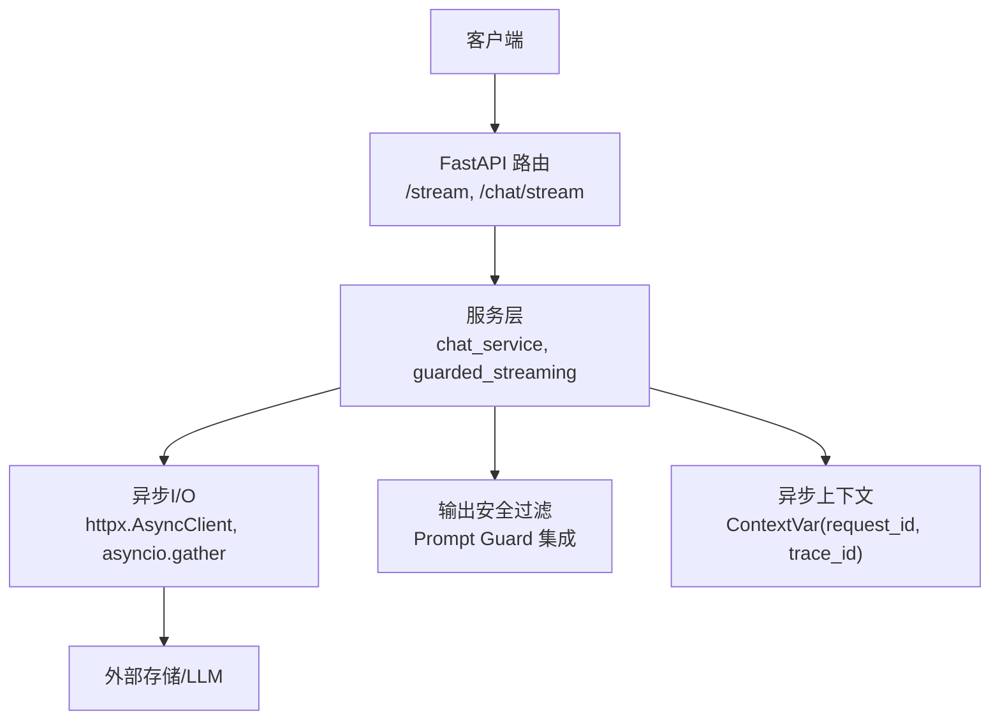
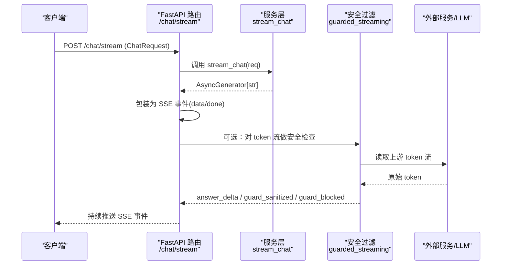
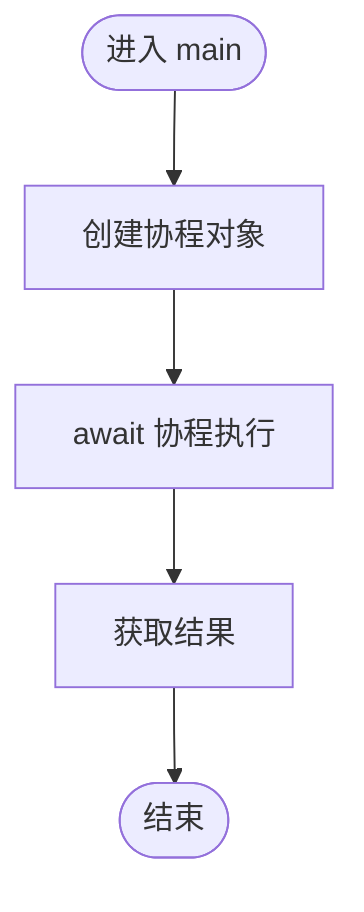
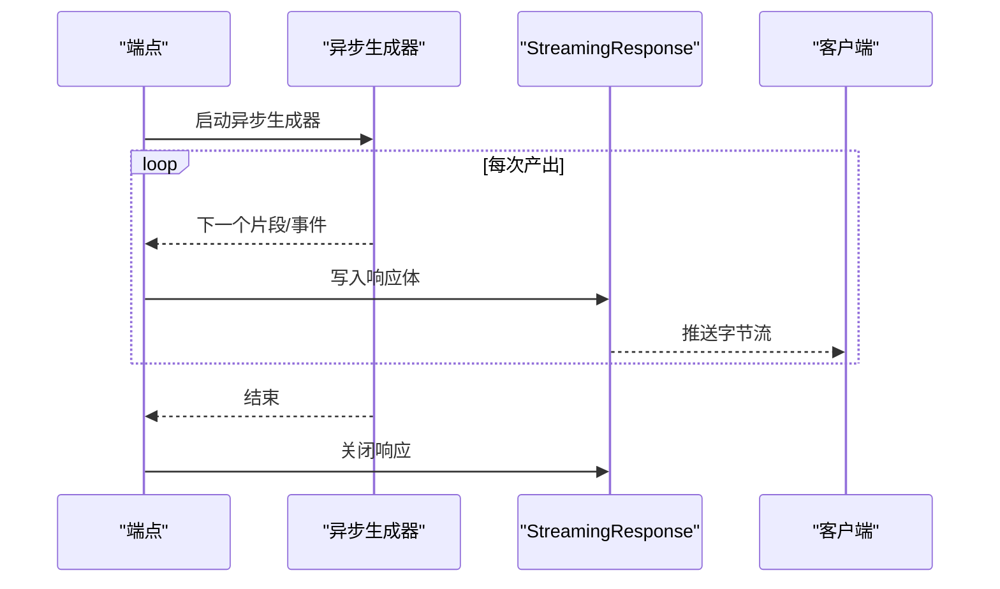
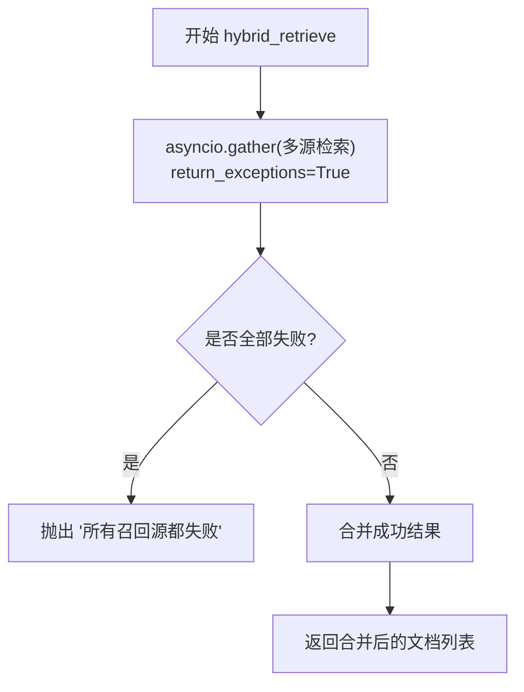
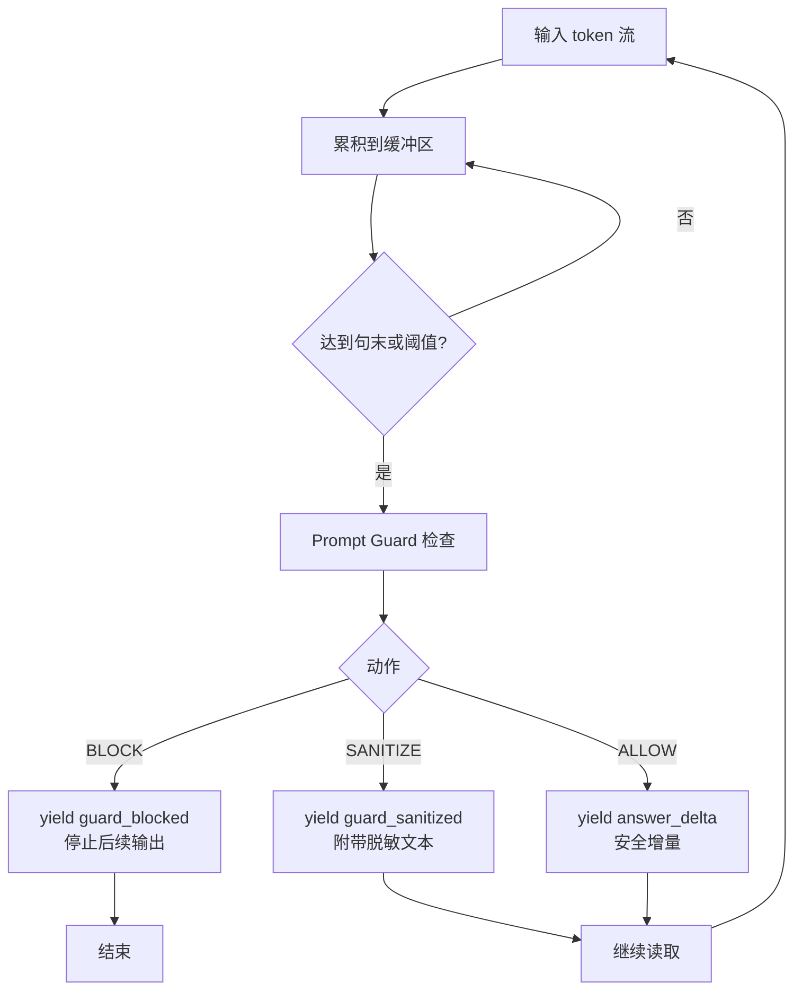
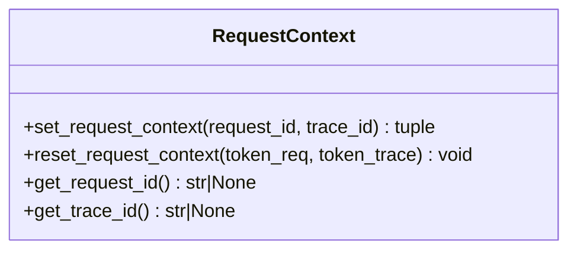
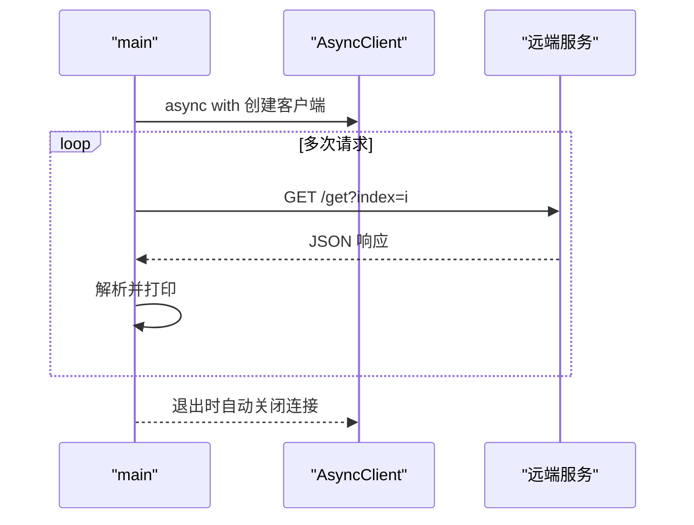
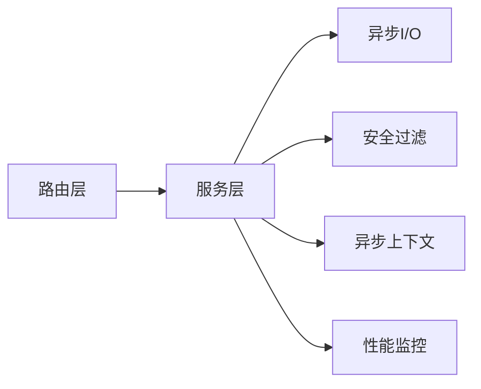

# 异步通信机制

<cite>
**本文引用的文件**
- [src/app/async_demo_1.py](file://python-agent-study/src/app/async_demo_1.py)
- [src/app/async_stream_demo.py](file://python-agent-study/src/app/async_stream_demo.py)
- [src/app/async_rag_stream_demo.py](file://python-agent-study/src/app/async_rag_stream_demo.py)
- [src/app/async_gather_error_demo.py](file://python-agent-study/src/app/async_gather_error_demo.py)
- [src/app/httpx_learning/httpx_04_async_client.py](file://python-agent-study/src/app/httpx_learning/httpx_04_async_client.py)
- [src/fast_app/api/stream_routes.py](file://python-agent-study/src/fast_app/api/stream_routes.py)
- [src/fast_app/api/chat_routes.py](file://python-agent-study/src/fast_app/api/chat_routes.py)
- [src/fast_app/services/chat_service.py](file://python-agent-study/src/fast_app/services/chat_service.py)
- [src/fast_app/services/rag/guarded_streaming.py](file://python-agent-study/src/fast_app/services/rag/guarded_streaming.py)
- [src/fast_app/core/request_context.py](file://python-agent-study/src/fast_app/core/request_context.py)
- [src/fast_app/core/latency.py](file://python-agent-study/src/fast_app/core/latency.py)
</cite>

## 目录
1. [简介](#简介)
2. [项目结构](#项目结构)
3. [核心组件](#核心组件)
4. [架构总览](#架构总览)
5. [详细组件分析](#详细组件分析)
6. [依赖关系分析](#依赖关系分析)
7. [性能考量](#性能考量)
8. [故障排查指南](#故障排查指南)
9. [结论](#结论)
10. [附录](#附录)

## 简介
本文件围绕基于 asyncio 的异步通信机制，系统梳理并发检索、流式输出、异步任务编排等典型场景；解释 async/await 使用模式、协程管理与资源释放；说明异步上下文传递、异常处理与取消机制；并提供流程图、并发控制策略与性能监控建议。文档中的示例均来自仓库内现有实现，便于读者对照源码理解工程实践。

## 项目结构
本项目在 FastAPI 服务层提供 HTTP 流式接口（SSE），在服务内部通过异步生成器与异步 I/O 完成数据生产与传输；同时提供多种异步调用与并发检索示例，涵盖错误隔离、超时与资源管理。

图表来源
- [src/fast_app/api/stream_routes.py:1-38](file://python-agent-study/src/fast_app/api/stream_routes.py#L1-L38)
- [src/fast_app/api/chat_routes.py:1-32](file://python-agent-study/src/fast_app/api/chat_routes.py#L1-L32)
- [src/fast_app/services/chat_service.py:1-24](file://python-agent-study/src/fast_app/services/chat_service.py#L1-L24)
- [src/fast_app/services/rag/guarded_streaming.py:1-222](file://python-agent-study/src/fast_app/services/rag/guarded_streaming.py#L1-L222)
- [src/fast_app/core/request_context.py:1-39](file://python-agent-study/src/fast_app/core/request_context.py#L1-L39)

章节来源
- [src/fast_app/api/stream_routes.py:1-38](file://python-agent-study/src/fast_app/api/stream_routes.py#L1-L38)
- [src/fast_app/api/chat_routes.py:1-32](file://python-agent-study/src/fast_app/api/chat_routes.py#L1-L32)

## 核心组件
- 异步流式端点：将异步生成器包装为 StreamingResponse，支持文本流与 SSE 事件流。
- 聊天服务：同步与流式两种返回方式，流式以字符粒度逐步产出。
- 混合检索与流式回答：并发检索多个数据源，合并后进入 LLM 流式输出。
- 输出安全过滤：对 LLM 流进行句子级缓冲与 Prompt Guard 检查，支持阻断、脱敏与安全放行。
- 异步上下文：使用 ContextVar 在协程间传递请求追踪信息。
- 性能监控：提供高精度计时与慢操作告警工具。

章节来源
- [src/fast_app/api/stream_routes.py:1-38](file://python-agent-study/src/fast_app/api/stream_routes.py#L1-L38)
- [src/fast_app/api/chat_routes.py:1-32](file://python-agent-study/src/fast_app/api/chat_routes.py#L1-L32)
- [src/fast_app/services/chat_service.py:1-24](file://python-agent-study/src/fast_app/services/chat_service.py#L1-L24)
- [src/app/async_rag_stream_demo.py:1-81](file://python-agent-study/src/app/async_rag_stream_demo.py#L1-L81)
- [src/fast_app/services/rag/guarded_streaming.py:1-222](file://python-agent-study/src/fast_app/services/rag/guarded_streaming.py#L1-L222)
- [src/fast_app/core/request_context.py:1-39](file://python-agent-study/src/fast_app/core/request_context.py#L1-L39)
- [src/fast_app/core/latency.py:1-38](file://python-agent-study/src/fast_app/core/latency.py#L1-L38)

## 架构总览
下图展示一次“聊天流式”请求从客户端到服务端再到下游服务的完整调用链，包括 SSE 封装、流式生成、安全过滤与上下文传递。

图表来源
- [src/fast_app/api/chat_routes.py:1-32](file://python-agent-study/src/fast_app/api/chat_routes.py#L1-L32)
- [src/fast_app/services/chat_service.py:1-24](file://python-agent-study/src/fast_app/services/chat_service.py#L1-L24)
- [src/fast_app/services/rag/guarded_streaming.py:1-222](file://python-agent-study/src/fast_app/services/rag/guarded_streaming.py#L1-L222)

## 详细组件分析

### 异步基础与协程生命周期
- 协程创建与执行：定义 async def 仅创建协程对象，需 await 或放入事件循环执行。
- 异步生成器：使用 yield 产生值，配合 async for 消费，适合流式数据。
- 资源管理：使用 async with 管理连接/会话等资源，确保异常路径也能释放。

图表来源
- [src/app/async_demo_1.py:1-23](file://python-agent-study/src/app/async_demo_1.py#L1-L23)

章节来源
- [src/app/async_demo_1.py:1-23](file://python-agent-study/src/app/async_demo_1.py#L1-L23)
- [src/app/async_stream_demo.py:1-30](file://python-agent-study/src/app/async_stream_demo.py#L1-L30)

### 流式输出与 SSE 封装
- 文本流：异步生成器按片段 yield，FastAPI 用 StreamingResponse 直接发送。
- SSE 事件：在生成器中按 SSE 协议拼装 data/event 行，并在结束时发送 done 事件。
- 聊天流：服务层按字符粒度产出，路由层将其转换为 SSE 事件并推送。

图表来源
- [src/fast_app/api/stream_routes.py:1-38](file://python-agent-study/src/fast_app/api/stream_routes.py#L1-L38)
- [src/fast_app/api/chat_routes.py:1-32](file://python-agent-study/src/fast_app/api/chat_routes.py#L1-L32)
- [src/fast_app/services/chat_service.py:1-24](file://python-agent-study/src/fast_app/services/chat_service.py#L1-L24)

章节来源
- [src/fast_app/api/stream_routes.py:1-38](file://python-agent-study/src/fast_app/api/stream_routes.py#L1-L38)
- [src/fast_app/api/chat_routes.py:1-32](file://python-agent-study/src/fast_app/api/chat_routes.py#L1-L32)
- [src/fast_app/services/chat_service.py:1-24](file://python-agent-study/src/fast_app/services/chat_service.py#L1-L24)

### 并发检索与错误隔离
- 并发聚合：使用 asyncio.gather 并行发起多个检索任务，合并结果。
- 错误隔离：通过 return_exceptions=True 收集异常，避免单源失败导致整体失败。
- 降级策略：当所有源失败时抛出明确错误；部分失败时仍可返回可用结果。

图表来源
- [src/app/async_rag_stream_demo.py:14-46](file://python-agent-study/src/app/async_rag_stream_demo.py#L14-L46)
- [src/app/async_gather_error_demo.py:13-53](file://python-agent-study/src/app/async_gather_error_demo.py#L13-L53)

章节来源
- [src/app/async_rag_stream_demo.py:14-46](file://python-agent-study/src/app/async_rag_stream_demo.py#L14-L46)
- [src/app/async_gather_error_demo.py:13-53](file://python-agent-study/src/app/async_gather_error_demo.py#L13-L53)

### 流式回答与输出安全过滤
- 句子级缓冲：按句号或最大长度切分片段，减少首包延迟的同时保证安全边界。
- 三种模式：
  - buffer_then_emit：先缓冲完整回答再检查，安全性最强但首包延迟最高。
  - pre_guard_only：先发出原始 token，结束后审计，用于兼容或观察。
  - sentence_buffer（默认）：边缓冲边检查，平衡体验与安全。
- 事件类型：answer_delta（安全增量）、guard_sanitized（已脱敏）、guard_blocked（高风险阻断）。

图表来源
- [src/fast_app/services/rag/guarded_streaming.py:36-133](file://python-agent-study/src/fast_app/services/rag/guarded_streaming.py#L36-L133)
- [src/fast_app/services/rag/guarded_streaming.py:148-221](file://python-agent-study/src/fast_app/services/rag/guarded_streaming.py#L148-L221)

章节来源
- [src/fast_app/services/rag/guarded_streaming.py:36-133](file://python-agent-study/src/fast_app/services/rag/guarded_streaming.py#L36-L133)
- [src/fast_app/services/rag/guarded_streaming.py:148-221](file://python-agent-study/src/fast_app/services/rag/guarded_streaming.py#L148-L221)

### 异步上下文传递与追踪
- 使用 ContextVar 在协程间传递 request_id 与 trace_id，确保日志与链路追踪一致性。
- 提供 set/reset 方法，在请求入口设置、出口恢复，避免跨请求污染。

图表来源
- [src/fast_app/core/request_context.py:1-39](file://python-agent-study/src/fast_app/core/request_context.py#L1-L39)

章节来源
- [src/fast_app/core/request_context.py:1-39](file://python-agent-study/src/fast_app/core/request_context.py#L1-L39)

### 异步网络调用与资源管理
- 使用 httpx.AsyncClient 进行非阻塞 HTTP 调用，支持超时配置。
- 通过 async with 自动管理连接生命周期，避免连接泄漏。

图表来源
- [src/app/httpx_learning/httpx_04_async_client.py:1-26](file://python-agent-study/src/app/httpx_learning/httpx_04_async_client.py#L1-L26)

章节来源
- [src/app/httpx_learning/httpx_04_async_client.py:1-26](file://python-agent-study/src/app/httpx_learning/httpx_04_async_client.py#L1-L26)

## 依赖关系分析
- 路由层依赖服务层：/chat/stream 依赖 chat_service.stream_chat。
- 服务层依赖外部 I/O：LLM、向量库、关键词检索等。
- 安全过滤作为中间层：可插入到任意 token 流上游与下游之间。
- 上下文与监控：request_context 与 latency 被广泛复用，贯穿各层。

图表来源
- [src/fast_app/api/chat_routes.py:1-32](file://python-agent-study/src/fast_app/api/chat_routes.py#L1-L32)
- [src/fast_app/services/chat_service.py:1-24](file://python-agent-study/src/fast_app/services/chat_service.py#L1-L24)
- [src/fast_app/services/rag/guarded_streaming.py:1-222](file://python-agent-study/src/fast_app/services/rag/guarded_streaming.py#L1-L222)
- [src/fast_app/core/request_context.py:1-39](file://python-agent-study/src/fast_app/core/request_context.py#L1-L39)
- [src/fast_app/core/latency.py:1-38](file://python-agent-study/src/fast_app/core/latency.py#L1-L38)

章节来源
- [src/fast_app/api/chat_routes.py:1-32](file://python-agent-study/src/fast_app/api/chat_routes.py#L1-L32)
- [src/fast_app/services/chat_service.py:1-24](file://python-agent-study/src/fast_app/services/chat_service.py#L1-L24)
- [src/fast_app/services/rag/guarded_streaming.py:1-222](file://python-agent-study/src/fast_app/services/rag/guarded_streaming.py#L1-L222)
- [src/fast_app/core/request_context.py:1-39](file://python-agent-study/src/fast_app/core/request_context.py#L1-L39)
- [src/fast_app/core/latency.py:1-38](file://python-agent-study/src/fast_app/core/latency.py#L1-L38)

## 性能考量
- 并发度控制：使用 asyncio.gather 并行调用独立 I/O，注意上限以避免过载。
- 流式缓冲大小：根据业务调整句子缓冲阈值，平衡首包延迟与安全性。
- 超时与重试：为外部调用设置合理超时；对幂等操作可加重试与退避。
- 慢操作监控：利用 latency 工具记录关键路径耗时，触发告警。
- 资源释放：统一使用 async with 管理连接与会话，避免内存与连接泄漏。

[本节为通用指导，不直接分析具体文件]

## 故障排查指南
- 并发检索失败：检查 gather 的 return_exceptions 分支，确认是否出现“所有召回源都失败”的兜底逻辑。
- 流式中断：确认生成器是否正确 yield 结束标记（如 done），以及 StreamingResponse 是否正常关闭。
- 安全阻断：若出现 guard_blocked，检查 Prompt Guard 配置与阈值，必要时切换至更宽松模式。
- 上下文丢失：确认在请求入口设置 request_id/trace_id，并在出口 reset，避免跨协程污染。
- 性能退化：结合 latency 工具定位慢步骤，优化 I/O 并发与缓冲策略。

章节来源
- [src/app/async_gather_error_demo.py:13-53](file://python-agent-study/src/app/async_gather_error_demo.py#L13-L53)
- [src/fast_app/api/stream_routes.py:1-38](file://python-agent-study/src/fast_app/api/stream_routes.py#L1-L38)
- [src/fast_app/services/rag/guarded_streaming.py:36-133](file://python-agent-study/src/fast_app/services/rag/guarded_streaming.py#L36-L133)
- [src/fast_app/core/request_context.py:1-39](file://python-agent-study/src/fast_app/core/request_context.py#L1-L39)
- [src/fast_app/core/latency.py:1-38](file://python-agent-study/src/fast_app/core/latency.py#L1-L38)

## 结论
本项目通过 FastAPI 的 StreamingResponse 与 Python 的异步生成器实现了高效的流式通信；借助 asyncio.gather 实现高并发检索；通过句子级缓冲与 Prompt Guard 保障输出安全；使用 ContextVar 实现协程级上下文传递；并以 latency 工具支撑性能监控。上述模式适用于高并发、低延迟、强安全的 AI 服务场景。

[本节为总结性内容，不直接分析具体文件]

## 附录
- 实际示例参考：
  - 基础异步与流式：[src/app/async_demo_1.py](file://python-agent-study/src/app/async_demo_1.py), [src/app/async_stream_demo.py](file://python-agent-study/src/app/async_stream_demo.py)
  - 混合检索与流式回答：[src/app/async_rag_stream_demo.py](file://python-agent-study/src/app/async_rag_stream_demo.py)
  - 并发错误隔离：[src/app/async_gather_error_demo.py](file://python-agent-study/src/app/async_gather_error_demo.py)
  - 异步 HTTP 客户端：[src/app/httpx_learning/httpx_04_async_client.py](file://python-agent-study/src/app/httpx_learning/httpx_04_async_client.py)
  - 流式端点与 SSE：[src/fast_app/api/stream_routes.py](file://python-agent-study/src/fast_app/api/stream_routes.py), [src/fast_app/api/chat_routes.py](file://python-agent-study/src/fast_app/api/chat_routes.py)
  - 聊天服务流式实现：[src/fast_app/services/chat_service.py](file://python-agent-study/src/fast_app/services/chat_service.py)
  - 输出安全过滤：[src/fast_app/services/rag/guarded_streaming.py](file://python-agent-study/src/fast_app/services/rag/guarded_streaming.py)
  - 异步上下文：[src/fast_app/core/request_context.py](file://python-agent-study/src/fast_app/core/request_context.py)
  - 性能监控：[src/fast_app/core/latency.py](file://python-agent-study/src/fast_app/core/latency.py)

[本节为索引性内容，不直接分析具体文件]