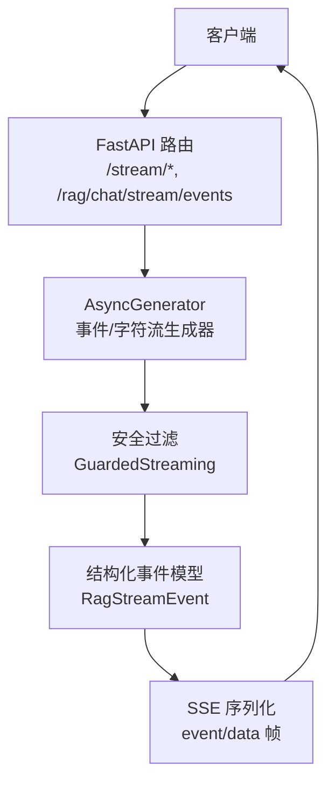
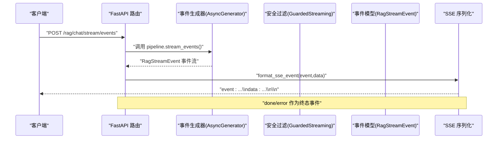
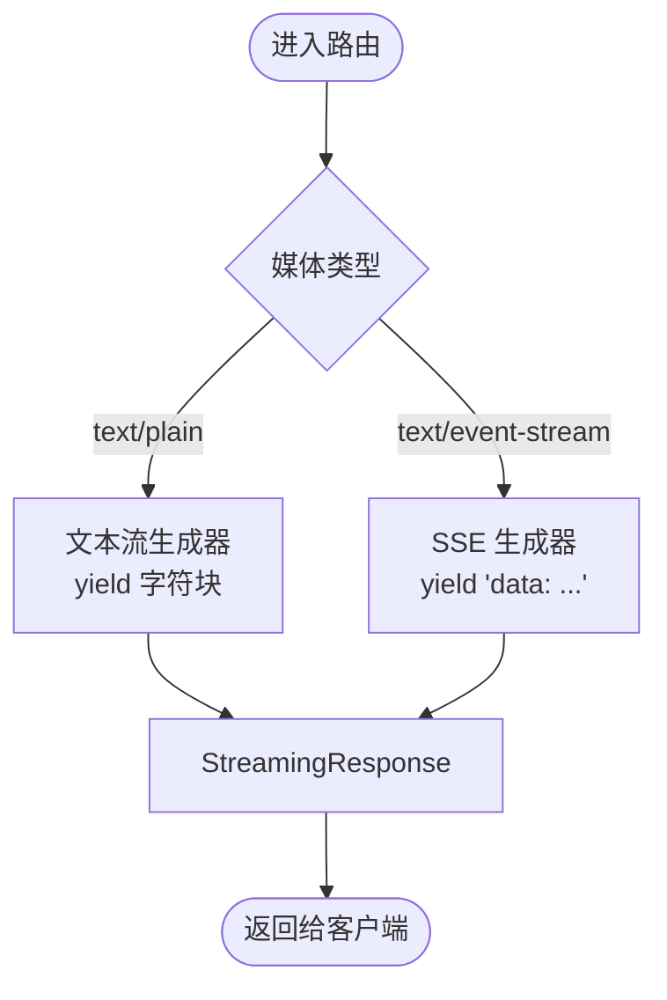
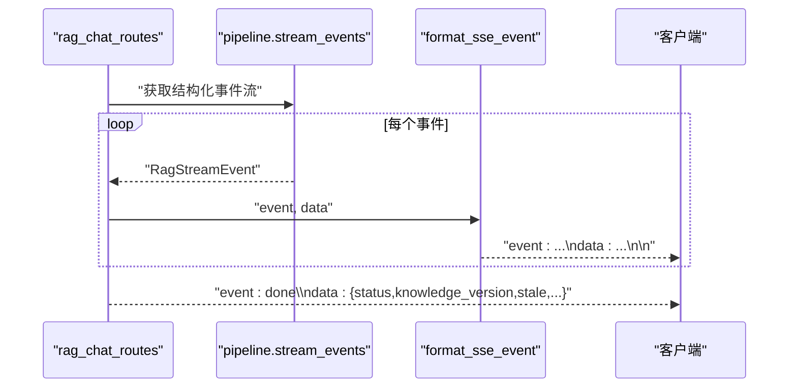
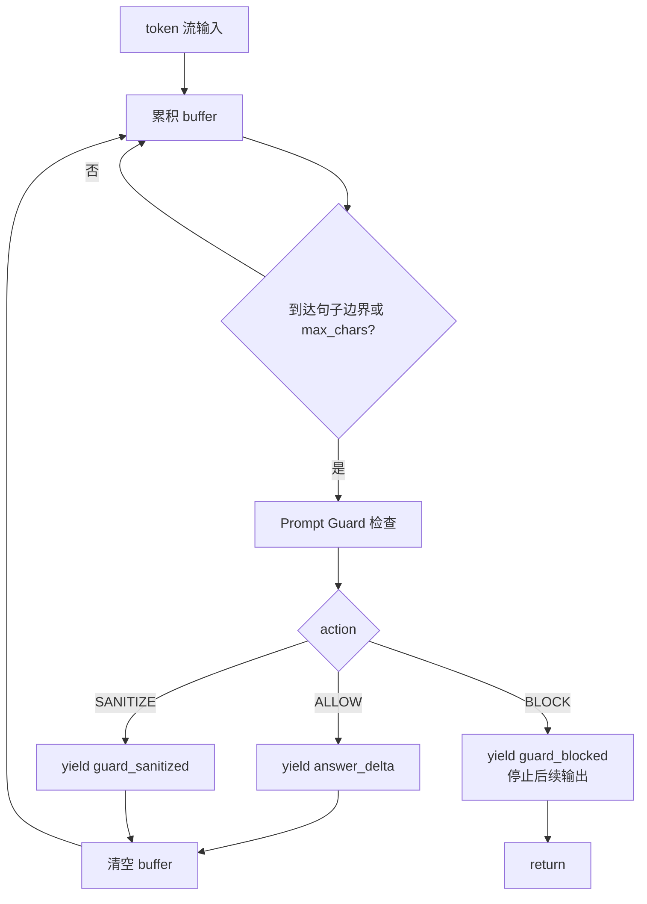
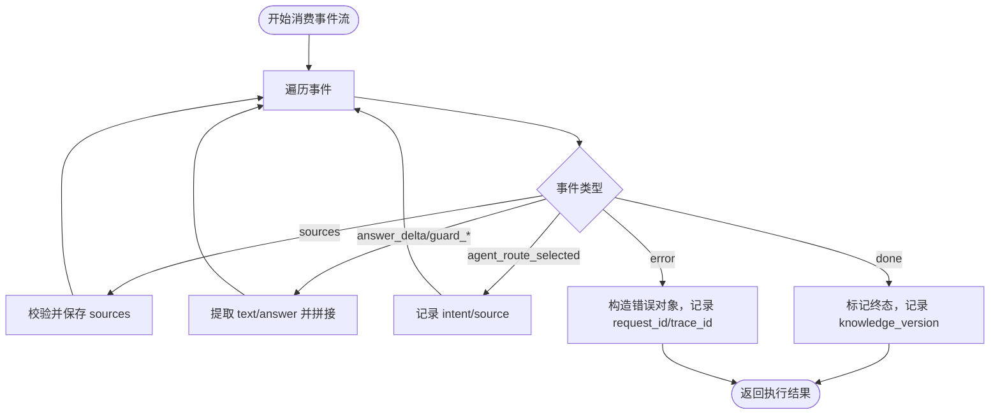
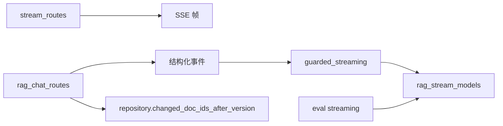

# 流式输出机制

<cite>
**本文引用的文件**
- [src/fast_app/api/stream_routes.py](file://src/fast_app/api/stream_routes.py)
- [src/fast_app/api/rag_chat_routes.py](file://src/fast_app/api/rag_chat_routes.py)
- [src/fast_app/services/rag/guarded_streaming.py](file://src/fast_app/services/rag/guarded_streaming.py)
- [src/fast_app/domain/rag_stream_models.py](file://src/fast_app/domain/rag_stream_models.py)
- [src/app/async_sse_format_demo.py](file://src/app/async_sse_format_demo.py)
- [src/app/async_rag_stream_demo.py](file://src/app/async_rag_stream_demo.py)
- [src/app/async_stream_demo.py](file://src/app/async_stream_demo.py)
- [src/fast_app/rag_eval/streaming.py](file://src/fast_app/rag_eval/streaming.py)
- [scripts/tests/document_security/test_guarded_streaming.py](file://scripts/tests/document_security/test_guarded_streaming.py)
</cite>

## 目录
1. [简介](#简介)
2. [项目结构](#项目结构)
3. [核心组件](#核心组件)
4. [架构总览](#架构总览)
5. [详细组件分析](#详细组件分析)
6. [依赖关系分析](#依赖关系分析)
7. [性能考虑](#性能考虑)
8. [故障排查指南](#故障排查指南)
9. [结论](#结论)
10. [附录](#附录)

## 简介
本文件系统化梳理本项目中的流式输出机制，覆盖以下关键主题：
- 使用 AsyncGenerator 实现 token 级别的流式生成与 SSE 事件推送
- 流式安全过滤（Prompt Guard）在输出侧的拦截、脱敏与阻断
- 流式上下文传递、背压处理、取消与异常传播
- 结构化事件模型与 SSE 协议封装
- 实际示例：构建安全的流式响应、处理客户端断开连接
- 性能优化建议与可观测性要点

## 项目结构
围绕流式输出，代码主要分布在以下位置：
- API 层：FastAPI 路由暴露文本流与 SSE 接口，并负责将结构化事件序列化为 SSE 帧
- 服务层：RAG Pipeline 提供流式事件源；Guarded Streaming 对输出进行安全检查
- 领域模型：定义结构化事件类型与字段
- 演示脚本：展示基础异步流、SSE 格式、以及 RAG 流式链路
- 评测消费端：解析结构化 SSE 事件，聚合最终答案与安全审计结果



图表来源
- [src/fast_app/api/stream_routes.py:11-38](file://src/fast_app/api/stream_routes.py#L11-L38)
- [src/fast_app/api/rag_chat_routes.py:218-311](file://src/fast_app/api/rag_chat_routes.py#L218-L311)
- [src/fast_app/services/rag/guarded_streaming.py:36-134](file://src/fast_app/services/rag/guarded_streaming.py#L36-L134)
- [src/fast_app/domain/rag_stream_models.py:5-46](file://src/fast_app/domain/rag_stream_models.py#L5-L46)

章节来源
- [src/fast_app/api/stream_routes.py:1-38](file://src/fast_app/api/stream_routes.py#L1-L38)
- [src/fast_app/api/rag_chat_routes.py:160-311](file://src/fast_app/api/rag_chat_routes.py#L160-L311)
- [src/fast_app/services/rag/guarded_streaming.py:1-222](file://src/fast_app/services/rag/guarded_streaming.py#L1-L222)
- [src/fast_app/domain/rag_stream_models.py:1-46](file://src/fast_app/domain/rag_stream_models.py#L1-L46)

## 核心组件
- 流式路由与 SSE 封装
  - 文本流与 SSE 流路由，返回 FastAPI StreamingResponse
  - 结构化事件通过 event/data 格式输出，并在完成时发送 done 事件
- 安全过滤（Guarded Streaming）
  - 以句子缓冲或完整缓冲模式对 LLM 输出片段进行 Prompt Guard 检查
  - 根据检查结果产出 answer_delta、guard_sanitized、guard_blocked 事件
- 结构化事件模型
  - 统一的事件名与数据载荷，便于前后端一致消费
- 评测消费端
  - 解析结构化 SSE 事件，校验协议约束，聚合安全答案与终态

章节来源
- [src/fast_app/api/stream_routes.py:11-38](file://src/fast_app/api/stream_routes.py#L11-L38)
- [src/fast_app/api/rag_chat_routes.py:218-311](file://src/fast_app/api/rag_chat_routes.py#L218-L311)
- [src/fast_app/services/rag/guarded_streaming.py:36-134](file://src/fast_app/services/rag/guarded_streaming.py#L36-L134)
- [src/fast_app/domain/rag_stream_models.py:5-46](file://src/fast_app/domain/rag_stream_models.py#L5-L46)
- [src/fast_app/rag_eval/streaming.py:74-157](file://src/fast_app/rag_eval/streaming.py#L74-L157)

## 架构总览
下图展示了从请求到客户端的安全流式输出主路径。



图表来源
- [src/fast_app/api/rag_chat_routes.py:218-311](file://src/fast_app/api/rag_chat_routes.py#L218-L311)
- [src/fast_app/services/rag/guarded_streaming.py:36-134](file://src/fast_app/services/rag/guarded_streaming.py#L36-L134)
- [src/fast_app/domain/rag_stream_models.py:5-46](file://src/fast_app/domain/rag_stream_models.py#L5-L46)

## 详细组件分析

### 组件A：SSE 与文本流路由
- 功能
  - 提供 /stream/text 与 /stream/sse 两个简单示例路由
  - 使用 AsyncGenerator 逐块 yield 文本或 SSE 帧
  - 使用 StreamingResponse 直接输出
- 关键点
  - media_type 设置为 text/plain 或 text/event-stream
  - 结束事件 event: done 用于标识流结束



图表来源
- [src/fast_app/api/stream_routes.py:11-38](file://src/fast_app/api/stream_routes.py#L11-L38)

章节来源
- [src/fast_app/api/stream_routes.py:1-38](file://src/fast_app/api/stream_routes.py#L1-L38)

### 组件B：结构化 RAG 流式事件与 SSE 封装
- 功能
  - 将 pipeline 的结构化事件转换为 SSE 帧
  - 在流结束时追加 done 事件，包含知识版本与过期文档信息
  - 捕获应用异常与未知异常，输出 error 事件
- 关键点
  - format_sse_event 统一序列化 data 为 JSON
  - 支持 NL2SQL 专用事件流



图表来源
- [src/fast_app/api/rag_chat_routes.py:218-311](file://src/fast_app/api/rag_chat_routes.py#L218-L311)

章节来源
- [src/fast_app/api/rag_chat_routes.py:160-311](file://src/fast_app/api/rag_chat_routes.py#L160-L311)

### 组件C：流式安全过滤（Guarded Streaming）
- 功能
  - 将原始 token 流转换为安全事件：answer_delta、guard_sanitized、guard_blocked
  - 支持三种模式：
    - sentence_buffer（默认）：按句子边界或最大长度缓冲后检查
    - buffer_then_emit：先缓冲完整回答再检查（首包延迟最高）
    - pre_guard_only：先发出原始 token，结束后审计（仅兼容/观察）
  - 维护 GuardedStreamState，累计已允许输出的安全文本
- 关键点
  - _should_flush_buffer 判断是否达到句子边界或 max_chars
  - guard_blocked 立即终止后续读取与发送，防止高风险扩散
  - 无 prompt_guard 时直接透传 answer_delta



图表来源
- [src/fast_app/services/rag/guarded_streaming.py:36-134](file://src/fast_app/services/rag/guarded_streaming.py#L36-L134)
- [src/fast_app/services/rag/guarded_streaming.py:136-145](file://src/fast_app/services/rag/guarded_streaming.py#L136-L145)
- [src/fast_app/services/rag/guarded_streaming.py:148-190](file://src/fast_app/services/rag/guarded_streaming.py#L148-L190)

章节来源
- [src/fast_app/services/rag/guarded_streaming.py:1-222](file://src/fast_app/services/rag/guarded_streaming.py#L1-L222)
- [scripts/tests/document_security/test_guarded_streaming.py:96-181](file://scripts/tests/document_security/test_guarded_streaming.py#L96-L181)

### 组件D：结构化事件模型
- 功能
  - 定义 RagStreamEventName 枚举，涵盖 sources、answer_delta、guard_*、agent_task_*、nl2sql_* 等
  - 定义 RagStreamEvent 数据结构，包含 event 与 data
- 关键点
  - 新主线使用 answer_delta，保留 token 兼容
  - guard_* 事件表达流式输出安全处理结果

```mermaid
classDiagram
class RagStreamEvent {
+string event
+dict data
}
class RagStreamEventName {
<<enum>>
"sources"
"answer_delta"
"guard_sanitized"
"guard_blocked"
"token"
"done"
"error"
"tool_execution_result"
"agent_task_plan_created"
"agent_task_step_started"
"agent_task_step_completed"
"agent_task_step_failed"
"agent_task_waiting_confirmation"
"agent_task_status"
"agent_task_execution_started"
"agent_task_sub_question_started"
"agent_task_sub_question_completed"
"agent_task_tool_selected"
"agent_task_tool_call_started"
"agent_task_tool_call_completed"
"agent_task_tool_call_failed"
"agent_task_research_wave_started"
"agent_task_evidence_evaluated"
"agent_task_sub_question_retrying"
"agent_task_final_synthesis_completed"
"agent_route_clarification_required"
"agent_route_selected"
"nl2sql_sql_generated"
"nl2sql_result"
}
RagStreamEvent --> RagStreamEventName : "event 取值"
```

图表来源
- [src/fast_app/domain/rag_stream_models.py:5-46](file://src/fast_app/domain/rag_stream_models.py#L5-L46)

章节来源
- [src/fast_app/domain/rag_stream_models.py:1-46](file://src/fast_app/domain/rag_stream_models.py#L1-L46)

### 组件E：评测消费端（结构化 SSE 解析）
- 功能
  - 解析 events 与 data，校验协议约束（唯一 done/error、禁止重复终态）
  - 聚合安全答案（answer_delta/guard_sanitized/guard_blocked 的 text/answer）
  - 记录 sources、route_intent/source、knowledge_version、request_id/trace_id、error
- 关键点
  - 遇到终端事件后继续接收事件会抛出协议错误
  - 严格校验 sources 列表结构与文本字段类型



图表来源
- [src/fast_app/rag_eval/streaming.py:74-157](file://src/fast_app/rag_eval/streaming.py#L74-L157)

章节来源
- [src/fast_app/rag_eval/streaming.py:1-173](file://src/fast_app/rag_eval/streaming.py#L1-L173)

### 概念总览：流式上下文传递、背压、取消与异常传播
- 上下文传递
  - 通过 scoped_req 注入用户上下文、权限范围、会话隔离与知识版本
  - 在结构化事件生成过程中，repository.changed_doc_ids_after_version 用于计算 stale 文档集合
- 背压处理
  - 基于 AsyncGenerator 的惰性拉取天然具备背压能力；下游消费速度决定上游生产速率
  - 安全过滤采用句子缓冲，避免过大 chunk 导致内存压力与检测延迟
- 取消与断开
  - 当客户端断开连接时，FastAPI/ASGI 会关闭生成器；上层应确保资源清理（如数据库会话、外部连接）
  - 安全过滤在 guard_blocked 时主动 return，提前终止流，减少不必要开销
- 异常传播
  - API 层捕获 AppServiceError 与通用异常，输出 error 事件并记录日志
  - 评测消费端在协议违规时抛出明确错误，便于定位问题

[本节为概念性说明，不直接分析具体文件]

## 依赖关系分析
- 路由依赖
  - stream_routes 依赖 FastAPI 的 StreamingResponse 与 AsyncGenerator
  - rag_chat_routes 依赖 pipeline.stream_events、repository 变更检测、NL2SQL 服务
- 安全依赖
  - guarded_streaming 依赖 PromptGuardService 的输出检查能力
- 模型依赖
  - 所有结构化事件均基于 RagStreamEvent 与 RagStreamEventName
- 评测依赖
  - streaming 消费端依赖 Pydantic 模型与自定义协议错误类型



图表来源
- [src/fast_app/api/stream_routes.py:11-38](file://src/fast_app/api/stream_routes.py#L11-L38)
- [src/fast_app/api/rag_chat_routes.py:218-311](file://src/fast_app/api/rag_chat_routes.py#L218-L311)
- [src/fast_app/services/rag/guarded_streaming.py:36-134](file://src/fast_app/services/rag/guarded_streaming.py#L36-L134)
- [src/fast_app/domain/rag_stream_models.py:5-46](file://src/fast_app/domain/rag_stream_models.py#L5-L46)
- [src/fast_app/rag_eval/streaming.py:74-157](file://src/fast_app/rag_eval/streaming.py#L74-L157)

章节来源
- [src/fast_app/api/stream_routes.py:1-38](file://src/fast_app/api/stream_routes.py#L1-L38)
- [src/fast_app/api/rag_chat_routes.py:160-311](file://src/fast_app/api/rag_chat_routes.py#L160-L311)
- [src/fast_app/services/rag/guarded_streaming.py:1-222](file://src/fast_app/services/rag/guarded_streaming.py#L1-L222)
- [src/fast_app/domain/rag_stream_models.py:1-46](file://src/fast_app/domain/rag_stream_models.py#L1-L46)
- [src/fast_app/rag_eval/streaming.py:1-173](file://src/fast_app/rag_eval/streaming.py#L1-L173)

## 性能考虑
- 缓冲策略
  - 默认句子缓冲降低首包延迟，同时控制单次检测粒度
  - buffer_then_emit 提供更强的安全性但增加首包延迟
- 并发与背压
  - AsyncGenerator 天然支持背压；下游消费慢则上游暂停
  - 检索阶段可使用 asyncio.gather 并行获取多路结果，但需限制并发度
- I/O 与网络
  - 避免在流中执行阻塞操作；保持 await 点密集，让出事件循环
  - 合理设置 chunk 大小与发送频率，平衡用户体验与带宽
- 安全检测成本
  - Prompt Guard 调用可能昂贵；按句子缓冲减少调用次数
  - 对空串或短串进行短路处理，避免无效检测

[本节提供通用指导，不直接分析具体文件]

## 故障排查指南
- 常见问题
  - 未收到 done 或收到重复 done：检查评测消费端的协议校验逻辑
  - 客户端断开后仍持续产生事件：确认生成器是否正确终止；安全过滤在 guard_blocked 时已提前 return
  - 敏感内容泄露：确认启用 sentence_buffer 或 buffer_then_emit，并确保 Prompt Guard 生效
- 日志与追踪
  - API 层记录请求开始/失败/完成事件，包含用户、会话、查询、延迟、来源数量等信息
  - 安全模块记录检测事件，不包含原始敏感内容
- 测试用例参考
  - 空白短路、句子缓冲、完整答案与 guard 动作、RAG Agent 预计算答案契约、任务计划控制契约

章节来源
- [src/fast_app/api/rag_chat_routes.py:160-311](file://src/fast_app/api/rag_chat_routes.py#L160-L311)
- [scripts/tests/document_security/test_guarded_streaming.py:96-333](file://scripts/tests/document_security/test_guarded_streaming.py#L96-L333)

## 结论
本项目实现了端到端的流式输出机制：
- 使用 AsyncGenerator 与 FastAPI StreamingResponse 提供低延迟的 token 级流
- 通过结构化事件模型与 SSE 封装，保证前后端一致消费
- 在输出侧引入 Prompt Guard，实现句子缓冲的安全过滤与阻断
- 评测消费端严格校验协议，聚合安全答案与终态
- 结合背压、取消与异常传播，形成健壮可靠的流式链路

[本节总结性内容，不直接分析具体文件]

## 附录

### 实际示例：构建安全的流式响应
- 文本流示例
  - 使用 AsyncGenerator 逐块 yield 文本，media_type 为 text/plain
  - 参考路径：[src/fast_app/api/stream_routes.py:11-22](file://src/fast_app/api/stream_routes.py#L11-L22)
- SSE 示例
  - 使用 AsyncGenerator 逐块 yield SSE 帧，media_type 为 text/event-stream
  - 参考路径：[src/fast_app/api/stream_routes.py:25-38](file://src/fast_app/api/stream_routes.py#L25-L38)
- 结构化 RAG 流
  - 调用 pipeline.stream_events，转换为 SSE 帧，并在结束时发送 done
  - 参考路径：[src/fast_app/api/rag_chat_routes.py:218-311](file://src/fast_app/api/rag_chat_routes.py#L218-L311)
- 安全过滤
  - 使用 guarded_answer_delta_events 将 token 流转换为安全事件
  - 参考路径：[src/fast_app/services/rag/guarded_streaming.py:36-134](file://src/fast_app/services/rag/guarded_streaming.py#L36-L134)

### 处理客户端断开连接
- 现象
  - 客户端断开后，生成器被 ASGI 关闭，上游无需额外处理
- 建议
  - 在生成器中使用 try/finally 释放资源（如数据库会话、外部连接）
  - 安全过滤在 guard_blocked 时主动 return，减少不必要开销
- 参考路径
  - [src/fast_app/api/rag_chat_routes.py:263-274](file://src/fast_app/api/rag_chat_routes.py#L263-L274)
  - [src/fast_app/services/rag/guarded_streaming.py:113-122](file://src/fast_app/services/rag/guarded_streaming.py#L113-L122)

### 事件模型与协议规范
- 事件名
  - sources、answer_delta、guard_sanitized、guard_blocked、done、error 等
- 数据载荷
  - 各事件携带对应 data 字段，例如 sources 列表、text/answer、风险等级、原因等
- 协议约束
  - 必须存在唯一的 done 或 error 终态；之后不得继续发送事件
- 参考路径
  - [src/fast_app/domain/rag_stream_models.py:5-46](file://src/fast_app/domain/rag_stream_models.py#L5-L46)
  - [src/fast_app/rag_eval/streaming.py:74-157](file://src/fast_app/rag_eval/streaming.py#L74-L157)

### 性能优化清单
- 使用句子缓冲而非逐 token 检测
- 合理设置 max_chars，平衡首包延迟与检测粒度
- 避免在流中执行阻塞操作
- 对空串或短串进行短路处理
- 使用评测消费端严格校验，快速发现协议问题

[本节提供实践建议，不直接分析具体文件]