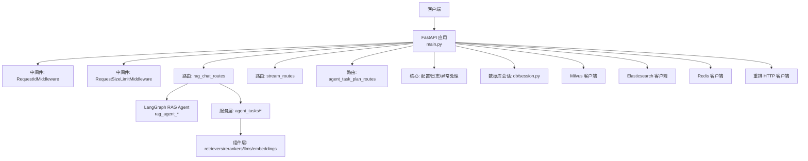
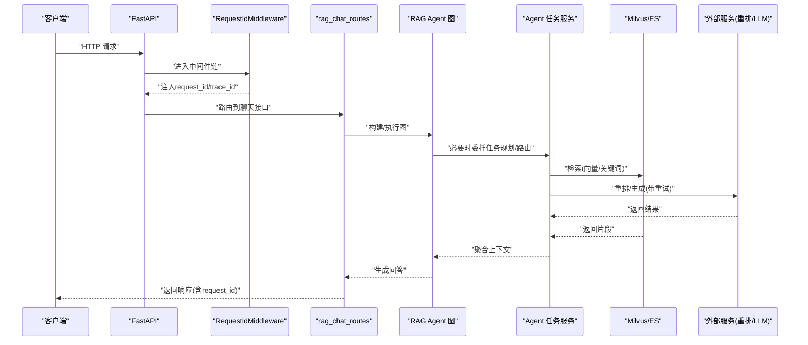
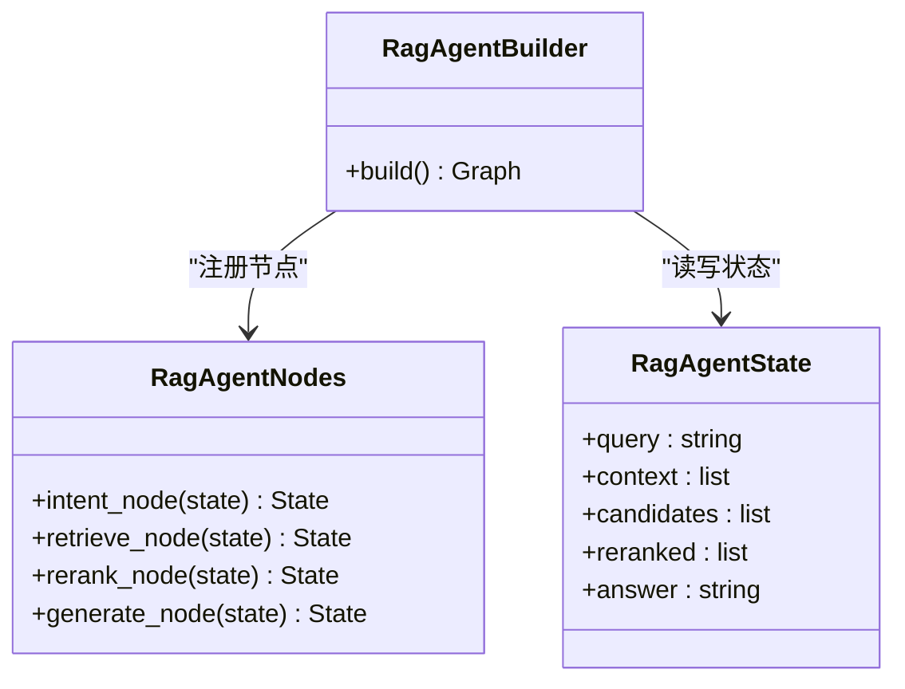
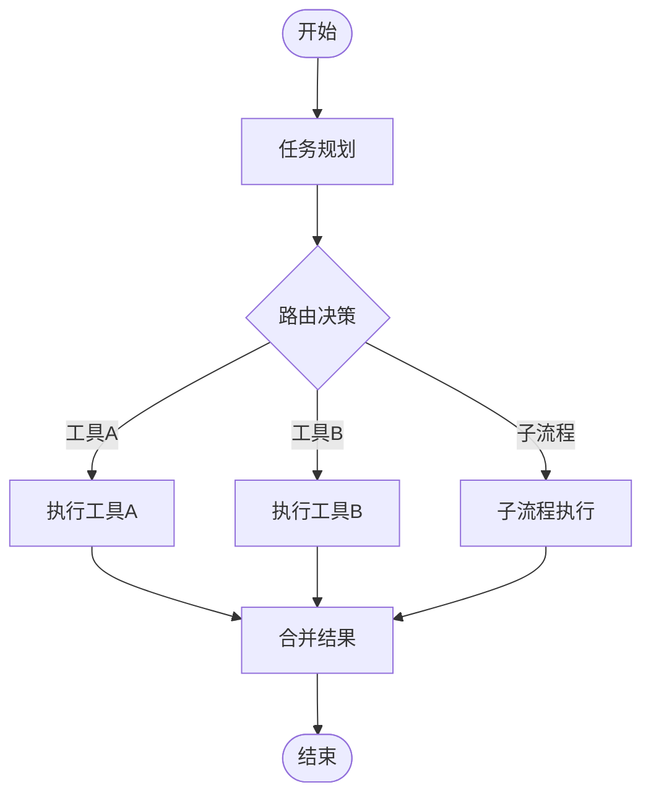
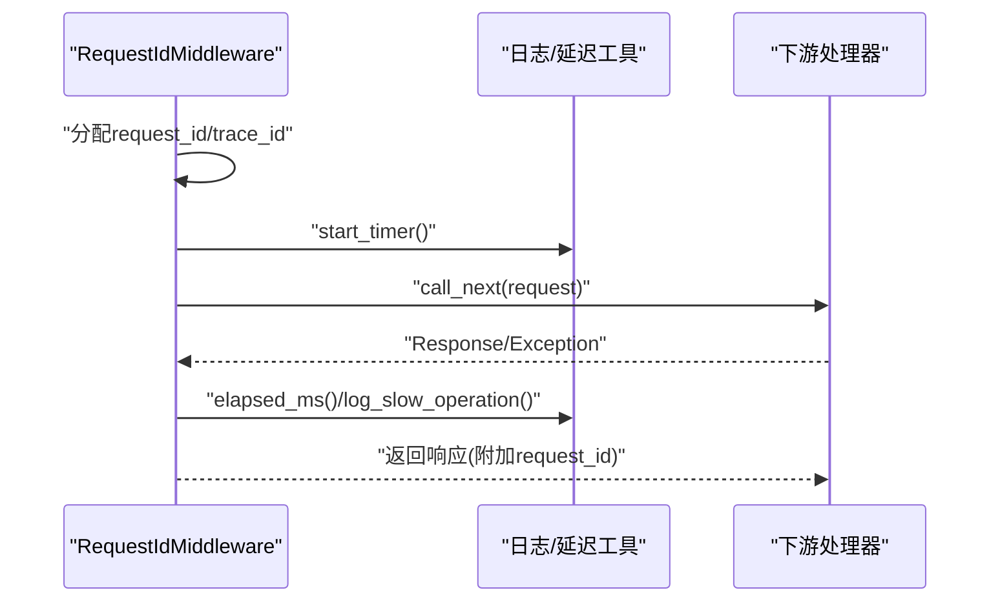
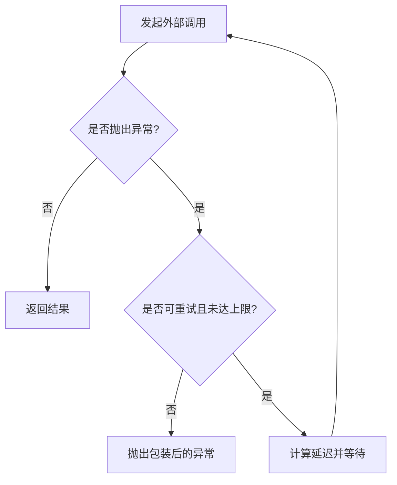
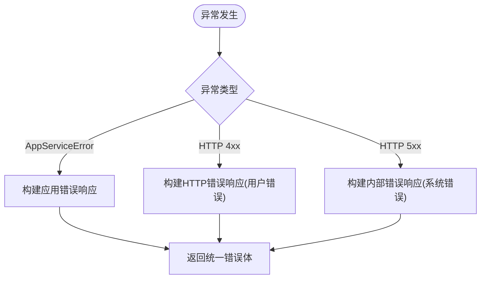
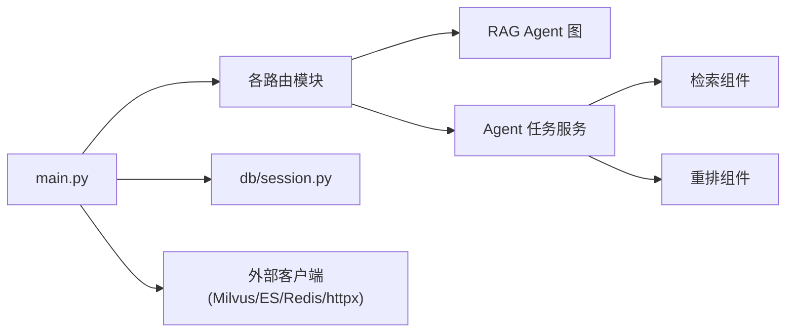

# 组件交互与通信

<cite>
**本文引用的文件**
- [src/fast_app/main.py](file://python-agent-study/src/fast_app/main.py)
- [src/fast_app/middlewares/request_id_middleware.py](file://python-agent-study/src/fast_app/middlewares/request_id_middleware.py)
- [src/fast_app/core/error_responses.py](file://python-agent-study/src/fast_app/core/error_responses.py)
- [src/fast_app/services/external_call_policy.py](file://python-agent-study/src/fast_app/services/external_call_policy.py)
- [src/fast_app/graph/rag_agent/rag_agent_builder.py](file://python-agent-study/src/fast_app/graph/rag_agent/rag_agent_builder.py)
- [src/fast_app/graph/rag_agent/rag_agent_nodes.py](file://python-agent-study/src/fast_app/graph/rag_agent/rag_agent_nodes.py)
- [src/fast_app/graph/rag_agent/rag_agent_state.py](file://python-agent-study/src/fast_app/graph/rag_agent/rag_agent_state.py)
- [src/fast_app/services/agent_tasks/agent_task_planner.py](file://python-agent-study/src/fast_app/services/agent_tasks/agent_task_planner.py)
- [src/fast_app/services/agent_tasks/agent_task_executor.py](file://python-agent-study/src/fast_app/services/agent_tasks/agent_task_executor.py)
- [src/fast_app/services/agent_tasks/agent_task_router.py](file://python-agent-study/src/fast_app/services/agent_tasks/agent_task_router.py)
- [src/fast_app/api/rag_chat_routes.py](file://python-agent-study/src/fast_app/api/rag_chat_routes.py)
- [src/fast_app/api/stream_routes.py](file://python-agent-study/src/fast_app/api/stream_routes.py)
- [src/fast_app/components/retrievers/milvus_vector_retriever.py](file://python-agent-study/src/fast_app/components/retrievers/milvus_vector_retriever.py)
- [src/fast_app/db/session.py](file://python-agent-study/src/fast_app/db/session.py)
</cite>

## 目录
1. [简介](#简介)
2. [项目结构](#项目结构)
3. [核心组件](#核心组件)
4. [架构总览](#架构总览)
5. [详细组件分析](#详细组件分析)
6. [依赖关系分析](#依赖关系分析)
7. [性能考量](#性能考量)
8. [故障排查指南](#故障排查指南)
9. [结论](#结论)
10. [附录](#附录)

## 简介
本文件聚焦于 RAG 管道、Agent 任务编排与中间件之间的交互与通信机制，覆盖同步调用、异步调用与事件驱动模式；说明组件间依赖管理、版本兼容性与错误传播；并给出负载均衡、熔断降级、重试机制的实现建议。文档包含组件关系图、通信序列图和异常处理流程图，为系统集成与故障排查提供技术指导。

## 项目结构
FastAPI 应用通过 lifespan 初始化外部资源（向量检索、关键词检索、重排器、Redis、数据库引擎等），注册全局中间件（CORS、请求大小限制、请求ID与慢请求追踪），并按路由模块挂载 API。RAG Agent 以 LangGraph 风格的状态机组织，服务层提供任务规划、执行与路由能力，组件层封装检索与重排等可插拔实现。

图表来源
- [src/fast_app/main.py:41-129](file://python-agent-study/src/fast_app/main.py#L41-L129)
- [src/fast_app/main.py:138-169](file://python-agent-study/src/fast_app/main.py#L138-L169)
- [src/fast_app/components/retrievers/milvus_vector_retriever.py](file://python-agent-study/src/fast_app/components/retrievers/milvus_vector_retriever.py)
- [src/fast_app/db/session.py](file://python-agent-study/src/fast_app/db/session.py)

章节来源
- [src/fast_app/main.py:41-129](file://python-agent-study/src/fast_app/main.py#L41-L129)
- [src/fast_app/main.py:138-169](file://python-agent-study/src/fast_app/main.py#L138-L169)

## 核心组件
- 应用生命周期与资源管理：在 lifespan 中创建并关闭 Milvus、Elasticsearch、httpx、Redis、PostgreSQL 连接池与 NL2SQL 数据集注册表，确保跨请求复用与优雅关闭。
- 中间件链路：CORS、请求体大小限制、请求ID注入与慢请求告警，贯穿所有请求。
- RAG Agent 图：基于状态机的节点编排，负责意图判断、检索、重排、生成等步骤。
- Agent 任务编排：规划器将用户问题分解为可执行计划，路由器选择工具或子任务，执行器协调运行。
- 外部调用策略：统一的重试包装器，对超时、传输错误与特定HTTP状态码进行指数退避重试。
- 错误响应构建：统一错误格式，携带 request_id 与 trace_id，便于全链路追踪。

章节来源
- [src/fast_app/main.py:41-129](file://python-agent-study/src/fast_app/main.py#L41-L129)
- [src/fast_app/middlewares/request_id_middleware.py:19-98](file://python-agent-study/src/fast_app/middlewares/request_id_middleware.py#L19-L98)
- [src/fast_app/services/external_call_policy.py:21-74](file://python-agent-study/src/fast_app/services/external_call_policy.py#L21-L74)
- [src/fast_app/core/error_responses.py:7-64](file://python-agent-study/src/fast_app/core/error_responses.py#L7-L64)

## 架构总览
下图展示从 HTTP 请求到 RAG Agent 与外部存储的端到端交互，包括中间件、路由、服务层、图编排与组件层的职责边界。

图表来源
- [src/fast_app/main.py:138-169](file://python-agent-study/src/fast_app/main.py#L138-L169)
- [src/fast_app/middlewares/request_id_middleware.py:28-98](file://python-agent-study/src/fast_app/middlewares/request_id_middleware.py#L28-L98)
- [src/fast_app/api/rag_chat_routes.py](file://python-agent-study/src/fast_app/api/rag_chat_routes.py)
- [src/fast_app/graph/rag_agent/rag_agent_builder.py](file://python-agent-study/src/fast_app/graph/rag_agent/rag_agent_builder.py)
- [src/fast_app/services/agent_tasks/agent_task_planner.py](file://python-agent-study/src/fast_app/services/agent_tasks/agent_task_planner.py)
- [src/fast_app/components/retrievers/milvus_vector_retriever.py](file://python-agent-study/src/fast_app/components/retrievers/milvus_vector_retriever.py)

## 详细组件分析

### RAG 管道与 Agent 图
- 状态与节点：RAG Agent 使用状态对象承载查询、上下文、候选片段、重排结果与最终答案；节点按“意图判断→检索→重排→生成”的顺序编排，条件边根据检索结果决定是否进入生成或澄清。
- 构建与执行：Builder 组装节点与边，形成可执行图；执行时传入初始状态，逐步推进直至终止。
- 与任务编排集成：当需要多步工具调用或复杂推理时，RAG 图可委托 Agent 任务服务进行规划与路由。

图表来源
- [src/fast_app/graph/rag_agent/rag_agent_state.py](file://python-agent-study/src/fast_app/graph/rag_agent/rag_agent_state.py)
- [src/fast_app/graph/rag_agent/rag_agent_builder.py](file://python-agent-study/src/fast_app/graph/rag_agent/rag_agent_builder.py)
- [src/fast_app/graph/rag_agent/rag_agent_nodes.py](file://python-agent-study/src/fast_app/graph/rag_agent/rag_agent_nodes.py)

章节来源
- [src/fast_app/graph/rag_agent/rag_agent_state.py](file://python-agent-study/src/fast_app/graph/rag_agent/rag_agent_state.py)
- [src/fast_app/graph/rag_agent/rag_agent_builder.py](file://python-agent-study/src/fast_app/graph/rag_agent/rag_agent_builder.py)
- [src/fast_app/graph/rag_agent/rag_agent_nodes.py](file://python-agent-study/src/fast_app/graph/rag_agent/rag_agent_nodes.py)

### Agent 任务编排（规划-路由-执行）
- 规划器：将用户问题拆解为结构化任务计划，标注所需工具、数据源与顺序约束。
- 路由器：依据任务类型与可用能力选择具体工具或子流程。
- 执行器：串行/并行调度任务节点，收集中间结果，处理失败与重试。

图表来源
- [src/fast_app/services/agent_tasks/agent_task_planner.py](file://python-agent-study/src/fast_app/services/agent_tasks/agent_task_planner.py)
- [src/fast_app/services/agent_tasks/agent_task_router.py](file://python-agent-study/src/fast_app/services/agent_tasks/agent_task_router.py)
- [src/fast_app/services/agent_tasks/agent_task_executor.py](file://python-agent-study/src/fast_app/services/agent_tasks/agent_task_executor.py)

章节来源
- [src/fast_app/services/agent_tasks/agent_task_planner.py](file://python-agent-study/src/fast_app/services/agent_tasks/agent_task_planner.py)
- [src/fast_app/services/agent_tasks/agent_task_router.py](file://python-agent-study/src/fast_app/services/agent_tasks/agent_task_router.py)
- [src/fast_app/services/agent_tasks/agent_task_executor.py](file://python-agent-study/src/fast_app/services/agent_tasks/agent_task_executor.py)

### 中间件与请求上下文
- 请求ID与追踪：中间件注入 request_id 与 trace_id，写入响应头，并在成功/失败路径记录耗时与慢请求告警。
- 上下文隔离：使用上下文令牌在进入/退出时设置与重置，避免跨请求污染。
- 安全与限流：请求体大小限制防止过大负载。

图表来源
- [src/fast_app/middlewares/request_id_middleware.py:28-98](file://python-agent-study/src/fast_app/middlewares/request_id_middleware.py#L28-L98)

章节来源
- [src/fast_app/middlewares/request_id_middleware.py:19-98](file://python-agent-study/src/fast_app/middlewares/request_id_middleware.py#L19-L98)

### 外部调用策略（重试、超时、降级）
- 重试判定：对 httpx 超时、传输错误以及 429/500/502/503/504 等状态码视为可重试。
- 统一包装：将超时转换为统一的 ExternalServiceTimeoutError，便于上层捕获与降级。
- 退避策略：基础延迟乘以尝试次数，记录重试日志。

图表来源
- [src/fast_app/services/external_call_policy.py:21-74](file://python-agent-study/src/fast_app/services/external_call_policy.py#L21-L74)

章节来源
- [src/fast_app/services/external_call_policy.py:21-74](file://python-agent-study/src/fast_app/services/external_call_policy.py#L21-L74)

### 错误传播与统一响应
- 统一错误内容：构造包含 code、message、error_category、request_id、trace_id 的标准错误体。
- 分类策略：HTTP 4xx 归为用户错误，5xx 归为系统错误；应用服务异常映射为业务错误码。
- 中间件与异常处理器协作：中间件记录失败日志，异常处理器输出标准错误体。

图表来源
- [src/fast_app/core/error_responses.py:7-64](file://python-agent-study/src/fast_app/core/error_responses.py#L7-L64)

章节来源
- [src/fast_app/core/error_responses.py:7-64](file://python-agent-study/src/fast_app/core/error_responses.py#L7-L64)

### 流式响应与 SSE
- 流式路由：stream_routes 暴露流式接口，结合 RAG 管道的增量输出，降低首字节延迟。
- 与中间件协同：仍受请求ID与慢请求监控影响，便于定位长尾请求。

章节来源
- [src/fast_app/api/stream_routes.py](file://python-agent-study/src/fast_app/api/stream_routes.py)
- [src/fast_app/middlewares/request_id_middleware.py:28-98](file://python-agent-study/src/fast_app/middlewares/request_id_middleware.py#L28-L98)

## 依赖关系分析
- 应用启动依赖：Milvus、Elasticsearch、httpx、Redis、PostgreSQL、NL2SQL 注册表均在 lifespan 内创建，并在关闭阶段释放。
- 路由与服务依赖：rag_chat_routes 依赖 RAG Agent 图与 Agent 任务服务；任务服务依赖检索与重排组件。
- 组件解耦：检索器、重排器、LLM、Embedding 均通过抽象接口接入，便于替换与测试。

图表来源
- [src/fast_app/main.py:41-129](file://python-agent-study/src/fast_app/main.py#L41-L129)
- [src/fast_app/db/session.py](file://python-agent-study/src/fast_app/db/session.py)
- [src/fast_app/components/retrievers/milvus_vector_retriever.py](file://python-agent-study/src/fast_app/components/retrievers/milvus_vector_retriever.py)

章节来源
- [src/fast_app/main.py:41-129](file://python-agent-study/src/fast_app/main.py#L41-L129)
- [src/fast_app/db/session.py](file://python-agent-study/src/fast_app/db/session.py)

## 性能考量
- 连接复用：向量、关键词、重排、Redis、数据库连接在应用生命周期内复用，减少握手开销。
- 异步优先：外部调用与 I/O 操作采用异步模型，提升并发吞吐。
- 慢请求监控：中间件统计耗时并记录慢请求，辅助容量评估与瓶颈定位。
- 重试与退避：对外部不稳定服务实施指数退避重试，降低瞬时抖动影响。
- 流式输出：对长耗时生成过程采用流式响应，改善用户体验与资源占用。

[本节为通用指导，不直接分析具体文件]

## 故障排查指南
- 全链路追踪：通过 request_id 与 trace_id 在日志中串联一次请求的完整路径，快速定位失败环节。
- 中间件日志：关注 http.request.finish 与 http.request.failed 事件，核对状态码与耗时。
- 重试日志：检查外部调用失败的重试记录，确认是否达到最大重试次数及退避策略是否合理。
- 错误分类：根据 error_category 区分用户错误与系统错误，结合 HTTP 状态码定位问题来源。
- 资源泄漏：若出现连接未释放，检查 lifespan 的 finally 分支是否正确关闭客户端与引擎。

章节来源
- [src/fast_app/middlewares/request_id_middleware.py:28-98](file://python-agent-study/src/fast_app/middlewares/request_id_middleware.py#L28-L98)
- [src/fast_app/services/external_call_policy.py:37-74](file://python-agent-study/src/fast_app/services/external_call_policy.py#L37-L74)
- [src/fast_app/core/error_responses.py:7-64](file://python-agent-study/src/fast_app/core/error_responses.py#L7-L64)
- [src/fast_app/main.py:91-129](file://python-agent-study/src/fast_app/main.py#L91-L129)

## 结论
本项目通过 FastAPI 生命周期管理外部资源、中间件保障可观测性、RAG Agent 图实现检索增强生成、Agent 任务服务完成复杂编排，并以统一的外部调用策略与错误响应规范保证稳定性与可维护性。建议在后续演进中补充负载均衡、熔断与更细粒度的降级策略，进一步提升系统在大规模场景下的弹性与韧性。

[本节为总结性内容，不直接分析具体文件]

## 附录
- 关键入口与装配点
  - 应用启动与资源装配：lifespan 中创建与关闭客户端与数据库引擎
  - 中间件链：CORS、请求大小限制、请求ID与慢请求监控
  - 路由挂载：健康检查、认证、知识库导入、聊天、RAG、流式、调试、GitLab、NL2SQL
- 推荐实践
  - 对外部服务调用统一使用 call_with_retry，并配置合理的 max_retries 与 base_delay
  - 在 Agent 图中明确条件边与终止条件，避免无限循环
  - 使用统一错误响应构建函数，确保前端与运维一致的错误语义
  - 利用 request_id/trace_id 进行端到端追踪与问题复现

[本节为补充信息，不直接分析具体文件]