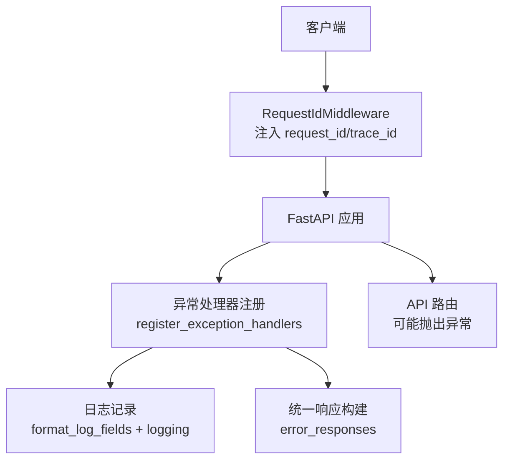
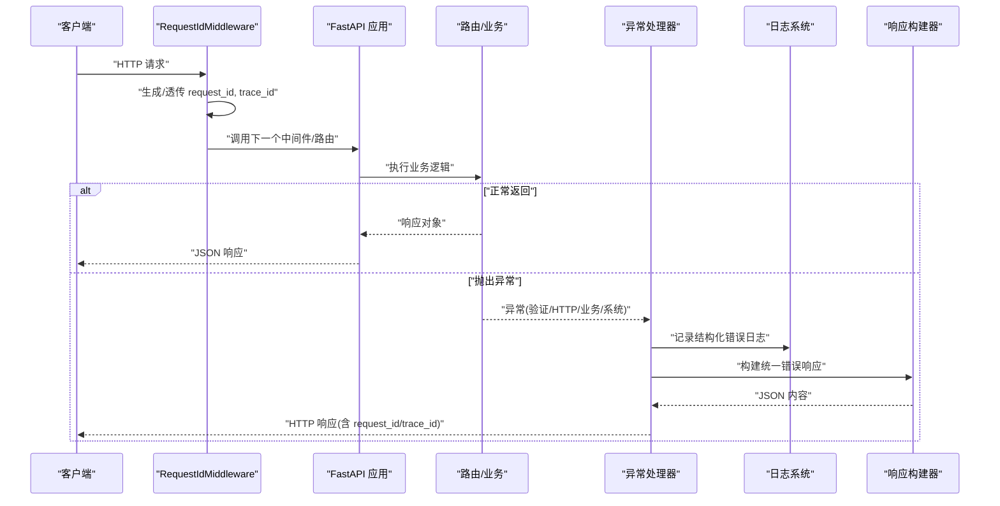
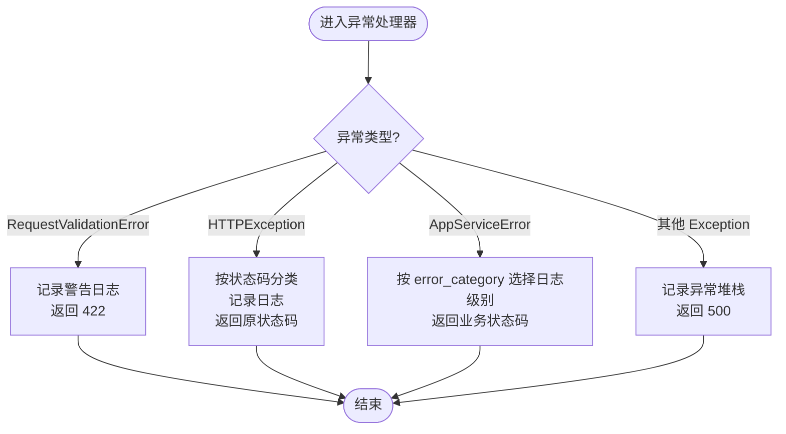
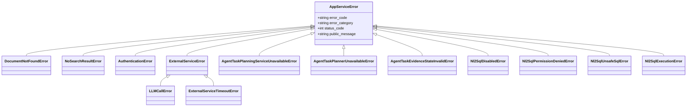
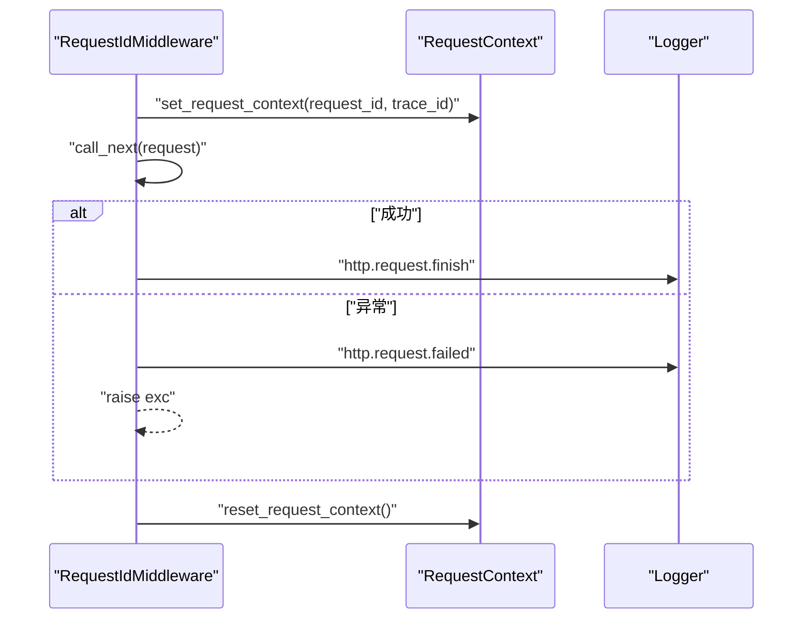
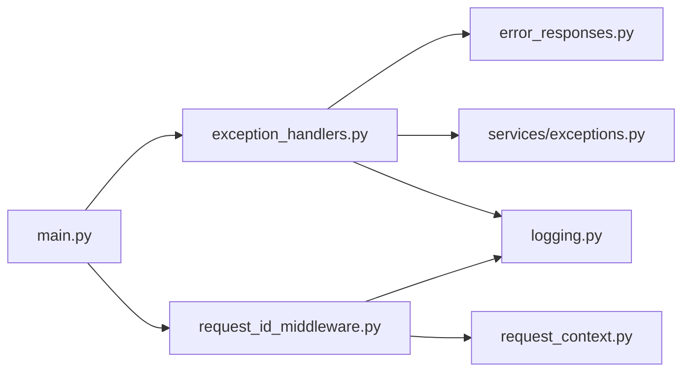

# 异常处理器

<cite>
**本文引用的文件**
- [src/fast_app/core/exception_handlers.py](file://src/fast_app/core/exception_handlers.py)
- [src/fast_app/services/exceptions.py](file://src/fast_app/services/exceptions.py)
- [src/fast_app/core/error_responses.py](file://src/fast_app/core/error_responses.py)
- [src/fast_app/main.py](file://src/fast_app/main.py)
- [src/fast_app/api/error_demo_routes.py](file://src/fast_app/api/error_demo_routes.py)
- [src/fast_app/middlewares/request_id_middleware.py](file://src/fast_app/middlewares/request_id_middleware.py)
- [src/fast_app/core/logging.py](file://src/fast_app/core/logging.py)
- [src/fast_app/core/request_context.py](file://src/fast_app/core/request_context.py)
</cite>

## 目录
1. [简介](#简介)
2. [项目结构](#项目结构)
3. [核心组件](#核心组件)
4. [架构总览](#架构总览)
5. [详细组件分析](#详细组件分析)
6. [依赖关系分析](#依赖关系分析)
7. [性能考量](#性能考量)
8. [故障排查指南](#故障排查指南)
9. [结论](#结论)
10. [附录](#附录)

## 简介
本文件面向 FastAPI 全局异常处理机制，系统性说明：
- 自定义异常捕获与 HTTP 异常转换策略
- 错误日志记录、上下文信息（request_id、trace_id）收集
- 业务异常、外部服务异常、系统异常的差异化处理
- 异常堆栈跟踪与调试数据的收集策略
- 异常处理流程图与自定义处理器扩展指南

该机制通过中间件注入请求上下文，统一异常处理器将不同来源的异常转换为一致的 JSON 响应，并输出结构化日志，便于追踪与排障。

## 项目结构
FastAPI 应用启动时注册异常处理器，并通过中间件为每个请求注入 request_id 与 trace_id；路由层抛出不同类型的异常，由全局处理器统一捕获并返回标准化响应。

图表来源
- [src/fast_app/main.py:132-156](file://src/fast_app/main.py#L132-L156)
- [src/fast_app/core/exception_handlers.py:26-153](file://src/fast_app/core/exception_handlers.py#L26-L153)
- [src/fast_app/middlewares/request_id_middleware.py:19-98](file://src/fast_app/middlewares/request_id_middleware.py#L19-L98)
- [src/fast_app/core/error_responses.py:7-64](file://src/fast_app/core/error_responses.py#L7-L64)
- [src/fast_app/core/logging.py:38-77](file://src/fast_app/core/logging.py#L38-L77)

章节来源
- [src/fast_app/main.py:132-170](file://src/fast_app/main.py#L132-L170)
- [src/fast_app/core/exception_handlers.py:26-153](file://src/fast_app/core/exception_handlers.py#L26-L153)
- [src/fast_app/middlewares/request_id_middleware.py:19-98](file://src/fast_app/middlewares/request_id_middleware.py#L19-L98)
- [src/fast_app/core/error_responses.py:7-64](file://src/fast_app/core/error_responses.py#L7-L64)
- [src/fast_app/core/logging.py:38-77](file://src/fast_app/core/logging.py#L38-L77)

## 核心组件
- 异常处理器注册器：集中定义 RequestValidationError、HTTPException、AppServiceError、通用 Exception 的处理逻辑，统一写入结构化日志并返回标准 JSON。
- 业务异常体系：基于 AppServiceError 的领域异常族，提供 error_code、error_category、status_code 等元数据，便于分类与对外展示。
- 响应构建器：根据异常类型生成统一的 JSON 结构，包含 code、message、error_category、request_id、trace_id。
- 请求上下文：通过 ContextVar 在请求生命周期内维护 request_id 与 trace_id，供日志与响应使用。
- 中间件：为每个请求生成或透传 request_id/trace_id，并在成功/失败路径记录请求级日志。
- 日志工具：格式化字段、附加上下文过滤，确保日志可检索、可关联。

章节来源
- [src/fast_app/core/exception_handlers.py:26-153](file://src/fast_app/core/exception_handlers.py#L26-L153)
- [src/fast_app/services/exceptions.py:1-190](file://src/fast_app/services/exceptions.py#L1-L190)
- [src/fast_app/core/error_responses.py:7-64](file://src/fast_app/core/error_responses.py#L7-L64)
- [src/fast_app/core/request_context.py:1-39](file://src/fast_app/core/request_context.py#L1-L39)
- [src/fast_app/middlewares/request_id_middleware.py:19-98](file://src/fast_app/middlewares/request_id_middleware.py#L19-L98)
- [src/fast_app/core/logging.py:38-77](file://src/fast_app/core/logging.py#L38-L77)

## 架构总览
下图展示了从请求进入、上下文注入、路由执行到异常处理的完整链路，以及不同类型异常的分支处理。

图表来源
- [src/fast_app/middlewares/request_id_middleware.py:28-98](file://src/fast_app/middlewares/request_id_middleware.py#L28-L98)
- [src/fast_app/core/exception_handlers.py:26-153](file://src/fast_app/core/exception_handlers.py#L26-L153)
- [src/fast_app/core/error_responses.py:7-64](file://src/fast_app/core/error_responses.py#L7-L64)
- [src/fast_app/core/logging.py:38-77](file://src/fast_app/core/logging.py#L38-L77)

## 详细组件分析

### 全局异常处理器
- 参数校验异常（RequestValidationError）
  - 行为：记录警告级别日志，返回 422，错误码 REQUEST_VALIDATION_ERROR，类别 user_error。
  - 上下文：携带 request_id、trace_id。
- HTTP 异常（StarletteHTTPException）
  - 行为：按状态码划分 user_error(<500) 与 system_error(>=500)，记录对应级别日志，返回原始状态码与消息。
  - 上下文：携带 request_id、trace_id。
- 业务异常（AppServiceError 及其子类）
  - 行为：根据 error_category 决定日志级别（external_service_error 为 error），返回业务异常的状态码与 message。
  - 上下文：携带 request_id、trace_id。
- 未预期异常（Exception）
  - 行为：记录异常堆栈（logger.exception），返回 500，错误码 INTERNAL_SERVER_ERROR，类别 system_error。
  - 上下文：携带 request_id、trace_id。

图表来源
- [src/fast_app/core/exception_handlers.py:26-153](file://src/fast_app/core/exception_handlers.py#L26-L153)

章节来源
- [src/fast_app/core/exception_handlers.py:26-153](file://src/fast_app/core/exception_handlers.py#L26-L153)

### 业务异常体系
- 基类 AppServiceError
  - 提供 error_code、error_category、status_code、public_message 等元数据，用于统一对外展示与分类。
- 典型子类
  - 用户侧错误：DocumentNotFoundError、NoSearchResultError、AuthenticationError、PromptInjectionBlockedError、ToolPermissionDeniedError 等。
  - 外部服务错误：AgentTaskPlanningServiceUnavailableError、AgentTaskPlannerUnavailableError、ExternalServiceError、LLMCallError、ExternalServiceTimeoutError 等。
  - 系统错误：AgentTaskEvidenceStateInvalidError、DocumentAgentCheckpointUnavailableError 等。
  - NL2SQL 相关：Nl2SqlDisabledError、Nl2SqlPermissionDeniedError、Nl2SqlUnsafeSqlError、Nl2SqlExecutionError 等。

图表来源
- [src/fast_app/services/exceptions.py:1-190](file://src/fast_app/services/exceptions.py#L1-L190)

章节来源
- [src/fast_app/services/exceptions.py:1-190](file://src/fast_app/services/exceptions.py#L1-L190)

### 响应构建器
- build_error_response_content：构造统一错误体，包含 code、message、error_category、request_id、trace_id。
- build_app_error_response_content：从业务异常提取元数据构造响应。
- build_http_error_response_content：根据 HTTP 状态码推断 error_category，构造响应。
- build_internal_error_response_content：系统内部错误固定响应。

章节来源
- [src/fast_app/core/error_responses.py:7-64](file://src/fast_app/core/error_responses.py#L7-L64)

### 请求上下文与中间件
- RequestContext
  - 使用 ContextVar 存储 request_id、trace_id，提供 set/reset/get 方法。
- RequestIdMiddleware
  - 生成或透传 X-Request-ID，设置 request.state 与上下文变量，记录请求耗时与慢请求告警，异常路径记录失败日志，最终清理上下文。

图表来源
- [src/fast_app/middlewares/request_id_middleware.py:28-98](file://src/fast_app/middlewares/request_id_middleware.py#L28-L98)
- [src/fast_app/core/request_context.py:16-39](file://src/fast_app/core/request_context.py#L16-L39)

章节来源
- [src/fast_app/middlewares/request_id_middleware.py:28-98](file://src/fast_app/middlewares/request_id_middleware.py#L28-L98)
- [src/fast_app/core/request_context.py:1-39](file://src/fast_app/core/request_context.py#L1-L39)

### 日志记录
- format_log_fields：将键值对格式化为单行字符串，支持 None、字符串、列表、字典等类型的规范化输出。
- setup_logging：配置根日志器，添加 RequestContextFilter，使每条日志自动附带 request_id、trace_id。
- get_logger：获取命名日志器。

章节来源
- [src/fast_app/core/logging.py:38-77](file://src/fast_app/core/logging.py#L38-L77)

### API 示例与演示
- /error-demo/bad-request：抛出 400 HTTPException，用于验证用户错误分支。
- /error-demo/not-found：抛出 404 HTTPException，用于验证用户错误分支。

章节来源
- [src/fast_app/api/error_demo_routes.py:1-20](file://src/fast_app/api/error_demo_routes.py#L1-L20)

## 依赖关系分析
- main.py 在应用启动时注册异常处理器，并挂载中间件。
- exception_handlers.py 依赖 error_responses.py 构建响应，依赖 logging.py 记录日志，依赖 services/exceptions.py 识别业务异常。
- request_id_middleware.py 依赖 request_context.py 管理上下文，依赖 logging.py 记录请求级日志。
- 各路由模块通过 raise 抛出异常，交由全局处理器统一处理。

图表来源
- [src/fast_app/main.py:132-156](file://src/fast_app/main.py#L132-L156)
- [src/fast_app/core/exception_handlers.py:26-153](file://src/fast_app/core/exception_handlers.py#L26-L153)
- [src/fast_app/core/error_responses.py:7-64](file://src/fast_app/core/error_responses.py#L7-L64)
- [src/fast_app/services/exceptions.py:1-190](file://src/fast_app/services/exceptions.py#L1-L190)
- [src/fast_app/middlewares/request_id_middleware.py:19-98](file://src/fast_app/middlewares/request_id_middleware.py#L19-L98)
- [src/fast_app/core/request_context.py:1-39](file://src/fast_app/core/request_context.py#L1-L39)
- [src/fast_app/core/logging.py:38-77](file://src/fast_app/core/logging.py#L38-L77)

章节来源
- [src/fast_app/main.py:132-170](file://src/fast_app/main.py#L132-L170)
- [src/fast_app/core/exception_handlers.py:26-153](file://src/fast_app/core/exception_handlers.py#L26-L153)
- [src/fast_app/core/error_responses.py:7-64](file://src/fast_app/core/error_responses.py#L7-L64)
- [src/fast_app/services/exceptions.py:1-190](file://src/fast_app/services/exceptions.py#L1-L190)
- [src/fast_app/middlewares/request_id_middleware.py:19-98](file://src/fast_app/middlewares/request_id_middleware.py#L19-L98)
- [src/fast_app/core/request_context.py:1-39](file://src/fast_app/core/request_context.py#L1-L39)
- [src/fast_app/core/logging.py:38-77](file://src/fast_app/core/logging.py#L38-L77)

## 性能考量
- 异常路径仅进行必要的日志记录与响应构建，避免额外 I/O 阻塞。
- 中间件记录请求耗时与慢请求阈值，有助于定位瓶颈。
- 日志字段采用轻量格式化，减少序列化开销。
- 建议在高并发场景下结合异步日志后端与采样策略控制日志量。

[本节为通用指导，不直接分析具体文件]

## 故障排查指南
- 快速定位问题
  - 通过响应中的 request_id、trace_id 关联同一请求的日志。
  - 检查日志中 event 字段：http.error、http.request.finish、http.request.failed。
- 常见异常类型
  - 参数校验失败：REQUEST_VALIDATION_ERROR，检查入参结构与约束。
  - HTTP 异常：HTTP_状态码，检查路由抛出的 HTTPException 是否合理。
  - 业务异常：根据 error_code 定位具体领域问题（如文档不存在、权限不足）。
  - 外部服务异常：external_service_error，关注超时、不可用等状态。
  - 系统异常：INTERNAL_SERVER_ERROR，查看异常堆栈与上下文。
- 调试建议
  - 确认中间件是否正确注入 request_id/trace_id。
  - 检查日志级别与过滤器配置，确保上下文字段可见。
  - 使用 /error-demo 接口复现并验证处理器行为。

章节来源
- [src/fast_app/middlewares/request_id_middleware.py:28-98](file://src/fast_app/middlewares/request_id_middleware.py#L28-L98)
- [src/fast_app/core/exception_handlers.py:26-153](file://src/fast_app/core/exception_handlers.py#L26-L153)
- [src/fast_app/core/logging.py:38-77](file://src/fast_app/core/logging.py#L38-L77)
- [src/fast_app/api/error_demo_routes.py:1-20](file://src/fast_app/api/error_demo_routes.py#L1-L20)

## 结论
本项目通过“中间件注入上下文 + 全局异常处理器 + 统一响应构建 + 结构化日志”的组合，实现了清晰、一致且可追踪的错误处理机制。业务异常、外部服务异常与系统异常均被正确分类与记录，便于运维监控与问题定位。开发者可基于现有模式轻松扩展新的异常类型与处理器逻辑。

[本节为总结性内容，不直接分析具体文件]

## 附录

### 自定义处理器开发指南
- 新增业务异常
  - 在 services/exceptions.py 中定义新异常类，继承 AppServiceError，设置 error_code、error_category、status_code、public_message。
- 注册新处理器
  - 在 core/exception_handlers.py 中使用 @app.exception_handler 装饰器注册新异常类型，遵循现有模式：记录结构化日志、构建统一响应。
- 集成到应用
  - 确保 main.py 已调用 register_exception_handlers(app)。
- 测试验证
  - 在 api/error_demo_routes.py 中添加演示路由，模拟新异常抛出，验证响应与日志。

章节来源
- [src/fast_app/services/exceptions.py:1-190](file://src/fast_app/services/exceptions.py#L1-L190)
- [src/fast_app/core/exception_handlers.py:26-153](file://src/fast_app/core/exception_handlers.py#L26-L153)
- [src/fast_app/main.py:132-156](file://src/fast_app/main.py#L132-L156)
- [src/fast_app/api/error_demo_routes.py:1-20](file://src/fast_app/api/error_demo_routes.py#L1-L20)