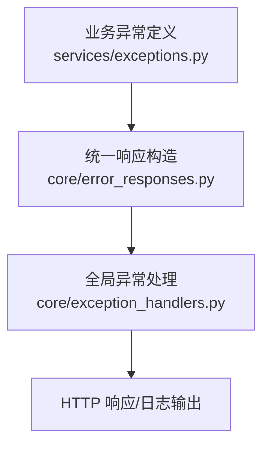
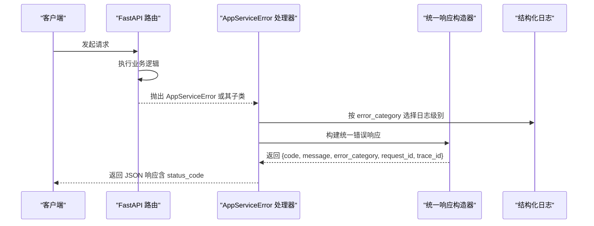
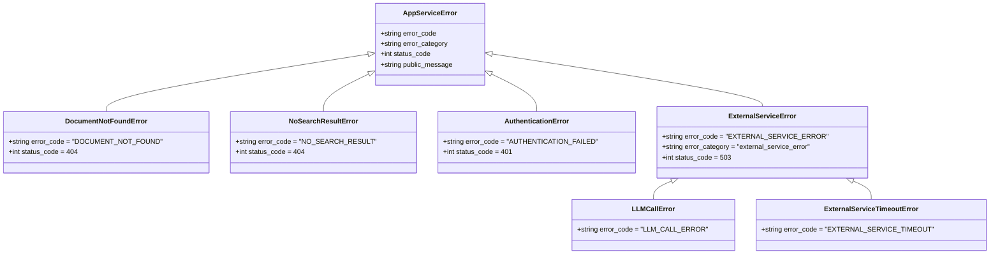
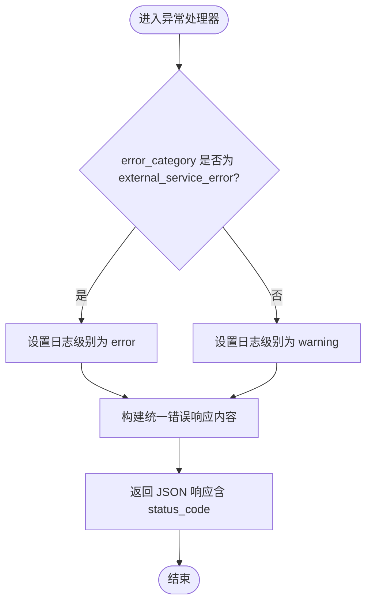

# 异常层次结构

<cite>
**本文引用的文件**
- [src/fast_app/services/exceptions.py](file://python-agent-study/src/fast_app/services/exceptions.py)
- [src/fast_app/core/error_responses.py](file://python-agent-study/src/fast_app/core/error_responses.py)
- [src/fast_app/core/exception_handlers.py](file://python-agent-study/src/fast_app/core/exception_handlers.py)
- [learning-docs/phase-12/12-9-错误日志分层-用户错误-外部服务错误-系统错误.md](file://python-agent-study/learning-docs/phase-12/12-9-错误日志分层-用户错误-外部服务错误-系统错误.md)
</cite>

## 目录
1. [简介](#简介)
2. [项目结构](#项目结构)
3. [核心组件](#核心组件)
4. [架构总览](#架构总览)
5. [详细组件分析](#详细组件分析)
6. [依赖关系分析](#依赖关系分析)
7. [性能与可观测性](#性能与可观测性)
8. [故障排查指南](#故障排查指南)
9. [结论](#结论)
10. [附录：最佳实践与扩展指南](#附录：最佳实践与扩展指南)

## 简介
本文件系统化梳理了项目的异常层次结构，重点说明 AppServiceError 基类的设计理念、继承体系以及 DocumentNotFoundError、AuthenticationError、ExternalServiceError 等具体异常类型的定义与用途。文档还解释了 error_code、status_code、error_category 三个关键属性的配置方式，并基于三类错误分类（user_error、external_service_error、system_error）给出使用场景、调用流程、可视化图示和最佳实践，帮助开发者正确使用和扩展异常体系。

## 项目结构
异常体系涉及三层职责：
- 业务异常定义层：位于 services/exceptions.py，集中定义所有业务异常及其元数据。
- 统一响应构造层：位于 core/error_responses.py，将异常转换为统一的 JSON 错误响应结构。
- 全局异常处理层：位于 core/exception_handlers.py，注册 FastAPI 异常处理器，负责日志记录与 HTTP 响应生成。

图表来源
- [src/fast_app/services/exceptions.py:1-190](file://python-agent-study/src/fast_app/services/exceptions.py#L1-L190)
- [src/fast_app/core/error_responses.py:1-64](file://python-agent-study/src/fast_app/core/error_responses.py#L1-L64)
- [src/fast_app/core/exception_handlers.py:1-153](file://python-agent-study/src/fast_app/core/exception_handlers.py#L1-L153)

章节来源
- [src/fast_app/services/exceptions.py:1-190](file://python-agent-study/src/fast_app/services/exceptions.py#L1-L190)
- [src/fast_app/core/error_responses.py:1-64](file://python-agent-study/src/fast_app/core/error_responses.py#L1-L64)
- [src/fast_app/core/exception_handlers.py:1-153](file://python-agent-study/src/fast_app/core/exception_handlers.py#L1-L153)

## 核心组件
- AppServiceError：业务异常基类，提供统一的错误码、错误分类、HTTP 状态码和用户可见消息字段。
- 具体业务异常：如 DocumentNotFoundError、NoSearchResultError、AuthenticationError、PromptInjectionBlockedError、ToolPermissionDeniedError 等，覆盖常见业务失败场景。
- 外部服务异常族：ExternalServiceError 及其子类 LLMCallError、ExternalServiceTimeoutError，用于封装第三方或基础设施调用失败。
- 其他领域异常：如 AgentTaskPlanBusyError、KnowledgeVersionNotReadyError、Nl2Sql* 系列异常等，体现不同子系统的边界错误。

章节来源
- [src/fast_app/services/exceptions.py:1-190](file://python-agent-study/src/fast_app/services/exceptions.py#L1-L190)

## 架构总览
异常从抛出到响应的完整链路如下：

图表来源
- [src/fast_app/core/exception_handlers.py:93-125](file://python-agent-study/src/fast_app/core/exception_handlers.py#L93-L125)
- [src/fast_app/core/error_responses.py:23-34](file://python-agent-study/src/fast_app/core/error_responses.py#L23-L34)

章节来源
- [src/fast_app/core/exception_handlers.py:93-125](file://python-agent-study/src/fast_app/core/exception_handlers.py#L93-L125)
- [src/fast_app/core/error_responses.py:23-34](file://python-agent-study/src/fast_app/core/error_responses.py#L23-L34)

## 详细组件分析

### AppServiceError 基类设计理念
- 设计目标：让每个业务异常“自描述”，即通过类属性直接回答“错误码是什么”“属于哪类错误”“应返回什么 HTTP 状态码”“用户能看到什么消息”。
- 关键属性：
  - error_code：机器可读的错误码，便于前端/网关/监控统一识别。
  - error_category：错误分类，决定日志级别与后续策略（重试、降级、告警）。
  - status_code：HTTP 状态码，由异常语义决定。
  - public_message：用户可见的消息文本，避免泄露内部细节。
- 默认值：基类提供默认分类 user_error 与默认状态码 400，子类按需覆盖。

章节来源
- [src/fast_app/services/exceptions.py:1-11](file://python-agent-study/src/fast_app/services/exceptions.py#L1-L11)

### 继承体系与具体异常类型

图表来源
- [src/fast_app/services/exceptions.py:13-18](file://python-agent-study/src/fast_app/services/exceptions.py#L13-L18)
- [src/fast_app/services/exceptions.py:20-24](file://python-agent-study/src/fast_app/services/exceptions.py#L20-L24)
- [src/fast_app/services/exceptions.py:27-31](file://python-agent-study/src/fast_app/services/exceptions.py#L27-L31)
- [src/fast_app/services/exceptions.py:136-153](file://python-agent-study/src/fast_app/services/exceptions.py#L136-L153)

章节来源
- [src/fast_app/services/exceptions.py:13-18](file://python-agent-study/src/fast_app/services/exceptions.py#L13-L18)
- [src/fast_app/services/exceptions.py:20-24](file://python-agent-study/src/fast_app/services/exceptions.py#L20-L24)
- [src/fast_app/services/exceptions.py:27-31](file://python-agent-study/src/fast_app/services/exceptions.py#L27-L31)
- [src/fast_app/services/exceptions.py:136-153](file://python-agent-study/src/fast_app/services/exceptions.py#L136-L153)

### 错误分类策略与使用场景
- user_error：表示客户端请求不合法或未满足业务条件，例如参数校验失败、检索为空、文档不存在、认证失败等。通常不应视为系统故障，日志级别为 warning。
- external_service_error：表示后端逻辑正确但依赖的外部组件失败，例如 Milvus/ES/Rerank/LLM/Embedding 调用失败或超时。需要重点记录 provider、operation、latency 等上下文，日志级别为 error。
- system_error：表示后端未预期异常，如代码 bug、空引用、配置错误等。应返回 500，保留堆栈，日志级别为 error。

章节来源
- [learning-docs/phase-12/12-9-错误日志分层-用户错误-外部服务错误-系统错误.md:91-169](file://python-agent-study/learning-docs/phase-12/12-9-错误日志分层-用户错误-外部服务错误-系统错误.md#L91-L169)

### 异常处理与响应构造流程

图表来源
- [src/fast_app/core/exception_handlers.py:93-125](file://python-agent-study/src/fast_app/core/exception_handlers.py#L93-L125)
- [src/fast_app/core/error_responses.py:23-34](file://python-agent-study/src/fast_app/core/error_responses.py#L23-L34)

章节来源
- [src/fast_app/core/exception_handlers.py:93-125](file://python-agent-study/src/fast_app/core/exception_handlers.py#L93-L125)
- [src/fast_app/core/error_responses.py:23-34](file://python-agent-study/src/fast_app/core/error_responses.py#L23-L34)

### 典型使用示例（路径引用）
- 外部服务调用失败：在检索、重排、嵌入、大模型调用等组件中抛出 ExternalServiceError 或其子类，以明确依赖不可用或调用失败。
  - 参考路径：[components/retrievers/milvus_vector_retriever.py](file://python-agent-study/src/fast_app/components/retrievers/milvus_vector_retriever.py)
  - 参考路径：[components/retrievers/elasticsearch_keyword_retriever.py](file://python-agent-study/src/fast_app/components/retrievers/elasticsearch_keyword_retriever.py)
  - 参考路径：[components/rerankers/dashscope_reranker.py](file://python-agent-study/src/fast_app/components/rerankers/dashscope_reranker.py)
  - 参考路径：[components/embeddings/qwen_embedding_client.py](file://python-agent-study/src/fast_app/components/embeddings/qwen_embedding_client.py)
- 认证失败：在鉴权相关路由中抛出 AuthenticationError，提示客户端重新认证或修复凭证。
  - 参考路径：[api/knowledge_import_routes.py](file://python-agent-study/src/fast_app/api/knowledge_import_routes.py)
  - 参考路径：[api/gitlab_routes.py](file://python-agent-study/src/fast_app/api/gitlab_routes.py)
- 文档不存在：当查询的文档不在系统中时抛出 DocumentNotFoundError，返回 404。
  - 参考路径：[services/exceptions.py:13-18](file://python-agent-study/src/fast_app/services/exceptions.py#L13-L18)

章节来源
- [src/fast_app/services/exceptions.py:13-18](file://python-agent-study/src/fast_app/services/exceptions.py#L13-L18)
- [src/fast_app/api/knowledge_import_routes.py:223-420](file://python-agent-study/src/fast_app/api/knowledge_import_routes.py#L223-L420)
- [src/fast_app/api/gitlab_routes.py:221](file://python-agent-study/src/fast_app/api/gitlab_routes.py#L221)

## 依赖关系分析
- 异常定义对响应构造无强耦合：异常类仅携带元数据，不包含响应构造逻辑。
- 响应构造依赖异常元数据：通过 exc.error_code、exc.public_message、exc.error_category 生成统一响应体。
- 异常处理器依赖响应构造：统一日志字段与响应结构，确保跨接口一致性。
- 分类驱动日志级别：根据 error_category 动态选择 warning 或 error，便于监控与告警。

图表来源
- [src/fast_app/services/exceptions.py:1-190](file://python-agent-study/src/fast_app/services/exceptions.py#L1-L190)
- [src/fast_app/core/error_responses.py:1-64](file://python-agent-study/src/fast_app/core/error_responses.py#L1-L64)
- [src/fast_app/core/exception_handlers.py:1-153](file://python-agent-study/src/fast_app/core/exception_handlers.py#L1-L153)

章节来源
- [src/fast_app/services/exceptions.py:1-190](file://python-agent-study/src/fast_app/services/exceptions.py#L1-L190)
- [src/fast_app/core/error_responses.py:1-64](file://python-agent-study/src/fast_app/core/error_responses.py#L1-L64)
- [src/fast_app/core/exception_handlers.py:1-153](file://python-agent-study/src/fast_app/core/exception_handlers.py#L1-L153)

## 性能与可观测性
- 低开销：异常对象仅包含少量元数据，构造成本低；响应构造为字典组装，无重型序列化。
- 可观测性：统一包含 request_id、trace_id、error_category、error_code，便于跨层追踪与聚合分析。
- 日志分级：user_error 使用 warning，external_service_error 使用 error，system_error 使用 exception 级别，利于告警阈值与降噪。

章节来源
- [src/fast_app/core/exception_handlers.py:28-91](file://python-agent-study/src/fast_app/core/exception_handlers.py#L28-L91)
- [src/fast_app/core/exception_handlers.py:93-153](file://python-agent-study/src/fast_app/core/exception_handlers.py#L93-L153)
- [src/fast_app/core/error_responses.py:7-20](file://python-agent-study/src/fast_app/core/error_responses.py#L7-L20)

## 故障排查指南
- 快速定位错误类型：查看响应中的 error_category 与 error_code，结合日志中的 event="http.error" 进行过滤。
- 区分用户错误与系统错误：
  - user_error：检查请求参数、权限、业务条件是否满足。
  - external_service_error：检查依赖服务健康度、网络连通性、限流与超时配置。
  - system_error：检查堆栈信息、最近变更、配置项是否合法。
- 关联追踪：使用响应中的 request_id、trace_id 对齐本地日志与分布式追踪平台。

章节来源
- [src/fast_app/core/exception_handlers.py:28-91](file://python-agent-study/src/fast_app/core/exception_handlers.py#L28-L91)
- [src/fast_app/core/error_responses.py:7-20](file://python-agent-study/src/fast_app/core/error_responses.py#L7-L20)

## 结论
该异常体系通过“异常即契约”的设计，使业务异常具备自描述能力，配合统一响应构造与全局异常处理，实现了错误分类、日志分级、可观测性与一致性的工程化落地。开发者只需关注抛出合适的异常类型，即可自动获得正确的 HTTP 状态码、错误码、错误分类与用户可见消息，降低上层逻辑复杂度并提升可维护性。

## 附录：最佳实践与扩展指南
- 新增异常的原则
  - 明确语义：优先选择最贴近业务场景的具体异常类型。
  - 设置元数据：至少覆盖 error_code、status_code；必要时覆盖 error_category。
  - 控制公开信息：public_message 面向用户，避免暴露内部实现细节。
- 推荐分类
  - 用户输入或业务条件不满足：user_error（如 DocumentNotFoundError、AuthenticationError）。
  - 依赖外部服务失败：external_service_error（如 ExternalServiceError、LLMCallError）。
  - 未预期异常：system_error（如某些 Agent TaskPlan 状态不一致导致的 500）。
- 扩展步骤
  - 在 exceptions.py 中新增异常类，继承 AppServiceError 或合适父类。
  - 在业务代码中 raise 新异常，保持调用链简洁。
  - 无需修改处理器：统一处理器会自动读取异常元数据并生成响应。
- 注意事项
  - 不要滥用 system_error：尽量将可预期的失败归类为 user_error 或 external_service_error。
  - 外部调用失败建议包装为 ExternalServiceError 子类，并附带必要上下文（provider、operation）。
  - 保持错误码稳定：一旦对外发布，尽量避免破坏性变更。

章节来源
- [src/fast_app/services/exceptions.py:1-190](file://python-agent-study/src/fast_app/services/exceptions.py#L1-L190)
- [src/fast_app/core/error_responses.py:23-34](file://python-agent-study/src/fast_app/core/error_responses.py#L23-L34)
- [src/fast_app/core/exception_handlers.py:93-125](file://python-agent-study/src/fast_app/core/exception_handlers.py#L93-L125)