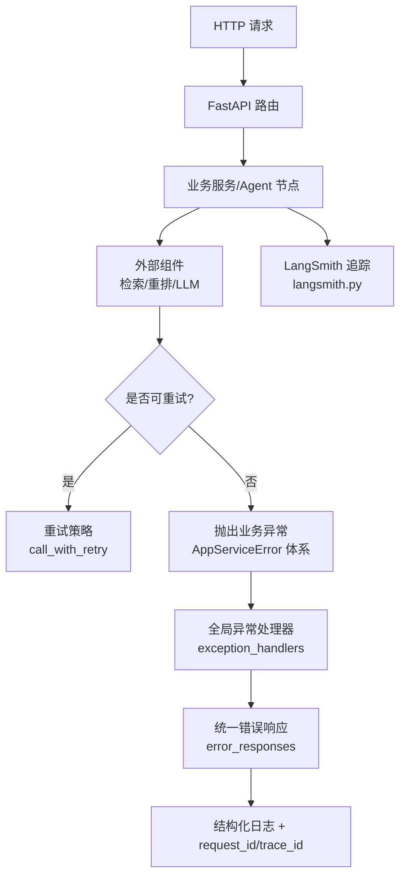
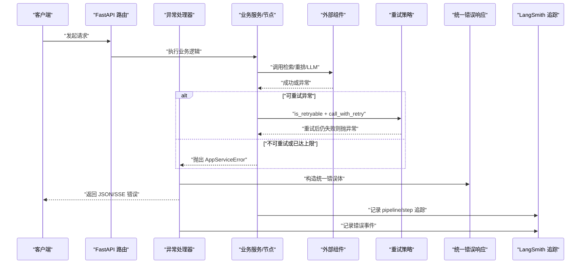
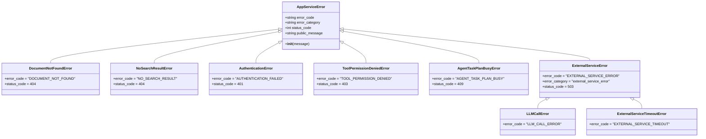
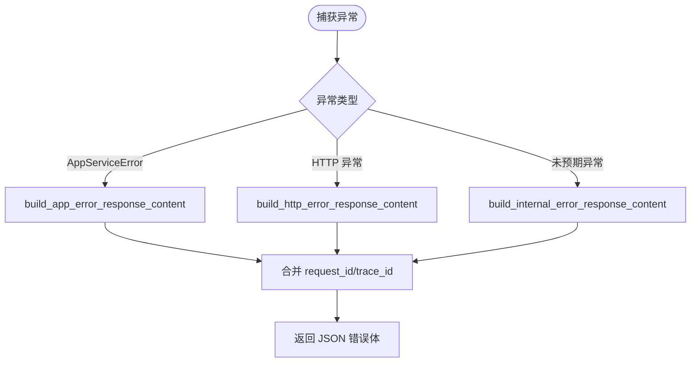
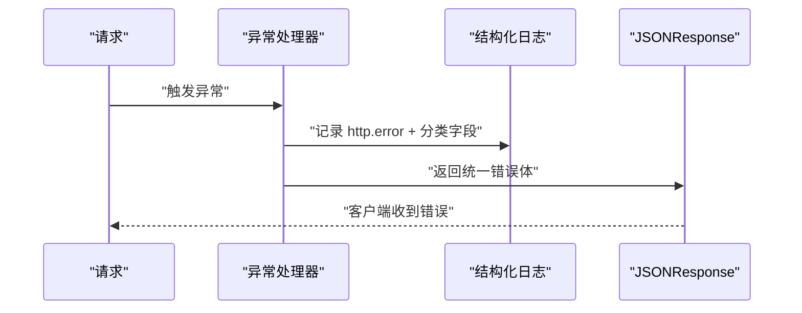
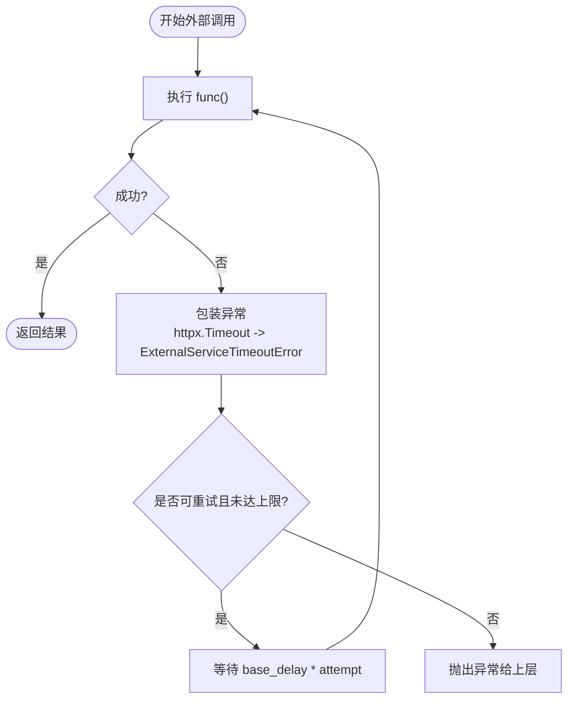
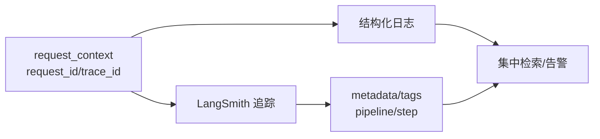
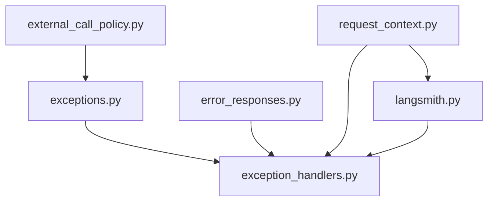

# 错误传播与处理

<cite>
**本文引用的文件**
- [src/fast_app/services/exceptions.py](file://src/fast_app/services/exceptions.py)
- [src/fast_app/core/error_responses.py](file://src/fast_app/core/error_responses.py)
- [src/fast_app/core/exception_handlers.py](file://src/fast_app/core/exception_handlers.py)
- [src/fast_app/services/external_call_policy.py](file://src/fast_app/services/external_call_policy.py)
- [src/fast_app/core/request_context.py](file://src/fast_app/core/request_context.py)
- [src/fast_app/core/langsmith.py](file://src/fast_app/core/langsmith.py)
- [src/fast_app/api/debug_trace_routes.py](file://src/fast_app/api/debug_trace_routes.py)
- [learning-docs/phase-9/9-8-超时重试降级与fallback.md](file://learning-docs/phase-9/9-8-超时重试降级与fallback.md)
- [learning-docs/phase-12/12-9-错误日志分层-用户错误-外部服务错误-系统错误.md](file://learning-docs/phase-12/12-9-错误日志分层-用户错误-外部服务错误-系统错误.md)
</cite>

## 目录
1. [简介](#简介)
2. [项目结构](#项目结构)
3. [核心组件](#核心组件)
4. [架构总览](#架构总览)
5. [详细组件分析](#详细组件分析)
6. [依赖关系分析](#依赖关系分析)
7. [性能考量](#性能考量)
8. [故障排查指南](#故障排查指南)
9. [结论](#结论)
10. [附录](#附录)

## 简介
本文件系统化梳理本项目在跨组件的错误传播与处理机制，覆盖异常类型定义、错误码规范、错误信息格式化、错误边界设置、降级策略与熔断思路、分布式环境下的错误追踪与诊断，并配套错误传播流程图、降级决策树与监控告警策略。目标是帮助开发者快速定位问题、统一对外错误语义、提升系统在外部依赖不稳定时的韧性。

## 项目结构
围绕错误处理的关键代码集中在以下模块：
- 业务异常定义：services/exceptions.py
- 统一错误响应构造：core/error_responses.py
- HTTP 层异常处理器：core/exception_handlers.py
- 外部调用重试与超时包装：services/external_call_policy.py
- 请求上下文（request_id/trace_id）：core/request_context.py
- 可观测性（LangSmith 追踪）：core/langsmith.py
- 调试接口复用错误构造：api/debug_trace_routes.py
- 设计文档与策略说明：learning-docs 下相关阶段文档

图表来源
- [src/fast_app/core/exception_handlers.py:26-152](file://src/fast_app/core/exception_handlers.py#L26-L152)
- [src/fast_app/core/error_responses.py:7-63](file://src/fast_app/core/error_responses.py#L7-L63)
- [src/fast_app/services/external_call_policy.py:21-74](file://src/fast_app/services/external_call_policy.py#L21-L74)
- [src/fast_app/core/langsmith.py:34-80](file://src/fast_app/core/langsmith.py#L34-L80)

章节来源
- [src/fast_app/core/exception_handlers.py:26-152](file://src/fast_app/core/exception_handlers.py#L26-L152)
- [src/fast_app/core/error_responses.py:7-63](file://src/fast_app/core/error_responses.py#L7-L63)
- [src/fast_app/services/external_call_policy.py:21-74](file://src/fast_app/services/external_call_policy.py#L21-L74)
- [src/fast_app/core/langsmith.py:34-80](file://src/fast_app/core/langsmith.py#L34-L80)

## 核心组件
- 异常类型与分类
  - 所有业务异常继承自 AppServiceError，携带 error_code、error_category、status_code、public_message，使异常自身能回答“返回什么状态码、错误码、错误类别、用户可见消息”。
  - 典型子类包括文档不存在、检索为空、认证失败、工具权限拒绝、任务计划冲突、外部服务不可用、LLM 调用错误、外部服务超时等。
- 统一错误响应
  - 通过 error_responses 提供 build_error_response_content、build_app_error_response_content、build_internal_error_response_content、build_http_error_response_content，确保 JSON 与 SSE 错误事件共用同一结构，包含 code、message、error_category、request_id、trace_id。
- HTTP 异常边界
  - exception_handlers 注册 RequestValidationError、StarletteHTTPException、AppServiceError 以及兜底 Exception 处理器，统一记录结构化日志并返回统一错误体。
- 外部调用重试与超时
  - external_call_policy 提供 is_retryable_httpx_error 与 call_with_retry，将 httpx.TimeoutException 包装为 ExternalServiceTimeoutError，按策略判断是否重试，并在最终失败时向上抛出。
- 请求上下文与追踪
  - request_context 维护 request_id 与 trace_id 的上下文变量，贯穿日志与追踪。
  - langsmith.py 提供 LangSmith 配置、元数据构建、敏感字段脱敏、pipeline/step 级追踪封装，便于分布式链路定位。

章节来源
- [src/fast_app/services/exceptions.py:1-190](file://src/fast_app/services/exceptions.py#L1-L190)
- [src/fast_app/core/error_responses.py:7-63](file://src/fast_app/core/error_responses.py#L7-L63)
- [src/fast_app/core/exception_handlers.py:26-152](file://src/fast_app/core/exception_handlers.py#L26-L152)
- [src/fast_app/services/external_call_policy.py:21-74](file://src/fast_app/services/external_call_policy.py#L21-L74)
- [src/fast_app/core/request_context.py:1-39](file://src/fast_app/core/request_context.py#L1-L39)
- [src/fast_app/core/langsmith.py:34-80](file://src/fast_app/core/langsmith.py#L34-L80)

## 架构总览
下图展示一次 RAG/Agent 请求从进入 HTTP 到外部依赖、再到错误传播与响应的完整路径，突出错误分类、重试、降级与追踪点。

图表来源
- [src/fast_app/core/exception_handlers.py:26-152](file://src/fast_app/core/exception_handlers.py#L26-L152)
- [src/fast_app/services/external_call_policy.py:21-74](file://src/fast_app/services/external_call_policy.py#L21-L74)
- [src/fast_app/core/error_responses.py:7-63](file://src/fast_app/core/error_responses.py#L7-L63)
- [src/fast_app/core/langsmith.py:221-254](file://src/fast_app/core/langsmith.py#L221-L254)

## 详细组件分析

### 异常类型与错误码规范
- 基类 AppServiceError 定义了默认错误码、错误类别、状态码与公开消息，子类通过覆盖这些属性表达具体语义。
- 错误类别分为三类：user_error、external_service_error、system_error，用于区分客户端输入错误、外部依赖失败与系统内部异常。
- 典型错误码示例：
  - DOCUMENT_NOT_FOUND、NO_SEARCH_RESULT、AUTHENTICATION_FAILED、TOOL_PERMISSION_DENIED、AGENT_TASK_PLAN_BUSY、EXTERNAL_SERVICE_ERROR、LLM_CALL_ERROR、EXTERNAL_SERVICE_TIMEOUT 等。
- 建议：新增异常时明确 error_code、error_category、status_code、public_message，避免裸字符串透传。

图表来源
- [src/fast_app/services/exceptions.py:1-190](file://src/fast_app/services/exceptions.py#L1-L190)

章节来源
- [src/fast_app/services/exceptions.py:1-190](file://src/fast_app/services/exceptions.py#L1-L190)

### 错误响应与格式化
- 统一错误响应内容包含：code、message、error_category、request_id、trace_id。
- 业务异常使用 build_app_error_response_content；系统异常使用 build_internal_error_response_content；HTTP 异常使用 build_http_error_response_content。
- 调试接口 debug_trace_routes 也复用统一错误构造，保证一致性与可观测性。

图表来源
- [src/fast_app/core/error_responses.py:7-63](file://src/fast_app/core/error_responses.py#L7-L63)
- [src/fast_app/api/debug_trace_routes.py:65-89](file://src/fast_app/api/debug_trace_routes.py#L65-L89)

章节来源
- [src/fast_app/core/error_responses.py:7-63](file://src/fast_app/core/error_responses.py#L7-L63)
- [src/fast_app/api/debug_trace_routes.py:65-89](file://src/fast_app/api/debug_trace_routes.py#L65-L89)

### HTTP 异常边界与日志分层
- FastAPI 层注册四类处理器：
  - 请求校验错误：REQUEST_VALIDATION_ERROR，user_error，422。
  - StarletteHTTPException：根据状态码自动归类 user_error 或 system_error。
  - AppServiceError：按异常内置 error_category 决定日志级别与响应。
  - 兜底 Exception：system_error，500，记录堆栈。
- 日志字段统一包含 event、error_category、error_code、path、method、status_code、error_type、message，便于集中检索与告警。

图表来源
- [src/fast_app/core/exception_handlers.py:26-152](file://src/fast_app/core/exception_handlers.py#L26-L152)

章节来源
- [src/fast_app/core/exception_handlers.py:26-152](file://src/fast_app/core/exception_handlers.py#L26-L152)

### 外部调用重试、降级与熔断
- 重试策略
  - is_retryable_httpx_error 判定超时、传输错误及特定 5xx/429 为可重试。
  - call_with_retry 支持最大重试次数与指数退避式延迟，并将 httpx.TimeoutException 包装为 ExternalServiceTimeoutError 以统一上层处理。
- 降级策略
  - 在 RAG 链路中，rerank 作为质量增强步骤可 fallback 到 RRF 结果；hybrid 模式下单路检索失败可由另一路继续支撑回答。
- 熔断思路
  - 当前工程未实现显式熔断器，但可通过重试上限、超时控制与上游限流配合达到类似效果；建议在关键外部依赖增加断路器模式（如基于失败率阈值快速短路），以避免雪崩。

图表来源
- [src/fast_app/services/external_call_policy.py:21-74](file://src/fast_app/services/external_call_policy.py#L21-L74)
- [learning-docs/phase-9/9-8-超时重试降级与fallback.md:227-417](file://learning-docs/phase-9/9-8-超时重试降级与fallback.md#L227-L417)

章节来源
- [src/fast_app/services/external_call_policy.py:21-74](file://src/fast_app/services/external_call_policy.py#L21-L74)
- [learning-docs/phase-9/9-8-超时重试降级与fallback.md:227-417](file://learning-docs/phase-9/9-8-超时重试降级与fallback.md#L227-L417)

### 分布式追踪与诊断
- 请求上下文
  - request_context 提供 request_id 与 trace_id 的上下文变量，贯穿日志与追踪。
- LangSmith 追踪
  - configure_langsmith 同步环境变量启用/禁用追踪。
  - 构建 pipeline root run 与 step run，附带 metadata/tags，支持敏感字段脱敏。
  - 调试接口在成功/失败路径均记录 latency_ms、error_type 等，便于对齐本地日志与远程追踪。
- 诊断建议
  - 通过 request_id/trace_id 关联日志与 LangSmith 链。
  - 关注 error_category 与 error_code，结合外部依赖 provider/operation 定位根因。
  - 对 system_error 必须保留堆栈；对 external_service_error 需记录 provider、operation、latency 等。

图表来源
- [src/fast_app/core/request_context.py:1-39](file://src/fast_app/core/request_context.py#L1-L39)
- [src/fast_app/core/langsmith.py:34-80](file://src/fast_app/core/langsmith.py#L34-L80)
- [src/fast_app/core/langsmith.py:221-254](file://src/fast_app/core/langsmith.py#L221-L254)
- [src/fast_app/api/debug_trace_routes.py:65-89](file://src/fast_app/api/debug_trace_routes.py#L65-L89)

章节来源
- [src/fast_app/core/request_context.py:1-39](file://src/fast_app/core/request_context.py#L1-L39)
- [src/fast_app/core/langsmith.py:34-80](file://src/fast_app/core/langsmith.py#L34-L80)
- [src/fast_app/core/langsmith.py:221-254](file://src/fast_app/core/langsmith.py#L221-L254)
- [src/fast_app/api/debug_trace_routes.py:65-89](file://src/fast_app/api/debug_trace_routes.py#L65-L89)

## 依赖关系分析
- 低耦合高内聚
  - exceptions 仅定义异常契约；error_responses 仅负责响应构造；exception_handlers 仅负责 HTTP 边界；external_call_policy 仅封装重试与超时；langsmith 仅负责追踪。
- 直接依赖
  - exception_handlers 依赖 error_responses 与 exceptions。
  - external_call_policy 依赖 exceptions 与 logging。
  - langsmith 依赖 request_context、config、logging。
- 潜在循环依赖
  - 当前未见循环导入；新增模块应遵循单向依赖原则。

图表来源
- [src/fast_app/core/exception_handlers.py:1-15](file://src/fast_app/core/exception_handlers.py#L1-L15)
- [src/fast_app/services/external_call_policy.py:1-15](file://src/fast_app/services/external_call_policy.py#L1-L15)
- [src/fast_app/core/langsmith.py:1-15](file://src/fast_app/core/langsmith.py#L1-L15)

章节来源
- [src/fast_app/core/exception_handlers.py:1-15](file://src/fast_app/core/exception_handlers.py#L1-L15)
- [src/fast_app/services/external_call_policy.py:1-15](file://src/fast_app/services/external_call_policy.py#L1-L15)
- [src/fast_app/core/langsmith.py:1-15](file://src/fast_app/core/langsmith.py#L1-L15)

## 性能考量
- 重试延迟
  - call_with_retry 采用 base_delay * attempt 的线性退避，注意在高并发场景下可能放大负载，建议结合队列或令牌桶限制重试风暴。
- 超时设置
  - 超时应置于组件层（检索/重排/LLM），避免全局过大导致请求堆积。
- 降级范围
  - 仅对非关键增强步骤（如 rerank）做 fallback；生成型步骤（LLM generate）失败不应简单降级为空答案。
- 追踪开销
  - LangSmith 追踪在开启时会写入 metadata/tags，生产环境需评估吞吐影响，必要时关闭或采样。

[本节为通用指导，不直接分析具体文件]

## 故障排查指南
- 快速定位
  - 使用 response 中的 request_id/trace_id 在日志系统中检索对应请求。
  - 关注 error_category：user_error 多为参数/权限问题；external_service_error 多为外部依赖失败；system_error 需检查堆栈。
- 常见问题
  - 请求校验失败：检查 Pydantic 模型与入参约束。
  - 外部服务超时：检查网络、下游健康与超时配置；确认是否命中可重试集合。
  - 检索为空：NoSearchResultError 属于业务正常分支，前端应友好提示而非视为系统故障。
- 调试技巧
  - 打开 LangSmith 追踪，查看 pipeline/step 级输入输出与耗时。
  - 在调试接口中观察 latency_ms 与 error_type，辅助定位瓶颈与异常点。
- 告警策略
  - 针对 external_service_error 与 system_error 设置阈值告警（如 5 分钟内错误率 > 5%）。
  - 对高频错误码（如 LLM_CALL_ERROR、EXTERNAL_SERVICE_TIMEOUT）单独告警通道。

章节来源
- [src/fast_app/core/exception_handlers.py:26-152](file://src/fast_app/core/exception_handlers.py#L26-L152)
- [src/fast_app/core/error_responses.py:7-63](file://src/fast_app/core/error_responses.py#L7-L63)
- [src/fast_app/core/langsmith.py:34-80](file://src/fast_app/core/langsmith.py#L34-L80)
- [src/fast_app/api/debug_trace_routes.py:65-89](file://src/fast_app/api/debug_trace_routes.py#L65-L89)

## 结论
本项目建立了清晰的错误分类、统一的错误响应格式、完善的 HTTP 异常边界、可控的重试与降级策略，以及贯穿全链路的分布式追踪能力。通过规范化异常契约与结构化日志，开发者可以快速定位问题、稳定对外行为，并在外部依赖不稳定时保持系统韧性。建议后续引入显式熔断机制与更细粒度的重试策略，进一步提升大规模场景下的稳定性与可观测性。

[本节为总结性内容，不直接分析具体文件]

## 附录
- 错误分类参考
  - user_error：客户端请求不合法或无可用业务结果。
  - external_service_error：后端逻辑正确但外部组件失败。
  - system_error：后端未预期异常。
- 最佳实践
  - 所有业务异常继承 AppServiceError 并声明 error_code、error_category、status_code、public_message。
  - 外部调用优先设置组件级 timeout，并使用 call_with_retry 进行受控重试。
  - 仅在安全与可恢复的步骤做 fallback；生成型步骤失败应明确拒答或回退策略。
  - 始终记录 request_id/trace_id，并通过 LangSmith 对齐本地日志与远程追踪。
  - 生产环境谨慎开启敏感字段上传，遵循脱敏策略。

章节来源
- [learning-docs/phase-12/12-9-错误日志分层-用户错误-外部服务错误-系统错误.md:82-373](file://learning-docs/phase-12/12-9-错误日志分层-用户错误-外部服务错误-系统错误.md#L82-L373)
- [src/fast_app/core/langsmith.py:109-134](file://src/fast_app/core/langsmith.py#L109-L134)