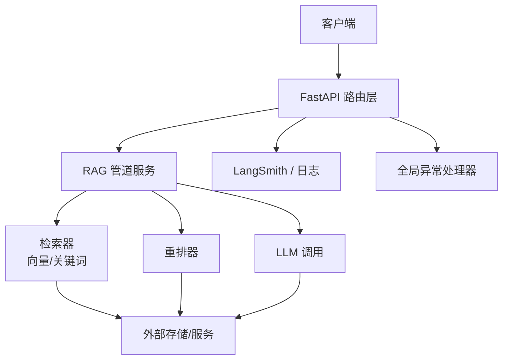
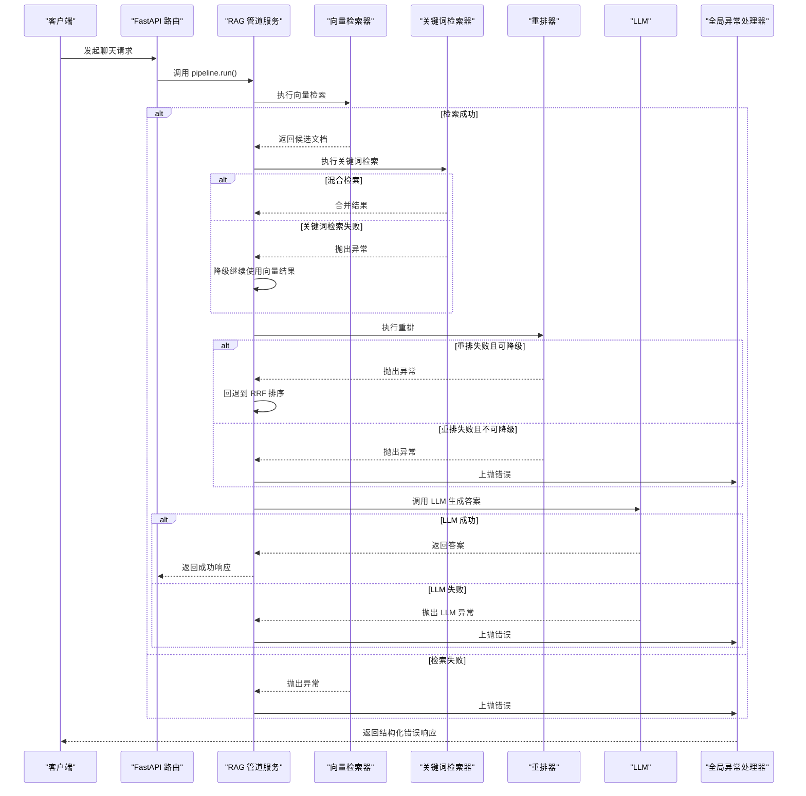
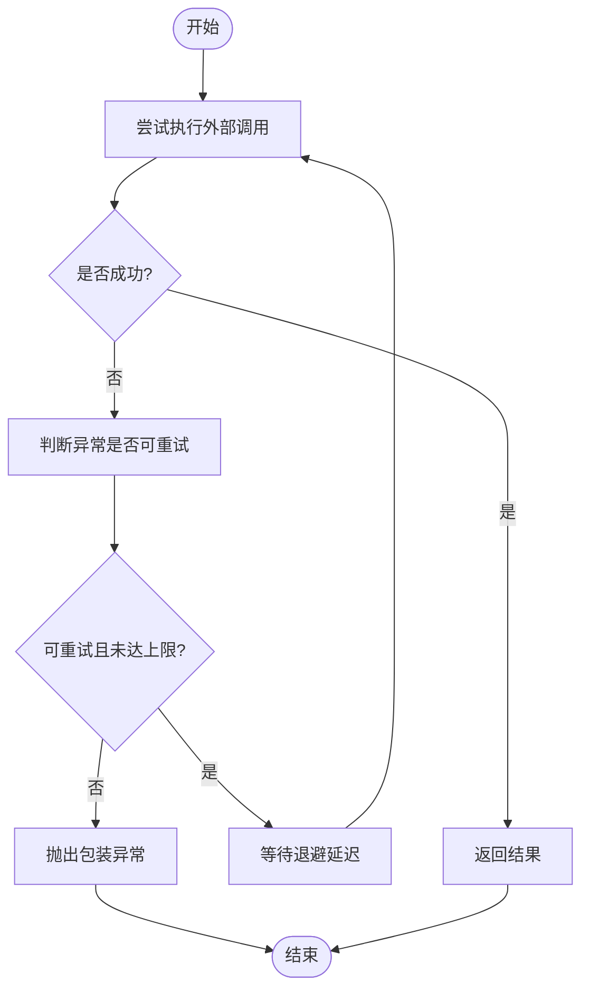
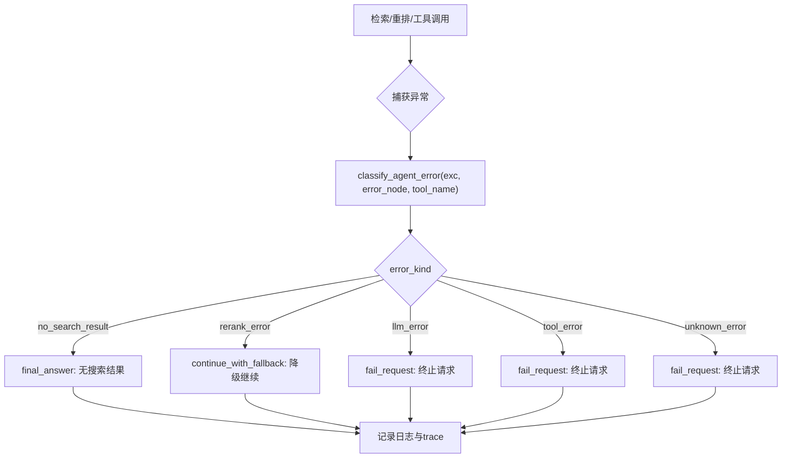
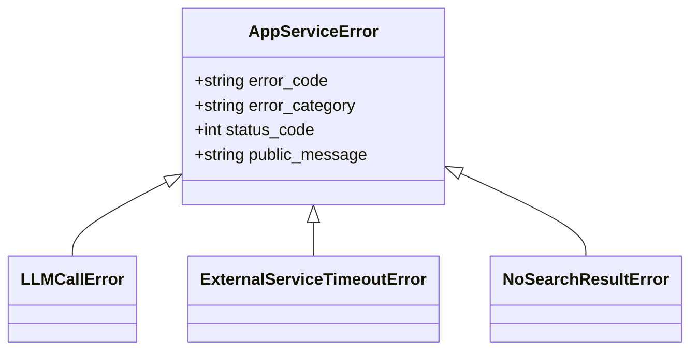
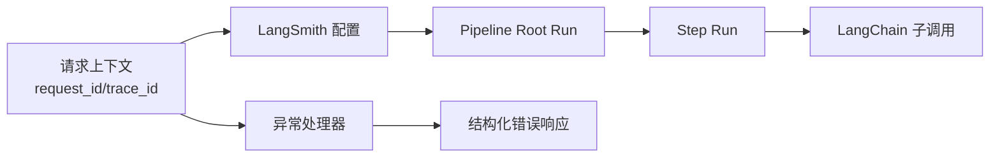
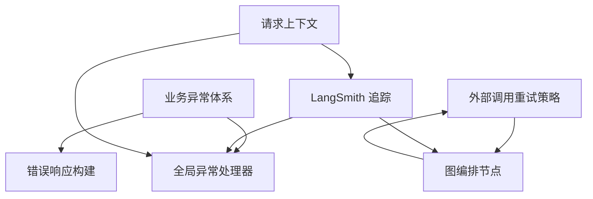

# 错误传播模式

<cite>
**本文引用的文件**
- [exception_handlers.py](file://src/fast_app/core/exception_handlers.py)
- [error_responses.py](file://src/fast_app/core/error_responses.py)
- [exceptions.py](file://src/fast_app/services/exceptions.py)
- [external_call_policy.py](file://src/fast_app/services/external_call_policy.py)
- [rag_chat_routes.py](file://src/fast_app/api/rag_chat_routes.py)
- [debug_trace_routes.py](file://src/fast_app/api/debug_trace_routes.py)
- [langgraph_rag_pipeline_service.py](file://src/fast_app/services/rag/langgraph_rag_pipeline_service.py)
- [rag_agent_nodes.py](file://src/fast_app/graph/rag_agent/rag_agent_nodes.py)
- [agent_error_policy.py](file://src/fast_app/agents/runtime/agent_error_policy.py)
- [langsmith.py](file://src/fast_app/core/langsmith.py)
- [request_context.py](file://src/fast_app/core/request_context.py)
</cite>

## 目录
1. [简介](#简介)
2. [项目结构](#项目结构)
3. [核心组件](#核心组件)
4. [架构总览](#架构总览)
5. [详细组件分析](#详细组件分析)
6. [依赖关系分析](#依赖关系分析)
7. [性能与稳定性考虑](#性能与稳定性考虑)
8. [故障排查指南](#故障排查指南)
9. [结论](#结论)
10. [附录](#附录)

## 简介
本文件聚焦于 RAG 管道中的“错误传播模式”，覆盖从检索器、重排器到 LLM 调用的完整错误链路，说明异常如何向上抛出、如何在边界处分类与降级、如何在分布式环境中追踪与诊断。文档包含错误传播流程图、降级决策树和重试策略，并提供最佳实践与调试技巧，帮助开发者快速定位复杂错误场景。

## 项目结构
错误处理在系统中分层实现：
- 接口层：FastAPI 全局异常处理器统一捕获并输出结构化错误响应，附带 request_id 与 trace_id。
- 服务层：业务异常体系 AppServiceError 及其子类表达明确的错误语义；外部调用封装统一的超时与重试策略。
- 图编排层：LangGraph/RAG Agent 节点将工具或检索失败转化为可恢复的错误决策，避免整条链路中断。
- 追踪层：通过 LangSmith 与本地日志，把一次请求的根 run、步骤 run、子 run 串联起来，便于跨组件定位问题。

**图示来源**
- [rag_chat_routes.py:105-134](file://src/fast_app/api/rag_chat_routes.py#L105-L134)
- [langgraph_rag_pipeline_service.py:163-199](file://src/fast_app/services/rag/langgraph_rag_pipeline_service.py#L163-L199)
- [exception_handlers.py:26-153](file://src/fast_app/core/exception_handlers.py#L26-L153)
- [external_call_policy.py:21-74](file://src/fast_app/services/external_call_policy.py#L21-L74)

**章节来源**
- [exception_handlers.py:26-153](file://src/fast_app/core/exception_handlers.py#L26-L153)
- [error_responses.py:7-64](file://src/fast_app/core/error_responses.py#L7-L64)
- [exceptions.py:1-190](file://src/fast_app/services/exceptions.py#L1-L190)
- [external_call_policy.py:21-74](file://src/fast_app/services/external_call_policy.py#L21-L74)
- [rag_chat_routes.py:105-134](file://src/fast_app/api/rag_chat_routes.py#L105-L134)
- [debug_trace_routes.py:65-89](file://src/fast_app/api/debug_trace_routes.py#L65-L89)
- [langgraph_rag_pipeline_service.py:163-199](file://src/fast_app/services/rag/langgraph_rag_pipeline_service.py#L163-L199)
- [rag_agent_nodes.py:900-994](file://src/fast_app/graph/rag_agent/rag_agent_nodes.py#L900-L994)
- [agent_error_policy.py:62-158](file://src/fast_app/agents/runtime/agent_error_policy.py#L62-L158)
- [langsmith.py:34-604](file://src/fast_app/core/langsmith.py#L34-L604)
- [request_context.py:1-39](file://src/fast_app/core/request_context.py#L1-L39)

## 核心组件
- 业务异常体系：AppServiceError 及其子类（如 LLMCallError、ExternalServiceTimeoutError、NoSearchResultError 等）承载错误码、类别、状态码与对外消息，用于上层统一处理。
- 外部调用策略：call_with_retry 对异步外部调用进行可重试判断、最大重试次数控制、线性退避延迟，并将 httpx 超时包装为 ExternalServiceTimeoutError。
- 全局异常处理器：注册 FastAPI 异常处理器，将 RequestValidationError、HTTPException、AppServiceError 与未预期异常分别记录并返回结构化 JSON 响应，附带 request_id 与 trace_id。
- 错误响应构建：统一构造 code、message、error_category、request_id、trace_id 的响应体，区分用户错误、外部服务错误与系统错误。
- 图编排错误决策：Agent 节点捕获工具/检索异常，使用 classify_agent_error 生成错误决策（kind/action/is_recoverable），支持 rerank 降级继续、LLM 错误直接失败等策略。
- 分布式追踪：LangSmith 配置与上下文注入，将 pipeline root run 与 step run 关联；本地日志与 LangSmith metadata 共享 request_id/trace_id，便于跨组件定位。

**章节来源**
- [exceptions.py:1-190](file://src/fast_app/services/exceptions.py#L1-L190)
- [external_call_policy.py:21-74](file://src/fast_app/services/external_call_policy.py#L21-L74)
- [exception_handlers.py:26-153](file://src/fast_app/core/exception_handlers.py#L26-L153)
- [error_responses.py:7-64](file://src/fast_app/core/error_responses.py#L7-L64)
- [rag_agent_nodes.py:900-994](file://src/fast_app/graph/rag_agent/rag_agent_nodes.py#L900-L994)
- [agent_error_policy.py:62-158](file://src/fast_app/agents/runtime/agent_error_policy.py#L62-L158)
- [langsmith.py:34-604](file://src/fast_app/core/langsmith.py#L34-L604)
- [request_context.py:1-39](file://src/fast_app/core/request_context.py#L1-L39)

## 架构总览
下图展示一次 RAG 请求的错误传播路径：从路由层进入管道服务，经过检索、重排、LLM 调用，任何环节抛出的异常都会按策略分类、重试或降级，最终由全局异常处理器输出统一错误响应，并通过 LangSmith/日志完成追踪。

**图示来源**
- [rag_chat_routes.py:105-134](file://src/fast_app/api/rag_chat_routes.py#L105-L134)
- [langgraph_rag_pipeline_service.py:163-199](file://src/fast_app/services/rag/langgraph_rag_pipeline_service.py#L163-L199)
- [rag_agent_nodes.py:900-994](file://src/fast_app/graph/rag_agent/rag_agent_nodes.py#L900-L994)
- [agent_error_policy.py:62-158](file://src/fast_app/agents/runtime/agent_error_policy.py#L62-L158)
- [exception_handlers.py:26-153](file://src/fast_app/core/exception_handlers.py#L26-L153)

## 详细组件分析

### 外部调用重试与超时包装
- 可重试判定：针对 httpx.TimeoutException、httpx.TransportError 以及特定 HTTP 状态码（429/500/502/503/504）允许重试。
- 重试策略：线性退避 delay = base_delay * attempt，达到最大重试次数后抛出包装后的异常。
- 超时包装：httpx 超时被转换为 ExternalServiceTimeoutError，便于上层统一识别和处理。

**图示来源**
- [external_call_policy.py:21-74](file://src/fast_app/services/external_call_policy.py#L21-L74)

**章节来源**
- [external_call_policy.py:21-74](file://src/fast_app/services/external_call_policy.py#L21-L74)

### 图编排层的错误分类与降级
- 知识检索节点捕获异常，调用 classify_agent_error 生成错误决策，记录 tool_error、error_kind、error_action，并写入 trace。
- 对于 rerank 阶段的外部服务错误，策略允许 continue_with_fallback，即降级继续使用 RRF 结果。
- 对于 LLM 错误或一般外部服务错误，通常 fail_request，终止当前请求。

**图示来源**
- [rag_agent_nodes.py:900-994](file://src/fast_app/graph/rag_agent/rag_agent_nodes.py#L900-L994)
- [agent_error_policy.py:62-158](file://src/fast_app/agents/runtime/agent_error_policy.py#L62-L158)

**章节来源**
- [rag_agent_nodes.py:900-994](file://src/fast_app/graph/rag_agent/rag_agent_nodes.py#L900-L994)
- [agent_error_policy.py:62-158](file://src/fast_app/agents/runtime/agent_error_policy.py#L62-L158)

### 全局异常处理器与错误响应
- 请求参数校验错误：422，标记 user_error。
- HTTP 异常：根据状态码区分 user_error 与 system_error。
- 业务异常：AppServiceError 子类携带 error_code、error_category、status_code，统一输出结构化响应。
- 未预期异常：500，标记 system_error，并记录内部错误信息。

**图示来源**
- [exceptions.py:1-190](file://src/fast_app/services/exceptions.py#L1-L190)

**章节来源**
- [exception_handlers.py:26-153](file://src/fast_app/core/exception_handlers.py#L26-L153)
- [error_responses.py:7-64](file://src/fast_app/core/error_responses.py#L7-L64)
- [exceptions.py:1-190](file://src/fast_app/services/exceptions.py#L1-L190)

### 分布式追踪与诊断
- 请求上下文：request_id 与 trace_id 通过 ContextVar 在请求生命周期内传递，供日志与追踪使用。
- LangSmith 配置：根据设置启用/禁用 tracing，注入 project、endpoint、api_key，并对敏感字段脱敏。
- 根运行与步骤运行：pipeline root run 与 step run 通过统一的 helper 创建，metadata/tags 包含 request_id、trace_id、pipeline_provider、step_name 等，便于过滤与定位。
- 调试接口：debug_trace_routes 在捕获 AppServiceError 时构建错误响应内容，并记录耗时与错误类型。

**图示来源**
- [request_context.py:1-39](file://src/fast_app/core/request_context.py#L1-L39)
- [langsmith.py:34-604](file://src/fast_app/core/langsmith.py#L34-L604)
- [debug_trace_routes.py:65-89](file://src/fast_app/api/debug_trace_routes.py#L65-L89)

**章节来源**
- [request_context.py:1-39](file://src/fast_app/core/request_context.py#L1-L39)
- [langsmith.py:34-604](file://src/fast_app/core/langsmith.py#L34-L604)
- [debug_trace_routes.py:65-89](file://src/fast_app/api/debug_trace_routes.py#L65-L89)

## 依赖关系分析
- 异常体系依赖：AppServiceError 作为基类，各具体异常继承其错误码、类别与状态码，确保上层统一处理。
- 重试策略依赖：external_call_policy 依赖 httpx 异常类型与自定义 is_retryable 函数，决定重试行为。
- 图编排依赖：rag_agent_nodes 依赖 agent_error_policy 的分类逻辑，将异常映射为可恢复或不可恢复的决策。
- 追踪依赖：langsmith 依赖 request_context 提供的 request_id/trace_id，并在 metadata/tags 中注入，形成可追溯的请求链。

**图示来源**
- [exceptions.py:1-190](file://src/fast_app/services/exceptions.py#L1-L190)
- [external_call_policy.py:21-74](file://src/fast_app/services/external_call_policy.py#L21-L74)
- [rag_agent_nodes.py:900-994](file://src/fast_app/graph/rag_agent/rag_agent_nodes.py#L900-L994)
- [langsmith.py:34-604](file://src/fast_app/core/langsmith.py#L34-L604)
- [request_context.py:1-39](file://src/fast_app/core/request_context.py#L1-L39)

**章节来源**
- [exceptions.py:1-190](file://src/fast_app/services/exceptions.py#L1-L190)
- [external_call_policy.py:21-74](file://src/fast_app/services/external_call_policy.py#L21-L74)
- [rag_agent_nodes.py:900-994](file://src/fast_app/graph/rag_agent/rag_agent_nodes.py#L900-L994)
- [langsmith.py:34-604](file://src/fast_app/core/langsmith.py#L34-L604)
- [request_context.py:1-39](file://src/fast_app/core/request_context.py#L1-L39)

## 性能与稳定性考虑
- 超时优先：外部调用应在组件层设置明确超时，避免请求长时间阻塞。
- 有限重试：仅对网络抖动、临时 5xx、限流等可重试错误进行重试，避免放大故障。
- 局部降级：rerank 失败可回退到 RRF 结果，保持基本可用性；LLM 生成失败无法简单降级，应快速失败并上报。
- 混合检索降级：hybrid 模式下单路检索失败不影响另一路成功时的回答。
- 慢操作监控：记录 pipeline 耗时与阈值告警，辅助定位瓶颈。

[本节提供通用指导，不直接分析具体文件]

## 故障排查指南
- 定位错误层级：
  - 用户错误：检查请求参数与权限，关注 4xx 与 user_error。
  - 外部服务错误：查看 LLM/检索/重排调用日志，关注 external_service_error。
  - 系统错误：关注 5xx 与 system_error，检查内部异常堆栈。
- 利用追踪 ID：
  - 通过 request_id/trace_id 在本地日志与 LangSmith 中串联一次请求的完整链路。
  - 在 LangSmith UI 中按 pipeline/provider/step 过滤，快速定位失败步骤。
- 常见场景：
  - 检索为空：NoSearchResultError 会转为 final_answer，提示无可靠来源。
  - 重排失败：rerank_error 触发 continue_with_fallback，继续使用 RRF 结果。
  - LLM 失败：LLMCallError 导致 fail_request，需检查模型服务与输入。
  - 超时：ExternalServiceTimeoutError 表明外部调用超时，检查网络与超时配置。

**章节来源**
- [exception_handlers.py:26-153](file://src/fast_app/core/exception_handlers.py#L26-L153)
- [error_responses.py:7-64](file://src/fast_app/core/error_responses.py#L7-L64)
- [exceptions.py:1-190](file://src/fast_app/services/exceptions.py#L1-L190)
- [rag_agent_nodes.py:900-994](file://src/fast_app/graph/rag_agent/rag_agent_nodes.py#L900-L994)
- [agent_error_policy.py:62-158](file://src/fast_app/agents/runtime/agent_error_policy.py#L62-L158)
- [langsmith.py:34-604](file://src/fast_app/core/langsmith.py#L34-L604)

## 结论
本项目的错误传播模式以“明确异常语义 + 可重试策略 + 局部降级 + 统一追踪”为核心：
- 异常向上抛出，但在图编排层进行分类与降级，避免整条链路崩溃。
- 外部调用具备超时与重试能力，关键步骤支持 fallback。
- 全局异常处理器输出结构化错误响应，附带 request_id/trace_id。
- LangSmith 与本地日志共同构成可复盘的分布式追踪链路。
遵循这些模式，可在复杂 RAG 场景中快速定位与解决错误，提升系统的稳定性与可维护性。

[本节总结性内容，不直接分析具体文件]

## 附录
- 最佳实践
  - 在组件层设置合理超时，避免长尾请求。
  - 仅对幂等或可恢复错误进行重试，避免雪崩。
  - 对非关键增强步骤（如 rerank）实现降级，保证基本功能可用。
  - 所有异常均携带 error_code、error_category、status_code，便于统一处理。
  - 使用 request_id/trace_id 贯穿全链路，结合 LangSmith 进行可视化排查。
- 调试技巧
  - 通过 debug_trace_routes 获取错误内容与耗时，辅助定位。
  - 在 LangSmith 中按 step_name 过滤，快速定位失败步骤。
  - 关注 slow operation 日志，识别性能瓶颈。

[本节提供通用指导，不直接分析具体文件]