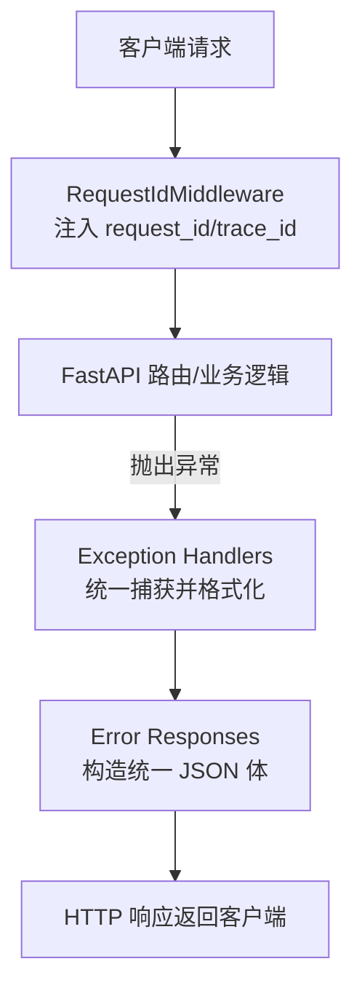
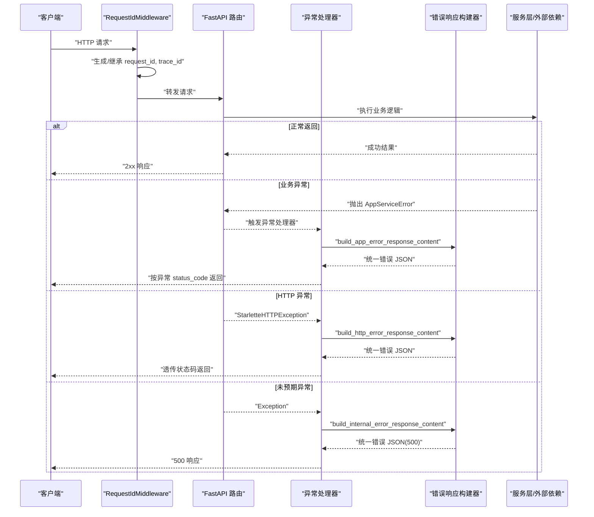
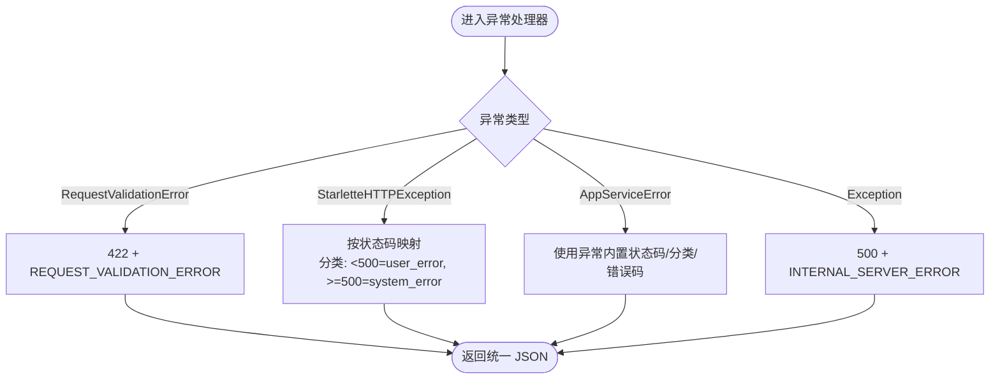
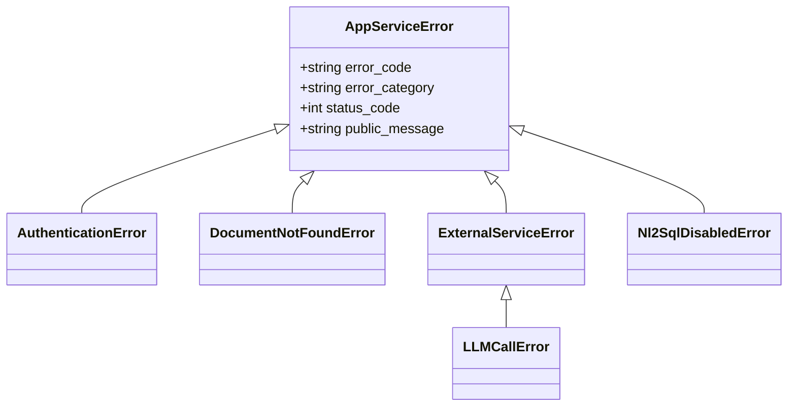
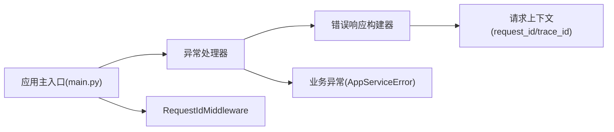

# 错误响应格式化

<cite>
**本文引用的文件**
- [error_responses.py](file://src/fast_app/core/error_responses.py)
- [exception_handlers.py](file://src/fast_app/core/exception_handlers.py)
- [exceptions.py](file://src/fast_app/services/exceptions.py)
- [request_context.py](file://src/fast_app/core/request_context.py)
- [request_id_middleware.py](file://src/fast_app/middlewares/request_id_middleware.py)
- [main.py](file://src/fast_app/main.py)
- [error_demo_routes.py](file://src/fast_app/api/error_demo_routes.py)
</cite>

## 目录
1. [简介](#简介)
2. [项目结构](#项目结构)
3. [核心组件](#核心组件)
4. [架构总览](#架构总览)
5. [详细组件分析](#详细组件分析)
6. [依赖关系分析](#依赖关系分析)
7. [性能考虑](#性能考虑)
8. [故障排查指南](#故障排查指南)
9. [结论](#结论)
10. [附录](#附录)

## 简介
本文件系统性说明本项目的统一错误响应格式设计，涵盖 HTTP 状态码映射、错误信息结构、调试信息处理、用户友好消息与内部错误信息的分离机制、不同错误类型的响应规范、JSON 结构示例与字段说明、版本兼容性考虑，以及构建与扩展错误响应的最佳实践。

## 项目结构
错误响应相关能力集中在以下模块：
- 统一响应构建：error_responses.py
- 异常处理器注册与路由：exception_handlers.py
- 业务异常类型定义：services/exceptions.py
- 请求上下文（request_id/trace_id）：core/request_context.py 与 middlewares/request_id_middleware.py
- 应用启动与中间件/异常处理器装配：fast_app/main.py
- 演示路由（用于验证错误响应）：api/error_demo_routes.py

图表来源
- [request_id_middleware.py:19-98](file://src/fast_app/middlewares/request_id_middleware.py#L19-L98)
- [exception_handlers.py:26-153](file://src/fast_app/core/exception_handlers.py#L26-L153)
- [error_responses.py:7-64](file://src/fast_app/core/error_responses.py#L7-L64)

章节来源
- [main.py:132-170](file://src/fast_app/main.py#L132-L170)
- [request_id_middleware.py:19-98](file://src/fast_app/middlewares/request_id_middleware.py#L19-L98)
- [exception_handlers.py:26-153](file://src/fast_app/core/exception_handlers.py#L26-L153)
- [error_responses.py:7-64](file://src/fast_app/core/error_responses.py#L7-L64)

## 核心组件
- 统一响应构建器
  - build_error_response_content：生成包含 code、message、error_category、request_id、trace_id 的统一 JSON 体。
  - build_app_error_response_content：基于业务异常 AppServiceError 的公开消息与分类生成响应体。
  - build_internal_error_response_content：系统级内部错误的固定响应体。
  - build_http_error_response_content：根据 HTTP 状态码推导 error_category，并生成对应响应体。
- 异常处理器
  - 校验错误 RequestValidationError → 422
  - HTTP 异常 StarletteHTTPException → 透传状态码
  - 业务异常 AppServiceError → 使用业务异常中的状态码与分类
  - 未预期异常 Exception → 500 内部错误
- 业务异常体系
  - AppServiceError 及其子类定义了 error_code、status_code、error_category、public_message 等，用于对外暴露的用户友好信息与对内的错误分类。
- 请求上下文
  - request_id/trace_id 通过 ContextVar 在请求生命周期内传播，由中间件设置并在响应中回写。

章节来源
- [error_responses.py:7-64](file://src/fast_app/core/error_responses.py#L7-L64)
- [exception_handlers.py:26-153](file://src/fast_app/core/exception_handlers.py#L26-L153)
- [exceptions.py:1-190](file://src/fast_app/services/exceptions.py#L1-L190)
- [request_context.py:1-39](file://src/fast_app/core/request_context.py#L1-L39)
- [request_id_middleware.py:19-98](file://src/fast_app/middlewares/request_id_middleware.py#L19-L98)

## 架构总览
下图展示一次请求从进入、到异常捕获、再到统一错误响应返回的完整流程。

图表来源
- [request_id_middleware.py:28-98](file://src/fast_app/middlewares/request_id_middleware.py#L28-L98)
- [exception_handlers.py:26-153](file://src/fast_app/core/exception_handlers.py#L26-L153)
- [error_responses.py:7-64](file://src/fast_app/core/error_responses.py#L7-L64)

## 详细组件分析

### 统一错误响应构建器
- 职责
  - 将不同来源的错误（HTTP、业务、系统）统一为一致的 JSON 结构。
  - 自动注入 request_id/trace_id，便于全链路追踪。
  - 依据状态码或异常分类决定 error_category，区分“用户错误”、“系统错误”、“外部服务错误”。
- 关键函数
  - build_error_response_content：基础构造器，封装公共字段。
  - build_app_error_response_content：从 AppServiceError 提取 public_message、error_code、error_category。
  - build_http_error_response_content：根据状态码推断分类，生成 HTTP_* 错误码。
  - build_internal_error_response_content：固定返回 INTERNAL_SERVER_ERROR。
- 数据结构
  - code：字符串错误码，如 HTTP_404、DOCUMENT_NOT_FOUND、INTERNAL_SERVER_ERROR。
  - message：面向用户的友好提示。
  - error_category：user_error / system_error / external_service_error。
  - request_id：请求唯一标识。
  - trace_id：链路追踪标识（默认等于 request_id）。

章节来源
- [error_responses.py:7-64](file://src/fast_app/core/error_responses.py#L7-L64)
- [request_context.py:16-30](file://src/fast_app/core/request_context.py#L16-L30)

### 异常处理器与 HTTP 状态码映射
- 校验错误（RequestValidationError）
  - 状态码：422
  - 错误码：REQUEST_VALIDATION_ERROR
  - 分类：user_error
- HTTP 异常（StarletteHTTPException）
  - 状态码：透传 exc.status_code
  - 错误码：HTTP_{status_code}
  - 分类：<500 为 user_error，>=500 为 system_error
- 业务异常（AppServiceError）
  - 状态码：exc.status_code
  - 错误码：exc.error_code
  - 分类：exc.error_category（可覆盖为 external_service_error/system_error）
- 未预期异常（Exception）
  - 状态码：500
  - 错误码：INTERNAL_SERVER_ERROR
  - 分类：system_error

图表来源
- [exception_handlers.py:26-153](file://src/fast_app/core/exception_handlers.py#L26-L153)

章节来源
- [exception_handlers.py:26-153](file://src/fast_app/core/exception_handlers.py#L26-L153)

### 业务异常体系与错误分类
- 基类 AppServiceError
  - 提供默认 error_code、status_code、error_category 与 public_message。
- 典型子类
  - 认证与权限：AuthenticationError(401)、ToolPermissionDeniedError(403)
  - 资源不存在：DocumentNotFoundError(404)、NoSearchResultError(404)
  - 冲突与不可用：AgentTaskPlanBusyError(409)、KnowledgeVersionNotReadyError(409)
  - 外部服务失败：ExternalServiceError(503)、LLMCallError、ExternalServiceTimeoutError
  - NL2SQL 相关：Nl2SqlDisabledError(503)、Nl2SqlPermissionDeniedError(403)、Nl2SqlUnsafeSqlError(400) 等
- 分类策略
  - 默认 user_error；当需要表达外部依赖或系统问题时，子类可覆盖为 external_service_error 或 system_error。

图表来源
- [exceptions.py:1-190](file://src/fast_app/services/exceptions.py#L1-L190)

章节来源
- [exceptions.py:1-190](file://src/fast_app/services/exceptions.py#L1-L190)

### 请求上下文与调试信息
- request_id/trace_id
  - 由 RequestIdMiddleware 在请求入口处生成或复用，写入 request.state 并通过 ContextVar 传播。
  - 错误响应中自动附带 request_id 与 trace_id，便于日志关联与问题定位。
- 日志与慢请求
  - 中间件记录 http.request.finish/slow/failed 事件，便于性能与稳定性监控。
- 响应头
  - 响应中回写 X-Request-ID，方便客户端与网关侧关联。

章节来源
- [request_id_middleware.py:19-98](file://src/fast_app/middlewares/request_id_middleware.py#L19-L98)
- [request_context.py:1-39](file://src/fast_app/core/request_context.py#L1-L39)

### 错误响应 JSON 结构与示例
- 通用字段
  - code：字符串错误码
  - message：用户可读的错误描述
  - error_category：user_error / system_error / external_service_error
  - request_id：请求唯一 ID
  - trace_id：链路追踪 ID
- 示例（示意）
  - 404 未找到
    - 状态码：404
    - 响应体：{ "code": "HTTP_404", "message": "...", "error_category": "user_error", "request_id": "...", "trace_id": "..." }
  - 401 认证失败
    - 状态码：401
    - 响应体：{ "code": "AUTHENTICATION_FAILED", "message": "...", "error_category": "user_error", "request_id": "...", "trace_id": "..." }
  - 403 权限不足
    - 状态码：403
    - 响应体：{ "code": "TOOL_PERMISSION_DENIED", "message": "...", "error_category": "user_error", "request_id": "...", "trace_id": "..." }
  - 422 参数校验失败
    - 状态码：422
    - 响应体：{ "code": "REQUEST_VALIDATION_ERROR", "message": "请求参数不合法", "error_category": "user_error", "request_id": "...", "trace_id": "..." }
  - 500 内部错误
    - 状态码：500
    - 响应体：{ "code": "INTERNAL_SERVER_ERROR", "message": "服务器内部错误", "error_category": "system_error", "request_id": "...", "trace_id": "..." }
  - 503 外部服务不可用
    - 状态码：503
    - 响应体：{ "code": "EXTERNAL_SERVICE_ERROR", "message": "...", "error_category": "external_service_error", "request_id": "...", "trace_id": "..." }

章节来源
- [error_responses.py:7-64](file://src/fast_app/core/error_responses.py#L7-L64)
- [exception_handlers.py:26-153](file://src/fast_app/core/exception_handlers.py#L26-L153)
- [exceptions.py:1-190](file://src/fast_app/services/exceptions.py#L1-L190)

### 用户友好消息与内部错误信息分离
- 对外消息
  - 通过 AppServiceError.public_message 暴露给用户，避免泄露敏感细节。
- 对内信息
  - 异常处理器记录详细的错误类型、路径、方法、状态码、堆栈等信息至日志系统，供运维与开发排查。
- 分类驱动
  - error_category 明确错误来源与责任边界，指导前端与网关进行差异化处理（重试、降级、告警）。

章节来源
- [exception_handlers.py:93-125](file://src/fast_app/core/exception_handlers.py#L93-L125)
- [exceptions.py:1-190](file://src/fast_app/services/exceptions.py#L1-L190)

### 版本兼容性与演进建议
- 向后兼容
  - 新增字段时应保持可选，避免破坏旧客户端解析。
  - 错误码命名采用稳定前缀（如 HTTP_、APP_*），避免频繁变更。
- 渐进式升级
  - 可通过 error_category 与 code 组合实现语义化演进，保留历史兼容分支。
- 文档与契约
  - 维护统一的错误码字典与示例，随版本发布同步更新。

[本节为通用建议，不直接引用具体代码]

### 最佳实践与自定义扩展
- 在业务层抛出自定义 AppServiceError 子类，明确 error_code、status_code、error_category 与 public_message。
- 不要直接返回裸异常或原始堆栈；始终通过异常处理器统一包装。
- 对于外部依赖失败，优先使用 external_service_error 分类，便于网关重试与熔断。
- 在测试中利用演示路由验证错误响应一致性。

章节来源
- [error_demo_routes.py:1-20](file://src/fast_app/api/error_demo_routes.py#L1-L20)
- [exceptions.py:1-190](file://src/fast_app/services/exceptions.py#L1-L190)

## 依赖关系分析
- 组件耦合
  - exception_handlers 依赖 error_responses 与 services.exceptions，形成“捕获→构造→返回”的单向依赖。
  - error_responses 依赖 request_context 获取 request_id/trace_id。
  - main.py 负责组装中间件与异常处理器，确保全局生效。
- 外部依赖
  - FastAPI/Starlette 异常类型作为输入源。
  - 日志与追踪基础设施用于可观测性。

图表来源
- [exception_handlers.py:26-153](file://src/fast_app/core/exception_handlers.py#L26-L153)
- [error_responses.py:7-64](file://src/fast_app/core/error_responses.py#L7-L64)
- [request_context.py:1-39](file://src/fast_app/core/request_context.py#L1-L39)
- [main.py:132-170](file://src/fast_app/main.py#L132-L170)

章节来源
- [main.py:132-170](file://src/fast_app/main.py#L132-L170)
- [exception_handlers.py:26-153](file://src/fast_app/core/exception_handlers.py#L26-L153)
- [error_responses.py:7-64](file://src/fast_app/core/error_responses.py#L7-L64)
- [request_context.py:1-39](file://src/fast_app/core/request_context.py#L1-L39)

## 性能考虑
- 异常路径开销
  - 统一异常处理器会记录日志并构造 JSON，建议在高频错误场景下关注日志量与序列化成本。
- 慢请求识别
  - 中间件已提供慢请求阈值配置，结合错误响应中的 request_id/trace_id 可快速定位瓶颈。
- 外部依赖超时
  - 对 503 类错误应配合重试与熔断策略，避免雪崩。

[本节为通用建议，不直接引用具体代码]

## 故障排查指南
- 快速定位
  - 使用响应中的 request_id/trace_id 在日志系统中检索完整链路。
- 常见问题
  - 422 参数校验失败：检查入参结构与校验规则。
  - 401/403：检查认证与权限策略。
  - 404：确认资源是否存在或路径是否正确。
  - 500：查看服务端日志堆栈，定位未预期异常。
  - 503：检查外部服务健康与限流策略。
- 复现与验证
  - 使用 /error-demo 路由模拟常见错误，验证客户端处理逻辑。

章节来源
- [exception_handlers.py:26-153](file://src/fast_app/core/exception_handlers.py#L26-L153)
- [error_demo_routes.py:1-20](file://src/fast_app/api/error_demo_routes.py#L1-L20)

## 结论
本项目通过统一的异常处理器与错误响应构建器，实现了跨模块一致的错误输出格式，清晰区分用户错误、系统错误与外部服务错误，并提供完整的调试信息（request_id/trace_id）。该设计既保证了用户体验，又提升了可观测性与排障效率。建议持续完善业务异常分类与错误码字典，确保前后端协作顺畅与长期可维护性。

## 附录
- 集成要点
  - 在应用启动时调用 register_exception_handlers(app)。
  - 确保 RequestIdMiddleware 已注册，以便注入 request_id/trace_id。
- 参考路由
  - /error-demo/bad-request、/error-demo/not-found 可用于快速验证错误响应格式。

章节来源
- [main.py:132-170](file://src/fast_app/main.py#L132-L170)
- [error_demo_routes.py:1-20](file://src/fast_app/api/error_demo_routes.py#L1-L20)