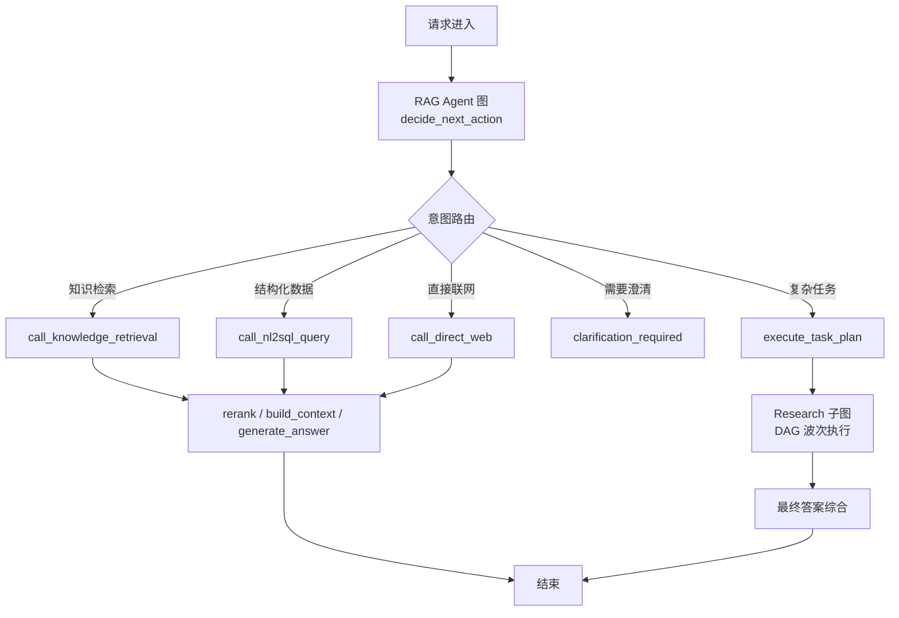
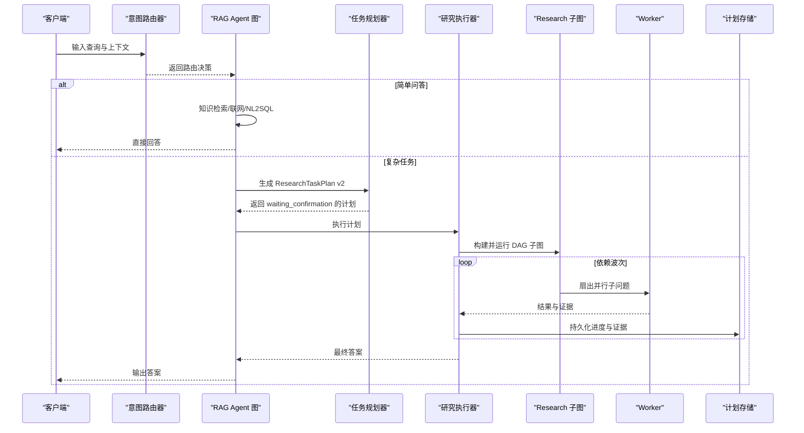
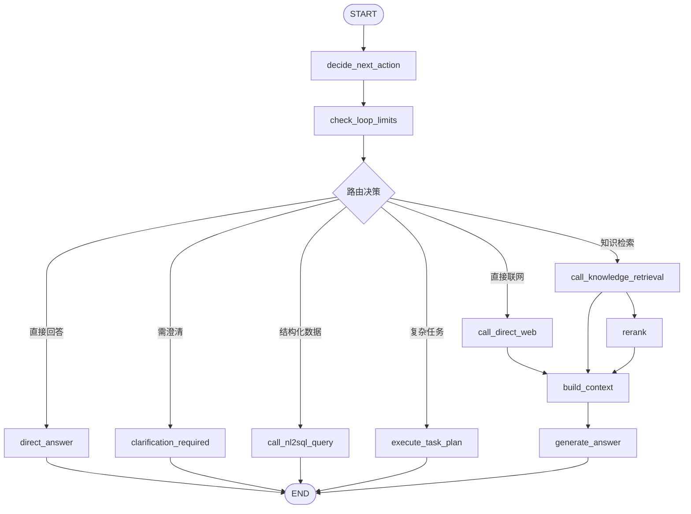
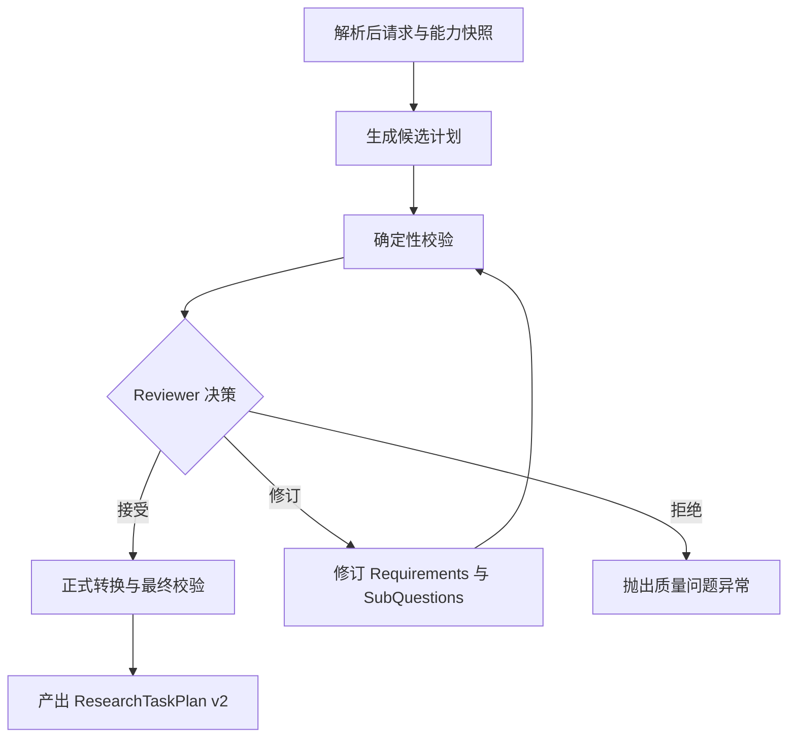
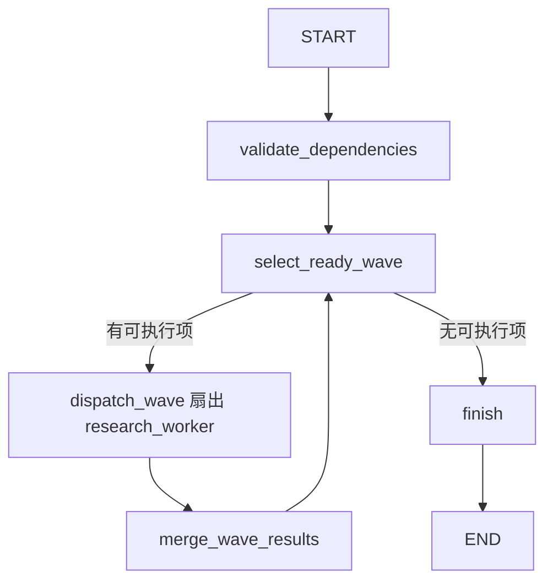
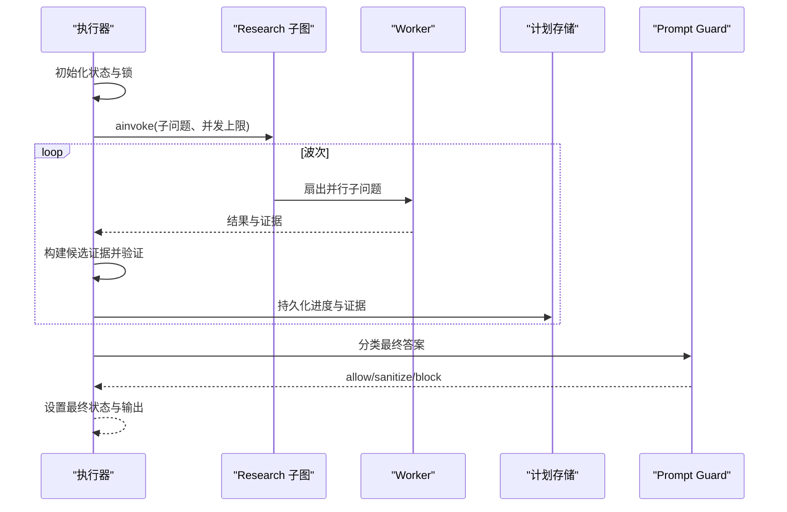
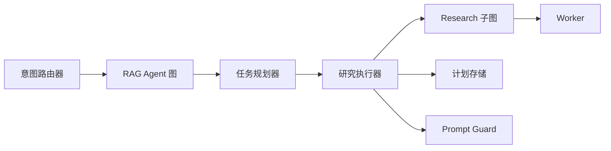

# Agent 工作流

<cite>
**本文引用的文件**
- [rag_agent_builder.py](file://python-agent-study/src/fast_app/graph/rag_agent/rag_agent_builder.py)
- [rag_agent_nodes.py](file://python-agent-study/src/fast_app/graph/rag_agent/rag_agent_nodes.py)
- [agentic_research_graph.py](file://python-agent-study/src/fast_app/graph/research/agentic_research_graph.py)
- [agentic_research_executor.py](file://python-agent-study/src/fast_app/services/research/agentic_research_executor.py)
- [research_task_plan.py](file://python-agent-study/src/fast_app/domain/research_task_plan.py)
- [agent_task_planner.py](file://python-agent-study/src/fast_app/services/agent_tasks/agent_task_planner.py)
</cite>

## 目录
1. [简介](#简介)
2. [项目结构](#项目结构)
3. [核心组件](#核心组件)
4. [架构总览](#架构总览)
5. [详细组件分析](#详细组件分析)
6. [依赖关系分析](#依赖关系分析)
7. [性能考虑](#性能考虑)
8. [故障排查指南](#故障排查指南)
9. [结论](#结论)
10. [附录](#附录)

## 简介
本文件面向基于 LangGraph 的 Agent 工作流，系统性说明意图识别与路由、任务分解与规划、Research Task Plan v2 的生成与执行流程。重点覆盖以下目标：
- 状态机设计：RAG Agent 主图与研究子图的节点编排、条件边与循环控制。
- 意图识别与路由：Router 决定知识检索、结构化数据查询、直接联网或澄清等分支。
- 任务分解与规划：Planner 将用户问题拆分为 Requirement 与 SubQuestion，并经过校验与 Reviewer 质量门禁。
- 并行执行与结果聚合：按依赖波次派发 Worker，合并结果、更新证据注册表与需求满足度。
- 错误处理与可恢复性：取消、超时、权限拒绝、依赖失败级联跳过、进度事件与检查点。
- 自定义与扩展：如何添加节点、配置执行策略、监控任务状态。

## 项目结构
Agent 工作流由“上层 RAG Agent 图”和“下层 Research 子图”组成：
- 上层 RAG Agent 图负责意图判断、工具调用、上下文构建与回答生成；当遇到复杂多源问题时，路由到任务执行阶段。
- 下层 Research 子图以 DAG 波次调度多个 Worker，完成知识库、网络与数据集的多源研究，最终综合输出。

图表来源
- [rag_agent_builder.py:37-199](file://python-agent-study/src/fast_app/graph/rag_agent/rag_agent_builder.py#L37-L199)
- [agentic_research_graph.py:111-276](file://python-agent-study/src/fast_app/graph/research/agentic_research_graph.py#L111-L276)

章节来源
- [rag_agent_builder.py:37-199](file://python-agent-study/src/fast_app/graph/rag_agent/rag_agent_builder.py#L37-L199)

## 核心组件
- RagAgentBuilder（RAG Agent 图构建器）
  - 职责：组装 RAG Agent 的状态图节点与边，定义意图路由后的执行路径，集成循环限制检查、工具调用、重排、上下文构建与回答生成。
  - 关键行为：在 decide_next_action 之后进入 check_loop_limits，再根据路由选择知识检索、NL2SQL、直接联网、澄清或直接回答；若存在任务执行器，则允许路由到 execute_task_plan。
- AgentTaskRouter（意图路由器）
  - 职责：读取当前查询与冻结会话上下文，返回下一条 Graph 路由及其状态更新；仅做意图选择，不创建计划。
  - 协作：与 Planner 解耦，Planner 只为已确定的复杂分支创建 TaskPlan。
- AgentTaskPlanner（任务规划器）
  - 职责：生成 Requirements 与 SubQuestion 候选，经确定性校验与 Reviewer 质量门禁后产出正式 ResearchTaskPlan v2。
  - 关键约束：Requirement 原子化、来源契约、证据阈值、依赖建模、能力快照与 Dataset 范围冻结。
- AgenticResearchExecutor（研究执行器）
  - 职责：按 DAG 波次执行 ResearchWorker，维护 Evidence Registry、进度事件、检查点、取消与超时处理，最终综合答案并通过 Output Guard。
- Research 子图（LangGraph 子图）
  - 职责：校验依赖、选择下一批可并行执行的子问题、扇出 Worker、合并结果、回到选择波次，直到全部完成或终止。

章节来源
- [rag_agent_builder.py:37-199](file://python-agent-study/src/fast_app/graph/rag_agent/rag_agent_builder.py#L37-L199)
- [rag_agent_nodes.py:417-442](file://python-agent-study/src/fast_app/graph/rag_agent/rag_agent_nodes.py#L417-L442)
- [agent_task_planner.py:88-269](file://python-agent-study/src/fast_app/services/agent_tasks/agent_task_planner.py#L88-L269)
- [agentic_research_executor.py:57-519](file://python-agent-study/src/fast_app/services/research/agentic_research_executor.py#L57-L519)
- [agentic_research_graph.py:34-276](file://python-agent-study/src/fast_app/graph/research/agentic_research_graph.py#L34-L276)

## 架构总览
整体架构采用“两层图 + 服务编排”的模式：
- 上层 RAG Agent 图：意图识别、工具调用、上下文构建与回答生成；复杂任务委派给任务执行器。
- 下层 Research 子图：以 DAG 波次并发执行子问题，严格管理依赖、并发上限、取消信号与进度持久化。
- 服务层：Planner 负责规划与质量门禁；Executor 负责执行、证据聚合与最终综合。

图表来源
- [rag_agent_nodes.py:417-442](file://python-agent-study/src/fast_app/graph/rag_agent/rag_agent_nodes.py#L417-L442)
- [agent_task_planner.py:102-269](file://python-agent-study/src/fast_app/services/agent_tasks/agent_task_planner.py#L102-L269)
- [agentic_research_executor.py:86-519](file://python-agent-study/src/fast_app/services/research/agentic_research_executor.py#L86-L519)
- [agentic_research_graph.py:111-276](file://python-agent-study/src/fast_app/graph/research/agentic_research_graph.py#L111-L276)

## 详细组件分析

### RAG Agent 图与意图路由
- 节点组织：从 START 进入 decide_next_action，随后进入 check_loop_limits，再根据路由选择具体工具或回答路径。
- 路由映射：direct_answer、clarification_required、knowledge_retrieval、structured_data_query、direct_web、final_error_answer，以及可选的 execute_task_plan。
- 错误与降级：工具调用后可根据错误策略进入 final_error_answer 或 fail_request；成功路径统一汇聚到 rerank -> build_context -> generate_answer。

图表来源
- [rag_agent_builder.py:37-199](file://python-agent-study/src/fast_app/graph/rag_agent/rag_agent_builder.py#L37-L199)

章节来源
- [rag_agent_builder.py:37-199](file://python-agent-study/src/fast_app/graph/rag_agent/rag_agent_builder.py#L37-L199)
- [rag_agent_nodes.py:417-442](file://python-agent-study/src/fast_app/graph/rag_agent/rag_agent_nodes.py#L417-L442)

### 任务规划器与质量门禁
- 规划流程：
  - 生成候选：Planner 基于 ResolvedPlanningRequest 与 ModelPlanningContext 生成 Requirements 与 SubQuestion 候选。
  - 确定性校验：Validator 检查结构、来源契约、Dataset 范围与可执行性。
  - Reviewer 质量门禁：对覆盖率、来源对齐、语义对齐、依赖质量、可执行性与完成策略进行检查；可修订一次。
  - 正式计划：将候选转换为正式 SubQuestion，计算 web_usage，再次 Formal Validation，产出 ResearchTaskPlan v2。
- 关键约束：
  - Requirement 原子化与证据契约：每种来源类型对应特定证据类型与最小数量。
  - Dataset 范围冻结：explicit_fields 与 aggregation_operations 来自可信用户文本，不可被模型随意扩展。
  - 来源保留：required_source_types 必须出现在至少一个 Requirement 的 SourcePolicy 中。

图表来源
- [agent_task_planner.py:88-269](file://python-agent-study/src/fast_app/services/agent_tasks/agent_task_planner.py#L88-L269)

章节来源
- [agent_task_planner.py:88-269](file://python-agent-study/src/fast_app/services/agent_tasks/agent_task_planner.py#L88-L269)
- [research_task_plan.py:115-235](file://python-agent-study/src/fast_app/domain/research_task_plan.py#L115-L235)
- [research_task_plan.py:527-629](file://python-agent-study/src/fast_app/domain/research_task_plan.py#L527-L629)

### Research 子图与波次调度
- 状态字段：
  - sub_questions：待研究的子问题集合。
  - results：已完成或跳过的结果，使用 Annotated/operator.add 进行追加合并。
  - current_wave：当前依赖波次数。
  - batch_ids：当前波次派发的子问题 ID。
  - max_parallel_workers：最大并发 Worker 数。
- 节点流程：
  - validate_dependencies：校验重复 ID、缺失依赖与循环依赖。
  - select_ready_wave：根据已完成结果选择下一批可并行子问题，支持依赖失败级联跳过。
  - research_worker：执行单个子问题，通过回调 worker_runner 调用业务工具。
  - merge_wave_results：收集本波结果，排序后持久化进度并清空 batch_ids。
  - finish：所有子问题终态时终止。
- 并发与取消：
  - 每次派发前检查 should_stop，避免取消后继续外部调用。
  - 每个 Worker 开始外部检索前再次检查取消，缩小竞态窗口。

图表来源
- [agentic_research_graph.py:111-276](file://python-agent-study/src/fast_app/graph/research/agentic_research_graph.py#L111-L276)

章节来源
- [agentic_research_graph.py:34-276](file://python-agent-study/src/fast_app/graph/research/agentic_research_graph.py#L34-L276)

### 执行器：证据聚合、进度与最终综合
- 执行入口：execute_question_decomposition_plan 接收 ResearchTaskPlan v2，设置 RUNNING 状态，清理未保留结果，初始化 merged_results。
- 进度与检查点：
  - on_wave_started：记录波次开始与 Worker 状态为 running。
  - save_worker_checkpoint：合并内部证据摘要、记录 ToolCall、活跃操作与阶段，推送进度事件并持久化。
  - mark_worker_timed_out：标记超时并写入 legacy result。
- 证据与需求状态：
  - on_wave_merged：构建候选证据、验证合法性、合并到 Evidence Registry，更新 Requirement 满足度。
  - 最终综合：基于 allowed_requirements 与合法 evidence 生成最终答案，经过 Prompt Guard 分类与清洗。
- 错误与取消：
  - ResearchExecutionCancelled：控制 API 取消任务，图不再派发外部调用。
  - TimeoutError：Worker 超时，记录 WORKER_TIMEOUT 并回退 legacy result。
  - ToolPermissionDeniedError：权限拒绝，透传至上层。

图表来源
- [agentic_research_executor.py:86-519](file://python-agent-study/src/fast_app/services/research/agentic_research_executor.py#L86-L519)

章节来源
- [agentic_research_executor.py:57-519](file://python-agent-study/src/fast_app/services/research/agentic_research_executor.py#L57-L519)
- [research_task_plan.py:631-785](file://python-agent-study/src/fast_app/domain/research_task_plan.py#L631-L785)

### 状态转换与工作流示例
- RAG Agent 状态转换：
  - START -> decide_next_action -> check_loop_limits -> {direct_answer | clarification_required | knowledge_retrieval | structured_data_query | direct_web | final_error_answer | execute_task_plan} -> END。
- Research 子图状态转换：
  - validate_dependencies -> select_ready_wave -> {research_worker*} -> merge_wave_results -> select_ready_wave -> ... -> finish -> END。
- 工作流示例：
  - 简单问答：用户查询仅需知识库检索，路由到 call_knowledge_retrieval -> rerank -> build_context -> generate_answer -> END。
  - 复杂研究：用户查询需要多源证据，路由到 execute_task_plan -> Planner 生成 v2 计划 -> Executor 按波次执行 -> 最终综合 -> END。

章节来源
- [rag_agent_builder.py:139-199](file://python-agent-study/src/fast_app/graph/rag_agent/rag_agent_builder.py#L139-L199)
- [agentic_research_graph.py:258-276](file://python-agent-study/src/fast_app/graph/research/agentic_research_graph.py#L258-L276)

## 依赖关系分析
- 组件耦合：
  - RAG Agent 图依赖 Router 与 Planner，但保持解耦：Router 只做意图选择，Planner 只在复杂任务时介入。
  - Research 子图与执行器通过回调解耦：图只负责调度，业务逻辑由 worker_runner、on_wave_started、on_wave_merged 实现。
- 外部依赖：
  - LLM 客户端用于 Planner 生成与最终综合。
  - Prompt Guard 用于输出安全分类与清洗。
  - 计划存储用于进度与证据的原子持久化。
- 潜在循环：
  - Research 子图中 merge_wave_results 回到 select_ready_wave，形成依赖驱动的循环；通过 batch_ids 与 should_stop 控制终止。

图表来源
- [rag_agent_nodes.py:417-442](file://python-agent-study/src/fast_app/graph/rag_agent/rag_agent_nodes.py#L417-L442)
- [agent_task_planner.py:102-269](file://python-agent-study/src/fast_app/services/agent_tasks/agent_task_planner.py#L102-L269)
- [agentic_research_executor.py:86-519](file://python-agent-study/src/fast_app/services/research/agentic_research_executor.py#L86-L519)
- [agentic_research_graph.py:111-276](file://python-agent-study/src/fast_app/graph/research/agentic_research_graph.py#L111-L276)

章节来源
- [rag_agent_builder.py:37-199](file://python-agent-study/src/fast_app/graph/rag_agent/rag_agent_builder.py#L37-L199)
- [agentic_research_graph.py:111-276](file://python-agent-study/src/fast_app/graph/research/agentic_research_graph.py#L111-L276)

## 性能考虑
- 并发控制：max_parallel_workers 限制每波次最大并发 Worker 数，避免外部工具过载。
- 依赖优化：Kahn 算法稳定排序保证 trace 与测试可复现；依赖失败级联跳过减少无效执行。
- 结果合并：Annotated/operator.add 安全汇总并行结果；合并前按 order 与 id 排序保证展示稳定。
- 取消与超时：should_stop 在派发与 Worker 启动前检查；超时统一标记 WORKER_TIMEOUT 并保留检查点。
- 证据去重与聚合：Evidence Registry 唯一事实源，避免重复与冲突；Requirement 满足度按契约聚合。

[本节提供通用指导，无需特定文件分析]

## 故障排查指南
- 常见问题与定位：
  - 依赖循环或缺失：validate_research_dependencies 会抛出重复 ID、缺失依赖或循环依赖错误。
  - 证据引用非法：执行器启动时校验 sub_question_results 引用是否在 Registry 中。
  - 权限拒绝：ToolPermissionDeniedError 透传，需在权限策略中确认工具访问。
  - 超时：WORKER_TIMEOUT 标记，查看检查点中的 stage、tool_calls 与 active_operations。
  - 取消：ResearchExecutionCancelled 捕获后收口为取消状态，避免误记为失败。
- 调试建议：
  - 关注 progress.events 与 workers 状态，定位卡住或失败的子问题。
  - 检查 CapabilitySnapshot 与 required_source_types，确保 Planner 能生成合法计划。
  - 审查 Prompt Guard 分类结果与原因码，必要时调整输出清洗策略。

章节来源
- [agentic_research_graph.py:56-108](file://python-agent-study/src/fast_app/graph/research/agentic_research_graph.py#L56-L108)
- [agentic_research_executor.py:100-118](file://python-agent-study/src/fast_app/services/research/agentic_research_executor.py#L100-L118)
- [agentic_research_executor.py:228-250](file://python-agent-study/src/fast_app/services/research/agentic_research_executor.py#L228-L250)
- [agentic_research_executor.py:405-419](file://python-agent-study/src/fast_app/services/research/agentic_research_executor.py#L405-L419)

## 结论
该 Agent 工作流通过分层图与服务编排实现了意图识别、任务规划、并行研究与最终综合的完整闭环。RAG Agent 图负责轻量问答与工具调用，复杂任务交由 Planner 生成高质量 ResearchTaskPlan v2，并由 Executor 按依赖波次执行，严格管理并发、取消、超时与证据一致性。通过状态机设计与质量门禁，系统在保证灵活性的同时提升了可靠性与可观测性。

[本节总结内容，无需特定文件分析]

## 附录
- 自定义 Agent 节点：
  - 在 rag_agent_builder.py 中添加新节点与边，并在 decide_next_action 的路由映射中加入新分支。
  - 为新节点编写独立函数，遵循 LangGraph 节点签名与状态更新约定。
- 配置执行策略：
  - 通过 Settings 配置 max_parallel_workers、worker_timeout_seconds 等参数。
  - 在 Planner 中调整 capability_snapshot 与 research_policy，控制来源与 Dataset 范围。
- 监控任务执行状态：
  - 订阅 progress.events 与 workers 状态，结合 SSE 实时展示。
  - 使用检查点中的 tool_calls、active_operations 与 last_tool_name 定位执行细节。

[本节提供通用指导，无需特定文件分析]