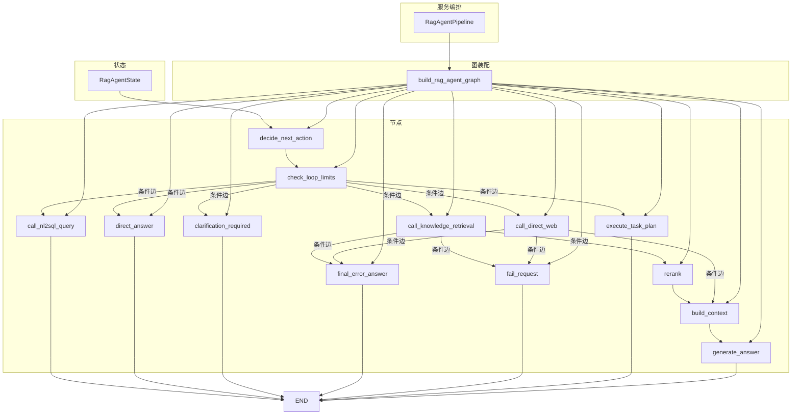
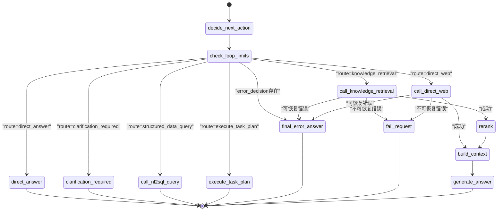
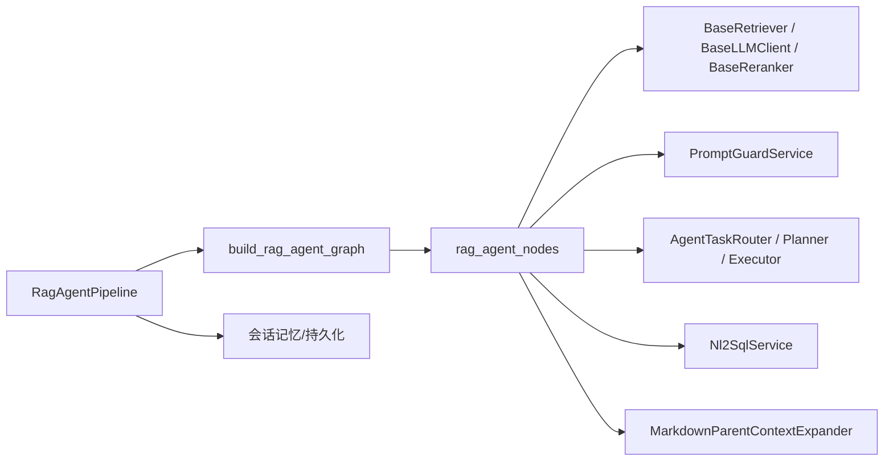

# RAG Agent 状态机

<cite>
**本文引用的文件**
- [rag_agent_builder.py](file://python-agent-study/src/fast_app/graph/rag_agent/rag_agent_builder.py)
- [rag_agent_nodes.py](file://python-agent-study/src/fast_app/graph/rag_agent/rag_agent_nodes.py)
- [rag_agent_state.py](file://python-agent-study/src/fast_app/graph/rag_agent/rag_agent_state.py)
- [rag_agent_pipeline_service.py](file://python-agent-study/src/fast_app/services/rag/rag_agent_pipeline_service.py)
</cite>

## 目录
1. [简介](#简介)
2. [项目结构](#项目结构)
3. [核心组件](#核心组件)
4. [架构总览](#架构总览)
5. [详细组件分析](#详细组件分析)
6. [依赖关系分析](#依赖关系分析)
7. [性能与可观测性](#性能与可观测性)
8. [故障排查指南](#故障排查指南)
9. [结论](#结论)
10. [附录：自定义节点、边与路由示例](#附录自定义节点边与路由示例)

## 简介
本文件系统化梳理基于 LangGraph StateGraph 构建的 RAG Agent 状态机，覆盖从请求进入、意图路由、循环限制检查、工具调用（知识库检索、结构化数据查询、直接联网）、重排序、上下文组装到最终回答生成的完整流程。文档重点解释各节点职责、条件边路由逻辑、状态转换图、错误路径处理、调试与监控方法，并给出如何扩展新节点和配置执行策略的实践指引。

## 项目结构
RAG Agent 状态机由“状态定义 + 节点实现 + 图装配 + 服务编排”四层组成：
- 状态定义：集中描述一次请求在图内流转所需的全部字段，包括输入、中间产物、控制字段与最终输出。
- 节点实现：每个业务步骤封装为独立函数，负责读取/更新 state，记录 trace，统一异常分类与降级。
- 图装配：使用 StateGraph 声明式地添加节点与边，明确顺序执行与条件分支。
- 服务编排：FastAPI 管线将 HTTP 请求转换为初始 state，运行 compiled graph 或手动推进流式路径，并持久化会话。



图表来源
- [rag_agent_builder.py:37-199](file://python-agent-study/src/fast_app/graph/rag_agent/rag_agent_builder.py#L37-L199)
- [rag_agent_nodes.py:88-1515](file://python-agent-study/src/fast_app/graph/rag_agent/rag_agent_nodes.py#L88-L1515)
- [rag_agent_state.py:16-203](file://python-agent-study/src/fast_app/graph/rag_agent/rag_agent_state.py#L16-L203)

章节来源
- [rag_agent_builder.py:37-199](file://python-agent-study/src/fast_app/graph/rag_agent/rag_agent_builder.py#L37-L199)
- [rag_agent_state.py:16-203](file://python-agent-study/src/fast_app/graph/rag_agent/rag_agent_state.py#L16-L203)

## 核心组件
- 状态模型 RagAgentState：承载用户输入、会话快照、检索参数、路由决策、工具结果、上下文、答案与控制字段（步数、工具调用次数、循环/错误决策）。
- 节点集合：意图判断、循环限制、知识检索、NL2SQL 查询、直接联网、重排序、上下文构建、生成回答、直接回答、澄清、错误回答、请求失败、任务计划执行。
- 条件路由：route_after_loop_check、route_after_tool_call、route_after_direct_web。
- 图装配器：build_rag_agent_graph，声明节点与边，注入外部依赖（LLM、检索器、重排器、PromptGuard、任务规划/执行等）。
- 服务层：RagAgentPipeline 负责初始化 state、运行 compiled graph 或手动推进流式路径、保存会话与持久化、构造 API 响应。

章节来源
- [rag_agent_state.py:16-203](file://python-agent-study/src/fast_app/graph/rag_agent/rag_agent_state.py#L16-L203)
- [rag_agent_nodes.py:88-1515](file://python-agent-study/src/fast_app/graph/rag_agent/rag_agent_nodes.py#L88-L1515)
- [rag_agent_builder.py:37-199](file://python-agent-study/src/fast_app/graph/rag_agent/rag_agent_builder.py#L37-L199)
- [rag_agent_pipeline_service.py:92-763](file://python-agent-study/src/fast_app/services/rag/rag_agent_pipeline_service.py#L92-L763)

## 架构总览
下图展示一次典型请求的执行序列：意图判断 → 循环限制检查 → 根据 route 选择工具或直接回答 → 成功路径走 rerank → build_context → generate_answer → END；失败路径进入 final_error_answer 或 fail_request。

```mermaid
sequenceDiagram
participant Client as "客户端"
participant Pipeline as "RagAgentPipeline"
participant Graph as "LangGraph StateGraph"
participant Decide as "decide_next_action"
participant Loop as "check_loop_limits"
participant Tool as "工具节点"
participant Rerank as "rerank"
participant Ctx as "build_context"
participant Gen as "generate_answer"
participant End as "END"
Client->>Pipeline : "发起请求"
Pipeline->>Graph : "ainvoke(initial_state)"
Graph->>Decide : "执行意图判断"
Decide-->>Graph : "写入 route / step_count"
Graph->>Loop : "检查循环限制"
Loop-->>Graph : "写入 loop_decision / error_decision"
alt 需要工具
Graph->>Tool : "调用工具(检索/NL2SQL/联网)"
Tool-->>Graph : "docs 或 error_decision"
opt 工具成功
Graph->>Rerank : "重排候选"
Rerank-->>Graph : "reranked_docs"
Graph->>Ctx : "构建上下文"
Ctx-->>Graph : "context"
Graph->>Gen : "生成回答"
Gen-->>Graph : "answer"
else 工具失败
alt 可恢复错误
Graph->>End : "final_error_answer"
else 不可恢复错误
Graph->>End : "fail_request"
end
end
else 直接回答/澄清/任务计划
Graph->>End : "直接结束"
end
Graph-->>Pipeline : "final_state"
Pipeline-->>Client : "RagChatResponse"
```

图表来源
- [rag_agent_builder.py:139-199](file://python-agent-study/src/fast_app/graph/rag_agent/rag_agent_builder.py#L139-L199)
- [rag_agent_nodes.py:380-413](file://python-agent-study/src/fast_app/graph/rag_agent/rag_agent_nodes.py#L380-L413)
- [rag_agent_nodes.py:416-691](file://python-agent-study/src/fast_app/graph/rag_agent/rag_agent_nodes.py#L416-L691)
- [rag_agent_nodes.py:779-842](file://python-agent-study/src/fast_app/graph/rag_agent/rag_agent_nodes.py#L779-L842)
- [rag_agent_nodes.py:892-994](file://python-agent-study/src/fast_app/graph/rag_agent/rag_agent_nodes.py#L892-L994)
- [rag_agent_nodes.py:1147-1279](file://python-agent-study/src/fast_app/graph/rag_agent/rag_agent_nodes.py#L1147-L1279)
- [rag_agent_nodes.py:1282-1340](file://python-agent-study/src/fast_app/graph/rag_agent/rag_agent_nodes.py#L1282-L1340)
- [rag_agent_nodes.py:1343-1438](file://python-agent-study/src/fast_app/graph/rag_agent/rag_agent_nodes.py#L1343-L1438)
- [rag_agent_nodes.py:1441-1515](file://python-agent-study/src/fast_app/graph/rag_agent/rag_agent_nodes.py#L1441-L1515)

## 详细组件分析

### 状态模型：RagAgentState
- 输入与上下文：original_query、query、rewritten_query、history_window_text、summary_text、filters、mode、top_k、candidate_k、min_score、allow_web_fallback、allow_direct_web、dataset_id、nl2sql_action。
- 路由与决策：route、route_reason、route_intent、route_confidence、route_source、route_model、route_latency_ms、route_rule_matched、clarification_required、clarification_code、clarification_question。
- 控制字段：step_count、tool_call_count、loop_decision、error_decision。
- 中间产物：tool_name、tool_error、docs、context、nl2sql_result。
- 输出：answer、final_reason。
- 权限与任务：current_user、agent_task_plan、agent_task_plan_id、requires_confirmation。
- 初始状态构造：build_rag_agent_initial_state 统一初始化所有字段，合并权限过滤范围。

章节来源
- [rag_agent_state.py:16-203](file://python-agent-study/src/fast_app/graph/rag_agent/rag_agent_state.py#L16-L203)

### 图装配：build_rag_agent_graph
- 节点注册：decide_next_action、check_loop_limits、call_knowledge_retrieval、call_nl2sql_query、call_direct_web、rerank、build_context、generate_answer、direct_answer、clarification_required、final_error_answer、fail_request、execute_task_plan（可选）。
- 边连接：START → decide_next_action → check_loop_limits；条件边从 check_loop_limits 按 route 分流；工具成功后进入 rerank → build_context → generate_answer；失败进入 final_error_answer 或 fail_request；直接回答/澄清/任务计划/结构化查询直接结束。
- 依赖注入：Settings、BaseRetriever、BaseLLMClient、BaseReranker、PromptGuardService、MarkdownParentContextExpander、AgentTaskRouter/Planner/Executor、Nl2SqlService、AgentTaskCapabilityService。

章节来源
- [rag_agent_builder.py:37-199](file://python-agent-study/src/fast_app/graph/rag_agent/rag_agent_builder.py#L37-L199)

### 节点：decide_next_action（意图判断）
- 职责：读取 query 与冻结后的会话上下文，调用 AgentTaskRouter 决定业务意图；必要时调用 AgentTaskPlanner 生成复杂任务计划；对 web 能力进行权限校验；简单问题通过 should_retrieve_for_query 判断是否检索。
- 输出：route、route_reason、step_count、路由元信息；若需澄清则设置 clarification_* 字段；若生成任务计划则写入 agent_task_plan 与 plan id。
- 追踪：每个子调用（router/planner/web 能力校验）均挂入 LangSmith 子 run，便于端到端定位。

章节来源
- [rag_agent_nodes.py:416-691](file://python-agent-study/src/fast_app/graph/rag_agent/rag_agent_nodes.py#L416-L691)

### 节点：check_loop_limits（循环限制检查）
- 职责：将当前 state 投影为 AgentLoopSnapshot，结合 Settings 计算 AgentLoopLimits，调用 should_continue_agent_loop 决定是否继续。
- 行为：对 direct_answer 路径放宽工具调用上限以避免误拦截；若不应继续，则写入 error_decision（loop_limit_error）与 final_reason。
- 追踪：记录 should_continue、reason、step_count、tool_call_count。

章节来源
- [rag_agent_nodes.py:779-842](file://python-agent-study/src/fast_app/graph/rag_agent/rag_agent_nodes.py#L779-L842)

### 节点：call_knowledge_retrieval（知识检索）
- 职责：调用 retrieve_knowledge_docs，传入 query、mode、top_k、candidate_k、min_score 与 filters；成功写入 docs，失败分类为 AgentErrorDecision。
- 降级：NoSearchResultError 转为 final_answer 分支；外部服务失败通常转为 fail_request。
- 追踪：记录 tool_name、result_count、top_doc_ids。

章节来源
- [rag_agent_nodes.py:892-994](file://python-agent-study/src/fast_app/graph/rag_agent/rag_agent_nodes.py#L892-L994)

### 节点：rerank（重排序）
- 职责：对检索候选文档进行重排序，提升最终上下文质量。
- 降级：ExternalServiceError 时回退为截断候选文档，并记录 error_decision；不中断 Agent。
- 追踪：记录 candidate_count、result_count、top_k、fallback、top_doc_ids。

章节来源
- [rag_agent_nodes.py:1147-1279](file://python-agent-study/src/fast_app/graph/rag_agent/rag_agent_nodes.py#L1147-L1279)

### 节点：build_context（上下文构建）
- 职责：将安全检索文档转换为 LLM 可消费的 RagContext；支持父上下文扩展与 Prompt Guard 过滤不安全内容。
- 行为：stream 模式跳过父上下文扩展以保证 token-only 协议；非 stream 模式可展开 Markdown 父段落。
- 追踪：记录 context_doc_count、context_length、上下文观察指标。

章节来源
- [rag_agent_nodes.py:1282-1340](file://python-agent-study/src/fast_app/graph/rag_agent/rag_agent_nodes.py#L1282-L1340)

### 节点：generate_answer（生成回答）
- 职责：调用 BaseLLMClient.generate 生成最终回答；可选输出 Prompt Guard 审计；异常分类后抛出，交由外层错误链路处理。
- 追踪：记录 answer_length、source_count、错误类型与分类。

章节来源
- [rag_agent_nodes.py:1343-1438](file://python-agent-study/src/fast_app/graph/rag_agent/rag_agent_nodes.py#L1343-L1438)

### 其他节点
- direct_answer：固定系统回答，不调用 LLM，避免不稳定输出。
- clarification_required：将 Router 的澄清问题作为最终回答返回。
- call_nl2sql_query：执行受控结构化数据查询，返回摘要与结果对象。
- call_direct_web：执行公开网络检索，增强搜索策略，失败分类为 AgentErrorDecision。
- execute_task_plan：执行已生成的多步骤任务计划，可能进入人工确认流程。
- final_error_answer：将可恢复/可解释错误转换为面向用户的最终回答。
- fail_request：将不可恢复错误以统一异常形式抛出，供 HTTP/SSE 层包装。

章节来源
- [rag_agent_nodes.py:845-889](file://python-agent-study/src/fast_app/graph/rag_agent/rag_agent_nodes.py#L845-L889)
- [rag_agent_nodes.py:746-776](file://python-agent-study/src/fast_app/graph/rag_agent/rag_agent_nodes.py#L746-L776)
- [rag_agent_nodes.py:694-743](file://python-agent-study/src/fast_app/graph/rag_agent/rag_agent_nodes.py#L694-L743)
- [rag_agent_nodes.py:88-222](file://python-agent-study/src/fast_app/graph/rag_agent/rag_agent_nodes.py#L88-L222)
- [rag_agent_nodes.py:997-1097](file://python-agent-study/src/fast_app/graph/rag_agent/rag_agent_nodes.py#L997-L1097)
- [rag_agent_nodes.py:1441-1515](file://python-agent-study/src/fast_app/graph/rag_agent/rag_agent_nodes.py#L1441-L1515)

### 条件边路由逻辑
- route_after_loop_check：优先处理 error_decision；否则按 state.route 选择 direct_answer、knowledge_retrieval、structured_data_query、direct_web、execute_task_plan、clarification_required；默认 fallback 为 knowledge_retrieval。
- route_after_tool_call：若存在 error_decision，action=final_answer 进入 final_error_answer，否则进入 fail_request；成功则回到 knowledge_retrieval（用于后续 rerank 路径）。
- route_after_direct_web：与工具调用类似，成功进入 build_context，失败按 action 分流。

章节来源
- [rag_agent_nodes.py:380-413](file://python-agent-study/src/fast_app/graph/rag_agent/rag_agent_nodes.py#L380-L413)
- [rag_agent_nodes.py:213-222](file://python-agent-study/src/fast_app/graph/rag_agent/rag_agent_nodes.py#L213-L222)

### 状态转换图


图表来源
- [rag_agent_builder.py:139-199](file://python-agent-study/src/fast_app/graph/rag_agent/rag_agent_builder.py#L139-L199)
- [rag_agent_nodes.py:380-413](file://python-agent-study/src/fast_app/graph/rag_agent/rag_agent_nodes.py#L380-L413)

## 依赖关系分析
- 外部依赖：
  - BaseRetriever：向量与关键词检索器。
  - BaseLLMClient：大模型客户端。
  - BaseReranker：重排序器。
  - PromptGuardService：提示词与输出安全守卫。
  - MarkdownParentContextExpander：Markdown 父上下文扩展。
  - AgentTaskRouter/Planner/Executor：意图路由、任务规划与执行。
  - Nl2SqlService：结构化数据查询。
  - AgentTaskCapabilityService：能力校验（如直连 Web）。
- 内部依赖：
  - rag_agent_state：状态模型与初始状态构造。
  - rag_agent_nodes：节点实现与条件路由。
  - rag_agent_builder：图装配与边连接。
  - rag_agent_pipeline_service：服务编排、会话记忆与持久化、LangSmith 顶层 trace。



图表来源
- [rag_agent_pipeline_service.py:92-197](file://python-agent-study/src/fast_app/services/rag/rag_agent_pipeline_service.py#L92-L197)
- [rag_agent_builder.py:37-199](file://python-agent-study/src/fast_app/graph/rag_agent/rag_agent_builder.py#L37-L199)
- [rag_agent_nodes.py:88-1515](file://python-agent-study/src/fast_app/graph/rag_agent/rag_agent_nodes.py#L88-L1515)

章节来源
- [rag_agent_pipeline_service.py:92-197](file://python-agent-study/src/fast_app/services/rag/rag_agent_pipeline_service.py#L92-L197)
- [rag_agent_builder.py:37-199](file://python-agent-study/src/fast_app/graph/rag_agent/rag_agent_builder.py#L37-L199)
- [rag_agent_nodes.py:88-1515](file://python-agent-study/src/fast_app/graph/rag_agent/rag_agent_nodes.py#L88-L1515)

## 性能与可观测性
- 慢操作日志：rerank、pipeline、generate_answer 等关键路径记录耗时并触发慢操作告警。
- LangSmith 追踪：每个节点使用 rag_agent_langsmith_step_trace 包裹，记录 inputs/outputs、step_index、child_name、run_name；顶层 pipeline 使用 rag_langsmith_pipeline_trace。
- 检索快照：record_snapshot_retrieval_stage 记录 rerank 阶段候选与结果，便于评测与回溯。
- 流式兼容：stream/stream_events 入口复用同一套节点，但保持 token-only 协议，必要时跳过父上下文扩展。

章节来源
- [rag_agent_nodes.py:224-353](file://python-agent-study/src/fast_app/graph/rag_agent/rag_agent_nodes.py#L224-L353)
- [rag_agent_nodes.py:1177-1279](file://python-agent-study/src/fast_app/graph/rag_agent/rag_agent_nodes.py#L1177-L1279)
- [rag_agent_pipeline_service.py:212-220](file://python-agent-study/src/fast_app/services/rag/rag_agent_pipeline_service.py#L212-L220)

## 故障排查指南
- 工具失败分类：retrieve_knowledge_docs、call_direct_web、generate_answer 等节点捕获异常并分类为 AgentErrorDecision，区分可恢复与不可恢复错误。
- 循环上限：check_loop_limits 达到限制时写入 error_decision 与 final_reason，进入 final_error_answer。
- 重排序降级：rerank 外部服务异常时回退为截断候选，并记录 fallback 与错误分类。
- 请求失败：fail_request 节点抛出统一异常，HTTP/SSE 层复用全局错误响应。
- 调试建议：
  - 查看 LangSmith trace 中各节点的 inputs/outputs、step_index、error_kind、error_action。
  - 关注日志事件：rag_agent.decide_next_action.finish、rag_agent.check_loop_limits.finish、rag_agent.call_knowledge_retrieval.finish/failed、rag_agent.rerank.finish/fallback、rag_agent.build_context.finish、rag_agent.generate_answer.finish/failed。
  - 检查 state 中的 route、route_reason、loop_decision、error_decision、final_reason 以定位分支与终止原因。

章节来源
- [rag_agent_nodes.py:928-994](file://python-agent-study/src/fast_app/graph/rag_agent/rag_agent_nodes.py#L928-L994)
- [rag_agent_nodes.py:1177-1279](file://python-agent-study/src/fast_app/graph/rag_agent/rag_agent_nodes.py#L1177-L1279)
- [rag_agent_nodes.py:1394-1438](file://python-agent-study/src/fast_app/graph/rag_agent/rag_agent_nodes.py#L1394-L1438)
- [rag_agent_nodes.py:1481-1515](file://python-agent-study/src/fast_app/graph/rag_agent/rag_agent_nodes.py#L1481-L1515)

## 结论
该 RAG Agent 状态机通过清晰的 StateGraph 建模，将意图判断、循环控制、工具调用、重排序、上下文构建与回答生成解耦为独立节点，并以条件边实现灵活路由。统一的错误分类与降级策略确保系统在异常情况下仍能提供可解释的最终回答或稳定失败响应。配合 LangSmith 追踪与慢操作日志，可实现端到端的可观测性与问题定位。

## 附录：自定义节点、边与路由示例
- 新增节点：
  - 在 rag_agent_nodes.py 中实现 create_xxx_node(settings, ...) -> Callable[[RagAgentState], dict[str, object]]，并在函数体内使用 rag_agent_langsmith_step_trace 包裹，记录 inputs/outputs。
  - 在 rag_agent_builder.py 的 build_rag_agent_graph 中 builder.add_node("xxx", create_xxx_node(...))。
- 连接边：
  - 顺序边：builder.add_edge("prev_node", "xxx")。
  - 条件边：builder.add_conditional_edges("node", route_xxx, {"branch_a": "target_a", "branch_b": "target_b"})。
- 条件路由：
  - 在 rag_agent_nodes.py 中实现 route_xxx(state) -> RagAgentRoute，依据 state.route、error_decision 等字段返回目标节点名。
- 配置执行策略：
  - 通过 Settings 配置循环上限、重排序 top_k、慢操作阈值等；check_loop_limits 与 rerank 节点会读取这些配置。
- 错误路径：
  - 节点内部捕获异常并分类为 AgentErrorDecision，写入 error_decision 与 final_reason；条件边据此分流至 final_error_answer 或 fail_request。

章节来源
- [rag_agent_builder.py:56-199](file://python-agent-study/src/fast_app/graph/rag_agent/rag_agent_builder.py#L56-L199)
- [rag_agent_nodes.py:380-413](file://python-agent-study/src/fast_app/graph/rag_agent/rag_agent_nodes.py#L380-L413)
- [rag_agent_nodes.py:88-1515](file://python-agent-study/src/fast_app/graph/rag_agent/rag_agent_nodes.py#L88-L1515)