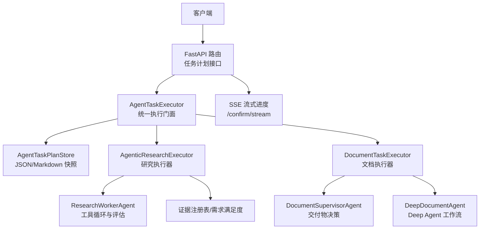
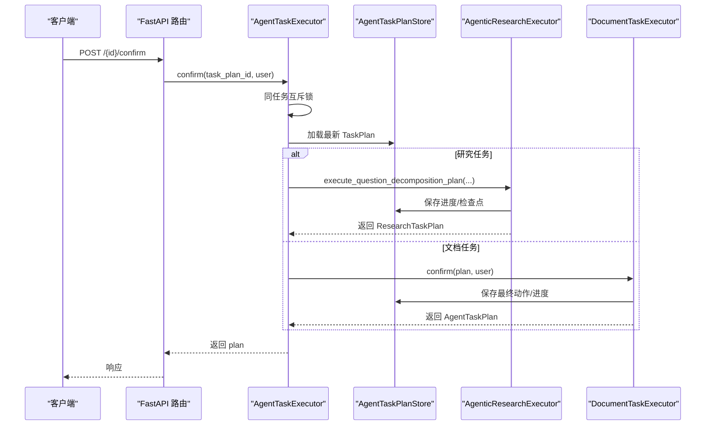
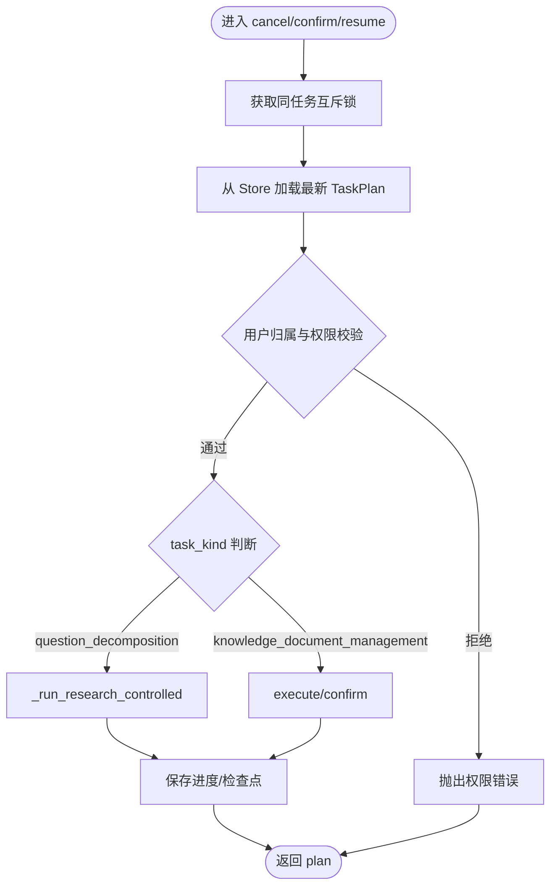
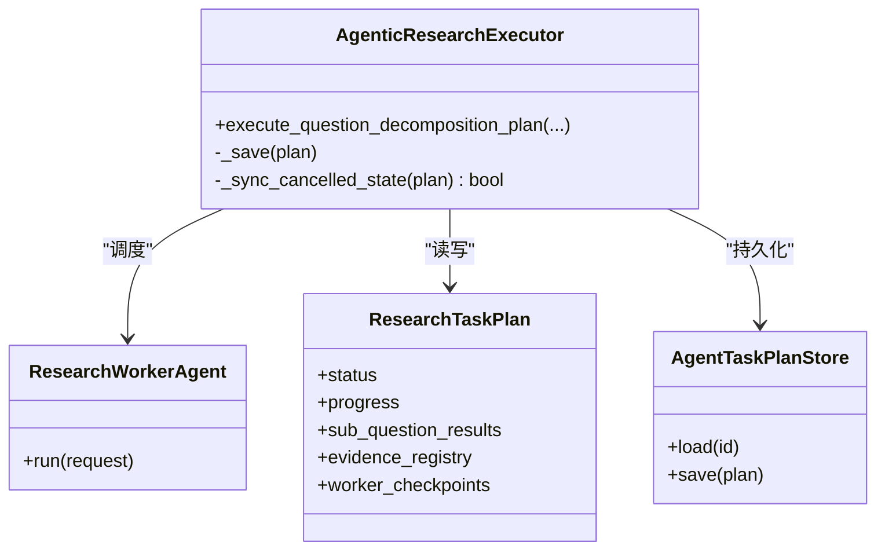
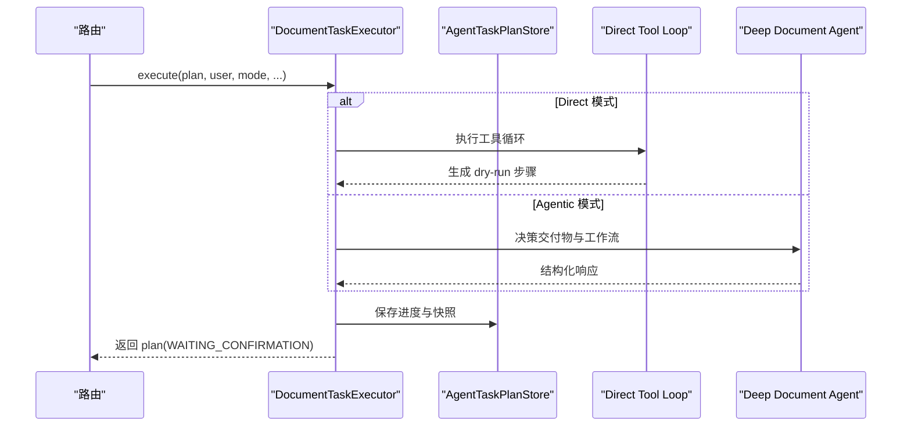
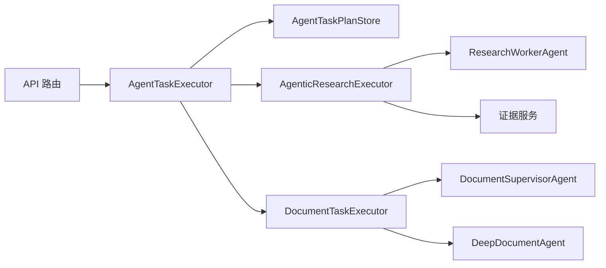

# 任务执行器

<cite>
**本文引用的文件**   
- [agent_task_executor.py](file://src/fast_app/services/agent_tasks/agent_task_executor.py)
- [agent_task_plan_store.py](file://src/fast_app/services/agent_tasks/agent_task_plan_store.py)
- [agent_task_plan_routes.py](file://src/fast_app/api/agent_task_plan_routes.py)
- [agentic_research_executor.py](file://src/fast_app/services/research/agentic_research_executor.py)
- [document_task_executor.py](file://src/fast_app/services/agent_tasks/document_task_executor.py)
- [research_task_plan.py](file://src/fast_app/domain/research_task_plan.py)
- [agent_task_plan.py](file://src/fast_app/domain/agent_task_plan.py)
- [latency.py](file://src/fast_app/core/latency.py)
</cite>

## 目录
1. [简介](#简介)
2. [项目结构](#项目结构)
3. [核心组件](#核心组件)
4. [架构总览](#架构总览)
5. [详细组件分析](#详细组件分析)
6. [依赖关系分析](#依赖关系分析)
7. [性能与并发特性](#性能与并发特性)
8. [故障恢复与错误处理](#故障恢复与错误处理)
9. [监控、统计与可观测性](#监控统计与可观测性)
10. [使用示例：提交、监控、取消与结果获取](#使用示例提交监控取消与结果获取)
11. [结论](#结论)

## 简介
本文件面向“任务执行器”的完整实现，聚焦以下目标：
- 任务的调度机制：按依赖波次与 DAG 推进，支持并行 Worker 与屏障等待。
- 并发控制：进程内互斥锁、取消信号传播、多实例部署下的租约与 CAS 规划。
- 状态跟踪：TaskPlan 快照持久化、Worker 进度事件、SSE 实时推送。
- 错误处理：超时、重试、失败与跳过语义、最终综合策略。
- 生命周期管理：创建、确认、运行、暂停/恢复、取消、完成或带警告完成。
- 执行超时：Worker 级超时保护与检查点保留。
- 重试策略：可恢复子问题与文档 Tool Loop 的恢复入口。
- 结果缓存：证据注册表与子问题结果复用。
- 监控接口：SSE 流式进度、调试追踪、延迟统计。
- 异步处理与 Worker 管理：协程并发、波次调度、安全边界停止。
- 进度追踪与异常恢复：检查点、快照、事件去重与幂等更新。

## 项目结构
任务执行器位于 FastAPI 服务中，采用分层组织：
- API 路由层：提供任务查询、确认、取消、重试、SSE 流式进度等 HTTP 接口。
- 执行器门面：统一入口，负责鉴权、并发控制、分派到 Research 或文档执行器。
- 领域模型：TaskPlan、ResearchTaskPlan、步骤、证据、进度等结构化数据。
- 存储层：原子写入 JSON/Markdown 快照，供读取、审查与 SSE 轮询。
- 研究执行器：DAG 波次调度、Worker 超时、证据聚合与最终答案生成。
- 文档执行器：Tool Loop、Dry-run 建议、确认执行、Deep Agent 工作流。
- 可观测性：LangSmith 追踪、延迟统计、SSE 事件。

**图表来源**
- [agent_task_plan_routes.py:111-283](file://src/fast_app/api/agent_task_plan_routes.py#L111-L283)
- [agent_task_executor.py:135-202](file://src/fast_app/services/agent_tasks/agent_task_executor.py#L135-L202)
- [agentic_research_executor.py:57-99](file://src/fast_app/services/research/agentic_research_executor.py#L57-L99)
- [document_task_executor.py:105-137](file://src/fast_app/services/agent_tasks/document_task_executor.py#L105-L137)
- [agent_task_plan_store.py:23-86](file://src/fast_app/services/agent_tasks/agent_task_plan_store.py#L23-L86)

**章节来源**
- [agent_task_plan_routes.py:111-283](file://src/fast_app/api/agent_task_plan_routes.py#L111-L283)
- [agent_task_executor.py:135-202](file://src/fast_app/services/agent_tasks/agent_task_executor.py#L135-L202)
- [agent_task_plan_store.py:23-86](file://src/fast_app/services/agent_tasks/agent_task_plan_store.py#L23-L86)

## 核心组件
- AgentTaskExecutor：统一入口，负责同任务互斥、归属校验、权限重建、取消信号写入、分派到专用执行器。
- AgenticResearchExecutor：按依赖波次调度 Worker，维护证据注册表，合并子问题结果，计算最终综合输出。
- DocumentTaskExecutor：文档任务 Tool Loop、Dry-run、确认执行、Deep Agent 工作流与补偿状态。
- AgentTaskPlanStore：原子写入 JSON/Markdown 快照，提供 load/save/markdown 能力。
- 领域模型：AgentTaskPlan、ResearchTaskPlan、步骤、证据、进度、Worker 阶段等。
- 监控与统计：SSE 流式事件、LangSmith 追踪、延迟统计工具。

**章节来源**
- [agent_task_executor.py:135-202](file://src/fast_app/services/agent_tasks/agent_task_executor.py#L135-L202)
- [agentic_research_executor.py:57-99](file://src/fast_app/services/research/agentic_research_executor.py#L57-L99)
- [document_task_executor.py:105-137](file://src/fast_app/services/agent_tasks/document_task_executor.py#L105-L137)
- [agent_task_plan_store.py:23-86](file://src/fast_app/services/agent_tasks/agent_task_plan_store.py#L23-L86)
- [research_task_plan.py:787-800](file://src/fast_app/domain/research_task_plan.py#L787-L800)
- [agent_task_plan.py:26-47](file://src/fast_app/domain/agent_task_plan.py#L26-L47)

## 架构总览
任务执行器采用“门面 + 专用执行器 + 存储 + 模型”的分层架构：
- API 路由暴露 REST/SSE 接口，封装追踪与请求上下文。
- 门面层保证同一 TaskPlan 的互斥执行与权限重建。
- 专用执行器分别处理研究与文档两类任务，内部包含 Worker、工具循环、评估与最终综合。
- 存储层以原子方式保存快照，确保 SSE 轮询与审查视图一致性。
- 模型层定义状态机、证据、进度、Worker 阶段等，约束合法转换与字段。

**图表来源**
- [agent_task_plan_routes.py:201-255](file://src/fast_app/api/agent_task_plan_routes.py#L201-L255)
- [agent_task_executor.py:444-496](file://src/fast_app/services/agent_tasks/agent_task_executor.py#L444-L496)
- [agentic_research_executor.py:86-118](file://src/fast_app/services/research/agentic_research_executor.py#L86-L118)
- [document_task_executor.py:148-175](file://src/fast_app/services/agent_tasks/document_task_executor.py#L148-L175)
- [agent_task_plan_store.py:29-86](file://src/fast_app/services/agent_tasks/agent_task_plan_store.py#L29-L86)

## 详细组件分析

### 任务执行门面：AgentTaskExecutor
职责与关键点：
- 同任务互斥：通过进程内 _TaskPlanLockRegistry 防止同一 task_plan_id 被重复 confirm/retry/execute。
- 权限重建：在 resume/confirm 时重新加载 TaskPlan，基于当前用户上下文重建 ACL filters。
- 取消信号：cancel 不进入长任务锁，立即写入状态并清理未终态步骤；运行中的节点在安全边界检测取消。
- 分派逻辑：根据 task_kind 分派到 Research 或文档执行器；兼容旧 direct Tool Loop 与新 agentic 路径。
- 活动标记：_ACTIVE_RESEARCH_TASK_PLAN_IDS 防止进程内重复确认研究任务。

**图表来源**
- [agent_task_executor.py:81-133](file://src/fast_app/services/agent_tasks/agent_task_executor.py#L81-L133)
- [agent_task_executor.py:212-278](file://src/fast_app/services/agent_tasks/agent_task_executor.py#L212-L278)
- [agent_task_executor.py:341-442](file://src/fast_app/services/agent_tasks/agent_task_executor.py#L341-L442)
- [agent_task_executor.py:444-496](file://src/fast_app/services/agent_tasks/agent_task_executor.py#L444-L496)
- [agent_task_executor.py:516-555](file://src/fast_app/services/agent_tasks/agent_task_executor.py#L516-L555)

**章节来源**
- [agent_task_executor.py:81-133](file://src/fast_app/services/agent_tasks/agent_task_executor.py#L81-L133)
- [agent_task_executor.py:212-278](file://src/fast_app/services/agent_tasks/agent_task_executor.py#L212-L278)
- [agent_task_executor.py:341-442](file://src/fast_app/services/agent_tasks/agent_task_executor.py#L341-L442)
- [agent_task_executor.py:444-496](file://src/fast_app/services/agent_tasks/agent_task_executor.py#L444-L496)
- [agent_task_executor.py:516-555](file://src/fast_app/services/agent_tasks/agent_task_executor.py#L516-L555)

### 研究执行器：AgenticResearchExecutor
职责与关键点：
- 波次调度：按依赖关系组织子问题为 wave，依次启动 Worker，等待屏障后合并结果。
- 证据注册：子问题结果中的证据需通过 Registry 校验，避免非法引用。
- 进度事件：每个 Worker 的阶段变化通过 append_progress_event 原子保存到 plan.progress.events。
- 检查点：worker_checkpoints 记录最近成功持久化的内部现场，用于超时后的降级结果。
- 超时处理：Worker 调用设置超时，超时后标记 worker_timed_out 并返回有限结果。
- 最终综合：completed/partial 组合决定 TaskPlan 终态（completed/completed_with_warnings/failed）。

**图表来源**
- [agentic_research_executor.py:57-99](file://src/fast_app/services/research/agentic_research_executor.py#L57-L99)
- [agentic_research_executor.py:123-200](file://src/fast_app/services/research/agentic_research_executor.py#L123-L200)
- [research_task_plan.py:631-770](file://src/fast_app/domain/research_task_plan.py#L631-L770)
- [agent_task_plan_store.py:29-86](file://src/fast_app/services/agent_tasks/agent_task_plan_store.py#L29-L86)

**章节来源**
- [agentic_research_executor.py:57-99](file://src/fast_app/services/research/agentic_research_executor.py#L57-L99)
- [agentic_research_executor.py:123-200](file://src/fast_app/services/research/agentic_research_executor.py#L123-L200)
- [research_task_plan.py:631-770](file://src/fast_app/domain/research_task_plan.py#L631-L770)

### 文档执行器：DocumentTaskExecutor
职责与关键点：
- 模式选择：根据 saved_workflow.execution_mode 选择 direct Tool Loop 或 Deep Agent 工作流。
- Dry-run：先生成变更建议，进入 WAITING_CONFIRMATION，真实写入仅在 confirm 分支。
- 确认执行：验证冻结的 dry-run、候选 doc_id、路径、base_sha256 与当前工具权限。
- 事件与进度：document_progress.events 暴露稳定协议事件给前端。
- 异常恢复：Deep Agent 异常将 checkpoint 标记为可恢复，供 /retry 继续。

**图表来源**
- [document_task_executor.py:148-200](file://src/fast_app/services/agent_tasks/document_task_executor.py#L148-L200)
- [document_task_executor.py:346-373](file://src/fast_app/services/agent_tasks/document_task_executor.py#L346-L373)
- [agent_task_plan_store.py:29-86](file://src/fast_app/services/agent_tasks/agent_task_plan_store.py#L29-L86)

**章节来源**
- [document_task_executor.py:148-200](file://src/fast_app/services/agent_tasks/document_task_executor.py#L148-L200)
- [document_task_executor.py:346-373](file://src/fast_app/services/agent_tasks/document_task_executor.py#L346-L373)

### 存储层：AgentTaskPlanStore
职责与关键点：
- 原子写入：临时文件 + os.replace 保证读端不会读到半份快照。
- Markdown 渲染：人类可读审查视图，失败不影响 JSON 事实源。
- 版本兼容：Research v2 schema_version 校验，旧格式拒绝。
- 路径策略：同一 plan 覆盖已有文件，避免多份快照。

**章节来源**
- [agent_task_plan_store.py:29-86](file://src/fast_app/services/agent_tasks/agent_task_plan_store.py#L29-L86)
- [agent_task_plan_store.py:97-105](file://src/fast_app/services/agent_tasks/agent_task_plan_store.py#L97-L105)
- [agent_task_plan_store.py:108-364](file://src/fast_app/services/agent_tasks/agent_task_plan_store.py#L108-L364)

### 领域模型：状态机与进度
- 任务状态：created、running、waiting_confirmation、completed、completed_with_warnings、failed、cancelled。
- 步骤状态：pending、running、completed、waiting_confirmation、failed、skipped。
- 研究进度：workers 字典、events 列表、current_wave、stage、attempt、active_operations。
- 证据注册：Typed EvidenceRef，类型约束严格，禁止非法字段组合。

**章节来源**
- [agent_task_plan.py:26-47](file://src/fast_app/domain/agent_task_plan.py#L26-L47)
- [research_task_plan.py:631-770](file://src/fast_app/domain/research_task_plan.py#L631-L770)
- [research_task_plan.py:299-370](file://src/fast_app/domain/research_task_plan.py#L299-L370)

## 依赖关系分析
- API 路由依赖执行门面与存储，注入 Settings、PromptGuard、UserContext。
- 执行门面依赖专用执行器、能力服务、权限服务、审计服务、存储。
- 研究执行器依赖 Worker、证据服务、PromptGuard、存储。
- 文档执行器依赖 Supervisor、Deep Agent、变更计划服务、存储。
- 存储依赖配置与日志，渲染 Markdown 作为辅助视图。

**图表来源**
- [agent_task_plan_routes.py:111-283](file://src/fast_app/api/agent_task_plan_routes.py#L111-L283)
- [agent_task_executor.py:135-202](file://src/fast_app/services/agent_tasks/agent_task_executor.py#L135-L202)
- [agentic_research_executor.py:57-99](file://src/fast_app/services/research/agentic_research_executor.py#L57-L99)
- [document_task_executor.py:105-137](file://src/fast_app/services/agent_tasks/document_task_executor.py#L105-L137)

**章节来源**
- [agent_task_plan_routes.py:111-283](file://src/fast_app/api/agent_task_plan_routes.py#L111-L283)
- [agent_task_executor.py:135-202](file://src/fast_app/services/agent_tasks/agent_task_executor.py#L135-L202)
- [agentic_research_executor.py:57-99](file://src/fast_app/services/research/agentic_research_executor.py#L57-L99)
- [document_task_executor.py:105-137](file://src/fast_app/services/agent_tasks/document_task_executor.py#L105-L137)

## 性能与并发特性
- 进程内互斥：_TaskPlanLockRegistry 保证同一 task_plan_id 的 fail-fast 互斥，避免重复执行。
- 取消信号非阻塞：cancel 不等待长任务锁，立即写入状态，运行节点在安全边界检测。
- 波次并行：研究任务按依赖波次并行 Worker，屏障等待后合并结果。
- 原子快照：存储层使用临时文件 + os.replace，避免轮询者读到半份快照。
- SSE 轮询：每秒读取快照并去重事件，降低后端压力。
- 多实例限制：当前实现适合单进程；多 Uvicorn Worker 或多容器实例需数据库租约与 CAS。

**章节来源**
- [agent_task_executor.py:81-133](file://src/fast_app/services/agent_tasks/agent_task_executor.py#L81-L133)
- [agent_task_executor.py:212-278](file://src/fast_app/services/agent_tasks/agent_task_executor.py#L212-L278)
- [agent_task_plan_store.py:46-68](file://src/fast_app/services/agent_tasks/agent_task_plan_store.py#L46-L68)
- [agent_task_plan_routes.py:286-355](file://src/fast_app/api/agent_task_plan_routes.py#L286-L355)

## 故障恢复与错误处理
- 超时处理：Worker 调用设置超时，超时后标记 worker_timed_out，返回有限结果并保留检查点。
- 重试策略：resume 接口按最近完整快照恢复，支持研究任务与文档 Tool Loop。
- 失败与跳过：子问题失败标记 failed，下游依赖可能 skipped；最终综合区分 completed/completed_with_warnings/failed。
- 权限错误：ToolPermissionDeniedError 在归属校验、权限重建时抛出。
- 存储错误：Schema 不支持或快照不存在时抛出 AppServiceError。
- 取消恢复：Deep Agent 异常捕获 CancelledError，根据状态释放或标记 checkpoint 可恢复。

**章节来源**
- [agentic_research_executor.py:386-413](file://src/fast_app/services/research/agentic_research_executor.py#L386-L413)
- [agentic_research_executor.py:704-723](file://src/fast_app/services/research/agentic_research_executor.py#L704-L723)
- [agent_task_executor.py:341-442](file://src/fast_app/services/agent_tasks/agent_task_executor.py#L341-L442)
- [document_task_executor.py:1271-1294](file://src/fast_app/services/agent_tasks/document_task_executor.py#L1271-L1294)
- [agent_task_plan_store.py:69-86](file://src/fast_app/services/agent_tasks/agent_task_plan_store.py#L69-L86)

## 监控、统计与可观测性
- SSE 流式进度：/confirm/stream 每秒读取快照，发送状态、子问题完成、研究事件、文档事件。
- LangSmith 追踪：路由层创建 root trace，执行器注入 child config，记录元数据与标签。
- 延迟统计：start_timer/elapsed_ms/is_slow_latency/log_slow_operation 用于慢操作告警。
- 调试接口：debug_trace_routes 记录请求 ID、Trace ID、错误类型与延迟。

**章节来源**
- [agent_task_plan_routes.py:258-433](file://src/fast_app/api/agent_task_plan_routes.py#L258-L433)
- [agent_task_plan_routes.py:74-108](file://src/fast_app/api/agent_task_plan_routes.py#L74-L108)
- [latency.py:7-37](file://src/fast_app/core/latency.py#L7-L37)

## 使用示例：提交、监控、取消与结果获取
以下为典型流程的代码片段路径，展示任务提交、监控、取消与结果获取过程：

- 提交任务（确认执行）
  - 路由：POST /{task_plan_id}/confirm
  - 执行器：AgentTaskExecutor.confirm
  - 存储：AgentTaskPlanStore.save
  - 参考路径：[agent_task_plan_routes.py:201-255](file://src/fast_app/api/agent_task_plan_routes.py#L201-L255)、[agent_task_executor.py:444-496](file://src/fast_app/services/agent_tasks/agent_task_executor.py#L444-L496)、[agent_task_plan_store.py:29-86](file://src/fast_app/services/agent_tasks/agent_task_plan_store.py#L29-L86)

- 监控任务（SSE 流式进度）
  - 路由：POST /{task_plan_id}/confirm/stream
  - 生成器：_confirm_task_plan_sse_generator
  - 参考路径：[agent_task_plan_routes.py:258-433](file://src/fast_app/api/agent_task_plan_routes.py#L258-L433)

- 取消任务
  - 路由：POST /{task_plan_id}/cancel
  - 执行器：AgentTaskExecutor.cancel
  - 参考路径：[agent_task_plan_routes.py:143-169](file://src/fast_app/api/agent_task_plan_routes.py#L143-L169)、[agent_task_executor.py:212-278](file://src/fast_app/services/agent_tasks/agent_task_executor.py#L212-L278)

- 恢复任务（重试）
  - 路由：POST /{task_plan_id}/retry
  - 执行器：AgentTaskExecutor.resume
  - 参考路径：[agent_task_plan_routes.py:172-198](file://src/fast_app/api/agent_task_plan_routes.py#L172-L198)、[agent_task_executor.py:341-442](file://src/fast_app/services/agent_tasks/agent_task_executor.py#L341-L442)

- 获取任务结果
  - 路由：GET /{task_plan_id}
  - 存储：AgentTaskPlanStore.load
  - 参考路径：[agent_task_plan_routes.py:111-124](file://src/fast_app/api/agent_task_plan_routes.py#L111-L124)、[agent_task_plan_store.py:69-86](file://src/fast_app/services/agent_tasks/agent_task_plan_store.py#L69-L86)

## 结论
该任务执行器实现了完整的任务生命周期管理，涵盖调度、并发控制、状态跟踪、错误处理、超时与重试、结果缓存、监控与可观测性。其设计强调：
- 明确的状态机与权限重建，确保执行安全。
- 进程内互斥与取消信号传播，避免重复执行与死锁。
- 原子快照与 SSE 轮询，提供一致性与实时性。
- 波次调度与证据注册，保障研究任务的正确性与可恢复性。
- 文档任务的 Dry-run 与确认执行，分离建议与真实写入。

生产部署建议：
- 当前实现适合单进程或小团队测试；多实例场景需引入数据库租约与 CAS。
- 强化多进程并发测试，模拟 retry/confirm/cancel 竞争。
- 持续优化 SSE 去重与快照读取性能，避免频繁 I/O。
- 完善错误码与审计字段，区分自动重试与人工重试。