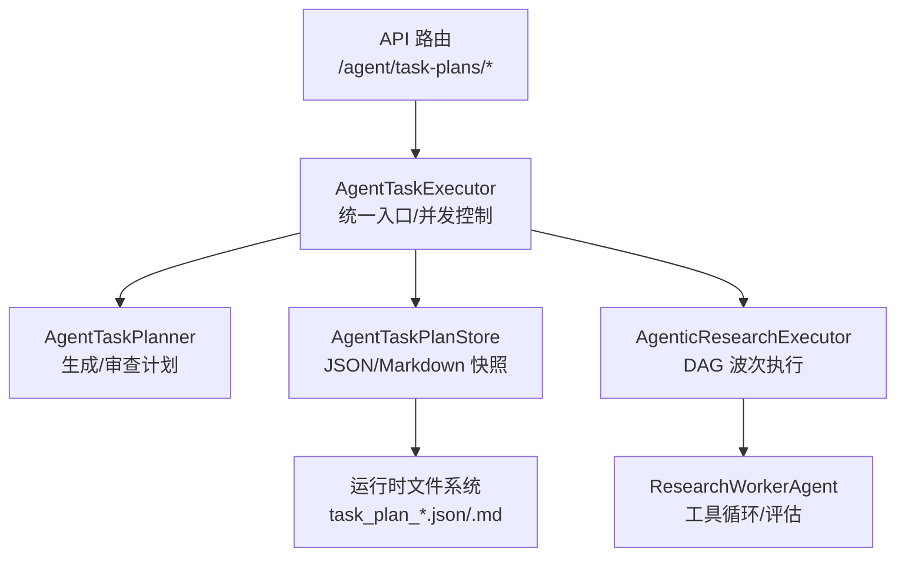
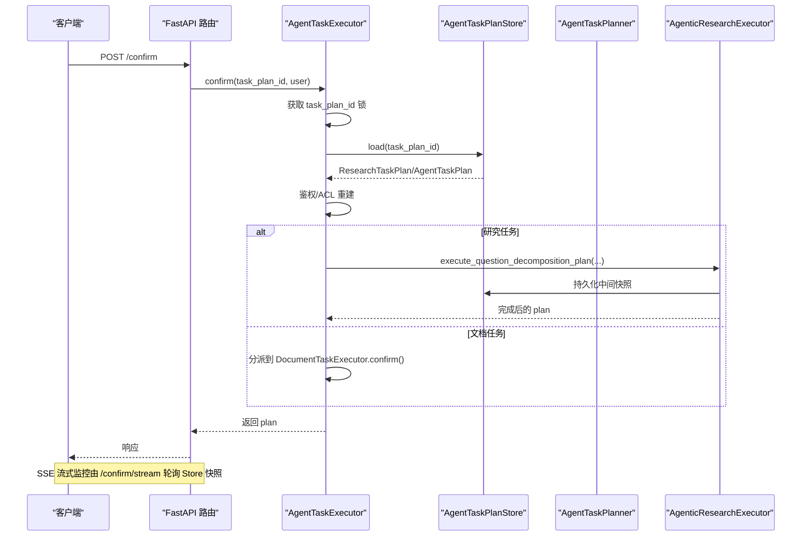
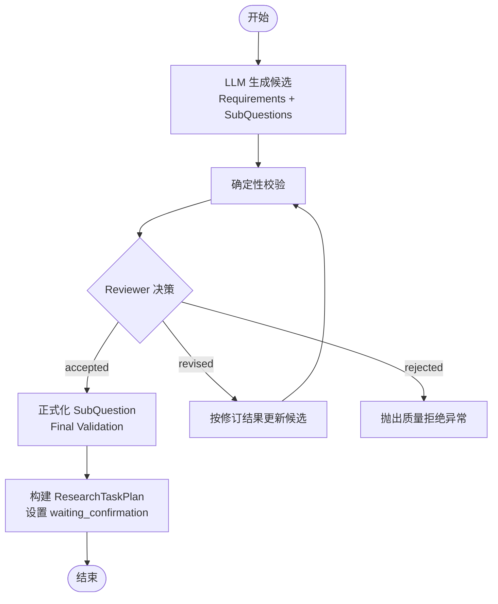
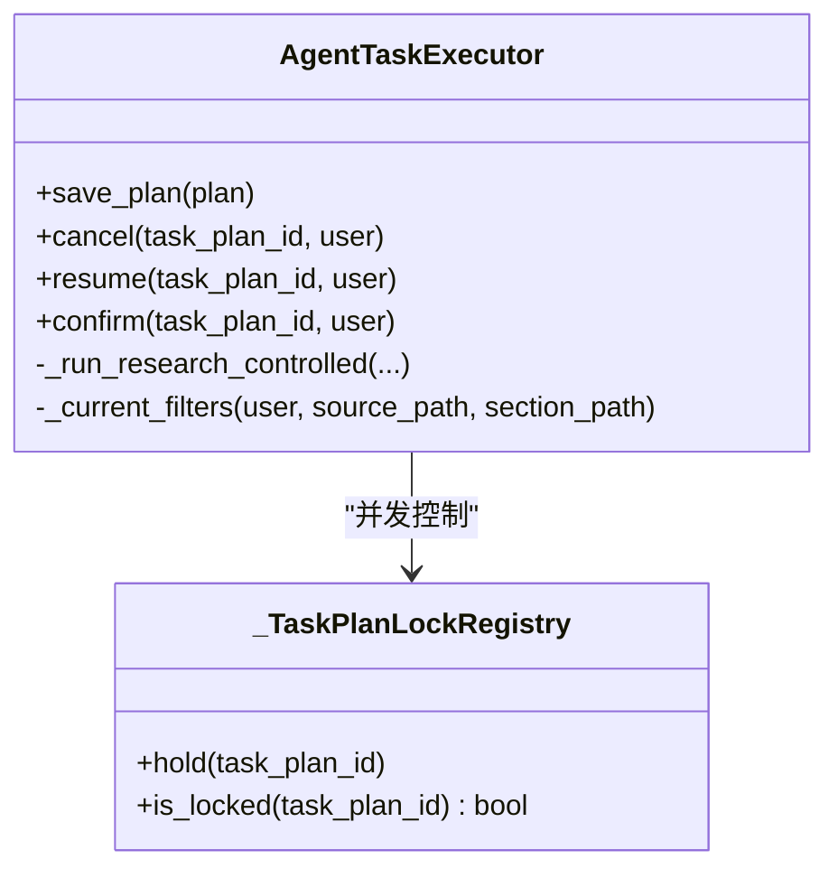
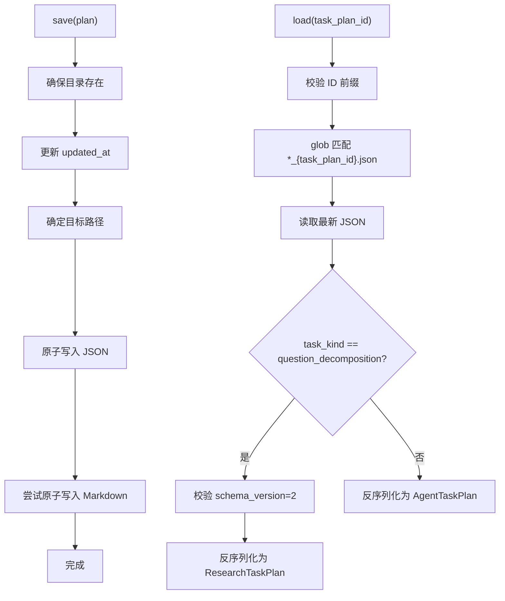
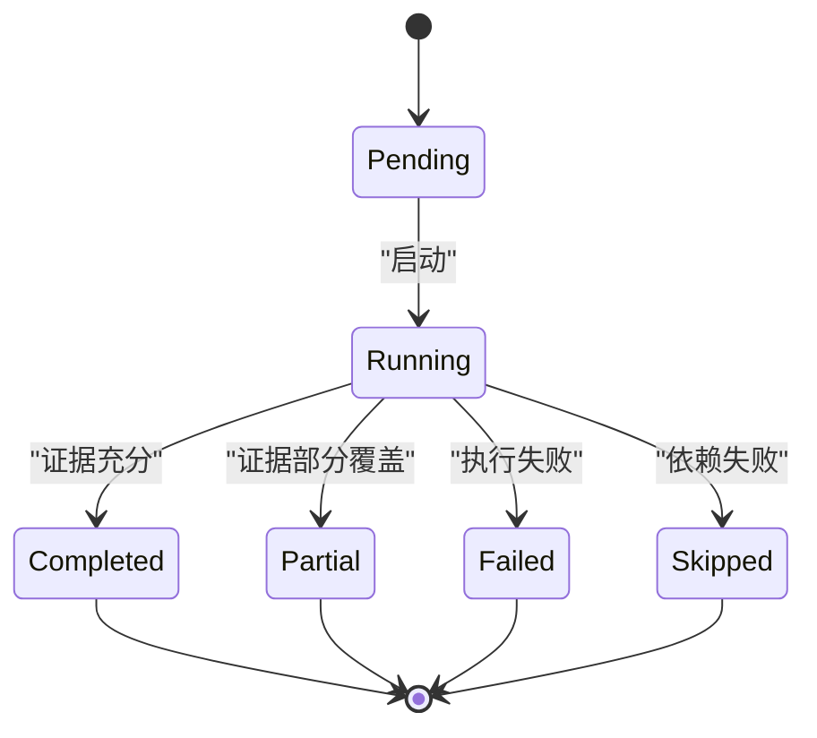
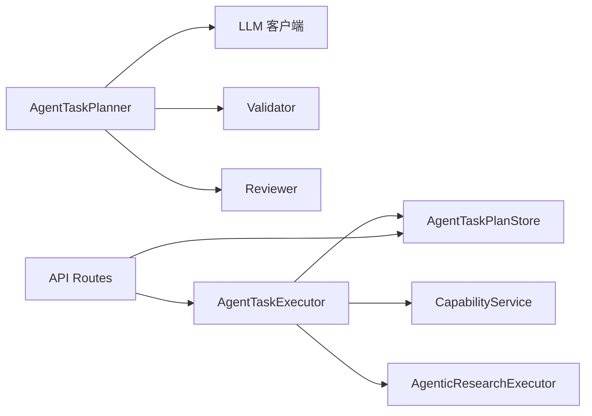

# 任务规划与执行

<cite>
**本文引用的文件列表**
- [agent_task_planner.py](file://python-agent-study/src/fast_app/services/agent_tasks/agent_task_planner.py)
- [agent_task_executor.py](file://python-agent-study/src/fast_app/services/agent_tasks/agent_task_executor.py)
- [agent_task_plan_store.py](file://python-agent-study/src/fast_app/services/agent_tasks/agent_task_plan_store.py)
- [agent_task_plan.py](file://python-agent-study/src/fast_app/domain/agent_task_plan.py)
- [research_task_plan.py](file://python-agent-study/src/fast_app/domain/research_task_plan.py)
- [agent_task_plan_routes.py](file://python-agent-study/src/fast_app/api/agent_task_plan_routes.py)
- [agentic_research_executor.py](file://python-agent-study/src/fast_app/services/research/agentic_research_executor.py)
</cite>

## 目录
1. [简介](#简介)
2. [项目结构](#项目结构)
3. [核心组件](#核心组件)
4. [架构总览](#架构总览)
5. [详细组件分析](#详细组件分析)
6. [依赖关系分析](#依赖关系分析)
7. [性能与并行度](#性能与并行度)
8. [配置选项与监控接口](#配置选项与监控接口)
9. [故障排查指南](#故障排查指南)
10. [结论](#结论)
11. [附录：端到端示例流程](#附录端到端示例流程)

## 简介
本系统围绕“复杂问题拆解为可执行子任务”的 AgentTaskPlanner、统一调度与并发控制的 AgentTaskExecutor，以及基于 JSON/Markdown 原子快照的任务计划存储 AgentTaskPlanStore 构建。其目标是：
- 将用户复杂问题分解为原子需求（Requirement）和可执行的子问题（SubQuestion），并显式建模依赖关系。
- 在确认执行阶段按依赖波次调度 Worker，支持同子问题内工具调用的并行执行。
- 通过进程内互斥锁、取消信号、重试恢复机制保障多请求/多实例下的稳定性。
- 提供 SSE 流式监控接口，便于前端实时展示任务进度、证据状态与最终答案。

## 项目结构
与任务规划与执行直接相关的代码主要分布在以下模块：
- 领域模型：定义任务计划、子问题、证据、策略等数据结构。
- 规划器：生成候选计划，并通过校验与评审确保质量。
- 执行器：统一入口，负责鉴权、并发控制、分派到 Research 或文档执行链路。
- 存储：以 JSON 为主事实源，附带 Markdown 可读视图，采用原子写入避免脏读。
- API：暴露查询、确认、取消、重试、SSE 流式进度等接口。

**图表来源**
- [agent_task_plan_routes.py:111-255](file://python-agent-study/src/fast_app/api/agent_task_plan_routes.py#L111-L255)
- [agent_task_executor.py:135-201](file://python-agent-study/src/fast_app/services/agent_tasks/agent_task_executor.py#L135-L201)
- [agent_task_planner.py:88-269](file://python-agent-study/src/fast_app/services/agent_tasks/agent_task_planner.py#L88-L269)
- [agent_task_plan_store.py:23-104](file://python-agent-study/src/fast_app/services/agent_tasks/agent_task_plan_store.py#L23-L104)
- [agentic_research_executor.py:57-121](file://python-agent-study/src/fast_app/services/research/agentic_research_executor.py#L57-L121)

**章节来源**
- [agent_task_plan_routes.py:111-255](file://python-agent-study/src/fast_app/api/agent_task_plan_routes.py#L111-L255)
- [agent_task_executor.py:135-201](file://python-agent-study/src/fast_app/services/agent_tasks/agent_task_executor.py#L135-L201)
- [agent_task_planner.py:88-269](file://python-agent-study/src/fast_app/services/agent_tasks/agent_task_planner.py#L88-L269)
- [agent_task_plan_store.py:23-104](file://python-agent-study/src/fast_app/services/agent_tasks/agent_task_plan_store.py#L23-L104)
- [agentic_research_executor.py:57-121](file://python-agent-study/src/fast_app/services/research/agentic_research_executor.py#L57-L121)

## 核心组件
- AgentTaskPlanner：根据解析后的请求与能力快照，调用 LLM 生成 Requirements 与 SubQuestion 候选，随后进行确定性校验与 Reviewer 语义评审，必要时修订一次，最终产出可进入 waiting_confirmation 的 ResearchTaskPlan。
- AgentTaskExecutor：对外统一入口，负责：
  - 按 task_kind 分派到 AgenticResearchExecutor 或 DocumentTaskExecutor。
  - 使用进程内 _TaskPlanLockRegistry 防止同一 TaskPlan 被重复 confirm/retry。
  - 维护 cancel 信号，让运行中的节点在安全边界停止。
  - 在 confirm/resume 时重新加载最新快照并重建当前 ACL filters。
- AgentTaskPlanStore：以 JSON 为唯一事实源，Markdown 为人类可读视图；保存时使用临时文件 + fsync + os.replace 实现原子替换，读取时按 task_plan_id 匹配最近快照。
- 领域模型：
  - AgentTaskPlan / AgentTaskSubQuestion / AgentResearchPolicy：旧版文档任务与通用字段。
  - ResearchTaskPlan / Requirement / SubQuestion / Evidence / Progress：新版研究任务的完整数据契约。

**章节来源**
- [agent_task_planner.py:88-269](file://python-agent-study/src/fast_app/services/agent_tasks/agent_task_planner.py#L88-L269)
- [agent_task_executor.py:70-201](file://python-agent-study/src/fast_app/services/agent_tasks/agent_task_executor.py#L70-L201)
- [agent_task_plan_store.py:23-104](file://python-agent-study/src/fast_app/services/agent_tasks/agent_task_plan_store.py#L23-L104)
- [agent_task_plan.py:26-343](file://python-agent-study/src/fast_app/domain/agent_task_plan.py#L26-L343)
- [research_task_plan.py:18-800](file://python-agent-study/src/fast_app/domain/research_task_plan.py#L18-L800)

## 架构总览
下图展示了从 API 到执行与存储的关键交互路径，包括确认、取消、重试与 SSE 监控。

**图表来源**
- [agent_task_plan_routes.py:201-255](file://python-agent-study/src/fast_app/api/agent_task_plan_routes.py#L201-L255)
- [agent_task_executor.py:444-496](file://python-agent-study/src/fast_app/services/agent_tasks/agent_task_executor.py#L444-L496)
- [agent_task_plan_store.py:29-86](file://python-agent-study/src/fast_app/services/agent_tasks/agent_task_plan_store.py#L29-L86)
- [agentic_research_executor.py:86-121](file://python-agent-study/src/fast_app/services/research/agentic_research_executor.py#L86-L121)

## 详细组件分析

### AgentTaskPlanner：复杂问题分解与质量门禁
- 输入：ResolvedPlanningRequest（包含 resolved_query、required_source_types、dataset_scope）、能力快照、研究策略。
- 输出：ResearchTaskPlan（requirements、sub_questions、quality_review、progress、evidence_statuses）。
- 关键流程：
  - 生成候选：通过结构化模型调用 LLM，仅输出 Requirements 与 SubQuestion 候选。
  - 确定性校验：检查来源策略、证据契约、覆盖关系等。
  - Reviewer 评审：语义质量检查，可能修订一次；若存在 error 或未解决错误则拒绝。
  - 正式化：计算 web_usage，构造正式 SubQuestion，再次 formal validation。
  - 创建 TaskPlan：生成 task_plan_id，初始化 progress.workers、requirement_evidence_statuses，状态设为 waiting_confirmation。

**图表来源**
- [agent_task_planner.py:102-269](file://python-agent-study/src/fast_app/services/agent_tasks/agent_task_planner.py#L102-L269)

**章节来源**
- [agent_task_planner.py:41-84](file://python-agent-study/src/fast_app/services/agent_tasks/agent_task_planner.py#L41-L84)
- [agent_task_planner.py:102-269](file://python-agent-study/src/fast_app/services/agent_tasks/agent_task_planner.py#L102-L269)
- [research_task_plan.py:142-214](file://python-agent-study/src/fast_app/domain/research_task_plan.py#L142-L214)
- [research_task_plan.py:527-592](file://python-agent-study/src/fast_app/domain/research_task_plan.py#L527-L592)

### AgentTaskExecutor：任务调度、状态管理与错误重试
- 并发控制：
  - _TaskPlanLockRegistry：按 task_plan_id 分配 asyncio.Lock，fail-fast 拒绝重复 confirm/retry。
  - _ACTIVE_RESEARCH_TASK_PLAN_IDS：进程内重入保护，避免同一 Research TaskPlan 重复确认。
- 生命周期管理：
  - cancel：立即写入 CANCELLED，标记 pending/running 子任务为 skipped，清理 checkpoint。
  - resume：在锁内重读最新快照，按 task_kind 选择恢复路径（Research 使用 Worker 快照；文档任务使用 LangGraph checkpoint 或历史 ToolLoop checkpoint）。
  - confirm：在锁内重读并鉴权，再分派到专用执行器。
- 权限与过滤：
  - 每次 confirm/resume 都基于当前 CurrentUserContext 重建 RetrievalFilters，不复用旧 ACL。
  - 支持 system_admin/knowledge:read:all 跨部门读取。

**图表来源**
- [agent_task_executor.py:70-133](file://python-agent-study/src/fast_app/services/agent_tasks/agent_task_executor.py#L70-L133)
- [agent_task_executor.py:135-201](file://python-agent-study/src/fast_app/services/agent_tasks/agent_task_executor.py#L135-L201)
- [agent_task_executor.py:212-278](file://python-agent-study/src/fast_app/services/agent_tasks/agent_task_executor.py#L212-L278)
- [agent_task_executor.py:341-442](file://python-agent-study/src/fast_app/services/agent_tasks/agent_task_executor.py#L341-L442)
- [agent_task_executor.py:444-496](file://python-agent-study/src/fast_app/services/agent_tasks/agent_task_executor.py#L444-L496)
- [agent_task_executor.py:516-620](file://python-agent-study/src/fast_app/services/agent_tasks/agent_task_executor.py#L516-L620)

**章节来源**
- [agent_task_executor.py:70-133](file://python-agent-study/src/fast_app/services/agent_tasks/agent_task_executor.py#L70-L133)
- [agent_task_executor.py:212-278](file://python-agent-study/src/fast_app/services/agent_tasks/agent_task_executor.py#L212-L278)
- [agent_task_executor.py:341-442](file://python-agent-study/src/fast_app/services/agent_tasks/agent_task_executor.py#L341-L442)
- [agent_task_executor.py:444-496](file://python-agent-study/src/fast_app/services/agent_tasks/agent_task_executor.py#L444-L496)
- [agent_task_executor.py:516-620](file://python-agent-study/src/fast_app/services/agent_tasks/agent_task_executor.py#L516-L620)

### AgentTaskPlanStore：数据结构与持久化方案
- 数据结构：
  - StoredAgentTaskPlan = AgentTaskPlan | ResearchTaskPlan。
  - 支持两种 schema：旧版 AgentTaskPlan 与新版 ResearchTaskPlan v2。
- 持久化：
  - save：写入 JSON 主文件与 Markdown 可读视图；updated_at 自动更新。
  - 原子写入：临时文件 + flush + fsync + os.replace，避免轮询读到半份快照。
  - load：按 task_plan_id 匹配最近 *.json，校验 schema_version 后反序列化为对应模型。
  - load_markdown：优先读取已有 .md，否则按当前 JSON 渲染。

**图表来源**
- [agent_task_plan_store.py:29-86](file://python-agent-study/src/fast_app/services/agent_tasks/agent_task_plan_store.py#L29-L86)
- [agent_task_plan_store.py:97-104](file://python-agent-study/src/fast_app/services/agent_tasks/agent_task_plan_store.py#L97-L104)

**章节来源**
- [agent_task_plan_store.py:23-104](file://python-agent-study/src/fast_app/services/agent_tasks/agent_task_plan_store.py#L23-L104)
- [agent_task_plan_store.py:108-367](file://python-agent-study/src/fast_app/services/agent_tasks/agent_task_plan_store.py#L108-L367)

### 任务依赖分析与执行状态管理
- 依赖建模：
  - SubQuestion.depends_on：声明前置 sub_question_id 列表。
  - Requirement.source_policy.mode：all_of/any_of/none，约束外部来源组合。
  - Requirement.expected_evidence：定义证据类型、最小数量、是否必须 query_id、SQL 必需字段。
- 执行状态：
  - ResearchTaskPlan.status：created/running/waiting_confirmation/completed/completed_with_warnings/failed/cancelled。
  - SubQuestion 执行状态：pending/running/completed/partial/failed/skipped。
  - Requirement 证据状态：pending/partially_satisfied/satisfied/failed。
- 波次调度：
  - AgenticResearchExecutor 按 DAG 波次执行 Worker，每个 Wave 完成后一次性提交 Evidence 与状态。
  - 当前文档指出子问题目前顺序执行（按 order 遍历），depends_on 主要进入计划和 Prompt；但测试用例显示并行场景下 sq_2 可在 sq_1 之前完成，表明内部存在并行能力。

**图表来源**
- [research_task_plan.py:42-49](file://python-agent-study/src/fast_app/domain/research_task_plan.py#L42-L49)
- [research_task_plan.py:373-400](file://python-agent-study/src/fast_app/domain/research_task_plan.py#L373-L400)
- [agentic_research_executor.py:86-121](file://python-agent-study/src/fast_app/services/research/agentic_research_executor.py#L86-L121)

**章节来源**
- [research_task_plan.py:142-214](file://python-agent-study/src/fast_app/domain/research_task_plan.py#L142-L214)
- [research_task_plan.py:373-400](file://python-agent-study/src/fast_app/domain/research_task_plan.py#L373-L400)
- [research_task_plan.py:631-770](file://python-agent-study/src/fast_app/domain/research_task_plan.py#L631-L770)
- [agentic_research_executor.py:86-121](file://python-agent-study/src/fast_app/services/research/agentic_research_executor.py#L86-L121)

## 依赖关系分析
- Planner 依赖：
  - LLM（ChatOpenAI）用于生成候选。
  - Validator/Reviewer 用于质量门禁。
  - 领域模型（ResearchTaskPlan、Requirement、SubQuestion、Evidence）。
- Executor 依赖：
  - Store 用于持久化与恢复。
  - CapabilityService 用于刷新能力与权限。
  - ResearchExecutor/DocumentExecutor 用于具体执行。
- API 依赖：
  - 注入 Executor、Store、PromptGuardService。
  - 通过 LangSmith 追踪与标签记录操作上下文。

**图表来源**
- [agent_task_planner.py:88-269](file://python-agent-study/src/fast_app/services/agent_tasks/agent_task_planner.py#L88-L269)
- [agent_task_executor.py:135-201](file://python-agent-study/src/fast_app/services/agent_tasks/agent_task_executor.py#L135-L201)
- [agent_task_plan_routes.py:111-255](file://python-agent-study/src/fast_app/api/agent_task_plan_routes.py#L111-L255)

**章节来源**
- [agent_task_planner.py:88-269](file://python-agent-study/src/fast_app/services/agent_tasks/agent_task_planner.py#L88-L269)
- [agent_task_executor.py:135-201](file://python-agent-study/src/fast_app/services/agent_tasks/agent_task_executor.py#L135-L201)
- [agent_task_plan_routes.py:111-255](file://python-agent-study/src/fast_app/api/agent_task_plan_routes.py#L111-L255)

## 性能与并行度
- 子问题间并行度：
  - 文档指出当前 execute_question_decomposition_plan 按 order 顺序遍历执行子问题，depends_on 主要进入计划与 Prompt，未完全作为调度依据。
  - 但测试用例显示并行场景下 sq_2 可在 sq_1 之前完成，说明内部存在并行能力（例如异步并发或调度优化）。
- 子问题内工具调用并行：
  - 同一子问题中，若模型在同一轮选择多个允许并行的只读工具，会通过 asyncio.gather() 并行调用。
- 资源分配策略：
  - 通过 RetrievalFilters 限制检索范围（source_path、section_path、user_id、department_codes、can_read_all）。
  - ResearchPolicy 冻结 top_k、candidate_k、min_score、web_policy 等非授权参数。
- 并发控制：
  - 进程内 _TaskPlanLockRegistry 保证同一 task_plan_id 不被重复处理。
  - _ACTIVE_RESEARCH_TASK_PLAN_IDS 防止 Research 任务重入。

**章节来源**
- [agent_task_executor.py:280-308](file://python-agent-study/src/fast_app/services/agent_tasks/agent_task_executor.py#L280-L308)
- [agent_task_executor.py:594-620](file://python-agent-study/src/fast_app/services/agent_tasks/agent_task_executor.py#L594-L620)
- [research_task_plan.py:604-629](file://python-agent-study/src/fast_app/domain/research_task_plan.py#L604-L629)

## 配置选项与监控接口
- 配置选项（来自 ResearchPolicy/AgentResearchPolicy）：
  - mode：vector/keyword/hybrid。
  - top_k：检索保留数量（1-20）。
  - candidate_k：rerank 前候选数量（1-50，None 表示默认）。
  - min_score：最低分数阈值（0.0-1.0）。
  - source_path/section_path：限定知识库范围。
  - web_policy：disabled/fallback/required。
  - dataset_id/nl2sql_action：绑定 Dataset 与动作。
- 监控接口：
  - GET /{task_plan_id}：读取公开视图（Research 使用 Public View）。
  - GET /{task_plan_id}/markdown：读取 Markdown 审查视图。
  - POST /{task_plan_id}/confirm：确认并执行。
  - POST /{task_plan_id}/confirm/stream：SSE 流式进度。
  - POST /{task_plan_id}/retry：恢复最近完整快照。
  - POST /{task_plan_id}/cancel：取消任务。
- SSE 事件：
  - agent_task_status、sub_question_started、sub_question_completed、requirement_satisfied、requirement_insufficient、done 等。
  - 去重机制：seen_sub_questions、seen_steps、seen_research_events。

**章节来源**
- [research_task_plan.py:604-629](file://python-agent-study/src/fast_app/domain/research_task_plan.py#L604-L629)
- [agent_task_plan_routes.py:111-255](file://python-agent-study/src/fast_app/api/agent_task_plan_routes.py#L111-L255)
- [agent_task_plan_routes.py:258-433](file://python-agent-study/src/fast_app/api/agent_task_plan_routes.py#L258-L433)
- [agent_task_plan_routes.py:436-661](file://python-agent-study/src/fast_app/api/agent_task_plan_routes.py#L436-L661)

## 故障排查指南
- 常见错误：
  - AgentTaskPlanBusyError：同一 task_plan_id 正在执行，重复 confirm/retry。
  - ToolPermissionDeniedError：非任务所有者或无全局权限。
  - AppServiceError：状态不合法（如已完成/已取消的任务不可取消）。
  - AgentTaskSourceUnavailableError：当前权限/能力无法满足计划。
  - AgentTaskPlanQualityRejectedError：Planner/Reviewer 拒绝低质量计划。
- 排查步骤：
  - 检查 task_plan_id 是否存在且格式正确。
  - 查看 Markdown 审查视图了解子问题状态与依赖。
  - 通过 SSE 事件定位卡点（如 sub_question_started 但未 completed）。
  - 检查 ResearchPolicy 与当前用户权限是否一致。
  - 对于多 Worker 部署，考虑使用数据库租约/CAS 替代进程内锁。

**章节来源**
- [agent_task_executor.py:212-278](file://python-agent-study/src/fast_app/services/agent_tasks/agent_task_executor.py#L212-L278)
- [agent_task_executor.py:341-442](file://python-agent-study/src/fast_app/services/agent_tasks/agent_task_executor.py#L341-L442)
- [agent_task_plan_store.py:69-86](file://python-agent-study/src/fast_app/services/agent_tasks/agent_task_plan_store.py#L69-L86)

## 结论
该任务规划与执行系统通过严格的规划质量门禁、统一的执行入口、原子化的计划存储与完善的监控接口，实现了复杂问题的可靠拆解与执行。尽管当前子问题间依赖尚未完全驱动调度，但内部已具备并行工具调用能力，并为未来 DAG 波次调度预留了扩展空间。建议在生产环境中结合数据库级并发控制与更细粒度的依赖调度，进一步提升吞吐与鲁棒性。

## 附录：端到端示例流程
以下为典型任务计划的创建、执行、监控与结果聚合过程（以路径引用代替代码片段）：

- 创建计划：
  - 调用 Planner.plan_question_decomposition，生成 ResearchTaskPlan，状态 waiting_confirmation。
  - 参考：[agent_task_planner.py:102-269](file://python-agent-study/src/fast_app/services/agent_tasks/agent_task_planner.py#L102-L269)
- 确认执行：
  - API 层 POST /{task_plan_id}/confirm，Executor 获取锁、重读快照、鉴权、分派执行。
  - 参考：[agent_task_plan_routes.py:201-255](file://python-agent-study/src/fast_app/api/agent_task_plan_routes.py#L201-L255)
  - 参考：[agent_task_executor.py:444-496](file://python-agent-study/src/fast_app/services/agent_tasks/agent_task_executor.py#L444-L496)
- 监控进度：
  - SSE 流式接口 POST /{task_plan_id}/confirm/stream，每秒轮询 Store 快照，发送事件。
  - 参考：[agent_task_plan_routes.py:258-433](file://python-agent-study/src/fast_app/api/agent_task_plan_routes.py#L258-L433)
- 结果聚合：
  - AgenticResearchExecutor 按波次执行 Worker，提交 Evidence，更新 Requirement 状态。
  - 参考：[agentic_research_executor.py:86-121](file://python-agent-study/src/fast_app/services/research/agentic_research_executor.py#L86-L121)
  - 参考：[research_task_plan.py:762-785](file://python-agent-study/src/fast_app/domain/research_task_plan.py#L762-L785)