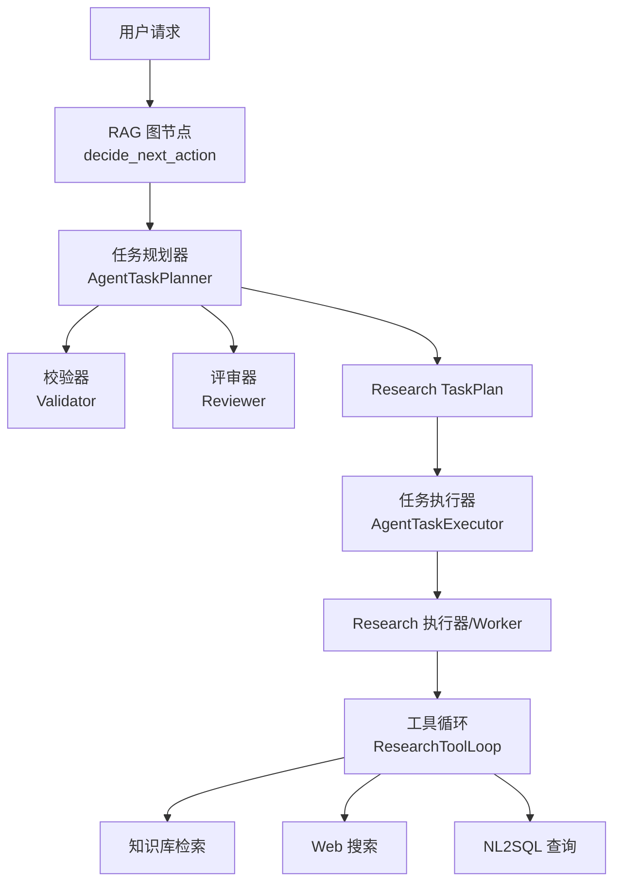
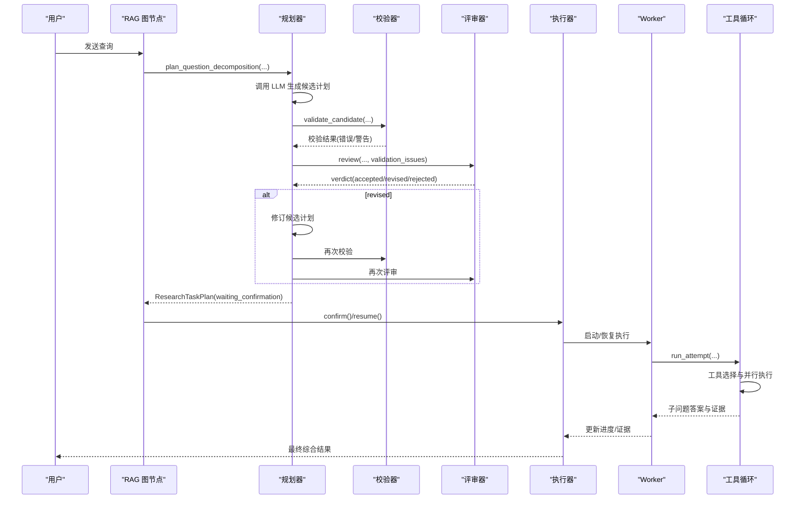
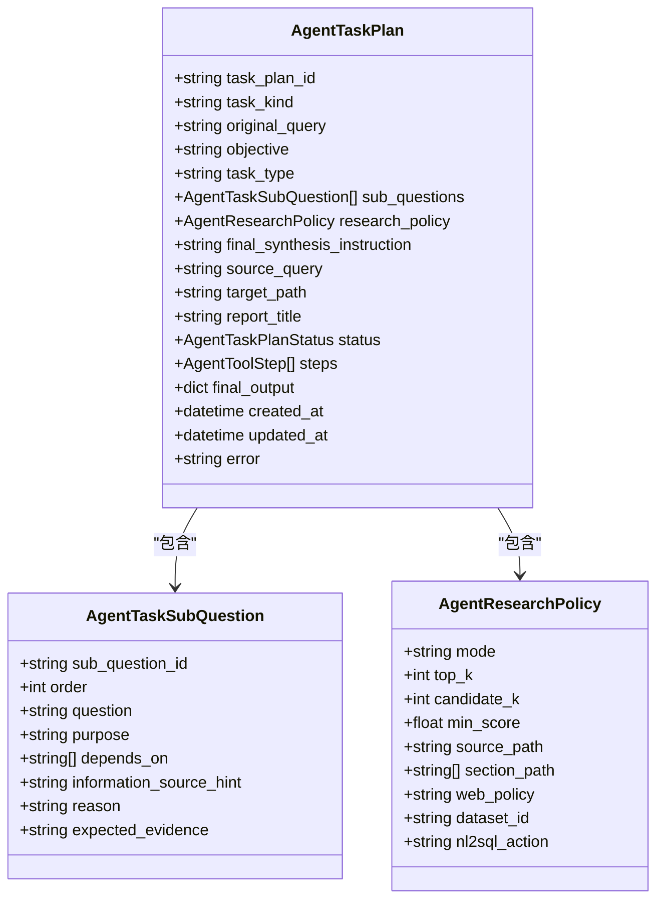
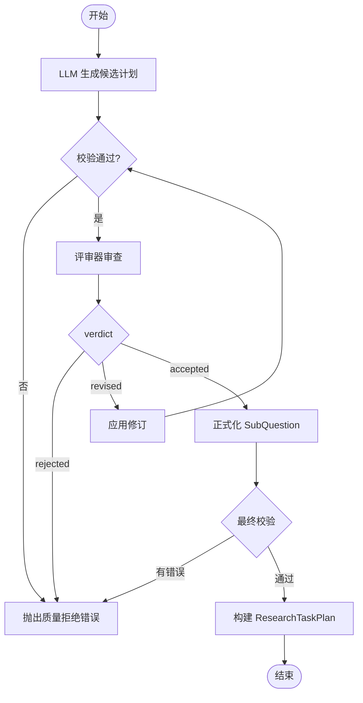
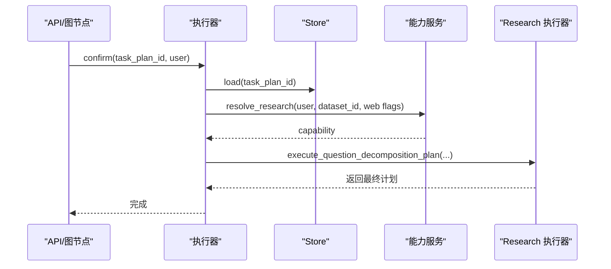
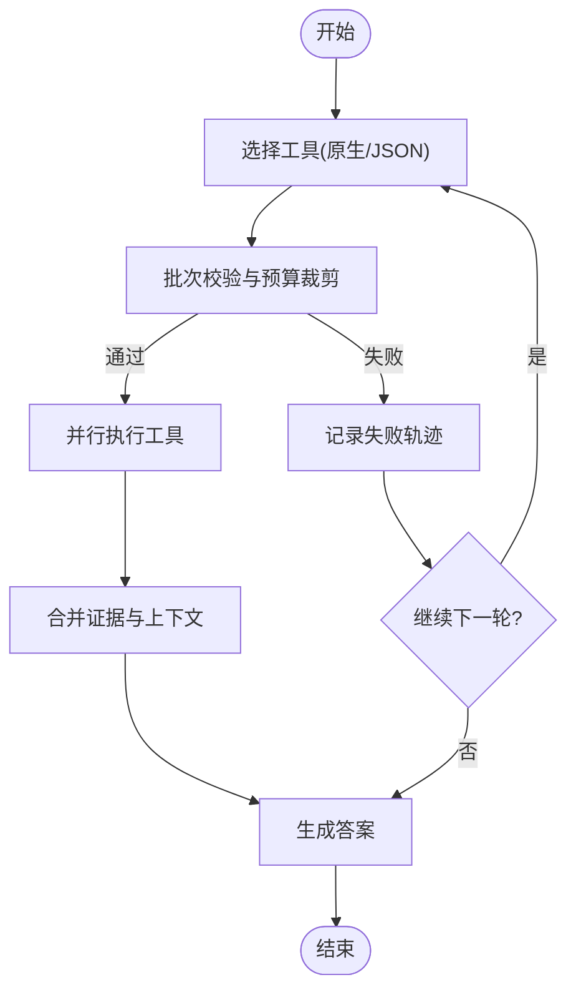
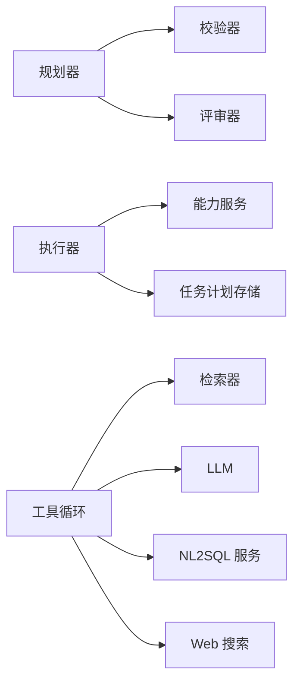
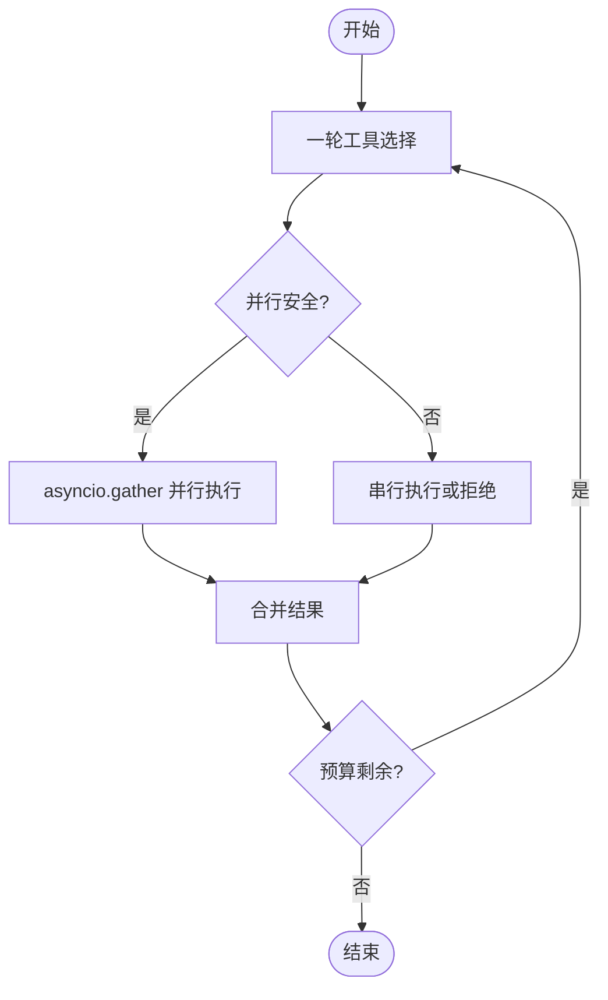

# 任务规划器

<cite>
**本文引用的文件**
- [agent_task_plan.py](file://python-agent-study/src/fast_app/domain/agent_task_plan.py)
- [agent_task_planner.py](file://python-agent-study/src/fast_app/services/agent_tasks/agent_task_planner.py)
- [agent_task_executor.py](file://python-agent-study/src/fast_app/services/agent_tasks/agent_task_executor.py)
- [research_tool_loop.py](file://python-agent-study/src/fast_app/services/research/research_tool_loop.py)
- [rag_agent_nodes.py](file://python-agent-study/src/fast_app/graph/rag_agent/rag_agent_nodes.py)
- [test_agentic_research_orchestration.py](file://python-agent-study/scripts/tests/agent_research/test_agentic_research_orchestration.py)
- [多Agent架构升级方案 + 模块代码讲解.md](file://python-agent-study/scripts/docs/多Agent架构升级方案 + 模块代码讲解.md)
- [NL2SQL自然语言转SQL实现教程.md](file://python-agent-study/scripts/docs/NL2SQL自然语言转SQL实现教程.md)
</cite>

## 目录
1. [简介](#简介)
2. [项目结构](#项目结构)
3. [核心组件](#核心组件)
4. [架构总览](#架构总览)
5. [详细组件分析](#详细组件分析)
6. [依赖关系分析](#依赖关系分析)
7. [性能与并行优化](#性能与并行优化)
8. [故障处理与回滚策略](#故障处理与回滚策略)
9. [配置参数与自定义规划算法](#配置参数与自定义规划算法)
10. [规划质量评估指标](#规划质量评估指标)
11. [常见问题排查](#常见问题排查)
12. [结论](#结论)

## 简介
本文件面向“任务规划器”的完整设计与实现，聚焦如何将复杂查询分解为结构化、可验证、可执行的子问题计划，并通过校验器与评审器保障计划质量。内容覆盖：
- 依赖关系分析与执行顺序确定
- 并行执行优化与资源约束
- 任务类型识别（知识库检索、Web 搜索、NL2SQL 等）
- 失败回滚与取消机制
- 配置参数、自定义规划算法扩展点
- 规划质量评估指标与可观测性
- AgentTaskPlanner 如何通过 LLM 生成候选计划，结合验证器与评审器确保质量
- 不同来源（Web、知识库、NL2SQL）的任务规划与工具编排

## 项目结构
任务规划相关代码主要分布在以下位置：
- 领域模型：定义任务计划、子问题、研究策略、证据评估等数据结构
- 规划器：基于 LLM 生成候选计划，并协调校验与评审
- 执行器：统一入口，负责并发控制、权限重建、恢复与确认
- 工具循环：单个子问题的工具选择、并行执行、答案生成
- 图节点：RAG Agent 路由到任务规划或 NL2SQL 等分支

图表来源
- [rag_agent_nodes.py:440-471](file://python-agent-study/src/fast_app/graph/rag_agent/rag_agent_nodes.py#L440-L471)
- [agent_task_planner.py:102-269](file://python-agent-study/src/fast_app/services/agent_tasks/agent_task_planner.py#L102-L269)
- [agent_task_executor.py:280-339](file://python-agent-study/src/fast_app/services/agent_tasks/agent_task_executor.py#L280-L339)
- [research_tool_loop.py:219-626](file://python-agent-study/src/fast_app/services/research/research_tool_loop.py#L219-L626)

章节来源
- [rag_agent_nodes.py:440-471](file://python-agent-study/src/fast_app/graph/rag_agent/rag_agent_nodes.py#L440-L471)
- [agent_task_planner.py:102-269](file://python-agent-study/src/fast_app/services/agent_tasks/agent_task_planner.py#L102-L269)
- [agent_task_executor.py:280-339](file://python-agent-study/src/fast_app/services/agent_tasks/agent_task_executor.py#L280-L339)
- [research_tool_loop.py:219-626](file://python-agent-study/src/fast_app/services/research/research_tool_loop.py#L219-L626)

## 核心组件
- 领域模型
  - 任务计划与状态：包含任务类型、目标、子问题列表、研究策略、最终输出、步骤等
  - 子问题：描述问题、目的、依赖、信息来源提示、期望证据
  - 研究策略：检索模式、top_k、候选数量、最低分数、网络策略、数据集范围
  - 证据评估：充分性、置信度、相关性、覆盖率、权威性、缺失点、建议动作
- 规划器
  - 通过 LLM 生成 Requirements 与 SubQuestion Candidates
  - 调用校验器进行结构与规则检查
  - 调用评审器进行质量审查，必要时修订
  - 产出等待确认的 Research TaskPlan
- 执行器
  - 统一入口，按 task_kind 分派到 Research 或文档任务执行器
  - 并发控制：同任务互斥锁、进程内活动集合保护
  - 权限重建：confirm/resume 时重新加载 Plan 并基于当前用户重建 ACL
  - 取消：写入取消信号，运行节点在安全边界停止
- 工具循环
  - 单轮工具选择：支持原生 ToolCall 与 JSON 回退
  - 并行执行：只读工具白名单并行，受最大并行数限制
  - 答案生成：整合上下文与证据，生成子问题回答
  - 断点续跑：checkpoint 回调持久化阶段与证据摘要

章节来源
- [agent_task_plan.py:26-343](file://python-agent-study/src/fast_app/domain/agent_task_plan.py#L26-L343)
- [agent_task_planner.py:88-269](file://python-agent-study/src/fast_app/services/agent_tasks/agent_task_planner.py#L88-L269)
- [agent_task_executor.py:135-339](file://python-agent-study/src/fast_app/services/agent_tasks/agent_task_executor.py#L135-L339)
- [research_tool_loop.py:172-626](file://python-agent-study/src/fast_app/services/research/research_tool_loop.py#L172-L626)

## 架构总览
任务规划的整体流程如下：
- RAG 图节点根据意图决定进入任务规划或 NL2SQL 报告路径
- 规划器使用 LLM 生成候选计划，随后由校验器与评审器把关
- 通过的用户确认进入执行阶段，执行器按策略与权限启动 Research Worker
- 工具循环在每个子问题中迭代选择工具、并行执行、生成答案
- 证据评估驱动下一轮补充检索或综合回答

图表来源
- [rag_agent_nodes.py:440-471](file://python-agent-study/src/fast_app/graph/rag_agent/rag_agent_nodes.py#L440-L471)
- [agent_task_planner.py:102-269](file://python-agent-study/src/fast_app/services/agent_tasks/agent_task_planner.py#L102-L269)
- [agent_task_executor.py:444-554](file://python-agent-study/src/fast_app/services/agent_tasks/agent_task_executor.py#L444-L554)
- [research_tool_loop.py:219-626](file://python-agent-study/src/fast_app/services/research/research_tool_loop.py#L219-L626)

## 详细组件分析

### 领域模型与数据流
- 任务计划
  - 字段包括任务 ID、类型、原始查询、目标、任务类型、子问题列表、研究策略、最终输出、步骤、状态、时间戳、错误信息
  - 支持两种前端展示：问题拆解与文档管理
- 子问题
  - 唯一 ID、顺序、问题文本、目的、依赖列表、信息来源提示、原因、期望证据
- 研究策略
  - 检索模式、top_k、候选数量、最低分数、源路径、章节路径、网络策略、数据集范围、NL2SQL 动作
- 证据评估
  - 结论、置信度、相关性、覆盖率、权威性、是否需新鲜信息、缺失点、建议动作、理由

图表来源
- [agent_task_plan.py:76-146](file://python-agent-study/src/fast_app/domain/agent_task_plan.py#L76-L146)
- [agent_task_plan.py:274-324](file://python-agent-study/src/fast_app/domain/agent_task_plan.py#L274-L324)

章节来源
- [agent_task_plan.py:76-146](file://python-agent-study/src/fast_app/domain/agent_task_plan.py#L76-L146)
- [agent_task_plan.py:274-324](file://python-agent-study/src/fast_app/domain/agent_task_plan.py#L274-L324)

### 规划器：LLM 生成、校验与评审
- 生成候选计划
  - 使用系统提示词约束输出 Requirements 与 SubQuestion Candidates
  - 将解析后的请求与能力快照作为上下文传入
- 校验
  - 对候选计划进行结构与规则校验，记录错误与警告
- 评审
  - 评审器决定是否接受、修订或拒绝
  - 若修订，则用修订结果重新校验与评审
- 正式化
  - 将候选转换为正式 SubQuestion，计算 web_usage
  - 最终校验通过后构建 ResearchTaskPlan，状态为 waiting_confirmation

图表来源
- [agent_task_planner.py:102-269](file://python-agent-study/src/fast_app/services/agent_tasks/agent_task_planner.py#L102-L269)

章节来源
- [agent_task_planner.py:102-269](file://python-agent-study/src/fast_app/services/agent_tasks/agent_task_planner.py#L102-L269)

### 执行器：并发控制、权限重建与恢复
- 并发控制
  - 同任务互斥锁防止重复 confirm/retry
  - 进程内活动集合保护 Research 重入
- 权限重建
  - confirm/resume 时从 Store 重读 Plan，校验归属并重建 ACL filters
- 恢复
  - Research 使用 Worker 结果快照；文档任务使用 checkpoint
- 取消
  - 写入取消信号，运行节点在安全边界停止；未运行的失败任务立即清理

图表来源
- [agent_task_executor.py:444-554](file://python-agent-study/src/fast_app/services/agent_tasks/agent_task_executor.py#L444-L554)

章节来源
- [agent_task_executor.py:444-554](file://python-agent-study/src/fast_app/services/agent_tasks/agent_task_executor.py#L444-L554)

### 工具循环：工具选择、并行执行与答案生成
- 工具选择
  - 优先原生 ToolCall，失败回退 JSON
  - URL 场景强制 mcp__fetch；Web 搜索首轮必须产生 Web ToolCall（当策略要求）
- 并行执行
  - 只读工具白名单：知识库检索、Web 搜索、NL2SQL 查询、mcp__fetch
  - 批次校验：未知工具或串行工具被拒绝；预算限制保留前 N 项
  - asyncio.gather 并行执行，收集 trace、证据与上下文
- 答案生成
  - 所有工具完成后整合上下文与证据，生成子问题回答
  - 无工具时仅依赖前置子问题答案进行推理

图表来源
- [research_tool_loop.py:219-626](file://python-agent-study/src/fast_app/services/research/research_tool_loop.py#L219-L626)

章节来源
- [research_tool_loop.py:219-626](file://python-agent-study/src/fast_app/services/research/research_tool_loop.py#L219-L626)

### 不同来源的任务规划
- 知识库检索
  - 适合内部文档、工程实现、知识库事实
  - 工具名：knowledge_retrieval
- Web 搜索
  - 需要公开互联网或最新资料时使用
  - 工具名：web_search；URL 场景优先 mcp__fetch
- NL2SQL 查询
  - 服务端已绑定 Dataset 的结构化数据查询
  - 工具名：nl2sql_query；不允许模型传入 dataset_id/scope
- 综合
  - 可同时并行选择知识库与 NL2SQL；综合子问题依赖事实子问题

章节来源
- [research_tool_loop.py:758-800](file://python-agent-study/src/fast_app/services/research/research_tool_loop.py#L758-L800)
- [NL2SQL自然语言转SQL实现教程.md:147-181](file://python-agent-study/scripts/docs/NL2SQL自然语言转SQL实现教程.md#L147-L181)

## 依赖关系分析
- 组件耦合
  - 规划器依赖校验器与评审器，形成“生成-校验-评审”闭环
  - 执行器依赖能力服务与存储，确保权限与状态一致性
  - 工具循环依赖检索器、LLM、NL2SQL 服务与 Web 搜索
- 外部依赖
  - LLM：用于生成候选计划、工具选择、答案生成
  - 检索器：向量与关键词检索
  - NL2SQL 服务：结构化数据查询
  - Web 搜索：公开网络检索

图表来源
- [agent_task_planner.py:102-269](file://python-agent-study/src/fast_app/services/agent_tasks/agent_task_planner.py#L102-L269)
- [agent_task_executor.py:516-592](file://python-agent-study/src/fast_app/services/agent_tasks/agent_task_executor.py#L516-L592)
- [research_tool_loop.py:172-800](file://python-agent-study/src/fast_app/services/research/research_tool_loop.py#L172-L800)

章节来源
- [agent_task_planner.py:102-269](file://python-agent-study/src/fast_app/services/agent_tasks/agent_task_planner.py#L102-L269)
- [agent_task_executor.py:516-592](file://python-agent-study/src/fast_app/services/agent_tasks/agent_task_executor.py#L516-L592)
- [research_tool_loop.py:172-800](file://python-agent-study/src/fast_app/services/research/research_tool_loop.py#L172-L800)

## 性能与并行优化
- 并行执行
  - 同一轮只读工具可并行执行，提升吞吐
  - 并行安全工具白名单限制，避免写操作冲突
- 预算控制
  - 每轮工具调用计数，防止无限循环
  - 批次裁剪：超出预算的调用不执行，避免浪费
- 轮次屏障与 DAG
  - 当前实现为轮次级同步；未来可升级为 DAG 以细粒度依赖调度
  - 文档指出何时值得升级为 DAG：大量明确任务、耗时差异大、需独立分支持续执行等

图表来源
- [research_tool_loop.py:326-484](file://python-agent-study/src/fast_app/services/research/research_tool_loop.py#L326-L484)
- [多Agent架构升级方案 + 模块代码讲解.md:1602-1684](file://python-agent-study/scripts/docs/多Agent架构升级方案 + 模块代码讲解.md#L1602-L1684)

章节来源
- [research_tool_loop.py:326-484](file://python-agent-study/src/fast_app/services/research/research_tool_loop.py#L326-L484)
- [多Agent架构升级方案 + 模块代码讲解.md:1602-1684](file://python-agent-study/scripts/docs/多Agent架构升级方案 + 模块代码讲解.md#L1602-L1684)

## 故障处理与回滚策略
- 权限拒绝
  - 工具权限拒绝属于任务级安全事件，不能降级继续
- 工具失败
  - 记录失败轨迹与错误信息，不影响其他工具执行
- 子问题失败
  - 不中断整个计划，后续子问题仍可执行
- 取消
  - 写入取消信号，运行节点在安全边界停止；未运行任务立即清理
- 恢复
  - 基于 checkpoint 或 Worker 快照恢复执行，避免重复工作

章节来源
- [research_tool_loop.py:610-626](file://python-agent-study/src/fast_app/services/research/research_tool_loop.py#L610-L626)
- [agent_task_executor.py:212-278](file://python-agent-study/src/fast_app/services/agent_tasks/agent_task_executor.py#L212-L278)
- [agent_task_executor.py:341-442](file://python-agent-study/src/fast_app/services/agent_tasks/agent_task_executor.py#L341-L442)

## 配置参数与自定义规划算法
- 配置参数
  - 检索模式：vector/keyword/hybrid
  - top_k：每次检索保留文档数量
  - candidate_k：rerank 前候选数量
  - min_score：可用证据最低分数
  - web_policy：禁止/兜底/必须
  - dataset_id/nl2sql_action：NL2SQL 绑定与动作
- 自定义规划算法
  - 可扩展校验器与评审器逻辑，增强规则检查与质量评估
  - 可在工具循环中注入自定义工具或调整并行策略
  - 通过 LangChainConfigFactory 透传追踪配置，便于观测

章节来源
- [agent_task_plan.py:99-146](file://python-agent-study/src/fast_app/domain/agent_task_plan.py#L99-L146)
- [research_tool_loop.py:172-240](file://python-agent-study/src/fast_app/services/research/research_tool_loop.py#L172-L240)

## 规划质量评估指标
- 证据充分性
  - verdict：sufficient/partial/insufficient/conflict
  - confidence：置信度
- 证据质量
  - relevance：相关性
  - coverage：覆盖率
  - authority：权威性
- 行动建议
  - recommended_action：accept/rewrite_local_query/search_web/combine_local_and_web/clarify/stop_with_limitation
- 缺失点
  - missing_points：下一轮应补齐的具体问题点

章节来源
- [agent_task_plan.py:148-201](file://python-agent-study/src/fast_app/domain/agent_task_plan.py#L148-L201)

## 常见问题排查
- 任务计划不可用
  - 检查 LLM 配置与可用性
  - 查看评审器是否抛出不可用异常
- 低质量计划被拒绝
  - 检查校验错误与评审结论
  - 关注修订摘要与最终校验结果
- 并行执行异常
  - 检查工具白名单与并行安全规则
  - 确认预算与批次裁剪逻辑
- 权限问题
  - 确认 confirm/resume 时权限重建
  - 检查用户身份与全局角色

章节来源
- [agent_task_planner.py:323-350](file://python-agent-study/src/fast_app/services/agent_tasks/agent_task_planner.py#L323-L350)
- [agent_task_executor.py:556-592](file://python-agent-study/src/fast_app/services/agent_tasks/agent_task_executor.py#L556-L592)
- [research_tool_loop.py:340-361](file://python-agent-study/src/fast_app/services/research/research_tool_loop.py#L340-L361)

## 结论
任务规划器通过“LLM 生成 + 校验 + 评审”的闭环，确保复杂查询被分解为高质量、可执行的子问题计划。执行器提供并发控制、权限重建与恢复能力，工具循环实现灵活的工具选择与并行执行。未来可考虑升级为 DAG 以支持更细粒度的依赖调度与多分支长流程。通过配置参数与自定义扩展点，系统可适配不同业务场景与资源约束。