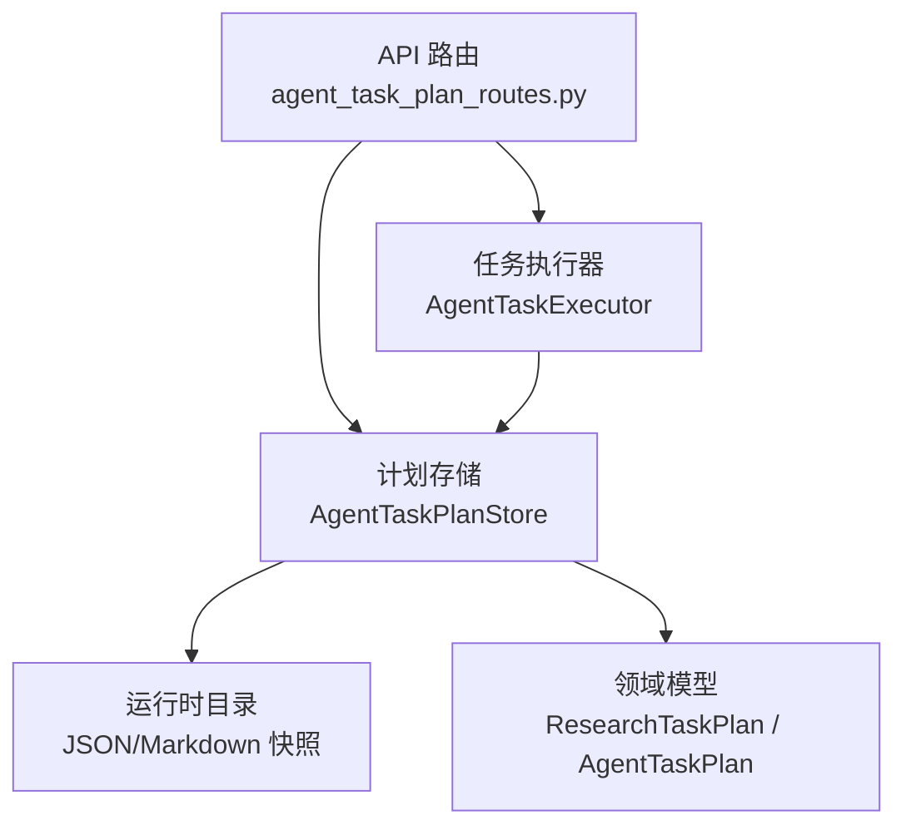
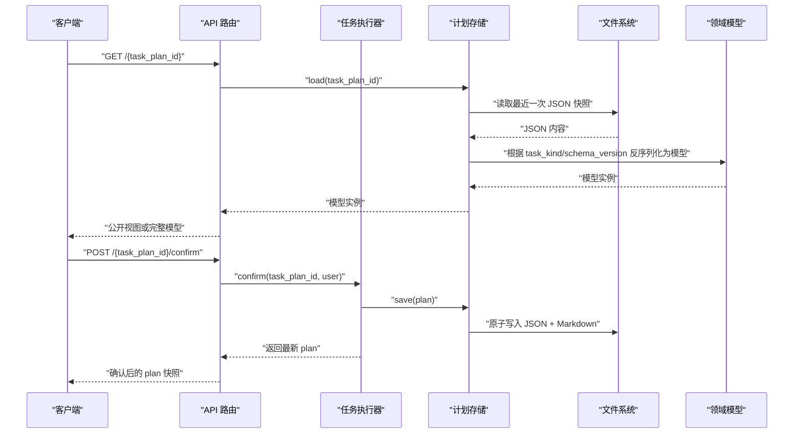
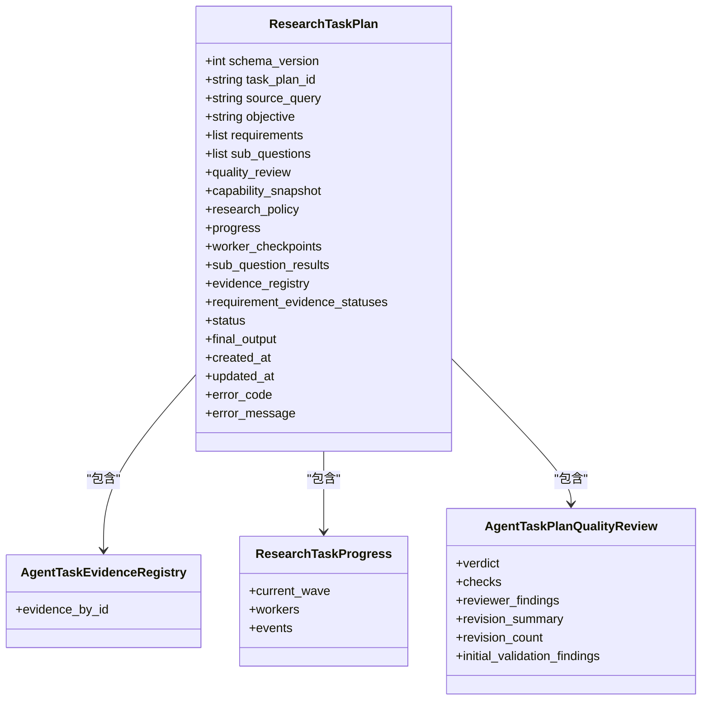
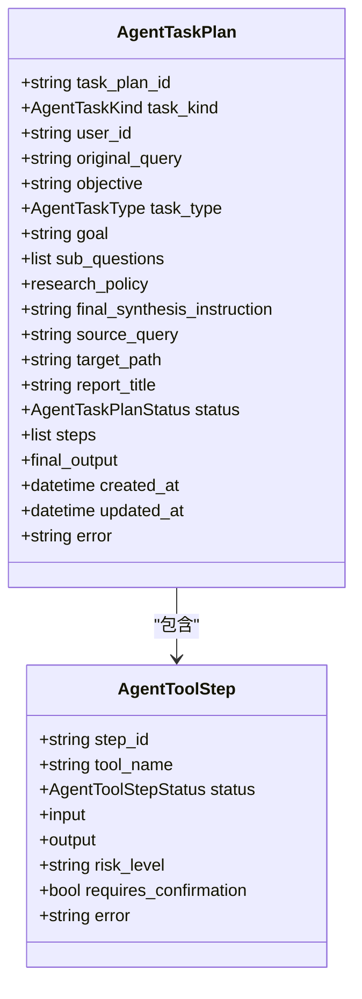
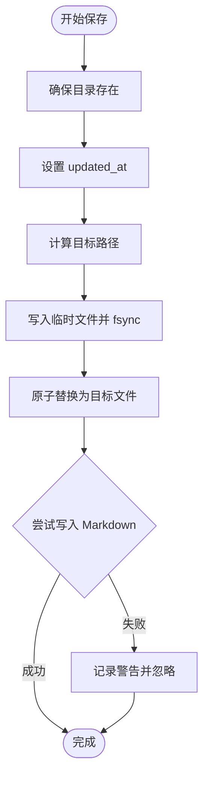
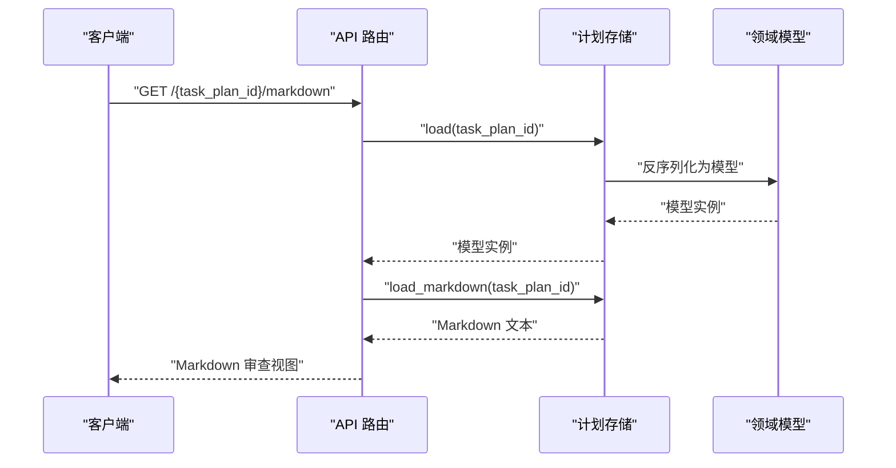
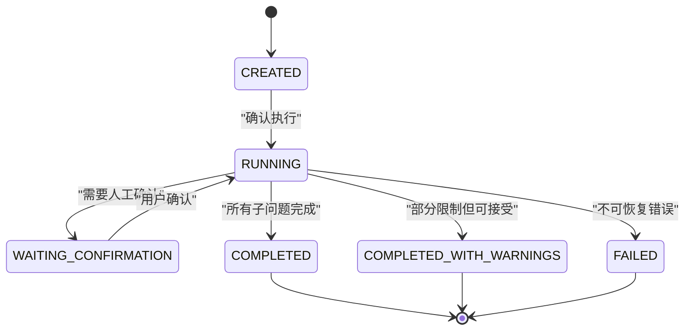
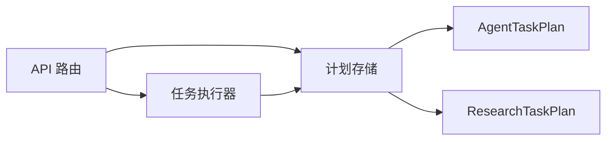

# 计划存储

<cite>
**本文引用的文件**
- [research_task_plan.py](file://src/fast_app/domain/research_task_plan.py)
- [agent_task_plan.py](file://src/fast_app/domain/agent_task_plan.py)
- [agent_task_plan_store.py](file://src/fast_app/services/agent_tasks/agent_task_plan_store.py)
- [agent_task_plan_routes.py](file://src/fast_app/api/agent_task_plan_routes.py)
</cite>

## 目录
1. [简介](#简介)
2. [项目结构](#项目结构)
3. [核心组件](#核心组件)
4. [架构总览](#架构总览)
5. [详细组件分析](#详细组件分析)
6. [依赖关系分析](#依赖关系分析)
7. [性能与一致性](#性能与一致性)
8. [故障排查指南](#故障排查指南)
9. [结论](#结论)
10. [附录：操作示例路径](#附录：操作示例路径)

## 简介
本文件面向“任务计划”的持久化与运行期存储，重点覆盖以下方面：
- 数据结构设计：ResearchTaskPlan（问题拆解研究链路）与 AgentTaskPlan（通用多步骤任务计划）两种模型。
- 持久化策略：基于运行时 JSON 文件的原子写入、Markdown 可读视图、按 ID 定位与版本兼容。
- 查询优化机制：最小化 glob 匹配、按 task_plan_id 精确查找、公开视图裁剪敏感字段。
- 版本管理、状态同步与数据一致性：schema_version、质量评审、证据注册表、进度事件与最终输出守卫。
- 存储后端选择与配置：文件系统作为默认后端；可扩展为对象存储或数据库。
- 数据迁移、备份恢复：快照文件即迁移单元；支持重试恢复与 Markdown 可再生成。
- 事务性保证：单文件原子替换、子问题结果与证据注册表的原子提交边界。
- 具体操作示例：创建、查询、更新、删除的计划生命周期在 API 路由中的调用路径。

## 项目结构
围绕“计划存储”的关键代码分布在领域模型、服务层存储与 API 路由三层：
- 领域模型：定义 ResearchTaskPlan 与 AgentTaskPlan 的数据结构、状态枚举、证据与进度模型。
- 存储服务：AgentTaskPlanStore 负责 JSON/Markdown 快照的原子读写、加载与渲染。
- API 路由：提供读取、确认、取消、重试、SSE 流式进度等接口，统一通过执行器与存储交互。

图表来源
- [agent_task_plan_routes.py:111-140](file://src/fast_app/api/agent_task_plan_routes.py#L111-L140)
- [agent_task_plan_store.py:23-104](file://src/fast_app/services/agent_tasks/agent_task_plan_store.py#L23-L104)
- [research_task_plan.py:787-824](file://src/fast_app/domain/research_task_plan.py#L787-L824)
- [agent_task_plan.py:274-324](file://src/fast_app/domain/agent_task_plan.py#L274-L324)

章节来源
- [agent_task_plan_routes.py:111-140](file://src/fast_app/api/agent_task_plan_routes.py#L111-L140)
- [agent_task_plan_store.py:23-104](file://src/fast_app/services/agent_tasks/agent_task_plan_store.py#L23-L104)
- [research_task_plan.py:787-824](file://src/fast_app/domain/research_task_plan.py#L787-L824)
- [agent_task_plan.py:274-324](file://src/fast_app/domain/agent_task_plan.py#L274-L324)

## 核心组件
- ResearchTaskPlan：v2 结构化研究计划，包含需求、子问题、质量评审、能力快照、研究策略、执行进度、Worker 检查点、证据注册表、Requirement 证据状态、最终输出与生命周期状态。
- AgentTaskPlan：通用多步骤任务计划，包含子问题、工具步骤、研究参数、最终输出摘要、生命周期状态与错误信息。
- AgentTaskPlanStore：以运行时目录为后端，提供 save/load/load_markdown 等方法，实现原子写入与 Markdown 可再生成。
- API 路由：暴露 GET/POST 接口用于读取、确认、取消、重试与 SSE 流式进度推送。

章节来源
- [research_task_plan.py:787-824](file://src/fast_app/domain/research_task_plan.py#L787-L824)
- [agent_task_plan.py:274-324](file://src/fast_app/domain/agent_task_plan.py#L274-L324)
- [agent_task_plan_store.py:23-104](file://src/fast_app/services/agent_tasks/agent_task_plan_store.py#L23-L104)
- [agent_task_plan_routes.py:111-140](file://src/fast_app/api/agent_task_plan_routes.py#L111-L140)

## 架构总览
下图展示从 API 到存储再到领域模型的调用链路与职责分工：

图表来源
- [agent_task_plan_routes.py:111-140](file://src/fast_app/api/agent_task_plan_routes.py#L111-L140)
- [agent_task_plan_routes.py:201-255](file://src/fast_app/api/agent_task_plan_routes.py#L201-L255)
- [agent_task_plan_store.py:29-86](file://src/fast_app/services/agent_tasks/agent_task_plan_store.py#L29-L86)
- [research_task_plan.py:787-824](file://src/fast_app/domain/research_task_plan.py#L787-L824)
- [agent_task_plan.py:274-324](file://src/fast_app/domain/agent_task_plan.py#L274-L324)

## 详细组件分析

### ResearchTaskPlan 存储设计
- 版本管理：通过 schema_version=2 标识当前 v2 结构，加载时校验并拒绝不受支持的旧版本。
- 状态同步：progress.workers 与 progress.events 记录子问题执行阶段与波次；requirement_evidence_statuses 聚合 Requirement 的证据满足情况；final_output 保存通过 Output Guard 的最终答案。
- 数据一致性：evidence_registry.evidence_by_id 是 Typed Evidence 的唯一事实源；每个 SubQuestion 的结果以 sub_question_results 原子提交；quality_review 约束最终质量检查必须全部通过。
- 安全公开视图：build_research_task_plan_public_view 裁剪敏感字段，仅暴露非敏感能力摘要、公开证据引用与安全的 Worker 结果。

图表来源
- [research_task_plan.py:787-824](file://src/fast_app/domain/research_task_plan.py#L787-L824)
- [research_task_plan.py:362-370](file://src/fast_app/domain/research_task_plan.py#L362-L370)
- [research_task_plan.py:762-770](file://src/fast_app/domain/research_task_plan.py#L762-L770)
- [research_task_plan.py:493-524](file://src/fast_app/domain/research_task_plan.py#L493-L524)

章节来源
- [research_task_plan.py:787-824](file://src/fast_app/domain/research_task_plan.py#L787-L824)
- [research_task_plan.py:362-370](file://src/fast_app/domain/research_task_plan.py#L362-L370)
- [research_task_plan.py:762-770](file://src/fast_app/domain/research_task_plan.py#L762-L770)
- [research_task_plan.py:493-524](file://src/fast_app/domain/research_task_plan.py#L493-L524)

### AgentTaskPlan 存储设计
- 生命周期状态：CREATED/RUNNING/WAITING_CONFIRMATION/COMPLETED/COMPLETED_WITH_WARNINGS/FAILED/CANCELLED。
- 工具步骤：steps 列表记录顺序执行的工具步骤及其输入输出、风险等级与是否需要确认。
- 研究参数：research_policy 冻结检索模式、top_k、候选数量、最低分数、路径限定、Web 策略与 Dataset/NL2SQL 动作。
- 最终输出：final_output 保存子问题结果、最终答案、使用工具与警告等摘要。

图表来源
- [agent_task_plan.py:274-324](file://src/fast_app/domain/agent_task_plan.py#L274-L324)
- [agent_task_plan.py:49-74](file://src/fast_app/domain/agent_task_plan.py#L49-L74)

章节来源
- [agent_task_plan.py:274-324](file://src/fast_app/domain/agent_task_plan.py#L274-L324)
- [agent_task_plan.py:49-74](file://src/fast_app/domain/agent_task_plan.py#L49-L74)

### 存储后端与原子写入
- 后端选择：默认使用本地文件系统目录 settings.agent_task_plan_dir，适合单机或容器化部署；可通过扩展 AgentTaskPlanStore 适配对象存储或数据库。
- 原子写入：使用临时文件 + fsync + os.replace 实现原子替换，避免轮询者读到半份快照；Markdown 失败不影响 JSON 事实源。
- 文件命名：按 task_plan_id 生成唯一文件名，已有文件继续覆盖，避免同一计划产生多份快照。
- 加载策略：先做 task_plan_id 格式校验，再按后缀 .json 排序取最近一份；根据 task_kind 与 schema_version 反序列化为对应模型。

图表来源
- [agent_task_plan_store.py:29-67](file://src/fast_app/services/agent_tasks/agent_task_plan_store.py#L29-L67)
- [agent_task_plan_store.py:97-104](file://src/fast_app/services/agent_tasks/agent_task_plan_store.py#L97-L104)

章节来源
- [agent_task_plan_store.py:29-67](file://src/fast_app/services/agent_tasks/agent_task_plan_store.py#L29-L67)
- [agent_task_plan_store.py:97-104](file://src/fast_app/services/agent_tasks/agent_task_plan_store.py#L97-L104)

### 查询与公开视图
- 读取接口：GET /{task_plan_id} 返回公开视图或完整模型；对 ResearchTaskPlan 使用 build_research_task_plan_public_view 裁剪敏感字段。
- Markdown 审查：GET /{task_plan_id}/markdown 返回人类可读视图；若不存在则按 JSON 现场渲染。
- 权限控制：仅允许查看自己创建的计划或系统管理员。

图表来源
- [agent_task_plan_routes.py:127-140](file://src/fast_app/api/agent_task_plan_routes.py#L127-L140)
- [agent_task_plan_store.py:88-95](file://src/fast_app/services/agent_tasks/agent_task_plan_store.py#L88-L95)
- [research_task_plan.py:897-954](file://src/fast_app/domain/research_task_plan.py#L897-L954)

章节来源
- [agent_task_plan_routes.py:127-140](file://src/fast_app/api/agent_task_plan_routes.py#L127-L140)
- [agent_task_plan_store.py:88-95](file://src/fast_app/services/agent_tasks/agent_task_plan_store.py#L88-L95)
- [research_task_plan.py:897-954](file://src/fast_app/domain/research_task_plan.py#L897-L954)

### 状态变更的事务性保证
- 单文件原子性：每次 save 都通过临时文件 + fsync + replace 保证 JSON 快照的原子更新。
- 子问题结果原子提交：ResearchTaskPlan.sub_question_results 与 evidence_registry.evidence_by_id 在单个子问题完成后原子写入，避免部分提交导致的状态不一致。
- 质量门禁：quality_review 要求最终质量检查全部通过，否则不允许保存有效计划。
- 最终输出守卫：final_output 需通过 Output Guard 后才持久化，确保最终答案的安全性与完整性。

图表来源
- [agent_task_plan.py:26-36](file://src/fast_app/domain/agent_task_plan.py#L26-L36)
- [research_task_plan.py:787-824](file://src/fast_app/domain/research_task_plan.py#L787-L824)
- [agent_task_plan_store.py:29-67](file://src/fast_app/services/agent_tasks/agent_task_plan_store.py#L29-L67)

章节来源
- [agent_task_plan.py:26-36](file://src/fast_app/domain/agent_task_plan.py#L26-L36)
- [research_task_plan.py:787-824](file://src/fast_app/domain/research_task_plan.py#L787-L824)
- [agent_task_plan_store.py:29-67](file://src/fast_app/services/agent_tasks/agent_task_plan_store.py#L29-L67)

### 数据迁移方案
- 版本兼容：加载时校验 schema_version，v2 仅接受受支持版本；旧版本将抛出不受支持错误，便于迁移脚本处理。
- 快照即迁移单元：每个 task_plan_id 对应一个 JSON 文件，可按 ID 进行增量迁移或回滚。
- Markdown 可再生成：即使 Markdown 缺失，也可从 JSON 现场渲染，降低迁移风险。

章节来源
- [agent_task_plan_store.py:69-86](file://src/fast_app/services/agent_tasks/agent_task_plan_store.py#L69-L86)
- [agent_task_plan_store.py:88-95](file://src/fast_app/services/agent_tasks/agent_task_plan_store.py#L88-L95)

### 备份恢复策略
- 备份：直接复制运行时目录下的 JSON 文件即可；Markdown 可作为辅助审查视图。
- 恢复：通过 retry 接口从最近完整快照恢复；SSE 流式确认会持续读取快照并推送进度。
- 幂等性：同一 task_plan_id 的多次 save 会覆盖旧文件，避免重复快照。

章节来源
- [agent_task_plan_routes.py:172-198](file://src/fast_app/api/agent_task_plan_routes.py#L172-L198)
- [agent_task_plan_store.py:97-104](file://src/fast_app/services/agent_tasks/agent_task_plan_store.py#L97-L104)

## 依赖关系分析
- API 路由依赖 Settings、CurrentUserContext、AgentTaskExecutor、AgentTaskPlanStore、PromptGuardService。
- 存储依赖 Settings、日志模块、领域模型（AgentTaskPlan、ResearchTaskPlan）。
- 领域模型之间通过组合关系组织：ResearchTaskPlan 包含进度、证据注册表、质量评审等；AgentTaskPlan 包含工具步骤与研究策略。

图表来源
- [agent_task_plan_routes.py:111-140](file://src/fast_app/api/agent_task_plan_routes.py#L111-L140)
- [agent_task_plan_store.py:23-104](file://src/fast_app/services/agent_tasks/agent_task_plan_store.py#L23-L104)
- [agent_task_plan.py:274-324](file://src/fast_app/domain/agent_task_plan.py#L274-L324)
- [research_task_plan.py:787-824](file://src/fast_app/domain/research_task_plan.py#L787-L824)

章节来源
- [agent_task_plan_routes.py:111-140](file://src/fast_app/api/agent_task_plan_routes.py#L111-L140)
- [agent_task_plan_store.py:23-104](file://src/fast_app/services/agent_tasks/agent_task_plan_store.py#L23-L104)
- [agent_task_plan.py:274-324](file://src/fast_app/domain/agent_task_plan.py#L274-L324)
- [research_task_plan.py:787-824](file://src/fast_app/domain/research_task_plan.py#L787-L824)

## 性能与一致性
- 查询优化：
  - 最小化 glob：仅按 task_plan_id 后缀匹配，避免全目录扫描。
  - 公开视图裁剪：减少网络传输与前端渲染负担。
- 写入性能：
  - 原子写入避免并发读到的半份快照；fsync 确保落盘。
  - Markdown 失败不影响 JSON 事实源，提升鲁棒性。
- 一致性：
  - 子问题结果与证据注册表原子提交，避免中间状态。
  - 质量门禁与 Output Guard 保证最终输出的正确与安全。

[本节为一般性指导，不直接分析具体文件]

## 故障排查指南
- 非法 task_plan_id：加载前进行格式校验，不符合规则将抛出应用服务错误。
- 计划不存在：未找到对应 JSON 文件时抛出应用服务错误。
- Schema 不受支持：v2 仅接受受支持版本，旧版本将抛出特定错误以便迁移。
- Markdown 写入失败：记录警告但不影响 JSON 事实源；可重新渲染。
- 权限不足：非创建者且非系统管理员无法查看计划。

章节来源
- [agent_task_plan_store.py:69-86](file://src/fast_app/services/agent_tasks/agent_task_plan_store.py#L69-L86)
- [agent_task_plan_routes.py:111-140](file://src/fast_app/api/agent_task_plan_routes.py#L111-L140)

## 结论
该计划存储方案以文件系统为默认后端，通过原子写入、版本兼容、公开视图与质量门禁，实现了高可靠的任务计划持久化与运行期状态同步。ResearchTaskPlan 与 AgentTaskPlan 分别面向复杂研究任务与通用多步骤任务，提供了清晰的数据结构与一致的生命周期管理。结合 API 路由的确认、取消、重试与 SSE 流式进度，形成了完整的计划生命周期闭环。

[本节为总结性内容，不直接分析具体文件]

## 附录：操作示例路径
- 创建计划：由上游 Planner/Reviewer 生成 ResearchTaskPlan 或 AgentTaskPlan，并通过执行器保存到存储。
  - 参考路径：[research_task_plan.py:787-824](file://src/fast_app/domain/research_task_plan.py#L787-L824)、[agent_task_plan.py:274-324](file://src/fast_app/domain/agent_task_plan.py#L274-L324)
- 查询计划：
  - 读取 JSON：GET /{task_plan_id}
    - 参考路径：[agent_task_plan_routes.py:111-124](file://src/fast_app/api/agent_task_plan_routes.py#L111-L124)
  - 读取 Markdown：GET /{task_plan_id}/markdown
    - 参考路径：[agent_task_plan_routes.py:127-140](file://src/fast_app/api/agent_task_plan_routes.py#L127-L140)
- 更新计划：
  - 确认执行：POST /{task_plan_id}/confirm
    - 参考路径：[agent_task_plan_routes.py:201-255](file://src/fast_app/api/agent_task_plan_routes.py#L201-L255)
  - 流式确认：POST /{task_plan_id}/confirm/stream
    - 参考路径：[agent_task_plan_routes.py:258-433](file://src/fast_app/api/agent_task_plan_routes.py#L258-L433)
- 删除计划：
  - 当前路由未提供显式删除接口；可通过停止执行与清理运行时目录实现。
- 取消与重试：
  - 取消：POST /{task_plan_id}/cancel
    - 参考路径：[agent_task_plan_routes.py:143-169](file://src/fast_app/api/agent_task_plan_routes.py#L143-L169)
  - 重试：POST /{task_plan_id}/retry
    - 参考路径：[agent_task_plan_routes.py:172-198](file://src/fast_app/api/agent_task_plan_routes.py#L172-L198)

章节来源
- [agent_task_plan_routes.py:111-140](file://src/fast_app/api/agent_task_plan_routes.py#L111-L140)
- [agent_task_plan_routes.py:143-198](file://src/fast_app/api/agent_task_plan_routes.py#L143-L198)
- [agent_task_plan_routes.py:201-433](file://src/fast_app/api/agent_task_plan_routes.py#L201-L433)
- [research_task_plan.py:787-824](file://src/fast_app/domain/research_task_plan.py#L787-L824)
- [agent_task_plan.py:274-324](file://src/fast_app/domain/agent_task_plan.py#L274-L324)