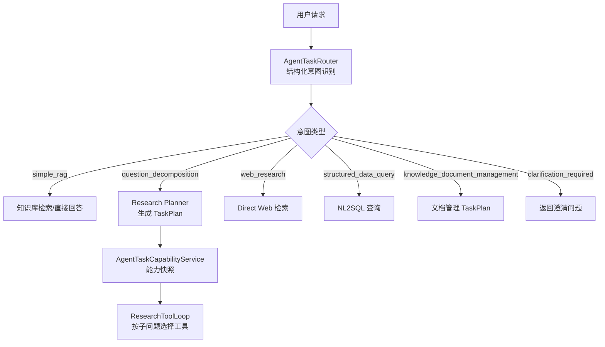
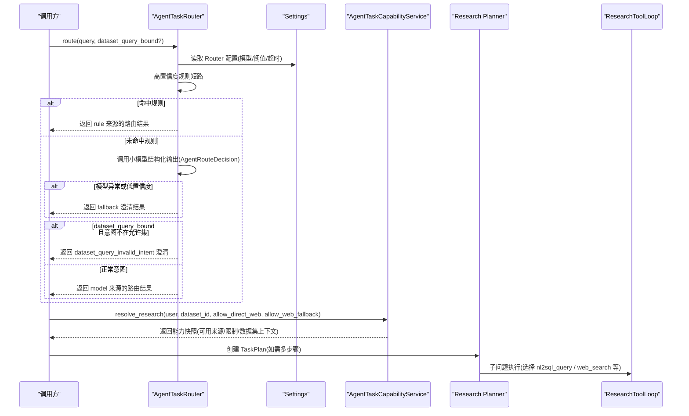
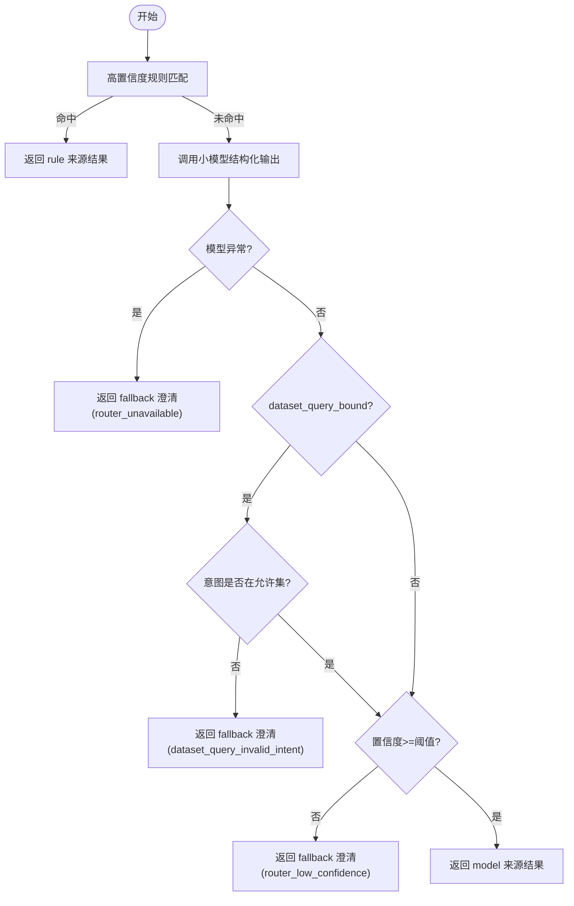
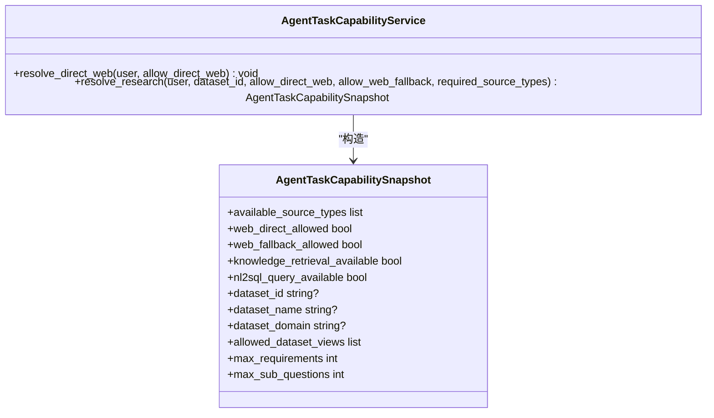
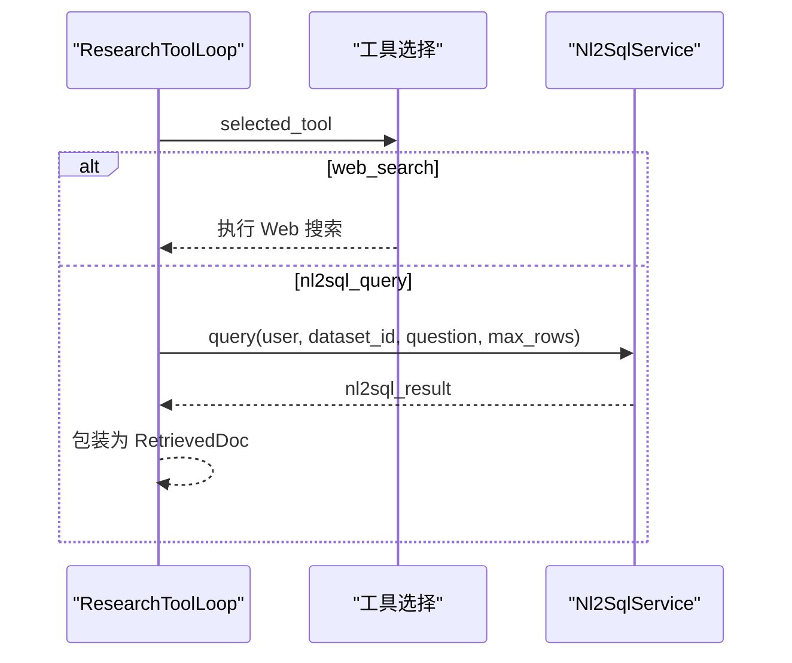
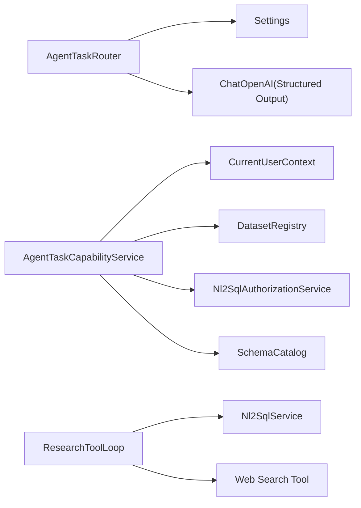
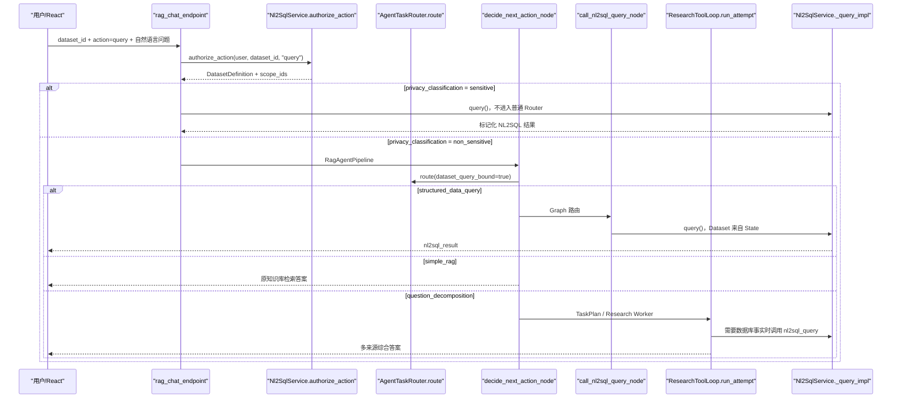

# 意图识别与任务路由

<cite>
**本文引用的文件**
- [agent_task_router.py](file://python-agent-study/src/fast_app/services/agent_tasks/agent_task_router.py)
- [agent_task_capability_service.py](file://python-agent-study/src/fast_app/services/agent_tasks/agent_task_capability_service.py)
- [config.py](file://python-agent-study/src/fast_app/core/config.py)
- [research_task_plan.py](file://python-agent-study/src/fast_app/domain/research_task_plan.py)
- [test_agent_task_router.py](file://python-agent-study/scripts/tests/agent_research/test_agent_task_router.py)
- [research_tool_loop.py](file://python-agent-study/src/fast_app/services/research/research_tool_loop.py)
- [NL2SQL自然语言转SQL实现教程.md](file://python-agent-study/scripts/docs/NL2SQL自然语言转SQL实现教程.md)
</cite>

## 目录
1. [简介](#简介)
2. [项目结构](#项目结构)
3. [核心组件](#核心组件)
4. [架构总览](#架构总览)
5. [详细组件分析](#详细组件分析)
6. [依赖关系分析](#依赖关系分析)
7. [性能考虑](#性能考虑)
8. [故障排查指南](#故障排查指南)
9. [结论](#结论)
10. [附录：配置与扩展](#附录：配置与扩展)

## 简介
本系统围绕“结构化意图识别 + 能力检测 + 路由决策”构建，将用户请求在入口层快速分类为知识库检索、NL2SQL 查询、直接回答、Web 搜索或需要追问澄清等路径。AgentTaskRouter 负责基于规则与小模型的结构化意图判断；AgentTaskCapabilityService 负责根据当前用户、策略与 Dataset 权限解析可用能力，确保后续执行路径具备所需工具与数据源。二者协同，使复杂问题可进入多步骤 Research Planner，简单问题可直接走单步检索或回答。

## 项目结构
与意图识别和任务路由相关的核心代码位于 fast_app.services.agent_tasks 与 fast_app.domain.research_task_plan，配合 core.config 提供 Router 配置校验，并在 research_tool_loop 中完成具体工具调用分流。测试用例集中在 scripts/tests/agent_research 下，用于验证路由行为、能力快照与异常分支。

图表来源
- [agent_task_router.py:178-308](file://python-agent-study/src/fast_app/services/agent_tasks/agent_task_router.py#L178-L308)
- [agent_task_capability_service.py:21-146](file://python-agent-study/src/fast_app/services/agent_tasks/agent_task_capability_service.py#L21-L146)
- [research_tool_loop.py:970-1004](file://python-agent-study/src/fast_app/services/research/research_tool_loop.py#L970-L1004)

章节来源
- [agent_task_router.py:178-308](file://python-agent-study/src/fast_app/services/agent_tasks/agent_task_router.py#L178-L308)
- [agent_task_capability_service.py:21-146](file://python-agent-study/src/fast_app/services/agent_tasks/agent_task_capability_service.py#L21-L146)
- [research_tool_loop.py:970-1004](file://python-agent-study/src/fast_app/services/research/research_tool_loop.py#L970-L1004)

## 核心组件
- AgentTaskRouter：使用窄规则 + 独立小模型进行结构化意图分类，输出稳定的意图、置信度与理由，并支持 dataset_query_bound 上下文约束。
- AgentTaskCapabilityService：从用户权限、策略开关与 Dataset 配置解析可用能力（知识库、Web、NL2SQL），构造能力快照供 Planner 与执行器使用。
- Settings：集中管理 Router 的模型、超时、温度、结构化输出方法与阈值等配置，并提供启动期校验。
- ResearchToolLoop：在 Research Worker 中根据子问题选择工具（如 NL2SQL、Web Search）并执行。

章节来源
- [agent_task_router.py:178-308](file://python-agent-study/src/fast_app/services/agent_tasks/agent_task_router.py#L178-L308)
- [agent_task_capability_service.py:21-146](file://python-agent-study/src/fast_app/services/agent_tasks/agent_task_capability_service.py#L21-L146)
- [config.py:970-996](file://python-agent-study/src/fast_app/core/config.py#L970-L996)
- [research_tool_loop.py:970-1004](file://python-agent-study/src/fast_app/services/research/research_tool_loop.py#L970-L1004)

## 架构总览
下图展示了从请求到路由、能力检查再到工具执行的端到端流程，包括 Dataset 绑定场景下的受限意图集合与错误兜底。

图表来源
- [agent_task_router.py:184-308](file://python-agent-study/src/fast_app/services/agent_tasks/agent_task_router.py#L184-L308)
- [agent_task_capability_service.py:51-146](file://python-agent-study/src/fast_app/services/agent_tasks/agent_task_capability_service.py#L51-L146)
- [research_tool_loop.py:970-1004](file://python-agent-study/src/fast_app/services/research/research_tool_loop.py#L970-L1004)

## 详细组件分析

### AgentTaskRouter：结构化意图识别与路由决策
- 意图集合：simple_rag、question_decomposition、knowledge_document_management、web_research、structured_data_query、clarification_required。新增意图需同步扩展 schema 与测试。
- 规则层：优先对明确语义进行低成本规则匹配（如文档操作关键词），命中后直接返回 rule 来源结果，避免 LLM 调用。
- 模型层：通过 ChatOpenAI with_structured_output 强制输出 AgentRouteDecision（intent、confidence、reason、可选 clarification_question）。
- 安全约束：
  - dataset_query_bound=true 时仅允许 structured_data_query/simple_rag/question_decomposition/clarification_required。
  - confidence < 阈值时降级为澄清，避免误执行。
  - 模型不可用时统一 fallback 为澄清，附带稳定 code（router_unavailable）。
- 输出：AgentTaskRouteResult 包含 decision、source(rule/model/fallback)、latency_ms、clarification_code。

图表来源
- [agent_task_router.py:184-308](file://python-agent-study/src/fast_app/services/agent_tasks/agent_task_router.py#L184-L308)
- [agent_task_router.py:331-370](file://python-agent-study/src/fast_app/services/agent_tasks/agent_task_router.py#L331-L370)

章节来源
- [agent_task_router.py:21-44](file://python-agent-study/src/fast_app/services/agent_tasks/agent_task_router.py#L21-L44)
- [agent_task_router.py:117-176](file://python-agent-study/src/fast_app/services/agent_tasks/agent_task_router.py#L117-L176)
- [agent_task_router.py:184-308](file://python-agent-study/src/fast_app/services/agent_tasks/agent_task_router.py#L184-L308)
- [agent_task_router.py:331-370](file://python-agent-study/src/fast_app/services/agent_tasks/agent_task_router.py#L331-L370)

### AgentTaskCapabilityService：能力管理与检查
- 职责：根据当前用户权限、策略开关与 Dataset 配置，解析非敏感能力摘要，供 Planner 与执行器使用。
- Direct Web 校验：要求用户具备 Web Search 权限、策略允许 direct Web、Provider 已配置。
- Research 能力快照：
  - 可用来源：knowledge_retrieval 始终可用；若满足条件则加入 web_search。
  - NL2SQL：当存在 dataset_id 且非敏感，授权通过后加入 nl2sql_query，并加载逻辑字段、视图、同义词与 schema 上下文。
  - 缺失必需来源时抛出 AgentTaskSourceUnavailableError。
- 输出：AgentTaskCapabilitySnapshot，包含 available_source_types、web_direct_allowed、web_fallback_allowed、nl2sql_query_available、dataset_* 相关字段与上限。

图表来源
- [agent_task_capability_service.py:21-146](file://python-agent-study/src/fast_app/services/agent_tasks/agent_task_capability_service.py#L21-L146)
- [research_task_plan.py:826-838](file://python-agent-study/src/fast_app/domain/research_task_plan.py#L826-L838)

章节来源
- [agent_task_capability_service.py:21-146](file://python-agent-study/src/fast_app/services/agent_tasks/agent_task_capability_service.py#L21-L146)
- [research_task_plan.py:826-838](file://python-agent-study/src/fast_app/domain/research_task_plan.py#L826-L838)

### ResearchToolLoop：工具选择与执行
- 在 Research Worker 中，根据子问题选择的工具名进行分流：
  - WEB_SEARCH_TOOL_NAME：执行 Web 搜索。
  - NL2SQL_QUERY_TOOL_NAME：调用 Nl2SqlService.query，并将结果包装为 RetrievedDoc。
- 该阶段依赖前置能力快照，确保所需来源可用。

图表来源
- [research_tool_loop.py:970-1004](file://python-agent-study/src/fast_app/services/research/research_tool_loop.py#L970-L1004)

章节来源
- [research_tool_loop.py:970-1004](file://python-agent-study/src/fast_app/services/research/research_tool_loop.py#L970-L1004)

### 常见路由场景处理流程
- 普通问答/事实查询：simple_rag，直接进入知识库检索或直接回答。
- 复杂分析/多步骤综合：question_decomposition，进入 Planner 生成 TaskPlan，再按子问题选择工具。
- 明确文档操作：knowledge_document_management，进入文档管理 TaskPlan（仍需工具校验与人工确认）。
- 单次公开网络检索：web_research，直接走 Direct Web。
- 已绑定 Dataset 的结构化查询：structured_data_query，进入 NL2SQL 查询。
- 无法判断或置信度不足：clarification_required，返回稳定澄清码与提示。

章节来源
- [agent_task_router.py:21-44](file://python-agent-study/src/fast_app/services/agent_tasks/agent_task_router.py#L21-L44)
- [agent_task_router.py:53-107](file://python-agent-study/src/fast_app/services/agent_tasks/agent_task_router.py#L53-L107)
- [test_agent_task_router.py:233-297](file://python-agent-study/scripts/tests/agent_research/test_agent_task_router.py#L233-L297)

## 依赖关系分析
- AgentTaskRouter 依赖 Settings 获取 Router 模型与阈值；依赖 LangChain 的 ChatOpenAI 进行结构化输出。
- AgentTaskCapabilityService 依赖用户上下文、DatasetRegistry、Nl2SqlAuthorizationService 与 SchemaCatalog，以解析能力与权限。
- ResearchToolLoop 依赖 Nl2SqlService 与 Web 搜索工具，受能力快照约束。
- 配置校验在应用启动阶段完成，防止运行时因缺失 Router 配置而失败。

图表来源
- [agent_task_router.py:184-240](file://python-agent-study/src/fast_app/services/agent_tasks/agent_task_router.py#L184-L240)
- [agent_task_capability_service.py:21-146](file://python-agent-study/src/fast_app/services/agent_tasks/agent_task_capability_service.py#L21-L146)
- [research_tool_loop.py:970-1004](file://python-agent-study/src/fast_app/services/research/research_tool_loop.py#L970-L1004)
- [config.py:970-996](file://python-agent-study/src/fast_app/core/config.py#L970-L996)

章节来源
- [agent_task_router.py:184-240](file://python-agent-study/src/fast_app/services/agent_tasks/agent_task_router.py#L184-L240)
- [agent_task_capability_service.py:21-146](file://python-agent-study/src/fast_app/services/agent_tasks/agent_task_capability_service.py#L21-L146)
- [research_tool_loop.py:970-1004](file://python-agent-study/src/fast_app/services/research/research_tool_loop.py#L970-L1004)
- [config.py:970-996](file://python-agent-study/src/fast_app/core/config.py#L970-L996)

## 性能考虑
- 规则短路：高置信度规则优先匹配，避免不必要的 LLM 调用，降低延迟与成本。
- 小模型专用：Router 使用独立的小模型与结构化输出方法，减少主链路负载。
- 超时保护：Router 调用外层包裹 wait_for，确保在配置超时内结束，避免阻塞。
- 能力快照复用：在创建 Plan 时记录能力快照，执行前再次校验，避免重复计算。
- 建议优化：
  - 合理设置 agent_router_confidence_threshold，平衡准确率与澄清率。
  - 针对高频意图补充规则，进一步减少模型调用。
  - 缓存常用 Dataset 的 schema 上下文，减少重复 IO。

[本节为通用指导，不直接分析具体文件]

## 故障排查指南
- Router 不可用：捕获异常并返回 fallback 澄清，附带 clarification_code=router_unavailable。
- 低置信度：低于阈值时返回 clarification_required，附带 clarification_code=router_low_confidence。
- 非法意图（Dataset 绑定场景）：返回 clarification_required，附带 clarification_code=dataset_query_invalid_intent。
- 能力缺失：当必需来源不可用时抛出 AgentTaskSourceUnavailableError，需检查用户权限、策略开关与 Provider 配置。
- 权限拒绝：缺少 Web Search 权限时抛出 ToolPermissionDeniedError。

章节来源
- [agent_task_router.py:249-308](file://python-agent-study/src/fast_app/services/agent_tasks/agent_task_router.py#L249-L308)
- [agent_task_capability_service.py:36-50](file://python-agent-study/src/fast_app/services/agent_tasks/agent_task_capability_service.py#L36-L50)
- [agent_task_capability_service.py:122-127](file://python-agent-study/src/fast_app/services/agent_tasks/agent_task_capability_service.py#L122-L127)

## 结论
本系统通过“规则 + 小模型”的结构化意图识别与严格的能力检测机制，实现了稳定、可观测、可扩展的任务路由。Router 保证意图分类的安全性与可预测性，CapabilityService 确保执行路径具备所需权限与数据源，ResearchToolLoop 将子问题精准分发到合适工具。结合配置校验与完善的错误处理，系统在准确性、性能与安全性之间取得良好平衡。

[本节为总结，不直接分析具体文件]

## 附录：配置与扩展

### 路由规则配置示例
- 基础 Router 配置（环境变量）：
  - AGENT_ROUTER_API_KEY、AGENT_ROUTER_BASE_URL、AGENT_ROUTER_MODEL_NAME
  - AGENT_ROUTER_CONFIDENCE_THRESHOLD（默认约 0.75）
  - AGENT_ROUTER_TIMEOUT_SECONDS、AGENT_ROUTER_TEMPERATURE
  - AGENT_ROUTER_STRUCTURED_OUTPUT_METHOD（function_calling/json_mode/json_schema）
- 启动校验：validate_agent_router_config 会在应用启动时检查必填项。

章节来源
- [config.py:970-996](file://python-agent-study/src/fast_app/core/config.py#L970-L996)
- [test_agent_task_router.py:139-177](file://python-agent-study/scripts/tests/agent_research/test_agent_task_router.py#L139-L177)

### 自定义意图识别器的实现方法
- 扩展意图集合：需在 AgentRouteIntent 中添加新意图，并更新系统提示与允许集（如 dataset_query_bound 场景）。
- 增加规则：在 _route_with_high_confidence_rules 中添加关键词或模式匹配，提高命中率并降低 LLM 调用。
- 调整阈值：通过 Settings 中的 agent_router_confidence_threshold 控制澄清触发点。
- 测试覆盖：在 test_agent_task_router.py 中为新意图添加断言，确保行为稳定。

章节来源
- [agent_task_router.py:21-44](file://python-agent-study/src/fast_app/services/agent_tasks/agent_task_router.py#L21-L44)
- [agent_task_router.py:331-370](file://python-agent-study/src/fast_app/services/agent_tasks/agent_task_router.py#L331-L370)
- [test_agent_task_router.py:233-297](file://python-agent-study/scripts/tests/agent_research/test_agent_task_router.py#L233-L297)

### 路由性能优化策略
- 规则优先：尽可能将高频意图下沉到规则层，减少模型调用。
- 小模型隔离：Router 使用独立模型与结构化输出，避免影响主业务。
- 超时与重试：合理设置 timeout 与 retries，防止外部服务抖动导致阻塞。
- 能力快照缓存：对 Dataset 的 schema 上下文进行缓存，减少重复 IO。
- 监控与追踪：利用 LangSmith 或其他追踪工具记录 Router 耗时与意图分布，持续优化。

[本节为通用指导，不直接分析具体文件]

### 典型端到端流程（含 NL2SQL 集成）

图表来源
- [NL2SQL自然语言转SQL实现教程.md:147-181](file://python-agent-study/scripts/docs/NL2SQL自然语言转SQL实现教程.md#L147-L181)