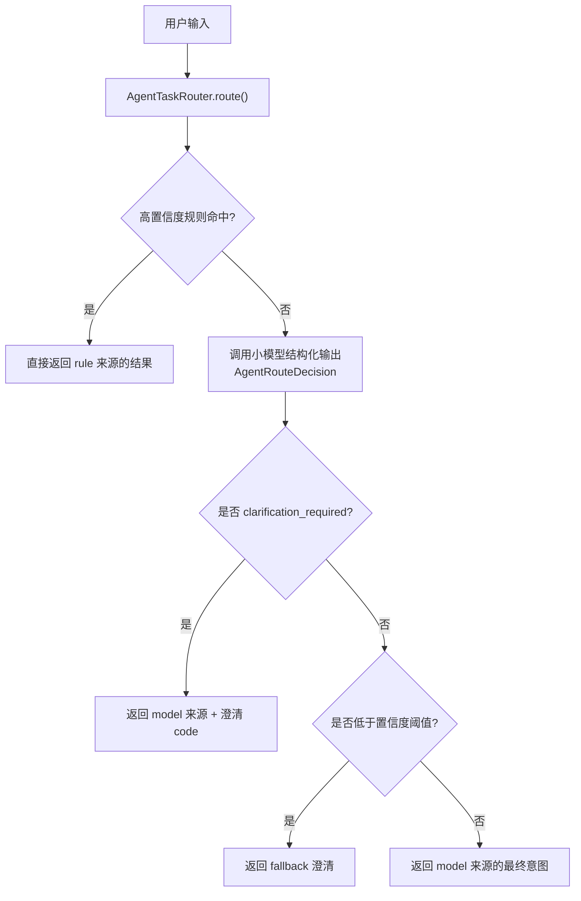
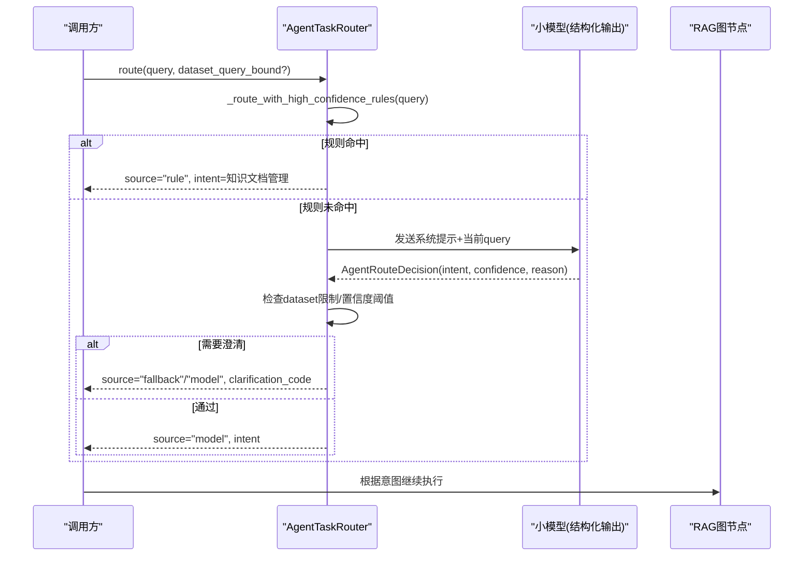
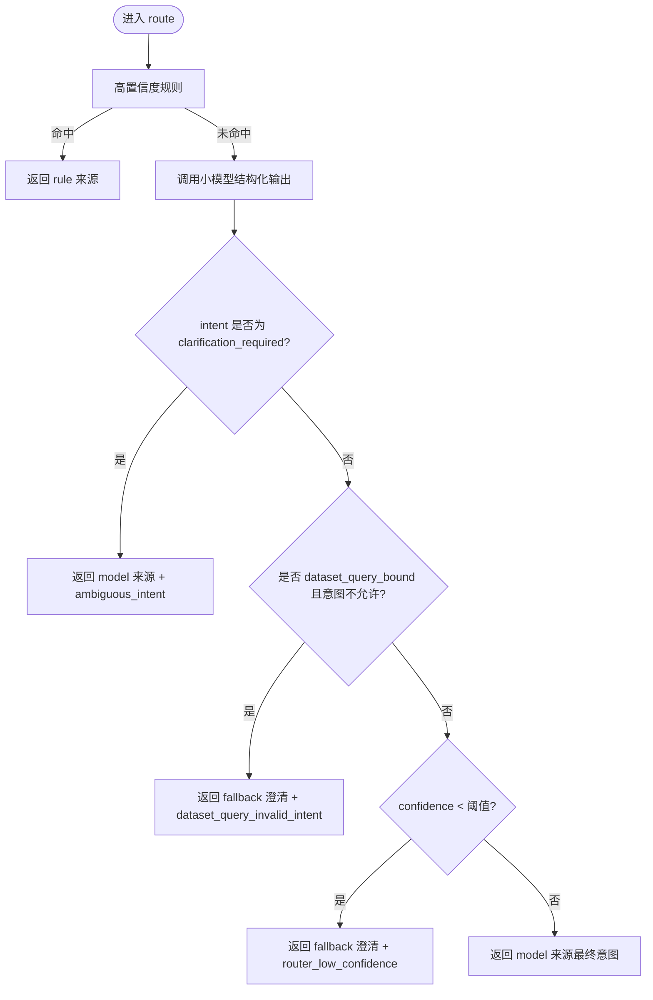
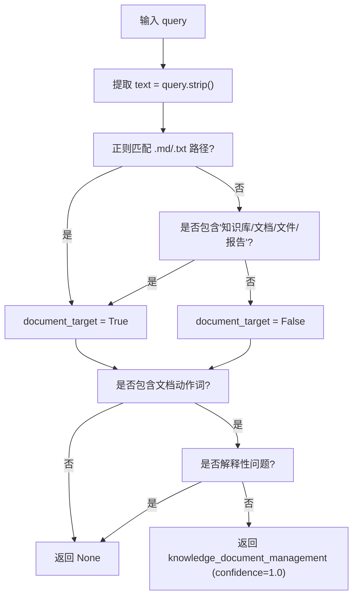
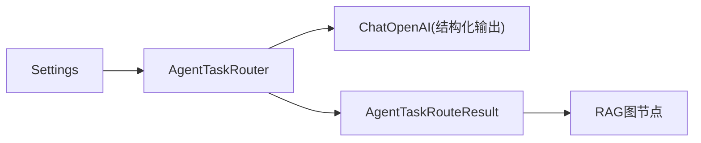

# 意图识别引擎

<cite>
**本文引用的文件**
- [agent_task_router.py](file://python-agent-study/src/fast_app/services/agent_tasks/agent_task_router.py)
- [config.py](file://python-agent-study/src/fast_app/core/config.py)
- [rag_agent_nodes.py](file://python-agent-study/src/fast_app/graph/rag_agent/rag_agent_nodes.py)
- [test_agent_task_router.py](file://python-agent-study/scripts/tests/agent_research/test_agent_task_router.py)
</cite>

## 目录
1. [简介](#简介)
2. [项目结构](#项目结构)
3. [核心组件](#核心组件)
4. [架构总览](#架构总览)
5. [详细组件分析](#详细组件分析)
6. [依赖关系分析](#依赖关系分析)
7. [性能考量](#性能考量)
8. [故障排查指南](#故障排查指南)
9. [结论](#结论)
10. [附录：配置、调用与结果处理示例](#附录配置调用与结果处理示例)

## 简介
本文件面向“意图识别引擎”，聚焦 AgentTaskRouter 如何基于结构化规则与小模型语义判断，将用户请求路由到以下意图之一：simple_rag、question_decomposition、knowledge_document_management、web_research、structured_data_query、clarification_required。文档重点解释高置信度规则（_route_with_high_confidence_rules）的判定逻辑、关键词匹配与语义理解机制、澄清兜底策略，并提供可操作的配置、扩展与优化建议。

## 项目结构
意图识别引擎位于服务层，作为 RAG Agent 图节点的前置决策器：
- 服务实现：AgentTaskRouter、AgentRouteDecision、AgentTaskRouteResult、高置信度规则函数
- 配置：独立 Router 连接参数与阈值
- 集成点：RAG Agent 图节点在路由后根据意图执行不同分支；当需要澄清时返回稳定 code 给上层

图表来源
- [agent_task_router.py:184-308](file://python-agent-study/src/fast_app/services/agent_tasks/agent_task_router.py#L184-L308)
- [rag_agent_nodes.py:469-498](file://python-agent-study/src/fast_app/graph/rag_agent/rag_agent_nodes.py#L469-L498)

章节来源
- [agent_task_router.py:184-308](file://python-agent-study/src/fast_app/services/agent_tasks/agent_task_router.py#L184-L308)
- [rag_agent_nodes.py:469-498](file://python-agent-study/src/fast_app/graph/rag_agent/rag_agent_nodes.py#L469-L498)

## 核心组件
- AgentTaskRouter：入口类，封装“规则优先 + 模型兜底”的路由流程，负责计时、异常安全收口、置信度阈值校验、数据集绑定场景限制等。
- AgentRouteDecision：Pydantic 模型，严格约束 Router 唯一允许输出的字段与取值，防止模型越权输出或注入额外字段。
- AgentTaskRouteResult：统一结果载体，包含 decision、source（rule/model/fallback）、latency_ms、clarification_code。
- 高置信度规则函数：仅在当前 query 上做轻量关键词/模式匹配，快速短路明确意图，避免不必要的模型调用。
- 系统提示词与上下文提示词：限定意图范围、边界条件与示例，确保模型只分类不生成计划或工具参数。

章节来源
- [agent_task_router.py:21-44](file://python-agent-study/src/fast_app/services/agent_tasks/agent_task_router.py#L21-L44)
- [agent_task_router.py:117-175](file://python-agent-study/src/fast_app/services/agent_tasks/agent_task_router.py#L117-L175)
- [agent_task_router.py:178-308](file://python-agent-study/src/fast_app/services/agent_tasks/agent_task_router.py#L178-L308)
- [agent_task_router.py:311-370](file://python-agent-study/src/fast_app/services/agent_tasks/agent_task_router.py#L311-L370)

## 架构总览
意图识别采用“两层漏斗”：
- 第一层：确定性规则（低成本、高可预测性），当前仅覆盖明确的文档操作意图。
- 第二层：小模型结构化输出（语义理解），受系统提示词与 Pydantic schema 双重约束。
- 第三层：安全兜底（澄清），用于模型不可用、置信度不足、非法意图等场景。

图表来源
- [agent_task_router.py:184-308](file://python-agent-study/src/fast_app/services/agent_tasks/agent_task_router.py#L184-L308)
- [rag_agent_nodes.py:469-498](file://python-agent-study/src/fast_app/graph/rag_agent/rag_agent_nodes.py#L469-L498)

## 详细组件分析

### AgentTaskRouter 路由流程
- 先尝试高置信度规则（仅在非 Dataset 绑定场景启用），命中则立即返回 rule 来源结果。
- 否则构造 LangChain 消息并调用小模型结构化输出，强制按 AgentRouteDecision schema 返回。
- 对模型返回做三层校验：
  - 若 intent 为 clarification_required，视为正常路由结果，标记 ambiguous_intent。
  - 若处于 dataset_query_bound 且意图不在允许集合，转为澄清并标记 dataset_query_invalid_intent。
  - 若 confidence 低于配置阈值，转为澄清并标记 router_low_confidence。
- 异常捕获：任何模型调用异常均回退到澄清，标记 router_unavailable。

图表来源
- [agent_task_router.py:184-308](file://python-agent-study/src/fast_app/services/agent_tasks/agent_task_router.py#L184-L308)

章节来源
- [agent_task_router.py:184-308](file://python-agent-study/src/fast_app/services/agent_tasks/agent_task_router.py#L184-L308)

### 高置信度规则：_route_with_high_confidence_rules
该函数是第一层“快路径”，仅检查当前 query，不拼接历史，避免旧对话意图污染新任务。

- 文档目标识别：
  - 正则匹配 .md/.txt 文件路径片段
  - 或文本中出现“知识库”“文档”“文件”“报告”等强信号词
- 文档动作识别：
  - 出现“创建/新增/新建/修改/更新/改写/替换/删除/移除/下线/保存/写入”等动作词
- 解释性问题检测：
  - 出现“是什么/为什么/如何实现/原理/解释/介绍”等解释型词
  - 若是解释性问题，即使存在文档目标也不短路，交由语义 Router 判断
- 决策：
  - 同时满足“文档目标 + 文档动作 + 非解释性问题” -> 返回 knowledge_document_management，confidence=1.0
  - 其他情况返回 None，进入模型路由
- 设计要点：
  - Web 的简单/复杂边界不在此处判断，避免误把复杂比较降为 direct web
  - 普通缓存/系统对象操作（如 Redis、Docker）不被误判为文档管理

图表来源
- [agent_task_router.py:331-370](file://python-agent-study/src/fast_app/services/agent_tasks/agent_task_router.py#L331-L370)

章节来源
- [agent_task_router.py:331-370](file://python-agent-study/src/fast_app/services/agent_tasks/agent_task_router.py#L331-L370)

### 语义理解机制与 Prompt 约束
- 系统提示词限定了意图清单、边界条件与示例，强调：
  - simple_rag：单一事实或知识库检索即可回答
  - question_decomposition：多步骤、多来源、比较/归纳
  - knowledge_document_management：仅限知识库文档/报告或 .md/.txt 文件的增删改存
  - web_research：只需一次公开网络检索
  - structured_data_query：已绑定 Dataset 的一次查询/聚合
  - clarification_required：无法安全判断时追问
- 当 dataset_query_bound=True 时，追加上下文提示词，限制可选意图集合，禁止选择 knowledge_document_management 与 web_research。
- 结构化输出：使用 with_structured_output 与 Pydantic schema 双重约束，拒绝多余字段与非法意图。

章节来源
- [agent_task_router.py:53-114](file://python-agent-study/src/fast_app/services/agent_tasks/agent_task_router.py#L53-L114)
- [agent_task_router.py:311-328](file://python-agent-study/src/fast_app/services/agent_tasks/agent_task_router.py#L311-L328)

### 数据模型与校验
- AgentRouteIntent：受限枚举，新增业务意图需同步扩展 schema 与测试。
- AgentRouteDecision：
  - extra="forbid" 禁止额外字段
  - str_strip_whitespace 清理空白
  - clarification_question 仅在 clarification_required 时必填，其他意图必须为空
- AgentTaskRouteResult：统一携带 decision/source/latency_ms/clarification_code，便于前端与 trace 消费。

章节来源
- [agent_task_router.py:21-44](file://python-agent-study/src/fast_app/services/agent_tasks/agent_task_router.py#L21-L44)
- [agent_task_router.py:117-175](file://python-agent-study/src/fast_app/services/agent_tasks/agent_task_router.py#L117-L175)

### 与 RAG 图的集成
- 图节点读取 route_result.decision.intent/confidence/source/latency_ms/route_model/route_rule_matched 等字段。
- 当 intent 为 clarification_required 时，返回 clarification_code 与澄清问题，停止后续执行。
- 其他意图按下游节点能力与权限决定下一步（例如是否需要 Planner、是否允许 Web）。

章节来源
- [rag_agent_nodes.py:469-498](file://python-agent-study/src/fast_app/graph/rag_agent/rag_agent_nodes.py#L469-L498)

## 依赖关系分析
- 配置依赖：Settings 提供 Router 连接与阈值等参数，并在启动阶段校验缺失项与非法值。
- 外部依赖：LangChain ChatOpenAI 用于结构化输出；超时与重试由 Settings 控制。
- 内部依赖：RAG 图节点消费路由结果；测试用例验证行为与边界。

图表来源
- [config.py:252-285](file://python-agent-study/src/fast_app/core/config.py#L252-L285)
- [config.py:976-996](file://python-agent-study/src/fast_app/core/config.py#L976-L996)
- [agent_task_router.py:184-308](file://python-agent-study/src/fast_app/services/agent_tasks/agent_task_router.py#L184-L308)

章节来源
- [config.py:252-285](file://python-agent-study/src/fast_app/core/config.py#L252-L285)
- [config.py:976-996](file://python-agent-study/src/fast_app/core/config.py#L976-L996)

## 性能考量
- 规则优先：高置信度规则零模型调用，显著降低延迟与成本。
- 小模型专用：Router 使用独立模型与低温度，减少发散与耗时。
- 超时保护：外层 asyncio.wait_for 保证在配置超时内结束。
- 结构化输出：避免自由文本解析开销，提升稳定性。
- 可观测性：返回 latency_ms、source、route_model 等字段，便于追踪瓶颈。

[本节为通用指导，无需特定文件引用]

## 故障排查指南
- 模型不可用：记录 router_unavailable，统一走澄清路径，避免误执行。
- 置信度过低：低于 agent_router_confidence_threshold 时转澄清，防止错误执行。
- 非法意图：Dataset 绑定场景下，若模型返回不允许的意图，转澄清并标记 dataset_query_invalid_intent。
- 配置校验失败：启动时校验缺失键与非法值，提前暴露问题。
- 调试建议：
  - 观察 route_source、route_confidence、route_latency_ms、clarification_code
  - 调整置信度阈值与模型参数以平衡召回与准确率
  - 针对高频误判，补充高置信度规则或优化 Prompt 示例

章节来源
- [agent_task_router.py:249-302](file://python-agent-study/src/fast_app/services/agent_tasks/agent_task_router.py#L249-L302)
- [config.py:976-996](file://python-agent-study/src/fast_app/core/config.py#L976-L996)

## 结论
AgentTaskRouter 通过“规则优先 + 小模型结构化输出 + 安全兜底”的分层设计，在保证准确性的同时兼顾性能与可维护性。高置信度规则快速拦截明确文档操作意图；语义 Router 在严格 schema 与 Prompt 约束下进行意图分类；所有不确定与异常都收敛到澄清路径，确保系统稳健。配合可调阈值与可观测字段，可在生产环境中持续优化准确率与延迟。

[本节为总结，无需特定文件引用]

## 附录：配置、调用与结果处理示例

### 路由规则配置示例
- 环境变量/配置项（来自 Settings）：
  - AGENT_ROUTER_API_KEY、AGENT_ROUTER_BASE_URL、AGENT_ROUTER_MODEL_NAME
  - AGENT_ROUTER_TEMPERATURE、AGENT_ROUTER_TIMEOUT_SECONDS、AGENT_ROUTER_MAX_RETRIES
  - AGENT_ROUTER_CONFIDENCE_THRESHOLD、AGENT_ROUTER_STRUCTURED_OUTPUT_METHOD
- 启动校验：validate_agent_router_config 会拒绝缺失或非法配置。

章节来源
- [config.py:252-285](file://python-agent-study/src/fast_app/core/config.py#L252-L285)
- [config.py:976-996](file://python-agent-study/src/fast_app/core/config.py#L976-L996)
- [test_agent_task_router.py:139-177](file://python-agent-study/scripts/tests/agent_research/test_agent_task_router.py#L139-L177)

### 调用与结果处理示例
- 基本调用：
  - 实例化 AgentTaskRouter(settings)
  - 调用 route(query, dataset_query_bound=False/True)
- 结果处理：
  - 读取 decision.intent/confidence/reason
  - 读取 source（rule/model/fallback）与 latency_ms
  - 若 clarification_required，读取 clarification_code 与澄清问题
- 典型断言（来自测试）：
  - 高置信度规则命中文档操作 -> knowledge_document_management
  - 模型返回 web_research/question_decomposition/simple_rag -> 对应意图
  - 低置信度 -> clarification_required，code=router_low_confidence
  - 模型不可用 -> clarification_required，code=router_unavailable
  - Dataset 绑定下非法意图 -> clarification_required，code=dataset_query_invalid_intent

章节来源
- [test_agent_task_router.py:210-302](file://python-agent-study/scripts/tests/agent_research/test_agent_task_router.py#L210-L302)
- [rag_agent_nodes.py:469-498](file://python-agent-study/src/fast_app/graph/rag_agent/rag_agent_nodes.py#L469-L498)

### 自定义意图识别器的扩展方法
- 新增意图需同步扩展：
  - AgentRouteIntent 字面量
  - 系统提示词中的意图说明与示例
  - 相关测试用例
- 若新增规则属于“明确语义”的高置信度场景，可在 _route_with_high_confidence_rules 中增加快速分支；否则交由语义 Router 判断。
- 注意：新增意图不得破坏现有边界（例如 Dataset 绑定场景的限制）。

章节来源
- [agent_task_router.py:21-44](file://python-agent-study/src/fast_app/services/agent_tasks/agent_task_router.py#L21-L44)
- [agent_task_router.py:53-114](file://python-agent-study/src/fast_app/services/agent_tasks/agent_task_router.py#L53-L114)

### 意图准确率优化策略
- 调优 Prompt：
  - 补充更多边界示例，尤其是易混淆场景（如“联网比较”应归为 question_decomposition）
  - 强化 Dataset 绑定场景的意图限制
- 调整阈值：
  - 提高 agent_router_confidence_threshold 可降低误判但可能增加澄清率
  - 结合线上指标（澄清率、误判率、延迟）动态调参
- 增强规则：
  - 针对高频误判场景，在高置信度规则中增加更精确的关键词/模式匹配
  - 保持规则“窄而稳”，复杂语义仍交给模型
- 监控与回归：
  - 利用 route_source、route_latency_ms、clarification_code 建立看板
  - 通过测试用例覆盖边界与回归场景

章节来源
- [agent_task_router.py:53-114](file://python-agent-study/src/fast_app/services/agent_tasks/agent_task_router.py#L53-L114)
- [agent_task_router.py:292-302](file://python-agent-study/src/fast_app/services/agent_tasks/agent_task_router.py#L292-L302)
- [test_agent_task_router.py:210-302](file://python-agent-study/scripts/tests/agent_research/test_agent_task_router.py#L210-L302)