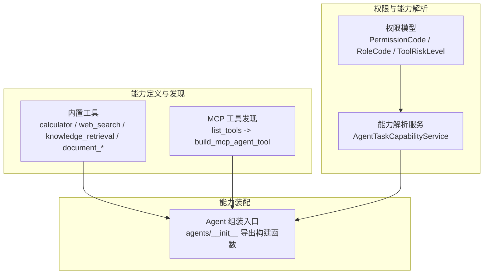
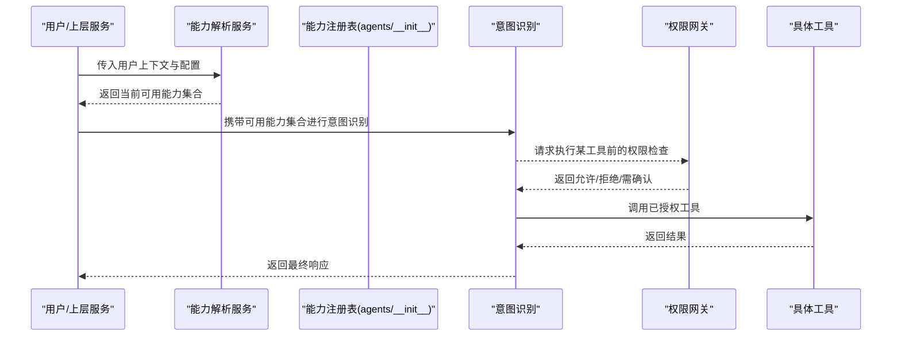
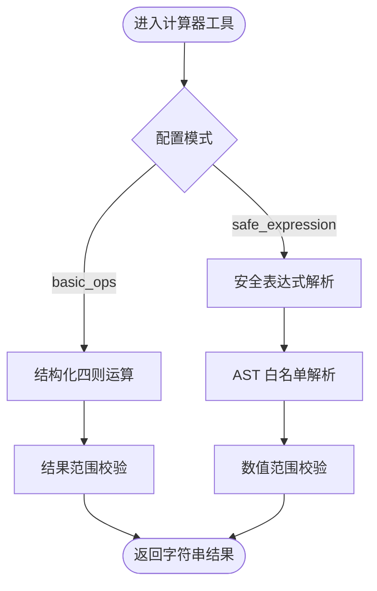
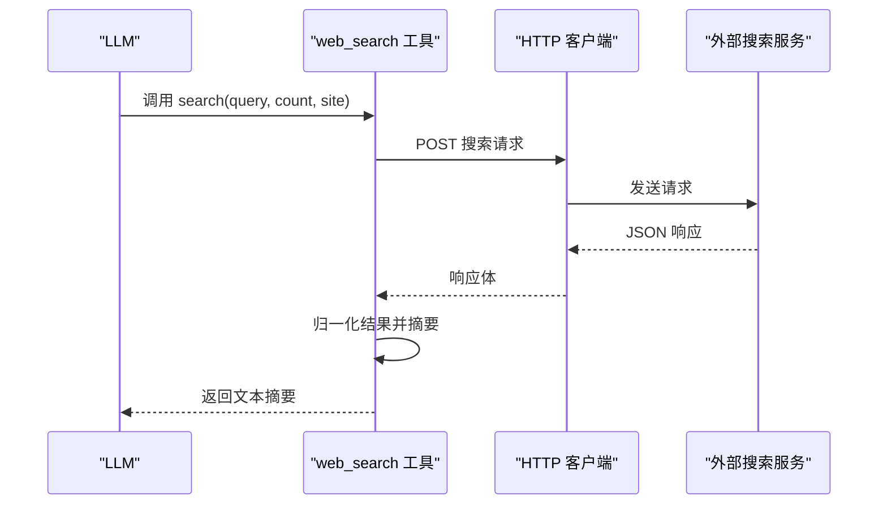
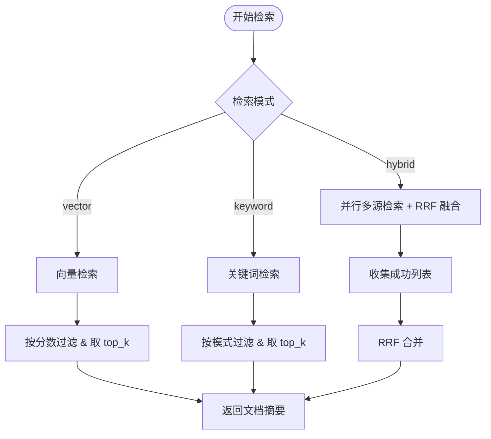
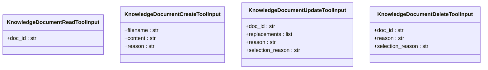
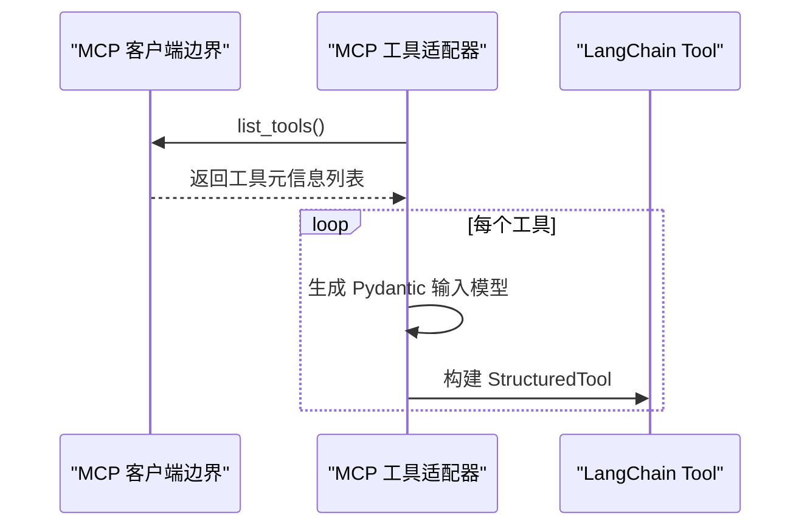
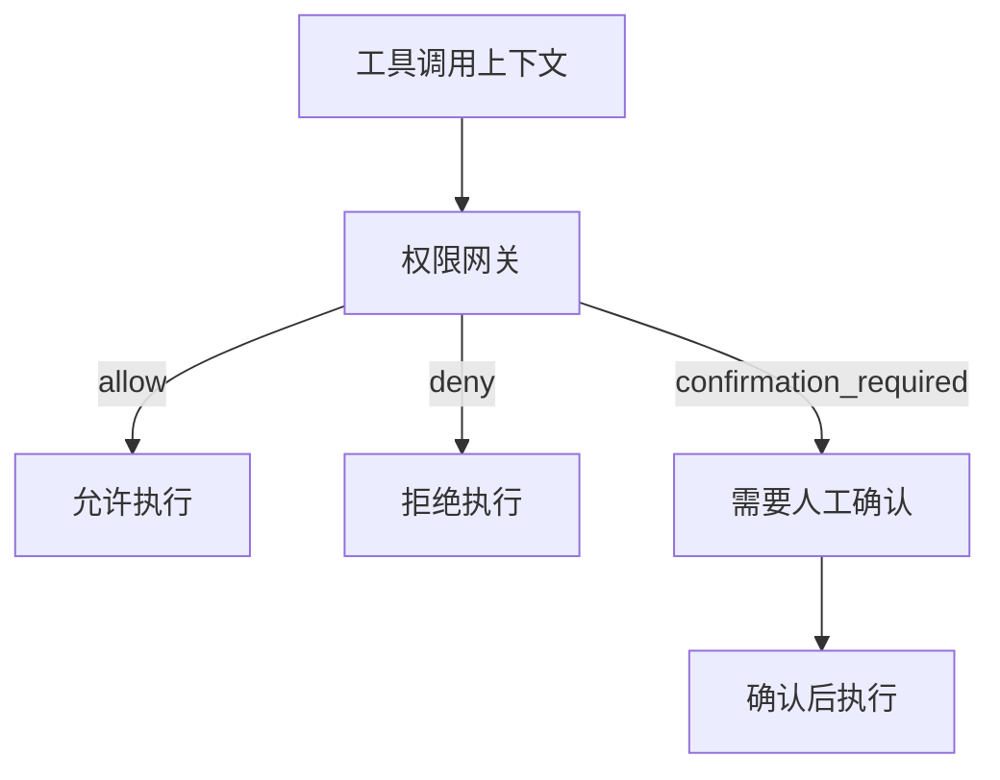
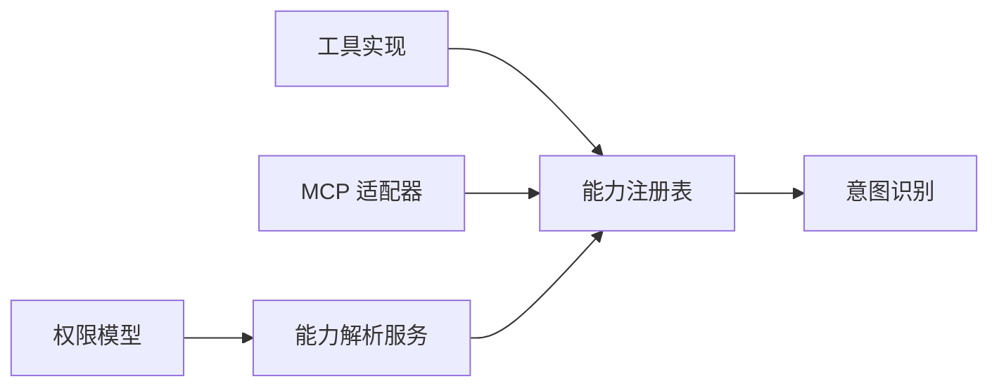

# 能力管理服务

<cite>
**本文引用的文件**
- [src/fast_app/agents/__init__.py](file://src/fast_app/agents/__init__.py)
- [src/fast_app/agents/tools/calculator_tools.py](file://src/fast_app/agents/tools/calculator_tools.py)
- [src/fast_app/agents/tools/web_search_tools.py](file://src/fast_app/agents/tools/web_search_tools.py)
- [src/fast_app/agents/tools/rag_agent_tools.py](file://src/fast_app/agents/tools/rag_agent_tools.py)
- [src/fast_app/agents/tools/document_management_tools.py](file://src/fast_app/agents/tools/document_management_tools.py)
- [src/fast_app/agents/mcp/mcp_agent_tools.py](file://src/fast_app/agents/mcp/mcp_agent_tools.py)
- [src/fast_app/domain/agent_tool_permissions.py](file://src/fast_app/domain/agent_tool_permissions.py)
- [src/fast_app/services/agent_tasks/agent_task_capability_service.py](file://src/fast_app/services/agent_tasks/agent_task_capability_service.py)
- [src/fast_app/core/config.py](file://src/fast_app/core/config.py)
</cite>

## 目录
1. [简介](#简介)
2. [项目结构](#项目结构)
3. [核心组件](#核心组件)
4. [架构总览](#架构总览)
5. [详细组件分析](#详细组件分析)
6. [依赖关系分析](#依赖关系分析)
7. [性能与运行时特性](#性能与运行时特性)
8. [故障排查指南](#故障排查指南)
9. [结论](#结论)
10. [附录：示例流程与最佳实践](#附录示例流程与最佳实践)

## 简介
本文件面向“能力管理服务”的完整设计与实现，聚焦以下目标：
- 动态发现并注册可用的 Agent 能力（工具），包括内置工具、MCP 外部工具、知识库检索工具等。
- 明确能力验证流程与运行时能力检查机制，确保在意图识别阶段仅暴露当前用户上下文允许的能力集合。
- 说明能力的生命周期管理、依赖关系处理与冲突解决策略。
- 提供自定义能力注册方法、权限控制与版本管理思路。
- 解释能力管理与意图识别的协作关系，以及如何根据用户上下文动态调整可用能力集合。

## 项目结构
能力管理相关代码主要分布在 agents 层与 domain/service 层：
- agents/tools：内置能力（计算器、Web 搜索、知识库检索、文档读写）以 StructuredTool 形式暴露给 LLM。
- agents/mcp：通过 MCP 协议动态发现远端工具，并将其包装为 LangChain Tool。
- domain/agent_tool_permissions：定义权限码、角色、风险等级、工具调用上下文与裁决结果模型。
- services/agent_tasks/agent_task_capability_service：基于用户上下文、配置与授权服务解析“当前可用能力”。
- core/config：能力开关与执行策略（如计算器模式、工具执行策略）的配置校验。

图表来源
- [src/fast_app/agents/__init__.py:1-134](file://src/fast_app/agents/__init__.py#L1-L134)
- [src/fast_app/agents/mcp/mcp_agent_tools.py:239-257](file://src/fast_app/agents/mcp/mcp_agent_tools.py#L239-L257)
- [src/fast_app/domain/agent_tool_permissions.py:14-101](file://src/fast_app/domain/agent_tool_permissions.py#L14-L101)
- [src/fast_app/services/agent_tasks/agent_task_capability_service.py:21-42](file://src/fast_app/services/agent_tasks/agent_task_capability_service.py#L21-L42)

章节来源
- [src/fast_app/agents/__init__.py:1-134](file://src/fast_app/agents/__init__.py#L1-L134)
- [src/fast_app/core/config.py:1013-1064](file://src/fast_app/core/config.py#L1013-L1064)

## 核心组件
- 内置工具能力
  - 计算器：支持基础四则运算与安全表达式计算，受配置项约束。
  - Web 搜索：封装外部搜索 API，返回结构化结果摘要。
  - 知识库检索：向量/关键词/混合检索，支持过滤、评分阈值与慢操作日志。
  - 文档管理：读/创建/更新/删除的 dry-run 提案工具，参数严格校验。
- MCP 能力
  - 动态发现 MCP server 的工具元信息，转换为 LangChain StructuredTool。
  - 名称规范化与前缀隔离，避免与本地工具名冲突。
- 权限与能力解析
  - 使用 PermissionCode/RoleCode 表达全局与部门级权限。
  - 基于用户上下文与配置，决定当前会话可暴露的能力集合。
- 配置与策略
  - 计算器模式、工具执行策略（确认优先/风险优先/仅干跑）等由 Settings 统一管控。

章节来源
- [src/fast_app/agents/tools/calculator_tools.py:11-182](file://src/fast_app/agents/tools/calculator_tools.py#L11-L182)
- [src/fast_app/agents/tools/web_search_tools.py:14-232](file://src/fast_app/agents/tools/web_search_tools.py#L14-L232)
- [src/fast_app/agents/tools/rag_agent_tools.py:34-546](file://src/fast_app/agents/tools/rag_agent_tools.py#L34-L546)
- [src/fast_app/agents/tools/document_management_tools.py:22-267](file://src/fast_app/agents/tools/document_management_tools.py#L22-L267)
- [src/fast_app/agents/mcp/mcp_agent_tools.py:23-257](file://src/fast_app/agents/mcp/mcp_agent_tools.py#L23-L257)
- [src/fast_app/domain/agent_tool_permissions.py:14-293](file://src/fast_app/domain/agent_tool_permissions.py#L14-L293)
- [src/fast_app/services/agent_tasks/agent_task_capability_service.py:21-42](file://src/fast_app/services/agent_tasks/agent_task_capability_service.py#L21-L42)
- [src/fast_app/core/config.py:1013-1064](file://src/fast_app/core/config.py#L1013-L1064)

## 架构总览
能力管理贯穿“发现—装配—校验—调用”四个阶段：
- 发现：从内置模块与 MCP 服务获取可用工具元信息。
- 装配：将工具元信息包装为 LangChain StructuredTool，并通过 agents/__init__ 统一导出。
- 校验：结合用户上下文、权限与配置，生成“当前可用能力集合”。
- 调用：意图识别阶段选择合适能力；执行前进行权限与风险策略检查。

图表来源
- [src/fast_app/agents/__init__.py:1-134](file://src/fast_app/agents/__init__.py#L1-L134)
- [src/fast_app/services/agent_tasks/agent_task_capability_service.py:21-42](file://src/fast_app/services/agent_tasks/agent_task_capability_service.py#L21-L42)
- [src/fast_app/domain/agent_tool_permissions.py:206-293](file://src/fast_app/domain/agent_tool_permissions.py#L206-L293)

## 详细组件分析

### 内置工具能力：计算器
- 能力定义
  - 基础四则运算：结构化输入，限制操作类型与范围。
  - 安全表达式：AST 白名单解析，禁止危险语法与越界数值。
- 能力注册
  - 通过 build_calculator_tool 按配置模式构造唯一对外工具。
- 运行时检查
  - 读取 Settings 中的计算器模式与数值上限，超出即拒绝。
- 依赖与冲突
  - 无外部依赖；名称固定为 calculator，避免重复注册。

图表来源
- [src/fast_app/agents/tools/calculator_tools.py:128-182](file://src/fast_app/agents/tools/calculator_tools.py#L128-L182)
- [src/fast_app/core/config.py:1013-1064](file://src/fast_app/core/config.py#L1013-L1064)

章节来源
- [src/fast_app/agents/tools/calculator_tools.py:11-182](file://src/fast_app/agents/tools/calculator_tools.py#L11-L182)
- [src/fast_app/core/config.py:1013-1064](file://src/fast_app/core/config.py#L1013-L1064)

### 内置工具能力：Web 搜索
- 能力定义
  - 封装外部搜索 API，归一化为内部模型，输出可读摘要。
- 能力注册
  - build_web_search_tool 返回 StructuredTool，名称固定为 web_search。
- 运行时检查
  - 校验 API Key、超时与响应格式；异常统一转为外部服务错误。
- 依赖与冲突
  - 依赖 httpx 客户端；名称稳定，避免与其他工具冲突。

图表来源
- [src/fast_app/agents/tools/web_search_tools.py:146-232](file://src/fast_app/agents/tools/web_search_tools.py#L146-L232)

章节来源
- [src/fast_app/agents/tools/web_search_tools.py:14-232](file://src/fast_app/agents/tools/web_search_tools.py#L14-L232)

### 内置工具能力：知识库检索
- 能力定义
  - 支持 vector/keyword/hybrid 三种检索模式，含过滤、评分阈值与合并策略。
- 能力注册
  - build_knowledge_retrieval_tool 返回 StructuredTool，名称固定为 knowledge_retrieval。
- 运行时检查
  - 记录慢检索、失败快照；空结果抛出无搜索结果异常。
- 依赖与冲突
  - 依赖向量与关键词检索器；名称稳定，避免冲突。

图表来源
- [src/fast_app/agents/tools/rag_agent_tools.py:94-546](file://src/fast_app/agents/tools/rag_agent_tools.py#L94-L546)

章节来源
- [src/fast_app/agents/tools/rag_agent_tools.py:34-546](file://src/fast_app/agents/tools/rag_agent_tools.py#L34-L546)

### 内置工具能力：文档管理（dry-run）
- 能力定义
  - 读/创建/更新/删除均以 dry-run 提案形式提交，不直接写库。
- 能力注册
  - build_knowledge_document_read_tool 与 build_knowledge_document_management_tools 分别返回单个或一组 StructuredTool。
- 运行时检查
  - 严格参数校验（文件名后缀、长度、必填字段）；高风险操作要求理由与选择原因。
- 依赖与冲突
  - 名称固定且带领域前缀，避免冲突。

图表来源
- [src/fast_app/agents/tools/document_management_tools.py:30-149](file://src/fast_app/agents/tools/document_management_tools.py#L30-L149)

章节来源
- [src/fast_app/agents/tools/document_management_tools.py:22-267](file://src/fast_app/agents/tools/document_management_tools.py#L22-L267)

### MCP 能力：动态发现与注册
- 能力发现
  - 通过 McpClientBoundary.list_tools() 获取工具元信息。
- 能力注册
  - 将 MCP 工具的 input_schema 转换为 Pydantic 模型，再包装为 StructuredTool。
  - 名称规范化并添加 mcp__ 前缀，避免与本地工具冲突。
- 运行时检查
  - 调用时转换参数为 McpToolCallRequest；错误提升为外部服务异常。
- 依赖与冲突
  - 依赖 MCP 客户端边界；名称前缀隔离冲突。

图表来源
- [src/fast_app/agents/mcp/mcp_agent_tools.py:23-257](file://src/fast_app/agents/mcp/mcp_agent_tools.py#L23-L257)

章节来源
- [src/fast_app/agents/mcp/mcp_agent_tools.py:23-257](file://src/fast_app/agents/mcp/mcp_agent_tools.py#L23-L257)

### 能力解析与权限控制
- 能力解析
  - AgentTaskCapabilityService 根据用户上下文、配置与授权服务，解析非敏感能力（例如是否允许直连 Web）。
- 权限模型
  - 使用 PermissionCode/RoleCode 表达全局与部门级权限；工具风险等级决定是否需要人工确认。
- 决策流程
  - 工具调用前构造 AgentToolCallContext，交由权限网关评估，返回 allow/deny/confirmation_required/execute_allowed。
- 管理员策略
  - 管理员仍区分确认执行、等待确认与直接允许三种状态。

图表来源
- [src/fast_app/domain/agent_tool_permissions.py:206-293](file://src/fast_app/domain/agent_tool_permissions.py#L206-L293)
- [src/fast_app/services/agent_tasks/agent_task_capability_service.py:21-42](file://src/fast_app/services/agent_tasks/agent_task_capability_service.py#L21-L42)

章节来源
- [src/fast_app/domain/agent_tool_permissions.py:14-293](file://src/fast_app/domain/agent_tool_permissions.py#L14-L293)
- [src/fast_app/services/agent_tasks/agent_task_capability_service.py:21-42](file://src/fast_app/services/agent_tasks/agent_task_capability_service.py#L21-L42)

### 能力生命周期管理、依赖与冲突解决
- 生命周期
  - 启动期：加载配置，初始化能力解析服务与 MCP 客户端。
  - 运行期：按需发现 MCP 工具；按用户上下文过滤能力集合。
  - 销毁期：释放外部资源（如 HTTP 客户端、MCP 连接）。
- 依赖关系
  - 工具之间无强耦合；检索工具依赖 retriever 实现；MCP 工具依赖 MCP 客户端。
- 冲突解决
  - 名称空间隔离：本地工具与 MCP 工具使用前缀区分。
  - 注册表去重：同一名称只保留一个实例；MCP 工具名规范化后注册。
  - 权限前置：即使同名存在，未授权能力不会暴露给意图识别。

章节来源
- [src/fast_app/agents/__init__.py:1-134](file://src/fast_app/agents/__init__.py#L1-L134)
- [src/fast_app/agents/mcp/mcp_agent_tools.py:23-37](file://src/fast_app/agents/mcp/mcp_agent_tools.py#L23-L37)

### 自定义能力注册方法
- 步骤
  - 定义工具名称、描述与 Pydantic 输入模型。
  - 实现异步业务函数，返回字符串结果。
  - 使用 StructuredTool.from_function 包装为 BaseTool。
  - 在 agents/__init__ 中导出构建函数，供上层装配。
- 建议
  - 名称稳定且具领域前缀；描述清晰影响意图识别。
  - 参数严格校验，避免 LLM 注入非法字段。
  - 对高风险操作采用 dry-run 与人工确认。

章节来源
- [src/fast_app/agents/tools/document_management_tools.py:151-267](file://src/fast_app/agents/tools/document_management_tools.py#L151-L267)
- [src/fast_app/agents/__init__.py:1-134](file://src/fast_app/agents/__init__.py#L1-L134)

### 能力权限控制与版本管理
- 权限控制
  - 全局权限：计算器、Web 搜索、MCP、GitLab 管理等。
  - 部门权限：文档读/写/删/批注等。
  - 工具风险等级：low/medium/high/critical，驱动确认流程。
- 版本管理
  - 工具名称作为稳定标识；升级时保持名称不变，变更行为通过配置与权限策略控制。
  - MCP 工具名规范化，避免版本漂移导致的匹配失败。

章节来源
- [src/fast_app/domain/agent_tool_permissions.py:14-101](file://src/fast_app/domain/agent_tool_permissions.py#L14-L101)
- [src/fast_app/agents/mcp/mcp_agent_tools.py:23-37](file://src/fast_app/agents/mcp/mcp_agent_tools.py#L23-L37)

### 能力管理与意图识别的协作
- 协作方式
  - 能力解析服务先于意图识别，生成“当前可用能力集合”。
  - 意图识别仅在该集合内选择工具，减少无效调用与误判。
- 动态调整
  - 根据用户上下文（全局角色、部门作用域）、配置（工具执行策略）与授权服务，实时调整可用能力。
  - 高风险操作在进入执行前再次校验，必要时转入人工确认。

章节来源
- [src/fast_app/services/agent_tasks/agent_task_capability_service.py:21-42](file://src/fast_app/services/agent_tasks/agent_task_capability_service.py#L21-L42)
- [src/fast_app/domain/agent_tool_permissions.py:206-293](file://src/fast_app/domain/agent_tool_permissions.py#L206-L293)

## 依赖关系分析
- 组件耦合
  - agents/__init__ 聚合各工具构建函数，降低上层耦合。
  - MCP 适配器依赖客户端边界，屏蔽协议细节。
  - 权限模型独立于工具实现，便于复用与测试。
- 外部依赖
  - httpx 用于 Web 搜索；MCP 客户端用于外部工具调用；检索器接口用于知识库检索。
- 循环依赖
  - 未发现循环导入；工具与权限解耦，通过服务层组合。

图表来源
- [src/fast_app/agents/__init__.py:1-134](file://src/fast_app/agents/__init__.py#L1-L134)
- [src/fast_app/agents/mcp/mcp_agent_tools.py:239-257](file://src/fast_app/agents/mcp/mcp_agent_tools.py#L239-L257)
- [src/fast_app/domain/agent_tool_permissions.py:206-293](file://src/fast_app/domain/agent_tool_permissions.py#L206-L293)
- [src/fast_app/services/agent_tasks/agent_task_capability_service.py:21-42](file://src/fast_app/services/agent_tasks/agent_task_capability_service.py#L21-L42)

章节来源
- [src/fast_app/agents/__init__.py:1-134](file://src/fast_app/agents/__init__.py#L1-L134)
- [src/fast_app/agents/mcp/mcp_agent_tools.py:239-257](file://src/fast_app/agents/mcp/mcp_agent_tools.py#L239-L257)
- [src/fast_app/domain/agent_tool_permissions.py:206-293](file://src/fast_app/domain/agent_tool_permissions.py#L206-L293)
- [src/fast_app/services/agent_tasks/agent_task_capability_service.py:21-42](file://src/fast_app/services/agent_tasks/agent_task_capability_service.py#L21-L42)

## 性能与运行时特性
- 检索性能
  - 混合检索并行召回，RRF 融合；记录慢检索阈值与耗时。
  - 空结果快速失败，避免无效后续处理。
- 外部调用
  - Web 搜索与 MCP 调用设置超时与异常分类，提升鲁棒性。
- 日志与追踪
  - 关键事件埋点（开始/结束/失败），便于定位瓶颈与问题。

章节来源
- [src/fast_app/agents/tools/rag_agent_tools.py:114-487](file://src/fast_app/agents/tools/rag_agent_tools.py#L114-L487)
- [src/fast_app/agents/tools/web_search_tools.py:146-205](file://src/fast_app/agents/tools/web_search_tools.py#L146-L205)
- [src/fast_app/agents/mcp/mcp_agent_tools.py:196-229](file://src/fast_app/agents/mcp/mcp_agent_tools.py#L196-L229)

## 故障排查指南
- 常见问题
  - Web 搜索失败：检查 API Key、网络连通性与响应格式。
  - 检索无结果：调整 min_score、top_k 或检索模式；查看慢检索日志。
  - MCP 工具调用失败：确认 MCP 服务可达、工具名与参数匹配。
  - 权限拒绝：核对用户全局/部门角色与所需权限码；高风险操作是否进入确认流程。
- 定位方法
  - 关注事件日志（web_search.*、rag_retrieval.*、mcp.agent_tool.*）。
  - 检查能力解析服务返回的可用能力集合是否符合预期。
  - 审查权限网关裁决结果与缺失权限列表。

章节来源
- [src/fast_app/agents/tools/web_search_tools.py:146-205](file://src/fast_app/agents/tools/web_search_tools.py#L146-L205)
- [src/fast_app/agents/tools/rag_agent_tools.py:114-487](file://src/fast_app/agents/tools/rag_agent_tools.py#L114-L487)
- [src/fast_app/agents/mcp/mcp_agent_tools.py:196-229](file://src/fast_app/agents/mcp/mcp_agent_tools.py#L196-L229)
- [src/fast_app/domain/agent_tool_permissions.py:242-293](file://src/fast_app/domain/agent_tool_permissions.py#L242-L293)

## 结论
本能力管理服务通过“发现—装配—校验—调用”的闭环，实现了：
- 动态发现与注册 MCP 工具，增强系统扩展性。
- 严格的参数校验与权限控制，保障安全性与合规性。
- 基于用户上下文与配置的动态能力集合，提升意图识别准确率。
- 完善的日志与异常处理，便于运维与排障。
建议在生产环境中持续监控能力可用性、权限命中率与检索性能，逐步完善能力版本治理与审计机制。

## 附录：示例流程与最佳实践
- 定义能力
  - 参考文档管理工具的参数结构与构建函数，定义新工具的输入模型与描述。
- 注册能力
  - 使用 StructuredTool.from_function 包装异步函数，并在 agents/__init__ 中导出。
- 检查与调用
  - 在意图识别前调用能力解析服务，获取可用能力集合。
  - 调用工具前构造权限上下文，进行权限与风险策略检查。
- 最佳实践
  - 名称稳定、描述清晰；参数严格校验；高风险操作采用 dry-run 与确认流程。
  - 对外部调用设置超时与重试策略；记录关键事件以便追踪。

章节来源
- [src/fast_app/agents/tools/document_management_tools.py:151-267](file://src/fast_app/agents/tools/document_management_tools.py#L151-L267)
- [src/fast_app/agents/__init__.py:1-134](file://src/fast_app/agents/__init__.py#L1-L134)
- [src/fast_app/services/agent_tasks/agent_task_capability_service.py:21-42](file://src/fast_app/services/agent_tasks/agent_task_capability_service.py#L21-L42)
- [src/fast_app/domain/agent_tool_permissions.py:206-293](file://src/fast_app/domain/agent_tool_permissions.py#L206-L293)