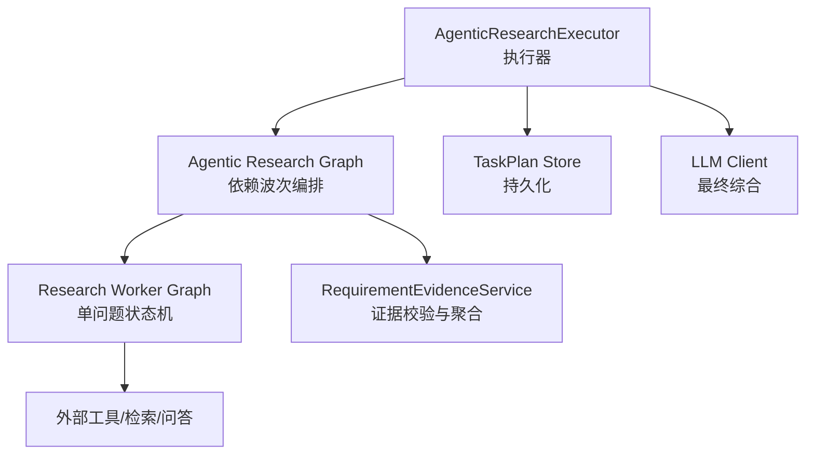
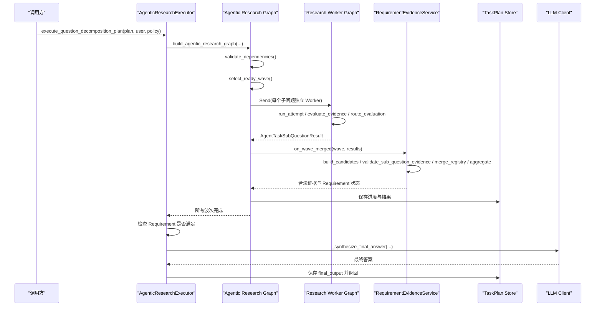
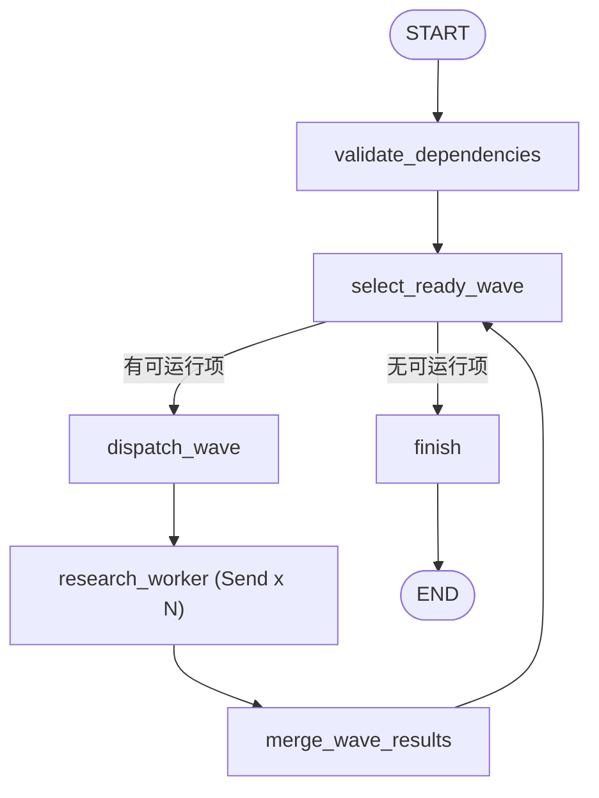
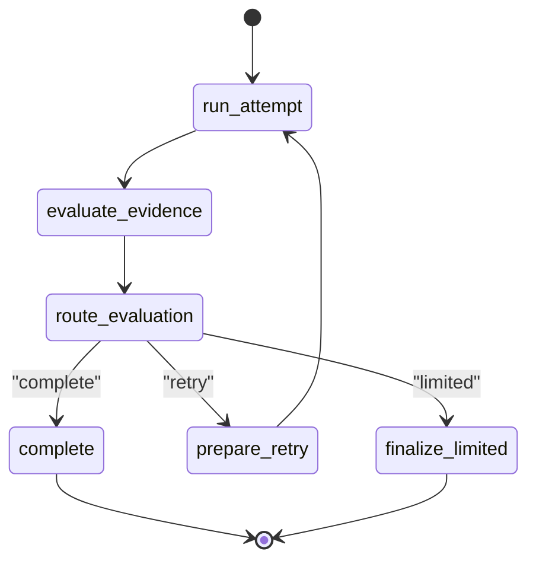
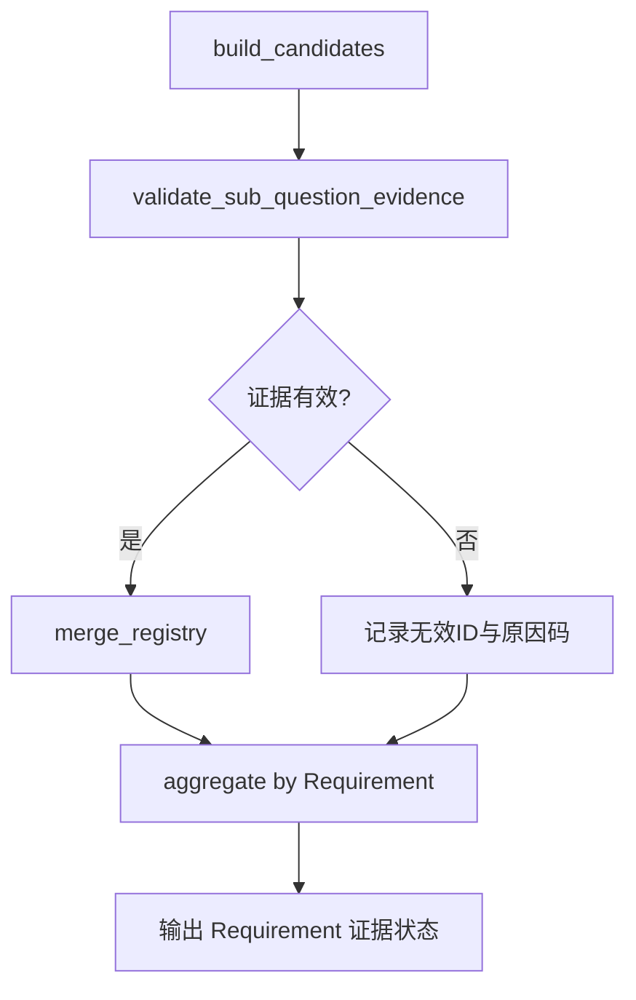
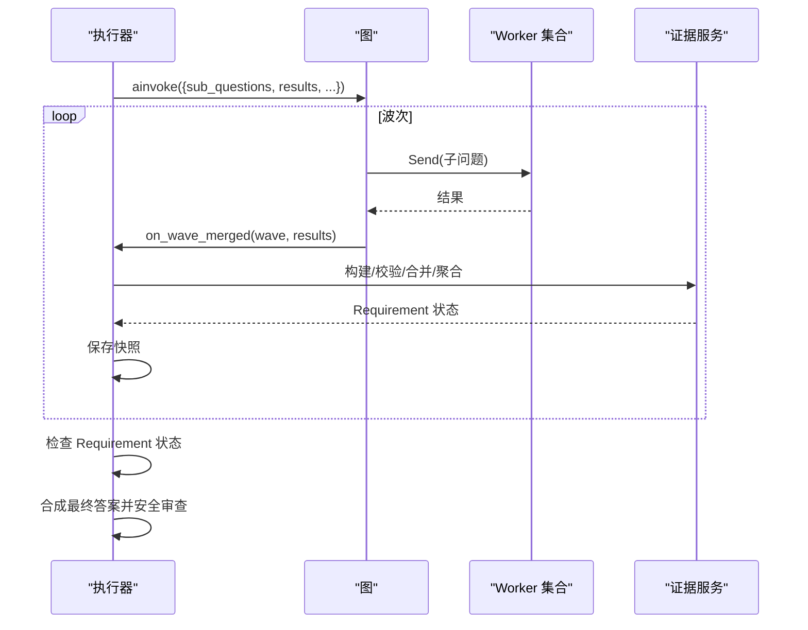
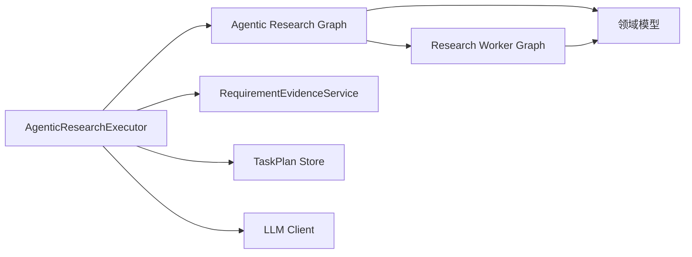

# 研究工作流

<cite>
**本文引用的文件**
- [agentic_research_graph.py](file://python-agent-study/src/fast_app/graph/research/agentic_research_graph.py)
- [research_worker_graph.py](file://python-agent-study/src/fast_app/graph/research/research_worker_graph.py)
- [requirement_evidence_service.py](file://python-agent-study/src/fast_app/services/research/requirement_evidence_service.py)
- [agentic_research_executor.py](file://python-agent-study/src/fast_app/services/research/agentic_research_executor.py)
- [research_task_plan.py](file://python-agent-study/src/fast_app/domain/research_task_plan.py)
</cite>

## 目录
1. [简介](#简介)
2. [项目结构](#项目结构)
3. [核心组件](#核心组件)
4. [架构总览](#架构总览)
5. [详细组件分析](#详细组件分析)
6. [依赖关系分析](#依赖关系分析)
7. [性能与并发特性](#性能与并发特性)
8. [故障排查指南](#故障排查指南)
9. [结论](#结论)
10. [附录：配置、自定义节点与质量评估](#附录：配置自定义节点与质量评估)

## 简介
本文件面向“研究工作流”系统，系统性说明 Agentic Research Graph 的设计与实现，包括研究任务的状态机、节点定义、条件路由逻辑；Research Worker Graph 的并行执行机制、证据收集策略与结果整合算法；以及需求证据服务（RequirementEvidenceService）如何验证研究结果的准确性与完整性。文档同时提供可操作的配置选项、自定义研究节点的实现方法，以及研究质量评估指标与示例流程，帮助读者快速理解并扩展该工作流。

## 项目结构
研究工作流由“编排层图”和“Worker 子图”组成，并通过执行器将两者组合为端到端的研究流水线：
- 编排层图：按依赖波次调度多个 Research Worker，负责状态推进、取消控制、结果合并与持久化。
- Worker 子图：单个子问题的显式状态机，驱动工具调用、证据评估、重试与完成。
- 执行器：装配回调、管理 TaskPlan 快照、聚合证据、生成最终答案。
- 领域模型：统一描述 SubQuestion、Requirement、Evidence、进度事件等数据结构。

**图表来源**
- [agentic_research_graph.py:111-276](file://python-agent-study/src/fast_app/graph/research/agentic_research_graph.py#L111-L276)
- [research_worker_graph.py:45-79](file://python-agent-study/src/fast_app/graph/research/research_worker_graph.py#L45-L79)
- [agentic_research_executor.py:86-519](file://python-agent-study/src/fast_app/services/research/agentic_research_executor.py#L86-L519)
- [requirement_evidence_service.py:41-284](file://python-agent-study/src/fast_app/services/research/requirement_evidence_service.py#L41-L284)

**章节来源**
- [agentic_research_graph.py:111-276](file://python-agent-study/src/fast_app/graph/research/agentic_research_graph.py#L111-L276)
- [research_worker_graph.py:45-79](file://python-agent-study/src/fast_app/graph/research/research_worker_graph.py#L45-L79)
- [agentic_research_executor.py:86-519](file://python-agent-study/src/fast_app/services/research/agentic_research_executor.py#L86-L519)
- [research_task_plan.py:142-213](file://python-agent-study/src/fast_app/domain/research_task_plan.py#L142-L213)

## 核心组件
- Agentic Research Graph：基于 LangGraph StateGraph 构建，维护 sub_questions、results、current_wave、batch_ids、max_parallel_workers 等状态，通过 validate_dependencies → select_ready_wave → dispatch_wave → research_worker → merge_wave_results → finish 的流程，实现依赖驱动的波次并行。
- Research Worker Graph：为单个子问题定义 run_attempt → evaluate_evidence → route_evaluation → prepare_retry → complete/finalize_limited 的显式状态机，支持重试与受限完成。
- RequirementEvidenceService：负责从 Worker 输出构造 Typed Evidence、校验证据归属与来源真实性、幂等合并 Registry，并按 Requirement 契约计算 satisfied/partially_satisfied/pending/failed。
- AgenticResearchExecutor：装配图与回调，管理 TaskPlan 快照、进度事件、Worker 超时处理、证据聚合、最终答案合成与安全审查。

**章节来源**
- [agentic_research_graph.py:34-54](file://python-agent-study/src/fast_app/graph/research/agentic_research_graph.py#L34-L54)
- [research_worker_graph.py:18-37](file://python-agent-study/src/fast_app/graph/research/research_worker_graph.py#L18-L37)
- [requirement_evidence_service.py:41-183](file://python-agent-study/src/fast_app/services/research/requirement_evidence_service.py#L41-L183)
- [agentic_research_executor.py:57-76](file://python-agent-study/src/fast_app/services/research/agentic_research_executor.py#L57-L76)

## 架构总览
下图展示从请求到最终输出的完整链路：执行器初始化图与回调，按波次派发 Worker，Worker 内部进行工具调用与证据评估，合并阶段由证据服务校验并聚合，最后合成最终答案并通过安全审查。

**图表来源**
- [agentic_research_executor.py:86-519](file://python-agent-study/src/fast_app/services/research/agentic_research_executor.py#L86-L519)
- [agentic_research_graph.py:111-276](file://python-agent-study/src/fast_app/graph/research/agentic_research_graph.py#L111-L276)
- [research_worker_graph.py:45-79](file://python-agent-study/src/fast_app/graph/research/research_worker_graph.py#L45-L79)
- [requirement_evidence_service.py:123-284](file://python-agent-study/src/fast_app/services/research/requirement_evidence_service.py#L123-L284)

## 详细组件分析

### Agentic Research Graph：依赖波次与并行派发
- 状态字段
  - sub_questions：待研究的正式子问题列表。
  - results：累积结果（使用 operator.add 合并）。
  - current_wave：当前波次编号。
  - batch_ids：本批派发的子问题 ID。
  - max_parallel_workers：限制外部工具并发数。
- 关键节点
  - validate_dependencies：拒绝重复、缺失或循环依赖。
  - select_ready_wave：根据已完成结果选择下一批可并行执行的子问题，支持失败依赖级联跳过。
  - dispatch_wave：对每批子问题使用 Send 扇出独立 Worker。
  - research_worker：执行单个子问题，返回结果并入全局 results。
  - merge_wave_results：收集本批结果，排序后交给 on_wave_merged 回调。
  - finish：无副作用终止。
- 条件路由
  - select_ready_wave 根据 should_stop 与依赖完成度决定进入 research_worker 或 finish。
  - dispatch_wave 根据 batch_ids 是否为空决定继续派发或结束。

**图表来源**
- [agentic_research_graph.py:124-276](file://python-agent-study/src/fast_app/graph/research/agentic_research_graph.py#L124-L276)

**章节来源**
- [agentic_research_graph.py:34-54](file://python-agent-study/src/fast_app/graph/research/agentic_research_graph.py#L34-L54)
- [agentic_research_graph.py:56-108](file://python-agent-study/src/fast_app/graph/research/agentic_research_graph.py#L56-L108)
- [agentic_research_graph.py:124-276](file://python-agent-study/src/fast_app/graph/research/agentic_research_graph.py#L124-L276)

### Research Worker Graph：单问题状态机与重试
- 状态字段
  - request、attempt、used_tool_calls、all_tool_calls、all_evidence、all_context_doc_groups、force_web、retry_missing_points、attempts、last_result、evaluation、evaluator_error、next_action、final_warning、final_result。
- 节点与边
  - run_attempt：执行一次研究尝试（工具调用、检索、回答）。
  - evaluate_evidence：评估证据充分性。
  - route_evaluation：根据评估结果路由到 complete、retry 或 limited。
  - prepare_retry：准备重试所需上下文。
  - complete/finalize_limited：完成或受限完成。
- 条件路由
  - choose_route 返回 "complete"/"retry"/"limited"，驱动不同分支。

**图表来源**
- [research_worker_graph.py:45-79](file://python-agent-study/src/fast_app/graph/research/research_worker_graph.py#L45-L79)

**章节来源**
- [research_worker_graph.py:18-37](file://python-agent-study/src/fast_app/graph/research/research_worker_graph.py#L18-L37)
- [research_worker_graph.py:45-79](file://python-agent-study/src/fast_app/graph/research/research_worker_graph.py#L45-L79)

### 需求证据服务：准确性与完整性验证
- 候选证据构造：将 ToolLoop 摘要转换为稳定 Typed Evidence，映射 knowledge_chunk/web_citation/sql_query_result/derived_synthesis。
- 证据校验：验证证据归属（sub_question_id）、来源真实性（successful tool calls）、依赖完整性（derived_synthesis 的 depends_on 必须匹配且前置已完成）。
- 幂等合并：同 ID 不同内容视为损坏，抛出异常。
- 需求聚合：按 Requirement 的 source_policy 与 expected_evidence 计算 satisfied/partially_satisfied/pending/failed，并记录 missing_source_types 与 reason_codes。

**图表来源**
- [requirement_evidence_service.py:44-183](file://python-agent-study/src/fast_app/services/research/requirement_evidence_service.py#L44-L183)
- [requirement_evidence_service.py:185-284](file://python-agent-study/src/fast_app/services/research/requirement_evidence_service.py#L185-L284)

**章节来源**
- [requirement_evidence_service.py:22-39](file://python-agent-study/src/fast_app/services/research/requirement_evidence_service.py#L22-L39)
- [requirement_evidence_service.py:44-183](file://python-agent-study/src/fast_app/services/research/requirement_evidence_service.py#L44-L183)
- [requirement_evidence_service.py:185-284](file://python-agent-study/src/fast_app/services/research/requirement_evidence_service.py#L185-L284)

### 执行器：波次调度、证据聚合与最终综合
- 入口：execute_question_decomposition_plan，接收 plan、用户上下文、检索策略、过滤器等参数。
- 回调
  - on_wave_started：更新进度、标记 worker 状态为 running。
  - on_wave_merged：构造候选证据、校验、合并 Registry、转换结果、更新 Requirement 状态。
- 取消与超时：should_stop 同步检查取消；worker_runner 使用 wait_for 设置超时，超时后写入 WORKER_TIMEOUT 错误码并保留 checkpoint。
- 最终综合：仅允许使用满足或部分满足的 Requirement 对应的合法 Evidence，生成最终答案并通过 Prompt Guard 安全审查。

**图表来源**
- [agentic_research_executor.py:86-519](file://python-agent-study/src/fast_app/services/research/agentic_research_executor.py#L86-L519)
- [agentic_research_graph.py:111-276](file://python-agent-study/src/fast_app/graph/research/agentic_research_graph.py#L111-L276)
- [requirement_evidence_service.py:185-284](file://python-agent-study/src/fast_app/services/research/requirement_evidence_service.py#L185-L284)

**章节来源**
- [agentic_research_executor.py:86-519](file://python-agent-study/src/fast_app/services/research/agentic_research_executor.py#L86-L519)

## 依赖关系分析
- 模块耦合
  - AgenticResearchExecutor 依赖 Agentic Research Graph、RequirementEvidenceService、TaskPlanStore、LLM Client。
  - Agentic Research Graph 依赖领域模型（ResearchTaskSubQuestion、AgentTaskSubQuestionResult）与回调。
  - Research Worker Graph 依赖领域模型（AgentTaskToolCallTrace、ResearchEvidenceEvaluation）。
- 外部依赖
  - LangGraph StateGraph/Send 用于图构建与并行派发。
  - Pydantic 用于数据模型校验。
- 潜在循环
  - 图内存在 merge_wave_results → select_ready_wave 的循环，但通过 batch_ids 清空避免无限循环。
- 接口契约
  - worker_runner：接受子问题、依赖结果、波次，返回子问题结果。
  - on_wave_started/on_wave_merged：回调签名约定波次与批次/结果。
  - should_stop：布尔函数，用于取消传播。

**图表来源**
- [agentic_research_executor.py:57-76](file://python-agent-study/src/fast_app/services/research/agentic_research_executor.py#L57-L76)
- [agentic_research_graph.py:111-276](file://python-agent-study/src/fast_app/graph/research/agentic_research_graph.py#L111-L276)
- [research_worker_graph.py:45-79](file://python-agent-study/src/fast_app/graph/research/research_worker_graph.py#L45-L79)

**章节来源**
- [agentic_research_executor.py:57-76](file://python-agent-study/src/fast_app/services/research/agentic_research_executor.py#L57-L76)
- [agentic_research_graph.py:111-276](file://python-agent-study/src/fast_app/graph/research/agentic_research_graph.py#L111-L276)
- [research_worker_graph.py:45-79](file://python-agent-study/src/fast_app/graph/research/research_worker_graph.py#L45-L79)

## 性能与并发特性
- 依赖波次并行：同一波次的子问题通过 Send 并行派发，受 max_parallel_workers 限制。
- 结果合并幂等：operator.add 累加 results，merge_wave_results 按 batch_ids 过滤，确保不重复合并。
- 取消传播：在 select_ready_wave、research_worker、merge_wave 前均检查 should_stop，减少取消后的外部调用。
- 超时保护：worker_runner 使用 wait_for 设置超时，超时后记录 WORKER_TIMEOUT 并保留 checkpoint。
- 证据聚合高效：Registry 按 evidence_id 去重，聚合时仅考虑当前 Result 明确引用的 Evidence，避免历史残留影响。

[本节为通用性能讨论，不直接分析具体代码行]

## 故障排查指南
- 依赖校验失败
  - 现象：重复 sub_question_id、依赖不存在、循环依赖。
  - 定位：validate_dependencies 抛出 ValueError。
  - 处理：修正 SubQuestion 的 id、depends_on 与 order。
- 证据无效
  - 现象：EVIDENCE_SUB_QUESTION_MISMATCH、EVIDENCE_TOOL_PROVENANCE_INVALID、EVIDENCE_DEPENDENCY_INVALID。
  - 定位：validate_sub_question_evidence 返回 invalid_evidence_refs 与 reason_codes。
  - 处理：确保证据来自成功工具调用，derived_synthesis 的 dependency_sub_question_ids 与 SubQuestion.depends_on 一致且前置已完成。
- 需求未满足
  - 现象：Requirement 状态为 failed/pending。
  - 定位：aggregate 中依据 source_policy 与 expected_evidence 判定。
  - 处理：补充对应来源的证据或调整 completion_policy。
- 执行取消
  - 现象：ResearchExecutionCancelled。
  - 定位：should_stop 返回 True。
  - 处理：上层捕获并收口 TaskPlan 为取消状态。
- 超时
  - 现象：WORKER_TIMEOUT。
  - 定位：wait_for 超时触发。
  - 处理：检查外部工具耗时、网络状况，必要时增大超时或优化工具链。

**章节来源**
- [agentic_research_graph.py:56-108](file://python-agent-study/src/fast_app/graph/research/agentic_research_graph.py#L56-L108)
- [requirement_evidence_service.py:123-183](file://python-agent-study/src/fast_app/services/research/requirement_evidence_service.py#L123-L183)
- [agentic_research_executor.py:325-414](file://python-agent-study/src/fast_app/services/research/agentic_research_executor.py#L325-L414)

## 结论
该研究工作流以 LangGraph 为核心，将“依赖波次编排”与“单问题状态机”解耦，配合严格的证据校验与需求聚合，实现了高可靠、可观测、可扩展的研究执行体系。通过配置化策略与回调机制，可在不修改图结构的前提下定制工具链、评估器与持久化行为，满足不同业务场景的质量与性能要求。

[本节为总结性内容，不直接分析具体代码行]

## 附录：配置、自定义节点与质量评估

### 配置选项
- 检索策略
  - mode：vector/keyword/hybrid。
  - top_k：每次检索最终保留文档数量。
  - candidate_k：rerank 前候选数量。
  - min_score：知识库证据最低分数。
  - source_path/section_path：限定知识库源路径与章节。
- Web 策略
  - allow_direct_web：是否允许明确 Web 子任务。
  - allow_web_fallback：知识库不足时是否允许升级 Web。
  - web_usage：direct/fallback_on_insufficient_evidence/not_used。
- 并发与超时
  - agent_research_max_parallel_workers：最大并行 Worker 数。
  - agent_research_worker_timeout_seconds：Worker 超时秒数。
- Dataset/NL2SQL
  - dataset_id：绑定数据集 ID。
  - nl2sql_action：允许的 NL2SQL 动作。

**章节来源**
- [research_task_plan.py:604-629](file://python-agent-study/src/fast_app/domain/research_task_plan.py#L604-L629)
- [agentic_research_executor.py:367-382](file://python-agent-study/src/fast_app/services/research/agentic_research_executor.py#L367-L382)

### 自定义研究节点的实现方法
- 自定义 Worker 节点
  - 在 build_research_worker_graph 中添加新节点，并在 choose_route 中增加路由分支。
  - 参考现有节点：run_attempt、evaluate_evidence、route_evaluation、prepare_retry、complete、finalize_limited。
- 自定义波次派发逻辑
  - 在 build_agentic_research_graph 的 select_ready_wave 中调整 ready 筛选与排序逻辑。
  - 在 dispatch_wave 中调整 Send 的参数与并发限制。
- 自定义证据校验规则
  - 在 RequirementEvidenceService 中扩展 build_candidates/validate_sub_question_evidence/aggregate 的逻辑，新增证据类型或约束。

**章节来源**
- [research_worker_graph.py:45-79](file://python-agent-study/src/fast_app/graph/research/research_worker_graph.py#L45-L79)
- [agentic_research_graph.py:124-276](file://python-agent-study/src/fast_app/graph/research/agentic_research_graph.py#L124-L276)
- [requirement_evidence_service.py:44-284](file://python-agent-study/src/fast_app/services/research/requirement_evidence_service.py#L44-L284)

### 研究质量评估指标
- Requirement 覆盖度
  - requirement_coverage：pass/fail，表示用户需求是否被计划完整覆盖。
- 来源对齐
  - source_alignment：pass/fail，表示来源与完成策略是否符合用户原意。
- 语义对齐
  - semantic_alignment：pass/fail，表示计划是否保持 resolved query 语义。
- 依赖质量
  - dependency_quality：pass/fail，表示依赖是否能支撑综合结论。
- 可执行性
  - executability：pass/fail，表示计划是否能由当前 Tool 和字段执行。
- 完成策略对齐
  - completion_policy_alignment：pass/fail，表示 strict/allow_partial 是否符合用户的完整性要求。
- 证据充分性
  - 通过 RequirementEvidenceStatus 的 status、satisfied_source_types、missing_source_types、reason_codes 量化。

**章节来源**
- [research_task_plan.py:429-442](file://python-agent-study/src/fast_app/domain/research_task_plan.py#L429-L442)
- [requirement_evidence_service.py:185-284](file://python-agent-study/src/fast_app/services/research/requirement_evidence_service.py#L185-L284)

### 示例流程：启动、监控、获取结果与质量评估
- 启动研究任务
  - 调用 AgenticResearchExecutor.execute_question_decomposition_plan，传入 plan、user、mode、top_k、candidate_k、min_score、filters。
  - 执行器构建图并 ainvoke，开始按波次派发 Worker。
- 监控执行进度
  - 订阅进度事件：agent_task_research_wave_started、agent_task_research_worker_progress、agent_task_research_worker_timed_out。
  - 查看 plan.progress.workers 与 plan.progress.events，了解各 Worker 的 stage、attempt、active_operations、tool_call_count、evidence_count。
- 获取结果
  - 等待图完成后读取 plan.sub_question_results 与 plan.requirement_evidence_statuses。
  - 若 Requirement 全部满足或部分满足，执行器会生成 plan.final_output.answer 并记录 used_tools、evidence_ids、warnings、guard_action、guard_reason_codes。
- 质量评估
  - 检查 plan.requirement_evidence_statuses 的 status 与 reason_codes。
  - 结合 AgentTaskPlanQualityChecks 的 pass/fail 指标判断计划质量。

**章节来源**
- [agentic_research_executor.py:86-519](file://python-agent-study/src/fast_app/services/research/agentic_research_executor.py#L86-L519)
- [research_task_plan.py:631-784](file://python-agent-study/src/fast_app/domain/research_task_plan.py#L631-L784)