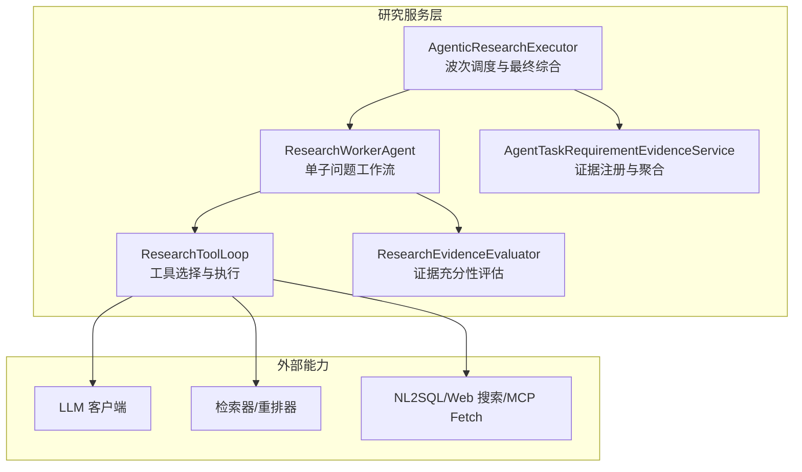
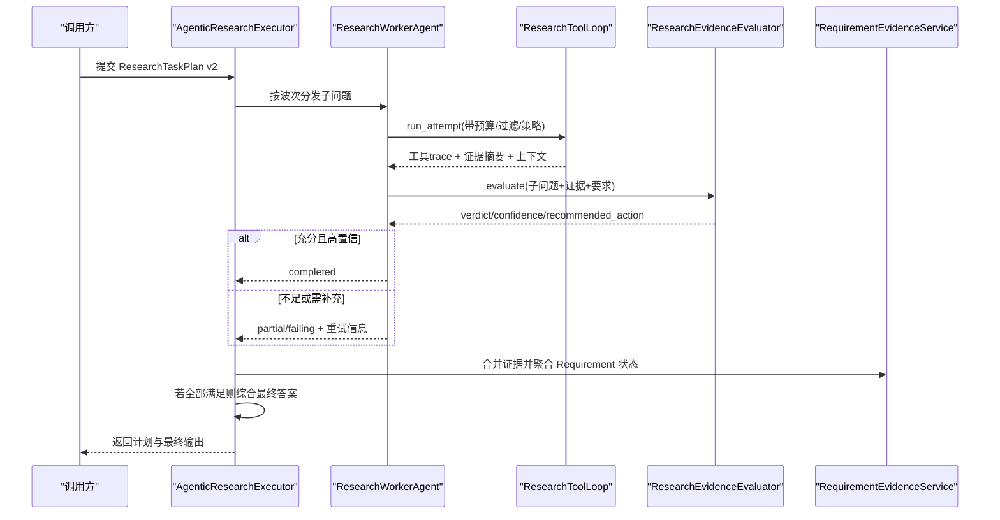
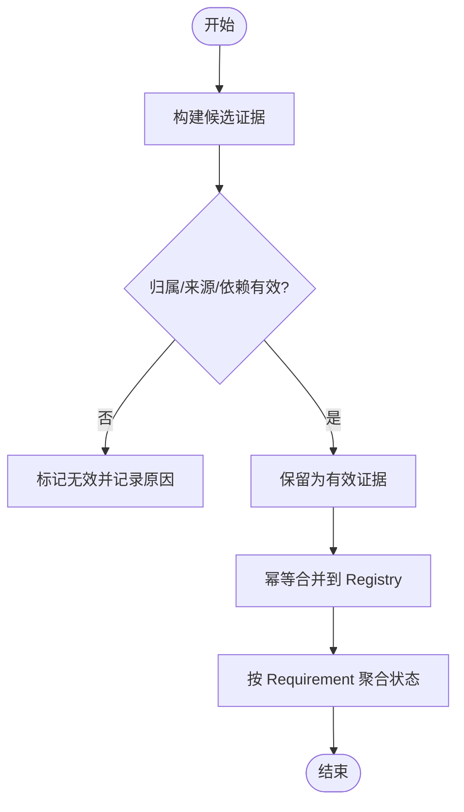
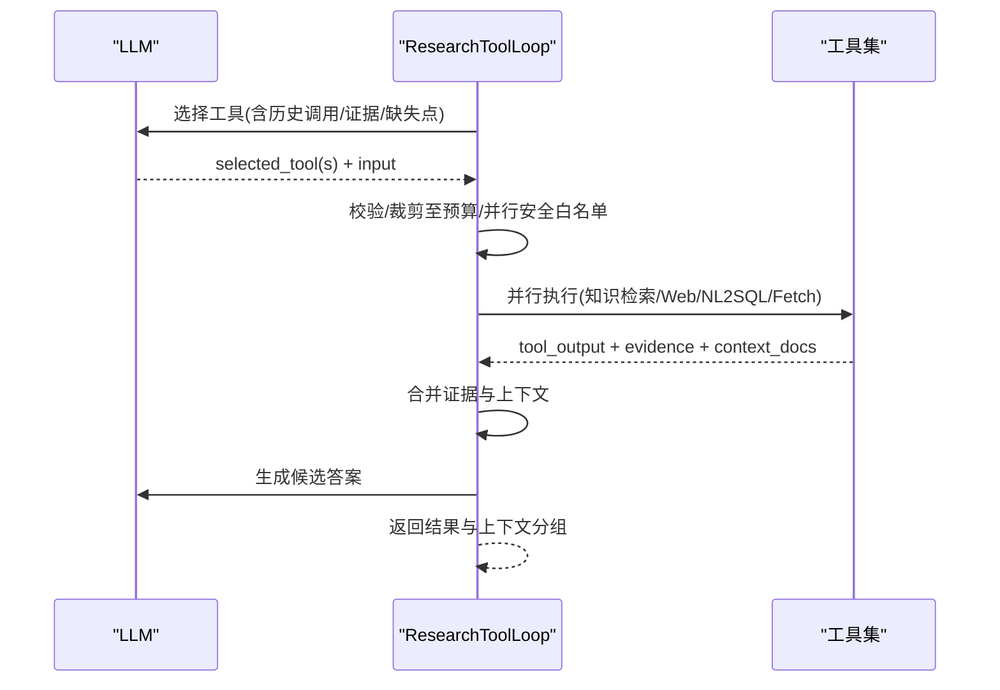
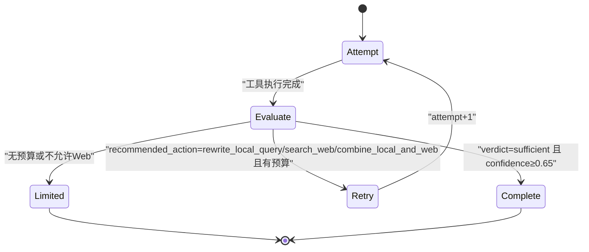
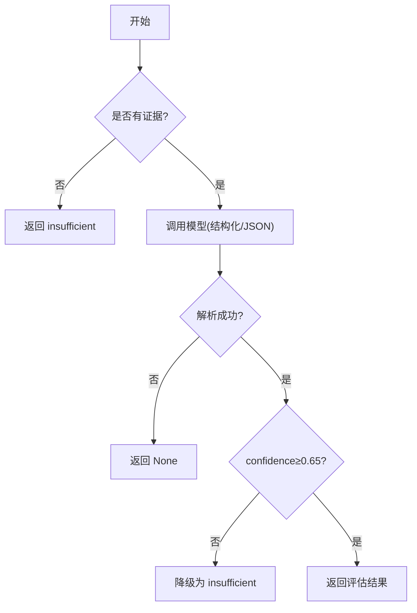
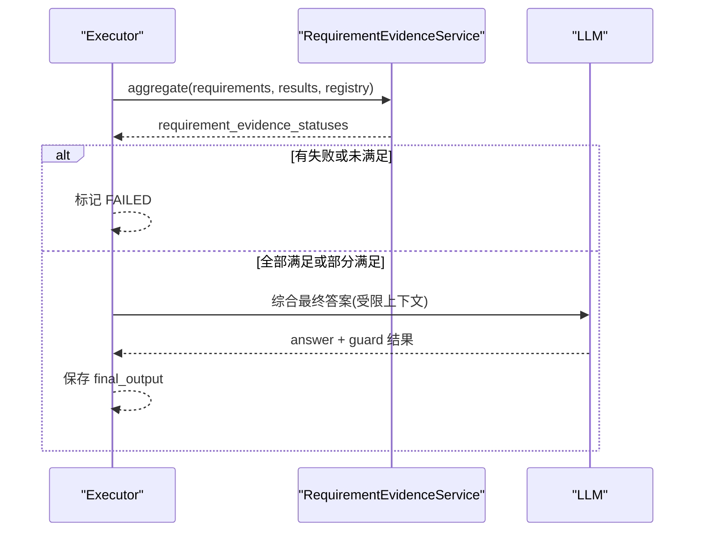
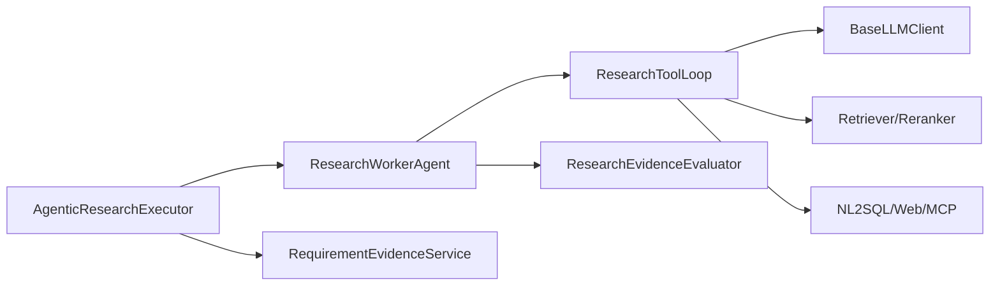

# 研究服务层

<cite>
**本文引用的文件**
- [requirement_evidence_service.py](file://python-agent-study/src/fast_app/services/research/requirement_evidence_service.py)
- [research_tool_loop.py](file://python-agent-study/src/fast_app/services/research/research_tool_loop.py)
- [research_worker_agent.py](file://python-agent-study/src/fast_app/services/research/research_worker_agent.py)
- [research_evidence_evaluator.py](file://python-agent-study/src/fast_app/services/research/research_evidence_evaluator.py)
- [agentic_research_executor.py](file://python-agent-study/src/fast_app/services/research/agentic_research_executor.py)
- [config.py](file://python-agent-study/src/fast_app/core/config.py)
- [test_agent_task_tool_loop.py](file://python-agent-study/scripts/tests/agent_research/test_agent_task_tool_loop.py)
</cite>

## 目录
1. [简介](#简介)
2. [项目结构](#项目结构)
3. [核心组件](#核心组件)
4. [架构总览](#架构总览)
5. [详细组件分析](#详细组件分析)
6. [依赖关系分析](#依赖关系分析)
7. [性能与可观测性](#性能与可观测性)
8. [故障排查指南](#故障排查指南)
9. [结论](#结论)
10. [附录：配置项与扩展点](#附录配置项与扩展点)

## 简介
本文件面向“研究服务层”，围绕三个关键组件展开：
- RequirementEvidenceService（证据收集、校验与聚合）
- ResearchToolLoop（工具选择、执行与候选答案生成）
- ResearchWorkerAgent（单子问题的隔离工作流，含证据评估与有限纠正）

文档将解释证据评估算法、工具选择策略、结果可信度计算，并提供配置选项、自定义评估器实现方法、性能优化策略以及端到端流程示例。

## 项目结构
研究服务层位于 services/research 下，配合 domain、graph、components 等模块共同完成“任务分解—工具调用—证据评估—最终综合”的闭环。

图表来源
- [agentic_research_executor.py:57-120](file://python-agent-study/src/fast_app/services/research/agentic_research_executor.py#L57-L120)
- [research_worker_agent.py:61-121](file://python-agent-study/src/fast_app/services/research/research_worker_agent.py#L61-L121)
- [research_tool_loop.py:172-245](file://python-agent-study/src/fast_app/services/research/research_tool_loop.py#L172-L245)
- [research_evidence_evaluator.py:34-97](file://python-agent-study/src/fast_app/services/research/research_evidence_evaluator.py#L34-L97)
- [requirement_evidence_service.py:41-121](file://python-agent-study/src/fast_app/services/research/requirement_evidence_service.py#L41-L121)

章节来源
- [agentic_research_executor.py:57-120](file://python-agent-study/src/fast_app/services/research/agentic_research_executor.py#L57-L120)
- [research_worker_agent.py:61-121](file://python-agent-study/src/fast_app/services/research/research_worker_agent.py#L61-L121)
- [research_tool_loop.py:172-245](file://python-agent-study/src/fast_app/services/research/research_tool_loop.py#L172-L245)
- [research_evidence_evaluator.py:34-97](file://python-agent-study/src/fast_app/services/research/research_evidence_evaluator.py#L34-L97)
- [requirement_evidence_service.py:41-121](file://python-agent-study/src/fast_app/services/research/requirement_evidence_service.py#L41-L121)

## 核心组件
- AgenticResearchExecutor：按 DAG 波次调度 Worker，合并每波结果，统一写入 Evidence Registry，并基于 Requirement 契约计算满足状态；必要时进行最终综合回答。
- ResearchWorkerAgent：封装单个子问题的完整生命周期，驱动 ToolLoop 执行、调用 Evaluator 评估证据，依据策略决定是否重试或收敛。
- ResearchToolLoop：在预算内多轮让 LLM 选择工具，支持并行安全工具集，执行后产出结构化 trace、证据摘要与上下文文档组。
- ResearchEvidenceEvaluator：以结构化输出优先，结合置信度阈值决定证据是否充分及下一步动作。
- AgentTaskRequirementEvidenceService：把旧版 evidence 转换为稳定 Typed Evidence，校验归属与来源，按 Requirement 契约聚合为 satisfied/partially_satisfied/pending/failed。

章节来源
- [agentic_research_executor.py:86-520](file://python-agent-study/src/fast_app/services/research/agentic_research_executor.py#L86-L520)
- [research_worker_agent.py:61-483](file://python-agent-study/src/fast_app/services/research/research_worker_agent.py#L61-L483)
- [research_tool_loop.py:172-800](file://python-agent-study/src/fast_app/services/research/research_tool_loop.py#L172-L800)
- [research_evidence_evaluator.py:34-169](file://python-agent-study/src/fast_app/services/research/research_evidence_evaluator.py#L34-L169)
- [requirement_evidence_service.py:41-352](file://python-agent-study/src/fast_app/services/research/requirement_evidence_service.py#L41-L352)

## 架构总览
下图展示从请求到最终输出的主流程：Executor 构建图并调度 Worker，Worker 通过 ToolLoop 获取事实，Evaluator 判断充分性，Executor 在波次合并后计算 Requirement 状态并生成最终答案。

图表来源
- [agentic_research_executor.py:86-520](file://python-agent-study/src/fast_app/services/research/agentic_research_executor.py#L86-L520)
- [research_worker_agent.py:83-121](file://python-agent-study/src/fast_app/services/research/research_worker_agent.py#L83-L121)
- [research_tool_loop.py:219-627](file://python-agent-study/src/fast_app/services/research/research_tool_loop.py#L219-L627)
- [research_evidence_evaluator.py:40-97](file://python-agent-study/src/fast_app/services/research/research_evidence_evaluator.py#L40-L97)
- [requirement_evidence_service.py:185-284](file://python-agent-study/src/fast_app/services/research/requirement_evidence_service.py#L185-L284)

## 详细组件分析

### 证据收集与验证：AgentTaskRequirementEvidenceService
- 候选证据构建：将 ToolLoop 产出的 legacy evidence 映射为稳定的 Typed Evidence（knowledge_chunk/web_citation/sql_query_result/derived_synthesis），并生成确定性 evidence_id。
- 子问题级校验：检查证据归属、依赖完整性与来源合法性，仅保留有效证据。
- 幂等合并：同 ID 不同内容视为损坏，抛出状态异常。
- Requirement 聚合：基于 source_policy 模式（none/all_of/any_of）与 expected_evidence 的最小数量/属性约束，判定每个 Requirement 的状态，并区分 completed 与当前合法证据的使用范围。

图表来源
- [requirement_evidence_service.py:44-121](file://python-agent-study/src/fast_app/services/research/requirement_evidence_service.py#L44-L121)
- [requirement_evidence_service.py:123-183](file://python-agent-study/src/fast_app/services/research/requirement_evidence_service.py#L123-L183)
- [requirement_evidence_service.py:185-284](file://python-agent-study/src/fast_app/services/research/requirement_evidence_service.py#L185-L284)

章节来源
- [requirement_evidence_service.py:44-284](file://python-agent-study/src/fast_app/services/research/requirement_evidence_service.py#L44-L284)

### 工具选择与执行：ResearchToolLoop
- 工具选择策略：
  - 优先原生 Tool Calling；失败时回退到结构化 JSON；再失败使用 information_source_hint 兜底。
  - URL 场景强制 mcp__fetch；首轮 web_search 在 required 策略下被强制注入。
  - 同一轮只允许并行安全的工具集合（知识库检索、Web 搜索、NL2SQL、mcp__fetch）。
- 预算控制：按 max_tool_calls 限制，拒绝超预算批次；未执行的选择不计入调用数。
- 执行与产出：每个工具返回 tool_output、evidence 摘要与 context_docs；所有工具完成后统一生成候选答案。
- 隐私保护：Web 查询会剥离私有上下文，仅使用公开子问题构造 safe_web_query。

图表来源
- [research_tool_loop.py:219-627](file://python-agent-study/src/fast_app/services/research/research_tool_loop.py#L219-L627)
- [research_tool_loop.py:628-800](file://python-agent-study/src/fast_app/services/research/research_tool_loop.py#L628-L800)

章节来源
- [research_tool_loop.py:219-800](file://python-agent-study/src/fast_app/services/research/research_tool_loop.py#L219-L800)

### 工作者代理：ResearchWorkerAgent
- 工作流：run_attempt → evaluate_evidence → route_evaluation → retry/complete/limited。
- 重试策略：根据 Evaluator 的 recommended_action 与剩余预算决定是否改写本地查询、引入 Web 或终止。
- 结果收敛：当 verdict 为 sufficient 且 confidence ≥ 0.65 时直接完成；否则在预算内尝试纠正。
- 最终输出：携带 attempts、evaluation、source_types、warnings 等元数据。

图表来源
- [research_worker_agent.py:83-121](file://python-agent-study/src/fast_app/services/research/research_worker_agent.py#L83-L121)
- [research_worker_agent.py:207-356](file://python-agent-study/src/fast_app/services/research/research_worker_agent.py#L207-L356)
- [research_worker_agent.py:396-464](file://python-agent-study/src/fast_app/services/research/research_worker_agent.py#L396-L464)

章节来源
- [research_worker_agent.py:83-464](file://python-agent-study/src/fast_app/services/research/research_worker_agent.py#L83-L464)

### 证据评估算法：ResearchEvidenceEvaluator
- 输入：子问题、覆盖的 Requirement 契约、候选答案、证据摘要。
- 模型调用：优先结构化输出（json_schema/function_calling），失败回退到 JSON 解析。
- 置信度阈值：confidence < 0.65 一律降级为 insufficient，并建议 rewrite_local_query。
- 离线模式：无 LLM 时按存在结构化证据给出确定性 sufficient 判断。

图表来源
- [research_evidence_evaluator.py:40-97](file://python-agent-study/src/fast_app/services/research/research_evidence_evaluator.py#L40-L97)
- [research_evidence_evaluator.py:99-145](file://python-agent-study/src/fast_app/services/research/research_evidence_evaluator.py#L99-L145)

章节来源
- [research_evidence_evaluator.py:40-145](file://python-agent-study/src/fast_app/services/research/research_evidence_evaluator.py#L40-L145)

### 最终综合与报告：AgenticResearchExecutor
- 波次合并：每波结束后将 ToolLoop 的 legacy evidence 转为 Typed Evidence，校验并合并到 Registry，更新子问题结果与 Requirement 状态。
- 终止条件：任一 Requirement 为 failed 或 pending 则整体失败；否则进入最终综合。
- 最终答案：仅允许使用已满足或部分满足的 Requirement 对应的合法证据，必要时声明限制；经 Prompt Guard 分类与清洗后输出。

图表来源
- [agentic_research_executor.py:264-320](file://python-agent-study/src/fast_app/services/research/agentic_research_executor.py#L264-L320)
- [agentic_research_executor.py:443-509](file://python-agent-study/src/fast_app/services/research/agentic_research_executor.py#L443-L509)
- [agentic_research_executor.py:521-575](file://python-agent-study/src/fast_app/services/research/agentic_research_executor.py#L521-L575)

章节来源
- [agentic_research_executor.py:264-575](file://python-agent-study/src/fast_app/services/research/agentic_research_executor.py#L264-L575)

## 依赖关系分析
- 组件耦合：
  - Executor 依赖 WorkerAgent、RequirementEvidenceService 与 TaskPlanStore。
  - WorkerAgent 依赖 ToolLoop 与 Evaluator。
  - ToolLoop 依赖 LLM、Retriever/Reranker、NL2SQL/Web/MCP 工具。
- 外部依赖：
  - LLM 客户端用于工具选择、答案生成与证据评估。
  - 检索/重排用于知识库召回与排序。
  - NL2SQL/Web/MCP 提供外部事实来源。

图表来源
- [agentic_research_executor.py:57-76](file://python-agent-study/src/fast_app/services/research/agentic_research_executor.py#L57-L76)
- [research_worker_agent.py:61-81](file://python-agent-study/src/fast_app/services/research/research_worker_agent.py#L61-L81)
- [research_tool_loop.py:172-195](file://python-agent-study/src/fast_app/services/research/research_tool_loop.py#L172-L195)

章节来源
- [agentic_research_executor.py:57-76](file://python-agent-study/src/fast_app/services/research/agentic_research_executor.py#L57-L76)
- [research_worker_agent.py:61-81](file://python-agent-study/src/fast_app/services/research/research_worker_agent.py#L61-L81)
- [research_tool_loop.py:172-195](file://python-agent-study/src/fast_app/services/research/research_tool_loop.py#L172-L195)

## 性能与可观测性
- 并发与预算：
  - 工具并行执行受 PARALLEL_SAFE_TASK_TOOL_NAMES 与 agent_max_parallel_tool_calls 限制。
  - 每 Worker 最大工具调用次数由 agent_research_max_tool_calls_per_worker 控制。
- 超时与恢复：
  - Worker 超时标记 WORKER_TIMEOUT，保留 checkpoint 以便后续诊断。
  - 持久化失败提升 _TaskPlanPersistenceError，避免静默丢失。
- 可观测性：
  - 进度事件与检查点回调持续上报 stage、attempt、active_operations、tool_call_count、evidence_count 等。
  - LangChain config factory 可为每次工具/评估/合成生成独立 trace 名称，便于链路追踪。

章节来源
- [research_tool_loop.py:219-484](file://python-agent-study/src/fast_app/services/research/research_tool_loop.py#L219-L484)
- [agentic_research_executor.py:123-227](file://python-agent-study/src/fast_app/services/research/agentic_research_executor.py#L123-L227)
- [agentic_research_executor.py:650-657](file://python-agent-study/src/fast_app/services/research/agentic_research_executor.py#L650-L657)

## 故障排查指南
- 证据状态异常：
  - 同一 Evidence ID 对应不同内容：Registry 损坏，抛出 AgentTaskEvidenceStateInvalidError。
  - 子问题证据不匹配或缺失依赖：validate_sub_question_evidence 会标记无效并记录原因码。
- 工具权限与安全：
  - 工具权限拒绝属于任务级安全事件，不会降级重试。
  - 安全失败类型包括 TOOL_PERMISSION_DENIED、NL2SQL_PERMISSION_DENIED、PROMPT_INJECTION_BLOCKED、AGENT_TASK_SOURCE_UNAVAILABLE。
- 评估器不可用：
  - 评估阶段异常会被捕获并记录 warning，结果可能降级为 partial。
- 常见定位步骤：
  - 查看 worker checkpoint 中的 active_operations、tool_calls、evidence。
  - 检查 requirement_evidence_statuses 的 reason_codes 与 missing_source_types。
  - 核对最终输出的 guard_action 与 guard_reason_codes。

章节来源
- [requirement_evidence_service.py:168-183](file://python-agent-study/src/fast_app/services/research/requirement_evidence_service.py#L168-L183)
- [requirement_evidence_service.py:236-284](file://python-agent-study/src/fast_app/services/research/requirement_evidence_service.py#L236-L284)
- [research_worker_agent.py:207-315](file://python-agent-study/src/fast_app/services/research/research_worker_agent.py#L207-L315)
- [agentic_research_executor.py:443-509](file://python-agent-study/src/fast_app/services/research/agentic_research_executor.py#L443-L509)

## 结论
该研究服务层通过“工具循环—证据评估—Requirement 契约聚合—最终综合”的分层设计，实现了可控、可观测、可扩展的研究式问答。其关键优势在于：
- 严格的证据溯源与幂等合并，避免误用历史证据。
- 基于契约的 Requirement 满足判定，确保答案有据可依。
- 灵活的证据评估与有限纠正机制，兼顾质量与成本。
- 完善的进度与检查点机制，便于调试与恢复。

## 附录：配置项与扩展点
- 关键配置项（来自 Settings）：
  - 工具与并行：agent_max_tool_calls、agent_max_parallel_tool_calls、agent_research_max_tool_calls_per_worker、agent_research_max_correction_rounds。
  - 超时：agent_research_worker_timeout_seconds。
  - 检索默认：rag_default_top_k、rag_default_min_score。
  - 安全：prompt_guard_enabled、prompt_guard_mode、prompt_guard_block_threshold。
  - 追踪：langsmith_tracing、langsmith_api_key、langsmith_endpoint、langsmith_project、langsmith_tags。
- 自定义证据评估器：
  - 替换 ResearchEvidenceEvaluator 的实现，保持 evaluate 接口一致；可调整置信度阈值、推荐动作策略与降级逻辑。
  - 在 ResearchWorkerAgent 中注入自定义评估器实例即可生效。
- 自定义工具：
  - 在 ResearchToolLoop._build_available_task_tools 中注册新工具，并确保其属于并行安全集合或串行处理。
  - 遵循安全规范：对外部工具（如 Web）进行隐私清洗与最小参数暴露。
- 端到端流程示例（参考测试）：
  - 见 test_agent_task_tool_loop.py 中对 LoopResearchToolLoop、ParallelResearchToolLoop 的模拟，演示了工具选择、并行执行、错误处理与结果组装。

章节来源
- [config.py:18-200](file://python-agent-study/src/fast_app/core/config.py#L18-L200)
- [test_agent_task_tool_loop.py:73-173](file://python-agent-study/scripts/tests/agent_research/test_agent_task_tool_loop.py#L73-L173)