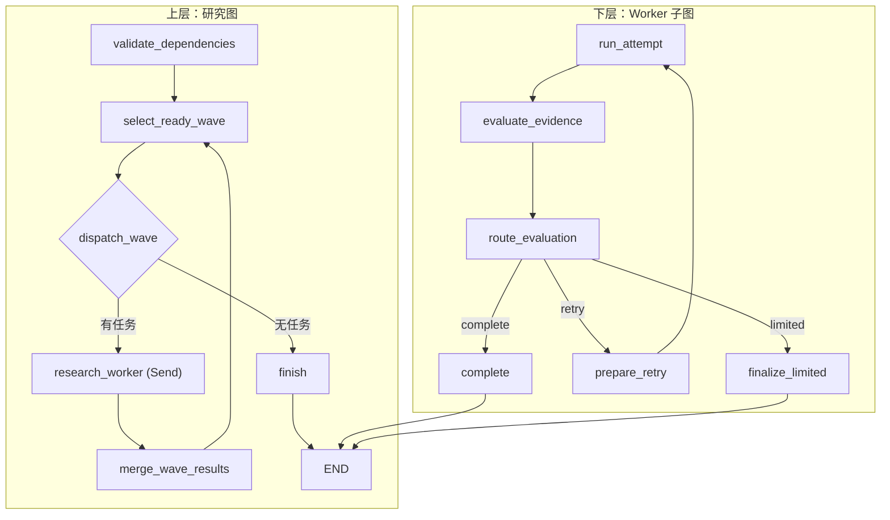
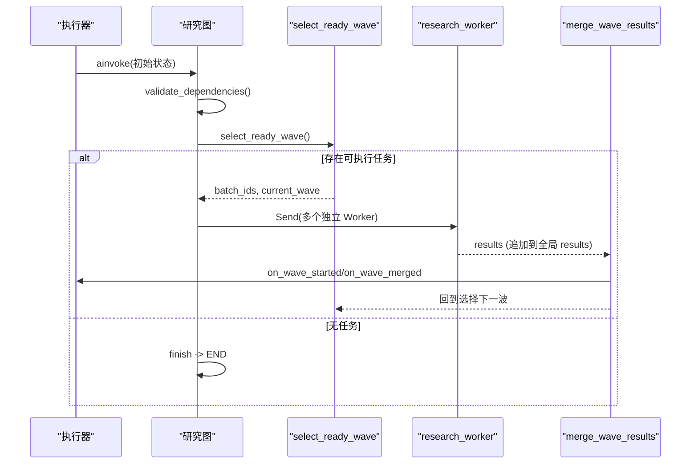
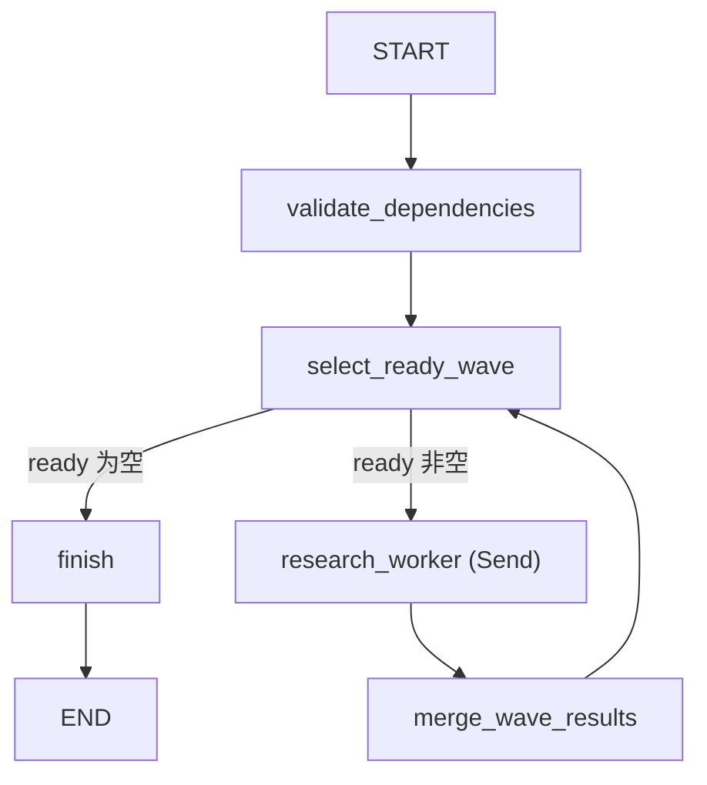
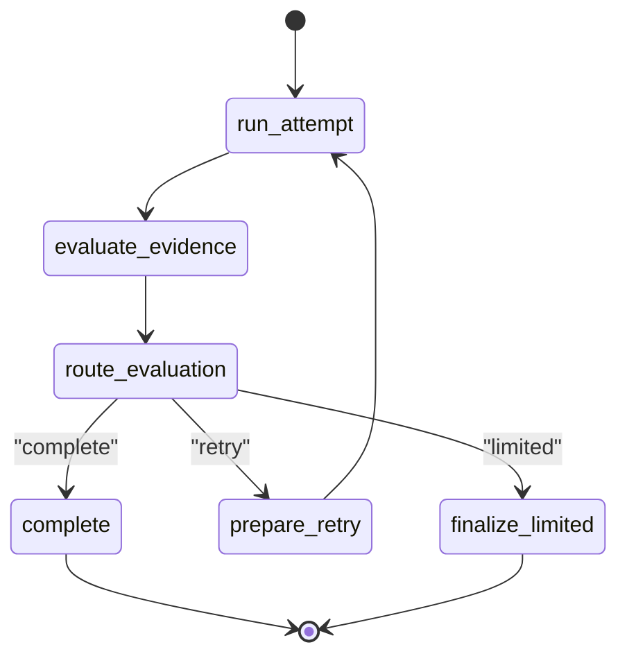
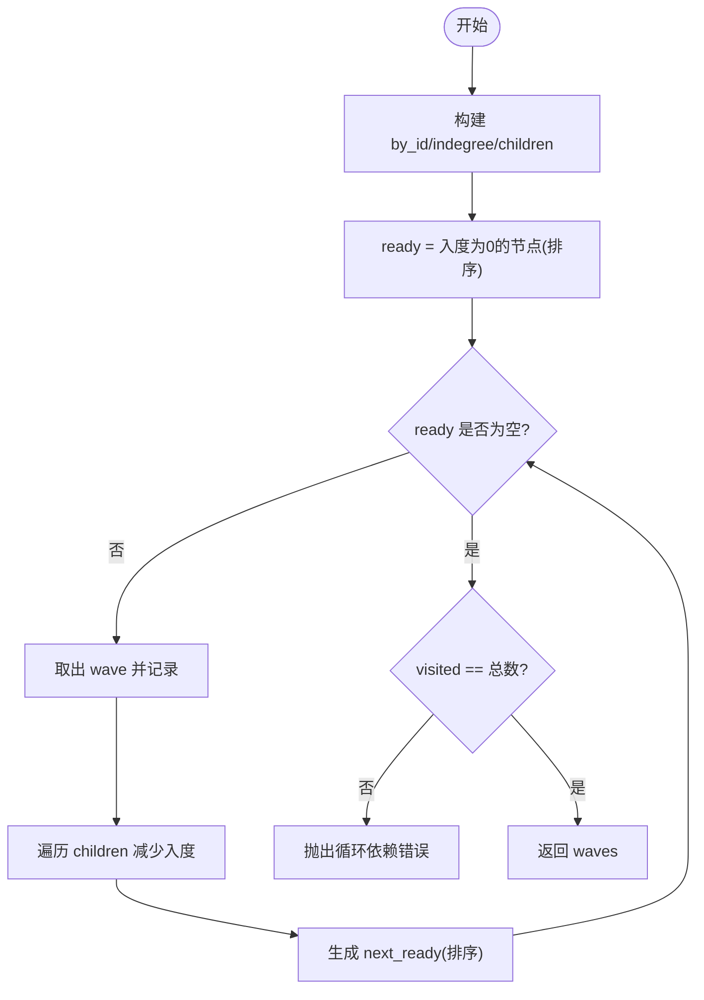
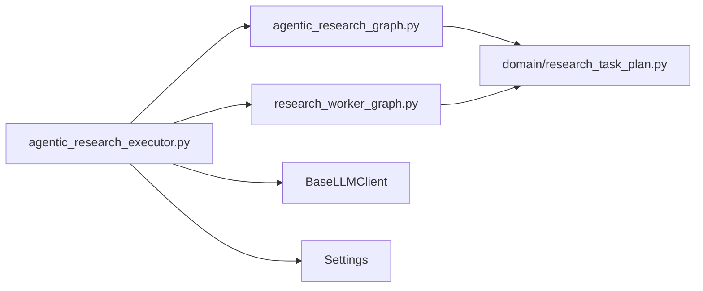

# 研究状态机

<cite>
**本文引用的文件**
- [agentic_research_graph.py](file://python-agent-study/src/fast_app/graph/research/agentic_research_graph.py)
- [research_worker_graph.py](file://python-agent-study/src/fast_app/graph/research/research_worker_graph.py)
- [research_task_plan.py](file://python-agent-study/src/fast_app/domain/research_task_plan.py)
- [agentic_research_executor.py](file://python-agent-study/src/fast_app/services/research/agentic_research_executor.py)
- [test_agentic_research_orchestration.py](file://python-agent-study/scripts/tests/agent_research/test_agentic_research_orchestration.py)
- [Agentic Research多Agent代码学习指南.md](file://python-agent-study/scripts/docs/Agentic Research多Agent代码学习指南.md)
</cite>

## 目录
1. [简介](#简介)
2. [项目结构](#项目结构)
3. [核心组件](#核心组件)
4. [架构总览](#架构总览)
5. [详细组件分析](#详细组件分析)
6. [依赖关系分析](#依赖关系分析)
7. [性能与并发特性](#性能与并发特性)
8. [故障排查指南](#故障排查指南)
9. [结论](#结论)
10. [附录：构建、编译与执行示例](#附录构建编译与执行示例)

## 简介
本文件围绕“研究状态机”展开，系统性解释 Agentic Research Graph（研究图）与 Research Worker Graph（Worker 子图）的架构设计、状态定义、节点实现、边连接逻辑；并详细说明研究任务的启动流程、并行执行机制、状态转换规则。文档还深入讲解依赖验证算法（Kahn 算法）、波次调度策略、取消机制处理，并提供具体代码路径以展示研究图的构建、编译和执行过程，以及自定义研究节点的接入方法。

## 项目结构
研究状态机由两层 LangGraph 子图构成：
- 上层：Agentic Research Graph，负责按依赖关系组织子问题、选择可执行波次、扇出多个 Worker、合并结果并循环推进。
- 下层：Research Worker Graph，封装单个子问题的“尝试—评估—路由—重试/完成/受限完成”纠正循环。

图表来源
- [agentic_research_graph.py:124-276](file://python-agent-study/src/fast_app/graph/research/agentic_research_graph.py#L124-L276)
- [research_worker_graph.py:57-79](file://python-agent-study/src/fast_app/graph/research/research_worker_graph.py#L57-L79)

章节来源
- [agentic_research_graph.py:1-294](file://python-agent-study/src/fast_app/graph/research/agentic_research_graph.py#L1-L294)
- [research_worker_graph.py:1-83](file://python-agent-study/src/fast_app/graph/research/research_worker_graph.py#L1-L83)

## 核心组件
- 研究图状态
  - ResearchGraphState：维护全部子问题、累积结果、当前波次、批次 ID、最大并发数。
  - ResearchWorkerState：每个 Worker 的独立输入，包含当前子问题、已满足的前置结果、所属波次。
- Worker 子图状态
  - ResearchWorkerGraphState：记录一次子问题研究的完整上下文，包括尝试次数、工具调用轨迹、证据、评估、下一步动作等。
- 执行器
  - AgenticResearchExecutor：装配回调、持久化进度、Evidence 单写、最终综合输出、取消与超时处理。
- 领域模型
  - research_task_plan.py：定义 SubQuestion、Result、Progress、Checkpoint、Requirement、Evidence 等核心数据结构。

章节来源
- [agentic_research_graph.py:34-53](file://python-agent-study/src/fast_app/graph/research/agentic_research_graph.py#L34-L53)
- [research_worker_graph.py:18-36](file://python-agent-study/src/fast_app/graph/research/research_worker_graph.py#L18-L36)
- [agentic_research_executor.py:57-118](file://python-agent-study/src/fast_app/services/research/agentic_research_executor.py#L57-L118)
- [research_task_plan.py:216-297](file://python-agent-study/src/fast_app/domain/research_task_plan.py#L216-L297)

## 架构总览
研究图通过 LangGraph StateGraph 编排“校验 → 选择波次 → 扇出 Worker → 合并 → 再选择”的循环。Worker 子图则对单个子问题实施“尝试—评估—路由—重试/完成/受限完成”的闭环。

图表来源
- [agentic_research_graph.py:124-276](file://python-agent-study/src/fast_app/graph/research/agentic_research_graph.py#L124-L276)
- [agentic_research_executor.py:416-432](file://python-agent-study/src/fast_app/services/research/agentic_research_executor.py#L416-L432)

章节来源
- [agentic_research_graph.py:111-276](file://python-agent-study/src/fast_app/graph/research/agentic_research_graph.py#L111-L276)
- [agentic_research_executor.py:86-519](file://python-agent-study/src/fast_app/services/research/agentic_research_executor.py#L86-L519)

## 详细组件分析

### 研究图（Agentic Research Graph）
- 状态定义
  - ResearchGraphState：sub_questions、results（Annotated + operator.add 用于并行追加）、current_wave、batch_ids、max_parallel_workers。
  - ResearchWorkerState：sub_question、dependency_results、wave。
- 关键节点
  - validate_dependencies：调用 Kahn 算法静态校验依赖图合法性，拒绝重复 ID、缺失依赖、自依赖和环。
  - select_ready_wave：根据已完成/跳过/失败结果动态计算 ready 集合，限制并发，触发 on_wave_started。
  - dispatch_wave：将 batch_ids 转换为多个 Send("research_worker", ...)，为每个 Worker 注入 dependency_results。
  - research_worker：在外部调用前检查取消，调用 worker_runner，返回单个结果并入全局 results。
  - merge_wave_results：收集本批结果，排序后调用 on_wave_merged 持久化，清空 batch_ids 回到选择波次。
  - finish：无任务时结束。
- 边连接
  - START → validate_dependencies → select_ready_wave
  - select_ready_wave 条件边 → research_worker 或 finish
  - research_worker → merge_wave_results → select_ready_wave
  - finish → END

图表来源
- [agentic_research_graph.py:260-276](file://python-agent-study/src/fast_app/graph/research/agentic_research_graph.py#L260-L276)

章节来源
- [agentic_research_graph.py:34-53](file://python-agent-study/src/fast_app/graph/research/agentic_research_graph.py#L34-L53)
- [agentic_research_graph.py:56-108](file://python-agent-study/src/fast_app/graph/research/agentic_research_graph.py#L56-L108)
- [agentic_research_graph.py:124-276](file://python-agent-study/src/fast_app/graph/research/agentic_research_graph.py#L124-L276)

### Worker 子图（Research Worker Graph）
- 状态字段
  - request、attempt、used_tool_calls、all_tool_calls、all_evidence、all_context_doc_groups、force_web、retry_missing_points、attempts、last_result、evaluation、evaluator_error、next_action、final_warning、final_result。
- 节点与流转
  - run_attempt：执行一次研究尝试（可能包含多次工具调用）。
  - evaluate_evidence：对证据进行充分性评估。
  - route_evaluation：根据评估决定 next_action ∈ {complete, retry, limited}。
  - prepare_retry：准备重试（如补充证据、调整策略）。
  - complete：完成并产出 final_result。
  - finalize_limited：受限完成（部分满足），产出 final_result。
- 边连接
  - START → run_attempt → evaluate_evidence → route_evaluation
  - route_evaluation 条件边 → complete / prepare_retry / finalize_limited
  - prepare_retry → run_attempt（形成纠正循环）
  - complete → END
  - finalize_limited → END

图表来源
- [research_worker_graph.py:57-79](file://python-agent-study/src/fast_app/graph/research/research_worker_graph.py#L57-L79)

章节来源
- [research_worker_graph.py:18-83](file://python-agent-study/src/fast_app/graph/research/research_worker_graph.py#L18-L83)

### 依赖验证算法（Kahn 算法）
- 目标：校验子问题依赖图是否合法，并返回稳定执行波次（仅用于静态校验与测试）。
- 步骤
  - 建立 by_id 索引，统计 indegree 与 children。
  - 初始化 ready 为所有入度为 0 的节点，按 order 与 id 排序保证可复现。
  - 逐轮移除 wave，更新子节点入度，生成下一轮 ready。
  - 若 visited != 总节点数，说明存在环，抛出异常。
- 注意：当前运行链路中，Kahn 主要用于执行前验证；运行时波次由 select_ready_wave 基于实际结果动态选择。

图表来源
- [agentic_research_graph.py:56-108](file://python-agent-study/src/fast_app/graph/research/agentic_research_graph.py#L56-L108)

章节来源
- [agentic_research_graph.py:56-108](file://python-agent-study/src/fast_app/graph/research/agentic_research_graph.py#L56-L108)
- [Agentic Research多Agent代码学习指南.md:1126-1345](file://python-agent-study/scripts/docs/Agentic Research多Agent代码学习指南.md#L1126-L1345)

### 波次调度策略
- 动态选择：select_ready_wave 从 pending 中筛选依赖全部 completed/partial 的子问题作为 ready。
- 级联跳过：若某依赖 failed/skipped，其后续依赖将被标记为 skipped，直到没有新增 skipped。
- 并发限制：ready 按 order/id 排序后截断至 max_parallel_workers，形成“执行批次编号”。
- 回调通知：on_wave_started 写入 TaskPlan 快照并通知 SSE；on_wave_merged 合并结果、更新 Evidence Registry、聚合 Requirement 状态。

章节来源
- [agentic_research_graph.py:131-199](file://python-agent-study/src/fast_app/graph/research/agentic_research_graph.py#L131-L199)
- [agentic_research_executor.py:251-320](file://python-agent-study/src/fast_app/services/research/agentic_research_executor.py#L251-L320)

### 取消机制处理
- 控制点：在 select_ready_wave、research_worker、merge_wave_results 等处检查 should_stop。
- 取消传播：should_stop 同步读取数据库最新状态，若为 CANCELLED 则抛出 ResearchExecutionCancelled。
- 执行器捕获：AgenticResearchExecutor 捕获该异常后将 TaskPlan 收口为取消状态，避免误记为 Worker 失败。
- 协作式取消：不强制杀死协程，而是在安全边界检查并停止后续操作。

章节来源
- [agentic_research_graph.py:27-31](file://python-agent-study/src/fast_app/graph/research/agentic_research_graph.py#L27-L31)
- [agentic_research_graph.py:131-137](file://python-agent-study/src/fast_app/graph/research/agentic_research_graph.py#L131-L137)
- [agentic_research_graph.py:228-237](file://python-agent-study/src/fast_app/graph/research/agentic_research_graph.py#L228-L237)
- [agentic_research_executor.py:77-84](file://python-agent-study/src/fast_app/services/research/agentic_research_executor.py#L77-L84)
- [agentic_research_executor.py:510-513](file://python-agent-study/src/fast_app/services/research/agentic_research_executor.py#L510-L513)

### 状态转换规则
- 子问题状态
  - pending → running（波次开始时）
  - running → completed/partial/failed/skipped（Worker 完成后）
  - 依赖失败传播：若依赖 failed/skipped，后续依赖被标记为 skipped。
- 任务级别状态
  - RUNNING → COMPLETED/COMPLETED_WITH_WARNINGS/FAILED/CANCELLED（依据 Requirement 证据状态与最终综合结果）。

章节来源
- [research_task_plan.py:42-49](file://python-agent-study/src/fast_app/domain/research_task_plan.py#L42-L49)
- [agentic_research_executor.py:443-509](file://python-agent-study/src/fast_app/services/research/agentic_research_executor.py#L443-L509)

## 依赖关系分析
- 模块耦合
  - agentic_research_graph.py 依赖 domain 模型与 LangGraph 类型。
  - research_worker_graph.py 依赖 domain 模型与 LangGraph 类型。
  - agentic_research_executor.py 组合两个图、LLM、Evidence 服务、TaskPlan 存储。
- 外部依赖
  - LangGraph：StateGraph、Send、END、START。
  - LLM 客户端：BaseLLMClient。
  - 配置与用户上下文：Settings、CurrentUserContext。
- 潜在循环
  - 图内循环位于 merge_wave_results → select_ready_wave，属于受控循环，不会导致 Python 导入循环。

图表来源
- [agentic_research_graph.py:1-16](file://python-agent-study/src/fast_app/graph/research/agentic_research_graph.py#L1-L16)
- [research_worker_graph.py:1-16](file://python-agent-study/src/fast_app/graph/research/research_worker_graph.py#L1-L16)
- [agentic_research_executor.py:1-48](file://python-agent-study/src/fast_app/services/research/agentic_research_executor.py#L1-L48)

章节来源
- [agentic_research_graph.py:1-16](file://python-agent-study/src/fast_app/graph/research/agentic_research_graph.py#L1-L16)
- [research_worker_graph.py:1-16](file://python-agent-study/src/fast_app/graph/research/research_worker_graph.py#L1-L16)
- [agentic_research_executor.py:1-48](file://python-agent-study/src/fast_app/services/research/agentic_research_executor.py#L1-L48)

## 性能与并发特性
- I/O 并发：Send 创建多个独立 Worker 实例，利用 asyncio 事件循环并发等待外部 I/O（LLM、检索、Web 搜索等）。
- 并发上限：max_parallel_workers 限制每波同时派发的 Worker 数量，避免资源过载。
- 稳定性：ready 排序保证相同条件下执行顺序可复现；合并结果排序保证快照与 SSE 展示稳定。
- 超时保护：Worker 调用设置超时，超时后记录 checkpoint 并返回失败结果。

章节来源
- [agentic_research_graph.py:187-199](file://python-agent-study/src/fast_app/graph/research/agentic_research_graph.py#L187-L199)
- [agentic_research_executor.py:386-414](file://python-agent-study/src/fast_app/services/research/agentic_research_executor.py#L386-L414)
- [Agentic Research多Agent代码学习指南.md:1679-1736](file://python-agent-study/scripts/docs/Agentic Research多Agent代码学习指南.md#L1679-L1736)

## 故障排查指南
- 循环依赖检测
  - 现象：validate_dependencies 抛出循环依赖错误。
  - 排查：检查 depends_on 是否存在环或自依赖。
- 依赖失败传播
  - 现象：下游子问题被标记为 skipped。
  - 排查：确认上游依赖是否 failed/skipped，理解级联跳过逻辑。
- 取消未生效
  - 现象：任务仍在执行。
  - 排查：确认 should_stop 是否在关键节点被调用；检查数据库状态是否已更新为 CANCELLED。
- 超时与检查点
  - 现象：Worker 超时但保留最后阶段信息。
  - 排查：查看 worker_checkpoints 中的 tool_calls 与 stage，定位卡住的外部调用。

章节来源
- [agentic_research_graph.py:68-108](file://python-agent-study/src/fast_app/graph/research/agentic_research_graph.py#L68-L108)
- [agentic_research_graph.py:144-174](file://python-agent-study/src/fast_app/graph/research/agentic_research_graph.py#L144-L174)
- [agentic_research_executor.py:228-249](file://python-agent-study/src/fast_app/services/research/agentic_research_executor.py#L228-L249)

## 结论
研究状态机通过两层 LangGraph 子图实现了高内聚、低耦合的研究任务编排：上层负责依赖驱动与并发调度，下层负责单个子问题的纠正循环。Kahn 算法提供静态依赖校验，运行时波次调度基于真实结果动态决策，取消机制在多处安全边界检查，确保任务可控、可恢复、可观测。

## 附录：构建、编译与执行示例
- 构建研究图
  - 使用 build_agentic_research_graph 传入 worker_runner、on_wave_started、on_wave_merged、should_stop 回调。
  - 参考路径：[agentic_research_graph.py:111-122](file://python-agent-study/src/fast_app/graph/research/agentic_research_graph.py#L111-L122)
- 编译与执行
  - 执行器组装回调并调用 graph.ainvoke，传入初始状态。
  - 参考路径：[agentic_research_executor.py:416-432](file://python-agent-study/src/fast_app/services/research/agentic_research_executor.py#L416-L432)
- 自定义研究节点
  - 通过实现 worker_runner 接入业务逻辑（检索、评估、生成答案等）。
  - 参考测试中的 ControlledWorker 与 FakeLLM，演示如何模拟不同行为。
  - 参考路径：[test_agentic_research_orchestration.py:64-143](file://python-agent-study/scripts/tests/agent_research/test_agentic_research_orchestration.py#L64-L143)
- Worker 子图扩展
  - 通过 build_research_worker_graph 注册 run_attempt、evaluate_evidence、route_evaluation、prepare_retry、complete、finalize_limited 节点。
  - 参考路径：[research_worker_graph.py:45-79](file://python-agent-study/src/fast_app/graph/research/research_worker_graph.py#L45-L79)

章节来源
- [agentic_research_graph.py:111-122](file://python-agent-study/src/fast_app/graph/research/agentic_research_graph.py#L111-L122)
- [agentic_research_executor.py:416-432](file://python-agent-study/src/fast_app/services/research/agentic_research_executor.py#L416-L432)
- [test_agentic_research_orchestration.py:40-143](file://python-agent-study/scripts/tests/agent_research/test_agentic_research_orchestration.py#L40-L143)
- [research_worker_graph.py:45-79](file://python-agent-study/src/fast_app/graph/research/research_worker_graph.py#L45-L79)