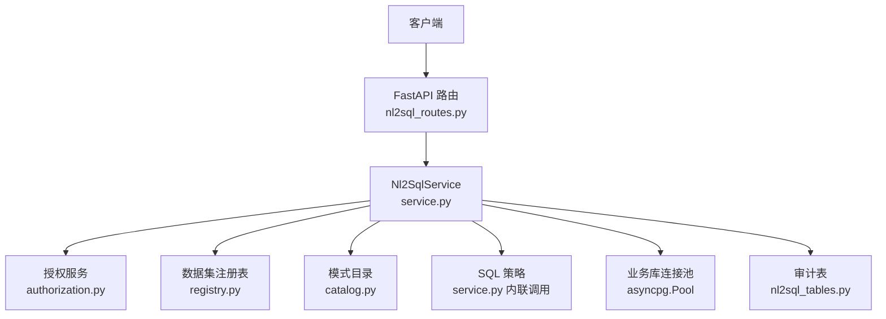
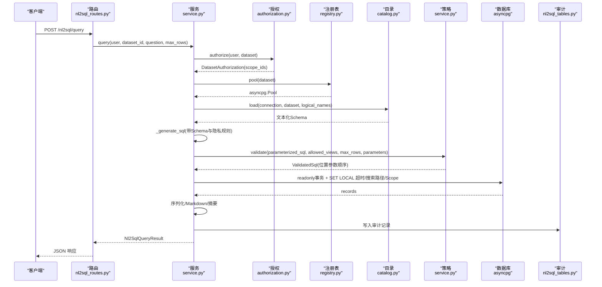
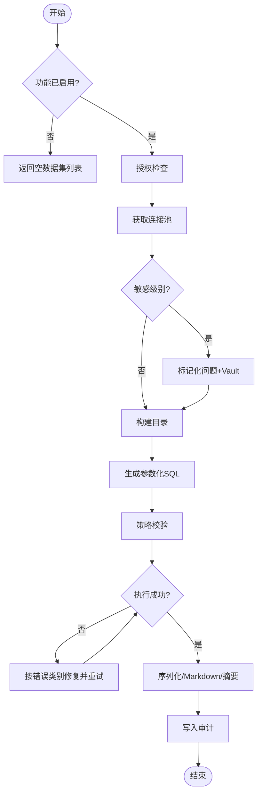
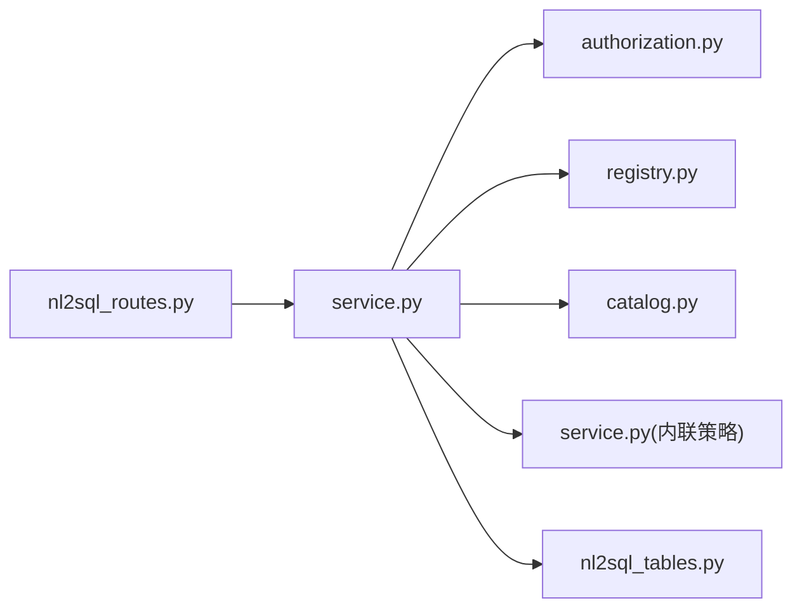

# NL2SQL 系统

<cite>
**本文引用的文件**
- [service.py](file://python-agent-study/src/fast_app/services/nl2sql/service.py)
- [catalog.py](file://python-agent-study/src/fast_app/services/nl2sql/catalog.py)
- [registry.py](file://python-agent-study/src/fast_app/services/nl2sql/registry.py)
- [models.py](file://python-agent-study/src/fast_app/services/nl2sql/models.py)
- [authorization.py](file://python-agent-study/src/fast_app/services/nl2sql/authorization.py)
- [nl2sql_routes.py](file://python-agent-study/src/fast_app/api/nl2sql_routes.py)
- [nl2sql_tables.py](file://python-agent-study/src/fast_app/db/nl2sql_tables.py)
</cite>

## 目录
1. [简介](#简介)
2. [项目结构](#项目结构)
3. [核心组件](#核心组件)
4. [架构总览](#架构总览)
5. [详细组件分析](#详细组件分析)
6. [依赖关系分析](#依赖关系分析)
7. [性能与安全考虑](#性能与安全考虑)
8. [故障排查指南](#故障排查指南)
9. [结论](#结论)
10. [附录：使用示例与最佳实践](#附录使用示例与最佳实践)

## 简介
本系统提供“自然语言转 SQL”的受控查询能力。用户通过 HTTP 接口提交问题，系统在服务端完成授权、上下文构建、参数化 SQL 生成、AST/策略校验、只读执行、结果序列化与安全审计。敏感数据采用本地标记化与模板回填，避免真实值进入外部模型或日志；所有业务库访问均通过白名单视图与 RLS（行级安全）限制范围，确保最小权限与可审计。

## 项目结构
NL2SQL 相关代码集中在 fast_app/services/nl2sql 下，并通过 API 路由暴露对外能力，持久化与配置由平台数据库表承载。

图表来源
- [nl2sql_routes.py:14-36](file://python-agent-study/src/fast_app/api/nl2sql_routes.py#L14-L36)
- [service.py:41-284](file://python-agent-study/src/fast_app/services/nl2sql/service.py#L41-L284)
- [authorization.py:15-74](file://python-agent-study/src/fast_app/services/nl2sql/authorization.py#L15-L74)
- [registry.py:24-124](file://python-agent-study/src/fast_app/services/nl2sql/registry.py#L24-L124)
- [catalog.py:8-77](file://python-agent-study/src/fast_app/services/nl2sql/catalog.py#L8-L77)
- [nl2sql_tables.py:12-100](file://python-agent-study/src/fast_app/db/nl2sql_tables.py#L12-L100)

章节来源
- [nl2sql_routes.py:14-36](file://python-agent-study/src/fast_app/api/nl2sql_routes.py#L14-L36)
- [service.py:41-284](file://python-agent-study/src/fast_app/services/nl2sql/service.py#L41-L284)
- [registry.py:24-124](file://python-agent-study/src/fast_app/services/nl2sql/registry.py#L24-L124)
- [catalog.py:8-77](file://python-agent-study/src/fast_app/services/nl2sql/catalog.py#L8-L77)
- [authorization.py:15-74](file://python-agent-study/src/fast_app/services/nl2sql/authorization.py#L15-L74)
- [nl2sql_tables.py:12-100](file://python-agent-study/src/fast_app/db/nl2sql_tables.py#L12-L100)

## 核心组件
- Nl2SqlService：单一入口，编排授权、上下文、SQL 生成、执行、格式化与审计。
- DatasetRegistry：从平台数据库加载可信 Dataset 配置，管理业务库连接池，拒绝将平台主库注册为 Dataset。
- SchemaCatalog：基于白名单视图与字段注释构造 LLM 可见的 schema 描述，支持逻辑视图名屏蔽物理细节。
- Nl2SqlAuthorizationService：合并 RBAC 与 Dataset Grant，产出可信 scope_ids 并注入 RLS。
- SQL 策略与校验：在 service 中通过 SqlPolicy 对参数化 SQL 进行 AST/白名单/行数/参数顺序校验，再转换为位置参数执行。
- 数据模型：定义 DatasetDefinition、SqlGenerationResult、Nl2SqlQueryResult 等结构化契约。

章节来源
- [service.py:41-284](file://python-agent-study/src/fast_app/services/nl2sql/service.py#L41-L284)
- [registry.py:24-124](file://python-agent-study/src/fast_app/services/nl2sql/registry.py#L24-L124)
- [catalog.py:8-77](file://python-agent-study/src/fast_app/services/nl2sql/catalog.py#L8-L77)
- [authorization.py:15-74](file://python-agent-study/src/fast_app/services/nl2sql/authorization.py#L15-L74)
- [models.py:12-133](file://python-agent-study/src/fast_app/services/nl2sql/models.py#L12-L133)

## 架构总览
下图展示一次完整请求的生命周期：从路由到服务，再到授权、目录构建、LLM 生成、策略校验、只读执行、结果序列化与审计。

图表来源
- [nl2sql_routes.py:17-36](file://python-agent-study/src/fast_app/api/nl2sql_routes.py#L17-L36)
- [service.py:95-284](file://python-agent-study/src/fast_app/services/nl2sql/service.py#L95-L284)
- [authorization.py:21-74](file://python-agent-study/src/fast_app/services/nl2sql/authorization.py#L21-L74)
- [registry.py:102-114](file://python-agent-study/src/fast_app/services/nl2sql/registry.py#L102-L114)
- [catalog.py:11-77](file://python-agent-study/src/fast_app/services/nl2sql/catalog.py#L11-L77)
- [nl2sql_tables.py:76-100](file://python-agent-study/src/fast_app/db/nl2sql_tables.py#L76-L100)

## 详细组件分析

### Nl2SqlService：查询编排与执行
- 功能开关与可见性：根据配置决定是否启用，仅列出已启用且用户有授权的 Dataset。
- 授权前置：authorize_action 检查功能开关、Dataset 是否存在、是否允许报告链路。
- 敏感问题标记化：对敏感 Dataset，先从业务库读取实体目录，将真实值替换为占位符，并将真实值存入 Vault（进程内存），不写日志或审计。
- 目录构建：按 allowed_views 拉取信息架构与注释，必要时使用逻辑视图名隐藏物理实现。
- SQL 生成：以结构化输出约束 LLM 仅返回 SELECT/CTE 与参数化 SQL，禁止写操作、系统表、SELECT * 等。
- 执行与修复：先尝试执行，捕获可修复错误后自动重试一次，统一封装数据库异常为执行错误。
- 结果处理：截断至最大行数，长文本裁剪，生成 Markdown 表格；敏感数据走本地模板回填，非敏感数据走总结模型。
- 审计：成功路径保存 tokenized_question、parameterized_sql、sql_hash、执行耗时、行数；失败路径仅保存脱敏审计。

图表来源
- [service.py:57-284](file://python-agent-study/src/fast_app/services/nl2sql/service.py#L57-L284)

章节来源
- [service.py:57-284](file://python-agent-study/src/fast_app/services/nl2sql/service.py#L57-L284)

### DatasetRegistry：数据集注册与连接池
- 启动期校验：解析部署环境中的数据库 URL 映射，拒绝将平台主库注册为 Dataset，防止自由 SQL 触达控制平面。
- 配置刷新：从平台数据库加载 DatasetDefinition，包含隐私等级、白名单视图、逻辑视图映射、同义词、关系、是否支持报告等。
- 连接池复用：按 database_key 创建并缓存 asyncpg.Pool，设置命令超时与池大小。
- 安全命名：提供 safe_database_name 用于诊断，不包含敏感信息。

章节来源
- [registry.py:24-124](file://python-agent-study/src/fast_app/services/nl2sql/registry.py#L24-L124)

### SchemaCatalog：模式目录构建
- 白名单过滤：仅查询 dataset.allowed_views 中的 analytics 视图。
- 元数据组装：读取列类型、可空性、字段注释与视图注释，拼接为 LLM 可读的结构化说明。
- 逻辑视图遮蔽：敏感场景使用逻辑视图名，避免物理命名泄露；执行前再由后端映射回物理视图。
- 关系与同义词：附加业务关系与同义词，提升 LLM 理解与 JOIN 准确性。

章节来源
- [catalog.py:8-77](file://python-agent-study/src/fast_app/services/nl2sql/catalog.py#L8-L77)

### Nl2SqlAuthorizationService：RBAC 与 Dataset Grant
- 全局权限：要求具备 data:query:execute 权限。
- 管理员豁免：系统管理员直接获得全量 scope。
- Grant 合并：基于当前用户、角色、部门查询 nl2sql_dataset_grants，合并出 scope_ids，支持过期时间控制。
- Scope 注入：返回的 scope_ids 在只读事务中写入 app.scope_ids，供 PostgreSQL RLS 再次限制。

章节来源
- [authorization.py:15-74](file://python-agent-study/src/fast_app/services/nl2sql/authorization.py#L15-L74)

### 数据模型与协议
- DatasetDefinition：服务端可信配置，包含隐私等级、白名单视图、逻辑视图映射、同义词、关系、是否支持报告等。
- SqlGenerationResult：LLM 唯一允许输出的结构化结果，包含参数化 SQL、参数与可选的结论模板。
- Nl2SqlQueryResult：标准化响应体，包含列、行、截断标志、执行耗时、尝试次数、Markdown 表格等。
- 授权与动作：支持 query/report 两类动作，report 需显式开启。

章节来源
- [models.py:12-133](file://python-agent-study/src/fast_app/services/nl2sql/models.py#L12-L133)

### API 路由
- GET /nl2sql/datasets：列出当前用户可见的 Dataset。
- POST /nl2sql/query：提交自然语言问题，返回结构化查询结果与结论。

章节来源
- [nl2sql_routes.py:14-36](file://python-agent-study/src/fast_app/api/nl2sql_routes.py#L14-L36)

### 持久化与审计
- nl2sql_datasets：存储 Dataset 配置（不含连接凭证）。
- nl2sql_dataset_grants：存储 Dataset/项目授权，支持主体类型与过期时间。
- nl2sql_query_audits：审计摘要，禁止保存真实参数与结果行，仅保存 tokenized_question、parameterized_sql、哈希、状态与耗时。

章节来源
- [nl2sql_tables.py:12-100](file://python-agent-study/src/fast_app/db/nl2sql_tables.py#L12-L100)

## 依赖关系分析
- 路由层依赖服务层，服务层依赖授权、注册表、目录与策略。
- 注册表依赖平台数据库与部署环境变量中的数据库 URL 映射。
- 目录层依赖业务库的 information_schema 与 pg_catalog 元数据。
- 授权层依赖平台数据库的 grant 表与用户上下文。
- 审计层依赖平台数据库的审计表。

图表来源
- [nl2sql_routes.py:14-36](file://python-agent-study/src/fast_app/api/nl2sql_routes.py#L14-L36)
- [service.py:41-284](file://python-agent-study/src/fast_app/services/nl2sql/service.py#L41-L284)
- [authorization.py:15-74](file://python-agent-study/src/fast_app/services/nl2sql/authorization.py#L15-L74)
- [registry.py:24-124](file://python-agent-study/src/fast_app/services/nl2sql/registry.py#L24-L124)
- [catalog.py:8-77](file://python-agent-study/src/fast_app/services/nl2sql/catalog.py#L8-L77)
- [nl2sql_tables.py:12-100](file://python-agent-study/src/fast_app/db/nl2sql_tables.py#L12-L100)

章节来源
- [nl2sql_routes.py:14-36](file://python-agent-study/src/fast_app/api/nl2sql_routes.py#L14-L36)
- [service.py:41-284](file://python-agent-study/src/fast_app/services/nl2sql/service.py#L41-L284)
- [authorization.py:15-74](file://python-agent-study/src/fast_app/services/nl2sql/authorization.py#L15-L74)
- [registry.py:24-124](file://python-agent-study/src/fast_app/services/nl2sql/registry.py#L24-L124)
- [catalog.py:8-77](file://python-agent-study/src/fast_app/services/nl2sql/catalog.py#L8-L77)
- [nl2sql_tables.py:12-100](file://python-agent-study/src/fast_app/db/nl2sql_tables.py#L12-L100)

## 性能与安全考虑
- 只读执行：所有查询在 readonly 事务中执行，结合 SET LOCAL 限制语句锁与超时，降低风险与资源占用。
- 参数化查询：LLM 输出必须为参数化 SQL，后端将 :pN 转换为 $N 并按顺序绑定真实值，杜绝 SQL 注入。
- 白名单视图：目录构建与执行均限制在 allowed_views，禁止访问未授权表或系统表。
- RLS 作用域：通过 app.scope_ids 注入项目范围，数据库侧再次限制可见行。
- 敏感数据处理：真实值仅在进程内存 Vault 中短暂存在，不进入日志、审计或外部模型；结论通过受限模板回填。
- 结果限流：默认限制返回行数，超长字段裁剪并提示，避免大响应影响网络与渲染。
- 连接池：按 dataset.database_key 复用连接池，减少握手开销；命令超时与池大小可配置。
- 失败审计：异常路径仅记录脱敏审计，避免泄露敏感信息。

[本节为通用指导，不直接分析具体文件]

## 故障排查指南
- 功能未启用：当配置关闭时，list_datasets 返回空列表，query 会抛出禁用错误。
- 无权限：缺少 data:query:execute 或无 Dataset Grant 将抛出权限拒绝错误。
- 数据库拒绝：Postgres 错误或查询被取消会被封装为执行错误，便于上层统一处理。
- 超时：语句级与锁级超时由 SET LOCAL 控制，可通过配置调整模型与服务端超时。
- 结果截断：超过 max_rows 会返回 truncated=true 与警告信息。
- 审计缺失：失败路径也会写入审计，但不会保存真实参数与结果行。

章节来源
- [service.py:57-284](file://python-agent-study/src/fast_app/services/nl2sql/service.py#L57-L284)
- [authorization.py:21-74](file://python-agent-study/src/fast_app/services/nl2sql/authorization.py#L21-L74)
- [nl2sql_tables.py:76-100](file://python-agent-study/src/fast_app/db/nl2sql_tables.py#L76-L100)

## 结论
该 NL2SQL 系统以“最小权限、可审计、可修复”为核心设计原则，通过严格的授权、白名单视图、参数化 SQL、只读事务与 RLS 组合，确保自然语言查询的安全性与可控性。敏感数据采用本地标记化与模板回填，避免真实值外泄；同时提供清晰的审计与错误处理机制，便于运维与合规。

[本节为总结，不直接分析具体文件]

## 附录：使用示例与最佳实践

- 注册新的 Dataset
  - 在平台数据库中维护 nl2sql_datasets，填写 dataset_id、name、domain、database_key、privacy_classification、scope_column、allowed_views、logical_view_mapping、relationships、synonyms、report_supported、enabled 等字段。
  - 确保部署环境变量中的 nl2sql_database_urls_json 包含该 dataset 的 database_key 对应的只读数据库 URL。
  - 通过 DatasetRegistry.refresh 加载配置，或通过应用生命周期自动刷新。

  章节来源
  - [registry.py:58-85](file://python-agent-study/src/fast_app/services/nl2sql/registry.py#L58-L85)
  - [nl2sql_tables.py:12-40](file://python-agent-study/src/fast_app/db/nl2sql_tables.py#L12-L40)

- 配置查询策略
  - 通过 DatasetDefinition.allowed_views 限定模型可查询的视图集合。
  - 通过 entity_tokenization_rules 与 logical_view_mapping 控制敏感数据的标记化与逻辑视图遮蔽。
  - 通过 report_supported 控制是否允许进入外部模型报告链路。

  章节来源
  - [models.py:12-45](file://python-agent-study/src/fast_app/services/nl2sql/models.py#L12-L45)
  - [catalog.py:11-77](file://python-agent-study/src/fast_app/services/nl2sql/catalog.py#L11-L77)
  - [service.py:166-185](file://python-agent-study/src/fast_app/services/nl2sql/service.py#L166-L185)

- 执行安全查询
  - 调用 POST /nl2sql/query，传入 dataset_id、question、max_rows。
  - 服务层完成授权、目录构建、SQL 生成、策略校验、只读执行、结果序列化与审计。

  章节来源
  - [nl2sql_routes.py:25-36](file://python-agent-study/src/fast_app/api/nl2sql_routes.py#L25-L36)
  - [service.py:95-284](file://python-agent-study/src/fast_app/services/nl2sql/service.py#L95-L284)

- 处理复杂查询场景
  - 多视图 JOIN：在 relationships 中声明可用关系，帮助 LLM 正确关联视图。
  - 同义词增强：在 synonyms 中提供字段或视图的业务别名，提高识别准确率。
  - 敏感实体：利用标记化将真实值替换为占位符，并在执行前由后端回填，避免真实值进入 LLM。

  章节来源
  - [models.py:36-43](file://python-agent-study/src/fast_app/services/nl2sql/models.py#L36-L43)
  - [catalog.py:68-76](file://python-agent-study/src/fast_app/services/nl2sql/catalog.py#L68-L76)
  - [service.py:286-360](file://python-agent-study/src/fast_app/services/nl2sql/service.py#L286-L360)

- SQL 注入防护
  - 强制参数化 SQL，后端将 :pN 转换为 $N 并按顺序绑定，不拼接用户输入。
  - 白名单视图与 AST/策略校验阻止非法语句与越权对象访问。
  - 只读事务与 RLS 进一步限制写入与可见范围。

  章节来源
  - [service.py:426-465](file://python-agent-study/src/fast_app/services/nl2sql/service.py#L426-L465)
  - [catalog.py:25-44](file://python-agent-study/src/fast_app/services/nl2sql/catalog.py#L25-L44)

- 查询性能优化
  - 合理设置 max_rows，避免过大结果集。
  - 使用白名单视图与索引优化查询路径。
  - 复用连接池，减少连接建立开销。
  - 设置合理的语句与锁超时，避免长事务阻塞。

  章节来源
  - [registry.py:102-114](file://python-agent-study/src/fast_app/services/nl2sql/registry.py#L102-L114)
  - [service.py:159-160](file://python-agent-study/src/fast_app/services/nl2sql/service.py#L159-L160)
  - [service.py:458-464](file://python-agent-study/src/fast_app/services/nl2sql/service.py#L458-L464)

- 错误处理策略
  - 统一封装数据库异常为执行错误，便于上层重试或降级。
  - 失败路径写入脱敏审计，避免泄露敏感信息。
  - 支持一次自动修复重试，提高鲁棒性。

  章节来源
  - [service.py:196-225](file://python-agent-study/src/fast_app/services/nl2sql/service.py#L196-L225)
  - [service.py:111-136](file://python-agent-study/src/fast_app/services/nl2sql/service.py#L111-L136)
  - [nl2sql_tables.py:76-100](file://python-agent-study/src/fast_app/db/nl2sql_tables.py#L76-L100)