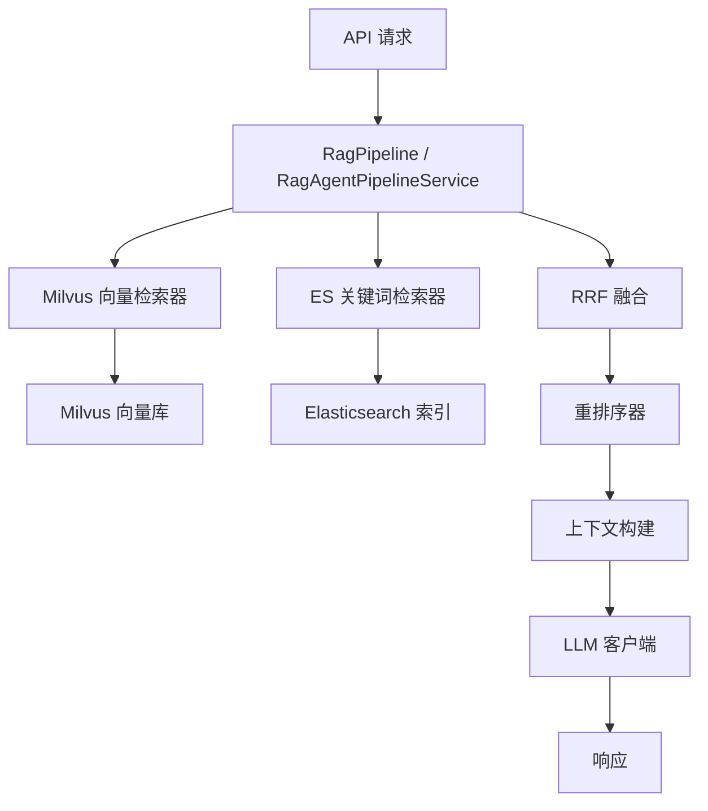
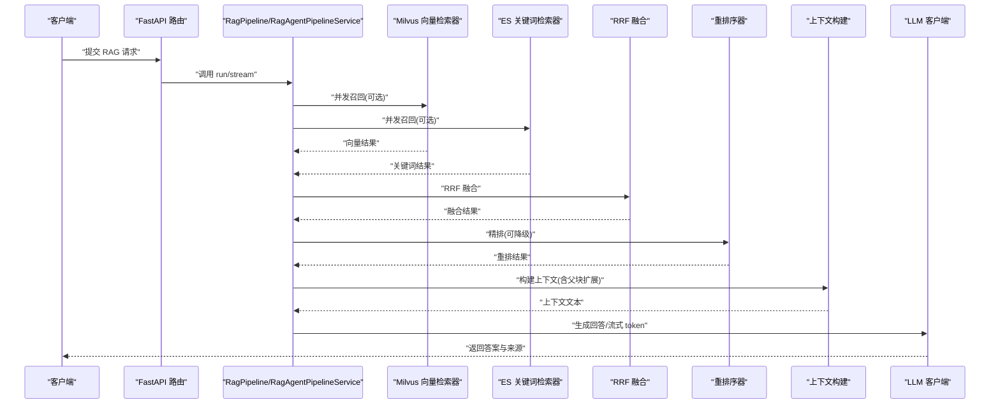
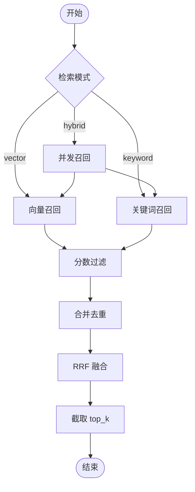
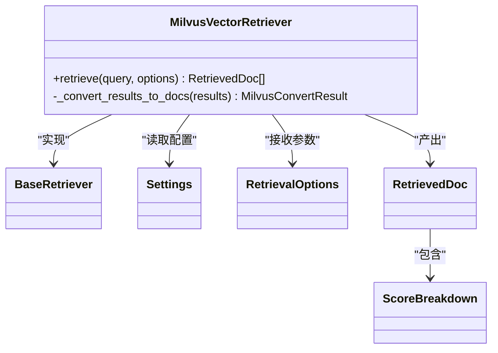
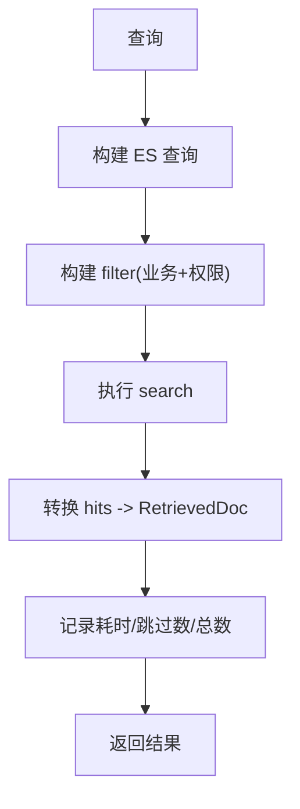
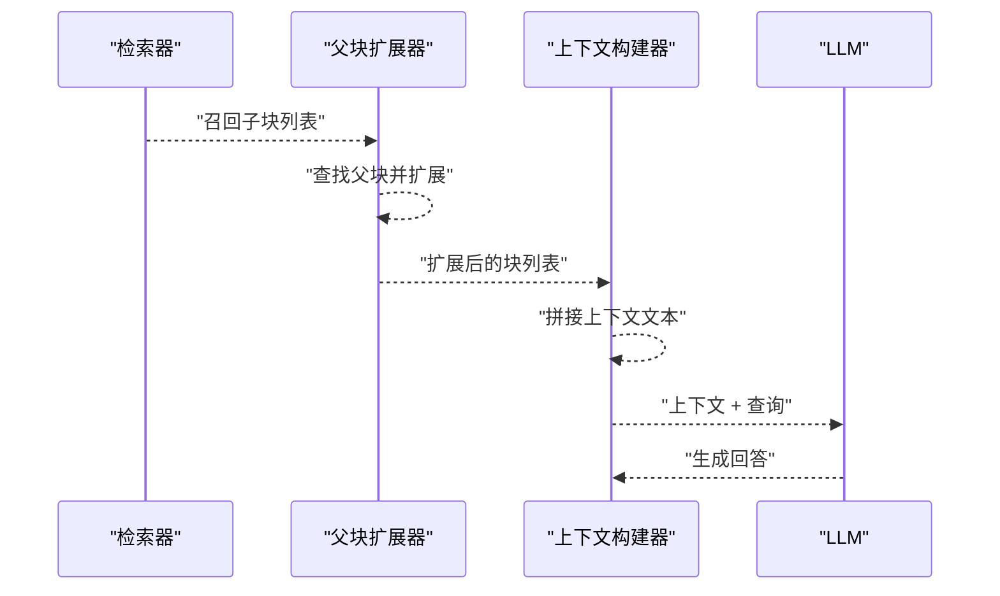
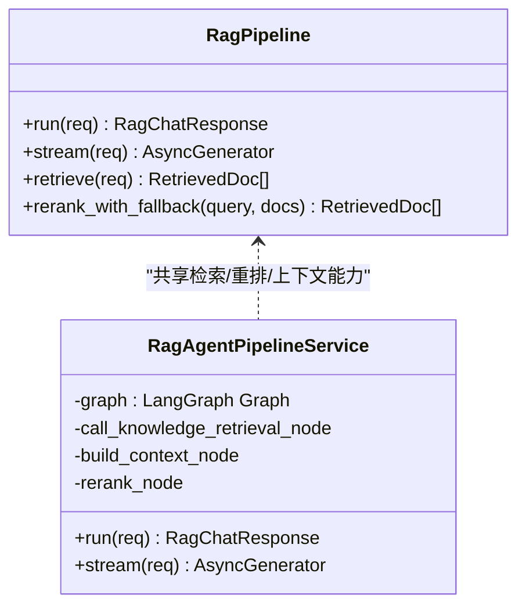

# RAG 检索系统

<cite>
**本文引用的文件**
- [rag_pipeline_service.py](file://src/fast_app/services/rag/rag_pipeline_service.py)
- [retrieval_fusion.py](file://src/fast_app/services/rag/retrieval_fusion.py)
- [milvus_vector_retriever.py](file://src/fast_app/components/retrievers/milvus_vector_retriever.py)
- [elasticsearch_keyword_retriever.py](file://src/fast_app/components/retrievers/elasticsearch_keyword_retriever.py)
- [rag_agent_pipeline_service.py](file://src/fast_app/services/rag/rag_agent_pipeline_service.py)
- [markdown_parent_context.py](file://src/fast_app/services/rag/markdown_parent_context.py)
- [context_builder.py](file://src/app/services/context_builder.py)
- [rag_intro.md](file://src/app/demo_docs/rag_intro.md)
- [rrf_demo.py](file://src/app/rrf_demo.py)
- [20-2-架构图-API-Pipeline-Components-Storage-External-Services.md](file://learning-docs/phase-20/20-2-架构图-API-Pipeline-Components-Storage-External-Services.md)
- [12-3-检索链路日志vector-keyword-rrf-rerank.md](file://learning-docs/phase-12/12-3-检索链路日志vector-keyword-rrf-rerank.md)
- [test_markdown_parent_child.py](file://scripts/tests/ingestion/test_markdown_parent_child.py)
</cite>

## 目录
1. [简介](#简介)
2. [项目结构](#项目结构)
3. [核心组件](#核心组件)
4. [架构总览](#架构总览)
5. [详细组件分析](#详细组件分析)
6. [依赖关系分析](#依赖关系分析)
7. [性能考虑](#性能考虑)
8. [故障排查指南](#故障排查指南)
9. [结论](#结论)
10. [附录：配置与使用示例](#附录：配置与使用示例)

## 简介
本系统实现了一个企业级 RAG（检索增强生成）检索链路，采用“向量检索 + 关键词检索”的混合召回策略，并通过 RRF（倒数秩融合）进行多源结果融合，随后进入重排序、上下文构建与 LLM 生成阶段。系统提供两种 Pipeline 实现：经典流程式 RagPipeline 与基于 LangGraph 的 RagAgentPipelineService，二者共享相同的检索器、重排器与上下文扩展能力。

RAG 质量由多个环节共同决定：Milvus 向量召回、Elasticsearch 关键词召回、RRF 融合、rerank 精排、context 构造、LLM 生成以及 sources 回流。系统在召回阶段即下推权限过滤，确保只召回当前用户可访问的文档；在融合与重排阶段保留多阶段分数，便于评测与可观测性。

**章节来源**
- [rag_intro.md:1-27](file://src/app/demo_docs/rag_intro.md#L1-L27)
- [20-2-架构图-API-Pipeline-Components-Storage-External-Services.md:182-230](file://learning-docs/phase-20/20-2-架构图-API-Pipeline-Components-Storage-External-Services.md#L182-L230)

## 项目结构
RAG 相关代码主要分布在以下模块：
- 服务层：RagPipeline、RagAgentPipelineService，负责编排检索、融合、重排、上下文构建与生成。
- 组件层：MilvusVectorRetriever、ElasticsearchKeywordRetriever，分别实现向量与关键词检索。
- 融合算法：reciprocal_rank_fusion，实现 RRF 融合。
- 上下文扩展：MarkdownParentContextExpander，实现 Parent Context Expansion。
- 旧版演示：context_builder.py 用于简单拼接上下文。



**图表来源**
- [20-2-架构图-API-Pipeline-Components-Storage-External-Services.md:182-230](file://learning-docs/phase-20/20-2-架构图-API-Pipeline-Components-Storage-External-Services.md#L182-L230)

**章节来源**
- [rag_pipeline_service.py:558-626](file://src/fast_app/services/rag/rag_pipeline_service.py#L558-L626)
- [rag_agent_pipeline_service.py:92-195](file://src/fast_app/services/rag/rag_agent_pipeline_service.py#L92-L195)

## 核心组件
- RagPipeline：经典流程式 RAG 编排，支持 vector/keyword/hybrid 模式，具备 rerank 降级、LangSmith 追踪、Prompt Guard 校验、Parent Context Expansion 等能力。
- RagAgentPipelineService：基于 LangGraph 的 Agent 化 RAG，集成对话记忆、查询重写、任务路由与执行、直接回答、澄清、Web/NL2SQL 工具调用等。
- MilvusVectorRetriever：将 query 转为 embedding，构造 Milvus filter（含业务与权限），执行 COSINE 相似度搜索，转换 RetrievedDoc。
- ElasticsearchKeywordRetriever：构造 multi_match 查询，结合 bool.filter 下推权限与业务过滤，转换 RetrievedDoc。
- RRF 融合：对多路召回结果按排名计算倒数秩分数并融合，保留原始最高分与来源集合。
- MarkdownParentContextExpander：根据子块召回结果，向上扩展父块上下文，提升语义连贯性。

**章节来源**
- [rag_pipeline_service.py:558-753](file://src/fast_app/services/rag/rag_pipeline_service.py#L558-L753)
- [rag_agent_pipeline_service.py:92-195](file://src/fast_app/services/rag/rag_agent_pipeline_service.py#L92-L195)
- [milvus_vector_retriever.py:155-337](file://src/fast_app/components/retrievers/milvus_vector_retriever.py#L155-L337)
- [elasticsearch_keyword_retriever.py:210-340](file://src/fast_app/components/retrievers/elasticsearch_keyword_retriever.py#L210-L340)
- [retrieval_fusion.py:8-79](file://src/fast_app/services/rag/retrieval_fusion.py#L8-L79)
- [markdown_parent_context.py](file://src/fast_app/services/rag/markdown_parent_context.py)

## 架构总览
下图展示了从 API 到 LLM 的完整链路，包括检索、融合、重排、上下文构建与生成。



**图表来源**
- [rag_pipeline_service.py:755-800](file://src/fast_app/services/rag/rag_pipeline_service.py#L755-L800)
- [rag_agent_pipeline_service.py:92-195](file://src/fast_app/services/rag/rag_agent_pipeline_service.py#L92-L195)
- [20-2-架构图-API-Pipeline-Components-Storage-External-Services.md:182-230](file://learning-docs/phase-20/20-2-架构图-API-Pipeline-Components-Storage-External-Services.md#L182-L230)

## 详细组件分析

### 混合检索与 RRF 融合
- 混合检索模式会并发执行向量与关键词召回，分别进行分数过滤与合并去重，最终通过 RRF 融合得到统一排序结果。
- RRF 不比较不同检索源的原始分数，而是依据每个检索源内部排名计算倒数秩分数，适合异构检索源（Milvus 与 ES）。



**图表来源**
- [rag_pipeline_service.py:236-328](file://src/fast_app/services/rag/rag_pipeline_service.py#L236-L328)
- [retrieval_fusion.py:8-79](file://src/fast_app/services/rag/retrieval_fusion.py#L8-L79)
- [rrf_demo.py:1-65](file://src/app/rrf_demo.py#L1-L65)

**章节来源**
- [rag_pipeline_service.py:236-328](file://src/fast_app/services/rag/rag_pipeline_service.py#L236-L328)
- [retrieval_fusion.py:8-79](file://src/fast_app/services/rag/retrieval_fusion.py#L8-L79)
- [rrf_demo.py:1-65](file://src/app/rrf_demo.py#L1-L65)

### Milvus 向量检索器
- 将 query 转换为 embedding，校验维度后构造 filter（包含 source_path、section_path、知识版本与权限条件），执行 COSINE 相似度搜索。
- 将 Milvus hits 转换为 RetrievedDoc，记录 skipped_hit_count 以识别脏数据。
- 权限过滤在服务端表达式中完成，避免无权限文档进入候选集。



**图表来源**
- [milvus_vector_retriever.py:155-337](file://src/fast_app/components/retrievers/milvus_vector_retriever.py#L155-L337)

**章节来源**
- [milvus_vector_retriever.py:155-337](file://src/fast_app/components/retrievers/milvus_vector_retriever.py#L155-L337)

### Elasticsearch 关键词检索器
- 构造 multi_match 查询，针对标题、正文等字段加权匹配；通过 bool.filter 下推业务与权限过滤。
- 将 ES hits 转换为 RetrievedDoc，记录 skipped_hit_count 与 total 信息用于观测。
- 排除 markdown_parent 类型参与初始召回，仅用于命中后的安全上下文扩展。



**图表来源**
- [elasticsearch_keyword_retriever.py:176-207](file://src/fast_app/components/retrievers/elasticsearch_keyword_retriever.py#L176-L207)
- [elasticsearch_keyword_retriever.py:227-340](file://src/fast_app/components/retrievers/elasticsearch_keyword_retriever.py#L227-L340)

**章节来源**
- [elasticsearch_keyword_retriever.py:176-207](file://src/fast_app/components/retrievers/elasticsearch_keyword_retriever.py#L176-L207)
- [elasticsearch_keyword_retriever.py:227-340](file://src/fast_app/components/retrievers/elasticsearch_keyword_retriever.py#L227-L340)

### 上下文构建与 Parent Context Expansion
- 上下文构建将召回文档拼接为 LLM 可消费的文本，并为每段上下文附加来源与分数，便于引用与排查。
- Parent Context Expansion 技术：当召回子块时，向上查找其父块内容，扩大上下文范围，提高回答连贯性与完整性。



**图表来源**
- [rag_pipeline_service.py:605-626](file://src/fast_app/services/rag/rag_pipeline_service.py#L605-L626)
- [test_markdown_parent_child.py:241-280](file://scripts/tests/ingestion/test_markdown_parent_child.py#L241-L280)

**章节来源**
- [rag_pipeline_service.py:605-626](file://src/fast_app/services/rag/rag_pipeline_service.py#L605-L626)
- [test_markdown_parent_child.py:241-280](file://scripts/tests/ingestion/test_markdown_parent_child.py#L241-L280)
- [context_builder.py:1-12](file://src/app/services/context_builder.py#L1-L12)

### RagPipeline 与 RagAgentPipelineService 对比
- RagPipeline：经典流程式，步骤清晰，易于观测与调试；支持 rerank 降级、Prompt Guard、LangSmith 追踪。
- RagAgentPipelineService：基于 LangGraph 的 Agent 化流程，集成对话记忆、查询重写、任务路由与执行、直接回答、澄清、Web/NL2SQL 工具调用等，更适合复杂任务分解与多步推理。



**图表来源**
- [rag_pipeline_service.py:558-753](file://src/fast_app/services/rag/rag_pipeline_service.py#L558-L753)
- [rag_agent_pipeline_service.py:92-195](file://src/fast_app/services/rag/rag_agent_pipeline_service.py#L92-L195)

**章节来源**
- [rag_pipeline_service.py:558-753](file://src/fast_app/services/rag/rag_pipeline_service.py#L558-L753)
- [rag_agent_pipeline_service.py:92-195](file://src/fast_app/services/rag/rag_agent_pipeline_service.py#L92-L195)

## 依赖关系分析
- RagPipeline 依赖：Settings、BaseRetriever（向量/关键词）、BaseLLMClient、BaseReranker、PromptGuardService、MarkdownParentContextExpander。
- MilvusVectorRetriever 依赖：EmbeddingClient、MilvusClient、Settings、RetrievalFilters、RetrievedDoc。
- ElasticsearchKeywordRetriever 依赖：AsyncElasticsearch、Settings、RetrievalFilters、RetrievedDoc。
- RRF 融合依赖：RetrievedDoc、ScoreBreakdown。
- RagAgentPipelineService 依赖：LangGraph 节点、对话记忆、查询重写、任务路由/规划/执行、NL2SQL 服务等。

```mermaid
graph LR
Settings --> MilvusVectorRetriever
Settings --> ElasticsearchKeywordRetriever
EmbeddingClient --> MilvusVectorRetriever
MilvusClient --> MilvusVectorRetriever
AsyncElasticsearch --> ElasticsearchKeywordRetriever
RagPipeline --> MilvusVectorRetriever
RagPipeline --> ElasticsearchKeywordRetriever
RagPipeline --> BaseReranker
RagPipeline --> BaseLLMClient
RagPipeline --> PromptGuardService
RagPipeline --> MarkdownParentContextExpander
RagAgentPipelineService --> RagPipeline : "共享能力"
```

**图表来源**
- [rag_pipeline_service.py:558-626](file://src/fast_app/services/rag/rag_pipeline_service.py#L558-L626)
- [milvus_vector_retriever.py:155-337](file://src/fast_app/components/retrievers/milvus_vector_retriever.py#L155-L337)
- [elasticsearch_keyword_retriever.py:210-340](file://src/fast_app/components/retrievers/elasticsearch_keyword_retriever.py#L210-L340)
- [rag_agent_pipeline_service.py:92-195](file://src/fast_app/services/rag/rag_agent_pipeline_service.py#L92-L195)

**章节来源**
- [rag_pipeline_service.py:558-626](file://src/fast_app/services/rag/rag_pipeline_service.py#L558-L626)
- [milvus_vector_retriever.py:155-337](file://src/fast_app/components/retrievers/milvus_vector_retriever.py#L155-L337)
- [elasticsearch_keyword_retriever.py:210-340](file://src/fast_app/components/retrievers/elasticsearch_keyword_retriever.py#L210-L340)
- [rag_agent_pipeline_service.py:92-195](file://src/fast_app/services/rag/rag_agent_pipeline_service.py#L92-L195)

## 性能考虑
- 并发召回：混合模式下并发执行向量与关键词检索，降低端到端延迟。
- 下推过滤：Milvus 与 ES 均在检索阶段应用权限与业务过滤，减少无效候选。
- 慢操作告警：对 Milvus、ES、rerank 等外部调用记录耗时并触发慢操作告警。
- 降级策略：rerank 失败时回退到候选前 k 条，保证可用性。
- 日志与追踪：记录各阶段耗时、命中数、跳过数、top_doc_ids，便于定位瓶颈。

**章节来源**
- [rag_pipeline_service.py:657-753](file://src/fast_app/services/rag/rag_pipeline_service.py#L657-L753)
- [milvus_vector_retriever.py:288-337](file://src/fast_app/components/retrievers/milvus_vector_retriever.py#L288-L337)
- [elasticsearch_keyword_retriever.py:292-340](file://src/fast_app/components/retrievers/elasticsearch_keyword_retriever.py#L292-L340)
- [12-3-检索链路日志vector-keyword-rrf-rerank.md:397-476](file://learning-docs/phase-12/12-3-检索链路日志vector-keyword-rrf-rerank.md#L397-L476)

## 故障排查指南
- 向量维度不匹配：检查 embedding_dim 与实际向量维度，错误会抛出 ExternalServiceError。
- 无结果：检查 min_score、权限过滤、source_path/section_path 是否正确；混合模式下任一源失败不会导致整体失败。
- 脏数据：关注 skipped_hit_count，若大量跳过，检查 Milvus/ES 中 id/content 字段是否缺失。
- 慢查询：查看 slow operation 日志，调整 candidate_k、timeout、filter 复杂度。
- 权限问题：确认 can_read_all、allow_public、department_codes、user_id 是否符合预期。

**章节来源**
- [milvus_vector_retriever.py:215-233](file://src/fast_app/components/retrievers/milvus_vector_retriever.py#L215-L233)
- [rag_pipeline_service.py:255-328](file://src/fast_app/services/rag/rag_pipeline_service.py#L255-L328)
- [elasticsearch_keyword_retriever.py:311-340](file://src/fast_app/components/retrievers/elasticsearch_keyword_retriever.py#L311-L340)

## 结论
本 RAG 检索系统通过混合召回、RRF 融合、重排序与上下文扩展，构建了高召回率与高可用性的问答链路。RagPipeline 与 RagAgentPipelineService 提供了灵活的业务适配能力，支持复杂任务分解与多步推理。系统在生产环境中具备完善的日志、追踪与降级机制，便于性能优化与故障排查。

## 附录：配置与使用示例
- 配置不同的检索策略：
  - 设置 mode 为 vector/keyword/hybrid，控制检索路径。
  - 调整 top_k、candidate_k、min_score 控制召回数量与阈值。
  - 通过 filters 指定 source_path、section_path、knowledge_version、部门与用户权限。
- 处理查询重写：
  - 在 RagAgentPipelineService 中，使用 ConversationQueryRewriter 基于对话历史重写查询，提升召回准确性。
- 管理检索缓存：
  - 可在上层引入 Redis 缓存 query->doc_ids 映射，减少重复检索开销。
- 代码示例路径：
  - RRF 融合示例：[rrf_demo.py:1-65](file://src/app/rrf_demo.py#L1-L65)
  - 混合检索入口：[rag_pipeline_service.py:236-328](file://src/fast_app/services/rag/rag_pipeline_service.py#L236-L328)
  - 向量检索器：[milvus_vector_retriever.py:182-303](file://src/fast_app/components/retrievers/milvus_vector_retriever.py#L182-L303)
  - 关键词检索器：[elasticsearch_keyword_retriever.py:227-309](file://src/fast_app/components/retrievers/elasticsearch_keyword_retriever.py#L227-L309)
  - 父块扩展测试：[test_markdown_parent_child.py:241-280](file://scripts/tests/ingestion/test_markdown_parent_child.py#L241-L280)

**章节来源**
- [rrf_demo.py:1-65](file://src/app/rrf_demo.py#L1-L65)
- [rag_pipeline_service.py:236-328](file://src/fast_app/services/rag/rag_pipeline_service.py#L236-L328)
- [milvus_vector_retriever.py:182-303](file://src/fast_app/components/retrievers/milvus_vector_retriever.py#L182-L303)
- [elasticsearch_keyword_retriever.py:227-309](file://src/fast_app/components/retrievers/elasticsearch_keyword_retriever.py#L227-L309)
- [test_markdown_parent_child.py:241-280](file://scripts/tests/ingestion/test_markdown_parent_child.py#L241-L280)