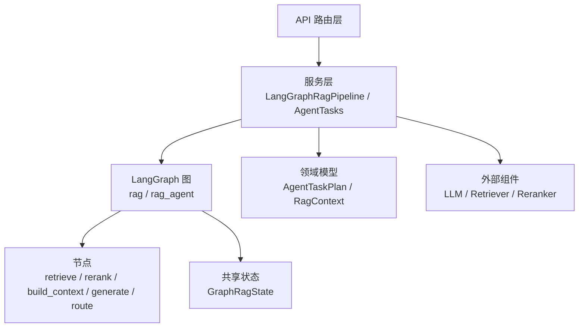
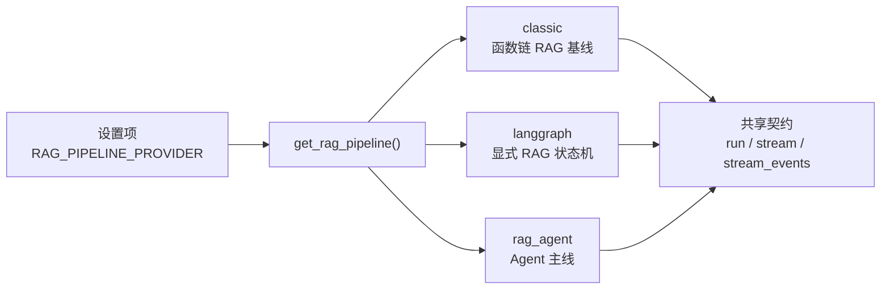
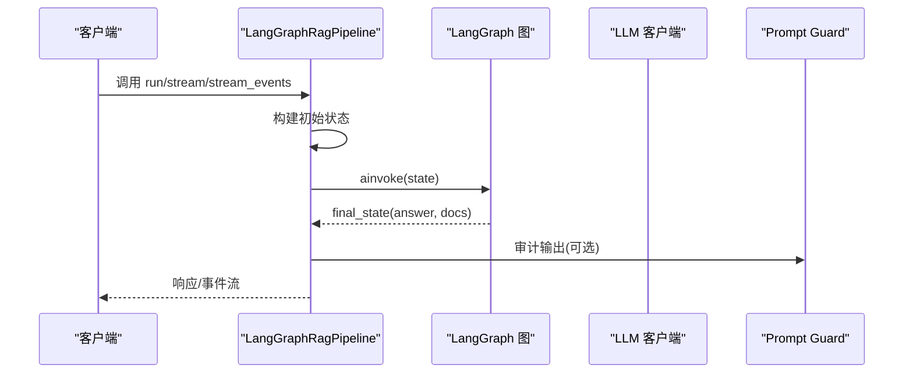
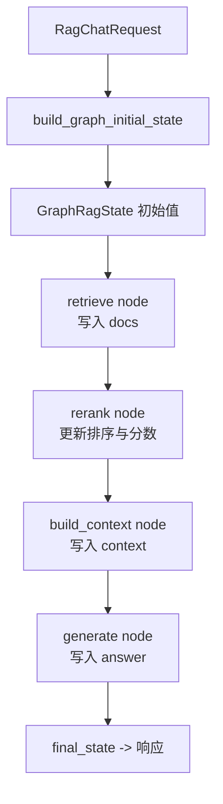
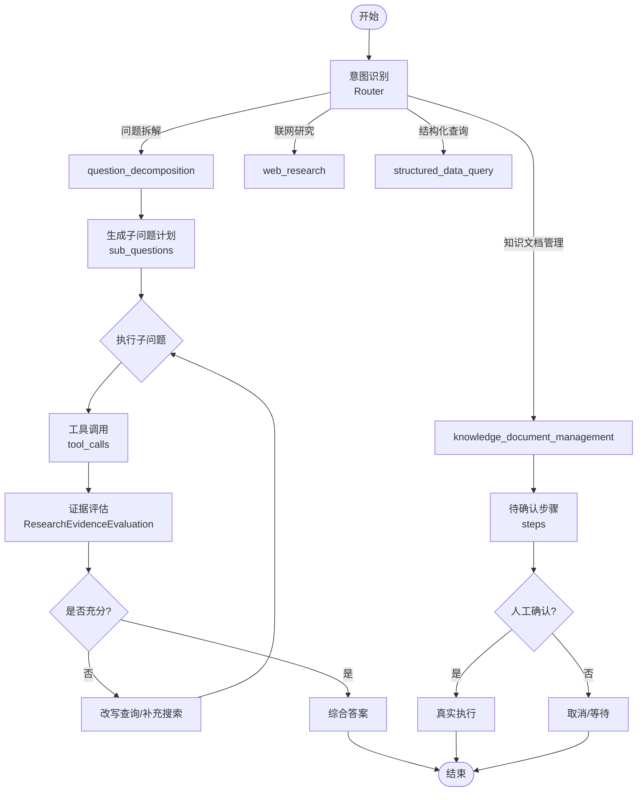
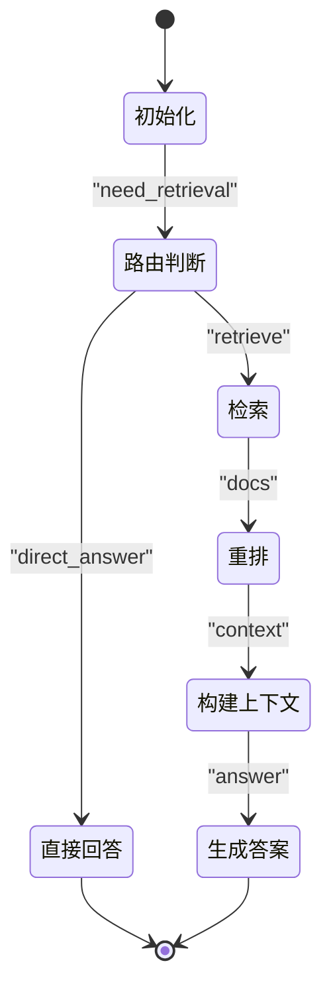
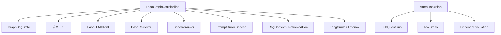

# Agent Pipeline 管道

<cite>
**本文引用的文件**
- [langgraph_rag_pipeline_service.py](file://python-agent-study/src/fast_app/services/rag/langgraph_rag_pipeline_service.py)
- [rag_graph_state.py](file://python-agent-study/src/fast_app/graph/rag/rag_graph_state.py)
- [agent_task_plan.py](file://python-agent-study/src/fast_app/domain/agent_task_plan.py)
- [20-2-架构图-API-Pipeline-Components-Storage-External-Services.md](file://python-agent-study/learning-docs/phase-20/20-2-架构图-API-Pipeline-Components-Storage-External-Services.md)
- [13-1-LangGraph-state重新梳理.md](file://python-agent-study/learning-docs/phase-13/13-1-LangGraph-state重新梳理.md)
- [13-11-RAG-Agent-先判断再检索再回答.md](file://python-agent-study/learning-docs/phase-13/13-11-RAG-Agent-先判断再检索再回答.md)
- [多轮上下文存在的缺陷.md](file://python-agent-study/scripts/docs/多轮上下文存在的缺陷.md)
- [未完成功能-1-实现方案 + 模块讲解.md](file://python-agent-study/scripts/docs/未完成功能-1-实现方案 + 模块讲解.md)
- [test_agent_task_router.py](file://python-agent-study/scripts/tests/agent_research/test_agent_task_router.py)
- [agent_task_router.py](file://python-agent-study/src/fast_app/services/agent_tasks/agent_task_router.py)
</cite>

## 目录
1. [简介](#简介)
2. [项目结构](#项目结构)
3. [核心组件](#核心组件)
4. [架构总览](#架构总览)
5. [详细组件分析](#详细组件分析)
6. [依赖关系分析](#依赖关系分析)
7. [性能考量](#性能考量)
8. [故障排查指南](#故障排查指南)
9. [结论](#结论)
10. [附录：使用示例与最佳实践](#附录使用示例与最佳实践)

## 简介
本文件面向“Agent Pipeline 管道”的设计与实现，重点解释 RagAgentPipelineService（在工程中通过 LangGraphRagPipeline 与 build_rag_agent 组合体现）的设计理念、与传统 RAG Pipeline 的区别与优势，并系统说明 Agent 工作流的编排机制：意图识别、任务分解、工具调用与结果聚合。同时给出与 LangGraph 的集成方式、状态管理机制、节点间数据流转，以及配置、自定义工具和多步骤任务处理的实践建议。

## 项目结构
当前工程采用分层与按能力域组织的方式：
- graph：定义 LangGraph 的状态与节点，包括 rag 与 rag_agent 等子图。
- services：封装各业务服务，如 rag、agent_tasks、research 等。
- domain：领域模型，如 agent_task_plan、rag_models 等。
- components：可插拔的外部组件，如 LLM、Retriever、Reranker、Embedding 等。
- api：HTTP 路由层，暴露 /rag/chat、/agent/task-plan 等接口。
- learning-docs 与 scripts：学习文档与测试脚本，用于验证与复盘。

图表来源
- [langgraph_rag_pipeline_service.py:47-97](file://python-agent-study/src/fast_app/services/rag/langgraph_rag_pipeline_service.py#L47-L97)
- [rag_graph_state.py:15-64](file://python-agent-study/src/fast_app/graph/rag/rag_graph_state.py#L15-L64)

章节来源
- [20-2-架构图-API-Pipeline-Components-Storage-External-Services.md:105-132](file://python-agent-study/learning-docs/phase-20/20-2-架构图-API-Pipeline-Components-Storage-External-Services.md#L105-L132)

## 核心组件
- LangGraphRagPipeline：统一入口，提供 run/stream/stream_events 三种执行模式；负责初始化状态、组装节点、追踪与审计、错误处理与慢操作告警。
- GraphRagState：LangGraph 节点共享的状态载体，明确区分请求输入、运行控制、中间结果字段，为条件边与工具节点提供决策依据。
- AgentTaskPlan：描述复杂问题的多步骤计划，包含问题拆解、工具步骤、证据评估与最终输出摘要。
- 节点工厂：create_retrieve_node、create_rerank_node、create_build_context_node、create_route_query_node、create_direct_answer_node，将外部组件与业务逻辑解耦。
- 流式安全：GuardedStreamState 与 guarded_answer_delta_events，对输出进行内容安全审计与分块保护。

章节来源
- [langgraph_rag_pipeline_service.py:47-97](file://python-agent-study/src/fast_app/services/rag/langgraph_rag_pipeline_service.py#L47-L97)
- [rag_graph_state.py:15-64](file://python-agent-study/src/fast_app/graph/rag/rag_graph_state.py#L15-L64)
- [agent_task_plan.py:26-343](file://python-agent-study/src/fast_app/domain/agent_task_plan.py#L26-L343)

## 架构总览
三条 Provider 的职责区别：classic（函数链基线）、langgraph（显式状态机）、rag_agent（Agent 判断、工具调用、循环控制、错误分支）。当前工程以 langgraph 为主线，并通过 build_rag_agent 装配 Agent 图，形成“先判断再检索再回答”的闭环。

图表来源
- [20-2-架构图-API-Pipeline-Components-Storage-External-Services.md:105-132](file://python-agent-study/learning-docs/phase-20/20-2-架构图-API-Pipeline-Components-Storage-External-Services.md#L105-L132)

章节来源
- [20-2-架构图-API-Pipeline-Components-Storage-External-Services.md:105-132](file://python-agent-study/learning-docs/phase-20/20-2-架构图-API-Pipeline-Components-Storage-External-Services.md#L105-L132)

## 详细组件分析

### LangGraphRagPipeline：统一执行入口
- 职责：构造初始状态、调用图执行、流式生成、事件分发、LangSmith 追踪、Prompt Guard 审计、慢操作日志。
- 关键流程：
  - run：一次性返回 answer + sources。
  - stream：仅 token 流式输出，支持 direct_answer 短路。
  - stream_events：先 emit sources，再流式 emit answer delta，支持 Prompt Guard 缓冲或实时模式。

图表来源
- [langgraph_rag_pipeline_service.py:138-236](file://python-agent-study/src/fast_app/services/rag/langgraph_rag_pipeline_service.py#L138-L236)
- [langgraph_rag_pipeline_service.py:250-377](file://python-agent-study/src/fast_app/services/rag/langgraph_rag_pipeline_service.py#L250-L377)
- [langgraph_rag_pipeline_service.py:379-573](file://python-agent-study/src/fast_app/services/rag/langgraph_rag_pipeline_service.py#L379-L573)

章节来源
- [langgraph_rag_pipeline_service.py:138-236](file://python-agent-study/src/fast_app/services/rag/langgraph_rag_pipeline_service.py#L138-L236)
- [langgraph_rag_pipeline_service.py:250-377](file://python-agent-study/src/fast_app/services/rag/langgraph_rag_pipeline_service.py#L250-L377)
- [langgraph_rag_pipeline_service.py:379-573](file://python-agent-study/src/fast_app/services/rag/langgraph_rag_pipeline_service.py#L379-L573)

### GraphRagState：节点共享状态
- 字段分类：
  - 请求输入：query、mode、top_k、candidate_k、min_score、filters。
  - 运行控制：operation、need_retrieval、route、route_reason、tool_name、tool_result_count、tool_error。
  - 中间结果：docs、context、answer。
- 作用：作为节点间传递数据的“任务数据包”，避免重复读取外部存储，保证一次请求内上下文一致。

图表来源
- [rag_graph_state.py:15-64](file://python-agent-study/src/fast_app/graph/rag/rag_graph_state.py#L15-L64)
- [13-1-LangGraph-state重新梳理.md:169-194](file://python-agent-study/learning-docs/phase-13/13-1-LangGraph-state重新梳理.md#L169-L194)

章节来源
- [rag_graph_state.py:15-64](file://python-agent-study/src/fast_app/graph/rag/rag_graph_state.py#L15-L64)
- [13-1-LangGraph-state重新梳理.md:169-194](file://python-agent-study/learning-docs/phase-13/13-1-LangGraph-state重新梳理.md#L169-L194)

### Agent 工作流编排：意图识别、任务分解、工具调用、结果聚合
- 意图识别：基于 query 与规则/结构化 Router，决定进入 knowledge_document_management、question_decomposition、web_research、structured_data_query 等路径。
- 任务分解：对复杂问题生成 sub_questions，记录目的、依赖、信息来源建议与期望证据。
- 工具调用：每个子问题可能触发多次工具调用，记录 tool_calls 轨迹与状态。
- 结果聚合：子问题答案与证据汇总到 final_output，必要时进行综合推理。

图表来源
- [agent_task_plan.py:26-343](file://python-agent-study/src/fast_app/domain/agent_task_plan.py#L26-L343)
- [未完成功能-1-实现方案 + 模块讲解.md:4132-4169](file://python-agent-study/scripts/docs/未完成功能-1-实现方案 + 模块讲解.md#L4132-L4169)
- [test_agent_task_router.py:233-263](file://python-agent-study/scripts/tests/agent_research/test_agent_task_router.py#L233-L263)
- [agent_task_router.py:334-370](file://python-agent-study/src/fast_app/services/agent_tasks/agent_task_router.py#L334-L370)

章节来源
- [agent_task_plan.py:26-343](file://python-agent-study/src/fast_app/domain/agent_task_plan.py#L26-L343)
- [未完成功能-1-实现方案 + 模块讲解.md:4132-4169](file://python-agent-study/scripts/docs/未完成功能-1-实现方案 + 模块讲解.md#L4132-L4169)
- [test_agent_task_router.py:233-263](file://python-agent-study/scripts/tests/agent_research/test_agent_task_router.py#L233-L263)
- [agent_task_router.py:334-370](file://python-agent-study/src/fast_app/services/agent_tasks/agent_task_router.py#L334-L370)

### 与传统 RAG Pipeline 的区别与优势
- 传统 RAG：固定顺序函数链（retrieve → rerank → build_context → generate），适合简单问答。
- Agent RAG：具备决策与纠错闭环（规划 → 选择数据源 → 检索 → 评估证据 → 改写查询/更换数据源 → 再检索 → 综合 → 生成），能动态调整策略，提升答案质量与鲁棒性。
- 优势：
  - 更强的意图理解与路由能力。
  - 支持多步任务与工具调用。
  - 证据评估与改写循环，减少幻觉与不足。
  - 可观测性强，便于调试与优化。

章节来源
- [13-11-RAG-Agent-先判断再检索再回答.md:891-941](file://python-agent-study/learning-docs/phase-13/13-11-RAG-Agent-先判断再检索再回答.md#L891-L941)

### 与 LangGraph 的集成：状态管理与节点间数据流转
- 状态管理：所有节点读写同一 GraphRagState，节点返回的是 state update，而非完整 state。
- 数据流转：从 retrieve 产生 docs，rerank 更新排序，build_context 生成 context，generate 产出 answer；条件边根据 need_retrieval/route 等字段决定走向。
- 多轮上下文：历史消息在请求开始时读取一次并放入 State，后续节点选择性读取，避免重复 I/O 与不一致。

图表来源
- [13-1-LangGraph-state重新梳理.md:169-194](file://python-agent-study/learning-docs/phase-13/13-1-LangGraph-state重新梳理.md#L169-L194)
- [多轮上下文存在的缺陷.md:440-513](file://python-agent-study/scripts/docs/多轮上下文存在的缺陷.md#L440-L513)

章节来源
- [13-1-LangGraph-state重新梳理.md:169-194](file://python-agent-study/learning-docs/phase-13/13-1-LangGraph-state重新梳理.md#L169-L194)
- [多轮上下文存在的缺陷.md:440-513](file://python-agent-study/scripts/docs/多轮上下文存在的缺陷.md#L440-L513)

## 依赖关系分析
- LangGraphRagPipeline 依赖：
  - 组件：BaseRetriever、BaseReranker、BaseLLMClient、PromptGuardService、MarkdownParentContextExpander。
  - 图与节点：build_rag_agent、create_*_node。
  - 状态：GraphRagState、build_graph_initial_state。
  - 领域模型：RagContext、RetrievedDoc。
  - 追踪与审计：LangSmith、Prompt Guard。
- AgentTaskPlan 依赖：
  - 子问题、工具步骤、证据评估、最终输出等结构化模型，支撑复杂任务的全生命周期管理。

图表来源
- [langgraph_rag_pipeline_service.py:47-97](file://python-agent-study/src/fast_app/services/rag/langgraph_rag_pipeline_service.py#L47-L97)
- [agent_task_plan.py:26-343](file://python-agent-study/src/fast_app/domain/agent_task_plan.py#L26-L343)

章节来源
- [langgraph_rag_pipeline_service.py:47-97](file://python-agent-study/src/fast_app/services/rag/langgraph_rag_pipeline_service.py#L47-L97)
- [agent_task_plan.py:26-343](file://python-agent-study/src/fast_app/domain/agent_task_plan.py#L26-L343)

## 性能考量
- 流式输出优先：stream 与 stream_events 降低首字延迟，提升用户体验。
- 条件边短路：direct_answer 跳过检索与生成，减少不必要开销。
- 缓存与复用：Graph 结构在构造时装配一次，每次请求仅变化 initial_state。
- 慢操作监控：log_slow_operation 标记 pipeline、stream、stream_events 的耗时阈值。
- 证据评估与改写：避免无效检索与低质生成，提高整体吞吐与质量。

[本节为通用性能建议，不直接分析具体文件]

## 故障排查指南
- 常见问题定位：
  - 无检索结果：检查 need_retrieval 与 route 字段，确认路由逻辑是否正确。
  - 工具失败：查看 tool_error、tool_result_count，结合 tool_calls 轨迹定位失败点。
  - 上下文为空：stream 与 stream_events 在 context 为空时抛出异常，需检查 retrieve/rerank/build_context 链路。
  - 流式输出被拦截：检查 Prompt Guard 的 blocked 标志与审计日志。
- 日志与追踪：
  - 使用 LangSmith 步骤追踪，关注 step_name、step_index、inputs/outputs。
  - 慢操作日志包含 latency_ms、pipeline_provider、status、error_type 等关键字段。

章节来源
- [langgraph_rag_pipeline_service.py:138-236](file://python-agent-study/src/fast_app/services/rag/langgraph_rag_pipeline_service.py#L138-L236)
- [langgraph_rag_pipeline_service.py:250-377](file://python-agent-study/src/fast_app/services/rag/langgraph_rag_pipeline_service.py#L250-L377)
- [langgraph_rag_pipeline_service.py:379-573](file://python-agent-study/src/fast_app/services/rag/langgraph_rag_pipeline_service.py#L379-L573)

## 结论
Agent Pipeline 通过 LangGraph 的状态机与节点化编排，实现了从“固定顺序 RAG”向“可决策、可纠错、可观测”的 Agentic RAG 演进。其核心在于清晰的 GraphRagState、灵活的 Router 与 Planner、严格的工具调用轨迹与证据评估，以及统一的流式与安全审计机制。相比传统 RAG，Agent Pipeline 更适合复杂多步骤任务与高质量答案生成场景。

[本节为总结性内容，不直接分析具体文件]

## 附录：使用示例与最佳实践
- 配置 Agent Pipeline：
  - 设置 RAG_PIPELINE_PROVIDER=rag_agent 或 langgraph，确保 get_rag_pipeline() 返回对应实现。
  - 在 LangGraphRagPipeline 中注入 retriever、reranker、llm_client、prompt_guard、parent_expander。
- 定义自定义工具：
  - 遵循 AgentTaskToolCallTrace 的结构，记录 tool_name、tool_input、tool_output、status、error、reason。
  - 在工具节点中更新 GraphRagState 的 tool_name、tool_result_count、tool_error 等字段，供后续路由与评估使用。
- 实现复杂多步骤任务：
  - 使用 AgentTaskPlan 的 question_decomposition 或 knowledge_document_management 类型，生成 sub_questions 或 steps。
  - 结合 ResearchEvidenceEvaluation 进行证据充分性评估，必要时 rewrite_local_query 或 search_web。
  - 通过 final_output 聚合子问题答案与工具轨迹，供前端展示与审计。

章节来源
- [20-2-架构图-API-Pipeline-Components-Storage-External-Services.md:105-132](file://python-agent-study/learning-docs/phase-20/20-2-架构图-API-Pipeline-Components-Storage-External-Services.md#L105-L132)
- [agent_task_plan.py:26-343](file://python-agent-study/src/fast_app/domain/agent_task_plan.py#L26-L343)
- [未完成功能-1-实现方案 + 模块讲解.md:4132-4169](file://python-agent-study/scripts/docs/未完成功能-1-实现方案 + 模块讲解.md#L4132-L4169)