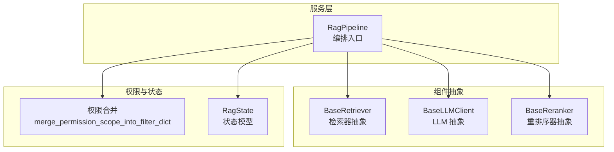
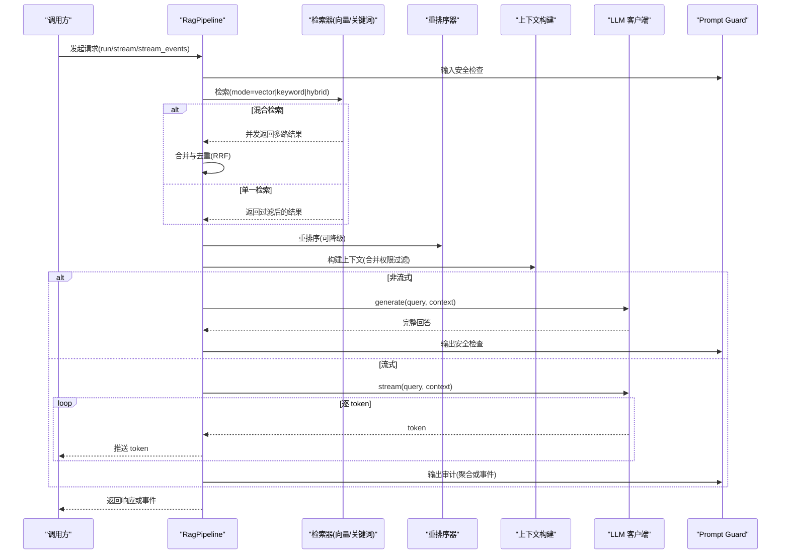
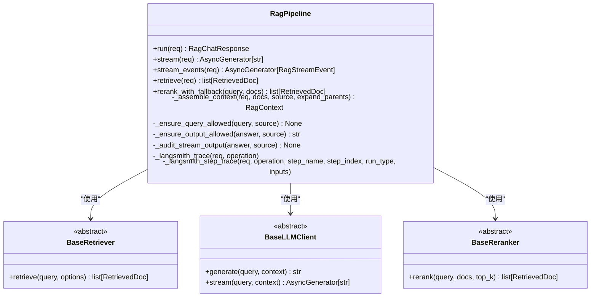
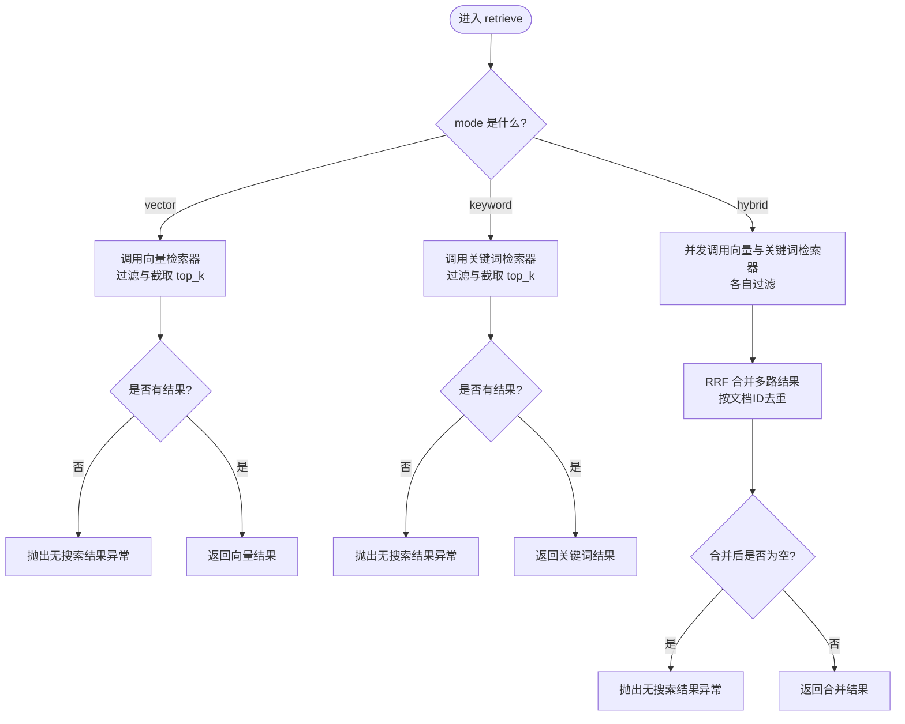
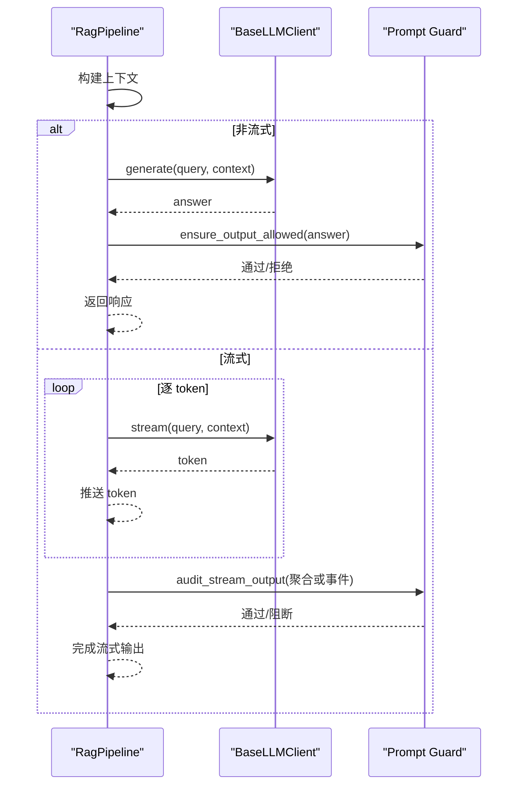
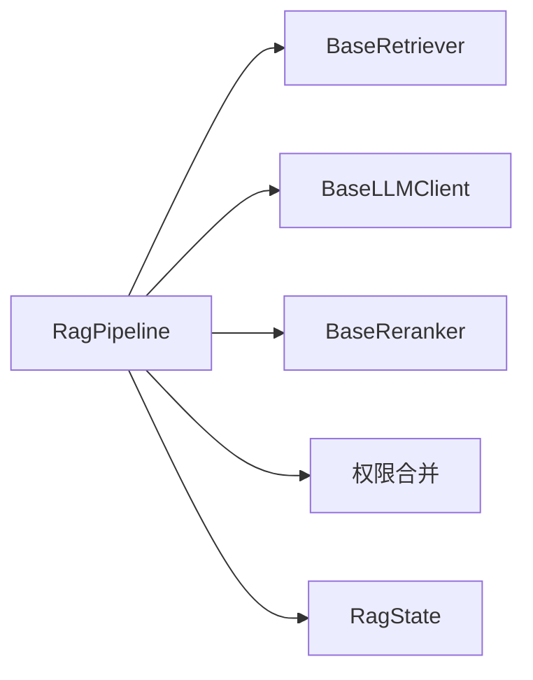

# Classic Pipeline 管道

<cite>
**本文引用的文件**
- [rag_pipeline_service.py](file://src/fast_app/services/rag/rag_pipeline_service.py)
- [base.py（检索器抽象）](file://src/fast_app/components/retrievers/base.py)
- [base.py（LLM 客户端抽象）](file://src/fast_app/components/llms/base.py)
- [base.py（重排序器抽象）](file://src/fast_app/components/rerankers/base.py)
- [knowledge_permission_policy.py](file://src/fast_app/services/knowledge/knowledge_permission_policy.py)
- [rag_state.py](file://src/fast_app/graph/rag/rag_state.py)
</cite>

## 目录
1. [简介](#简介)
2. [项目结构](#项目结构)
3. [核心组件](#核心组件)
4. [架构总览](#架构总览)
5. [详细组件分析](#详细组件分析)
6. [依赖关系分析](#依赖关系分析)
7. [性能考量](#性能考量)
8. [故障排查指南](#故障排查指南)
9. [结论](#结论)
10. [附录：配置与使用示例](#附录配置与使用示例)

## 简介
Classic Pipeline 是本项目中用于 RAG（检索增强生成）的“经典”编排管线。它把一次请求拆分为稳定、可观测的步骤：检索、重排序、上下文构建、LLM 调用与输出安全审计，并支持普通回答与流式回答两种模式。其混合检索在向量检索与关键词检索之间并行执行，通过倒数排名融合（RRF）合并结果并按文档 ID 去重；重排序器具备降级策略，确保外部服务异常时不影响主链路可用性；权限过滤在服务端侧注入，Prompt Guard 提供输入/输出安全检查；LangSmith 追踪贯穿各步骤，便于端到端可观测性。

## 项目结构
Classic Pipeline 的核心位于服务层，围绕 RagPipeline 类组织，并通过抽象接口与检索器、重排序器、LLM 客户端解耦。权限合并逻辑位于知识权限策略模块，状态模型用于模拟后续 LangGraph 的状态流转。

图表来源
- [rag_pipeline_service.py:558-655](file://src/fast_app/services/rag/rag_pipeline_service.py#L558-L655)
- [base.py（检索器抽象）:6-13](file://src/fast_app/components/retrievers/base.py#L6-L13)
- [base.py（LLM 客户端抽象）:9-26](file://src/fast_app/components/llms/base.py#L9-L26)
- [base.py（重排序器抽象）:6-14](file://src/fast_app/components/rerankers/base.py#L6-L14)
- [knowledge_permission_policy.py:87-112](file://src/fast_app/services/knowledge/knowledge_permission_policy.py#L87-L112)
- [rag_state.py:1-11](file://src/fast_app/graph/rag/rag_state.py#L1-L11)

章节来源
- [rag_pipeline_service.py:558-655](file://src/fast_app/services/rag/rag_pipeline_service.py#L558-L655)
- [base.py（检索器抽象）:6-13](file://src/fast_app/components/retrievers/base.py#L6-L13)
- [base.py（LLM 客户端抽象）:9-26](file://src/fast_app/components/llms/base.py#L9-L26)
- [base.py（重排序器抽象）:6-14](file://src/fast_app/components/rerankers/base.py#L6-L14)
- [knowledge_permission_policy.py:87-112](file://src/fast_app/services/knowledge/knowledge_permission_policy.py#L87-L112)
- [rag_state.py:1-11](file://src/fast_app/graph/rag/rag_state.py#L1-L11)

## 核心组件
- RagPipeline：负责一次 RAG 请求的完整编排，包括检索、重排序、上下文构建、LLM 调用、流式输出与安全审计。
- BaseRetriever：定义检索器的统一接口，支持向量检索与关键词检索的具体实现。
- BaseLLMClient：定义 LLM 的统一接口，支持同步生成与流式 token 输出。
- BaseReranker：定义重排序器的统一接口，对候选文档进行二次排序。
- 权限合并：将服务端权限 scope 注入到检索 filters，避免客户端伪造权限。
- 状态模型：RagState 用于在流程中传递 query、docs、context、answer。

章节来源
- [rag_pipeline_service.py:558-655](file://src/fast_app/services/rag/rag_pipeline_service.py#L558-L655)
- [base.py（检索器抽象）:6-13](file://src/fast_app/components/retrievers/base.py#L6-L13)
- [base.py（LLM 客户端抽象）:9-26](file://src/fast_app/components/llms/base.py#L9-L26)
- [base.py（重排序器抽象）:6-14](file://src/fast_app/components/rerankers/base.py#L6-L14)
- [knowledge_permission_policy.py:87-112](file://src/fast_app/services/knowledge/knowledge_permission_policy.py#L87-L112)
- [rag_state.py:1-11](file://src/fast_app/graph/rag/rag_state.py#L1-L11)

## 架构总览
Classic Pipeline 的端到端流程如下：
- 输入校验与安全：Prompt Guard 检查用户输入是否允许。
- 检索：根据 mode 选择向量检索、关键词检索或混合检索；混合检索并发执行并合并去重。
- 重排序：尝试调用重排序器，失败则降级为原始候选列表的前 top_k。
- 上下文构建：将召回文档组装为 LLM 可用的上下文，同时合并权限过滤。
- 生成：调用 LLM 生成回答；流式模式下以异步生成器返回 token。
- 输出安全：对最终答案进行 Prompt Guard 审计（非流式直接审计，流式按事件或聚合审计）。
- 追踪：每个阶段通过 LangSmith 记录步骤级 trace。

图表来源
- [rag_pipeline_service.py:755-958](file://src/fast_app/services/rag/rag_pipeline_service.py#L755-L958)
- [rag_pipeline_service.py:961-1093](file://src/fast_app/services/rag/rag_pipeline_service.py#L961-L1093)
- [rag_pipeline_service.py:1096-1451](file://src/fast_app/services/rag/rag_pipeline_service.py#L1096-L1451)
- [rag_pipeline_service.py:1454-1617](file://src/fast_app/services/rag/rag_pipeline_service.py#L1454-L1617)

## 详细组件分析

### RagPipeline 类：编排与流控
- 职责：
  - 根据请求模式选择检索方式，执行检索、过滤、合并与去重。
  - 调用重排序器并进行降级处理。
  - 构建 LLM 上下文，合并权限过滤。
  - 调用 LLM 生成回答，支持普通与流式两种模式。
  - 对输入与输出进行 Prompt Guard 安全检查。
  - 通过 LangSmith 记录步骤级追踪。
- 关键方法：
  - run：非流式完整流程，返回结构化响应。
  - stream：流式 token 输出。
  - stream_events：流式事件输出，先发射 sources，再流式生成答案。
  - retrieve：检索入口，支持 vector/keyword/hybrid 三种模式。
  - rerank_with_fallback：重排序降级策略。
  - _assemble_context：上下文构建，合并权限过滤。
  - _ensure_query_allowed/_ensure_output_allowed/_audit_stream_output：Prompt Guard 集成。
  - _langsmith_trace/_langsmith_step_trace：LangSmith 追踪封装。

图表来源
- [rag_pipeline_service.py:558-655](file://src/fast_app/services/rag/rag_pipeline_service.py#L558-L655)
- [rag_pipeline_service.py:755-958](file://src/fast_app/services/rag/rag_pipeline_service.py#L755-L958)
- [rag_pipeline_service.py:961-1093](file://src/fast_app/services/rag/rag_pipeline_service.py#L961-L1093)
- [rag_pipeline_service.py:1096-1451](file://src/fast_app/services/rag/rag_pipeline_service.py#L1096-L1451)
- [rag_pipeline_service.py:1454-1617](file://src/fast_app/services/rag/rag_pipeline_service.py#L1454-L1617)
- [base.py（检索器抽象）:6-13](file://src/fast_app/components/retrievers/base.py#L6-L13)
- [base.py（LLM 客户端抽象）:9-26](file://src/fast_app/components/llms/base.py#L9-L26)
- [base.py（重排序器抽象）:6-14](file://src/fast_app/components/rerankers/base.py#L6-L14)

章节来源
- [rag_pipeline_service.py:558-655](file://src/fast_app/services/rag/rag_pipeline_service.py#L558-L655)
- [rag_pipeline_service.py:755-958](file://src/fast_app/services/rag/rag_pipeline_service.py#L755-L958)
- [rag_pipeline_service.py:961-1093](file://src/fast_app/services/rag/rag_pipeline_service.py#L961-L1093)
- [rag_pipeline_service.py:1096-1451](file://src/fast_app/services/rag/rag_pipeline_service.py#L1096-L1451)
- [rag_pipeline_service.py:1454-1617](file://src/fast_app/services/rag/rag_pipeline_service.py#L1454-L1617)

### 检索节点：混合检索的实现机制
- 模式选择：
  - vector：仅调用向量检索器，按 min_score 过滤后取 top_k。
  - keyword：仅调用关键词检索器，按 mode 与 min_score 过滤后取 top_k。
  - hybrid：并发调用向量与关键词检索器，分别过滤后合并。
- 合并与去重：
  - 使用倒数排名融合（RRF）对多路结果进行合并，按分数从高到低排序。
  - 基于文档 ID 去重，保证唯一性。
- 错误处理：
  - 若所有召回源均失败，抛出外部服务异常。
  - 若任一源成功但结果为空，抛出无搜索结果异常。
- 日志与慢操作告警：
  - 记录每路检索的开始/结束、耗时、候选数、过滤后数量、返回数量等。
  - 对慢检索进行阈值告警。

图表来源
- [rag_pipeline_service.py:1096-1451](file://src/fast_app/services/rag/rag_pipeline_service.py#L1096-L1451)

章节来源
- [rag_pipeline_service.py:1096-1451](file://src/fast_app/services/rag/rag_pipeline_service.py#L1096-L1451)

### 上下文构建与权限过滤
- 权限合并：
  - 将服务端权限 scope 与请求 filters 合并，确保权限字段不可由客户端伪造。
  - 支持 knowledge_version 等版本控制字段注入。
- 上下文组装：
  - 将召回文档转换为 LLM 可用的上下文文本与结构化文档列表。
  - 支持父上下文扩展（在非流式场景默认启用，流式场景关闭以提升性能）。
- 安全审计：
  - 在上下文构建过程中可结合 Prompt Guard 进行内容审计。

章节来源
- [knowledge_permission_policy.py:87-112](file://src/fast_app/services/knowledge/knowledge_permission_policy.py#L87-L112)
- [rag_pipeline_service.py:605-626](file://src/fast_app/services/rag/rag_pipeline_service.py#L605-L626)

### LLM 调用与流式输出
- 非流式：
  - 调用 LLM 的 generate 方法，传入 query 与上下文，得到完整回答。
  - 对回答进行输出安全检查。
- 流式：
  - 调用 LLM 的 stream 方法，以异步生成器逐 token 返回。
  - 统计 token 数量，并在完成后进行输出审计。
- 流式事件：
  - 先发射 sources 事件，再流式生成答案。
  - 支持按 chunk 的安全审计与阻断标记。

图表来源
- [rag_pipeline_service.py:755-958](file://src/fast_app/services/rag/rag_pipeline_service.py#L755-L958)
- [rag_pipeline_service.py:961-1093](file://src/fast_app/services/rag/rag_pipeline_service.py#L961-L1093)
- [rag_pipeline_service.py:1454-1617](file://src/fast_app/services/rag/rag_pipeline_service.py#L1454-L1617)
- [base.py（LLM 客户端抽象）:9-26](file://src/fast_app/components/llms/base.py#L9-L26)

章节来源
- [rag_pipeline_service.py:755-958](file://src/fast_app/services/rag/rag_pipeline_service.py#L755-L958)
- [rag_pipeline_service.py:961-1093](file://src/fast_app/services/rag/rag_pipeline_service.py#L961-L1093)
- [rag_pipeline_service.py:1454-1617](file://src/fast_app/services/rag/rag_pipeline_service.py#L1454-L1617)
- [base.py（LLM 客户端抽象）:9-26](file://src/fast_app/components/llms/base.py#L9-L26)

### 重排序器的降级处理机制
- 正常路径：
  - 调用重排序器对候选文档进行二次排序，记录耗时、候选数、结果数与 top_doc_ids。
  - 记录慢操作告警。
- 降级路径：
  - 当重排序器抛出外部服务异常时，回退为原始候选列表的前 top_k。
  - 记录降级事件与错误类型，确保主链路不受影响。
- 快照记录：
  - 无论成功或降级，均记录检索阶段快照，便于评测与回溯。

章节来源
- [rag_pipeline_service.py:656-752](file://src/fast_app/services/rag/rag_pipeline_service.py#L656-L752)
- [base.py（重排序器抽象）:6-14](file://src/fast_app/components/rerankers/base.py#L6-L14)

### Prompt Guard 安全检查
- 输入检查：
  - 在检索前对用户输入进行 Prompt Guard 检查，防止注入攻击。
- 输出检查：
  - 非流式：对完整回答进行输出安全检查。
  - 流式：对聚合后的回答进行审计，或在事件模式下按 chunk 审计。
- 审计标记：
  - 流式事件中包含 blocked_by_prompt_guard 等标记，便于前端展示与拦截。

章节来源
- [rag_pipeline_service.py:591-604](file://src/fast_app/services/rag/rag_pipeline_service.py#L591-L604)
- [rag_pipeline_service.py:875-890](file://src/fast_app/services/rag/rag_pipeline_service.py#L875-L890)
- [rag_pipeline_service.py:1089-1093](file://src/fast_app/services/rag/rag_pipeline_service.py#L1089-L1093)
- [rag_pipeline_service.py:1592-1612](file://src/fast_app/services/rag/rag_pipeline_service.py#L1592-L1612)

### LangSmith 追踪集成
- 整体追踪：
  - 每次 run/stream/stream_events 都包裹一个顶层 trace。
- 步骤追踪：
  - 检索、重排序、上下文构建、生成等步骤分别记录输入与输出。
  - 记录 doc_count、context_length、token_count、source_count 等指标。
- 用途：
  - 便于端到端可观测性、性能分析与问题定位。

章节来源
- [rag_pipeline_service.py:628-654](file://src/fast_app/services/rag/rag_pipeline_service.py#L628-L654)
- [rag_pipeline_service.py:785-828](file://src/fast_app/services/rag/rag_pipeline_service.py#L785-L828)
- [rag_pipeline_service.py:832-858](file://src/fast_app/services/rag/rag_pipeline_service.py#L832-L858)
- [rag_pipeline_service.py:863-890](file://src/fast_app/services/rag/rag_pipeline_service.py#L863-L890)
- [rag_pipeline_service.py:984-1027](file://src/fast_app/services/rag/rag_pipeline_service.py#L984-L1027)
- [rag_pipeline_service.py:1031-1057](file://src/fast_app/services/rag/rag_pipeline_service.py#L1031-L1057)
- [rag_pipeline_service.py:1063-1087](file://src/fast_app/services/rag/rag_pipeline_service.py#L1063-L1087)
- [rag_pipeline_service.py:1479-1522](file://src/fast_app/services/rag/rag_pipeline_service.py#L1479-L1522)
- [rag_pipeline_service.py:1524-1576](file://src/fast_app/services/rag/rag_pipeline_service.py#L1524-L1576)
- [rag_pipeline_service.py:1580-1612](file://src/fast_app/services/rag/rag_pipeline_service.py#L1580-L1612)

## 依赖关系分析
- 松耦合设计：
  - RagPipeline 通过抽象接口与检索器、LLM、重排序器解耦，便于替换实现。
- 内部依赖：
  - 权限合并函数注入 filters，确保权限安全。
  - 状态模型用于流程内数据传递。
- 外部依赖：
  - 向量检索器与关键词检索器可能依赖 Milvus、Elasticsearch 等存储。
  - LLM 客户端可能对接多种大模型服务。
  - Prompt Guard 提供安全策略。
  - LangSmith 提供追踪与观测。

图表来源
- [rag_pipeline_service.py:558-655](file://src/fast_app/services/rag/rag_pipeline_service.py#L558-L655)
- [base.py（检索器抽象）:6-13](file://src/fast_app/components/retrievers/base.py#L6-L13)
- [base.py（LLM 客户端抽象）:9-26](file://src/fast_app/components/llms/base.py#L9-L26)
- [base.py（重排序器抽象）:6-14](file://src/fast_app/components/rerankers/base.py#L6-L14)
- [knowledge_permission_policy.py:87-112](file://src/fast_app/services/knowledge/knowledge_permission_policy.py#L87-L112)
- [rag_state.py:1-11](file://src/fast_app/graph/rag/rag_state.py#L1-L11)

章节来源
- [rag_pipeline_service.py:558-655](file://src/fast_app/services/rag/rag_pipeline_service.py#L558-L655)
- [base.py（检索器抽象）:6-13](file://src/fast_app/components/retrievers/base.py#L6-L13)
- [base.py（LLM 客户端抽象）:9-26](file://src/fast_app/components/llms/base.py#L9-L26)
- [base.py（重排序器抽象）:6-14](file://src/fast_app/components/rerankers/base.py#L6-L14)
- [knowledge_permission_policy.py:87-112](file://src/fast_app/services/knowledge/knowledge_permission_policy.py#L87-L112)
- [rag_state.py:1-11](file://src/fast_app/graph/rag/rag_state.py#L1-L11)

## 性能考量
- 混合检索并行化：
  - 向量与关键词检索并发执行，降低端到端延迟。
- 重排序降级：
  - 外部服务异常时快速回退，避免阻塞主链路。
- 上下文构建优化：
  - 流式场景关闭父上下文扩展，减少额外开销。
- 慢操作告警：
  - 对检索、重排序、管线整体设置阈值告警，便于性能监控。
- 参数调优建议：
  - top_k：控制返回文档数量，平衡精度与延迟。
  - candidate_k：控制候选集大小，影响 RRF 效果与计算量。
  - min_score：过滤低相关性文档，提升质量但可能减少召回。
  - prompt_guard_stream_chunk_max_chars：流式安全审计粒度，影响实时性与安全性。

[本节为通用指导，不直接分析具体文件]

## 故障排查指南
- 无搜索结果：
  - 检查 min_score 是否过高，导致过滤后为空。
  - 检查检索器是否正常工作，查看对应日志事件。
- 混合检索全部失败：
  - 检查向量与关键词检索器连接与权限，确认至少一路成功。
- 重排序失败：
  - 查看降级日志，确认是否回退为原始候选列表。
- 流式输出被阻断：
  - 检查 Prompt Guard 配置与审计结果，确认是否因安全策略阻断。
- 慢操作告警：
  - 根据告警定位瓶颈环节，调整 top_k、candidate_k 或检索器参数。

章节来源
- [rag_pipeline_service.py:1168-1171](file://src/fast_app/services/rag/rag_pipeline_service.py#L1168-L1171)
- [rag_pipeline_service.py:1256-1259](file://src/fast_app/services/rag/rag_pipeline_service.py#L1256-L1259)
- [rag_pipeline_service.py:1378-1394](file://src/fast_app/services/rag/rag_pipeline_service.py#L1378-L1394)
- [rag_pipeline_service.py:1441-1444](file://src/fast_app/services/rag/rag_pipeline_service.py#L1441-L1444)
- [rag_pipeline_service.py:717-752](file://src/fast_app/services/rag/rag_pipeline_service.py#L717-L752)
- [rag_pipeline_service.py:1592-1612](file://src/fast_app/services/rag/rag_pipeline_service.py#L1592-L1612)

## 结论
Classic Pipeline 提供了稳定、可观测、安全的 RAG 编排能力。通过混合检索并行执行、RRF 合并与去重、重排序降级、权限过滤、Prompt Guard 安全检查与 LangSmith 追踪，实现了高可用与高性能的问答体验。合理配置 top_k、candidate_k、min_score 等参数，并结合慢操作告警与日志分析，可有效优化系统表现。

[本节为总结，不直接分析具体文件]

## 附录：配置与使用示例
- 基本配置：
  - 设置检索模式：vector、keyword、hybrid。
  - 设置 top_k、candidate_k、min_score。
  - 可选启用重排序器与 Prompt Guard。
- 使用示例（非流式）：
  - 构造 RagChatRequest，指定 query、mode、top_k、candidate_k、min_score、filters。
  - 调用 RagPipeline.run，获取 RagChatResponse。
- 使用示例（流式）：
  - 调用 RagPipeline.stream，逐 token 接收回答。
  - 或调用 RagPipeline.stream_events，先接收 sources 事件，再流式接收答案事件。
- 错误处理：
  - 捕获 NoSearchResultError 与 ExternalServiceError，进行友好提示或重试。
- 性能调优：
  - 调整 top_k 与 candidate_k 平衡召回与延迟。
  - 调整 min_score 提升结果质量。
  - 根据业务需求开启或关闭父上下文扩展。

章节来源
- [rag_pipeline_service.py:755-958](file://src/fast_app/services/rag/rag_pipeline_service.py#L755-L958)
- [rag_pipeline_service.py:961-1093](file://src/fast_app/services/rag/rag_pipeline_service.py#L961-L1093)
- [rag_pipeline_service.py:1454-1617](file://src/fast_app/services/rag/rag_pipeline_service.py#L1454-L1617)