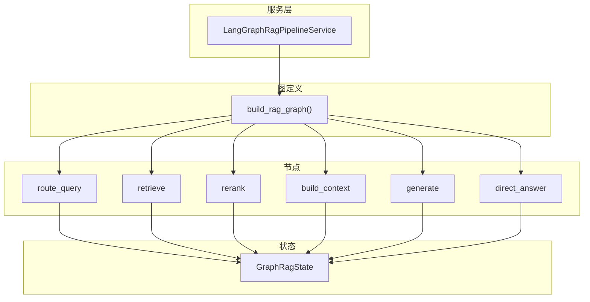
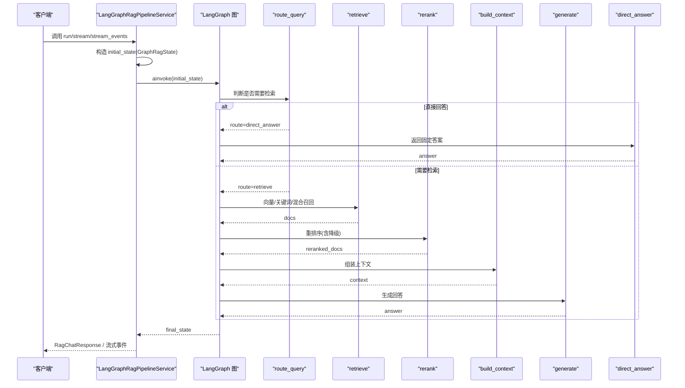
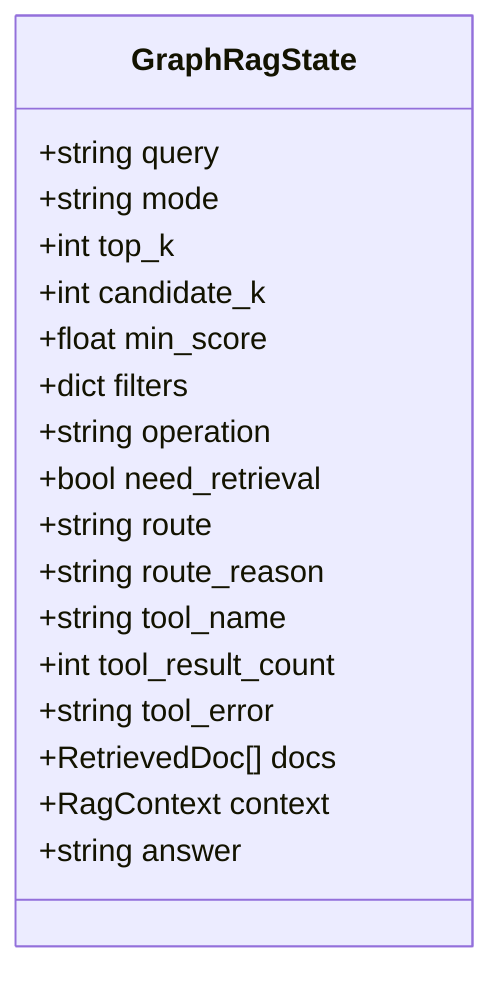
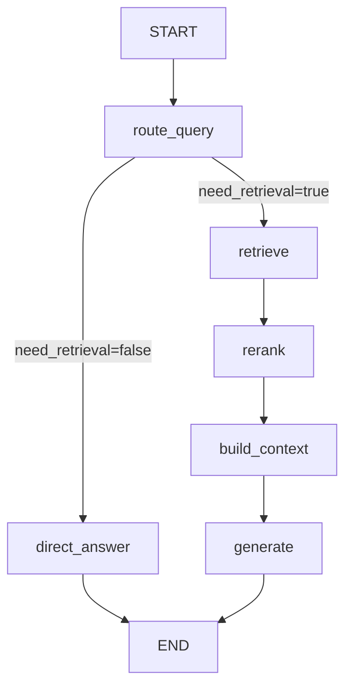
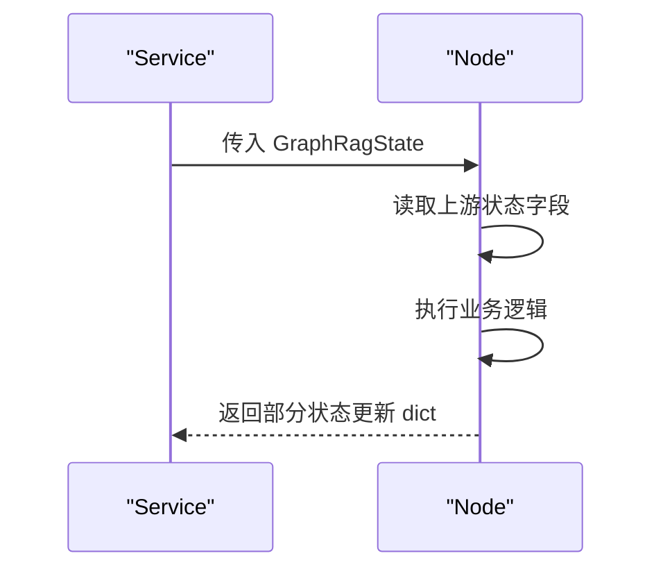
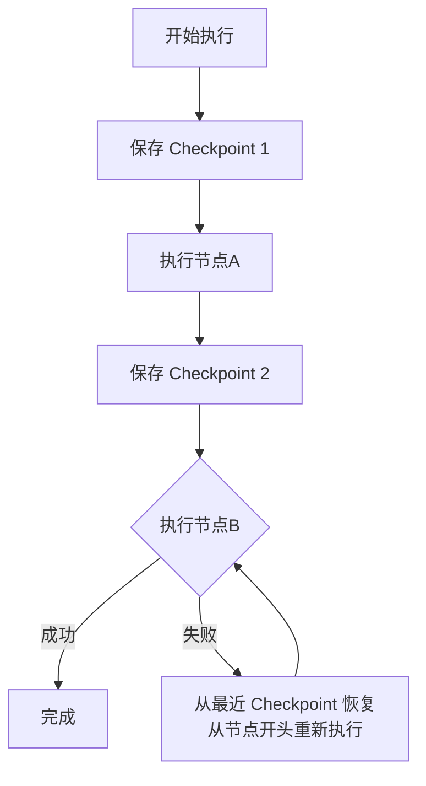
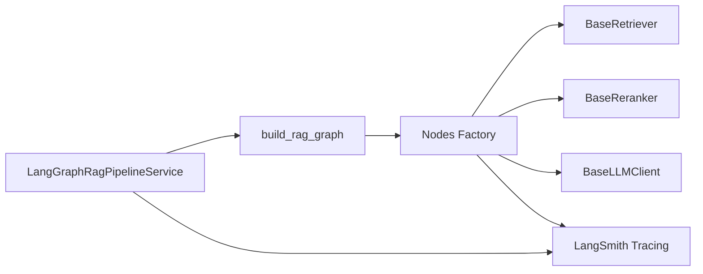

# LangGraph Pipeline 管道

<cite>
**本文引用的文件**
- [langgraph_rag_pipeline_service.py](file://src/fast_app/services/rag/langgraph_rag_pipeline_service.py)
- [rag_graph_builder.py](file://src/fast_app/graph/rag/rag_graph_builder.py)
- [rag_graph_nodes.py](file://src/fast_app/graph/rag/rag_graph_nodes.py)
- [rag_graph_state.py](file://src/fast_app/graph/rag/rag_graph_state.py)
- [rag_state.py](file://src/fast_app/graph/rag/rag_state.py)
- [rag_pipeline_service.py](file://src/fast_app/services/rag/rag_pipeline_service.py)
- [12-8-Classic Pipeline与LangGraph Pipeline的trace对齐.md](file://learning-docs/phase-12/12-8-Classic Pipeline与LangGraph Pipeline的trace对齐.md)
- [未完成功能-9-实现方案 + 模块讲解.md](file://scripts/docs/未完成功能-9-实现方案 + 模块讲解.md)
- [debug_trace_routes.py](file://src/fast_app/api/debug_trace_routes.py)
</cite>

## 目录
1. [简介](#简介)
2. [项目结构](#项目结构)
3. [核心组件](#核心组件)
4. [架构总览](#架构总览)
5. [详细组件分析](#详细组件分析)
6. [依赖关系分析](#依赖关系分析)
7. [性能考量](#性能考量)
8. [故障排查指南](#故障排查指南)
9. [结论](#结论)
10. [附录](#附录)

## 简介
本文件系统性说明基于 LangGraph 的状态机式 RAG 管道：LangGraphRagPipelineService。它通过 StateGraph 将检索、重排序、上下文构建、生成回答等步骤组织为可观测、可扩展、可恢复的图执行流程，并提供 run、stream、stream_events 三种调用方式。与传统 Classic Pipeline 相比，LangGraph 版本在条件路由、节点级追踪、状态持久化与恢复方面具备更强的工程能力。

## 项目结构
LangGraph RAG 管道由“服务层 + 图定义 + 节点实现 + 状态模型”组成：
- 服务层：封装请求生命周期、追踪、流式输出与错误处理。
- 图定义：使用 StateGraph 声明节点与边，形成固定执行拓扑。
- 节点实现：每个业务步骤以工厂函数创建带追踪的异步节点。
- 状态模型：用 TypedDict 描述跨节点共享的状态字段。

图表来源
- [rag_graph_builder.py:21-89](file://src/fast_app/graph/rag/rag_graph_builder.py#L21-L89)
- [rag_graph_nodes.py:162-590](file://src/fast_app/graph/rag/rag_graph_nodes.py#L162-L590)
- [rag_graph_state.py:15-65](file://src/fast_app/graph/rag/rag_graph_state.py#L15-L65)

章节来源
- [langgraph_rag_pipeline_service.py:47-98](file://src/fast_app/services/rag/langgraph_rag_pipeline_service.py#L47-L98)
- [rag_graph_builder.py:21-89](file://src/fast_app/graph/rag/rag_graph_builder.py#L21-L89)
- [rag_graph_state.py:15-65](file://src/fast_app/graph/rag/rag_graph_state.py#L15-L65)

## 核心组件
- LangGraphRagPipelineService：提供 run/stream/stream_events 入口，负责输入校验、初始状态构造、图执行、结果转换、慢操作日志与 LangSmith 追踪。
- build_rag_graph：组装 StateGraph，注册节点与边，定义条件路由。
- 节点工厂：create_route_query_node、create_retrieve_node、create_rerank_node、create_build_context_node、create_generate_node、create_direct_answer_node。
- GraphRagState：统一状态字典，承载查询参数、中间结果与执行元信息。

章节来源
- [langgraph_rag_pipeline_service.py:138-247](file://src/fast_app/services/rag/langgraph_rag_pipeline_service.py#L138-L247)
- [rag_graph_builder.py:21-89](file://src/fast_app/graph/rag/rag_graph_builder.py#L21-L89)
- [rag_graph_nodes.py:162-590](file://src/fast_app/graph/rag/rag_graph_nodes.py#L162-L590)
- [rag_graph_state.py:15-65](file://src/fast_app/graph/rag/rag_graph_state.py#L15-L65)

## 架构总览
下图展示一次典型请求从入口到结束的执行路径，包括条件分支与关键数据流转。

图表来源
- [rag_graph_builder.py:74-87](file://src/fast_app/graph/rag/rag_graph_builder.py#L74-L87)
- [rag_graph_nodes.py:154-202](file://src/fast_app/graph/rag/rag_graph_nodes.py#L154-L202)
- [rag_graph_nodes.py:398-465](file://src/fast_app/graph/rag/rag_graph_nodes.py#L398-L465)
- [rag_graph_nodes.py:247-386](file://src/fast_app/graph/rag/rag_graph_nodes.py#L247-L386)
- [rag_graph_nodes.py:468-531](file://src/fast_app/graph/rag/rag_graph_nodes.py#L468-L531)
- [rag_graph_nodes.py:534-590](file://src/fast_app/graph/rag/rag_graph_nodes.py#L534-L590)

## 详细组件分析

### 状态管理与初始状态
- GraphRagState 定义了查询参数、权限过滤、执行模式、路由结果、工具调用元信息、文档列表、上下文与答案。
- build_graph_initial_state 将请求参数与权限范围合并为 filters，并初始化各阶段字段。

图表来源
- [rag_graph_state.py:15-65](file://src/fast_app/graph/rag/rag_graph_state.py#L15-L65)

章节来源
- [rag_graph_state.py:15-65](file://src/fast_app/graph/rag/rag_graph_state.py#L15-L65)

### 图结构与边条件判断
- 图包含 START -> route_query -> (retrieve | direct_answer) -> rerank -> build_context -> generate -> END。
- 条件边由 route_from_state 决定：若 state.route 已存在则按该值跳转，否则默认进入 retrieve。

图表来源
- [rag_graph_builder.py:74-87](file://src/fast_app/graph/rag/rag_graph_builder.py#L74-L87)
- [rag_graph_nodes.py:154-159](file://src/fast_app/graph/rag/rag_graph_nodes.py#L154-L159)

章节来源
- [rag_graph_builder.py:21-89](file://src/fast_app/graph/rag/rag_graph_builder.py#L21-L89)
- [rag_graph_nodes.py:154-202](file://src/fast_app/graph/rag/rag_graph_nodes.py#L154-L202)

### 节点编排与职责
- route_query：基于规则判断是否检索，设置 route 与 route_reason。
- retrieve：调用知识检索工具，记录工具名、结果数与错误信息。
- rerank：对候选文档重排序；异常时降级为原顺序截取。
- build_context：根据 docs 与 filters 组装 RagContext，支持父上下文扩展（非 stream 模式）。
- generate：基于上下文生成回答，可选输出审计。
- direct_answer：返回固定能力说明文本，不经过 LLM。

图表来源
- [rag_graph_nodes.py:162-202](file://src/fast_app/graph/rag/rag_graph_nodes.py#L162-L202)
- [rag_graph_nodes.py:398-465](file://src/fast_app/graph/rag/rag_graph_nodes.py#L398-L465)
- [rag_graph_nodes.py:247-386](file://src/fast_app/graph/rag/rag_graph_nodes.py#L247-L386)
- [rag_graph_nodes.py:468-531](file://src/fast_app/graph/rag/rag_graph_nodes.py#L468-L531)
- [rag_graph_nodes.py:534-590](file://src/fast_app/graph/rag/rag_graph_nodes.py#L534-L590)
- [rag_graph_nodes.py:205-243](file://src/fast_app/graph/rag/rag_graph_nodes.py#L205-L243)

章节来源
- [rag_graph_nodes.py:162-590](file://src/fast_app/graph/rag/rag_graph_nodes.py#L162-L590)

### 与传统 Pipeline 的优势对比
- 更灵活的工作流控制：显式条件边与状态驱动，便于扩展多分支与循环。
- 更好的可观测性：每个节点自带 step trace，可与 Classic Pipeline 对齐，便于定位瓶颈。
- 更强的扩展性：节点工厂注入外部组件（检索器、重排器、LLM），易于替换与测试。
- 一致的错误与降级：重排序失败自动回退，保证主链路可用性。

章节来源
- [12-8-Classic Pipeline与LangGraph Pipeline的trace对齐.md:730-799](file://learning-docs/phase-12/12-8-Classic Pipeline与LangGraph Pipeline的trace对齐.md#L730-L799)
- [rag_graph_nodes.py:247-386](file://src/fast_app/graph/rag/rag_graph_nodes.py#L247-L386)
- [rag_pipeline_service.py:657-752](file://src/fast_app/services/rag/rag_pipeline_service.py#L657-L752)

### 状态管理、检查点机制与错误恢复
- 状态管理：所有节点通过读写 GraphRagState 传递数据，避免隐式全局变量。
- 检查点机制：LangGraph 的 checkpointer 保存“图状态与调度位置”，恢复时从最近 super-step 边界重新执行节点。
- 错误恢复策略：节点内异常不影响已完成节点；重排序失败走降级；流式场景对输出进行安全审计。

图表来源
- [未完成功能-9-实现方案 + 模块讲解.md:861-930](file://scripts/docs/未完成功能-9-实现方案 + 模块讲解.md#L861-L930)

章节来源
- [未完成功能-9-实现方案 + 模块讲解.md:861-930](file://scripts/docs/未完成功能-9-实现方案 + 模块讲解.md#L861-L930)

### 自定义 RAG 图与复杂多分支逻辑示例
- 构建图：使用 StateGraph 添加节点与边，并通过 add_conditional_edges 接入路由逻辑。
- 定义节点：以工厂函数封装依赖（settings、retriever、reranker、llm_client），返回带追踪的异步节点。
- 多分支：route_query 根据规则选择 direct_answer 或 retrieve；后续可按需增加更多分支（如工具调用、二次检索）。

章节来源
- [rag_graph_builder.py:21-89](file://src/fast_app/graph/rag/rag_graph_builder.py#L21-L89)
- [rag_graph_nodes.py:162-202](file://src/fast_app/graph/rag/rag_graph_nodes.py#L162-L202)
- [rag_graph_nodes.py:398-465](file://src/fast_app/graph/rag/rag_graph_nodes.py#L398-L465)

## 依赖关系分析
- 服务层依赖图构建器与节点工厂，图依赖各组件抽象接口（检索器、重排器、LLM 客户端）。
- 节点内部通过闭包持有依赖，避免在节点内 new 实例，保持可替换性与可测试性。
- 追踪与延迟监控贯穿服务层与节点层，确保端到端可观测。

图表来源
- [langgraph_rag_pipeline_service.py:47-98](file://src/fast_app/services/rag/langgraph_rag_pipeline_service.py#L47-L98)
- [rag_graph_builder.py:21-89](file://src/fast_app/graph/rag/rag_graph_builder.py#L21-L89)
- [rag_graph_nodes.py:114-131](file://src/fast_app/graph/rag/rag_graph_nodes.py#L114-L131)

章节来源
- [langgraph_rag_pipeline_service.py:47-98](file://src/fast_app/services/rag/langgraph_rag_pipeline_service.py#L47-L98)
- [rag_graph_builder.py:21-89](file://src/fast_app/graph/rag/rag_graph_builder.py#L21-L89)
- [rag_graph_nodes.py:114-131](file://src/fast_app/graph/rag/rag_graph_nodes.py#L114-L131)

## 性能考量
- 重排序降级：当重排序服务异常时，回退为原候选集截取，保障主链路可用。
- 流式输出：stream 与 stream_events 分别支持 token 流与结构化事件流，降低首字节延迟。
- 慢操作告警：pipeline、rerank、stream 等关键路径均记录慢操作日志，便于阈值监控。
- 并行召回：Classic 模式下混合检索并发执行，减少端到端延迟（供对比参考）。

章节来源
- [rag_graph_nodes.py:247-386](file://src/fast_app/graph/rag/rag_graph_nodes.py#L247-L386)
- [langgraph_rag_pipeline_service.py:249-377](file://src/fast_app/services/rag/langgraph_rag_pipeline_service.py#L249-L377)
- [rag_pipeline_service.py:283-328](file://src/fast_app/services/rag/rag_pipeline_service.py#L283-L328)

## 故障排查指南
- 常见问题
  - 上下文为空：构建上下文前需确保 docs 非空；否则抛出外部服务异常。
  - 重排序失败：查看 rerank 降级日志与指标，确认外部服务健康度。
  - 路由异常：检查 route_query 的规则匹配与 route_reason。
- 调试技巧
  - 使用 LangSmith 步骤追踪：每个节点均有 step trace，便于定位耗时与错误。
  - 使用调试接口：通过 debug_trace 获取请求级响应与延迟信息。
  - 日志关键字：关注 rag.pipeline.start/finish/slow、rag.rerank.slow、rag.stream.slow 等事件。

章节来源
- [rag_graph_nodes.py:468-531](file://src/fast_app/graph/rag/rag_graph_nodes.py#L468-L531)
- [rag_graph_nodes.py:247-386](file://src/fast_app/graph/rag/rag_graph_nodes.py#L247-L386)
- [debug_trace_routes.py:65-129](file://src/fast_app/api/debug_trace_routes.py#L65-L129)

## 结论
LangGraphRagPipelineService 将 RAG 流程建模为状态机，借助 StateGraph 明确节点职责与数据流，结合条件边实现灵活路由。相比传统 Pipeline，它在可观测性、可扩展性与容错性上更具优势。配合检查点机制与完善的追踪体系，可在生产环境中稳定运行并持续优化。

## 附录
- 状态模型参考：GraphRagState 字段含义与用途。
- 节点清单：route_query、retrieve、rerank、build_context、generate、direct_answer。
- 追踪对齐：LangGraph 与 Classic Pipeline 的 step 命名与索引保持一致，便于横向对比。