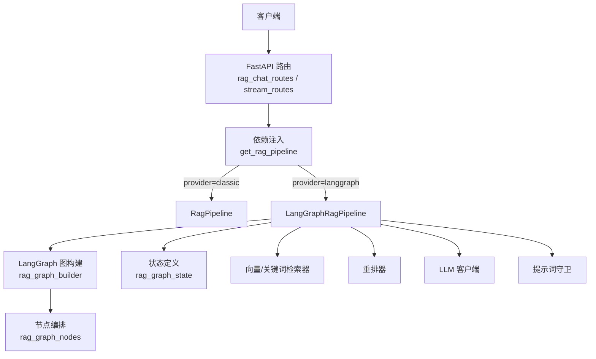
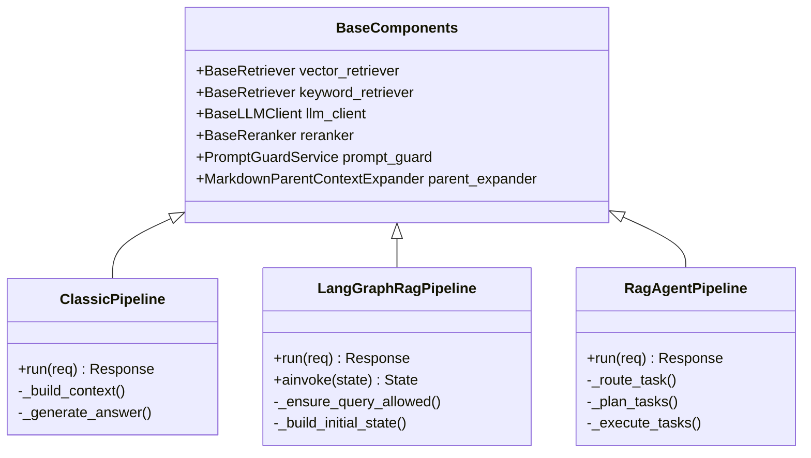
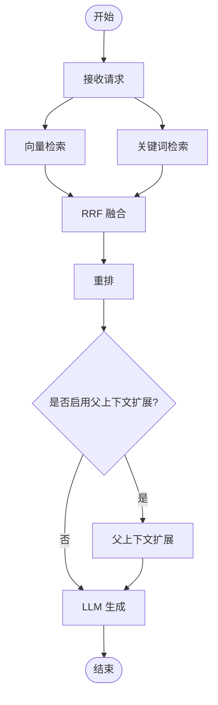
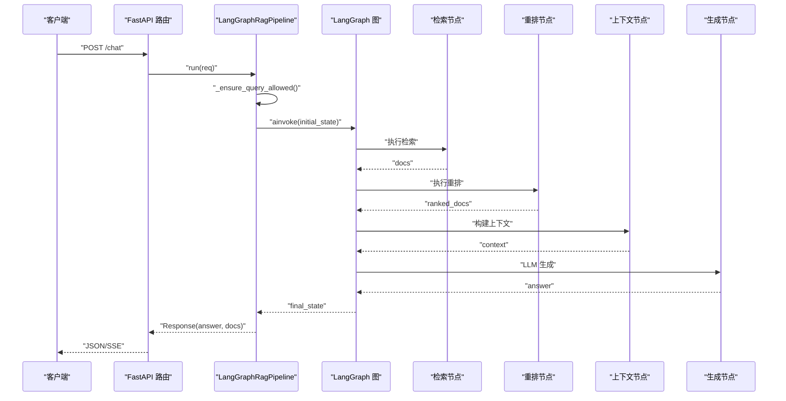
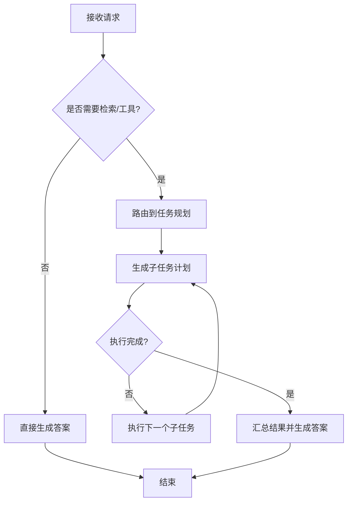
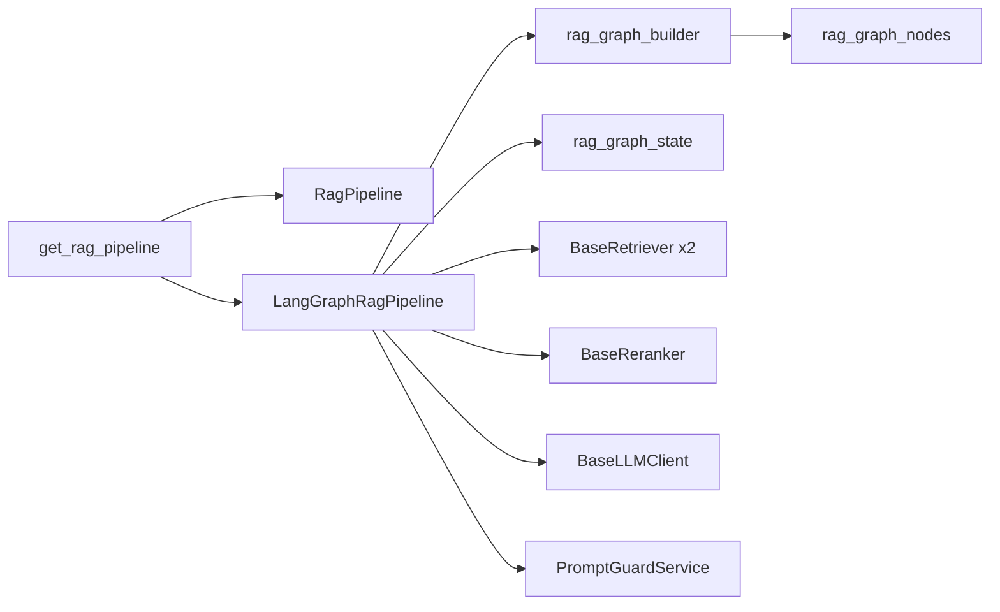

# RAG 管道服务

<cite>
**本文引用的文件**
- [rag_dependencies.py](file://src/fast_app/dependencies/rag_dependencies.py)
- [langgraph_rag_pipeline_service.py](file://src/fast_app/services/rag/langgraph_rag_pipeline_service.py)
- [rag_graph_builder.py](file://src/fast_app/graph/rag/rag_graph_builder.py)
- [rag_graph_nodes.py](file://src/fast_app/graph/rag/rag_graph_nodes.py)
- [rag_graph_state.py](file://src/fast_app/graph/rag/rag_graph_state.py)
- [rag_agent_builder.py](file://src/fast_app/graph/rag_agent/rag_agent_builder.py)
- [rag_agent_nodes.py](file://src/fast_app/graph/rag_agent/rag_agent_nodes.py)
- [rag_agent_state.py](file://src/fast_app/graph/rag_agent/rag_agent_state.py)
- [rag_models.py](file://src/app/domain/rag_models.py)
- [rag_state.py](file://src/app/graph/rag_state.py)
- [config.py](file://src/fast_app/core/config.py)
- [error_responses.py](file://src/fast_app/core/error_responses.py)
- [exception_handlers.py](file://src/fast_app/core/exception_handlers.py)
- [rag_chat_routes.py](file://src/fast_app/api/rag_chat_routes.py)
- [stream_routes.py](file://src/fast_app/api/stream_routes.py)
</cite>

## 目录
1. [简介](#简介)
2. [项目结构](#项目结构)
3. [核心组件](#核心组件)
4. [架构总览](#架构总览)
5. [详细组件分析](#详细组件分析)
6. [依赖关系分析](#依赖关系分析)
7. [性能考量](#性能考量)
8. [故障排查指南](#故障排查指南)
9. [结论](#结论)
10. [附录](#附录)

## 简介
本文件面向“RAG 管道服务”，系统性说明三种管道实现与差异：Classic Pipeline、LangGraph Pipeline 与 RAG Agent Pipeline。重点覆盖 RagPipelineService、RagAgentPipelineService 与 LangGraphRagPipelineService 的职责边界、初始化流程、配置参数、错误处理机制，并提供选择建议、检索策略配置、流式响应处理、性能调优与排障要点。

## 项目结构
RAG 管道以 FastAPI 应用为入口，通过依赖注入装配检索器、重排器、LLM 客户端、提示词守卫等组件；根据配置动态选择 Classic 或 LangGraph 管道；Agent 管道在 LangGraph 之上增加任务路由、规划与执行能力。

**图表来源**
- [rag_dependencies.py:462-504](file://src/fast_app/dependencies/rag_dependencies.py#L462-L504)
- [rag_graph_builder.py:1-200](file://src/fast_app/graph/rag/rag_graph_builder.py#L1-L200)
- [rag_graph_nodes.py:1-200](file://src/fast_app/graph/rag/rag_graph_nodes.py#L1-L200)
- [rag_graph_state.py:1-200](file://src/fast_app/graph/rag/rag_graph_state.py#L1-L200)

**章节来源**
- [rag_dependencies.py:462-504](file://src/fast_app/dependencies/rag_dependencies.py#L462-L504)
- [rag_chat_routes.py:1-200](file://src/fast_app/api/rag_chat_routes.py#L1-L200)
- [stream_routes.py:1-200](file://src/fast_app/api/stream_routes.py#L1-L200)

## 核心组件
- 数据模型与状态
  - RetrievedDoc/RagContext：封装检索文档与上下文构造结果。
  - RagState（TypedDict）：用于 LangGraph 风格的流程状态，包含 query、docs、context、answer。
- 依赖注入与工厂
  - get_rag_pipeline：依据配置 rag_pipeline_provider 返回 Classic 或 LangGraph 管道实例。
- 管道实现
  - LangGraphRagPipelineService：基于 LangGraph 的 RAG 流水线，负责图构建、状态流转、检索/重排/生成/守卫等节点编排。
  - RagAgentPipelineService：在 LangGraph 基础上引入任务感知（路由/规划/执行），适合复杂多步任务。
  - Classic Pipeline：线性顺序执行（检索→重排→上下文拼接→生成），简单高效。

**章节来源**
- [rag_models.py:1-27](file://src/app/domain/rag_models.py#L1-L27)
- [rag_state.py:1-19](file://src/app/graph/rag_state.py#L1-L19)
- [rag_dependencies.py:462-504](file://src/fast_app/dependencies/rag_dependencies.py#L462-L504)
- [langgraph_rag_pipeline_service.py:142-164](file://src/fast_app/services/rag/langgraph_rag_pipeline_service.py#L142-L164)

## 架构总览
三种管道的共同点：均使用相同的检索器、重排器、LLM 客户端与提示词守卫；差异在于控制流与扩展性。

**图表来源**
- [rag_dependencies.py:462-504](file://src/fast_app/dependencies/rag_dependencies.py#L462-L504)
- [langgraph_rag_pipeline_service.py:142-164](file://src/fast_app/services/rag/langgraph_rag_pipeline_service.py#L142-L164)

## 详细组件分析

### Classic Pipeline（经典流水线）
- 架构特点
  - 线性顺序：查询→向量检索→关键词检索→RRF 融合→重排→父上下文扩展→LLM 生成。
  - 无状态机，易于理解与维护，适合单轮问答与高吞吐场景。
- 适用场景
  - 知识问答、FAQ 检索增强、对延迟敏感且无需多步推理的任务。
- 性能特征
  - 低开销、可并行化检索阶段；重排与父上下文扩展为关键瓶颈。
- 配置要点
  - top_k、candidate_k、min_score、rerank_top_n、parent_expand 开关等。
- 错误处理
  - 外部服务异常统一降级与重试；提示词守卫拦截不当输入。

**图表来源**
- [rag_graph_nodes.py:1-200](file://src/fast_app/graph/rag/rag_graph_nodes.py#L1-L200)
- [rag_graph_state.py:1-200](file://src/fast_app/graph/rag/rag_graph_state.py#L1-L200)

**章节来源**
- [rag_graph_nodes.py:1-200](file://src/fast_app/graph/rag/rag_graph_nodes.py#L1-L200)
- [rag_graph_state.py:1-200](file://src/fast_app/graph/rag/rag_graph_state.py#L1-L200)

### LangGraph Pipeline（状态机流水线）
- 架构特点
  - 基于 LangGraph 的状态机：将检索、重排、上下文构建、生成等步骤抽象为节点，通过边进行条件跳转。
  - 支持中间状态持久化与调试追踪，便于对齐 Classic 与 LangGraph 的执行轨迹。
- 适用场景
  - 需要细粒度控制流、可观测性与可插拔节点的 RAG 流程。
- 性能特征
  - 节点间异步调用，整体延迟受最慢节点影响；可通过并发与缓存优化。
- 初始化流程
  - 构建初始状态 → 调用图 ainvoke → 读取最终 answer/docs。
- 错误处理
  - 入口校验（如提示词守卫）、节点级异常捕获与降级。

**图表来源**
- [langgraph_rag_pipeline_service.py:142-164](file://src/fast_app/services/rag/langgraph_rag_pipeline_service.py#L142-L164)
- [rag_graph_builder.py:1-200](file://src/fast_app/graph/rag/rag_graph_builder.py#L1-L200)
- [rag_graph_nodes.py:1-200](file://src/fast_app/graph/rag/rag_graph_nodes.py#L1-L200)
- [rag_graph_state.py:1-200](file://src/fast_app/graph/rag/rag_graph_state.py#L1-L200)

**章节来源**
- [langgraph_rag_pipeline_service.py:142-164](file://src/fast_app/services/rag/langgraph_rag_pipeline_service.py#L142-L164)
- [rag_graph_builder.py:1-200](file://src/fast_app/graph/rag/rag_graph_builder.py#L1-L200)
- [rag_graph_nodes.py:1-200](file://src/fast_app/graph/rag/rag_graph_nodes.py#L1-L200)
- [rag_graph_state.py:1-200](file://src/fast_app/graph/rag/rag_graph_state.py#L1-L200)

### RAG Agent Pipeline（任务感知代理）
- 架构特点
  - 在 LangGraph 之上增加任务路由、任务规划与任务执行循环，支持工具调用与多步推理。
  - 通过条件边与终止条件防止无限循环，具备更强的问题分解与工具协作能力。
- 适用场景
  - 复杂研究任务、跨源信息聚合、需要工具调用与人工确认的场景。
- 性能特征
  - 多轮迭代带来额外开销；需合理设置最大迭代次数与超时。
- 初始化流程
  - 构建 Agent 图 → 路由判断是否需要检索/工具 → 规划子任务 → 执行并汇总结果。
- 错误处理
  - 工具调用失败重试与降级；任务超时与熔断保护。

**图表来源**
- [rag_agent_builder.py:1-200](file://src/fast_app/graph/rag_agent/rag_agent_builder.py#L1-L200)
- [rag_agent_nodes.py:1-200](file://src/fast_app/graph/rag_agent/rag_agent_nodes.py#L1-L200)
- [rag_agent_state.py:1-200](file://src/fast_app/graph/rag_agent/rag_agent_state.py#L1-L200)

**章节来源**
- [rag_agent_builder.py:1-200](file://src/fast_app/graph/rag_agent/rag_agent_builder.py#L1-L200)
- [rag_agent_nodes.py:1-200](file://src/fast_app/graph/rag_agent/rag_agent_nodes.py#L1-L200)
- [rag_agent_state.py:1-200](file://src/fast_app/graph/rag_agent/rag_agent_state.py#L1-L200)

## 依赖关系分析
- 依赖注入
  - get_rag_pipeline 根据配置返回不同管道；同时注入检索器、重排器、LLM、提示词守卫、父上下文扩展、任务路由/规划/执行与会话持久化。
- 组件耦合
  - 管道与检索器/重排器/LLM 松耦合，便于替换与测试。
  - LangGraph 图与节点解耦，节点可独立演进。
- 外部依赖
  - Milvus/ES 检索后端、DashScope 重排、LLM 提供商、数据库会话。

**图表来源**
- [rag_dependencies.py:462-504](file://src/fast_app/dependencies/rag_dependencies.py#L462-L504)
- [rag_graph_builder.py:1-200](file://src/fast_app/graph/rag/rag_graph_builder.py#L1-L200)
- [rag_graph_nodes.py:1-200](file://src/fast_app/graph/rag/rag_graph_nodes.py#L1-L200)
- [rag_graph_state.py:1-200](file://src/fast_app/graph/rag/rag_graph_state.py#L1-L200)

**章节来源**
- [rag_dependencies.py:462-504](file://src/fast_app/dependencies/rag_dependencies.py#L462-L504)

## 性能考量
- 检索阶段
  - 向量与关键词检索可并行；调整 top_k/candidate_k 平衡召回与延迟。
- 重排与上下文
  - 重排成本较高，限制 rerank_top_n；父上下文扩展仅在必要时开启。
- 生成阶段
  - 控制 LLM 输出长度与温度；对长上下文采用分段生成或摘要压缩。
- 并发与缓存
  - 对重复查询做结果缓存；对检索结果做短期缓存；合理设置连接池与超时。
- 资源隔离
  - 对 Agent 管道设置最大迭代次数与超时，避免长时间占用资源。

[本节为通用指导，不直接分析具体文件]

## 故障排查指南
- 常见问题定位
  - 检索为空：检查向量/关键词检索器配置与索引状态；查看 min_score 阈值。
  - 重排耗时过长：降低 rerank_top_n；评估重排器负载。
  - 生成质量差：调整提示词模板与上下文裁剪策略；验证父上下文扩展效果。
  - 提示词守卫拦截：检查输入合规性；放宽或细化规则。
- 日志与追踪
  - 使用 pipeline.start 事件与 LangGraph trace 对齐 Classic 与 LangGraph 执行路径。
  - 关注外部服务错误分层（用户错误/外部服务错误/系统错误）。
- 恢复策略
  - 对网络抖动与超时启用重试与降级；对不可用后端切换备选检索器。

**章节来源**
- [error_responses.py:1-200](file://src/fast_app/core/error_responses.py#L1-L200)
- [exception_handlers.py:1-200](file://src/fast_app/core/exception_handlers.py#L1-L200)

## 结论
- Classic Pipeline 适合简单、高吞吐的单轮问答。
- LangGraph Pipeline 提供更强控制流与可观测性，适合复杂流程与调试需求。
- RAG Agent Pipeline 面向多步推理与工具协作，适用于研究与复杂任务场景。
- 通过依赖注入与模块化设计，可在同一系统中灵活切换与组合不同管道。

[本节为总结，不直接分析具体文件]

## 附录

### 配置参数速查
- 检索相关
  - top_k：候选文档数量
  - candidate_k：融合前候选数
  - min_score：最低相关性阈值
- 重排与上下文
  - rerank_top_n：重排保留数量
  - parent_expand：是否启用父上下文扩展
- 生成相关
  - temperature、max_tokens：控制生成风格与长度
- 安全与治理
  - prompt_guard：提示词守卫开关与策略
- 运行时
  - rag_pipeline_provider：classic/langgraph
  - 超时与重试：外部服务调用策略

**章节来源**
- [config.py:1-200](file://src/fast_app/core/config.py#L1-L200)

### 选择与示例指引
- 如何选择管道类型
  - 简单问答：Classic
  - 需要可观测与条件分支：LangGraph
  - 多步推理与工具调用：RAG Agent
- 检索策略配置
  - 提高召回：增大 top_k/candidate_k，降低 min_score
  - 提升精度：启用重排并限制 rerank_top_n，结合父上下文扩展
- 流式响应处理
  - 使用 SSE 接口逐步推送 token；前端按事件渲染增量内容
  - 注意断线重连与错误事件处理

**章节来源**
- [rag_chat_routes.py:1-200](file://src/fast_app/api/rag_chat_routes.py#L1-L200)
- [stream_routes.py:1-200](file://src/fast_app/api/stream_routes.py#L1-L200)