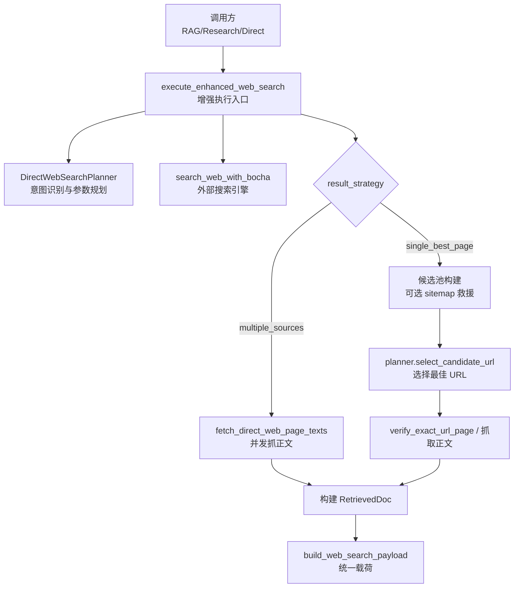
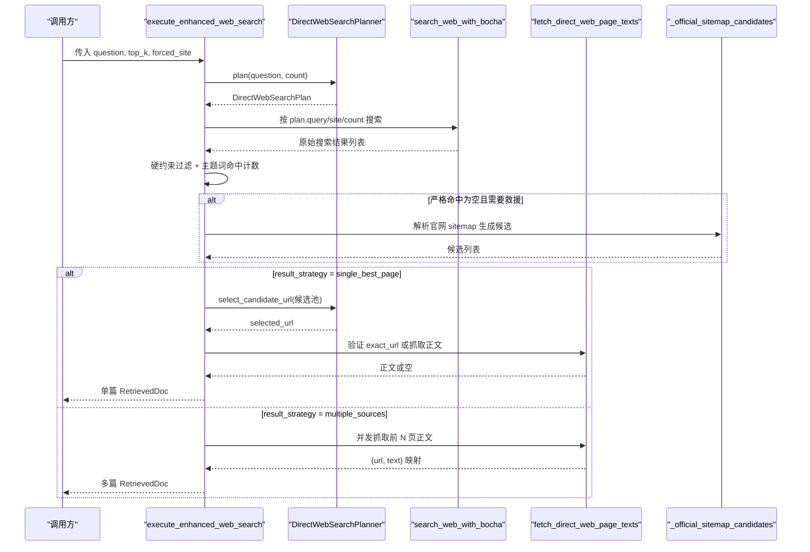
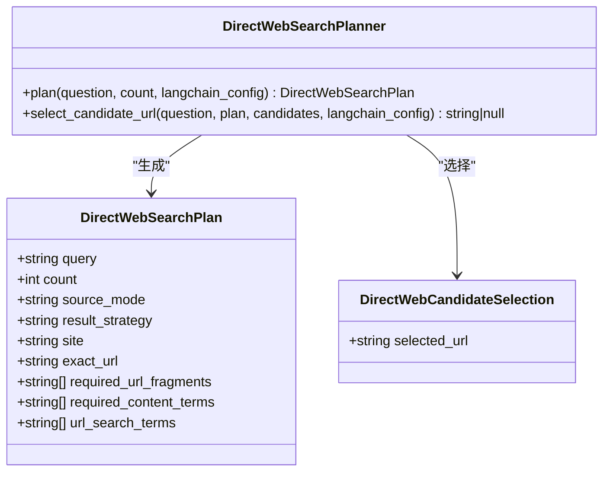
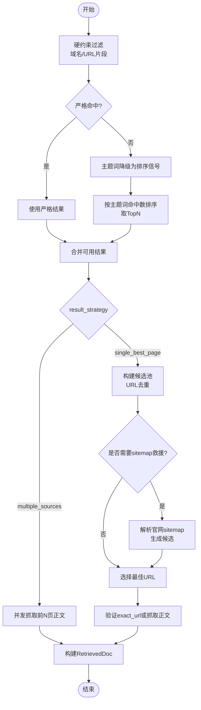
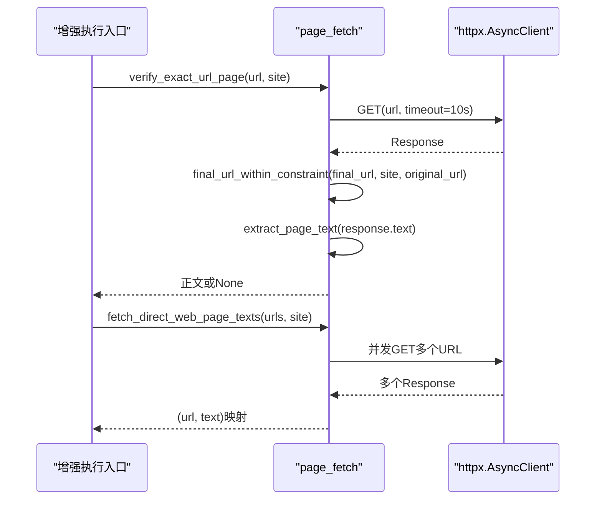
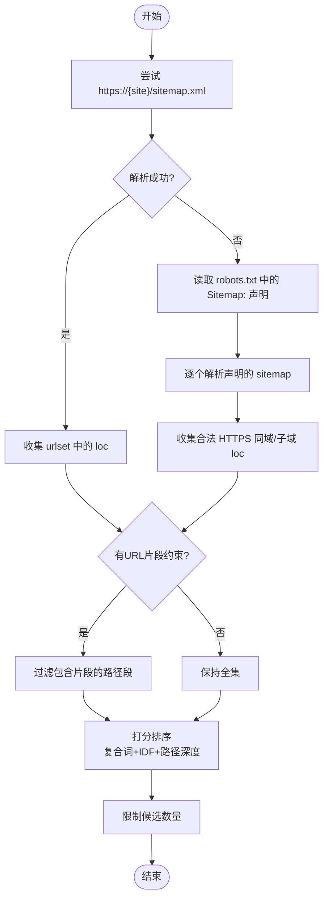
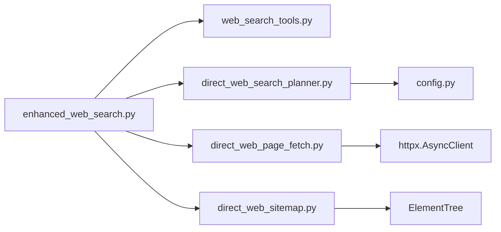

# Web 搜索增强

<cite>
**本文引用的文件**
- [enhanced_web_search.py](file://python-agent-study/src/fast_app/services/rag/enhanced_web_search.py)
- [direct_web_search_planner.py](file://python-agent-study/src/fast_app/services/rag/direct_web_search_planner.py)
- [direct_web_page_fetch.py](file://python-agent-study/src/fast_app/services/rag/direct_web_page_fetch.py)
- [direct_web_sitemap.py](file://python-agent-study/src/fast_app/services/rag/direct_web_sitemap.py)
- [web_search_tools.py](file://python-agent-study/src/fast_app/agents/tools/web_search_tools.py)
- [config.py](file://python-agent-study/src/fast_app/core/config.py)
- [test_enhanced_web_search.py](file://python-agent-study/scripts/tests/web_retrieval/test_enhanced_web_search.py)
</cite>

## 目录
1. [简介](#简介)
2. [项目结构](#项目结构)
3. [核心组件](#核心组件)
4. [架构总览](#架构总览)
5. [详细组件分析](#详细组件分析)
6. [依赖关系分析](#依赖关系分析)
7. [性能与网络优化](#性能与网络优化)
8. [故障排查指南](#故障排查指南)
9. [结论](#结论)
10. [附录：配置与使用示例](#附录配置与使用示例)

## 简介
本模块提供“Web 搜索增强”能力，将一次用户问题转化为受约束的检索计划，调用外部搜索引擎（博查）获取候选结果，再基于域名、URL 片段、主题词等硬/软约束进行过滤与排序；在官方来源场景下，若搜索引擎召回不足，会读取官方网站 sitemap 作为“救援”候选池；最终对单页或多页分支分别抓取正文或回退摘要，输出统一结构的检索文档。该能力被 RAG Agent、Research Worker、DeepAgent 文档创作链路和 direct 文档任务链路复用，避免各链路直接裸调搜索引擎导致结果质量不可控。

## 项目结构
Web 搜索增强由以下关键文件组成：
- 增强执行入口与流程编排：enhanced_web_search.py
- 搜索意图识别与参数规划：direct_web_search_planner.py
- 多源页面全文并发抓取与重定向约束：direct_web_page_fetch.py
- 官方网站 sitemap 发现、解析与候选排序：direct_web_sitemap.py
- 外部搜索引擎适配与工具封装：web_search_tools.py
- 全局配置项（模型、超时、API Key 等）：config.py
- 回归测试用例：test_enhanced_web_search.py

图表来源
- [enhanced_web_search.py:146-308](file://python-agent-study/src/fast_app/services/rag/enhanced_web_search.py#L146-L308)
- [direct_web_search_planner.py:223-317](file://python-agent-study/src/fast_app/services/rag/direct_web_search_planner.py#L223-L317)
- [web_search_tools.py:146-205](file://python-agent-study/src/fast_app/agents/tools/web_search_tools.py#L146-L205)
- [direct_web_page_fetch.py:60-121](file://python-agent-study/src/fast_app/services/rag/direct_web_page_fetch.py#L60-L121)
- [direct_web_sitemap.py:307-332](file://python-agent-study/src/fast_app/services/rag/direct_web_sitemap.py#L307-L332)

章节来源
- [enhanced_web_search.py:1-365](file://python-agent-study/src/fast_app/services/rag/enhanced_web_search.py#L1-L365)
- [direct_web_search_planner.py:1-325](file://python-agent-study/src/fast_app/services/rag/direct_web_search_planner.py#L1-L325)
- [direct_web_page_fetch.py:1-122](file://python-agent-study/src/fast_app/services/rag/direct_web_page_fetch.py#L1-L122)
- [direct_web_sitemap.py:1-345](file://python-agent-study/src/fast_app/services/rag/direct_web_sitemap.py#L1-L345)
- [web_search_tools.py:1-244](file://python-agent-study/src/fast_app/agents/tools/web_search_tools.py#L1-L244)
- [config.py:252-578](file://python-agent-study/src/fast_app/core/config.py#L252-L578)

## 核心组件
- 增强执行入口 execute_enhanced_web_search：负责编排 Planner、搜索引擎、过滤/降级、sitemap 救援、正文抓取与结果构造。
- 搜索参数规划 DirectWebSearchPlanner：通过结构化输出将自然语言问题转换为受 Schema 约束的检索计划（query、count、source_mode、result_strategy、site、exact_url、required_url_fragments、required_content_terms、url_search_terms）。
- 多源页面抓取 fetch_direct_web_page_texts：并发抓取前 N 页正文，失败逐文档回退为摘要拼接。
- 官方 sitemap 救援 _official_sitemap_candidates：从 robots.txt 或默认路径发现 sitemap，解析并打分生成候选。
- 外部搜索引擎适配 search_web_with_bocha：调用博查 API，归一化为内部 WebSearchResult。
- 配置 Settings：集中管理 LLM Router、Bocha API、超时、重试等。

章节来源
- [enhanced_web_search.py:146-308](file://python-agent-study/src/fast_app/services/rag/enhanced_web_search.py#L146-L308)
- [direct_web_search_planner.py:67-148](file://python-agent-study/src/fast_app/services/rag/direct_web_search_planner.py#L67-L148)
- [direct_web_page_fetch.py:107-121](file://python-agent-study/src/fast_app/services/rag/direct_web_page_fetch.py#L107-L121)
- [direct_web_sitemap.py:307-332](file://python-agent-study/src/fast_app/services/rag/direct_web_sitemap.py#L307-L332)
- [web_search_tools.py:146-205](file://python-agent-study/src/fast_app/agents/tools/web_search_tools.py#L146-L205)
- [config.py:252-283](file://python-agent-study/src/fast_app/core/config.py#L252-L283)
- [config.py:568-578](file://python-agent-study/src/fast_app/core/config.py#L568-L578)

## 架构总览
下图展示一次增强 Web 搜索的端到端流程，包括意图识别、查询规划、多源聚合、过滤去重、相关性排序、正文抓取与结果构造。

图表来源
- [enhanced_web_search.py:146-308](file://python-agent-study/src/fast_app/services/rag/enhanced_web_search.py#L146-L308)
- [direct_web_search_planner.py:242-317](file://python-agent-study/src/fast_app/services/rag/direct_web_search_planner.py#L242-L317)
- [web_search_tools.py:146-205](file://python-agent-study/src/fast_app/agents/tools/web_search_tools.py#L146-L205)
- [direct_web_page_fetch.py:60-121](file://python-agent-study/src/fast_app/services/rag/direct_web_page_fetch.py#L60-L121)
- [direct_web_sitemap.py:307-332](file://python-agent-study/src/fast_app/services/rag/direct_web_sitemap.py#L307-L332)

## 详细组件分析

### 搜索意图识别与查询规划（DirectWebSearchPlanner）
- 输入：用户问题、期望返回数量、LangChain trace 配置。
- 处理：通过结构化输出强制模型返回符合 Schema 的计划对象，包含 query、count、source_mode、result_strategy、site、exact_url、required_url_fragments、required_content_terms、url_search_terms。
- 校验：两阶段校验，非法 exact_url 会被置空重试，避免拖垮主链路；官方来源必须提供 site；exact_url 必须是 HTTPS、非 IP、域名与 site 一致。
- 输出：可直接用于后续搜索与选择的计划对象。

图表来源
- [direct_web_search_planner.py:67-148](file://python-agent-study/src/fast_app/services/rag/direct_web_search_planner.py#L67-L148)
- [direct_web_search_planner.py:151-160](file://python-agent-study/src/fast_app/services/rag/direct_web_search_planner.py#L151-L160)
- [direct_web_search_planner.py:223-317](file://python-agent-study/src/fast_app/services/rag/direct_web_search_planner.py#L223-L317)

章节来源
- [direct_web_search_planner.py:24-64](file://python-agent-study/src/fast_app/services/rag/direct_web_search_planner.py#L24-L64)
- [direct_web_search_planner.py:67-148](file://python-agent-study/src/fast_app/services/rag/direct_web_search_planner.py#L67-L148)
- [direct_web_search_planner.py:188-221](file://python-agent-study/src/fast_app/services/rag/direct_web_search_planner.py#L188-L221)
- [direct_web_search_planner.py:242-317](file://python-agent-study/src/fast_app/services/rag/direct_web_search_planner.py#L242-L317)

### 多源信息聚合与过滤去重
- 硬约束过滤：域名与 URL 片段必须满足计划要求（如版本号、路径片段），不满足则丢弃。
- 主题词命中计数：统计标题、摘要、summary 中 required_content_terms 的命中数，用于排序与降级判断。
- 主题词降级：当严格过滤无候选且存在域名硬约束时，将主题词降级为排序信号，仅保留最多固定数量的候选，避免离题页面进入选择器视野。
- 去重：候选池构建时对 URL 去重，保证唯一性。
- 相关性排序：
  - 搜索引擎返回顺序作为初始排序。
  - 主题词命中数作为降级排序信号。
  - sitemap 候选采用复合词匹配、IDF 加权、路径深度启发式综合排序。

图表来源
- [enhanced_web_search.py:44-130](file://python-agent-study/src/fast_app/services/rag/enhanced_web_search.py#L44-L130)
- [enhanced_web_search.py:193-283](file://python-agent-study/src/fast_app/services/rag/enhanced_web_search.py#L193-L283)
- [direct_web_sitemap.py:236-304](file://python-agent-study/src/fast_app/services/rag/direct_web_sitemap.py#L236-L304)

章节来源
- [enhanced_web_search.py:44-130](file://python-agent-study/src/fast_app/services/rag/enhanced_web_search.py#L44-L130)
- [enhanced_web_search.py:193-283](file://python-agent-study/src/fast_app/services/rag/enhanced_web_search.py#L193-L283)
- [direct_web_sitemap.py:236-304](file://python-agent-study/src/fast_app/services/rag/direct_web_sitemap.py#L236-L304)

### Direct Web Page Fetch（单页抓取与重定向约束）
- verify_exact_url_page：入池前验证 planner 声明的 exact_url 是否可用（HTTP 2xx、重定向终点仍在约束内、提取到有效正文）。
- final_url_within_constraint：重定向终点的域名约束，有 site 时必须同域或子域；无 site 时与原候选同属一个注册根域。
- fetch_direct_web_page_texts：并发抓取前 N 页正文，失败逐文档回退为摘要拼接，永不抛异常。

图表来源
- [direct_web_page_fetch.py:60-121](file://python-agent-study/src/fast_app/services/rag/direct_web_page_fetch.py#L60-L121)
- [enhanced_web_search.py:223-283](file://python-agent-study/src/fast_app/services/rag/enhanced_web_search.py#L223-L283)

章节来源
- [direct_web_page_fetch.py:20-57](file://python-agent-study/src/fast_app/services/rag/direct_web_page_fetch.py#L20-L57)
- [direct_web_page_fetch.py:60-121](file://python-agent-study/src/fast_app/services/rag/direct_web_page_fetch.py#L60-L121)

### Direct Web Sitemap（官方网站救援）
- 发现顺序：/sitemap.xml → robots.txt 中的 Sitemap: 声明。
- 解析限制：最大字节数、子索引展开层数、robots 声明数量限制。
- 候选筛选：HTTPS 同域或子域；支持 URL 片段硬约束过滤。
- 排序策略：复合词匹配、IDF 加权、路径深度启发式；纯中文 query 退化为文档目录启发式。

图表来源
- [direct_web_sitemap.py:60-162](file://python-agent-study/src/fast_app/services/rag/direct_web_sitemap.py#L60-L162)
- [direct_web_sitemap.py:236-304](file://python-agent-study/src/fast_app/services/rag/direct_web_sitemap.py#L236-L304)
- [direct_web_sitemap.py:307-332](file://python-agent-study/src/fast_app/services/rag/direct_web_sitemap.py#L307-L332)

章节来源
- [direct_web_sitemap.py:18-32](file://python-agent-study/src/fast_app/services/rag/direct_web_sitemap.py#L18-L32)
- [direct_web_sitemap.py:60-162](file://python-agent-study/src/fast_app/services/rag/direct_web_sitemap.py#L60-L162)
- [direct_web_sitemap.py:236-304](file://python-agent-study/src/fast_app/services/rag/direct_web_sitemap.py#L236-L304)
- [direct_web_sitemap.py:307-332](file://python-agent-study/src/fast_app/services/rag/direct_web_sitemap.py#L307-L332)

### 外部搜索引擎适配（Bocha）
- 调用方式：POST JSON，携带 Authorization Bearer Token。
- 响应归一化：兼容多种字段形态（data/results、data/webPages/value、results 等），统一为 WebSearchResult。
- 错误处理：超时、HTTP 错误、非 JSON 响应均抛出外部服务异常。
- 日志埋点：start/finish 事件记录 query、count、result_count。

章节来源
- [web_search_tools.py:65-119](file://python-agent-study/src/fast_app/agents/tools/web_search_tools.py#L65-L119)
- [web_search_tools.py:146-205](file://python-agent-study/src/fast_app/agents/tools/web_search_tools.py#L146-L205)

## 依赖关系分析
- enhanced_web_search 依赖：
  - web_search_tools.search_web_with_bocha：外部搜索引擎。
  - direct_web_search_planner.DirectWebSearchPlanner：意图识别与参数规划。
  - direct_web_page_fetch.fetch_direct_web_page_texts：多源正文抓取。
  - direct_web_sitemap._official_sitemap_candidates：官方 sitemap 救援。
- direct_web_search_planner 依赖：
  - LangChain ChatOpenAI：结构化输出。
  - Settings：Router 模型、超时、重试等。
- direct_web_page_fetch 依赖：
  - httpx.AsyncClient：并发网络请求。
  - direct_web_page_text.extract_page_text：正文提取（由上层提供）。
- direct_web_sitemap 依赖：
  - httpx.AsyncClient：sitemap 下载。
  - ElementTree：XML 解析。

图表来源
- [enhanced_web_search.py:15-35](file://python-agent-study/src/fast_app/services/rag/enhanced_web_search.py#L15-L35)
- [direct_web_search_planner.py:12-18](file://python-agent-study/src/fast_app/services/rag/direct_web_search_planner.py#L12-L18)
- [direct_web_page_fetch.py:8-13](file://python-agent-study/src/fast_app/services/rag/direct_web_page_fetch.py#L8-L13)
- [direct_web_sitemap.py:8-15](file://python-agent-study/src/fast_app/services/rag/direct_web_sitemap.py#L8-L15)

章节来源
- [enhanced_web_search.py:15-35](file://python-agent-study/src/fast_app/services/rag/enhanced_web_search.py#L15-L35)
- [direct_web_search_planner.py:12-18](file://python-agent-study/src/fast_app/services/rag/direct_web_search_planner.py#L12-L18)
- [direct_web_page_fetch.py:8-13](file://python-agent-study/src/fast_app/services/rag/direct_web_page_fetch.py#L8-L13)
- [direct_web_sitemap.py:8-15](file://python-agent-study/src/fast_app/services/rag/direct_web_sitemap.py#L8-L15)

## 性能与网络优化
- 并发抓取：多源分支使用 asyncio.gather 并发抓取前 N 页正文，提升吞吐。
- 超时控制：所有 HTTP 请求设置超时（sitemap、page fetch 均为 10 秒），避免阻塞。
- 资源限制：sitemap 最大字节数、子索引展开层数、robots 声明数量限制，防止大文件与递归下载。
- 正文提取失败回退：SPA/骨架页无正文时，自动回退为搜索摘要拼接，保证可用性。
- 重定向约束：确保最终 URL 仍在 site 或同根域内，避免跨站跳转带来的安全风险与无效内容。
- 缓存建议：
  - 可在 httpx.AsyncClient 层面启用连接复用与 DNS 缓存。
  - 对 sitemap 与热门页面可引入本地缓存（如 Redis/Memcached），键为 URL，值为正文与元数据，设置合理 TTL。
  - 对搜索引擎结果可按 query+site+count 做短期缓存，减少重复请求。
- 监控建议：
  - 记录每次搜索的耗时、结果数、正文抓取成功率、重定向逃逸次数。
  - 对 sitemap 解析失败、robots 不可达、正文提取为空等场景打点告警。
  - 结合 LangSmith 追踪 Planner 两次 LLM 调用（plan 与 select）的延迟与错误率。

[本节为通用指导，不直接分析具体文件]

## 故障排查指南
- 未配置 Bocha API Key：
  - 现象：调用 search_web_with_bocha 抛出外部服务错误。
  - 处理：检查 BOCHA_API_KEY 与 BOCHA_WEB_SEARCH_URL 配置。
- 搜索引擎超时或失败：
  - 现象：ExternalServiceTimeoutError 或 ExternalServiceError。
  - 处理：调整 bocha_web_search_timeout_seconds，检查网络与凭据。
- 官方来源未确定 site：
  - 现象：Planner 检测到官方关键词但未提供 site，抛出外部服务错误。
  - 处理：在问题中明确官方网站域名，或通过 forced_site 补入。
- 无可用结果：
  - 现象：NoSearchResultError。
  - 处理：放宽主题词约束、增加 count、检查域名硬约束是否过严。
- 正文抓取为空：
  - 现象：RetrievedDoc.content 仅为摘要拼接。
  - 处理：检查页面是否为 SPA/骨架页，确认 final_url_within_constraint 是否放行。
- 重定向逃逸：
  - 现象：final_url 不在 site 或同根域内，正文被丢弃。
  - 处理：调整 site 约束或允许更多子域。

章节来源
- [web_search_tools.py:155-190](file://python-agent-study/src/fast_app/agents/tools/web_search_tools.py#L155-L190)
- [direct_web_search_planner.py:268-278](file://python-agent-study/src/fast_app/services/rag/direct_web_search_planner.py#L268-L278)
- [enhanced_web_search.py:306-308](file://python-agent-study/src/fast_app/services/rag/enhanced_web_search.py#L306-L308)
- [direct_web_page_fetch.py:39-57](file://python-agent-study/src/fast_app/services/rag/direct_web_page_fetch.py#L39-L57)

## 结论
Web 搜索增强通过“意图识别 + 参数规划 + 多源聚合 + 过滤去重 + 相关性排序 + 正文抓取”的完整链路，显著提升了搜索结果的质量与可控性。其设计强调确定性约束（域名、URL 片段）、软信号排序（主题词命中）、以及官方来源的 sitemap 救援机制，兼顾了准确性与鲁棒性。配合合理的网络优化、缓存策略与监控告警，可在生产环境中稳定运行。

[本节为总结，不直接分析具体文件]

## 附录：配置与使用示例

### 启用 Web 搜索增强
- 配置 Bocha API：
  - BOCHA_API_KEY：博查 API 密钥。
  - BOCHA_WEB_SEARCH_URL：博查搜索接口地址。
  - BOCHA_WEB_SEARCH_TIMEOUT_SECONDS：搜索超时时间。
- 配置 Router 模型（用于 Planner）：
  - AGENT_ROUTER_API_KEY、AGENT_ROUTER_BASE_URL、AGENT_ROUTER_MODEL_NAME。
  - AGENT_ROUTER_TIMEOUT_SECONDS、AGENT_ROUTER_MAX_RETRIES、AGENT_ROUTER_STRUCTURED_OUTPUT_METHOD。

章节来源
- [config.py:252-283](file://python-agent-study/src/fast_app/core/config.py#L252-L283)
- [config.py:568-578](file://python-agent-study/src/fast_app/core/config.py#L568-L578)

### 设置搜索策略
- source_mode：
  - general：全网查询。
  - official：官方来源，必须提供 site。
  - community：社区经验，未指定网站。
  - specified_site：指定非官方网站。
- result_strategy：
  - single_best_page：选择一个最佳页面。
  - multiple_sources：多个来源，并发抓取正文。
- site：域名限制，不含协议、端口、路径。
- exact_url：明确已知目标时的完整 HTTPS URL，需与 site 一致或为其子域。
- required_url_fragments：必须出现在 URL 中的版本或路径片段（如 ["16"]）。
- required_content_terms：主题短语，用于过滤与排序（最多 2 项）。
- url_search_terms：可能出现在官方文档 URL 中的英文关键词（最多 5 项）。

章节来源
- [direct_web_search_planner.py:67-122](file://python-agent-study/src/fast_app/services/rag/direct_web_search_planner.py#L67-L122)

### 处理搜索结果
- 单页模式：
  - 构建候选池（URL 去重），必要时加入 sitemap 救援候选。
  - 通过 Planner 选择最佳 URL，验证 exact_url 或抓取正文。
  - 正文为空或重定向逃逸时，回退为摘要拼接。
- 多源模式：
  - 并发抓取前 N 页正文，失败逐文档回退为摘要拼接。
  - 构建 RetrievedDoc，统一载荷格式。

章节来源
- [enhanced_web_search.py:193-308](file://python-agent-study/src/fast_app/services/rag/enhanced_web_search.py#L193-L308)

### 回归测试参考
- 覆盖 multiple_sources 摘要回退、正文抓取、forced_site 硬约束、离题报错、single_best_page 候选池、载荷契约等场景。

章节来源
- [test_enhanced_web_search.py:75-220](file://python-agent-study/scripts/tests/web_retrieval/test_enhanced_web_search.py#L75-L220)