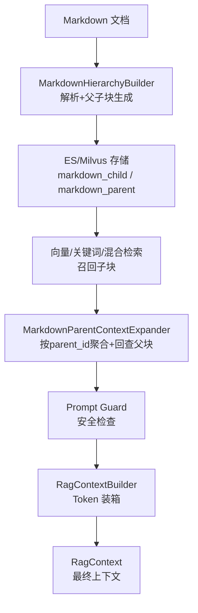
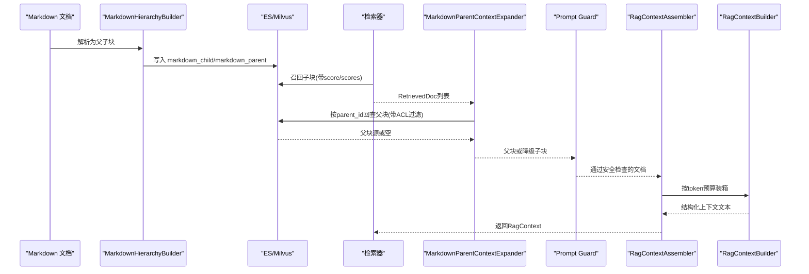
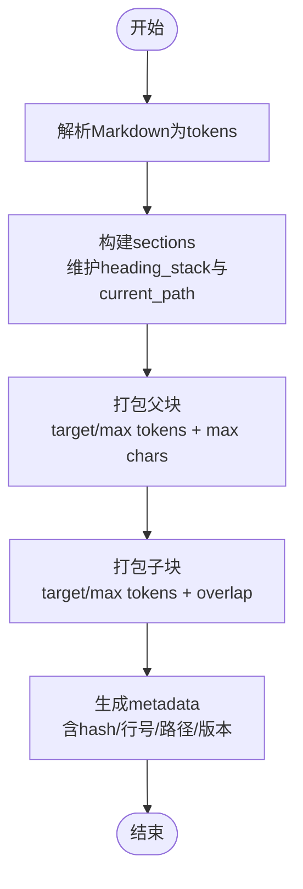
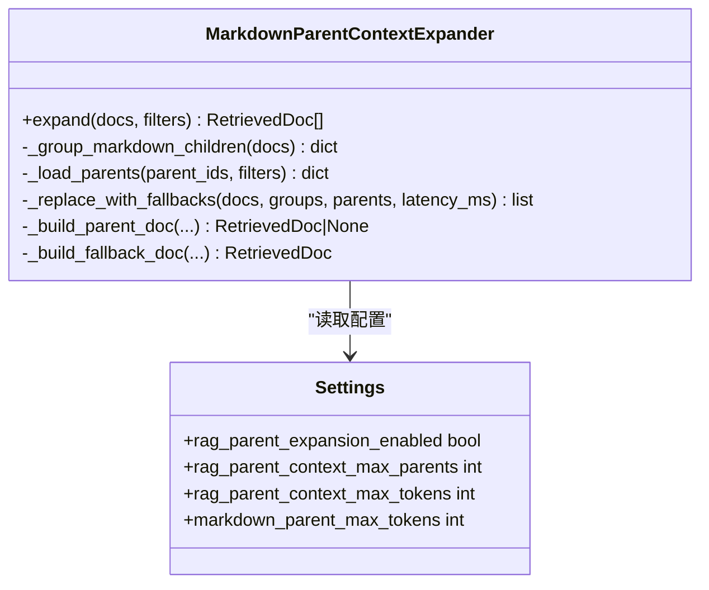
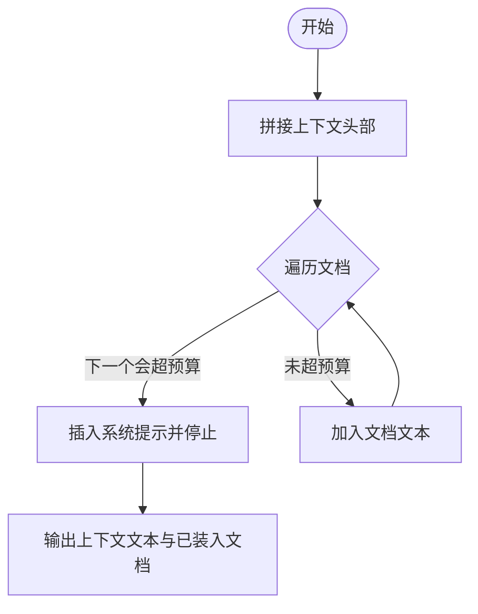
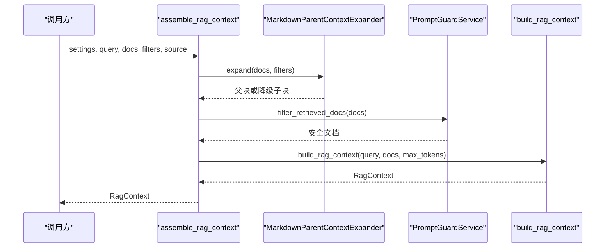
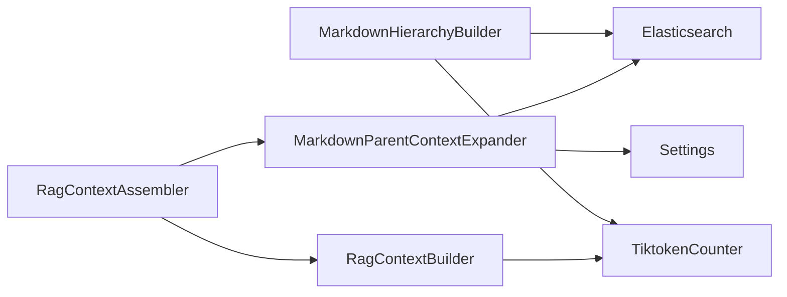

# 上下文构建

<cite>
**本文引用的文件**
- [rag_context_builder.py](file://python-agent-study/src/fast_app/services/rag/rag_context_builder.py)
- [markdown_parent_context.py](file://python-agent-study/src/fast_app/services/rag/markdown_parent_context.py)
- [rag_context_assembler.py](file://python-agent-study/src/fast_app/services/rag/rag_context_assembler.py)
- [markdown_hierarchy.py](file://python-agent-study/src/fast_app/ingestion/processing/markdown_hierarchy.py)
- [rag_models.py](file://python-agent-study/src/fast_app/domain/rag_models.py)
- [test_markdown_parent_child.py](file://python-agent-study/scripts/tests/ingestion/test_markdown_parent_child.py)
- [markdown的切割策略重构.md](file://python-agent-study/learning-docs/phase-10/markdown的切割策略重构.md)
</cite>

## 目录
1. [简介](#简介)
2. [项目结构](#项目结构)
3. [核心组件](#核心组件)
4. [架构总览](#架构总览)
5. [详细组件分析](#详细组件分析)
6. [依赖关系分析](#依赖关系分析)
7. [性能与长度控制](#性能与长度控制)
8. [故障排查指南](#故障排查指南)
9. [结论](#结论)
10. [附录：配置与使用示例](#附录配置与使用示例)

## 简介
本文件系统化说明“父级上下文扩展（Parent Context Expansion）”在企业级 RAG 中的实现原理与工程实践，覆盖以下主题：
- Markdown 文档层次结构解析、父子块生成与元数据设计
- 检索后按 parent_id 聚合子块并安全回查父块
- 上下文窗口管理：token 预算、父块不截断、降级策略
- RagContextBuilder 与 RagContextAssembler 的工作流程
- Chunk 聚合策略、元数据注入、上下文裁剪算法
- Markdown 特殊处理：标题层级识别、段落关系维护、引用链接处理
- 配置方式、不同文档类型处理、质量优化建议

## 项目结构
围绕上下文构建的关键代码分布在 ingestion 处理阶段与 services/rag 组装阶段：
- 解析与分块：Markdown 文档被解析为“父块 + 子块”，并写入 ES/Milvus
- 检索后扩展：对召回的子块进行去重、按 parent_id 分组、回查父块
- 上下文装配：统一入口执行“父块扩展 → Prompt Guard → Token 装箱 → 输出 RagContext”

图表来源
- [markdown_hierarchy.py:123-237](file://python-agent-study/src/fast_app/ingestion/processing/markdown_hierarchy.py#L123-L237)
- [markdown_parent_context.py:49-119](file://python-agent-study/src/fast_app/services/rag/markdown_parent_context.py#L49-L119)
- [rag_context_assembler.py:20-45](file://python-agent-study/src/fast_app/services/rag/rag_context_assembler.py#L20-L45)
- [rag_context_builder.py:55-128](file://python-agent-study/src/fast_app/services/rag/rag_context_builder.py#L55-L128)

章节来源
- [markdown_hierarchy.py:123-237](file://python-agent-study/src/fast_app/ingestion/processing/markdown_hierarchy.py#L123-L237)
- [markdown_parent_context.py:49-119](file://python-agent-study/src/fast_app/services/rag/markdown_parent_context.py#L49-L119)
- [rag_context_assembler.py:20-45](file://python-agent-study/src/fast_app/services/rag/rag_context_assembler.py#L20-L45)
- [rag_context_builder.py:55-128](file://python-agent-study/src/fast_app/services/rag/rag_context_builder.py#L55-L128)

## 核心组件
- MarkdownHierarchyBuilder：将 Markdown 解析为有界父块和用于召回的结构感知子块，维护标题层级、段落关系、行号与内容哈希等元数据。
- MarkdownParentContextExpander：在检索后对子块按 parent_id 分组，安全回查父块，合并分数与来源，受父块数量与 token 预算限制；失败时降级返回最佳子块。
- RagContextBuilder：负责结构化上下文文本构建与 token 装箱，保证父块不被静默截断，并在超预算时停止追加后续文档。
- RagContextAssembler：统一装配入口，固定顺序执行“父块扩展 → Prompt Guard → Token 装箱 → 构建 RagContext”，并记录观测指标。

章节来源
- [markdown_hierarchy.py:123-237](file://python-agent-study/src/fast_app/ingestion/processing/markdown_hierarchy.py#L123-L237)
- [markdown_parent_context.py:49-119](file://python-agent-study/src/fast_app/services/rag/markdown_parent_context.py#L49-L119)
- [rag_context_builder.py:55-128](file://python-agent-study/src/fast_app/services/rag/rag_context_builder.py#L55-L128)
- [rag_context_assembler.py:20-45](file://python-agent-study/src/fast_app/services/rag/rag_context_assembler.py#L20-L45)

## 架构总览
下图展示从文档到最终上下文的完整链路，包括关键决策点与约束：

图表来源
- [markdown_hierarchy.py:123-237](file://python-agent-study/src/fast_app/ingestion/processing/markdown_hierarchy.py#L123-L237)
- [markdown_parent_context.py:136-165](file://python-agent-study/src/fast_app/services/rag/markdown_parent_context.py#L136-L165)
- [rag_context_assembler.py:20-45](file://python-agent-study/src/fast_app/services/rag/rag_context_assembler.py#L20-L45)
- [rag_context_builder.py:70-108](file://python-agent-study/src/fast_app/services/rag/rag_context_builder.py#L70-L108)

## 详细组件分析

### Markdown 层次结构与父子块生成
- 标题层级识别：基于 MarkdownIt 解析 heading_open，维护 heading_stack 与 current_path，形成 section_path 与 heading_level。
- 段落关系维护：将 paragraph/blockquote/list/code/table/html_block/hr 等作为顶层块收集，保持原始行号 line_start/line_end。
- 父子块打包：
  - 父块：按 target/max tokens 与 max chars 打包，确保父块完整性，避免中间截断。
  - 子块：以较小目标 token 切分，支持重叠（child_overlap_tokens），提升召回覆盖率。
- 元数据设计：包含 record_type、parent_id、section_key、section_path、heading_level、section_index、parent_index、child_index、token_count、char_count、line_start/end、content_hash、chunk_strategy_version 等，便于溯源与校验。
- 搜索文本：search_text 由“标题路径 > 正文”构成，利于关键词检索与 embedding。

图表来源
- [markdown_hierarchy.py:239-303](file://python-agent-study/src/fast_app/ingestion/processing/markdown_hierarchy.py#L239-L303)
- [markdown_hierarchy.py:319-386](file://python-agent-study/src/fast_app/ingestion/processing/markdown_hierarchy.py#L319-L386)
- [markdown_hierarchy.py:539-573](file://python-agent-study/src/fast_app/ingestion/processing/markdown_hierarchy.py#L539-L573)

章节来源
- [markdown_hierarchy.py:239-303](file://python-agent-study/src/fast_app/ingestion/processing/markdown_hierarchy.py#L239-L303)
- [markdown_hierarchy.py:319-386](file://python-agent-study/src/fast_app/ingestion/processing/markdown_hierarchy.py#L319-L386)
- [markdown_hierarchy.py:539-573](file://python-agent-study/src/fast_app/ingestion/processing/markdown_hierarchy.py#L539-L573)

### 父级上下文扩展（Parent Context Expansion）
- 触发条件：仅当设置启用且存在召回子块时执行。
- 证据子块限制：最多取前 12 个 rerank 后的子块作为证据。
- 分组与回查：
  - 仅对 document_type=markdown 且 record_type=child 的子块按 parent_id 分组。
  - 使用 ids + ACL filters + document_type=markdown + record_type=markdown_parent 查询父块，禁止无过滤 mget。
- 父块构建与校验：
  - 继承最高分子块分数，合并所有命中子块的检索来源。
  - 严格校验 parent_id、doc_id、策略版本、token_count、char_count、content_hash、visibility/allowed_departments/allowed_users/permission_source 一致性。
- 预算与降级：
  - 最多采用 N 个父块（由配置决定），总上下文不超过最大 token 预算。
  - 若父块缺失、校验失败、数量达到上限或预算放不下，则降级返回最佳子块，并标记 chunk_level=child、parent_expansion_degraded=True。
- 可观测性：记录 child_hit_count、unique_parent_count、parent_lookup_latency_ms、expanded_count、fallback_count、context_token_count、chunk_strategy_version。

图表来源
- [markdown_parent_context.py:38-119](file://python-agent-study/src/fast_app/services/rag/markdown_parent_context.py#L38-L119)
- [markdown_parent_context.py:167-214](file://python-agent-study/src/fast_app/services/rag/markdown_parent_context.py#L167-L214)
- [markdown_parent_context.py:216-282](file://python-agent-study/src/fast_app/services/rag/markdown_parent_context.py#L216-L282)

章节来源
- [markdown_parent_context.py:49-119](file://python-agent-study/src/fast_app/services/rag/markdown_parent_context.py#L49-L119)
- [markdown_parent_context.py:167-214](file://python-agent-study/src/fast_app/services/rag/markdown_parent_context.py#L167-L214)
- [markdown_parent_context.py:216-282](file://python-agent-study/src/fast_app/services/rag/markdown_parent_context.py#L216-L282)

### RagContextBuilder：上下文窗口管理与裁剪
- 结构化上下文：每个文档包装为 <untrusted_document> 标签，附带 index/doc_id/source/score。
- 父块保护：父块 content 不被静默截断；非父块文档按默认字符上限截断。
- Token 装箱：使用 TiktokenCounter 计算上下文 token 数，逐个加入文档直到超过最大 token 预算；超出时插入系统提示并停止追加。
- 结果：RagContext.docs 仅包含真正装入上下文的文档，API sources 与实际 LLM 看到的资料一致。

图表来源
- [rag_context_builder.py:26-43](file://python-agent-study/src/fast_app/services/rag/rag_context_builder.py#L26-L43)
- [rag_context_builder.py:70-108](file://python-agent-study/src/fast_app/services/rag/rag_context_builder.py#L70-L108)
- [rag_context_builder.py:111-128](file://python-agent-study/src/fast_app/services/rag/rag_context_builder.py#L111-L128)

章节来源
- [rag_context_builder.py:26-43](file://python-agent-study/src/fast_app/services/rag/rag_context_builder.py#L26-L43)
- [rag_context_builder.py:70-108](file://python-agent-study/src/fast_app/services/rag/rag_context_builder.py#L70-L108)
- [rag_context_builder.py:111-128](file://python-agent-study/src/fast_app/services/rag/rag_context_builder.py#L111-L128)

### RagContextAssembler：统一装配入口
- 固定顺序：父块扩展 → Prompt Guard → Token 装箱 → 构建 RagContext。
- 观测指标：child hit count、unique parent count、parent lookup latency、expanded/fallback count、context token count、chunk strategy version。
- 快照记录：记录最终上下文以便评测与回溯。

图表来源
- [rag_context_assembler.py:20-45](file://python-agent-study/src/fast_app/services/rag/rag_context_assembler.py#L20-L45)
- [rag_context_assembler.py:48-80](file://python-agent-study/src/fast_app/services/rag/rag_context_assembler.py#L48-L80)

章节来源
- [rag_context_assembler.py:20-45](file://python-agent-study/src/fast_app/services/rag/rag_context_assembler.py#L20-L45)
- [rag_context_assembler.py:48-80](file://python-agent-study/src/fast_app/services/rag/rag_context_assembler.py#L48-L80)

### 数据模型与元数据
- RetrievedDoc：id、content、score、source、title、metadata、retrieval_sources、scores。
- RetrievalFilters：source_path、section_path、can_read_all、user_id、department_codes、allow_public、knowledge_version。
- RagContext：query、docs、context_text。
- Markdown 元数据：record_type、parent_id、section_key、section_path、heading_level、section_index、parent_index、child_index、token_count、char_count、line_start/end、content_hash、chunk_strategy_version。

章节来源
- [rag_models.py:8-80](file://python-agent-study/src/fast_app/domain/rag_models.py#L8-L80)
- [markdown_hierarchy.py:539-573](file://python-agent-study/src/fast_app/ingestion/processing/markdown_hierarchy.py#L539-L573)

## 依赖关系分析
- MarkdownHierarchyBuilder 依赖 MarkdownIt 解析与 TiktokenCounter 计数，产出父子块与丰富 metadata。
- MarkdownParentContextExpander 依赖 Elasticsearch 客户端与 Settings，结合 ACL 过滤安全回查父块。
- RagContextBuilder 依赖 TiktokenCounter 进行 token 预算控制，保证父块完整性。
- RagContextAssembler 协调上述组件，提供统一入口与观测指标。

图表来源
- [markdown_hierarchy.py:123-128](file://python-agent-study/src/fast_app/ingestion/processing/markdown_hierarchy.py#L123-L128)
- [markdown_parent_context.py:38-47](file://python-agent-study/src/fast_app/services/rag/markdown_parent_context.py#L38-L47)
- [rag_context_builder.py:1-3](file://python-agent-study/src/fast_app/services/rag/rag_context_builder.py#L1-L3)
- [rag_context_assembler.py:1-18](file://python-agent-study/src/fast_app/services/rag/rag_context_assembler.py#L1-L18)

章节来源
- [markdown_hierarchy.py:123-128](file://python-agent-study/src/fast_app/ingestion/processing/markdown_hierarchy.py#L123-L128)
- [markdown_parent_context.py:38-47](file://python-agent-study/src/fast_app/services/rag/markdown_parent_context.py#L38-L47)
- [rag_context_builder.py:1-3](file://python-agent-study/src/fast_app/services/rag/rag_context_builder.py#L1-L3)
- [rag_context_assembler.py:1-18](file://python-agent-study/src/fast_app/services/rag/rag_context_assembler.py#L1-L18)

## 性能与长度控制
- 证据子块限制：最多取前 12 个子块参与父块扩展，降低回查压力。
- 父块数量限制：由配置控制最多采用的父块数量，防止上下文膨胀。
- Token 预算：上下文总 token 数受最大预算限制，超出时停止追加后续文档，避免静默截断父块。
- 降级策略：父块缺失、版本不匹配、权限不一致或预算不足时，降级返回最佳子块并标记 degraded，保障服务可用性。
- 可观测性：记录 parent lookup latency、expanded/fallback counts、context token count、chunk strategy version，便于监控与调优。

章节来源
- [markdown_parent_context.py:49-119](file://python-agent-study/src/fast_app/services/rag/markdown_parent_context.py#L49-L119)
- [markdown_parent_context.py:167-214](file://python-agent-study/src/fast_app/services/rag/markdown_parent_context.py#L167-L214)
- [rag_context_builder.py:70-108](file://python-agent-study/src/fast_app/services/rag/rag_context_builder.py#L70-L108)
- [markdown的切割策略重构.md:90-108](file://python-agent-study/learning-docs/phase-10/markdown的切割策略重构.md#L90-L108)

## 故障排查指南
- 父块回查失败：检查 Elasticsearch 客户端是否初始化、索引名与请求超时配置是否正确；查看日志事件 rag.parent_expansion.degraded。
- 版本不匹配：确认 chunk_strategy_version 一致；否则视为降级并记录 parent_expansion_degraded=True。
- 权限不一致：校验 visibility、allowed_departments、allowed_users、permission_source 是否与子块一致；不一致则拒绝父块。
- 预算不足：若父块无法放入上下文，将降级为子块；调整 rag_parent_context_max_tokens 或减少父块数量。
- 测试验证：参考测试用例验证父块扩展与上下文装配行为，包括降级场景与多管线集成。

章节来源
- [markdown_parent_context.py:136-165](file://python-agent-study/src/fast_app/services/rag/markdown_parent_context.py#L136-L165)
- [markdown_parent_context.py:216-282](file://python-agent-study/src/fast_app/services/rag/markdown_parent_context.py#L216-L282)
- [test_markdown_parent_child.py:241-381](file://python-agent-study/scripts/tests/ingestion/test_markdown_parent_child.py#L241-L381)

## 结论
该上下文构建方案通过“细粒度子块提高召回准确率 + 有界父块补充上下文 + ACL 回查防止越权 + Prompt Guard 检查完整输入 + Token budget 防止上下文失控”，形成一套企业级 Markdown 检索与上下文装配策略。其核心在于：
- 严格的父子块元数据与校验机制，确保父块可信
- 安全的父块回查与降级策略，保障鲁棒性
- 统一的装配入口与可观测性，便于监控与调优
- 明确的长度控制与裁剪算法，避免上下文失控

## 附录：配置与使用示例
- 启用父块扩展：设置 RAG_PARENT_EXPANSION_ENABLED=True，并传入 MarkdownParentContextExpander 实例。
- 控制父块数量与 token 预算：通过 Settings 的 rag_parent_context_max_parents 与 rag_parent_context_max_tokens 配置。
- 处理不同类型文档：非 Markdown 文档直接走现有检索与装配流程，不参与父块扩展。
- 优化上下文质量：
  - 调整 MarkdownHierarchyOptions 的 parent_target_tokens、child_target_tokens、child_overlap_tokens 等参数，平衡召回与上下文完整性。
  - 关注可观测指标，定位降级原因与性能瓶颈。
- 参考测试用例：通过 test_markdown_parent_child.py 验证父块扩展、降级与上下文装配行为。

章节来源
- [test_markdown_parent_child.py:241-381](file://python-agent-study/scripts/tests/ingestion/test_markdown_parent_child.py#L241-L381)
- [markdown的切割策略重构.md:90-108](file://python-agent-study/learning-docs/phase-10/markdown的切割策略重构.md#L90-L108)