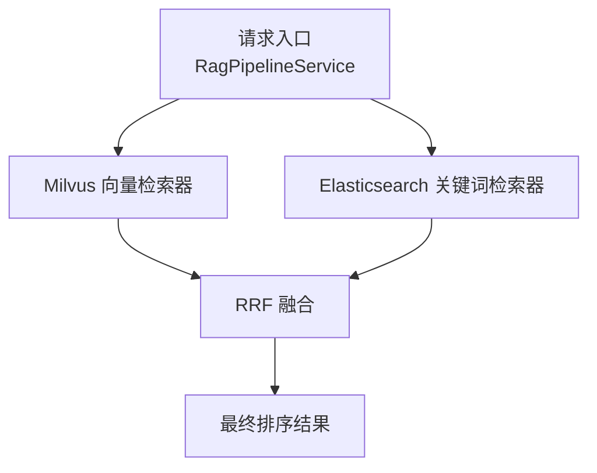
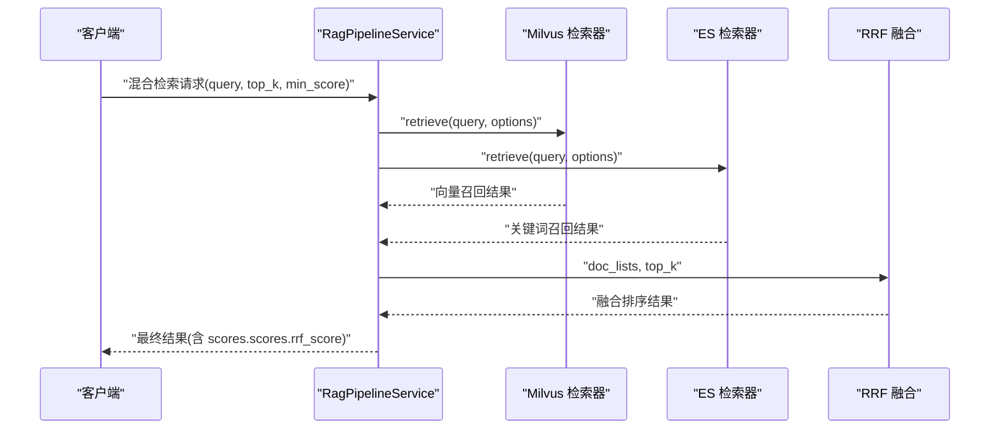
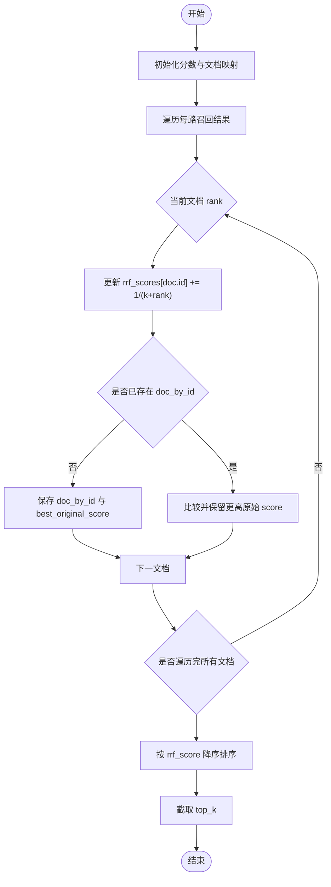
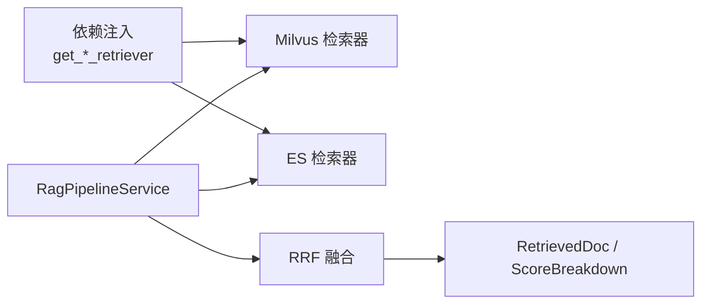

# 检索结果融合

<cite>
**本文引用的文件**
- [retrieval_fusion.py](file://src/fast_app/services/rag/retrieval_fusion.py)
- [rag_pipeline_service.py](file://src/fast_app/services/rag/rag_pipeline_service.py)
- [rag_dependencies.py](file://src/fast_app/dependencies/rag_dependencies.py)
- [milvus_vector_retriever.py](file://src/fast_app/components/retrievers/milvus_vector_retriever.py)
- [elasticsearch_keyword_retriever.py](file://src/fast_app/components/retrievers/elasticsearch_keyword_retriever.py)
- [config.py](file://src/fast_app/core/config.py)
- [cli.py](file://src/fast_app/ingestion/cli.py)
- [rag_models.py](file://src/fast_app/domain/rag_models.py)
- [12-3-检索链路日志vector-keyword-rrf-rerank.md](file://learning-docs/phase-12/12-3-检索链路日志vector-keyword-rrf-rerank.md)
</cite>

## 目录
1. [简介](#简介)
2. [项目结构](#项目结构)
3. [核心组件](#核心组件)
4. [架构总览](#架构总览)
5. [详细组件分析](#详细组件分析)
6. [依赖关系分析](#依赖关系分析)
7. [性能考量](#性能考量)
8. [故障排查指南](#故障排查指南)
9. [结论](#结论)
10. [附录：配置与调优清单](#附录：配置与调优清单)

## 简介
本文件聚焦混合检索中的“检索结果融合”能力，围绕向量检索（Milvus）与关键词检索（Elasticsearch）的并行召回、RRF（Reciprocal Rank Fusion）融合算法实现、参数调优、权重策略、相关性评分标准化、去重机制、以及检索性能监控与故障排查进行系统化说明。文档以仓库中实际代码为依据，提供可落地的配置与排障建议。

## 项目结构
混合检索在工程上由以下层次组成：
- 检索器层：Milvus 向量检索器、Elasticsearch 关键词检索器，分别负责语义召回与倒排索引召回。
- 服务编排层：RAG Pipeline 通过异步并发调用两个检索器，收集成功结果并进入融合阶段。
- 融合层：基于 RRF 对多路召回结果进行无监督排序与去重，输出统一排序列表。
- 配置与依赖注入：通过依赖注入获取具体检索器实例；配置项管理 Milvus/ES 连接与集合/索引名等。

图表来源
- [rag_pipeline_service.py:284-314](file://src/fast_app/services/rag/rag_pipeline_service.py#L284-L314)
- [milvus_vector_retriever.py](file://src/fast_app/components/retrievers/milvus_vector_retriever.py)
- [elasticsearch_keyword_retriever.py](file://src/fast_app/components/retrievers/elasticsearch_keyword_retriever.py)
- [retrieval_fusion.py:8-79](file://src/fast_app/services/rag/retrieval_fusion.py#L8-L79)

章节来源
- [rag_pipeline_service.py:284-314](file://src/fast_app/services/rag/rag_pipeline_service.py#L284-L314)
- [config.py:58-84](file://src/fast_app/core/config.py#L58-L84)

## 核心组件
- 向量检索器（Milvus）：将查询转为向量后执行近似最近邻搜索，返回带相似度分数的候选文档。
- 关键词检索器（Elasticsearch）：基于倒排索引和 BM25 等算法进行关键词匹配，返回相关度分数。
- 融合器（RRF）：对多路召回结果按秩次计算倒数秩和，合并相同 doc_id 的文档，保留原始最高分与来源信息，并按 RRF 分数降序截断输出。
- 依赖注入与配置：根据配置选择具体检索器实现，集中管理 Milvus/ES 的连接参数。

章节来源
- [rag_dependencies.py:97-140](file://src/fast_app/dependencies/rag_dependencies.py#L97-L140)
- [config.py:58-84](file://src/fast_app/core/config.py#L58-L84)
- [retrieval_fusion.py:8-79](file://src/fast_app/services/rag/retrieval_fusion.py#L8-L79)

## 架构总览
混合检索采用“并行召回 + RRF 融合”的架构：
- 并发召回：同时发起 Milvus 与 Elasticsearch 检索，提升吞吐、降低端到端延迟。
- 失败隔离：任一检索源异常不影响其他源，仅记录告警并继续融合可用结果。
- 融合排序：使用 RRF 对多路结果进行无参（或可调 k）融合，避免不同检索器的分数不可比问题。
- 指标与追踪：在关键节点记录耗时、输入/输出数量、Top Doc IDs，便于定位瓶颈。

图表来源
- [rag_pipeline_service.py:284-314](file://src/fast_app/services/rag/rag_pipeline_service.py#L284-L314)
- [retrieval_fusion.py:8-79](file://src/fast_app/services/rag/retrieval_fusion.py#L8-L79)

## 详细组件分析

### RRF 融合算法实现与参数调优
- 算法要点
  - 对每路召回结果的每个文档，按其在该路的排名 rank 计算 1/(k+rank)，累加到该 doc_id 的 RRF 分数。
  - 若同一 doc_id 在多路出现，保留其原始最高 score，并聚合 retrieval_sources。
  - 最终按 RRF 分数降序排序，截取 top_k。
- 关键参数
  - k：控制秩次衰减速度。k 越大，越接近“只要出现在前若干名就有贡献”，适合召回量大、噪声多的场景；k 越小，越强调“高排名优先”。
  - top_k：最终输出条数，通常与下游上下文窗口和 LLM 输入限制相关。
- 复杂度
  - 时间复杂度 O(N log N)（N 为去重后的唯一文档数），主要开销在排序。
  - 空间复杂度 O(N)（保存分数映射与文档对象）。
- 适用性
  - 无需训练、不依赖各检索器分数分布一致性，天然支持多路异构结果融合。

图表来源
- [retrieval_fusion.py:8-79](file://src/fast_app/services/rag/retrieval_fusion.py#L8-L79)

章节来源
- [retrieval_fusion.py:8-79](file://src/fast_app/services/rag/retrieval_fusion.py#L8-L79)

### Milvus 向量检索器：配置、查询优化与性能调优
- 配置要点
  - 连接地址与端口、集合名、向量字段名、ID 字段名、内容字段名等均在配置中声明。
  - 依赖注入根据 provider 选择 Milvus 检索器实例。
- 查询优化建议
  - 合理设置 top_k/candidate_k，避免过大导致内存与排序压力。
  - 结合业务过滤条件（如权限、知识库范围）减少候选集。
  - 关注 embedding 维度与距离度量是否与 collection schema 一致。
- 性能调优
  - 调整 Milvus 集群资源与索引类型（如 HNSW、IVF_FLAT）以提升召回速度与精度平衡。
  - 监控向量检索耗时与返回条数，必要时拆分批量查询或分页处理。

章节来源
- [config.py:58-84](file://src/fast_app/core/config.py#L58-L84)
- [rag_dependencies.py:97-118](file://src/fast_app/dependencies/rag_dependencies.py#L97-L118)
- [milvus_vector_retriever.py](file://src/fast_app/components/retrievers/milvus_vector_retriever.py)

### Elasticsearch 关键词检索器：配置、查询优化与性能调优
- 配置要点
  - ES URL、用户名/密码、索引名等通过配置注入；CLI 工具集中构建 ES 客户端，统一超时与认证逻辑。
- 查询优化建议
  - 使用合适的 analyzer 与分词策略，确保中文关键词召回质量。
  - 合理使用 filter 子句缩小搜索范围，避免全表扫描。
  - 控制返回字段与 size，减少网络与序列化开销。
- 性能调优
  - 调整 shard 与 replica 数量，平衡读写吞吐与可用性。
  - 监控慢查询与热点索引，必要时重建索引或优化 mapping。

章节来源
- [config.py:71-84](file://src/fast_app/core/config.py#L71-L84)
- [cli.py:79-106](file://src/fast_app/ingestion/cli.py#L79-L106)
- [elasticsearch_keyword_retriever.py:222-241](file://src/fast_app/components/retrievers/elasticsearch_keyword_retriever.py#L222-L241)

### 权重分配策略与相关性评分标准化
- 当前实现
  - RRF 是无监督融合方法，不直接引入显式权重；通过 k 控制“高排名”的相对重要性。
  - 若需显式加权，可在融合前对各路结果做“预缩放”（例如对某路结果整体乘以权重系数后再参与 RRF），但需谨慎评估对排序的影响。
- 评分标准化
  - RRF 天然规避了不同检索器分数尺度不一致的问题，因为使用的是秩次而非绝对分数。
  - 融合后仍保留原始最高 score，并在 scores 中记录 rrf_score，便于后续分析与阈值过滤。

章节来源
- [retrieval_fusion.py:8-79](file://src/fast_app/services/rag/retrieval_fusion.py#L8-L79)
- [rag_models.py](file://src/fast_app/domain/rag_models.py)

### 结果去重机制
- 去重键：以 doc.id 作为唯一标识进行合并。
- 保留策略：
  - 保留原始最高 score 的文档对象。
  - 聚合 retrieval_sources，记录该文档来自哪些检索源。
- 排序依据：最终以 rrf_score 降序排列，再截取 top_k。

章节来源
- [retrieval_fusion.py:13-64](file://src/fast_app/services/rag/retrieval_fusion.py#L13-L64)

### 边界情况处理
- 空结果：当所有检索源均失败或过滤后为空时，抛出“无搜索结果”错误，便于上层降级或提示。
- 部分失败：任一检索源异常不影响其他源，仅记录告警并继续融合可用结果。
- 低分结果：可通过 min_score 在单路过滤或最终阈值过滤，避免无关噪声进入上下文。

章节来源
- [rag_pipeline_service.py:1387-1444](file://src/fast_app/services/rag/rag_pipeline_service.py#L1387-L1444)
- [rag_pipeline_service.py:284-314](file://src/fast_app/services/rag/rag_pipeline_service.py#L284-L314)

## 依赖关系分析
- 依赖注入
  - 通过 get_vector_retriever/get_keyword_retriever 根据配置动态创建 Milvus/ES 检索器实例。
- 服务编排
  - RagPipelineService 在 hybrid 模式下并发调用两路检索器，收集成功结果并调用 RRF 融合。
- 数据模型
  - RetrievedDoc 与 ScoreBreakdown 承载文档、分数与来源信息，贯穿检索与融合流程。

图表来源
- [rag_dependencies.py:97-140](file://src/fast_app/dependencies/rag_dependencies.py#L97-L140)
- [rag_pipeline_service.py:284-314](file://src/fast_app/services/rag/rag_pipeline_service.py#L284-L314)
- [retrieval_fusion.py:8-79](file://src/fast_app/services/rag/retrieval_fusion.py#L8-L79)
- [rag_models.py](file://src/fast_app/domain/rag_models.py)

章节来源
- [rag_dependencies.py:97-140](file://src/fast_app/dependencies/rag_dependencies.py#L97-L140)
- [rag_pipeline_service.py:284-314](file://src/fast_app/services/rag/rag_pipeline_service.py#L284-L314)
- [rag_models.py](file://src/fast_app/domain/rag_models.py)

## 性能考量
- 并发召回：使用异步并发同时发起 Milvus 与 ES 检索，显著降低端到端延迟。
- 融合开销：RRF 的时间复杂度主要由排序决定，注意控制 candidate_k 与 top_k。
- 监控指标：在 vector.finish、keyword.finish、rrf.finish 等事件记录耗时、输入/输出数量与 Top Doc IDs，便于定位瓶颈。
- 慢检索告警：当检索耗时超过阈值时记录 slow 事件，辅助容量规划与优化。

章节来源
- [rag_pipeline_service.py:1387-1444](file://src/fast_app/services/rag/rag_pipeline_service.py#L1387-L1444)
- [12-3-检索链路日志vector-keyword-rrf-rerank.md:397-476](file://learning-docs/phase-12/12-3-检索链路日志vector-keyword-rrf-rerank.md#L397-L476)

## 故障排查指南
- 常见问题
  - 所有检索源失败：检查 Milvus/ES 连接、认证、集合/索引是否存在、权限过滤是否过严。
  - 结果为空：确认 min_score 阈值是否过高；检查单路过滤逻辑与业务 filter。
  - 中文关键词召回差：检查 ES analyzer 与分词配置；必要时调整 query 构造与字段映射。
- 定位步骤
  - 查看 vector.finish/keyword.finish 日志，确认各路召回条数与耗时。
  - 查看 rrf.finish 日志，核对 input_doc_count、unique_doc_count、output_doc_count 是否符合预期。
  - 若出现 slow 事件，结合 Top Doc IDs 与候选规模判断是否为热点或索引问题。
- 修复建议
  - 调整 candidate_k/top_k/min_score，平衡召回率与延迟。
  - 优化 ES 查询体与 filter，减少不必要的全量扫描。
  - 针对 Milvus，评估索引类型与参数，必要时重建 collection。

章节来源
- [rag_pipeline_service.py:1387-1444](file://src/fast_app/services/rag/rag_pipeline_service.py#L1387-L1444)
- [12-3-检索链路日志vector-keyword-rrf-rerank.md:397-476](file://learning-docs/phase-12/12-3-检索链路日志vector-keyword-rrf-rerank.md#L397-L476)

## 结论
本系统通过“并行召回 + RRF 融合”的混合检索架构，有效兼顾语义相似性与关键词精确匹配，具备无监督、可扩展、易监控的优势。通过合理的 k 与 top_k 调优、严格的过滤与阈值控制、完善的日志与慢检索告警，可以在保证召回质量的同时稳定控制延迟与资源消耗。

## 附录：配置与调优清单
- 关键配置项
  - Milvus：host/port、collection_name、vector_field、id_field、content_field。
  - Elasticsearch：url、index_name、username/password（可选）、request_timeout。
- 推荐调优顺序
  - 先调 candidate_k 与 min_score，确保单路召回质量。
  - 再调 RRF 的 k，观察 top_k 内结果的相关性变化。
  - 最后结合业务需求调整 top_k，控制下游上下文长度。
- 监控与诊断
  - 关注 vector.finish/keyword.finish/rrf.finish 的耗时与计数。
  - 利用 slow 事件识别瓶颈组件，针对性优化索引或查询。

章节来源
- [config.py:58-84](file://src/fast_app/core/config.py#L58-L84)
- [cli.py:79-106](file://src/fast_app/ingestion/cli.py#L79-L106)
- [rag_pipeline_service.py:1387-1444](file://src/fast_app/services/rag/rag_pipeline_service.py#L1387-L1444)