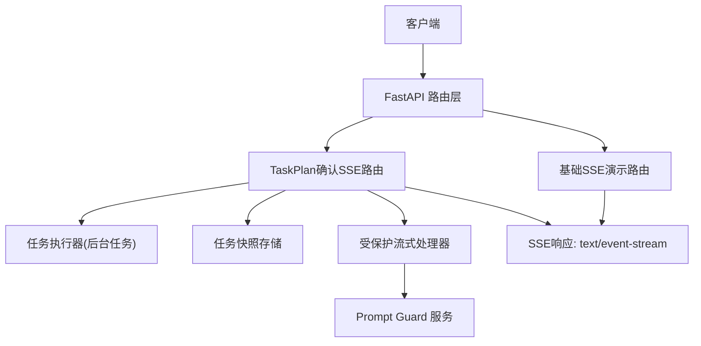
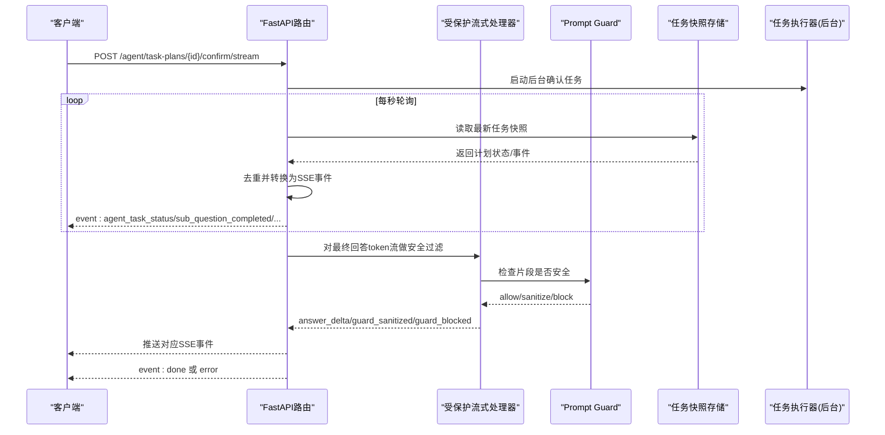
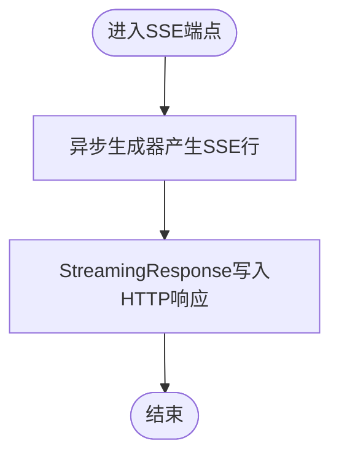
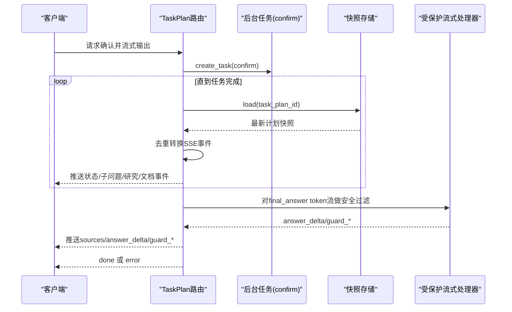
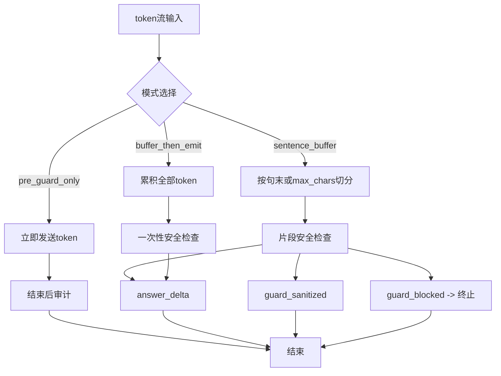
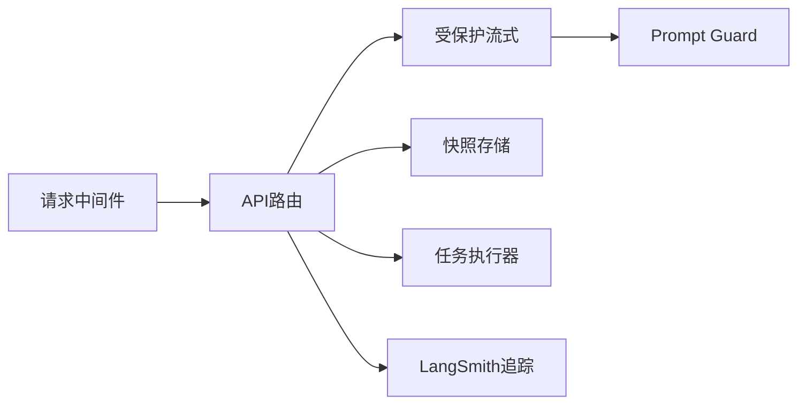
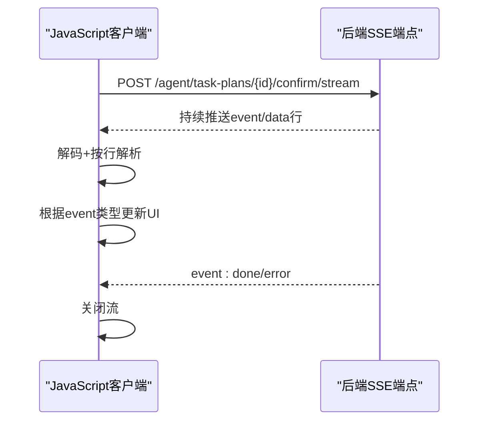

# 流式输出

<cite>
**本文引用的文件**
- [src/fast_app/api/stream_routes.py](file://src/fast_app/api/stream_routes.py)
- [src/fast_app/api/agent_task_plan_routes.py](file://src/fast_app/api/agent_task_plan_routes.py)
- [src/fast_app/services/rag/guarded_streaming.py](file://src/fast_app/services/rag/guarded_streaming.py)
- [src/fast_app/domain/rag_stream_models.py](file://src/fast_app/domain/rag_stream_models.py)
- [src/fast_app/services/chat_service.py](file://src/fast_app/services/chat_service.py)
- [src/app/async_sse_format_demo.py](file://src/app/async_sse_format_demo.py)
- [scripts/tests/agent_research/accept_research_117_119_real_chain.py](file://scripts/tests/agent_research/accept_research_117_119_real_chain.py)
- [scripts/tests/document_security/test_guarded_streaming.py](file://scripts/tests/document_security/test_guarded_streaming.py)
- [src/fast_app/middlewares/request_id_middleware.py](file://src/fast_app/middlewares/request_id_middleware.py)
</cite>

## 目录
1. [简介](#简介)
2. [项目结构](#项目结构)
3. [核心组件](#核心组件)
4. [架构总览](#架构总览)
5. [详细组件分析](#详细组件分析)
6. [依赖关系分析](#依赖关系分析)
7. [性能与背压](#性能与背压)
8. [故障排查与错误处理](#故障排查与错误处理)
9. [结论](#结论)
10. [附录：客户端集成示例](#附录客户端集成示例)

## 简介
本文件围绕仓库中的“受保护流式输出（Guarded Streaming）”机制，系统性说明 SSE（Server-Sent Events）协议处理、结构化事件模型、流式数据传输、错误恢复、连接保活、背压控制以及安全过滤策略。文档同时给出端到端调用流程、关键数据结构、性能优化建议与调试技巧，并附带 JavaScript、Python 等语言的客户端接收实现要点。

## 项目结构
本项目在 FastAPI 中提供两类流式能力：
- 基础流式演示：文本流与 SSE 流，用于快速验证 HTTP 层流式传输。
- 生产级受保护流式：以 TaskPlan 确认为例，将执行进度、工具调用结果、最终回答的增量 token 通过 SSE 结构化事件推送给前端，并在输出侧接入 Prompt Guard 进行安全审计与拦截。

图表来源
- [src/fast_app/api/stream_routes.py:1-38](file://src/fast_app/api/stream_routes.py#L1-L38)
- [src/fast_app/api/agent_task_plan_routes.py:258-433](file://src/fast_app/api/agent_task_plan_routes.py#L258-L433)
- [src/fast_app/services/rag/guarded_streaming.py:36-134](file://src/fast_app/services/rag/guarded_streaming.py#L36-L134)

章节来源
- [src/fast_app/api/stream_routes.py:1-38](file://src/fast_app/api/stream_routes.py#L1-L38)
- [src/fast_app/api/agent_task_plan_routes.py:258-433](file://src/fast_app/api/agent_task_plan_routes.py#L258-L433)

## 核心组件
- 基础流式路由：提供纯文本流和简单 SSE 流，便于本地验证。
- TaskPlan SSE 路由：创建后台任务执行确认流程，轮询任务快照，将状态变更、子问题完成、研究事件、文档事件、最终回答增量 token 等转换为 SSE 事件。
- 受保护流式处理器：对 LLM 输出的 token 流进行缓冲、句子边界切分、Prompt Guard 安全检查，产出 answer_delta、guard_sanitized、guard_blocked 等结构化事件。
- 结构化事件模型：定义统一的 RagStreamEventName 枚举与 RagStreamEvent 数据类，作为 Pipeline 与 API 之间的契约。
- 请求上下文与中间件：记录请求 ID、追踪 ID、慢请求日志，保障可观测性。

章节来源
- [src/fast_app/api/stream_routes.py:1-38](file://src/fast_app/api/stream_routes.py#L1-L38)
- [src/fast_app/api/agent_task_plan_routes.py:258-433](file://src/fast_app/api/agent_task_plan_routes.py#L258-L433)
- [src/fast_app/services/rag/guarded_streaming.py:14-134](file://src/fast_app/services/rag/guarded_streaming.py#L14-L134)
- [src/fast_app/domain/rag_stream_models.py:1-46](file://src/fast_app/domain/rag_stream_models.py#L1-L46)
- [src/fast_app/middlewares/request_id_middleware.py:74-97](file://src/fast_app/middlewares/request_id_middleware.py#L74-L97)

## 架构总览
下图展示从客户端到服务端再到外部服务的完整流式链路，包括 SSE 事件生成、任务快照轮询、Prompt Guard 安全过滤、以及最终 done/error 事件。

图表来源
- [src/fast_app/api/agent_task_plan_routes.py:258-433](file://src/fast_app/api/agent_task_plan_routes.py#L258-L433)
- [src/fast_app/services/rag/guarded_streaming.py:36-134](file://src/fast_app/services/rag/guarded_streaming.py#L36-L134)

## 详细组件分析

### 基础流式路由（文本与SSE）
- 文本流：使用异步生成器按固定间隔 yield 字符串块，媒体类型为 text/plain。
- SSE 流：按 SSE 规范逐行输出 data 字段，并以空行分隔；结束时发送 event: done。

图表来源
- [src/fast_app/api/stream_routes.py:11-38](file://src/fast_app/api/stream_routes.py#L11-L38)

章节来源
- [src/fast_app/api/stream_routes.py:1-38](file://src/fast_app/api/stream_routes.py#L1-L38)
- [src/app/async_sse_format_demo.py:6-14](file://src/app/async_sse_format_demo.py#L6-L14)

### TaskPlan 确认 SSE 路由
- 入口：POST /agent/task-plans/{task_plan_id}/confirm/stream。
- 行为：
  - 校验 confirmed=true。
  - 创建 LangSmith trace，记录操作元数据。
  - 启动后台任务执行 confirm，不阻塞当前 SSE 生成器。
  - 每秒轮询任务快照，将新增的子问题开始/完成、研究事件、文档事件、步骤完成/失败等转换为 SSE 事件。
  - 最终回答完成后，若存在 final_answer，则通过受保护流式处理器对 token 流进行安全过滤，再推送 sources、answer_delta、guard_*、done 等事件。
  - 异常时统一推送 error 事件。

图表来源
- [src/fast_app/api/agent_task_plan_routes.py:258-433](file://src/fast_app/api/agent_task_plan_routes.py#L258-L433)

章节来源
- [src/fast_app/api/agent_task_plan_routes.py:258-433](file://src/fast_app/api/agent_task_plan_routes.py#L258-L433)

### 受保护流式处理器（Guarded Streaming）
- 输入：LLM 原始 token 流（字符级）。
- 模式：
  - buffer_then_emit：先缓冲完整回答，再做一次输出安全检查，首包延迟最高但最安全。
  - pre_guard_only：先直接发送 token，结束后审计（仅兼容/观察，不建议严格场景）。
  - sentence_buffer（默认）：按句子边界或最大长度切分片段，逐个送审，平衡体验与安全。
- 输出：
  - answer_delta：安全片段，可直接展示。
  - guard_sanitized：已脱敏片段，可展示脱敏内容。
  - guard_blocked：高风险，停止后续输出。
- 状态：GuardedStreamState 累计 raw_token_count、emitted_parts、blocked 标志。

图表来源
- [src/fast_app/services/rag/guarded_streaming.py:36-134](file://src/fast_app/services/rag/guarded_streaming.py#L36-L134)
- [src/fast_app/services/rag/guarded_streaming.py:148-222](file://src/fast_app/services/rag/guarded_streaming.py#L148-L222)

章节来源
- [src/fast_app/services/rag/guarded_streaming.py:14-222](file://src/fast_app/services/rag/guarded_streaming.py#L14-L222)

### 结构化事件模型
- 事件名：RagStreamEventName 定义了所有允许的事件类型，包括业务事件（如 sources、tool_execution_result）、Agent 任务事件（如 agent_task_step_completed）、NL2SQL 事件（nl2sql_sql_generated、nl2sql_result）等。
- 事件体：RagStreamEvent 包含 event 名称与 data 字典，作为 Pipeline 与 API 之间的稳定契约。

章节来源
- [src/fast_app/domain/rag_stream_models.py:1-46](file://src/fast_app/domain/rag_stream_models.py#L1-L46)

### 聊天服务流式接口（参考）
- 提供非结构化字符流 chat_service.stream_chat，按字符间隔 yield，便于对比不同粒度的流式体验。

章节来源
- [src/fast_app/services/chat_service.py:19-24](file://src/fast_app/services/chat_service.py#L19-L24)

## 依赖关系分析
- API 路由依赖：
  - stream_routes 依赖 FastAPI StreamingResponse 与异步生成器。
  - agent_task_plan_routes 依赖任务执行器、快照存储、Prompt Guard、LangSmith 追踪。
- 受保护流式依赖：
  - guarded_streaming 依赖 Prompt Guard 服务与结构化事件模型。
- 可观测性：
  - request_id_middleware 记录请求耗时、错误类型、慢请求告警，并清理上下文避免污染。

图表来源
- [src/fast_app/api/agent_task_plan_routes.py:11-38](file://src/fast_app/api/agent_task_plan_routes.py#L11-L38)
- [src/fast_app/services/rag/guarded_streaming.py:1-9](file://src/fast_app/services/rag/guarded_streaming.py#L1-L9)
- [src/fast_app/middlewares/request_id_middleware.py:74-97](file://src/fast_app/middlewares/request_id_middleware.py#L74-L97)

章节来源
- [src/fast_app/api/agent_task_plan_routes.py:11-38](file://src/fast_app/api/agent_task_plan_routes.py#L11-L38)
- [src/fast_app/services/rag/guarded_streaming.py:1-9](file://src/fast_app/services/rag/guarded_streaming.py#L1-L9)
- [src/fast_app/middlewares/request_id_middleware.py:74-97](file://src/fast_app/middlewares/request_id_middleware.py#L74-L97)

## 性能与背压
- 背压控制：
  - 使用异步生成器与 StreamingResponse，天然支持流式背压；客户端消费速度决定服务器推送节奏。
  - 轮询快照采用固定间隔（约1秒），避免高频 I/O 造成负载抖动；可根据实际吞吐调整。
- 缓冲区大小：
  - sentence_buffer 模式下，max_chars 控制片段大小；过大影响首包延迟，过小增加安全检查次数。
- 并发与资源：
  - 后台任务与 SSE 生成器并行运行，减少阻塞；注意监控内存占用，尤其是大文档或长回答场景。
- 网络与保活：
  - SSE 使用 text/event-stream，浏览器/客户端通常具备自动重连能力；可在应用层加入心跳或 keepalive 逻辑（例如定时发送轻量 ping 事件）。

[本节为通用指导，不直接分析具体文件]

## 故障排查与错误处理
- 常见错误：
  - 快照暂不可读：轮询捕获异常后继续重试，避免短暂失败中断 SSE。
  - Prompt Guard 阻断：出现 guard_blocked 时立即终止后续 token 发送，防止高风险内容扩散。
  - 超时与重试：外部调用可使用重试策略（如 httpx 超时、5xx/429 重试），结合指数退避降低雪崩风险。
- 调试技巧：
  - 使用 LangSmith 追踪查看 pipeline 子节点与输入输出。
  - 利用中间件的慢请求日志定位瓶颈。
  - 使用测试脚本解析 SSE 事件流，断言事件顺序与关键字段。

章节来源
- [src/fast_app/api/agent_task_plan_routes.py:339-355](file://src/fast_app/api/agent_task_plan_routes.py#L339-L355)
- [src/fast_app/services/rag/guarded_streaming.py:113-122](file://src/fast_app/services/rag/guarded_streaming.py#L113-L122)
- [scripts/tests/agent_research/accept_research_117_119_real_chain.py:14-39](file://scripts/tests/agent_research/accept_research_117_119_real_chain.py#L14-L39)
- [src/fast_app/middlewares/request_id_middleware.py:74-97](file://src/fast_app/middlewares/request_id_middleware.py#L74-L97)

## 结论
该项目的流式输出体系以 FastAPI StreamingResponse 为基础，结合 TaskPlan 快照轮询与受保护流式处理器，实现了高可用、可观测、安全的 SSE 事件推送。通过结构化事件模型与 Prompt Guard 安全过滤，既保证了用户体验（低延迟、细粒度增量），又确保了输出合规（敏感信息脱敏、高风险阻断）。配合中间件与测试脚本，形成完整的开发、调试、验收闭环。

[本节为总结，不直接分析具体文件]

## 附录：客户端集成示例

### JavaScript（Fetch + ReadableStream）
- 目标：订阅 /agent/task-plans/{id}/confirm/stream 的 SSE 事件流。
- 关键点：
  - 使用 fetch 发起 POST 请求，获取 Response.body 的 ReadableStream。
  - 使用 TextDecoder 解码字节流为字符串。
  - 按行拆分，识别 event: 与 data: 字段，解析 JSON。
  - 处理 done 或 error 事件，关闭连接。

[此图为概念流程图，不映射具体源码文件]

### Python（requests + 行式解析）
- 目标：使用 requests 的流式响应解析 SSE。
- 关键点：
  - 设置 stream=True，逐行读取响应。
  - 跳过空行，识别 event: 与 data: 行。
  - 解析 data 为 JSON，处理业务事件与结束事件。
  - 捕获异常并记录错误事件。

章节来源
- [scripts/tests/agent_research/accept_research_117_119_real_chain.py:14-39](file://scripts/tests/agent_research/accept_research_117_119_real_chain.py#L14-L39)

### 单元测试与验收
- 受保护流式测试：验证 guard 行为（allow/sanitize/block）与事件顺序。
- 真实链验收：校验结构化 SSE 返回 task_plan_id、error 事件、Worker timeout 等。

章节来源
- [scripts/tests/document_security/test_guarded_streaming.py](file://scripts/tests/document_security/test_guarded_streaming.py)
- [scripts/tests/agent_research/accept_research_117_119_real_chain.py:83-163](file://scripts/tests/agent_research/accept_research_117_119_real_chain.py#L83-L163)