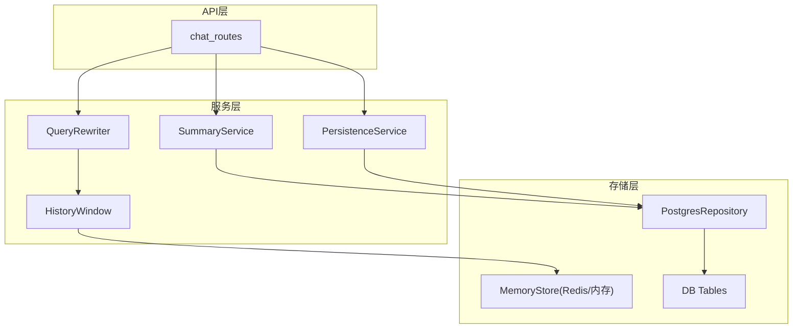
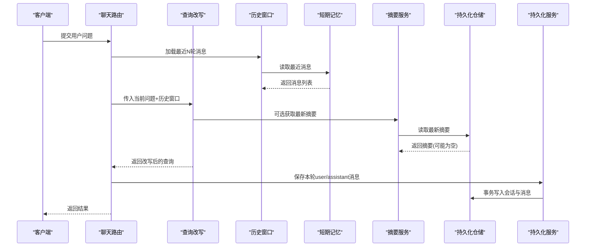
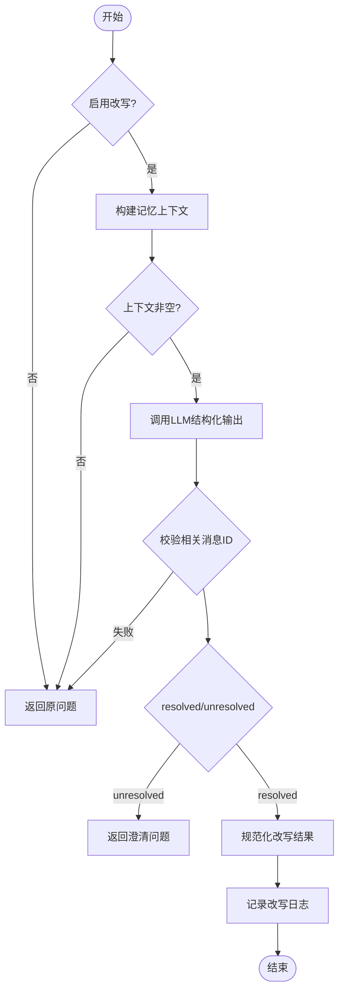
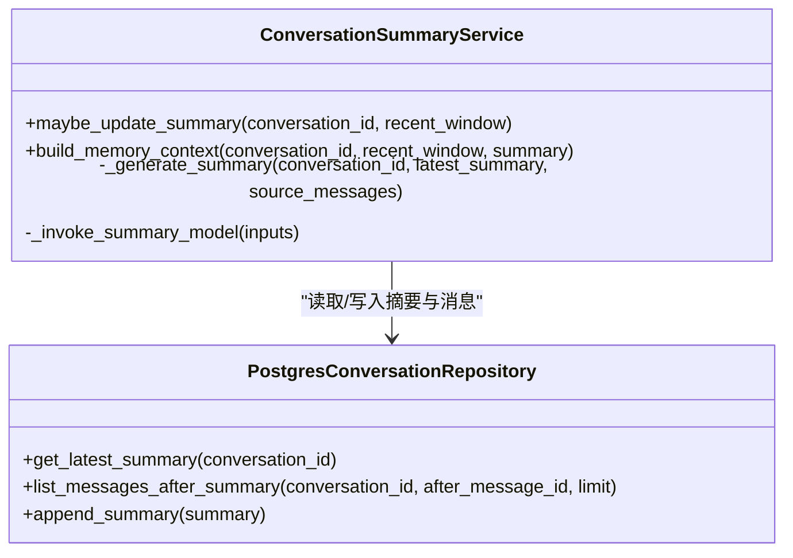
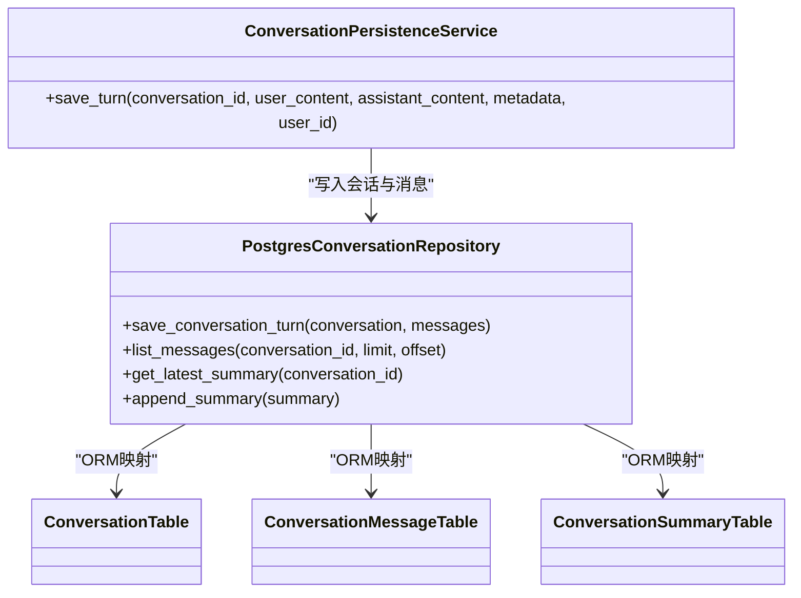
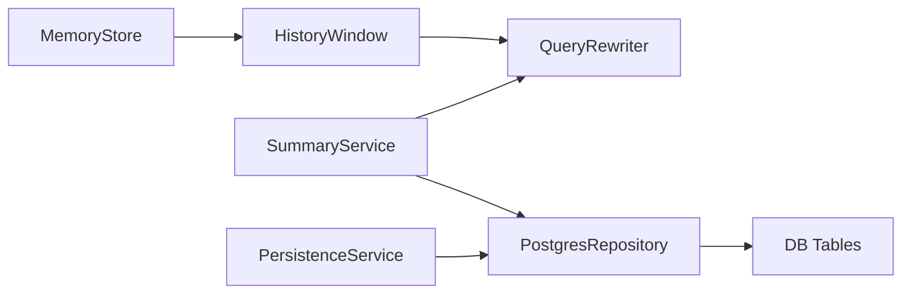

# 对话管理系统

<cite>
**本文引用的文件**
- [conversation_models.py](file://python-agent-study/src/fast_app/domain/conversation_models.py)
- [conversation_memory.py](file://python-agent-study/src/fast_app/services/conversation/conversation_memory.py)
- [conversation_history.py](file://python-agent-study/src/fast_app/services/conversation/conversation_history.py)
- [query_rewrite.py](file://python-agent-study/src/fast_app/services/conversation/query_rewrite.py)
- [conversation_summary.py](file://python-agent-study/src/fast_app/services/conversation/conversation_summary.py)
- [conversation_repository.py](file://python-agent-study/src/fast_app/services/conversation/conversation_repository.py)
- [conversation_persistence.py](file://python-agent-study/src/fast_app/services/conversation/conversation_persistence.py)
- [conversation_tables.py](file://python-agent-study/src/fast_app/db/conversation_tables.py)
- [rag_dependencies.py](file://python-agent-study/src/fast_app/dependencies/rag_dependencies.py)
- [chat_routes.py](file://python-agent-study/src/fast_app/api/chat_routes.py)
</cite>

## 目录
1. [简介](#简介)
2. [项目结构](#项目结构)
3. [核心组件](#核心组件)
4. [架构总览](#架构总览)
5. [详细组件分析](#详细组件分析)
6. [依赖关系分析](#依赖关系分析)
7. [性能与内存管理](#性能与内存管理)
8. [故障排查指南](#故障排查指南)
9. [结论](#结论)
10. [附录：使用示例与最佳实践](#附录使用示例与最佳实践)

## 简介
本文件面向“多轮对话上下文管理”的完整实现，围绕短期记忆（Redis）与长期持久化（PostgreSQL）的双层存储策略，系统化说明 ConversationService、ConversationMemory、ConversationPersistence 等核心服务的职责边界与协作方式。文档还深入解释 Query Rewrite 技术、历史消息窗口管理、对话摘要生成算法，并提供初始化会话、管理消息序列、处理上下文截断、跨会话知识继承的实践要点与性能优化建议。

## 项目结构
该模块按领域分层组织：
- 领域模型：定义会话、消息、摘要的结构与约束。
- 短期记忆：基于 Redis 或内存的消息队列，维护最近 N 轮对话。
- 历史窗口与上下文组装：将最近消息与摘要组合为稳定的输入文本。
- 查询改写：结合历史与摘要，把当前问题改写为可独立检索的问题。
- 摘要服务：对窗口外的旧消息进行增量压缩，生成带版本和来源的可追溯摘要。
- 持久化仓储：通过 SQLAlchemy 访问 PostgreSQL，保存会话、消息与摘要。
- 依赖注入：提供 Redis、数据库 Session 及服务的装配入口。
- API 路由：对外暴露聊天接口，串联上层流程。

图表来源
- [chat_routes.py:1-32](file://python-agent-study/src/fast_app/api/chat_routes.py#L1-L32)
- [query_rewrite.py:128-284](file://python-agent-study/src/fast_app/services/conversation/query_rewrite.py#L128-L284)
- [conversation_summary.py:72-218](file://python-agent-study/src/fast_app/services/conversation/conversation_summary.py#L72-L218)
- [conversation_persistence.py:10-63](file://python-agent-study/src/fast_app/services/conversation/conversation_persistence.py#L10-L63)
- [conversation_history.py:11-107](file://python-agent-study/src/fast_app/services/conversation/conversation_history.py#L11-L107)
- [conversation_repository.py:18-223](file://python-agent-study/src/fast_app/services/conversation/conversation_repository.py#L18-L223)
- [conversation_tables.py:24-171](file://python-agent-study/src/fast_app/db/conversation_tables.py#L24-L171)

章节来源
- [chat_routes.py:1-32](file://python-agent-study/src/fast_app/api/chat_routes.py#L1-L32)
- [conversation_models.py:28-129](file://python-agent-study/src/fast_app/domain/conversation_models.py#L28-L129)

## 核心组件
- 领域模型：会话容器、消息、结构化摘要与派生视图，统一时间戳与 ID 生成。
- 短期记忆：内存与 Redis 两种实现，支持追加、限制长度、TTL 过期。
- 历史窗口：从短期记忆中读取最近 N 轮 user/assistant 消息并格式化为稳定文本。
- 查询改写：基于 LLM 的结构化输出，结合历史与摘要，产出可独立检索的问题。
- 摘要服务：按阈值触发，对窗口外旧消息进行增量压缩，生成带版本与来源的摘要。
- 持久化仓储：封装 PostgreSQL 读写，保证会话与消息的事务性写入。
- 持久化服务：聚合一次 turn 的 user/assistant 消息落库，并记录元数据。
- 依赖注入：根据配置选择 MemoryStore 提供者，提供 DB Session 与 Repository。

章节来源
- [conversation_models.py:28-129](file://python-agent-study/src/fast_app/domain/conversation_models.py#L28-L129)
- [conversation_memory.py:10-113](file://python-agent-study/src/fast_app/services/conversation/conversation_memory.py#L10-L113)
- [conversation_history.py:11-117](file://python-agent-study/src/fast_app/services/conversation/conversation_history.py#L11-L117)
- [query_rewrite.py:25-126](file://python-agent-study/src/fast_app/services/conversation/query_rewrite.py#L25-L126)
- [conversation_summary.py:29-139](file://python-agent-study/src/fast_app/services/conversation/conversation_summary.py#L29-L139)
- [conversation_repository.py:18-223](file://python-agent-study/src/fast_app/services/conversation/conversation_repository.py#L18-L223)
- [conversation_persistence.py:10-63](file://python-agent-study/src/fast_app/services/conversation/conversation_persistence.py#L10-L63)
- [rag_dependencies.py:185-224](file://python-agent-study/src/fast_app/dependencies/rag_dependencies.py#L185-L224)

## 架构总览
系统采用“短期记忆 + 长期持久化 + 摘要压缩”的分层设计：
- 短期记忆（Redis/内存）：低延迟读取最近 N 轮对话，支撑实时问答与 Query Rewrite。
- 长期持久化（PostgreSQL）：完整保存会话与消息，支持审计、回溯与跨会话知识继承。
- 摘要压缩：当窗口外消息达到阈值时，生成新版本摘要，供后续请求复用。
- Query Rewrite：以“最近对话优先、摘要补充”的策略，将追问改写为独立检索问题。

图表来源
- [chat_routes.py:13-32](file://python-agent-study/src/fast_app/api/chat_routes.py#L13-L32)
- [conversation_history.py:85-107](file://python-agent-study/src/fast_app/services/conversation/conversation_history.py#L85-L107)
- [conversation_memory.py:60-105](file://python-agent-study/src/fast_app/services/conversation/conversation_memory.py#L60-L105)
- [query_rewrite.py:162-284](file://python-agent-study/src/fast_app/services/conversation/query_rewrite.py#L162-L284)
- [conversation_summary.py:140-218](file://python-agent-study/src/fast_app/services/conversation/conversation_summary.py#L140-L218)
- [conversation_persistence.py:20-63](file://python-agent-study/src/fast_app/services/conversation/conversation_persistence.py#L20-L63)
- [conversation_repository.py:52-82](file://python-agent-study/src/fast_app/services/conversation/conversation_repository.py#L52-L82)

## 详细组件分析

### 领域模型与数据结构
- 会话与会话消息：包含角色、内容、时间与元数据；会话含用户标识与更新时间。
- 结构化摘要：目标、约束、决策、未解决问题、用户偏好、重要实体。
- 摘要派生视图：自然语言摘要、结构化摘要、版本号、来源消息ID与数量、覆盖范围。

复杂度与用途
- 消息列表用于窗口构建与格式化，时间复杂度 O(N)。
- 摘要版本化便于增量更新与溯源，避免覆盖丢失。

章节来源
- [conversation_models.py:28-129](file://python-agent-study/src/fast_app/domain/conversation_models.py#L28-L129)

### 短期记忆（Redis/内存）
- 内存实现：进程内字典按会话分桶，异步锁保护并发追加与读取。
- Redis 实现：每个会话一个 List，rpush 追加，ltrim 限制长度，expire 设置 TTL。
- 读取最近消息：按负索引取末尾 N 条，反序列化为领域模型。

性能特性
- Redis 方案具备高吞吐与跨进程共享能力，适合生产环境。
- 内存方案仅用于学习与最小闭环验证。

章节来源
- [conversation_memory.py:30-113](file://python-agent-study/src/fast_app/services/conversation/conversation_memory.py#L30-L113)

### 历史消息窗口与上下文组装
- 窗口加载：从短期记忆读取最近 N 轮 user/assistant 消息，过滤非对话角色。
- 格式化：将消息转换为稳定的中文对话文本，便于 LLM 消费。
- 上下文组合：将摘要与最近对话拼接为单一文本，作为 Query Rewrite 的输入。

章节来源
- [conversation_history.py:11-117](file://python-agent-study/src/fast_app/services/conversation/conversation_history.py#L11-L117)

### 查询改写（Query Rewrite）
- 输入：当前问题、历史窗口、可选摘要。
- 策略：最近对话优先，摘要补充窗口外信息；严格校验返回的相关消息 ID。
- 输出：是否改写、改写后问题、是否使用历史/摘要、原因、必要时澄清问题。
- 降级：当模型不可用或调用失败时，回退到原问题并记录原因。

图表来源
- [query_rewrite.py:162-284](file://python-agent-study/src/fast_app/services/conversation/query_rewrite.py#L162-L284)

章节来源
- [query_rewrite.py:25-126](file://python-agent-study/src/fast_app/services/conversation/query_rewrite.py#L25-L126)
- [query_rewrite.py:162-284](file://python-agent-study/src/fast_app/services/conversation/query_rewrite.py#L162-L284)

### 对话摘要生成（Conversation Summary）
- 触发条件：窗口外消息数达到阈值，且排除最近 N 轮细节。
- 生成过程：调用 LLM 结构化输出，生成自然语言摘要与结构化字段。
- 版本管理：每次生成新版本，保留来源消息 ID 与覆盖范围，便于追溯。
- 降级策略：模型不可用时，返回已有摘要；异常时记录日志并返回上一版本。

图表来源
- [conversation_summary.py:72-218](file://python-agent-study/src/fast_app/services/conversation/conversation_summary.py#L72-L218)
- [conversation_repository.py:162-223](file://python-agent-study/src/fast_app/services/conversation/conversation_repository.py#L162-L223)

章节来源
- [conversation_summary.py:29-139](file://python-agent-study/src/fast_app/services/conversation/conversation_summary.py#L29-L139)
- [conversation_summary.py:140-218](file://python-agent-study/src/fast_app/services/conversation/conversation_summary.py#L140-L218)
- [conversation_repository.py:162-223](file://python-agent-study/src/fast_app/services/conversation/conversation_repository.py#L162-L223)

### 持久化服务与仓储
- 持久化服务：封装一次 turn 的 user/assistant 消息落库，附带元数据（如改写原因、来源计数）。
- 仓储层：事务性保存会话与消息，确保一致性；支持按会话与用户权限读取；支持摘要追加与查询。
- 表结构：会话、消息、摘要三张表，消息含 sequence_no 保证顺序，摘要含 version 与来源消息集合。

图表来源
- [conversation_persistence.py:10-63](file://python-agent-study/src/fast_app/services/conversation/conversation_persistence.py#L10-L63)
- [conversation_repository.py:18-223](file://python-agent-study/src/fast_app/services/conversation/conversation_repository.py#L18-L223)
- [conversation_tables.py:24-171](file://python-agent-study/src/fast_app/db/conversation_tables.py#L24-L171)

章节来源
- [conversation_persistence.py:10-63](file://python-agent-study/src/fast_app/services/conversation/conversation_persistence.py#L10-L63)
- [conversation_repository.py:18-223](file://python-agent-study/src/fast_app/services/conversation/conversation_repository.py#L18-L223)
- [conversation_tables.py:24-171](file://python-agent-study/src/fast_app/db/conversation_tables.py#L24-L171)

### 依赖注入与服务装配
- 短期记忆提供者：根据配置选择 Redis 或内存实现，注入 TTL 与最大消息数。
- 数据库会话：请求级生命周期，自动提交或回滚。
- 仓储与服务：通过依赖注入提供 ConversationRepository 与 PersistenceService。

章节来源
- [rag_dependencies.py:185-224](file://python-agent-study/src/fast_app/dependencies/rag_dependencies.py#L185-L224)

## 依赖关系分析
- 短期记忆与历史窗口：HistoryWindow 依赖 MemoryStore 读取最近消息。
- 查询改写：依赖 HistoryWindow 与 SummaryService 提供的上下文。
- 摘要服务：依赖 Repository 读取/写入摘要与消息。
- 持久化服务：依赖 Repository 完成事务性写入。
- 表结构：会话、消息、摘要通过外键关联，消息按 sequence_no 排序。

图表来源
- [conversation_history.py:85-107](file://python-agent-study/src/fast_app/services/conversation/conversation_history.py#L85-L107)
- [query_rewrite.py:162-284](file://python-agent-study/src/fast_app/services/conversation/query_rewrite.py#L162-L284)
- [conversation_summary.py:140-218](file://python-agent-study/src/fast_app/services/conversation/conversation_summary.py#L140-L218)
- [conversation_repository.py:18-223](file://python-agent-study/src/fast_app/services/conversation/conversation_repository.py#L18-L223)
- [conversation_tables.py:24-171](file://python-agent-study/src/fast_app/db/conversation_tables.py#L24-L171)

章节来源
- [conversation_memory.py:60-113](file://python-agent-study/src/fast_app/services/conversation/conversation_memory.py#L60-L113)
- [conversation_history.py:85-107](file://python-agent-study/src/fast_app/services/conversation/conversation_history.py#L85-L107)
- [query_rewrite.py:162-284](file://python-agent-study/src/fast_app/services/conversation/query_rewrite.py#L162-L284)
- [conversation_summary.py:140-218](file://python-agent-study/src/fast_app/services/conversation/conversation_summary.py#L140-L218)
- [conversation_repository.py:18-223](file://python-agent-study/src/fast_app/services/conversation/conversation_repository.py#L18-L223)
- [conversation_tables.py:24-171](file://python-agent-study/src/fast_app/db/conversation_tables.py#L24-L171)

## 性能与内存管理
- 短期记忆容量控制：通过 max_messages 限制 Redis List 长度，避免无限增长。
- TTL 管理：为会话消息键设置过期时间，自动清理不活跃会话。
- 窗口大小调优：memory_history_max_turns 控制最近对话保留轮数，平衡上下文与成本。
- 摘要触发阈值：summary_memory_trigger_messages 控制何时压缩旧消息，减少频繁 LLM 调用。
- 事务写入：save_conversation_turn 在单事务中写入会话与消息，避免半成功状态。
- 索引优化：消息表按 conversation_id + created_at、conversation_id + sequence_no 建立索引，提升查询效率。
- 降级策略：模型不可用或调用失败时，回退到原问题或已有摘要，保障可用性。

[本节为通用性能指导，无需特定文件引用]

## 故障排查指南
- Query Rewrite 失败：检查模型配置、API Key、base_url；查看日志中的事件与错误类型；确认相关消息 ID 校验通过。
- 摘要生成失败：检查 summary_memory_enabled、模型可用性与 JSON 模式；查看结构化输出失败日志。
- 持久化异常：检查数据库连接、事务提交与回滚；确认会话存在后再追加消息。
- 短期记忆异常：检查 Redis 连接、TTL 与最大消息数配置；确认 key 命名规范。

章节来源
- [query_rewrite.py:271-284](file://python-agent-study/src/fast_app/services/conversation/query_rewrite.py#L271-L284)
- [conversation_summary.py:196-218](file://python-agent-study/src/fast_app/services/conversation/conversation_summary.py#L196-L218)
- [conversation_repository.py:52-82](file://python-agent-study/src/fast_app/services/conversation/conversation_repository.py#L52-L82)
- [conversation_memory.py:80-105](file://python-agent-study/src/fast_app/services/conversation/conversation_memory.py#L80-L105)

## 结论
本对话管理系统通过短期记忆与长期持久化的分层设计，结合 Query Rewrite 与摘要压缩，实现了高效、可追溯的多轮对话上下文管理。系统在可用性、一致性与性能之间取得平衡，并通过严格的校验与降级策略保障稳定性。推荐在生产环境中优先使用 Redis 短期记忆、合理设置窗口与阈值，并结合 PostgreSQL 的索引与事务机制，确保高吞吐与数据完整性。

[本节为总结性内容，无需特定文件引用]

## 附录：使用示例与最佳实践
- 初始化对话会话
  - 通过依赖注入获取 Redis 或内存 MemoryStore，设置 TTL 与最大消息数。
  - 创建会话容器并 upsert，确保外键约束生效。
  - 参考路径：[会话模型:54-72](file://python-agent-study/src/fast_app/domain/conversation_models.py#L54-L72)、[仓储 upsert:28-41](file://python-agent-study/src/fast_app/services/conversation/conversation_repository.py#L28-L41)、[依赖注入:185-224](file://python-agent-study/src/fast_app/dependencies/rag_dependencies.py#L185-L224)

- 管理消息序列
  - 使用 append_message 追加消息，或通过 save_conversation_turn 一次性写入 user/assistant 两条消息。
  - 读取最近消息时使用 list_recent_messages，并按 role 过滤。
  - 参考路径：[短期记忆追加:80-88](file://python-agent-study/src/fast_app/services/conversation/conversation_memory.py#L80-L88)、[仓储追加:42-51](file://python-agent-study/src/fast_app/services/conversation/conversation_repository.py#L42-L51)、[历史窗口加载:85-107](file://python-agent-study/src/fast_app/services/conversation/conversation_history.py#L85-L107)

- 处理上下文截断
  - 通过 max_messages 与 memory_history_max_turns 控制窗口大小。
  - 使用 ltrim 与 exclude_recent_messages 确保只保留必要上下文。
  - 参考路径：[Redis 截断:84-88](file://python-agent-study/src/fast_app/services/conversation/conversation_memory.py#L84-L88)、[摘要排除最近消息:321-332](file://python-agent-study/src/fast_app/services/conversation/conversation_summary.py#L321-L332)

- 实现跨会话的知识继承
  - 利用摘要的版本化与来源消息 ID，跨会话复用目标、约束、决策与重要实体。
  - 在 Query Rewrite 中结合摘要与最近对话，保持语义连贯。
  - 参考路径：[摘要模型:74-116](file://python-agent-study/src/fast_app/domain/conversation_models.py#L74-L116)、[摘要服务:140-218](file://python-agent-study/src/fast_app/services/conversation/conversation_summary.py#L140-L218)、[查询改写:162-284](file://python-agent-study/src/fast_app/services/conversation/query_rewrite.py#L162-L284)

- API 接入
  - 通过 /chat 与 /chat/stream 路由发起请求，内部串联历史窗口、查询改写、摘要与持久化。
  - 参考路径：[聊天路由:13-32](file://python-agent-study/src/fast_app/api/chat_routes.py#L13-L32)

[本节为实践指导，无需特定文件引用]