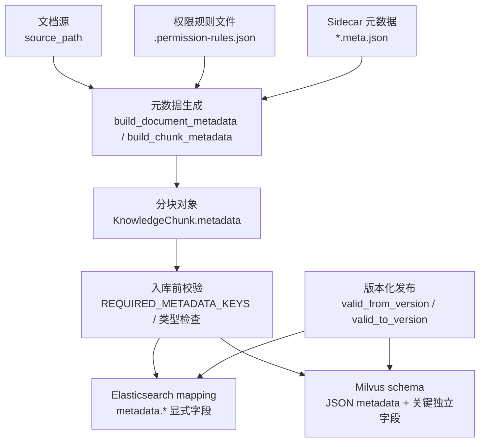
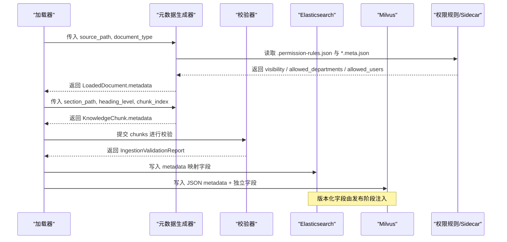
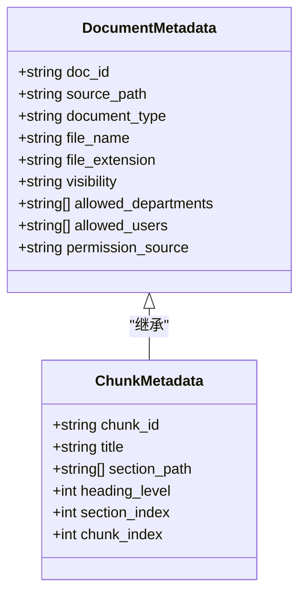
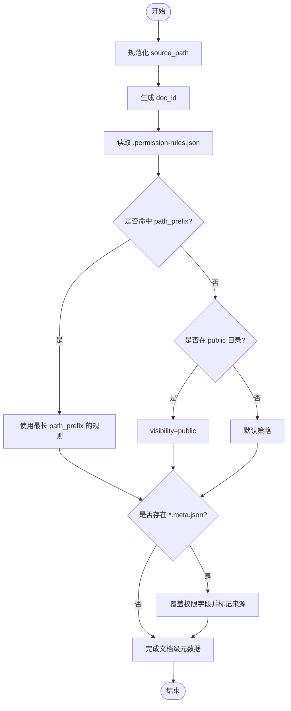
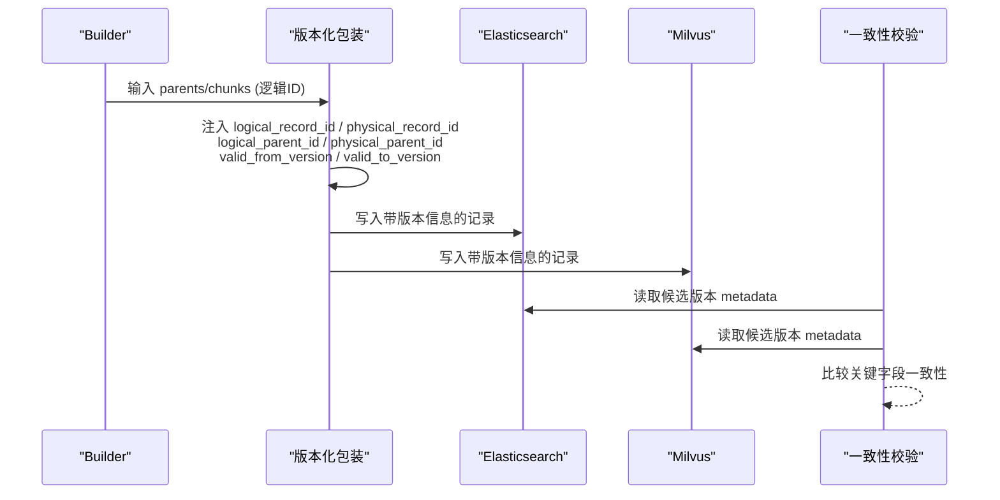
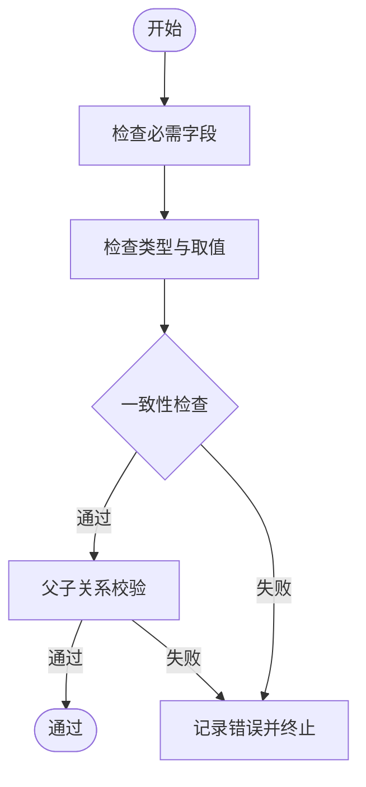
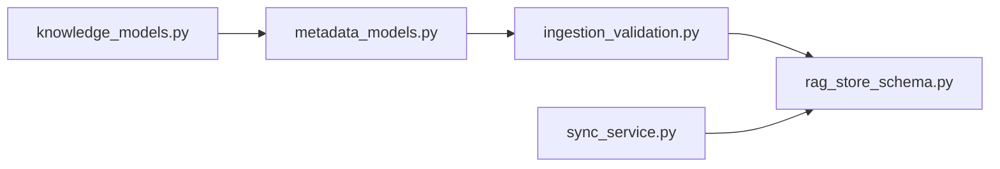

# 元数据处理

<cite>
**本文引用的文件**
- [metadata_models.py](file://src/fast_app/ingestion/processing/metadata_models.py)
- [knowledge_models.py](file://src/fast_app/domain/knowledge_models.py)
- [ingestion_validation.py](file://src/fast_app/ingestion/validation/ingestion_validation.py)
- [rag_store_schema.py](file://src/fast_app/ingestion/stores/rag_store_schema.py)
- [sync_service.py](file://src/fast_app/integrations/gitlab/sync_service.py)
- [document_model.py](file://src/app/schemas/document_model.py)
- [10-4-metadata标准化.md](file://learning-docs/phase-10/10-4-metadata标准化.md)
</cite>

## 目录
1. [简介](#简介)
2. [项目结构](#项目结构)
3. [核心组件](#核心组件)
4. [架构总览](#架构总览)
5. [详细组件分析](#详细组件分析)
6. [依赖关系分析](#依赖关系分析)
7. [性能与索引优化](#性能与索引优化)
8. [故障排查指南](#故障排查指南)
9. [结论](#结论)
10. [附录：示例与最佳实践](#附录示例与最佳实践)

## 简介
本文件系统性说明本项目中“元数据”的设计、生成、验证、存储与查询策略，重点围绕以下目标：
- 统一文档与分块（chunk）级元数据的字段规范与数据类型约束。
- 明确自动提取、自动生成与手动标注的来源与优先级。
- 解释元数据与文档内容的关联机制、版本管理、权限控制。
- 提供自定义元数据字段定义、结构化信息提取、完整性校验的实践路径。
- 给出面向检索的元数据查询优化与索引策略建议。

## 项目结构
与元数据处理直接相关的代码分布在 ingestion 处理层、领域模型、验证器、存储 schema 以及集成同步服务中：
- 元数据生成与权限推断：ingestion/processing/metadata_models.py
- 领域数据模型：domain/knowledge_models.py
- 入库前校验：ingestion/validation/ingestion_validation.py
- 存储层字段与映射：ingestion/stores/rag_store_schema.py
- 版本化与跨库一致性校验：integrations/gitlab/sync_service.py
- 对外 API 模型（最小元数据契约）：app/schemas/document_model.py
- 设计演进与规范说明：learning-docs/phase-10/10-4-metadata标准化.md

图表来源
- [metadata_models.py:49-75](file://src/fast_app/ingestion/processing/metadata_models.py#L49-L75)
- [metadata_models.py:342-366](file://src/fast_app/ingestion/processing/metadata_models.py#L342-L366)
- [ingestion_validation.py:14-28](file://src/fast_app/ingestion/validation/ingestion_validation.py#L14-L28)
- [rag_store_schema.py:78-133](file://src/fast_app/ingestion/stores/rag_store_schema.py#L78-L133)
- [rag_store_schema.py:148-245](file://src/fast_app/ingestion/stores/rag_store_schema.py#L148-L245)
- [sync_service.py:798-831](file://src/fast_app/integrations/gitlab/sync_service.py#L798-L831)

章节来源
- [metadata_models.py:1-367](file://src/fast_app/ingestion/processing/metadata_models.py#L1-L367)
- [knowledge_models.py:1-109](file://src/fast_app/domain/knowledge_models.py#L1-L109)
- [ingestion_validation.py:1-421](file://src/fast_app/ingestion/validation/ingestion_validation.py#L1-L421)
- [rag_store_schema.py:1-280](file://src/fast_app/ingestion/stores/rag_store_schema.py#L1-L280)
- [sync_service.py:708-831](file://src/fast_app/integrations/gitlab/sync_service.py#L708-L831)
- [document_model.py:1-12](file://src/app/schemas/document_model.py#L1-L12)
- [10-4-metadata标准化.md:1-311](file://learning-docs/phase-10/10-4-metadata标准化.md#L1-L311)

## 核心组件
- 元数据生成器：负责规范化 source_path、生成稳定的 doc_id 与 chunk_id、构造文档级与分块级元数据，并融合权限元数据。
- 领域模型：LoadedDocument、KnowledgeChunk 等承载内容与元数据；DocumentType 限定文档类型。
- 校验器：在入库前对必需字段、类型、一致性进行严格检查，产出问题报告。
- 存储 Schema：为 Elasticsearch 与 Milvus 定义元数据字段映射与输出字段，确保可过滤、可排序、可展示。
- 版本化与一致性：通过 logical/physical ID 与有效版本区间，支持增量更新与双写一致性校验。

章节来源
- [metadata_models.py:11-75](file://src/fast_app/ingestion/processing/metadata_models.py#L11-L75)
- [knowledge_models.py:1-109](file://src/fast_app/domain/knowledge_models.py#L1-L109)
- [ingestion_validation.py:14-28](file://src/fast_app/ingestion/validation/ingestion_validation.py#L14-L28)
- [rag_store_schema.py:78-133](file://src/fast_app/ingestion/stores/rag_store_schema.py#L78-L133)
- [rag_store_schema.py:148-245](file://src/fast_app/ingestion/stores/rag_store_schema.py#L148-L245)

## 架构总览
下图展示了从文档到最终落库的元数据流转与控制点：

图表来源
- [metadata_models.py:49-75](file://src/fast_app/ingestion/processing/metadata_models.py#L49-L75)
- [metadata_models.py:342-366](file://src/fast_app/ingestion/processing/metadata_models.py#L342-L366)
- [ingestion_validation.py:67-131](file://src/fast_app/ingestion/validation/ingestion_validation.py#L67-L131)
- [rag_store_schema.py:78-133](file://src/fast_app/ingestion/stores/rag_store_schema.py#L78-L133)
- [rag_store_schema.py:148-245](file://src/fast_app/ingestion/stores/rag_store_schema.py#L148-L245)
- [sync_service.py:798-831](file://src/fast_app/integrations/gitlab/sync_service.py#L798-L831)

## 详细组件分析

### 元数据模型与字段规范
- 文档级元数据包含：doc_id、source_path、document_type、file_name、file_extension，以及权限相关字段 visibility、allowed_departments、allowed_users、permission_source。
- 分块级元数据继承文档级元数据，并补充：chunk_id、title、section_path、heading_level、section_index、chunk_index。
- 字段命名与来源已收敛至统一的生成入口，避免各 loader/builder 各自拼接导致的不一致。

图表来源
- [metadata_models.py:49-75](file://src/fast_app/ingestion/processing/metadata_models.py#L49-L75)
- [metadata_models.py:342-366](file://src/fast_app/ingestion/processing/metadata_models.py#L342-L366)

章节来源
- [metadata_models.py:49-75](file://src/fast_app/ingestion/processing/metadata_models.py#L49-L75)
- [metadata_models.py:342-366](file://src/fast_app/ingestion/processing/metadata_models.py#L342-L366)

### 元数据提取策略与自动生成
- 稳定 ID 生成：
  - doc_id：基于规范化后的 source_path 计算哈希，保证同一路径重复入库得到相同 ID，便于按文档替换旧数据。
  - chunk_id：基于 doc_id、section_path、chunk_index 组合哈希，降低不同章节中相同序号冲突的概率。
- 路径规范化：统一使用 POSIX 风格路径，提升跨平台稳定性。
- 权限元数据融合：
  - 优先从知识库根目录的 .permission-rules.json 匹配 path_prefix，选择最长前缀命中规则。
  - 若存在 sidecar 文件（如 xxx.meta.json），则覆盖默认规则，仅允许透传权限相关字段。
  - 未命中规则时，public 目录兜底为公开可见，其他路径采用默认策略。

图表来源
- [metadata_models.py:11-30](file://src/fast_app/ingestion/processing/metadata_models.py#L11-L30)
- [metadata_models.py:78-133](file://src/fast_app/ingestion/processing/metadata_models.py#L78-L133)
- [metadata_models.py:136-198](file://src/fast_app/ingestion/processing/metadata_models.py#L136-L198)
- [metadata_models.py:201-244](file://src/fast_app/ingestion/processing/metadata_models.py#L201-L244)
- [metadata_models.py:275-323](file://src/fast_app/ingestion/processing/metadata_models.py#L275-L323)

章节来源
- [metadata_models.py:11-30](file://src/fast_app/ingestion/processing/metadata_models.py#L11-L30)
- [metadata_models.py:78-133](file://src/fast_app/ingestion/processing/metadata_models.py#L78-L133)
- [metadata_models.py:136-198](file://src/fast_app/ingestion/processing/metadata_models.py#L136-L198)
- [metadata_models.py:201-244](file://src/fast_app/ingestion/processing/metadata_models.py#L201-L244)
- [metadata_models.py:275-323](file://src/fast_app/ingestion/processing/metadata_models.py#L275-L323)

### 手动元数据标注与扩展
- Sidecar 元数据：通过 source_path.meta.json 以白名单方式覆盖 visibility、allowed_departments、allowed_users、permission_source，避免无关字段污染 chunk 元数据。
- 规则文件：集中维护 path_prefix 到权限元数据的映射，支持 default 兜底策略。
- 扩展建议：如需新增业务字段，应在 metadata_models.py 中增加字段并同步至校验器与存储映射，保持端到端一致性。

章节来源
- [metadata_models.py:275-323](file://src/fast_app/ingestion/processing/metadata_models.py#L275-L323)
- [metadata_models.py:201-244](file://src/fast_app/ingestion/processing/metadata_models.py#L201-L244)

### 元数据与文档内容的关联机制
- KnowledgeChunk 通过 metadata.doc_id 与 metadata.source_path 回溯到原始文档；通过 section_path、heading_level、section_index、chunk_index 定位到具体段落与顺序。
- Markdown 父子分块场景下，parent/child 需保持一致的 doc_id、visibility、allowed_departments、allowed_users，否则校验失败。

章节来源
- [knowledge_models.py:94-109](file://src/fast_app/domain/knowledge_models.py#L94-L109)
- [ingestion_validation.py:134-188](file://src/fast_app/ingestion/validation/ingestion_validation.py#L134-L188)

### 版本管理与一致性
- 逻辑 ID 与物理 ID：同一逻辑块在不同版本拥有不同物理记录，支持安全共存与回滚。
- 有效版本区间：valid_from_version、valid_to_version 标识记录的生效范围。
- 双写一致性：在候选版本写入后，对比 ES 与 Milvus 的关键 metadata 字段，不一致即报错。

图表来源
- [sync_service.py:798-831](file://src/fast_app/integrations/gitlab/sync_service.py#L798-L831)
- [sync_service.py:708-795](file://src/fast_app/integrations/gitlab/sync_service.py#L708-L795)

章节来源
- [sync_service.py:708-795](file://src/fast_app/integrations/gitlab/sync_service.py#L708-L795)
- [sync_service.py:798-831](file://src/fast_app/integrations/gitlab/sync_service.py#L798-L831)

### 权限控制
- 权限来源优先级：sidecar 覆盖 > 规则文件匹配 > public 目录兜底 > 默认策略。
- 权限字段标准化：visibility 限定为 public/department/restricted；allowed_departments 与 allowed_users 必须为字符串数组；permission_source 记录来源以便审计。
- 检索过滤：ES 与 Milvus 均暴露 visibility、allowed_departments、allowed_users 等字段用于查询过滤。

章节来源
- [metadata_models.py:78-133](file://src/fast_app/ingestion/processing/metadata_models.py#L78-L133)
- [metadata_models.py:304-339](file://src/fast_app/ingestion/processing/metadata_models.py#L304-L339)
- [rag_store_schema.py:78-133](file://src/fast_app/ingestion/stores/rag_store_schema.py#L78-L133)

### 验证机制与完整性保障
- 必需字段清单：doc_id、chunk_id、title、source_path、section_path、document_type、file_name、file_extension、heading_level、section_index、chunk_index。
- 类型与取值约束：document_type 必须在允许集合内；chunk_index 为正整数；section_path 为非空列表；doc_id 为非空字符串。
- 一致性检查：chunk.id 与 metadata.chunk_id 必须一致；chunk.title 与 metadata.title 必须一致；source_path 必须对应已读取文档。
- 父子关系校验：Markdown child 必须能关联 parent，且 parent/child 的 doc_id、visibility、allowed_departments、allowed_users 必须一致。

图表来源
- [ingestion_validation.py:14-28](file://src/fast_app/ingestion/validation/ingestion_validation.py#L14-L28)
- [ingestion_validation.py:247-421](file://src/fast_app/ingestion/validation/ingestion_validation.py#L247-L421)
- [ingestion_validation.py:134-188](file://src/fast_app/ingestion/validation/ingestion_validation.py#L134-L188)

章节来源
- [ingestion_validation.py:14-28](file://src/fast_app/ingestion/validation/ingestion_validation.py#L14-L28)
- [ingestion_validation.py:247-421](file://src/fast_app/ingestion/validation/ingestion_validation.py#L247-L421)
- [ingestion_validation.py:134-188](file://src/fast_app/ingestion/validation/ingestion_validation.py#L134-L188)

## 依赖关系分析
- metadata_models.py 依赖 domain.knowledge_models.DocumentType 限定文档类型。
- ingestion_validation.py 依赖 knowledge_models.KnowledgeChunk、LoadedDocument 及 markdown_hierarchy 常量进行校验。
- rag_store_schema.py 定义 ES mapping 与 Milvus schema，供上层写入与查询使用。
- sync_service.py 在发布阶段注入版本字段并进行双写一致性校验。

图表来源
- [metadata_models.py:1-7](file://src/fast_app/ingestion/processing/metadata_models.py#L1-L7)
- [ingestion_validation.py:1-10](file://src/fast_app/ingestion/validation/ingestion_validation.py#L1-L10)
- [rag_store_schema.py:1-56](file://src/fast_app/ingestion/stores/rag_store_schema.py#L1-L56)
- [sync_service.py:708-831](file://src/fast_app/integrations/gitlab/sync_service.py#L708-L831)

章节来源
- [metadata_models.py:1-7](file://src/fast_app/ingestion/processing/metadata_models.py#L1-L7)
- [ingestion_validation.py:1-10](file://src/fast_app/ingestion/validation/ingestion_validation.py#L1-L10)
- [rag_store_schema.py:1-56](file://src/fast_app/ingestion/stores/rag_store_schema.py#L1-L56)
- [sync_service.py:708-831](file://src/fast_app/integrations/gitlab/sync_service.py#L708-L831)

## 性能与索引优化
- 字段类型与映射：
  - ES：metadata.doc_id、metadata.chunk_id、metadata.source_path、metadata.section_path、metadata.document_type、metadata.visibility、metadata.allowed_departments、metadata.allowed_users、metadata.permission_source 等显式声明 keyword 或 integer，利于精确过滤与聚合。
  - Milvus：除 JSON metadata 外，将常用过滤字段（doc_id、source_path、document_type、chunk_index、record_type、parent_id、版本字段等）作为独立列，提高过滤与排序效率。
- 向量索引：Milvus 向量字段使用 AUTOINDEX 与余弦相似度，适合语义检索。
- 查询优化建议：
  - 优先使用 keyword 字段进行精确过滤（如 doc_id、document_type、visibility）。
  - 结合 section_path、heading_level、chunk_index 做层级与顺序筛选。
  - 利用 version 字段（valid_from_version/valid_to_version）实现时间窗口或版本窗口过滤。
  - 在 ES 中使用 ik 分词器进行中文全文检索，keyword 子字段用于精确匹配。

章节来源
- [rag_store_schema.py:78-133](file://src/fast_app/ingestion/stores/rag_store_schema.py#L78-L133)
- [rag_store_schema.py:148-280](file://src/fast_app/ingestion/stores/rag_store_schema.py#L148-L280)

## 故障排查指南
- 缺失或类型错误的元数据字段：
  - 现象：校验报告出现 missing_metadata、invalid_chunk_document_type、invalid_chunk_index 等错误。
  - 处理：检查 metadata 生成流程是否正确填充必需字段，并确保类型符合约束。
- ID 不一致：
  - 现象：chunk_id_mismatch、title_mismatch。
  - 处理：确认 chunk.id 与 metadata.chunk_id、chunk.title 与 metadata.title 保持一致。
- 父子关系异常：
  - 现象：orphan_markdown_child、markdown_parent_without_child、parent_child_metadata_mismatch。
  - 处理：确保 child 的 parent_id 指向存在的 parent，且 parent/child 的 doc_id、visibility、allowed_departments、allowed_users 一致。
- 版本不一致：
  - 现象：候选版本 ES/Milvus metadata 关键字段不一致。
  - 处理：检查发布阶段注入的 logical/physical ID 与版本字段是否正确，核对双写一致性校验逻辑。

章节来源
- [ingestion_validation.py:134-188](file://src/fast_app/ingestion/validation/ingestion_validation.py#L134-L188)
- [ingestion_validation.py:247-421](file://src/fast_app/ingestion/validation/ingestion_validation.py#L247-L421)
- [sync_service.py:708-795](file://src/fast_app/integrations/gitlab/sync_service.py#L708-L795)

## 结论
本项目通过集中化的元数据生成器、严格的入库前校验、明确的存储映射与版本化机制，实现了文档与分块级元数据的标准化、可追溯、可过滤与可扩展。权限控制通过规则文件与 sidecar 元数据灵活配置，满足企业级多部门、多用户的访问边界需求。后续可在不破坏既有契约的前提下，按需扩展业务字段并完善索引策略。

## 附录：示例与最佳实践
- 定义自定义元数据字段：
  - 在 metadata_models.py 中扩展文档级或分块级元数据结构，并在构建函数中注入新字段。
  - 在 ingestion_validation.py 的 REQUIRED_METADATA_KEYS 中添加新字段，并补充类型与取值校验。
  - 在 rag_store_schema.py 的 ES mapping 与 Milvus schema 中声明新字段，确保可过滤与可展示。
- 提取结构化信息：
  - 使用 section_path、heading_level、section_index、chunk_index 精确定位内容位置。
  - 通过 doc_id、source_path 回溯到原始文档，便于溯源与展示。
- 验证元数据完整性：
  - 调用 validate_ingestion_result 获取 IngestionValidationReport，根据 issues 修复问题。
- 查询优化与索引策略：
  - 使用 keyword 字段进行精确过滤（doc_id、document_type、visibility）。
  - 使用 version 字段进行时间或版本窗口过滤。
  - 结合 Milvus 独立字段与 ES keyword 子字段，提升检索性能。

章节来源
- [metadata_models.py:49-75](file://src/fast_app/ingestion/processing/metadata_models.py#L49-L75)
- [metadata_models.py:342-366](file://src/fast_app/ingestion/processing/metadata_models.py#L342-L366)
- [ingestion_validation.py:14-28](file://src/fast_app/ingestion/validation/ingestion_validation.py#L14-L28)
- [ingestion_validation.py:67-131](file://src/fast_app/ingestion/validation/ingestion_validation.py#L67-L131)
- [rag_store_schema.py:78-133](file://src/fast_app/ingestion/stores/rag_store_schema.py#L78-L133)
- [rag_store_schema.py:148-280](file://src/fast_app/ingestion/stores/rag_store_schema.py#L148-L280)
- [10-4-metadata标准化.md:228-311](file://learning-docs/phase-10/10-4-metadata标准化.md#L228-L311)