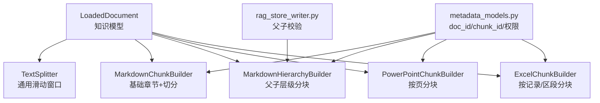
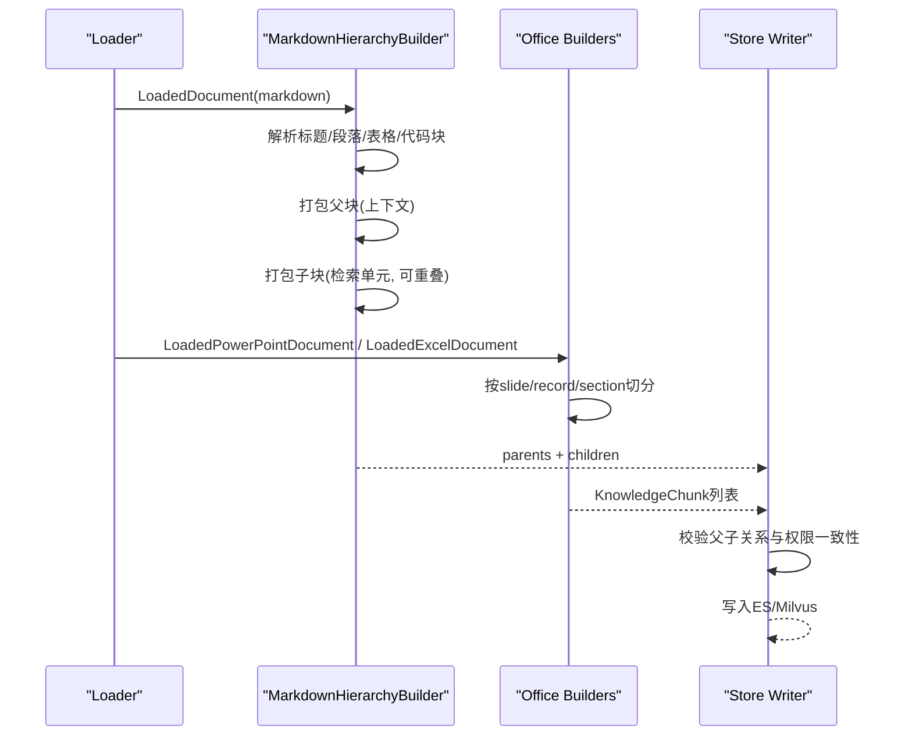
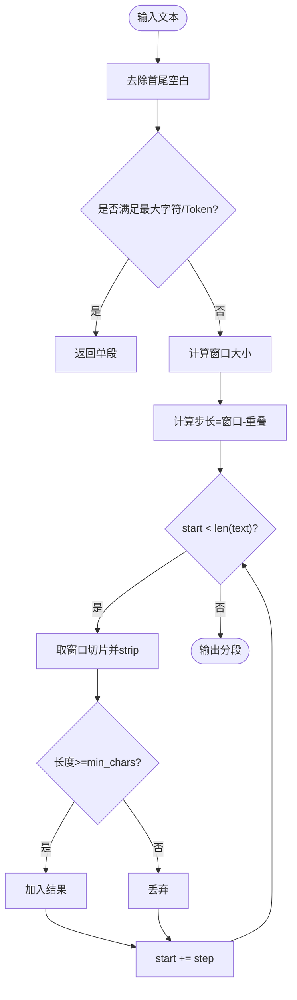
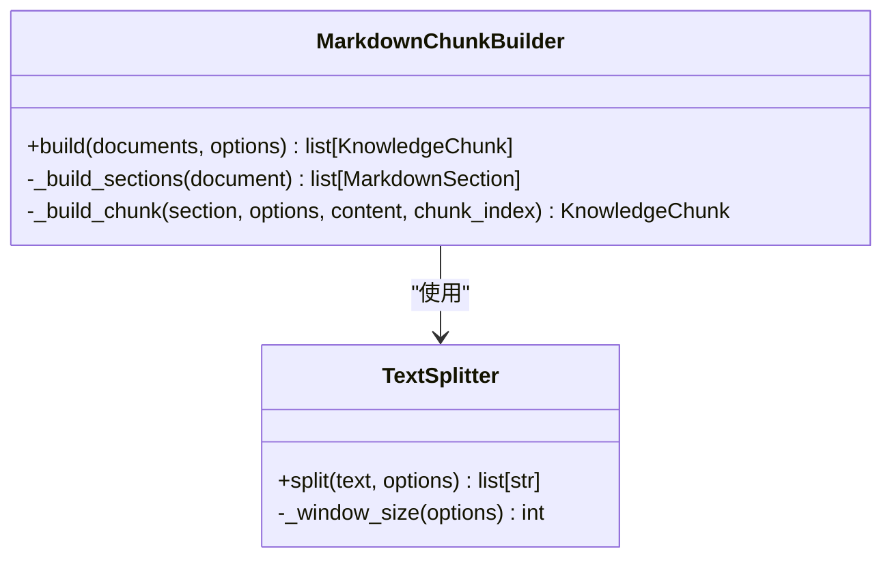
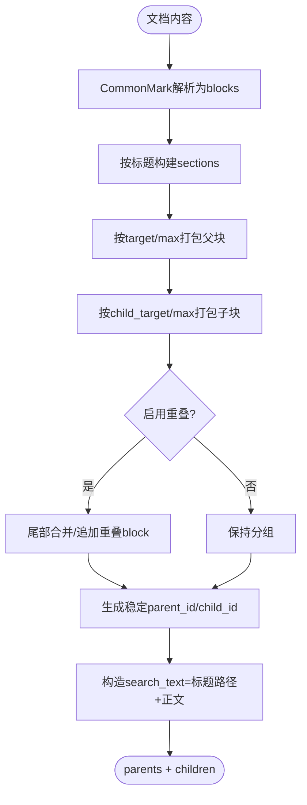
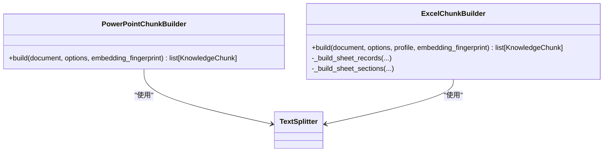
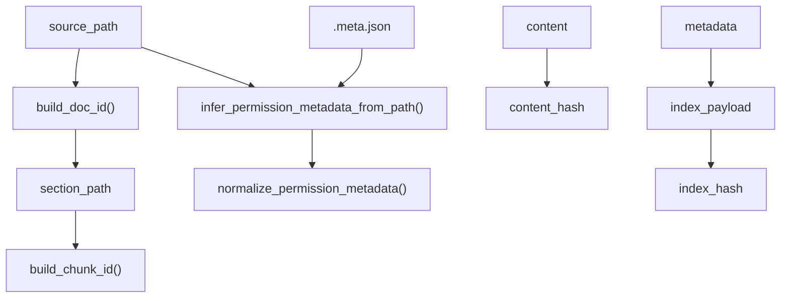
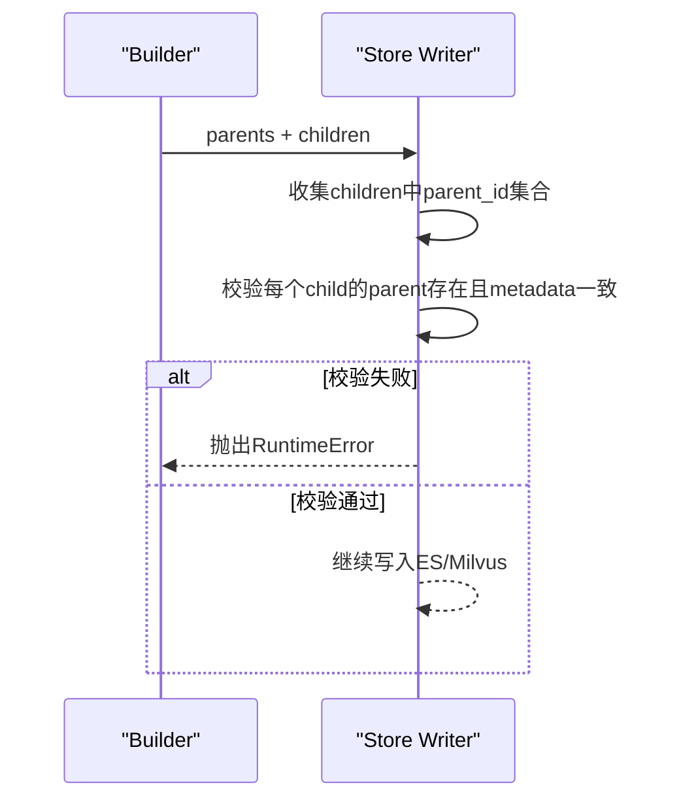
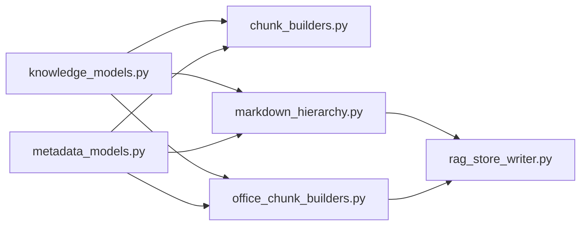

# 分块构建器

<cite>
**本文引用的文件**
- [chunk_builders.py](file://python-agent-study/src/fast_app/ingestion/processing/chunk_builders.py)
- [markdown_chunker.py](file://python-agent-study/src/fast_app/ingestion/processing/markdown_chunker.py)
- [office_chunk_builders.py](file://python-agent-study/src/fast_app/ingestion/processing/office_chunk_builders.py)
- [markdown_hierarchy.py](file://python-agent-study/src/fast_app/ingestion/processing/markdown_hierarchy.py)
- [metadata_models.py](file://python-agent-study/src/fast_app/ingestion/processing/metadata_models.py)
- [knowledge_models.py](file://python-agent-study/src/fast_app/domain/knowledge_models.py)
- [rag_store_writer.py](file://python-agent-study/src/fast_app/ingestion/stores/rag_store_writer.py)
</cite>

## 目录
1. [简介](#简介)
2. [项目结构](#项目结构)
3. [核心组件](#核心组件)
4. [架构总览](#架构总览)
5. [详细组件分析](#详细组件分析)
6. [依赖关系分析](#依赖关系分析)
7. [性能与优化](#性能与优化)
8. [故障排查指南](#故障排查指南)
9. [结论](#结论)
10. [附录：配置示例与最佳实践](#附录：配置示例与最佳实践)

## 简介
本文件系统化梳理分块构建器的设计与实现，覆盖抽象能力、Markdown 父子层级分块、Office（PPT/Excel）分块策略、重叠与去重机制、元数据标准化、以及质量评估与性能调优建议。目标是帮助读者在不深入源码的情况下理解“如何按文档类型正确切分、如何保证稳定 ID、如何控制重叠与冗余、以及如何扩展自定义分块逻辑”。

## 项目结构
分块构建相关代码集中在 ingestion/processing 目录下，围绕统一的数据模型和元数据工具进行组织：
- 通用分块能力：文本分割器、基础选项、简单 Markdown Builder
- Markdown 高级分块：基于 CommonMark 解析的父子层级 Builder
- Office 分块：PPT 按页、Excel 按记录或区段
- 元数据与权限：统一的 doc_id/chunk_id 生成、权限字段规范化
- 存储校验：写入前对 Markdown 父子关系做一致性校验

图表来源
- [knowledge_models.py:1-109](file://python-agent-study/src/fast_app/domain/knowledge_models.py#L1-L109)
- [chunk_builders.py:14-108](file://python-agent-study/src/fast_app/ingestion/processing/chunk_builders.py#L14-L108)
- [markdown_hierarchy.py:20-144](file://python-agent-study/src/fast_app/ingestion/processing/markdown_hierarchy.py#L20-L144)
- [office_chunk_builders.py:66-163](file://python-agent-study/src/fast_app/ingestion/processing/office_chunk_builders.py#L66-L163)
- [metadata_models.py:21-46](file://python-agent-study/src/fast_app/ingestion/processing/metadata_models.py#L21-L46)
- [rag_store_writer.py:156-190](file://python-agent-study/src/fast_app/ingestion/stores/rag_store_writer.py#L156-L190)

章节来源
- [knowledge_models.py:1-109](file://python-agent-study/src/fast_app/domain/knowledge_models.py#L1-L109)
- [chunk_builders.py:14-108](file://python-agent-study/src/fast_app/ingestion/processing/chunk_builders.py#L14-L108)
- [markdown_hierarchy.py:20-144](file://python-agent-study/src/fast_app/ingestion/processing/markdown_hierarchy.py#L20-L144)
- [office_chunk_builders.py:66-163](file://python-agent-study/src/fast_app/ingestion/processing/office_chunk_builders.py#L66-L163)
- [metadata_models.py:21-46](file://python-agent-study/src/fast_app/ingestion/processing/metadata_models.py#L21-L46)
- [rag_store_writer.py:156-190](file://python-agent-study/src/fast_app/ingestion/stores/rag_store_writer.py#L156-L190)

## 核心组件
- ChunkBuildOptions：定义字符上限、重叠字符数、Token 上限、最小长度等分块参数
- TextSplitter：基于滑动窗口的通用文本分割器，支持 overlap 与 min_chars
- MarkdownChunkBuilder：按标题行划分章节，再使用 TextSplitter 切分
- MarkdownHierarchyBuilder：基于 CommonMark 解析，产出父块（上下文）与子块（检索单元），支持重叠与结构化拆分
- PowerPointChunkBuilder：按 slide 为单位，稳定 slide_id 生成局部 Chunk
- ExcelChunkBuilder：支持 Record 模式（按业务主键）与 Section 模式（按行区段），并具备 Profile 匹配与列映射
- metadata_models：提供稳定的 doc_id/chunk_id、权限元数据、索引指纹等
- rag_store_writer：写入前校验 Markdown 父子关系与权限一致性

章节来源
- [chunk_builders.py:14-108](file://python-agent-study/src/fast_app/ingestion/processing/chunk_builders.py#L14-L108)
- [markdown_hierarchy.py:20-144](file://python-agent-study/src/fast_app/ingestion/processing/markdown_hierarchy.py#L20-L144)
- [office_chunk_builders.py:66-163](file://python-agent-study/src/fast_app/ingestion/processing/office_chunk_builders.py#L66-L163)
- [metadata_models.py:21-46](file://python-agent-study/src/fast_app/ingestion/processing/metadata_models.py#L21-L46)
- [rag_store_writer.py:156-190](file://python-agent-study/src/fast_app/ingestion/stores/rag_store_writer.py#L156-L190)

## 架构总览
分块构建器遵循“格式专属解析 + 共享切分策略”的设计：
- 解析层：Markdown 用 CommonMark；Office 用结构化对象（Slide/Sheet/Row）
- 切分层：共享 TextSplitter 或 TiktokenCounter 预算控制
- 元数据层：统一生成 doc_id/chunk_id、权限、索引指纹
- 校验层：写入前校验父子关系与权限一致性

图表来源
- [markdown_hierarchy.py:123-237](file://python-agent-study/src/fast_app/ingestion/processing/markdown_hierarchy.py#L123-L237)
- [office_chunk_builders.py:66-163](file://python-agent-study/src/fast_app/ingestion/processing/office_chunk_builders.py#L66-L163)
- [rag_store_writer.py:156-190](file://python-agent-study/src/fast_app/ingestion/stores/rag_store_writer.py#L156-L190)

## 详细组件分析

### 抽象与通用能力
- ChunkBuildOptions：集中管理 max_chars、overlap_chars、max_tokens、min_chars、source
- TextSplitter：
  - 窗口大小由 min(max_chars, max_tokens) 决定
  - 步长 = window_size - overlap_chars
  - 跳过小于 min_chars 的片段
- SimpleTokenCounter：轻量估算 Token，便于快速边界判断

图表来源
- [chunk_builders.py:41-76](file://python-agent-study/src/fast_app/ingestion/processing/chunk_builders.py#L41-L76)

章节来源
- [chunk_builders.py:14-76](file://python-agent-study/src/fast_app/ingestion/processing/chunk_builders.py#L14-L76)

### Markdown 基础分块（MarkdownChunkBuilder）
- 章节划分：按标题行识别，维护 heading_stack 以构建 section_path
- 切分：对每个 section 调用 TextSplitter.split
- 元数据：通过 build_chunk_metadata 注入 section_path、heading_level、section_index、chunk_index

图表来源
- [chunk_builders.py:79-188](file://python-agent-study/src/fast_app/ingestion/processing/chunk_builders.py#L79-L188)

章节来源
- [chunk_builders.py:79-188](file://python-agent-study/src/fast_app/ingestion/processing/chunk_builders.py#L79-L188)

### Markdown 父子层级分块（MarkdownHierarchyBuilder）
- 解析：使用 markdown-it-py 解析为 blocks，仅顶层 block 进入当前 section
- 父块打包：按 target/max tokens 与 max chars 限制，优先完整 block 装箱
- 子块打包：在父块基础上进一步细分，支持 child_overlap_tokens
- 特殊块处理：
  - fenced code：保持 fence 开闭标记，超长按行拆分
  - table：保留表头，超长按行拆分
  - 普通段落：按句子/行拆分，最后退化为 token 窗口
- 稳定 ID：
  - section_key = hash(doc_id + 标题路径 + occurrence)
  - parent_id = hash(section_key + parent_index + strategy_version)
  - child_id = hash(parent_id + child_index + strategy_version)
- 检索文本：子块的 search_text 包含标题路径与正文，用于 ES 搜索与 embedding

图表来源
- [markdown_hierarchy.py:123-237](file://python-agent-study/src/fast_app/ingestion/processing/markdown_hierarchy.py#L123-L237)
- [markdown_hierarchy.py:319-386](file://python-agent-study/src/fast_app/ingestion/processing/markdown_hierarchy.py#L319-L386)
- [markdown_hierarchy.py:388-524](file://python-agent-study/src/fast_app/ingestion/processing/markdown_hierarchy.py#L388-L524)

章节来源
- [markdown_hierarchy.py:20-144](file://python-agent-study/src/fast_app/ingestion/processing/markdown_hierarchy.py#L20-L144)
- [markdown_hierarchy.py:239-303](file://python-agent-study/src/fast_app/ingestion/processing/markdown_hierarchy.py#L239-L303)
- [markdown_hierarchy.py:319-386](file://python-agent-study/src/fast_app/ingestion/processing/markdown_hierarchy.py#L319-L386)
- [markdown_hierarchy.py:388-524](file://python-agent-study/src/fast_app/ingestion/processing/markdown_hierarchy.py#L388-L524)

### Office 分块（PowerPointChunkBuilder / ExcelChunkBuilder）
- PowerPointChunkBuilder：
  - 按 slide 为单位，title/content/notes 拼接后切分
  - 稳定 identity_key = ppt:slide:{slide_id}
  - 生成 content_hash 与 index_hash（含 ACL、位置、embedding 指纹）
- ExcelChunkBuilder：
  - 支持 mode: record / section / mixed
  - Record 模式：按 profile 映射字段，主键唯一性校验，按 field_group 生成稳定 identity_key
  - Section 模式：按 100 行区段打包，超限时按整行贪心装箱，单行超限则行内切割并重复表头
  - 列坐标与 source_columns 保留，便于定位与审计

图表来源
- [office_chunk_builders.py:66-125](file://python-agent-study/src/fast_app/ingestion/processing/office_chunk_builders.py#L66-L125)
- [office_chunk_builders.py:128-163](file://python-agent-study/src/fast_app/ingestion/processing/office_chunk_builders.py#L128-L163)
- [office_chunk_builders.py:242-305](file://python-agent-study/src/fast_app/ingestion/processing/office_chunk_builders.py#L242-L305)
- [office_chunk_builders.py:307-466](file://python-agent-study/src/fast_app/ingestion/processing/office_chunk_builders.py#L307-L466)

章节来源
- [office_chunk_builders.py:66-125](file://python-agent-study/src/fast_app/ingestion/processing/office_chunk_builders.py#L66-L125)
- [office_chunk_builders.py:128-163](file://python-agent-study/src/fast_app/ingestion/processing/office_chunk_builders.py#L128-L163)
- [office_chunk_builders.py:242-305](file://python-agent-study/src/fast_app/ingestion/processing/office_chunk_builders.py#L242-L305)
- [office_chunk_builders.py:307-466](file://python-agent-study/src/fast_app/ingestion/processing/office_chunk_builders.py#L307-L466)

### 元数据与权限
- doc_id：基于规范化后的 source_path 生成稳定标识
- chunk_id：基于 doc_id + section_path + chunk_index 生成稳定标识
- 权限元数据：
  - 从知识库根目录 .permission-rules.json 推断默认权限
  - sidecar .meta.json 可覆盖 visibility、allowed_departments、allowed_users
  - 规范化 visibility 枚举与列表字段
- Office 额外哈希：
  - content_hash：正文标准化后的 SHA256
  - index_hash：包含 content_hash、identity_key、section_path、title、ACL、source_coordinates、builder_schema_version、embedding_fingerprint

图表来源
- [metadata_models.py:21-46](file://python-agent-study/src/fast_app/ingestion/processing/metadata_models.py#L21-L46)
- [metadata_models.py:49-99](file://python-agent-study/src/fast_app/ingestion/processing/metadata_models.py#L49-L99)
- [metadata_models.py:101-199](file://python-agent-study/src/fast_app/ingestion/processing/metadata_models.py#L101-L199)
- [metadata_models.py:275-339](file://python-agent-study/src/fast_app/ingestion/processing/metadata_models.py#L275-L339)
- [office_chunk_builders.py:616-660](file://python-agent-study/src/fast_app/ingestion/processing/office_chunk_builders.py#L616-L660)

章节来源
- [metadata_models.py:21-46](file://python-agent-study/src/fast_app/ingestion/processing/metadata_models.py#L21-L46)
- [metadata_models.py:49-99](file://python-agent-study/src/fast_app/ingestion/processing/metadata_models.py#L49-L99)
- [metadata_models.py:101-199](file://python-agent-study/src/fast_app/ingestion/processing/metadata_models.py#L101-L199)
- [metadata_models.py:275-339](file://python-agent-study/src/fast_app/ingestion/processing/metadata_models.py#L275-L339)
- [office_chunk_builders.py:616-660](file://python-agent-study/src/fast_app/ingestion/processing/office_chunk_builders.py#L616-L660)

### 父子关系与写入校验
- Markdown 父子关系：
  - 子块 metadata 必须包含 parent_id，且与父块一致
  - 父子需同属同一 doc_id 与 chunk_strategy_version
  - 权限字段（visibility、allowed_departments、allowed_users、permission_source）必须一致
- 写入前校验：若不一致则抛出运行时错误，避免脏数据入库

图表来源
- [rag_store_writer.py:156-190](file://python-agent-study/src/fast_app/ingestion/stores/rag_store_writer.py#L156-L190)

章节来源
- [rag_store_writer.py:156-190](file://python-agent-study/src/fast_app/ingestion/stores/rag_store_writer.py#L156-L190)

## 依赖关系分析
- knowledge_models 提供统一数据结构：LoadedDocument、LoadedPowerPointDocument、LoadedExcelDocument、KnowledgeChunk
- metadata_models 提供稳定的 ID 与权限元数据生成
- chunk_builders 提供通用切分与基础 Markdown 分块
- markdown_hierarchy 提供高级 Markdown 父子分块
- office_chunk_builders 提供 Office 分块与哈希策略
- rag_store_writer 提供写入前的父子关系校验

图表来源
- [knowledge_models.py:1-109](file://python-agent-study/src/fast_app/domain/knowledge_models.py#L1-L109)
- [metadata_models.py:21-46](file://python-agent-study/src/fast_app/ingestion/processing/metadata_models.py#L21-L46)
- [chunk_builders.py:14-108](file://python-agent-study/src/fast_app/ingestion/processing/chunk_builders.py#L14-L108)
- [markdown_hierarchy.py:20-144](file://python-agent-study/src/fast_app/ingestion/processing/markdown_hierarchy.py#L20-L144)
- [office_chunk_builders.py:66-163](file://python-agent-study/src/fast_app/ingestion/processing/office_chunk_builders.py#L66-L163)
- [rag_store_writer.py:156-190](file://python-agent-study/src/fast_app/ingestion/stores/rag_store_writer.py#L156-L190)

章节来源
- [knowledge_models.py:1-109](file://python-agent-study/src/fast_app/domain/knowledge_models.py#L1-L109)
- [metadata_models.py:21-46](file://python-agent-study/src/fast_app/ingestion/processing/metadata_models.py#L21-L46)
- [chunk_builders.py:14-108](file://python-agent-study/src/fast_app/ingestion/processing/chunk_builders.py#L14-L108)
- [markdown_hierarchy.py:20-144](file://python-agent-study/src/fast_app/ingestion/processing/markdown_hierarchy.py#L20-L144)
- [office_chunk_builders.py:66-163](file://python-agent-study/src/fast_app/ingestion/processing/office_chunk_builders.py#L66-L163)
- [rag_store_writer.py:156-190](file://python-agent-study/src/fast_app/ingestion/stores/rag_store_writer.py#L156-L190)

## 性能与优化
- 预算控制
  - Markdown 父子分块：父块目标/最大 tokens 与字符上限；子块目标/最大/min tokens；子块重叠 tokens
  - Office 分块：按 slide/record/section 粒度，结合 TextSplitter 的字符/Token 上限
- 重叠策略
  - Markdown 子块支持 child_overlap_tokens，仅在完整 block 范围内追加尾部重叠
  - Office 分块一般不设置 overlap，但可通过 ChunkBuildOptions.overlap_chars 调整
- 大文档优化
  - Markdown：先按完整 block 装箱，超长 block 再按行/句子/Token 切分，避免破坏语义
  - Excel：Section 模式按 100 行区段打包，单行超限时行内切割并重复表头，减少跨行碎片
- 稳定性
  - 稳定 ID：doc_id/chunk_id/parent_id/child_id 均基于稳定输入生成，局部修改不影响无关部分
  - 索引指纹：index_hash 包含 ACL、位置、builder schema version、embedding fingerprint，便于增量更新与回滚
- 建议
  - 合理设置 child_target_tokens 与 child_overlap_tokens，平衡召回与冗余
  - 对代码块与表格采用专用拆分逻辑，避免破坏语法与可读性
  - 使用 embedding_fingerprint 区分不同向量配置，避免误判内容变化

章节来源
- [markdown_hierarchy.py:20-55](file://python-agent-study/src/fast_app/ingestion/processing/markdown_hierarchy.py#L20-L55)
- [markdown_hierarchy.py:319-386](file://python-agent-study/src/fast_app/ingestion/processing/markdown_hierarchy.py#L319-L386)
- [office_chunk_builders.py:533-606](file://python-agent-study/src/fast_app/ingestion/processing/office_chunk_builders.py#L533-L606)
- [office_chunk_builders.py:616-660](file://python-agent-study/src/fast_app/ingestion/processing/office_chunk_builders.py#L616-L660)

## 故障排查指南
- Markdown 父子关系不一致
  - 现象：写入时报错“Markdown 父子 metadata 不一致”
  - 原因：子块 parent_id 缺失或与父块权限字段不一致
  - 处理：检查 builder 输出的 parents/children 是否来自同一文档与策略版本
- Excel 配置缺失
  - 现象：抛出 ExcelConfigurationRequired
  - 原因：未匹配的 Sheet、缺失主键、未知有值列、Mixed 模式缺少 mode
  - 处理：完善 Profile 配置，确保 header_row、identity_field_ids、fields 映射正确
- 权限规则冲突
  - 现象：visibility/allowed_departments/allowed_users 不符合预期
  - 原因：sidecar 覆盖或规则文件 path_prefix 匹配顺序
  - 处理：检查 .permission-rules.json 与 .meta.json，确认最长 path_prefix 优先

章节来源
- [rag_store_writer.py:156-190](file://python-agent-study/src/fast_app/ingestion/stores/rag_store_writer.py#L156-L190)
- [office_chunk_builders.py:25-31](file://python-agent-study/src/fast_app/ingestion/processing/office_chunk_builders.py#L25-L31)
- [office_chunk_builders.py:187-240](file://python-agent-study/src/fast_app/ingestion/processing/office_chunk_builders.py#L187-L240)
- [metadata_models.py:101-199](file://python-agent-study/src/fast_app/ingestion/processing/metadata_models.py#L101-L199)
- [metadata_models.py:275-339](file://python-agent-study/src/fast_app/ingestion/processing/metadata_models.py#L275-L339)

## 结论
本分块构建体系通过“格式专属解析 + 共享切分策略 + 统一元数据 + 写入校验”实现了高内聚、低耦合的分块能力。Markdown 父子层级分块提升了上下文与检索单元的分离度；Office 分块通过稳定身份与哈希策略保障了增量更新与幂等性。配合合理的预算与重叠策略，可在召回质量与性能之间取得良好平衡。

## 附录：配置示例与最佳实践
- 配置分块参数
  - 通用选项：设置 max_chars、overlap_chars、max_tokens、min_chars 控制切分粒度与重叠
  - Markdown 父子：调整 parent_target_tokens、parent_max_tokens、parent_max_chars、child_target_tokens、child_max_tokens、child_min_tokens、child_overlap_tokens
  - Office：根据 Slide/Record/Section 选择合适模式，必要时提供 Profile 配置
- 自定义分块逻辑
  - 继承 TextSplitter 或 TiktokenCounter，替换预算与切分策略
  - 在 Office Builder 中扩展 _split_section_rows 或 _build_sheet_records，适配新字段组
- 大文档优化
  - Markdown：优先完整 block 装箱，超长再按行/句子/Token 切分
  - Excel：Section 模式按 100 行区段打包，单行超限行内切割并重复表头
- 质量评估指标
  - 子块 token 分布：统计 child_target_tokens 命中率与溢出率
  - 重叠比例：child_overlap_tokens 导致的重复 token 占比
  - 父子一致性：parent_id 覆盖率与权限字段一致性
  - 索引稳定性：index_hash 变更频率与内容变化相关性
- 性能调优建议
  - 预热 tiktoken 编码，避免首次运行开销
  - 合理设置 overlap，避免过度重复导致向量冗余
  - 使用 embedding_fingerprint 区分不同模型配置，避免误判内容变化

章节来源
- [markdown_hierarchy.py:20-55](file://python-agent-study/src/fast_app/ingestion/processing/markdown_hierarchy.py#L20-L55)
- [office_chunk_builders.py:533-606](file://python-agent-study/src/fast_app/ingestion/processing/office_chunk_builders.py#L533-L606)
- [metadata_models.py:33-46](file://python-agent-study/src/fast_app/ingestion/processing/metadata_models.py#L33-L46)
- [office_chunk_builders.py:616-660](file://python-agent-study/src/fast_app/ingestion/processing/office_chunk_builders.py#L616-L660)