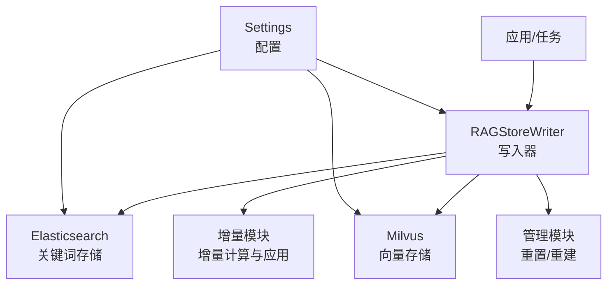
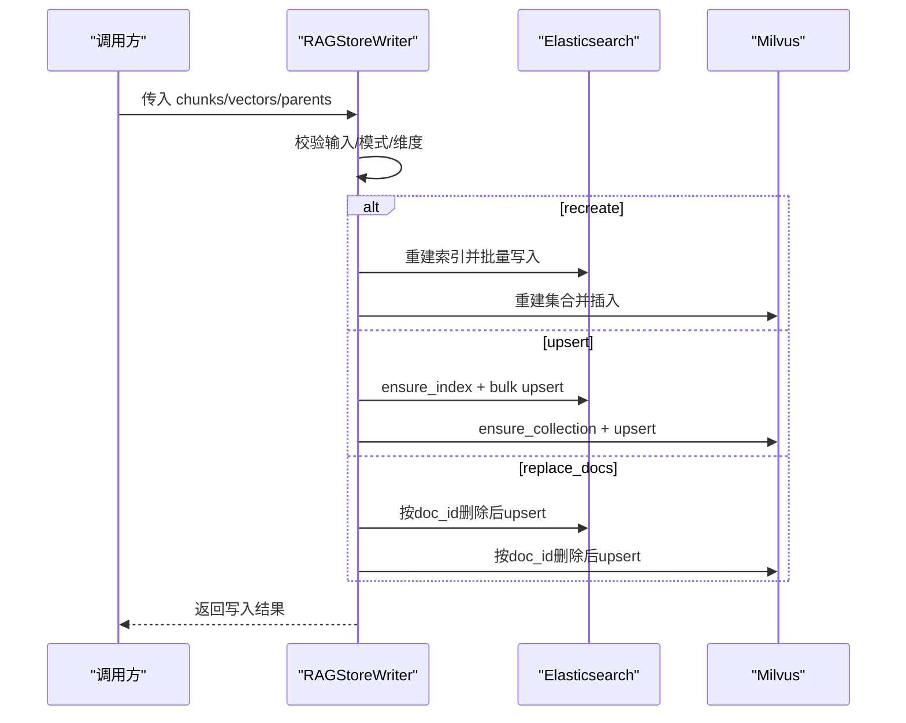
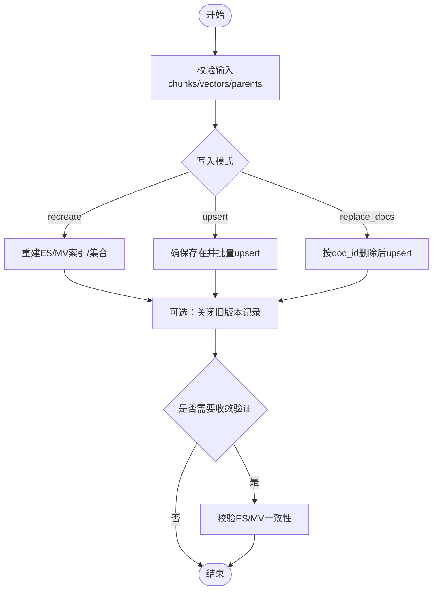
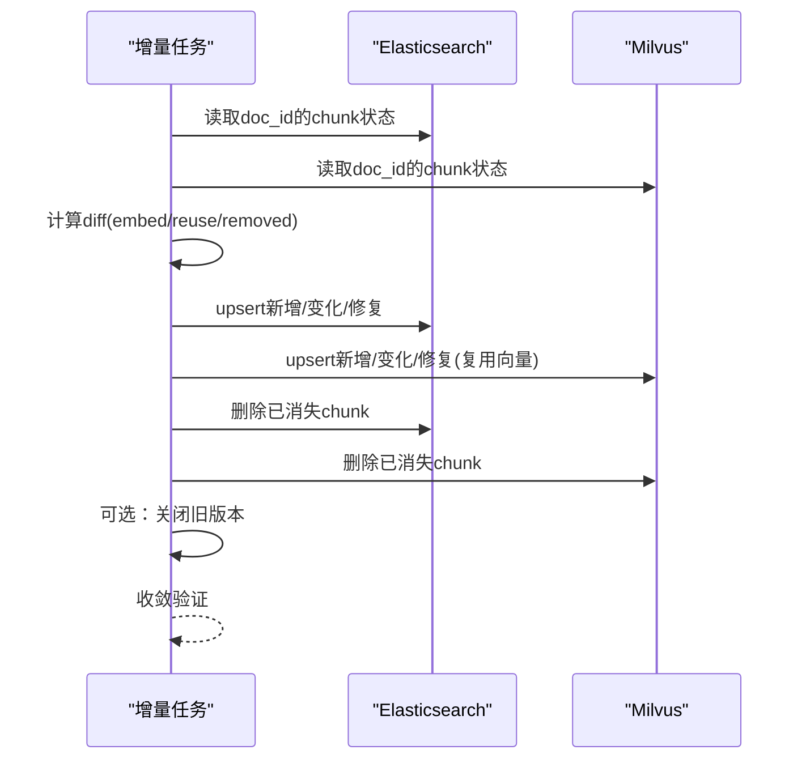
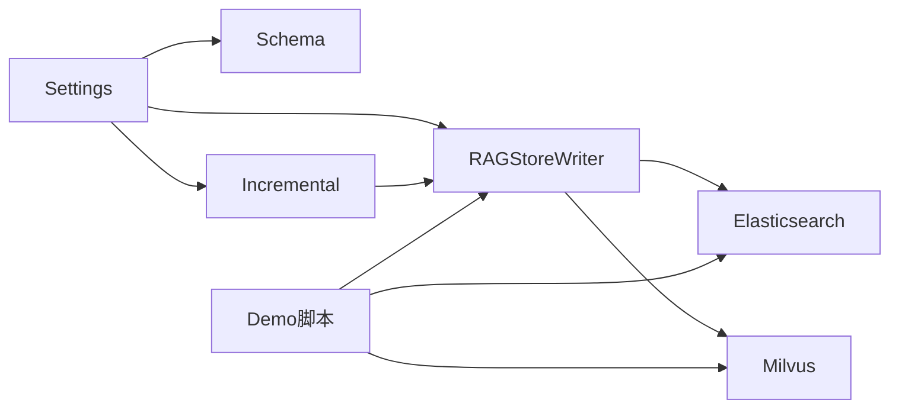

# 存储集成

<cite>
**本文引用的文件**
- [rag_store_writer.py](file://src/fast_app/ingestion/stores/rag_store_writer.py)
- [rag_store_schema.py](file://src/fast_app/ingestion/stores/rag_store_schema.py)
- [incremental_store.py](file://src/fast_app/ingestion/stores/incremental_store.py)
- [rag_store_admin.py](file://src/fast_app/ingestion/stores/rag_store_admin.py)
- [config.py](file://src/fast_app/core/config.py)
- [rebuild_rag_demo_stores.py](file://scripts/rebuild_rag_demo_stores.py)
</cite>

## 目录
1. [简介](#简介)
2. [项目结构](#项目结构)
3. [核心组件](#核心组件)
4. [架构总览](#架构总览)
5. [详细组件分析](#详细组件分析)
6. [依赖关系分析](#依赖关系分析)
7. [性能与容量规划](#性能与容量规划)
8. [故障排查指南](#故障排查指南)
9. [结论](#结论)
10. [附录：配置与示例](#附录：配置与示例)

## 简介
本文件面向 RAG 系统的“存储集成”能力，重点说明 RAGStoreWriter 的双写策略（Milvus 向量存储 + Elasticsearch 关键词存储）、Schema 设计、索引配置、数据一致性保证、增量存储机制、变更追踪与版本管理，并提供配置、写入、查询、异常处理的实践指引与优化建议。

## 项目结构
存储相关代码集中在 ingestion/stores 目录下，围绕以下职责划分：
- Schema 定义：ES mapping、Milvus schema 与索引参数集中管理
- 写入器：统一封装 ES/Milvus 的 upsert、replace、删除、版本关闭等写入逻辑
- 增量：基于现有状态计算差异并最小化写入
- 管理：提供安全重置、重建索引/集合的能力
- 配置：通过 Settings 集中管理连接、字段名、维度、超时等
- 脚本：演示如何构建向量、重建双存储并做冒烟测试

图表来源
- [rag_store_writer.py:219-478](file://src/fast_app/ingestion/stores/rag_store_writer.py#L219-L478)
- [incremental_store.py:39-235](file://src/fast_app/ingestion/stores/incremental_store.py#L39-L235)
- [rag_store_admin.py:53-162](file://src/fast_app/ingestion/stores/rag_store_admin.py#L53-L162)
- [config.py:58-82](file://src/fast_app/core/config.py#L58-L82)

章节来源
- [rag_store_writer.py:1-800](file://src/fast_app/ingestion/stores/rag_store_writer.py#L1-L800)
- [rag_store_schema.py:1-280](file://src/fast_app/ingestion/stores/rag_store_schema.py#L1-L280)
- [incremental_store.py:1-278](file://src/fast_app/ingestion/stores/incremental_store.py#L1-L278)
- [rag_store_admin.py:1-162](file://src/fast_app/ingestion/stores/rag_store_admin.py#L1-L162)
- [config.py:58-82](file://src/fast_app/core/config.py#L58-L82)

## 核心组件
- RAGStoreWriter：负责将 KnowledgeChunk 及其父块写入 ES 和 Milvus，支持 recreate/upsert/replace_docs 三种写入模式；提供按 doc_id 删除、按版本关闭旧记录、Markdown 父子收敛校验等能力。
- Schema：集中维护 ES 字段映射、Milvus 字段类型与索引参数，确保双端一致。
- 增量存储：对比目标 Chunk 与双存储现状，生成最小写入计划，复用已有向量避免重复 Embedding。
- 管理工具：安全地重建或重置 ES index 与 Milvus collection，包含 IK 分词器校验。
- 配置：以 Settings 暴露所有存储相关参数（地址、索引/集合名、字段名、embedding 维度、超时等）。

章节来源
- [rag_store_writer.py:63-213](file://src/fast_app/ingestion/stores/rag_store_writer.py#L63-L213)
- [rag_store_schema.py:8-145](file://src/fast_app/ingestion/stores/rag_store_schema.py#L8-L145)
- [incremental_store.py:21-174](file://src/fast_app/ingestion/stores/incremental_store.py#L21-L174)
- [rag_store_admin.py:21-162](file://src/fast_app/ingestion/stores/rag_store_admin.py#L21-L162)
- [config.py:58-82](file://src/fast_app/core/config.py#L58-L82)

## 架构总览
RAGStoreWriter 作为统一入口，根据配置选择写入模式，对 ES 与 Milvus 执行双写。ES 用于关键词检索与过滤，Milvus 用于向量相似度检索。两者通过一致的元数据与版本字段实现可追溯与可回滚。

图表来源
- [rag_store_writer.py:219-478](file://src/fast_app/ingestion/stores/rag_store_writer.py#L219-L478)
- [rag_store_schema.py:147-280](file://src/fast_app/ingestion/stores/rag_store_schema.py#L147-L280)

## 详细组件分析

### 存储 Schema 设计与索引配置
- Elasticsearch
  - 文本字段使用 ik_max_word 分词索引、ik_smart 搜索分词；标题字段额外提供 keyword 子字段用于精确匹配。
  - 关键字段如 id/doc_id/source_path/document_type 等为 keyword 类型，便于过滤与聚合。
  - 元数据 metadata 采用嵌套 properties，覆盖权限、路径、片段信息、哈希、构建器版本等。
  - 版本字段 valid_from_version/valid_to_version 为 long，用于版本区间控制。
- Milvus
  - 主键字段为 VARCHAR，向量字段 FLOAT_VECTOR，维度来自 embedding_dim。
  - 内容字段 VARCHAR(4096)，其他字符串字段长度受限。
  - 索引类型为 AUTOINDEX，度量 COSINE，适合余弦相似度检索。
  - 输出字段列表固定，便于查询时只取必要字段，降低网络开销。

章节来源
- [rag_store_schema.py:58-145](file://src/fast_app/ingestion/stores/rag_store_schema.py#L58-L145)
- [rag_store_schema.py:147-280](file://src/fast_app/ingestion/stores/rag_store_schema.py#L147-L280)

### 写入流程与双写策略
- 写入前校验
  - chunks 与 vectors 数量一致、chunk.id 唯一、metadata 必填项齐全、向量维度与配置一致。
  - Markdown 父子关系校验：子块的 parent_id 必须存在且与父块元数据一致，父块 content_hash 需匹配。
- ES 写入
  - ensure_es_index：若不存在则创建，否则补充新增字段映射；IK 分词器可用性校验。
  - build_es_bulk_actions：将 chunk/parent 转为 ES action 列表，填充 id、content、search_text、title、source、logical/physical parent id、version 区间、metadata、created_at 等。
  - upsert_es_index：bulk 写入并刷新；recreate_es_index：先重置再批量写入；replace_docs_es_index：按 doc_id 删除后再 upsert。
  - close_es_docs_for_version：用 painless 脚本将指定 doc_id 下未关闭记录的 valid_to_version 设置为当前版本，保留历史供冻结版本读取。
- Milvus 写入
  - ensure_milvus_collection：若不存在则创建 schema 与索引并加载；recreate_milvus_collection：重置后插入并 flush/load。
  - build_milvus_rows：将 chunk/vector 映射为行数据，包含 source/title/doc_id/path/type/chunk_index、logical/physical parent id、version 区间、metadata。
  - upsert_milvus_collection：upsert 后 flush/load；delete_milvus_docs_by_doc_ids：按 doc_id 表达式删除；close_milvus_docs_for_version：查询并 upsert 完整行以设置 valid_to_version。
- 双写一致性
  - 提供 verify_markdown_store_convergence：扫描 ES 与 Milvus，校验 ID 集合、关键元数据、向量维度是否收敛一致。

图表来源
- [rag_store_writer.py:93-213](file://src/fast_app/ingestion/stores/rag_store_writer.py#L93-L213)
- [rag_store_writer.py:219-478](file://src/fast_app/ingestion/stores/rag_store_writer.py#L219-L478)
- [rag_store_writer.py:528-724](file://src/fast_app/ingestion/stores/rag_store_writer.py#L528-L724)
- [rag_store_writer.py:727-800](file://src/fast_app/ingestion/stores/rag_store_writer.py#L727-L800)

章节来源
- [rag_store_writer.py:93-213](file://src/fast_app/ingestion/stores/rag_store_writer.py#L93-L213)
- [rag_store_writer.py:219-478](file://src/fast_app/ingestion/stores/rag_store_writer.py#L219-L478)
- [rag_store_writer.py:481-724](file://src/fast_app/ingestion/stores/rag_store_writer.py#L481-L724)
- [rag_store_writer.py:727-800](file://src/fast_app/ingestion/stores/rag_store_writer.py#L727-L800)

### 增量存储机制、变更追踪与版本管理
- 增量计算
  - load_es_chunk_states：流式读取 ES 中某 doc_id 的所有 chunk 身份与元数据。
  - load_milvus_chunk_states：分页读取 Milvus 中某 doc_id 的 chunk 元数据与向量。
  - build_chunk_diff：比较目标 chunks 与双存储现状，分类为 unchanged/metadata_only/added/changed/removed/repaired/embedded，并生成 reuse 向量列表以减少重复 Embedding。
- 增量应用
  - apply_chunk_diff：先 upsert 新增/变化/修复项（复用向量或新向量），再删除已消失的 chunk IDs。
  - delete_es_chunks_by_ids / delete_milvus_chunks_by_ids：按稳定 ID 删除并刷新。
- 版本管理
  - 通过 valid_from_version/valid_to_version 控制记录可见性；close_rag_docs_for_version 同时关闭 ES 与 Milvus 中的旧版本记录，使新版本生效而旧版本仍可被冻结请求读取。
- 收敛验证
  - verify_chunk_convergence：校验 ES/Milvus 的 ID 集合、content_hash/index_hash、向量维度是否与目标一致。

图表来源
- [incremental_store.py:39-235](file://src/fast_app/ingestion/stores/incremental_store.py#L39-L235)
- [rag_store_writer.py:684-703](file://src/fast_app/ingestion/stores/rag_store_writer.py#L684-L703)

章节来源
- [incremental_store.py:39-235](file://src/fast_app/ingestion/stores/incremental_store.py#L39-L235)
- [rag_store_writer.py:684-703](file://src/fast_app/ingestion/stores/rag_store_writer.py#L684-L703)

### 管理工具与安全重置
- 校验 IK 分词器可用性，避免索引不可用。
- reset_es_index：删除并重建 ES index，可选择是否立即创建空结构。
- reset_milvus_collection：删除并重建 Milvus collection，创建 schema 与索引并加载。
- reset_rag_stores：统一入口，支持 elasticsearch/milvus/both 目标，返回每个 store 的重置结果。

章节来源
- [rag_store_admin.py:53-162](file://src/fast_app/ingestion/stores/rag_store_admin.py#L53-L162)

## 依赖关系分析
- 配置依赖
  - Settings 提供 ES/Milvus 连接、索引/集合名、字段名、embedding 维度、超时等。
- 模块耦合
  - rag_store_writer 依赖 schema 定义与管理工具，提供具体写入逻辑。
  - incremental_store 复用 writer 的 ensure/upsert 能力，聚焦差异计算与最小化写入。
  - rebuild_rag_demo_stores 脚本演示端到端流程：构造 chunks、生成向量、重建双存储并冒烟测试。

图表来源
- [config.py:58-82](file://src/fast_app/core/config.py#L58-L82)
- [rag_store_writer.py:219-478](file://src/fast_app/ingestion/stores/rag_store_writer.py#L219-L478)
- [incremental_store.py:39-235](file://src/fast_app/ingestion/stores/incremental_store.py#L39-L235)
- [rebuild_rag_demo_stores.py:189-445](file://scripts/rebuild_rag_demo_stores.py#L189-L445)

章节来源
- [config.py:58-82](file://src/fast_app/core/config.py#L58-L82)
- [rag_store_writer.py:219-478](file://src/fast_app/ingestion/stores/rag_store_writer.py#L219-L478)
- [incremental_store.py:39-235](file://src/fast_app/ingestion/stores/incremental_store.py#L39-L235)
- [rebuild_rag_demo_stores.py:189-445](file://scripts/rebuild_rag_demo_stores.py#L189-L445)

## 性能与容量规划
- 写入吞吐
  - ES 使用 async_bulk 批量写入并 refresh=True，适合中小规模快速可见；大规模可考虑关闭实时刷新或使用异步批处理策略。
  - Milvus 使用 upsert/insert 后 flush/load，确保写入后可查；注意批量大小与内存占用。
- 索引与查询
  - ES 使用 ik 分词器，keyword 字段用于精确过滤；合理设置 number_of_shards/replicas（默认单分片无副本，适合单机/开发）。
  - Milvus 使用 AUTOINDEX 与 COSINE，适合高维向量相似度检索；关注向量维度与模型输出一致。
- 增量优化
  - 复用已有向量减少 Embedding 调用；仅更新变化的 chunk，降低双写压力。
- 容量规划
  - 预估 chunk 数量、平均内容长度、向量维度与索引大小；结合 ES 分片与副本、Milvus 节点资源进行容量评估。
- 备份恢复
  - ES：建议使用快照/导出工具定期备份索引；恢复时重建索引并导入数据。
  - Milvus：依据部署方式（云托管/自建）使用官方备份方案或迁移工具；恢复后重新加载集合。

[本节为通用指导，不直接分析具体文件]

## 故障排查指南
- 常见错误
  - 输入校验失败：chunks/vectors 数量不一致、chunk.id 重复、metadata 缺失、向量维度不匹配。
  - ES 写入错误：bulk 返回 errors；检查 IK 分词器是否存在、索引映射是否正确。
  - Milvus 写入错误：集合不存在或未加载；确认 schema/索引参数与配置一致。
  - 版本关闭失败：脚本或查询条件未命中；检查 valid_to_version 初始值与过滤条件。
- 诊断步骤
  - 使用 verify_markdown_store_convergence 或 verify_chunk_convergence 检查双端一致性。
  - 检查 Settings 中 embedding_dim 与实际向量维度是否一致。
  - 查看 ES 索引 mapping 与 Milvus collection schema 是否对齐。
  - 对于增量场景，检查 diff 统计（unchanged/metadata_only/added/changed/removed）是否符合预期。

章节来源
- [rag_store_writer.py:93-213](file://src/fast_app/ingestion/stores/rag_store_writer.py#L93-L213)
- [rag_store_writer.py:219-478](file://src/fast_app/ingestion/stores/rag_store_writer.py#L219-L478)
- [rag_store_writer.py:528-724](file://src/fast_app/ingestion/stores/rag_store_writer.py#L528-L724)
- [incremental_store.py:238-268](file://src/fast_app/ingestion/stores/incremental_store.py#L238-L268)

## 结论
RAGStoreWriter 提供了统一的 ES/Milvus 双写能力，配合 Schema 管理与增量机制，实现了高可用、可追溯、可回滚的知识库存储。通过严格的输入校验、版本管理与收敛验证，保障了双端数据一致性与查询稳定性。在生产环境中，应结合容量规划与备份恢复策略，持续优化写入与查询性能。

[本节为总结，不直接分析具体文件]

## 附录：配置与示例
- 配置要点
  - ES：elasticsearch_url、elasticsearch_index_name、用户名密码、请求超时。
  - Milvus：milvus_host、milvus_port、collection_name、向量字段名、ID 字段名、内容字段名。
  - Embedding：embedding_provider、embedding_model_name、embedding_dim。
  - Ingestion：ingestion_write_mode（recreate/upsert/replace_docs）、Markdown 切分与父块参数。
- 示例流程（参考脚本）
  - 构建 demo chunks，生成向量，重建 ES index 与 Milvus collection，执行冒烟测试。
  - 可通过命令行参数控制是否跳过 ES/Milvus 重建。

章节来源
- [config.py:58-82](file://src/fast_app/core/config.py#L58-L82)
- [config.py:597-634](file://src/fast_app/core/config.py#L597-L634)
- [config.py:637-797](file://src/fast_app/core/config.py#L637-L797)
- [rebuild_rag_demo_stores.py:189-445](file://scripts/rebuild_rag_demo_stores.py#L189-L445)