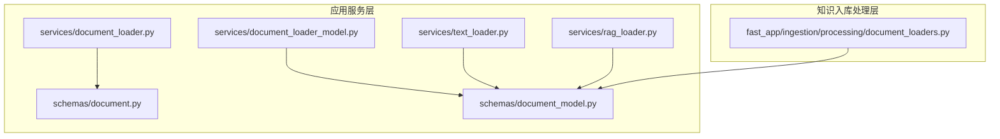
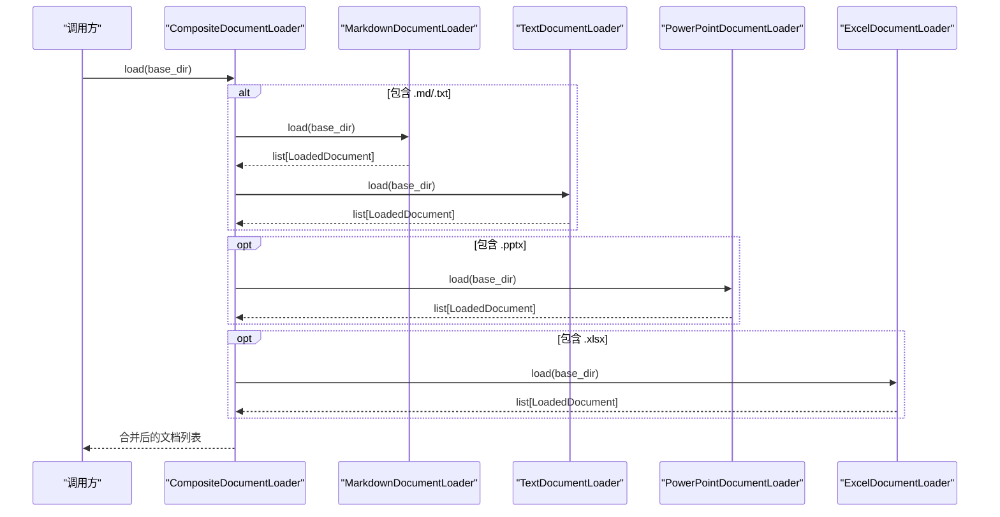
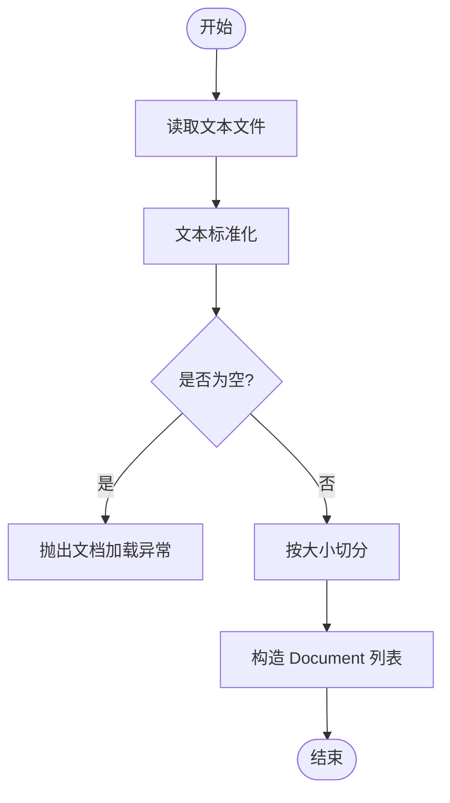
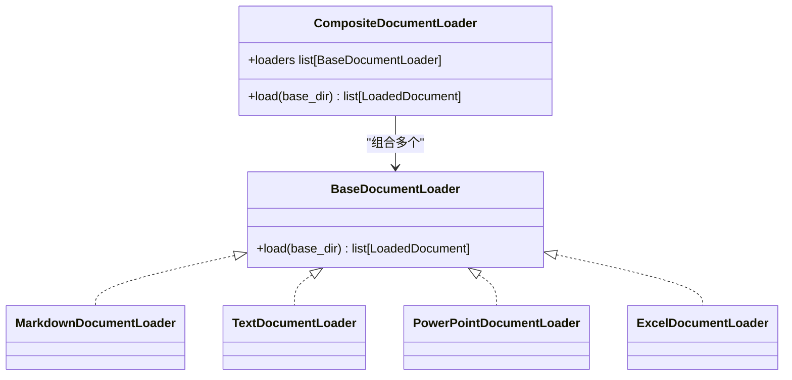
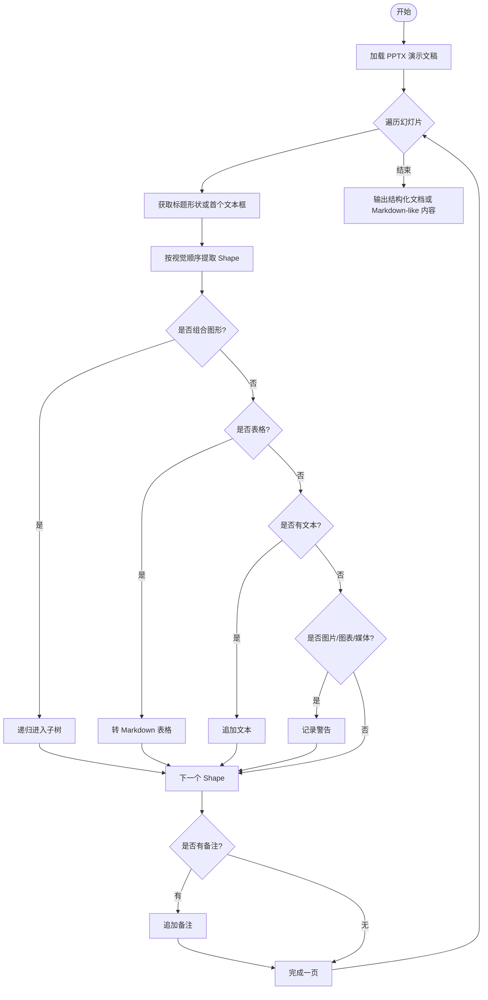
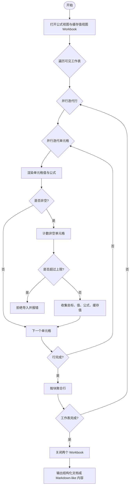
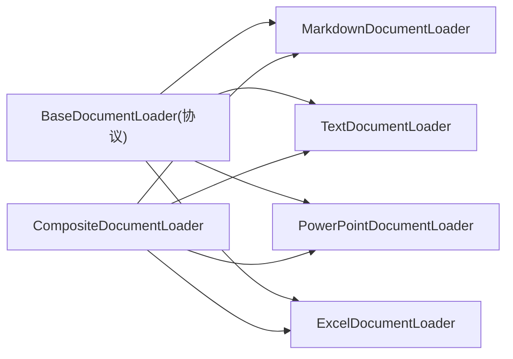

# 文档加载器

<cite>
**本文引用的文件**
- [document_loader.py](file://src/app/services/document_loader.py)
- [document_loader_model.py](file://src/app/services/document_loader_model.py)
- [text_loader.py](file://src/app/services/text_loader.py)
- [rag_loader.py](file://src/app/services/rag_loader.py)
- [document.py](file://src/app/schemas/document.py)
- [document_model.py](file://src/app/schemas/document_model.py)
- [document_loaders.py](file://src/fast_app/ingestion/processing/document_loaders.py)
</cite>

## 目录
1. [简介](#简介)
2. [项目结构](#项目结构)
3. [核心组件](#核心组件)
4. [架构总览](#架构总览)
5. [详细组件分析](#详细组件分析)
6. [依赖关系分析](#依赖关系分析)
7. [性能与内存管理](#性能与内存管理)
8. [故障排查指南](#故障排查指南)
9. [结论](#结论)
10. [附录：扩展新格式加载器指南](#附录：扩展新格式加载器指南)

## 简介
本文件面向“文档加载器”子系统，系统化梳理并解释现有实现与可扩展设计。仓库中同时存在两套加载器体系：
- 轻量文本切分链路：提供通用文本读取、清洗、按大小切分、构造 Document 列表的能力，适用于 Markdown、TXT 等纯文本场景。
- 结构化文档加载链路：通过 Protocol 抽象出统一加载接口，分别实现 Markdown、TXT、PPTX、XLSX 的解析策略，输出领域模型 LoadedDocument，便于后续构建块（ChunkBuilder）和索引写入。

本文档将围绕以下目标展开：
- 解释 DocumentLoader 抽象设计与实现模式（基于 Protocol 的统一接口）。
- 详解 Markdown、PPTX、XLSX 的解析策略、内容提取方法、错误处理机制。
- 说明如何扩展新的文档格式支持，包括自定义加载器的开发步骤。
- 给出使用示例路径、配置参数建议、异常处理实践。
- 提供性能优化与内存管理最佳实践。

## 项目结构
当前与文档加载相关的代码主要分布在两个位置：
- 应用服务层：提供轻量文本加载与切分能力，面向简单 RAG 流程。
- 知识入库处理层：提供统一的文档加载协议与多种格式的具体实现，面向知识库导入与结构化解析。

图表来源
- [document_loader.py:1-56](file://src/app/services/document_loader.py#L1-L56)
- [document_loader_model.py:1-49](file://src/app/services/document_loader_model.py#L1-L49)
- [text_loader.py:1-23](file://src/app/services/text_loader.py#L1-L23)
- [rag_loader.py:1-27](file://src/app/services/rag_loader.py#L1-L27)
- [document.py:1-13](file://src/app/schemas/document.py#L1-L13)
- [document_model.py:1-12](file://src/app/schemas/document_model.py#L1-L12)
- [document_loaders.py:1-562](file://src/fast_app/ingestion/processing/document_loaders.py#L1-L562)

章节来源
- [document_loader.py:1-56](file://src/app/services/document_loader.py#L1-L56)
- [document_loader_model.py:1-49](file://src/app/services/document_loader_model.py#L1-L49)
- [text_loader.py:1-23](file://src/app/services/text_loader.py#L1-L23)
- [rag_loader.py:1-27](file://src/app/services/rag_loader.py#L1-L27)
- [document_loaders.py:1-562](file://src/fast_app/ingestion/processing/document_loaders.py#L1-L562)

## 核心组件
- 轻量文本加载与切分
  - 文本读取与清洗：封装文件读取、空内容校验、文本标准化。
  - 文本切分：按固定大小切分为 chunk，生成带元数据的 Document 列表。
  - 两种数据模型：TypedDict 版本与 Pydantic 版本，后者具备更强的字段校验能力。
- 结构化文档加载协议与实现
  - BaseDocumentLoader 协议：定义统一的 load(base_dir) -> list[LoadedDocument] 接口。
  - MarkdownDocumentLoader：递归扫描 .md，UTF-8 读取，保留 source_path 与 metadata。
  - TextDocumentLoader：递归扫描 .txt，UTF-8 读取，保留 source_path 与 metadata。
  - PowerPointDocumentLoader：解析 PPTX，提取幻灯片标题、正文、表格、备注，记录警告信息。
  - ExcelDocumentLoader：解析 XLSX，双 Workbook（公式视图与缓存值视图）配对读取，保留坐标、行号、公式与缓存值，限制非空单元格数量。
  - CompositeDocumentLoader：组合多个 Loader 顺序执行并合并结果。
  - build_default_document_loader：默认返回 Markdown/TXT 组合加载器。

章节来源
- [document_loader.py:1-56](file://src/app/services/document_loader.py#L1-L56)
- [document_loader_model.py:1-49](file://src/app/services/document_loader_model.py#L1-L49)
- [document_loaders.py:24-562](file://src/fast_app/ingestion/processing/document_loaders.py#L24-L562)

## 架构总览
下图展示从目录到结构化文档的加载流程，以及不同格式加载器的职责边界。

图表来源
- [document_loaders.py:532-562](file://src/fast_app/ingestion/processing/document_loaders.py#L532-L562)

章节来源
- [document_loaders.py:32-84](file://src/fast_app/ingestion/processing/document_loaders.py#L32-L84)
- [document_loaders.py:87-193](file://src/fast_app/ingestion/processing/document_loaders.py#L87-L193)
- [document_loaders.py:269-469](file://src/fast_app/ingestion/processing/document_loaders.py#L269-L469)
- [document_loaders.py:532-562](file://src/fast_app/ingestion/processing/document_loaders.py#L532-L562)

## 详细组件分析

### 轻量文本加载与切分（应用服务层）
- 功能要点
  - 读取文本文件并进行标准化清洗。
  - 空内容检测，避免无意义切分。
  - 按 chunk_size 切分文本，生成带 source 与 chunk_index 的 Document。
  - 提供 TypedDict 与 Pydantic 两种数据模型版本，后者在构造时进行严格校验。
- 错误处理
  - 文件读取失败：转换为高层业务异常 DocumentLoadError。
  - 内容为空：抛出 DocumentLoadError。
  - 切分参数或逻辑异常：捕获 ValueError 并转换为 DocumentLoadError。
  - Pydantic 版本额外捕获 ValidationError，确保数据结构合法。
- 使用建议
  - 适合纯文本（如 Markdown、TXT）的快速入库。
  - 可通过调整 chunk_size 控制后续检索粒度。

图表来源
- [document_loader.py:16-56](file://src/app/services/document_loader.py#L16-L56)
- [document_loader_model.py:13-49](file://src/app/services/document_loader_model.py#L13-L49)

章节来源
- [document_loader.py:1-56](file://src/app/services/document_loader.py#L1-L56)
- [document_loader_model.py:1-49](file://src/app/services/document_loader_model.py#L1-L49)
- [document.py:1-13](file://src/app/schemas/document.py#L1-L13)
- [document_model.py:1-12](file://src/app/schemas/document_model.py#L1-L12)

### 结构化文档加载协议与实现（知识入库处理层）
- BaseDocumentLoader 协议
  - 定义最小接口：load(base_dir) -> list[LoadedDocument]。
  - 所有具体加载器遵循该协议，便于组合与替换。
- MarkdownDocumentLoader
  - 行为：递归扫描 base_dir 下的 .md 文件，UTF-8 读取内容，保留 source_path，生成 LoadedDocument，类型标记为 markdown。
  - 元数据：通过统一函数构建，包含来源、类型、知识库目录等信息。
- TextDocumentLoader
  - 行为：递归扫描 base_dir 下的 .txt 文件，UTF-8 读取内容，保留 source_path，生成 LoadedDocument，类型标记为 text。
- PowerPointDocumentLoader
  - 行为：递归扫描 base_dir 下的 .pptx 文件，逐页提取标题、正文、表格、备注；对 GroupShape 递归遍历并按视觉顺序排序；图片、图表、SmartArt 等无法提取的内容记录 warning。
  - 输出：既可渲染为 Markdown-like 字符串，也可输出结构化 LoadedPowerPointDocument（含 slides、warnings、metadata）。
- ExcelDocumentLoader
  - 行为：递归扫描 base_dir 下的 .xlsx 文件；使用 openpyxl 打开两个只读 Workbook（公式视图 data_only=False 与缓存值视图 data_only=True），并行迭代行与单元格；记录列坐标、行号、公式与缓存值；跳过隐藏工作表；限制非空单元格上限；最终渲染为 Markdown-like 字符串或输出结构化 LoadedExcelDocument。
  - 输出：sheets、business_header_hint、source_columns、extraction_warnings、metadata。
- CompositeDocumentLoader 与默认构建器
  - 行为：顺序调用多个 Loader，合并结果。
  - 默认：build_default_document_loader 返回 Markdown/TXT 组合加载器。

图表来源
- [document_loaders.py:24-31](file://src/fast_app/ingestion/processing/document_loaders.py#L24-L31)
- [document_loaders.py:32-84](file://src/fast_app/ingestion/processing/document_loaders.py#L32-L84)
- [document_loaders.py:87-193](file://src/fast_app/ingestion/processing/document_loaders.py#L87-L193)
- [document_loaders.py:269-469](file://src/fast_app/ingestion/processing/document_loaders.py#L269-L469)
- [document_loaders.py:532-562](file://src/fast_app/ingestion/processing/document_loaders.py#L532-L562)

章节来源
- [document_loaders.py:24-562](file://src/fast_app/ingestion/processing/document_loaders.py#L24-L562)

### PPTX 加载器深入分析
- 解析策略
  - 幻灯片遍历：按 slide_index 顺序处理，优先取 title_shape，若无则按视觉顺序查找首个有效文本框作为标题。
  - Shape 提取：按 (top, left, shape_id) 排序保证稳定阅读顺序；遇到 GROUP 递归进入子树；识别表格并转为 Markdown 表格；普通文本框提取文本；图片、图表、SmartArt、媒体等记录 warning。
  - 备注读取：先检查 has_notes_slide，再安全访问 notes_text_frame.text。
- 内容组织
  - 可渲染为 Markdown-like 字符串：每页以 “Slide n: 标题” 作为 section，随后拼接正文与备注。
  - 可输出结构化对象：包含 slide_id、slide_number、title、content、notes、warnings。
- 错误与警告
  - 无法处理的视觉内容：记录 pptx_visual_content_skipped。
  - 元数据中包含 extraction_warnings，便于任务状态追踪。

图表来源
- [document_loaders.py:87-193](file://src/fast_app/ingestion/processing/document_loaders.py#L87-L193)
- [document_loaders.py:196-267](file://src/fast_app/ingestion/processing/document_loaders.py#L196-L267)

章节来源
- [document_loaders.py:87-193](file://src/fast_app/ingestion/processing/document_loaders.py#L87-L193)
- [document_loaders.py:196-267](file://src/fast_app/ingestion/processing/document_loaders.py#L196-L267)

### XLSX 加载器深入分析
- 解析策略
  - 双 Workbook 配对：一个用于读取公式（data_only=False），另一个用于读取缓存值（data_only=True），保证同时获得表达式与计算结果。
  - 工作表过滤：跳过隐藏工作表，记录 xlsx_hidden_sheet_skipped。
  - 行列遍历：zip_longest 并行迭代公式行与值行，定位单元格坐标（A/B/C）、行号，收集非空单元格。
  - 公式渲染：若单元格为公式，同时记录公式文本与缓存值；若缓存缺失，记录 xlsx_formula_cache_missing。
  - 资源保护：finally 中关闭两个 Workbook，防止资源泄漏。
- 内容组织
  - 可渲染为 Markdown-like 字符串：按 Sheet 分组，行按 block_size 分段，附带 Business header hint、Row 编号、列坐标。
  - 可输出结构化对象：包含 sheets、rows、cells、source_columns、business_header_hints、extraction_warnings、metadata。
- 错误与限制
  - 非空单元格超过阈值（例如 100000）：抛出 ValueError 拒绝导入，防止内存爆炸。
  - 元数据中包含 sheet_names、business_header_hints、extraction_warnings。

图表来源
- [document_loaders.py:269-469](file://src/fast_app/ingestion/processing/document_loaders.py#L269-L469)
- [document_loaders.py:472-529](file://src/fast_app/ingestion/processing/document_loaders.py#L472-L529)

章节来源
- [document_loaders.py:269-469](file://src/fast_app/ingestion/processing/document_loaders.py#L269-L469)
- [document_loaders.py:472-529](file://src/fast_app/ingestion/processing/document_loaders.py#L472-L529)

### 文本加载辅助工具
- text_loader.py：按行读取文本，去除空行，标准化行内容，返回行列表。
- rag_loader.py：读取文本文件，按行拆分并去空白，空内容抛 RagLoadError。

章节来源
- [text_loader.py:1-23](file://src/app/services/text_loader.py#L1-L23)
- [rag_loader.py:1-27](file://src/app/services/rag_loader.py#L1-L27)

## 依赖关系分析
- 内部依赖
  - 应用服务层依赖 schemas 中的 Document/DocumentMetadata 模型，以及 text_splitter、file_utils、text_utils。
  - 知识入库处理层依赖 domain.knowledge_models 中的 LoadedDocument、LoadedPowerPointDocument、LoadedExcelDocument 等，并通过 metadata 构建函数统一生成元数据。
- 外部依赖
  - PPTX：python-pptx（Presentation、shapes、MSO_SHAPE_TYPE）。
  - XLSX：openpyxl（load_workbook、get_column_letter）。
- 耦合与内聚
  - 通过 BaseDocumentLoader 协议降低耦合，提高内聚性；每个格式加载器专注自身解析逻辑。
  - CompositeDocumentLoader 负责编排，不感知具体格式细节。

图表来源
- [document_loaders.py:24-31](file://src/fast_app/ingestion/processing/document_loaders.py#L24-L31)
- [document_loaders.py:532-562](file://src/fast_app/ingestion/processing/document_loaders.py#L532-L562)

章节来源
- [document_loaders.py:24-562](file://src/fast_app/ingestion/processing/document_loaders.py#L24-L562)

## 性能与内存管理
- 文本切分
  - 合理设置 chunk_size，避免过大导致检索上下文过长或过小导致碎片过多。
  - 使用流式或分批处理大文件，减少一次性加载内存占用。
- PPTX 解析
  - 按视觉顺序排序与递归遍历 GroupShape，注意深层嵌套可能带来性能开销；必要时限制最大层级或提前终止。
  - 图片、图表、SmartArt 不做 OCR，仅记录警告，避免昂贵的外部服务调用。
- XLSX 解析
  - 双 Workbook 打开会增加内存占用；务必在 finally 中关闭 Workbook。
  - 限制非空单元格上限，防止超大工作表导致内存溢出。
  - 使用 read_only=True 与 keep_links=False 提升性能与安全性。
- 通用建议
  - 批量加载时采用分页或并发控制，避免瞬时 I/O 压力。
  - 对大型文件进行预检（文件大小、页数、行数），必要时拒绝或降级处理。
  - 记录 extraction_warnings 与元数据，便于监控与回溯。

[本节为通用指导，无需引用具体文件]

## 故障排查指南
- 常见异常与处理
  - 文件读取失败：应用服务层会抛出 DocumentLoadError；RAG 加载器会抛出 RagLoadError。需检查文件路径、权限与编码。
  - 内容为空：抛出相应异常，需确认文件是否真正包含可读内容。
  - 切分失败：检查 chunk_size 与文本长度，确保参数合法。
  - PPTX 视觉内容未提取：查看 extraction_warnings 中的 pptx_visual_content_skipped，确认是否需要补充 OCR 或其他处理。
  - XLSX 缓存缺失：查看 xlsx_formula_cache_missing，确认 Excel 是否正确保存了缓存值。
  - XLSX 超大文件：非空单元格超限会抛出 ValueError，需拆分文件或限制导入范围。
- 调试建议
  - 启用日志记录，打印 source_path、document_type、sheet_names、slide_count 等元数据。
  - 对异常进行分层记录：用户错误、外部服务错误、系统错误，便于定位问题。
  - 对关键路径添加断点或中间态输出（如幻灯片数、工作表名、行块大小）。

章节来源
- [document_loader.py:16-56](file://src/app/services/document_loader.py#L16-L56)
- [document_loader_model.py:13-49](file://src/app/services/document_loader_model.py#L13-L49)
- [rag_loader.py:8-27](file://src/app/services/rag_loader.py#L8-L27)
- [document_loaders.py:87-193](file://src/fast_app/ingestion/processing/document_loaders.py#L87-L193)
- [document_loaders.py:269-469](file://src/fast_app/ingestion/processing/document_loaders.py#L269-L469)

## 结论
本项目实现了两层文档加载能力：轻量文本切分与结构化文档加载。前者适合快速接入与简单场景；后者通过 Protocol 抽象与多格式实现，提供了稳定、可扩展、可观测的知识库导入能力。PPTX 与 XLSX 的解析策略充分考虑了实际企业文档的结构特点与资源限制，并通过警告与元数据增强可维护性。未来可按相同模式扩展新格式（如 PDF），保持统一接口与一致的错误处理。

[本节为总结，无需引用具体文件]

## 附录：扩展新格式加载器指南
- 目标
  - 新增一种文档格式（例如 PDF）的加载器，使其能像 Markdown、TXT、PPTX、XLSX 一样被组合加载。
- 步骤
  1. 定义或复用领域模型：确保输出类型为 LoadedDocument 或对应结构化类型（如 LoadedPDFDocument）。
  2. 实现 BaseDocumentLoader 协议：实现 load(base_dir) -> list[LoadedDocument]，递归扫描指定后缀的文件。
  3. 解析策略
     - 读取文件内容（注意编码与安全校验）。
     - 提取结构化信息（段落、表格、标题、页码等）。
     - 记录警告与元数据（如 extraction_warnings、page_count、source_path）。
  4. 错误处理
     - 文件读取失败：抛出业务异常（可参考 DocumentLoadError/RagLoadError）。
     - 内容为空：抛出相应异常。
     - 解析异常：捕获并转换为业务异常，记录上下文。
  5. 组合与默认构建
     - 在 CompositeDocumentLoader 中加入新加载器。
     - 如需默认包含，更新 build_default_document_loader。
  6. 测试与验证
     - 准备典型样本（含边界情况：空内容、超大文件、特殊字符、隐藏元素）。
     - 验证输出稳定性（顺序、元数据、警告）。
     - 压测性能与内存占用，必要时增加限制与降级策略。
- 注意事项
  - 保持与现有加载器一致的元数据规范与警告命名。
  - 对于需要外部服务的解析（如 OCR），应异步化并加入超时重试与降级。
  - 对大文件进行预检与分块处理，避免内存峰值过高。

[本节为概念性指导，无需引用具体文件]