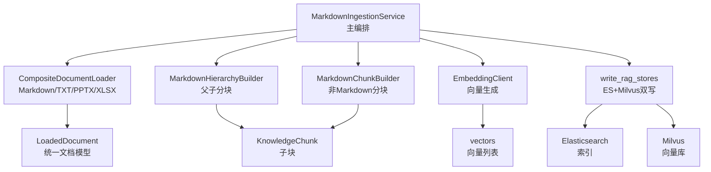
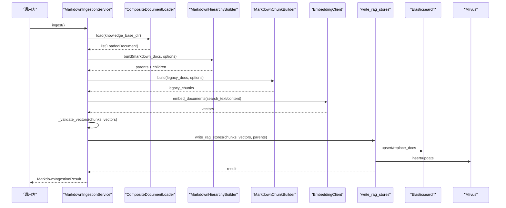
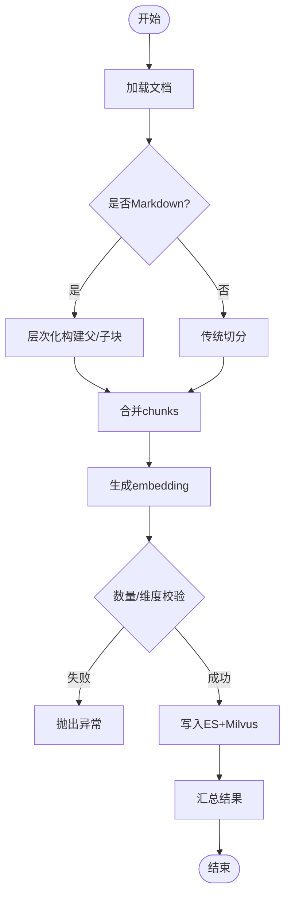
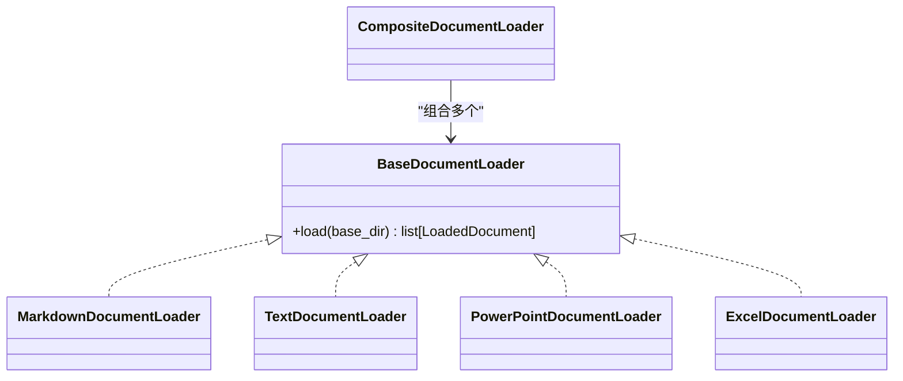
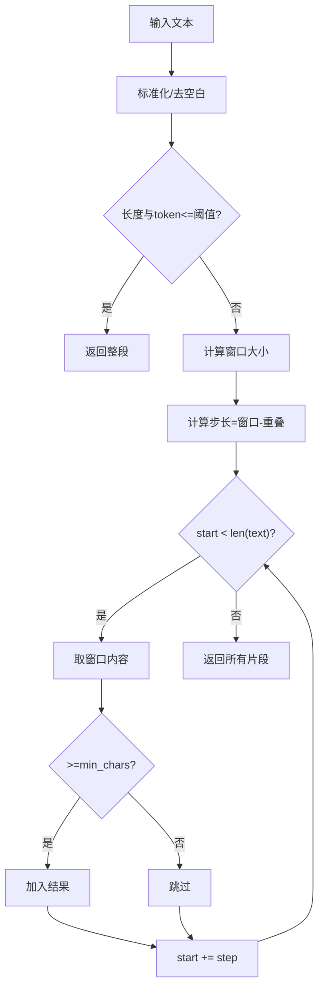
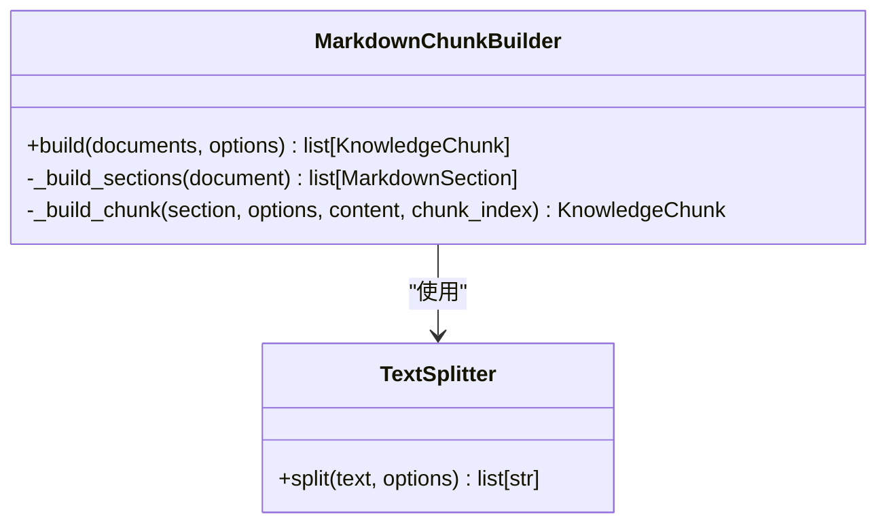
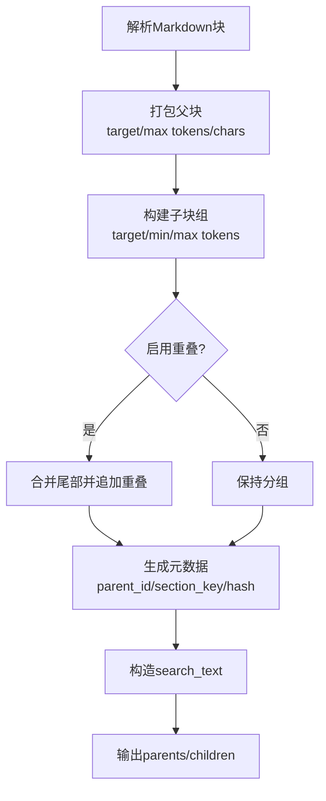
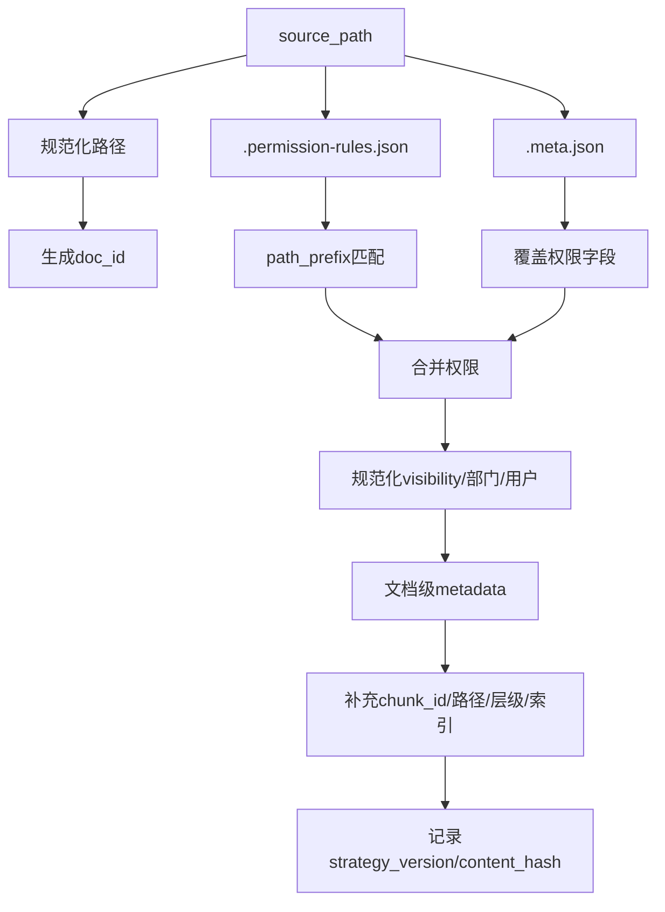
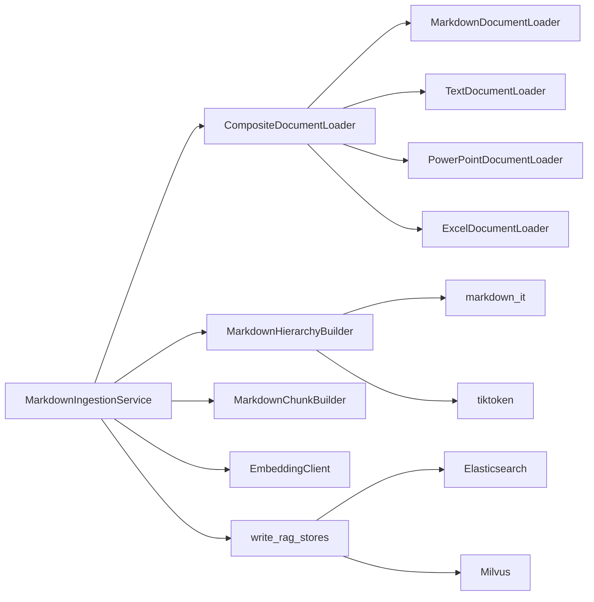

# 文档处理系统

<cite>
**本文引用的文件**
- [markdown_ingestion_service.py](file://src/fast_app/ingestion/markdown_ingestion_service.py)
- [document_loaders.py](file://src/fast_app/ingestion/processing/document_loaders.py)
- [chunk_builders.py](file://src/fast_app/ingestion/processing/chunk_builders.py)
- [markdown_hierarchy.py](file://src/fast_app/ingestion/processing/markdown_hierarchy.py)
- [metadata_models.py](file://src/fast_app/ingestion/processing/metadata_models.py)
- [knowledge_models.py](file://src/fast_app/domain/knowledge_models.py)
- [text_splitter.py](file://src/app/services/text_splitter.py)
- [document_loader.py](file://src/app/services/document_loader.py)
</cite>

## 目录
1. [简介](#简介)
2. [项目结构](#项目结构)
3. [核心组件](#核心组件)
4. [架构总览](#架构总览)
5. [详细组件分析](#详细组件分析)
6. [依赖关系分析](#依赖关系分析)
7. [性能考虑](#性能考虑)
8. [故障排查指南](#故障排查指南)
9. [结论](#结论)
10. [附录：配置与示例路径](#附录：配置与示例路径)

## 简介
本系统面向企业知识库的文档入库，提供多格式解析（Markdown、PPTX、XLSX）、结构化元数据提取、父子关系 Chunk 构建、内容去重与版本管理，以及向 ES 与 Milvus 的双写写入。系统以“加载—分块—嵌入—校验—写入”的主链路组织代码，通过可插拔的 Loader、Builder 和存储写入器实现扩展与维护性。

## 项目结构
- 入口编排层：MarkdownIngestionService 负责从配置读取知识库目录，调用 Loader 加载文档，使用层次化 Builder 生成父/子 Chunk，计算 embedding，校验后统一写入 ES 与 Milvus。
- 文档加载层：BaseDocumentLoader 协议及 Markdown/TXT/PPTX/XLSX 具体实现，将不同格式转换为统一的 LoadedDocument。
- 分块与层次化：TextSplitter 用于通用文本切分；MarkdownHierarchyBuilder 基于 MarkdownIt 解析段落与标题，按 token/字符预算打包父块，再拆出带重叠的子块；MarkdownChunkBuilder 对非 Markdown 文档进行章节感知切分。
- 元数据与权限：metadata_models 提供 doc_id/chunk_id 稳定生成、文档级与 chunk 级 metadata、权限规则匹配与 sidecar 覆盖。
- 领域模型：knowledge_models 定义 LoadedDocument、KnowledgeChunk、Office 相关数据结构等。

图表来源
- [markdown_ingestion_service.py:32-142](file://src/fast_app/ingestion/markdown_ingestion_service.py#L32-L142)
- [document_loaders.py:24-56](file://src/fast_app/ingestion/processing/document_loaders.py#L24-L56)
- [markdown_hierarchy.py:123-144](file://src/fast_app/ingestion/processing/markdown_hierarchy.py#L123-L144)
- [chunk_builders.py:79-108](file://src/fast_app/ingestion/processing/chunk_builders.py#L79-L108)
- [knowledge_models.py:94-109](file://src/fast_app/domain/knowledge_models.py#L94-L109)

章节来源
- [markdown_ingestion_service.py:32-142](file://src/fast_app/ingestion/markdown_ingestion_service.py#L32-L142)
- [document_loaders.py:24-56](file://src/fast_app/ingestion/processing/document_loaders.py#L24-L56)
- [markdown_hierarchy.py:123-144](file://src/fast_app/ingestion/processing/markdown_hierarchy.py#L123-L144)
- [chunk_builders.py:79-108](file://src/fast_app/ingestion/processing/chunk_builders.py#L79-L108)
- [knowledge_models.py:94-109](file://src/fast_app/domain/knowledge_models.py#L94-L109)

## 核心组件
- MarkdownIngestionService：主流程编排，负责加载、分层构建、embedding、校验、写入与结果汇总。
- BaseDocumentLoader 及其实现：MarkdownDocumentLoader、TextDocumentLoader、PowerPointDocumentLoader、ExcelDocumentLoader、CompositeDocumentLoader。
- TextSplitter：通用滑动窗口切分，支持 min_chars、max_chars、max_tokens 与 overlap。
- MarkdownChunkBuilder：按标题层级构建章节，再对每个章节内容进行切分，生成 KnowledgeChunk。
- MarkdownHierarchyBuilder：基于 MarkdownIt 的结构化解析，生成父块（parent）与子块（child），并维护父子关系与检索增强 search_text。
- metadata_models：doc_id/chunk_id 稳定生成、文档级与 chunk 级 metadata、权限规则与 sidecar 覆盖。
- knowledge_models：LoadedDocument、KnowledgeChunk、Office 相关数据结构。

章节来源
- [markdown_ingestion_service.py:32-142](file://src/fast_app/ingestion/markdown_ingestion_service.py#L32-L142)
- [document_loaders.py:24-562](file://src/fast_app/ingestion/processing/document_loaders.py#L24-L562)
- [chunk_builders.py:14-108](file://src/fast_app/ingestion/processing/chunk_builders.py#L14-L108)
- [markdown_hierarchy.py:15-144](file://src/fast_app/ingestion/processing/markdown_hierarchy.py#L15-L144)
- [metadata_models.py:21-75](file://src/fast_app/ingestion/processing/metadata_models.py#L21-L75)
- [knowledge_models.py:1-109](file://src/fast_app/domain/knowledge_models.py#L1-L109)

## 架构总览
下图展示一次完整导入的生命周期：从目录扫描到最终写入 ES/Milvus，并标注关键校验点与可配置项。

图表来源
- [markdown_ingestion_service.py:73-142](file://src/fast_app/ingestion/markdown_ingestion_service.py#L73-L142)
- [document_loaders.py:531-559](file://src/fast_app/ingestion/processing/document_loaders.py#L531-L559)
- [markdown_hierarchy.py:130-144](file://src/fast_app/ingestion/processing/markdown_hierarchy.py#L130-L144)
- [chunk_builders.py:83-108](file://src/fast_app/ingestion/processing/chunk_builders.py#L83-L108)

## 详细组件分析

### MarkdownIngestionService：主编排与生命周期管理
- 职责边界：不直接解析 Markdown 细节，也不直接拼写入数据；仅编排 Loader、HierarchyBuilder、ChunkBuilder、EmbeddingClient 与存储写入器。
- 关键步骤：
  - 加载文档：根据 settings.knowledge_base_dir 递归扫描，返回 LoadedDocument 列表。
  - 分层构建：Markdown 文档走 hierarchy 构建父子块；非 Markdown 文档走 legacy 切分。
  - 向量化：按 chunks 顺序生成 vectors，确保一一对应。
  - 校验：数量一致性与维度一致性检查，避免脏数据。
  - 写入：统一调用 write_rag_stores，根据 ingestion_write_mode 选择 recreate/upsert/replace_docs。
  - 结果：返回 document_count、chunk_count、parent_count、es_success_count、milvus_insert_result。

图表来源
- [markdown_ingestion_service.py:73-142](file://src/fast_app/ingestion/markdown_ingestion_service.py#L73-L142)
- [markdown_ingestion_service.py:144-165](file://src/fast_app/ingestion/markdown_ingestion_service.py#L144-L165)

章节来源
- [markdown_ingestion_service.py:32-165](file://src/fast_app/ingestion/markdown_ingestion_service.py#L32-L165)

### DocumentLoader：多格式解析与统一输出
- BaseDocumentLoader：最小协议，定义 load(base_dir) -> list[LoadedDocument]。
- MarkdownDocumentLoader：递归读取 .md，UTF-8 解码，保留 source_path，附加文档级 metadata。
- TextDocumentLoader：递归读取 .txt，UTF-8 解码，附加文档级 metadata。
- PowerPointDocumentLoader：
  - 结构化解析：遍历幻灯片，提取标题、正文、表格、备注，生成 LoadedPowerPointDocument。
  - 兼容模式：将结构化内容渲染为 Markdown-like 字符串，便于复用既有分块链路。
  - 表格转 Markdown：首行作为表头，转义分隔符，保证表格结构不被破坏。
- ExcelDocumentLoader：
  - 公式视图与缓存值视图配对解析，保留公式与缓存值，记录列坐标与业务表头提示。
  - 限制非空单元格上限，防止超大文件导致内存或性能问题。
  - 将工作表转为带行号、列坐标与表头提示的 Markdown-like 文档。
- CompositeDocumentLoader：顺序执行多个 Loader，合并结果。
- build_default_document_loader：默认组合 Markdown/TXT Loader。

图表来源
- [document_loaders.py:24-56](file://src/fast_app/ingestion/processing/document_loaders.py#L24-L56)
- [document_loaders.py:87-193](file://src/fast_app/ingestion/processing/document_loaders.py#L87-L193)
- [document_loaders.py:269-469](file://src/fast_app/ingestion/processing/document_loaders.py#L269-L469)
- [document_loaders.py:531-559](file://src/fast_app/ingestion/processing/document_loaders.py#L531-L559)

章节来源
- [document_loaders.py:24-562](file://src/fast_app/ingestion/processing/document_loaders.py#L24-L562)

### TextSplitter：通用文本切分策略
- 输入：原始文本与 ChunkBuildOptions（source、max_chars、overlap_chars、max_tokens、min_chars）。
- 策略：
  - 若文本长度与 token 估算均小于阈值，直接返回整段。
  - 否则采用滑动窗口，步长 = window_size - overlap_chars，window_size 取 max(min_chars, min(max_chars, max_tokens))。
  - 过滤掉低于 min_chars 的片段，避免过碎。
- 复杂度：线性时间 O(n)，空间 O(n) 存储切片。

图表来源
- [chunk_builders.py:41-76](file://src/fast_app/ingestion/processing/chunk_builders.py#L41-L76)

章节来源
- [chunk_builders.py:14-76](file://src/fast_app/ingestion/processing/chunk_builders.py#L14-L76)
- [text_splitter.py:1-21](file://src/app/services/text_splitter.py#L1-L21)
- [document_loader.py:16-56](file://src/app/services/document_loader.py#L16-L56)

### MarkdownChunkBuilder：章节感知切分
- 章节构建：按标题层级维护 heading_stack，遇到新标题时 flush 当前章节，形成 MarkdownSection。
- 切分：对每个 section.content 调用 TextSplitter.split，生成多个 KnowledgeChunk。
- 元数据：继承 document_metadata，补充 chunk_id、title、section_path、heading_level、section_index、chunk_index。
- 适用场景：非 Markdown 文档或需要简单章节感知的场景。

图表来源
- [chunk_builders.py:79-188](file://src/fast_app/ingestion/processing/chunk_builders.py#L79-L188)

章节来源
- [chunk_builders.py:79-202](file://src/fast_app/ingestion/processing/chunk_builders.py#L79-L202)

### MarkdownHierarchyBuilder：父子关系与层次结构提取
- 解析：使用 MarkdownIt 解析段落、列表、代码块、表格等顶层块，构建 MarkdownBlock 序列。
- 父块打包：按 target_tokens/max_tokens/max_chars 将 blocks 打包成父块，保持结构完整性。
- 子块构建：在父块基础上进一步拆分，支持 child_target_tokens、child_max_tokens、child_min_tokens、child_overlap_tokens。
- 重叠策略：相邻子块尾部携带前一块的部分内容，提升召回连贯性。
- 元数据：包含 record_type、parent_id、section_key、title、section_path、heading_level、token_count、char_count、line_start/end、content_hash、chunk_strategy_version。
- 搜索文本：search_text 由 section_path 拼接标题与内容，提高关键词检索效果。

图表来源
- [markdown_hierarchy.py:123-237](file://src/fast_app/ingestion/processing/markdown_hierarchy.py#L123-L237)
- [markdown_hierarchy.py:319-386](file://src/fast_app/ingestion/processing/markdown_hierarchy.py#L319-L386)
- [markdown_hierarchy.py:539-579](file://src/fast_app/ingestion/processing/markdown_hierarchy.py#L539-L579)

章节来源
- [markdown_hierarchy.py:15-596](file://src/fast_app/ingestion/processing/markdown_hierarchy.py#L15-L596)

### 元数据处理机制：稳定ID、权限与版本管理
- 稳定ID：
  - doc_id：基于规范化后的 source_path 哈希生成，保证同路径重复入库得到相同 ID，便于 replace_docs 删除旧数据。
  - chunk_id：基于 doc_id、section_path、chunk_index 哈希生成，降低冲突概率。
- 权限：
  - 优先读取知识库根目录 .permission-rules.json，按 path_prefix 最长匹配原则应用规则。
  - 支持 sidecar metadata（如 .meta.json）覆盖特定文档权限。
  - 规范化 visibility、allowed_departments、allowed_users，并记录 permission_source。
- 版本管理：
  - chunk_strategy_version 标记分块策略版本，便于后续迁移与回溯。
  - content_hash 用于内容去重检测与变更识别。

图表来源
- [metadata_models.py:21-75](file://src/fast_app/ingestion/processing/metadata_models.py#L21-L75)
- [metadata_models.py:78-199](file://src/fast_app/ingestion/processing/metadata_models.py#L78-L199)
- [metadata_models.py:275-323](file://src/fast_app/ingestion/processing/metadata_models.py#L275-L323)
- [metadata_models.py:342-367](file://src/fast_app/ingestion/processing/metadata_models.py#L342-L367)
- [markdown_hierarchy.py:539-579](file://src/fast_app/ingestion/processing/markdown_hierarchy.py#L539-L579)

章节来源
- [metadata_models.py:21-367](file://src/fast_app/ingestion/processing/metadata_models.py#L21-L367)
- [markdown_hierarchy.py:539-579](file://src/fast_app/ingestion/processing/markdown_hierarchy.py#L539-L579)

### Office 文档处理最佳实践
- PPTX：
  - 按视觉顺序排序 shapes，避免随机顺序导致的不可重现。
  - 跳过图片/图表/媒体等非文本内容，记录 warnings。
  - 表格首行作为表头，转义分隔符，保证 Markdown 表格结构。
- XLSX：
  - 同时打开公式视图与缓存值视图，保留公式与缓存值，记录 cache_missing 警告。
  - 限制非空单元格上限，防止超大文件。
  - 将稀疏行块渲染为带行号、列坐标与表头提示的 Markdown，便于检索与溯源。

章节来源
- [document_loaders.py:87-193](file://src/fast_app/ingestion/processing/document_loaders.py#L87-L193)
- [document_loaders.py:269-469](file://src/fast_app/ingestion/processing/document_loaders.py#L269-L469)

## 依赖关系分析
- MarkdownIngestionService 依赖：
  - BaseDocumentLoader（默认 CompositeDocumentLoader）
  - MarkdownHierarchyBuilder、MarkdownChunkBuilder
  - BaseEmbeddingClient
  - AsyncElasticsearch、MilvusClient
  - write_rag_stores
- Loader 依赖：
  - openpyxl（XLSX）
  - python-pptx（PPTX）
  - markdown_it（Markdown 解析）
  - tiktoken（token 计数，可选回退）
- 元数据依赖：
  - hashlib（doc_id/chunk_id/content_hash）
  - json（权限规则与 sidecar）
  - pathlib（路径规范化）

图表来源
- [markdown_ingestion_service.py:32-72](file://src/fast_app/ingestion/markdown_ingestion_service.py#L32-L72)
- [document_loaders.py:531-559](file://src/fast_app/ingestion/processing/document_loaders.py#L531-L559)
- [markdown_hierarchy.py:89-128](file://src/fast_app/ingestion/processing/markdown_hierarchy.py#L89-L128)

章节来源
- [markdown_ingestion_service.py:32-72](file://src/fast_app/ingestion/markdown_ingestion_service.py#L32-L72)
- [document_loaders.py:531-559](file://src/fast_app/ingestion/processing/document_loaders.py#L531-L559)
- [markdown_hierarchy.py:89-128](file://src/fast_app/ingestion/processing/markdown_hierarchy.py#L89-L128)

## 性能考虑
- 大文件处理：
  - XLSX 限制非空单元格上限，避免内存溢出。
  - PPTX 跳过非文本内容，减少无效解析。
  - Markdown 层次化构建按 token/字符预算打包，避免过大父块。
- 切分优化：
  - TextSplitter 使用滑动窗口与最小片段过滤，避免碎片过多。
  - MarkdownHierarchyBuilder 支持子块重叠，提升召回质量同时控制 token 预算。
- 向量化与写入：
  - 先校验 chunks 与 vectors 数量与维度，提前拦截错误，避免脏数据。
  - 统一写入器根据 ingestion_write_mode 选择高效写入策略（recreate/upsert/replace_docs）。
- Token 计数：
  - 优先使用 tiktoken 精确计数；离线环境回退保守字符预算，确保稳定性。

[本节为通用性能建议，不直接分析具体文件]

## 故障排查指南
- 常见错误与定位：
  - 文档内容为空：检查文件读取与清洗逻辑，确认 normalize_text 后是否为空。
  - 文档切分失败：检查 chunk_size 合法性与文本长度。
  - chunk 与 embedding 数量不一致：检查 embedding 生成顺序与 chunks 顺序是否一致。
  - embedding 维度不匹配：核对 settings.embedding_dim 与实际模型返回维度。
  - XLSX 非空单元格超限：检查业务数据规模，必要时分批处理或清理冗余数据。
  - 权限规则不生效：检查 .permission-rules.json 结构与 path_prefix 匹配，确认 sidecar 覆盖是否正确。
- 日志与告警：
  - PPTX 解析 warnings：记录 pptx_visual_content_skipped 等，便于后续审计。
  - XLSX 公式缓存缺失：记录 xlsx_formula_cache_missing，提示上游数据源问题。

章节来源
- [document_loader.py:16-56](file://src/app/services/document_loader.py#L16-L56)
- [markdown_ingestion_service.py:144-165](file://src/fast_app/ingestion/markdown_ingestion_service.py#L144-L165)
- [document_loaders.py:196-231](file://src/fast_app/ingestion/processing/document_loaders.py#L196-L231)
- [document_loaders.py:472-483](file://src/fast_app/ingestion/processing/document_loaders.py#L472-L483)
- [metadata_models.py:275-323](file://src/fast_app/ingestion/processing/metadata_models.py#L275-L323)

## 结论
本系统通过清晰的职责划分与可插拔组件，实现了多格式文档的统一加载、结构化解析、父子关系 Chunk 构建、稳定元数据与权限管理，以及 ES/Milvus 双写写入。其设计兼顾了可扩展性、健壮性与性能，适合企业知识库的大规模文档入库与检索场景。

## 附录：配置与示例路径
- 分块策略配置（Markdown 父子）：
  - parent_target_tokens、parent_max_tokens、parent_max_chars
  - child_target_tokens、child_max_tokens、child_min_tokens、child_overlap_tokens
  - 参考路径：[markdown_hierarchy.py:20-55](file://src/fast_app/ingestion/processing/markdown_hierarchy.py#L20-L55)
- 分块策略配置（通用文本）：
  - max_chars、overlap_chars、max_tokens、min_chars
  - 参考路径：[chunk_builders.py:14-21](file://src/fast_app/ingestion/processing/chunk_builders.py#L14-L21)
- 权限规则文件：
  - 位置：知识库根目录 .permission-rules.json
  - 字段：rules（path_prefix 映射）、default（默认策略）
  - 参考路径：[metadata_models.py:136-244](file://src/fast_app/ingestion/processing/metadata_models.py#L136-L244)
- Sidecar 权限覆盖：
  - 文件：{source_path}.meta.json
  - 字段：visibility、allowed_departments、allowed_users、permission_source
  - 参考路径：[metadata_models.py:275-301](file://src/fast_app/ingestion/processing/metadata_models.py#L275-L301)
- 示例脚本与测试：
  - 文本加载与切分示例：[document_loader.py:16-56](file://src/app/services/document_loader.py#L16-L56)、[text_splitter.py:1-21](file://src/app/services/text_splitter.py#L1-L21)
  - Office 文档处理示例：[document_loaders.py:87-193](file://src/fast_app/ingestion/processing/document_loaders.py#L87-L193)、[document_loaders.py:269-469](file://src/fast_app/ingestion/processing/document_loaders.py#L269-L469)