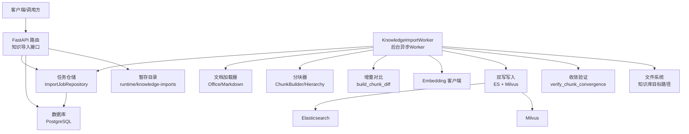
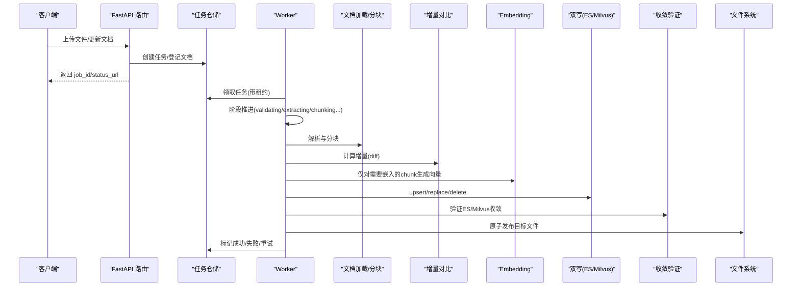
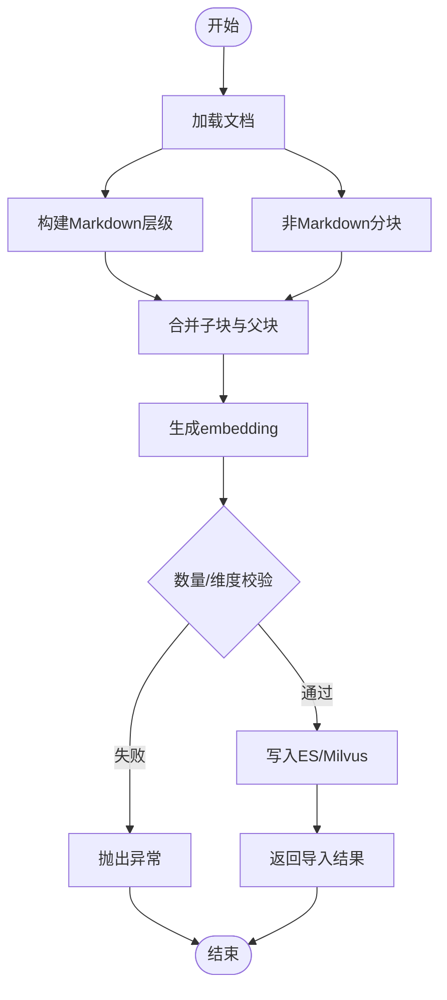
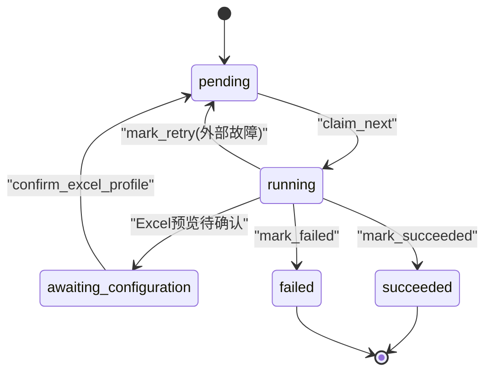
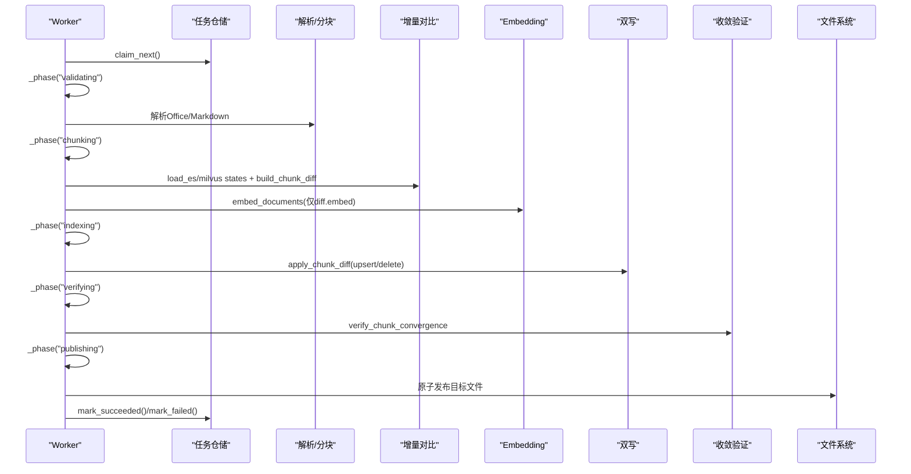
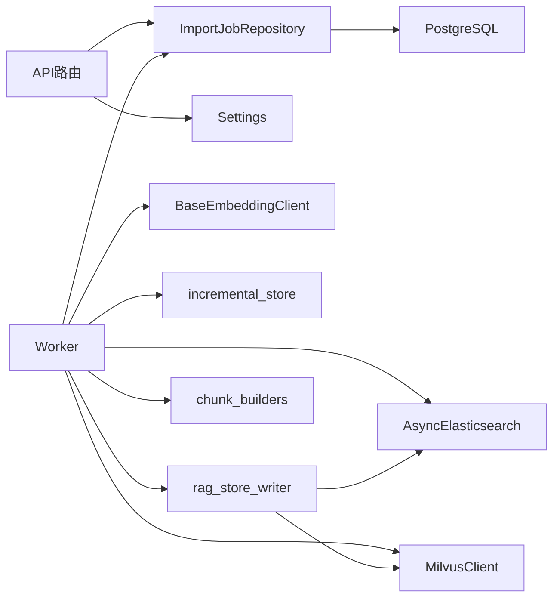

# 文档导入工作流

<cite>
**本文引用的文件**
- [markdown_ingestion_service.py](file://python-agent-study/src/fast_app/ingestion/markdown_ingestion_service.py)
- [import_jobs.py](file://python-agent-study/src/fast_app/ingestion/import_jobs.py)
- [worker.py](file://python-agent-study/src/fast_app/ingestion/worker.py)
- [knowledge_import_routes.py](file://python-agent-study/src/fast_app/api/knowledge_import_routes.py)
- [ingestion_tables.py](file://python-agent-study/src/fast_app/db/ingestion_tables.py)
- [chunk_builders.py](file://python-agent-study/src/fast_app/ingestion/processing/chunk_builders.py)
- [rag_store_writer.py](file://python-agent-study/src/fast_app/ingestion/stores/rag_store_writer.py)
- [incremental_store.py](file://python-agent-study/src/fast_app/ingestion/stores/incremental_store.py)
- [cli.py](file://python-agent-study/src/fast_app/ingestion/cli.py)
</cite>

## 目录
1. [简介](#简介)
2. [项目结构](#项目结构)
3. [核心组件](#核心组件)
4. [架构总览](#架构总览)
5. [详细组件分析](#详细组件分析)
6. [依赖关系分析](#依赖关系分析)
7. [性能与并发建议](#性能与并发建议)
8. [故障排查指南](#故障排查指南)
9. [结论](#结论)
10. [附录：使用示例与最佳实践](#附录使用示例与最佳实践)

## 简介
本文件面向“文档导入工作流”，围绕 MarkdownIngestionService 的完整链路（解析、分块、向量化、写入）以及 ImportJob 任务管理、Worker 异步处理、错误重试与失败恢复、增量导入机制、冲突解决、进度跟踪与状态管理进行系统化说明。同时提供启动导入任务、监控进度、处理异常、批量导入优化、并发控制与资源管理的工程化建议。

## 项目结构
导入系统由 API 层、任务仓储、Worker 执行器、处理流水线、存储写入与增量对比等模块组成，职责清晰、分层明确：
- API 层：接收上传、创建/更新导入任务、确认 Excel Profile、查询任务状态。
- 任务仓储：持久化任务、文档注册表、Excel Profile，并提供并发领取、租约续期、阶段推进、成功/失败标记。
- Worker：后台异步进程，按任务生命周期执行校验、解析、分块、增量对比、向量化、索引写入、收敛验证与文件发布。
- 处理流水线：Markdown/Office 文档加载、层级构建、分块策略、元数据标准化。
- 存储写入：Elasticsearch 与 Milvus 的双写、重建/覆盖/增量 upsert、删除与版本关闭。
- 增量对比：基于 ES/Milvus 现有 Chunk 状态计算最小差异集，避免重复 Embedding。
- CLI：本地 dry-run、validate、真实 ingest、重置存储等工具入口。

图表来源
- [knowledge_import_routes.py:207-311](file://python-agent-study/src/fast_app/api/knowledge_import_routes.py#L207-L311)
- [import_jobs.py:86-525](file://python-agent-study/src/fast_app/ingestion/import_jobs.py#L86-L525)
- [worker.py:94-419](file://python-agent-study/src/fast_app/ingestion/worker.py#L94-L419)
- [chunk_builders.py:79-188](file://python-agent-study/src/fast_app/ingestion/processing/chunk_builders.py#L79-L188)
- [rag_store_writer.py:219-724](file://python-agent-study/src/fast_app/ingestion/stores/rag_store_writer.py#L219-L724)
- [incremental_store.py:39-278](file://python-agent-study/src/fast_app/ingestion/stores/incremental_store.py#L39-L278)

章节来源
- [knowledge_import_routes.py:207-311](file://python-agent-study/src/fast_app/api/knowledge_import_routes.py#L207-L311)
- [import_jobs.py:86-525](file://python-agent-study/src/fast_app/ingestion/import_jobs.py#L86-L525)
- [worker.py:94-419](file://python-agent-study/src/fast_app/ingestion/worker.py#L94-L419)
- [chunk_builders.py:79-188](file://python-agent-study/src/fast_app/ingestion/processing/chunk_builders.py#L79-L188)
- [rag_store_writer.py:219-724](file://python-agent-study/src/fast_app/ingestion/stores/rag_store_writer.py#L219-L724)
- [incremental_store.py:39-278](file://python-agent-study/src/fast_app/ingestion/stores/incremental_store.py#L39-L278)

## 核心组件
- MarkdownIngestionService：Markdown 导入主编排服务，负责读取文档、构建层级、切分、生成 embedding、校验并统一写入 ES/Milvus。
- KnowledgeImportJobRepository：导入任务的持久化与并发控制，包括任务创建、领取、租约、阶段推进、成功/失败标记、Excel Profile 管理。
- KnowledgeImportWorker：后台 Worker，按阶段执行 Office 导入任务，支持增量对比、Embedding 复用、双写写入、收敛验证与原子文件发布。
- 分块与层级：MarkdownChunkBuilder、MarkdownHierarchyBuilder、TextSplitter，实现标题层级与文本滑动窗口切分。
- 存储写入：rag_store_writer 提供 recreate/upsert/replace_docs 三种模式，封装 ES bulk 与 Milvus upsert/delete。
- 增量导入：incremental_store 通过 ES/Milvus 现有状态计算差异，仅对新增/变更/修复项做 Embedding，减少开销。
- CLI：dry-run/validate/ingest/reset-stores，便于本地调试与运维。

章节来源
- [markdown_ingestion_service.py:21-165](file://python-agent-study/src/fast_app/ingestion/markdown_ingestion_service.py#L21-L165)
- [import_jobs.py:86-525](file://python-agent-study/src/fast_app/ingestion/import_jobs.py#L86-L525)
- [worker.py:94-419](file://python-agent-study/src/fast_app/ingestion/worker.py#L94-L419)
- [chunk_builders.py:79-188](file://python-agent-study/src/fast_app/ingestion/processing/chunk_builders.py#L79-L188)
- [rag_store_writer.py:82-724](file://python-agent-study/src/fast_app/ingestion/stores/rag_store_writer.py#L82-L724)
- [incremental_store.py:39-278](file://python-agent-study/src/fast_app/ingestion/stores/incremental_store.py#L39-L278)
- [cli.py:138-304](file://python-agent-study/src/fast_app/ingestion/cli.py#L138-L304)

## 架构总览
导入系统采用“API 触发 + 队列式 Worker”的异步架构：
- API 负责鉴权、权限校验、文件暂存、任务落库与返回任务 ID。
- Worker 以心跳+租约方式从数据库领取任务，按阶段推进，期间可暂停等待用户配置（如 Excel Profile）。
- 处理流程包含：校验、解析、分块、增量对比、Embedding、双写、收敛验证、文件发布、结果落库。
- 失败时根据错误类型选择重试或最终失败；崩溃恢复时可向前修复或回滚旧版。

图表来源
- [knowledge_import_routes.py:207-311](file://python-agent-study/src/fast_app/api/knowledge_import_routes.py#L207-L311)
- [worker.py:116-419](file://python-agent-study/src/fast_app/ingestion/worker.py#L116-L419)
- [incremental_store.py:103-200](file://python-agent-study/src/fast_app/ingestion/stores/incremental_store.py#L103-L200)
- [rag_store_writer.py:373-724](file://python-agent-study/src/fast_app/ingestion/stores/rag_store_writer.py#L373-L724)

## 详细组件分析

### MarkdownIngestionService 工作流程
- 读取文档：从配置的知识库目录加载 LoadedDocument。
- 构建层级与分块：对 Markdown 文档构建父子层级，对非 Markdown 文档走通用分块。
- 生成向量：按顺序为每个 chunk 生成 embedding，确保数量与维度一致。
- 写入存储：调用 write_rag_stores 统一写入 ES 与 Milvus，支持 recreate/upsert/replace_docs。
- 返回结果：汇总 document_count、chunk_count、parent_count、es_success_count、milvus_insert_result。

图表来源
- [markdown_ingestion_service.py:73-142](file://python-agent-study/src/fast_app/ingestion/markdown_ingestion_service.py#L73-L142)
- [chunk_builders.py:79-188](file://python-agent-study/src/fast_app/ingestion/processing/chunk_builders.py#L79-L188)
- [rag_store_writer.py:82-724](file://python-agent-study/src/fast_app/ingestion/stores/rag_store_writer.py#L82-L724)

章节来源
- [markdown_ingestion_service.py:21-165](file://python-agent-study/src/fast_app/ingestion/markdown_ingestion_service.py#L21-L165)

### ImportJob 任务管理机制
- 任务状态机：pending、running、awaiting_configuration、succeeded、failed。
- 并发领取：使用 SKIP LOCKED 与 with_for_update 保证多 Worker 不竞争同一任务。
- 租约与心跳：运行中任务设置 lease_expires_at，Worker 定期续租；过期后可被其他 Worker 回收。
- 阶段推进：set_phase 在持有租约时更新 phase，并延长租约。
- 成功/失败：mark_succeeded 同步更新任务、文档版本与 Excel Profile；mark_failed 清理草稿 Profile 与 pending 文档。
- 重试：mark_retry 将外部故障任务放回 pending，限制最大尝试次数。

图表来源
- [import_jobs.py:297-525](file://python-agent-study/src/fast_app/ingestion/import_jobs.py#L297-L525)
- [ingestion_tables.py:24-120](file://python-agent-study/src/fast_app/db/ingestion_tables.py#L24-L120)

章节来源
- [import_jobs.py:86-525](file://python-agent-study/src/fast_app/ingestion/import_jobs.py#L86-L525)
- [ingestion_tables.py:24-120](file://python-agent-study/src/fast_app/db/ingestion_tables.py#L24-L120)

### Worker 异步处理架构
- 领取与执行：run_once 获取一个任务，_run_claimed 在请求追踪上下文下执行。
- 阶段推进：_phase 在每个阶段切换前检查租约，失败则传播失租事件。
- 增量导入：并行加载 ES/Milvus 现有状态，计算 diff，仅对 embed 列表生成向量。
- 双写与验证：apply_chunk_diff 先 upsert 再删除已消失 chunk；verify_chunk_convergence 校验 ID/Hash/维度一致性。
- 文件发布：_publish_file 使用临时文件与 os.replace 实现原子替换；Create 独占写入。
- 恢复与修复：_recover_outputs 支持向前修复或回滚旧版；_repair_stores_from_file 全量重建双存储。

图表来源
- [worker.py:116-419](file://python-agent-study/src/fast_app/ingestion/worker.py#L116-L419)
- [incremental_store.py:103-200](file://python-agent-study/src/fast_app/ingestion/stores/incremental_store.py#L103-L200)
- [rag_store_writer.py:373-724](file://python-agent-study/src/fast_app/ingestion/stores/rag_store_writer.py#L373-L724)

章节来源
- [worker.py:94-419](file://python-agent-study/src/fast_app/ingestion/worker.py#L94-L419)

### 增量导入机制与冲突解决
- 增量对比：基于 content_hash 与 index_hash 判断是否 unchanged/metadata_only/changed/repaired/removed。
- 向量复用：metadata-only 更新且 Milvus 存在正确维度向量时，跳过 Embedding。
- 冲突检测：
  - 同名文档已有活动任务：find_active_target 阻止重复创建。
  - 更新任务 base_sha256 与当前文档 current_sha256 不一致：拒绝更新。
  - 目标文件版本变化：_assert_document_version 与 _publish_file 双重保护。
- 失败恢复：
  - 外部故障：有限退避后重试，超过最大次数标记 failed。
  - 崩溃恢复：若文件已提交则向前修复，否则回滚旧版；必要时保留 staging 供排查。

章节来源
- [incremental_store.py:103-174](file://python-agent-study/src/fast_app/ingestion/stores/incremental_store.py#L103-L174)
- [worker.py:468-723](file://python-agent-study/src/fast_app/ingestion/worker.py#L468-L723)
- [knowledge_import_routes.py:252-311](file://python-agent-study/src/fast_app/api/knowledge_import_routes.py#L252-L311)

### 进度跟踪与状态管理
- 任务状态：status 表示终态，phase 表示运行中细粒度阶段（queued、validating、extracting、chunking、loading_existing_chunks、diffing、embedding、indexing、verifying、publishing、completed）。
- 进度查询：API 暴露 /knowledge-documents/import-jobs/{job_id} 与列表接口，返回 status、phase、attempt_count、max_attempts、warnings、error_code 等。
- 审计与追踪：request_id、trace_id 贯穿创建与执行；LangSmith 追踪用于观测。

章节来源
- [knowledge_import_routes.py:382-427](file://python-agent-study/src/fast_app/api/knowledge_import_routes.py#L382-L427)
- [worker.py:156-187](file://python-agent-study/src/fast_app/ingestion/worker.py#L156-L187)
- [ingestion_tables.py:24-120](file://python-agent-study/src/fast_app/db/ingestion_tables.py#L24-L120)

## 依赖关系分析
- API 依赖：权限服务、用户上下文、任务仓储、Settings。
- Worker 依赖：数据库会话工厂、Embedding 客户端、ES/Milvus 客户端、增量对比与双写写入。
- 存储写入依赖：ES mapping/index、Milvus schema/index、批量操作与删除。
- 分块依赖：Markdown 层级构建、文本分割器、元数据模型。

图表来源
- [knowledge_import_routes.py:199-311](file://python-agent-study/src/fast_app/api/knowledge_import_routes.py#L199-L311)
- [worker.py:94-115](file://python-agent-study/src/fast_app/ingestion/worker.py#L94-L115)
- [import_jobs.py:86-158](file://python-agent-study/src/fast_app/ingestion/import_jobs.py#L86-L158)
- [rag_store_writer.py:219-724](file://python-agent-study/src/fast_app/ingestion/stores/rag_store_writer.py#L219-L724)

章节来源
- [knowledge_import_routes.py:199-311](file://python-agent-study/src/fast_app/api/knowledge_import_routes.py#L199-L311)
- [worker.py:94-115](file://python-agent-study/src/fast_app/ingestion/worker.py#L94-L115)
- [import_jobs.py:86-158](file://python-agent-study/src/fast_app/ingestion/import_jobs.py#L86-L158)
- [rag_store_writer.py:219-724](file://python-agent-study/src/fast_app/ingestion/stores/rag_store_writer.py#L219-L724)

## 性能与并发建议
- 并发控制：
  - Worker 数量：根据 CPU/内存与外部服务 QPS 调整；建议单实例多协程，多实例共享数据库队列。
  - 领取策略：SKIP LOCKED 避免行锁竞争；合理设置 LEASE_SECONDS 与 HEARTBEAT_SECONDS。
- 资源管理：
  - ES/Milvus 连接：CLI 显式 close；API/Worker 使用应用级单例连接。
  - 文件 IO：使用 xb 模式防止覆盖；Update 使用临时文件与 os.replace 原子替换。
- 性能优化：
  - 增量导入：优先 reuse 向量，减少 Embedding 调用。
  - 批量写入：ES async_bulk、Milvus upsert batch；避免逐条写入。
  - 分块策略：调整 max_chars、overlap_chars、max_tokens 平衡检索质量与写入量。
- 监控建议：
  - 记录 phase 与 attempt_count；观察 retry 频率与失败原因。
  - 使用 LangSmith 追踪关键步骤耗时与错误。
  - 监控 ES/Milvus 写入延迟与错误率。

[本节为通用指导，无需特定文件引用]

## 故障排查指南
- 常见错误：
  - 文件名非法/过大：ImportJobValidationError/ImportFileTooLargeError。
  - 目标冲突：ImportJobConflictError（同名任务/目标文件存在）。
  - 版本冲突：KnowledgeDocumentVersionConflictError（base_sha256/current_sha256 不一致）。
  - 解析失败：PermanentImportError(KNOWLEDGE_IMPORT_PARSE_FAILED)。
  - 分块校验失败：KNOWLEDGE_IMPORT_CHUNK_VALIDATION_FAILED。
  - 外部故障：KNOWLEDGE_IMPORT_EXTERNAL_FAILURE（有限重试）。
  - 回滚失败：KNOWLEDGE_IMPORT_ROLLBACK_FAILED（保留 staging 与旧文件）。
- 排查步骤：
  - 查看任务状态与 phase：GET /knowledge-documents/import-jobs/{job_id}。
  - 检查 warnings 与 error_code：定位具体阶段问题。
  - 核对 ES/Milvus 收敛：verify_chunk_convergence 失败通常意味着写入不完整。
  - 检查文件哈希：staged_path 与 target 的 sha256 是否一致。
  - 查看日志：knowledge_import.* 事件，尤其是 heartbeat_failed、lease_lost、rollback_failed。

章节来源
- [import_jobs.py:29-76](file://python-agent-study/src/fast_app/ingestion/import_jobs.py#L29-L76)
- [worker.py:201-266](file://python-agent-study/src/fast_app/ingestion/worker.py#L201-L266)
- [knowledge_import_routes.py:563-583](file://python-agent-study/src/fast_app/api/knowledge_import_routes.py#L563-L583)

## 结论
该导入工作流通过清晰的职责分离与健壮的状态机设计，实现了高可靠、可恢复、可观测的文档入库能力。MarkdownIngestionService 专注 Markdown 导入编排，ImportJob 与 Worker 协同完成 Office 导入的全生命周期管理。增量导入显著降低 Embedding 成本，双写与收敛验证保障数据一致性。结合 CLI 与 API，系统既适合本地调试也适合生产部署。

[本节为总结性内容，无需特定文件引用]

## 附录：使用示例与最佳实践

### 启动导入任务（API）
- 创建新文档：POST /knowledge-documents/import-jobs，携带 file、department_code。
- 更新现有文档：POST /knowledge-documents/{doc_id}/import-jobs，携带 file、expected_sha256、可选 reconfigure_excel_profile。
- 确认 Excel Profile：POST /knowledge-documents/import-jobs/{job_id}/excel-profile/confirm。
- 查询任务：GET /knowledge-documents/import-jobs/{job_id} 或列表 GET /knowledge-documents/import-jobs。

章节来源
- [knowledge_import_routes.py:207-311](file://python-agent-study/src/fast_app/api/knowledge_import_routes.py#L207-L311)
- [knowledge_import_routes.py:314-380](file://python-agent-study/src/fast_app/api/knowledge_import_routes.py#L314-L380)
- [knowledge_import_routes.py:382-427](file://python-agent-study/src/fast_app/api/knowledge_import_routes.py#L382-L427)

### 监控导入进度
- 轮询任务状态：关注 status、phase、attempt_count、max_attempts、warnings、error_code。
- 观察阶段推进：validating → extracting → chunking → loading_existing_chunks → diffing → embedding → indexing → verifying → publishing → completed。
- 失败处理：根据 error_code 分类处理，外部故障可重试，永久错误需人工介入。

章节来源
- [knowledge_import_routes.py:382-427](file://python-agent-study/src/fast_app/api/knowledge_import_routes.py#L382-L427)
- [worker.py:156-187](file://python-agent-study/src/fast_app/ingestion/worker.py#L156-L187)

### 处理导入异常
- 输入校验失败：修正文件名、部门编码、文件大小。
- 版本冲突：确保 expected_sha256 与当前文档一致。
- 外部故障：等待自动重试；超过最大次数后检查 ES/Milvus 连通性与配额。
- 回滚失败：保留 staging 与旧文件，检查日志定位具体问题。

章节来源
- [import_jobs.py:29-76](file://python-agent-study/src/fast_app/ingestion/import_jobs.py#L29-L76)
- [worker.py:201-266](file://python-agent-study/src/fast_app/ingestion/worker.py#L201-L266)

### 批量导入优化
- 使用增量导入：避免重复 Embedding，提升吞吐。
- 调整分块参数：根据检索效果与存储成本平衡 max_chars、overlap_chars、max_tokens。
- 批量写入：利用 ES async_bulk 与 Milvus upsert batch。
- 多 Worker：合理设置 Worker 数量与数据库连接池，避免过度竞争。

章节来源
- [incremental_store.py:103-200](file://python-agent-study/src/fast_app/ingestion/stores/incremental_store.py#L103-L200)
- [rag_store_writer.py:373-724](file://python-agent-study/src/fast_app/ingestion/stores/rag_store_writer.py#L373-L724)

### CLI 工具使用
- dry-run：验证读取与分块，不写入外部存储。
- validate：结构化回归检查，不调用 Embedding 与存储。
- ingest：真实写入 ES/Milvus，需显式 --yes。
- reset-stores：危险操作，重建 ES/Milvus 结构，需显式 --yes。

章节来源
- [cli.py:192-343](file://python-agent-study/src/fast_app/ingestion/cli.py#L192-L343)