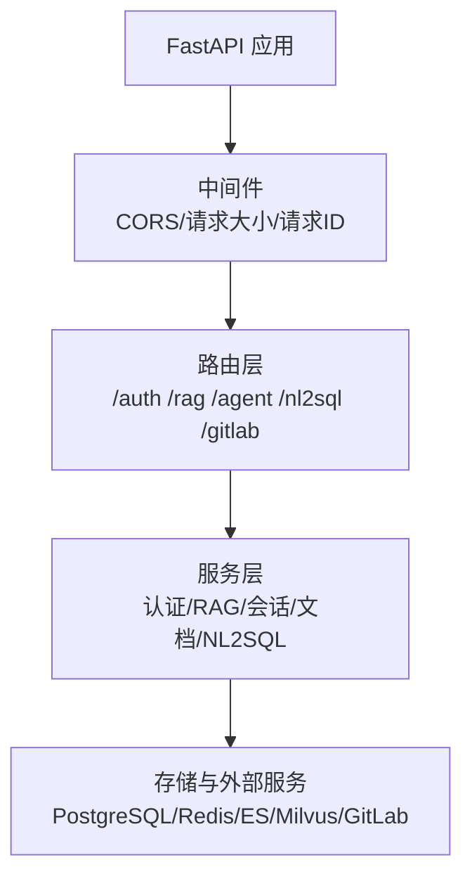
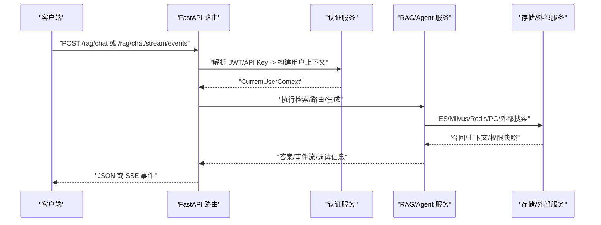
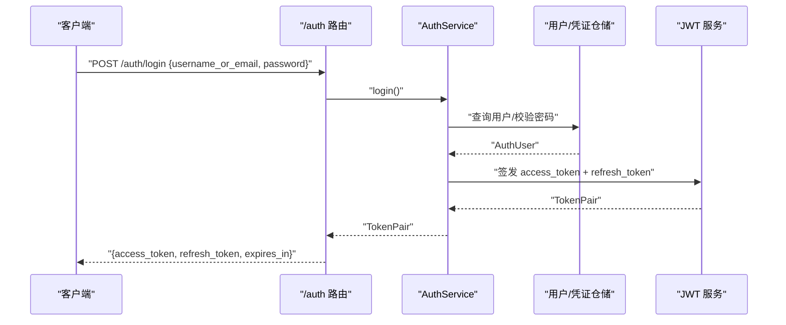
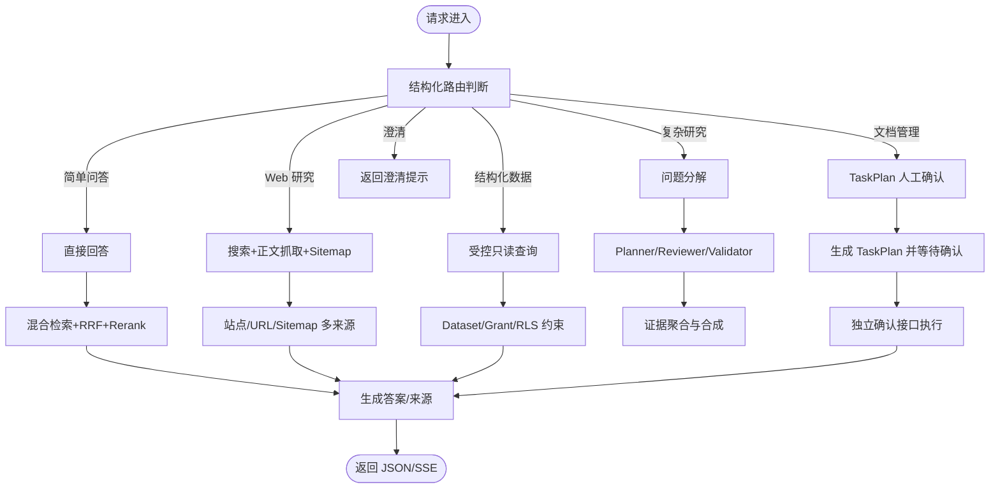
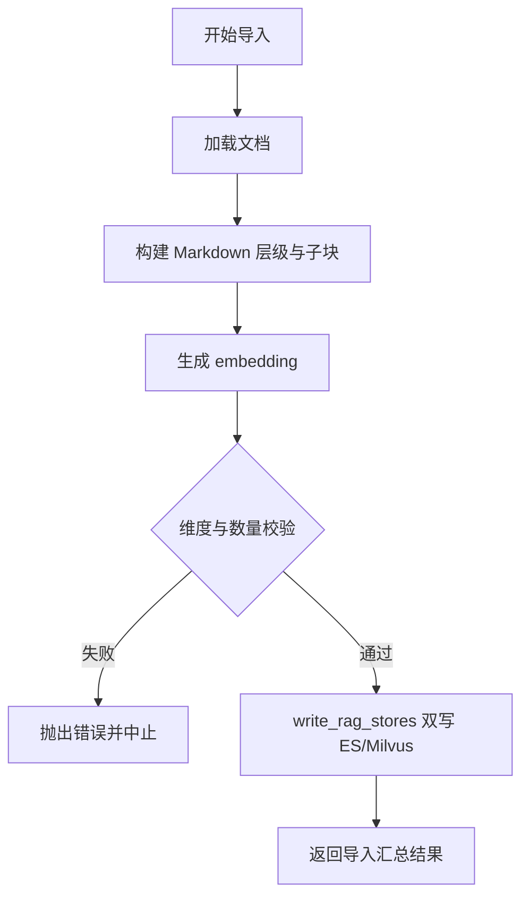
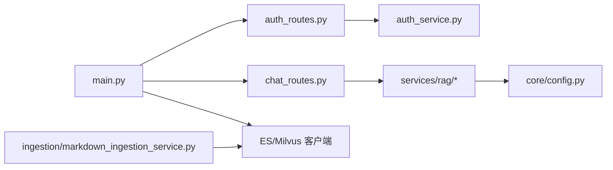

# 核心模块

<cite>
**本文引用的文件**
- [README.md](file://README.md)
- [main.py](file://src/fast_app/main.py)
- [config.py](file://src/fast_app/core/config.py)
- [conversation_models.py](file://src/fast_app/domain/conversation_models.py)
- [auth_models.py](file://src/fast_app/domain/auth_models.py)
- [auth_service.py](file://src/fast_app/services/auth/auth_service.py)
- [auth_routes.py](file://src/fast_app/api/auth_routes.py)
- [chat_routes.py](file://src/fast_app/api/chat_routes.py)
- [markdown_ingestion_service.py](file://src/fast_app/ingestion/markdown_ingestion_service.py)
</cite>

## 目录
1. [简介](#简介)
2. [项目结构](#项目结构)
3. [核心组件](#核心组件)
4. [架构总览](#架构总览)
5. [详细组件分析](#详细组件分析)
6. [依赖关系分析](#依赖关系分析)
7. [性能与可观测性](#性能与可观测性)
8. [故障排查指南](#故障排查指南)
9. [结论](#结论)
10. [附录：配置与使用模式](#附录：配置与使用模式)

## 简介
本项目是一个面向企业知识场景的后端系统，围绕 RAG 检索、Agent 工作流、对话管理、认证授权、文档处理等核心业务构建。系统通过 FastAPI 暴露统一入口，结合 LangGraph 显式图驱动 Agent 主线，支持结构化路由到简单 RAG、问题分解研究、知识文档管理、Web 检索和受控 NL2SQL 等能力；同时提供 SSE 结构化事件流、任务计划确认、权限审计与评测体系。

本仓库仅包含后端，React Web 前端是接口设计的目标消费者。多数高风险或外部集成功能默认关闭，需显式配置后启用。

**章节来源**
- [README.md:1-26](file://README.md#L1-L26)

## 项目结构
应用以 src/fast_app 为核心，按职责分层组织：
- api：FastAPI 路由、SSE 与 HTTP 边界
- graph：LangGraph RAG / Agent 状态、节点与 Graph Builder
- services：RAG、Agent 任务、认证、NL2SQL、会话、知识库等
- agents：工具、MCP 适配器、运行时策略与技能
- ingestion：Loader、父子 Chunk、metadata 与 ES/Milvus 写入
- integrations/gitlab：GitLab API、Webhook、同步、Worker 与 MR
- evaluation：RAG 离线评测
- db：SQLAlchemy 表、Session 与持久化边界
- core：Settings、日志、异常、LangSmith 与请求上下文
- schemas：FastAPI / OpenAPI 公共模型

启动时通过 lifespan 创建并缓存外部客户端（Milvus、Elasticsearch、httpx、Redis）、数据库引擎与 DatasetRegistry，并在关闭时释放资源。

**图表来源**
- [main.py:132-169](file://src/fast_app/main.py#L132-L169)

**章节来源**
- [README.md:99-124](file://README.md#L99-L124)
- [main.py:40-129](file://src/fast_app/main.py#L40-L129)

## 核心组件
- 配置中心：集中管理所有环境变量与默认值，包括 RAG、Agent、记忆、NL2SQL、Ingestion、外部调用超时与重试等。
- 认证授权：JWT + API Key 双通道，RBAC 全局权限与部门 ACL，用户上下文注入。
- 对话管理：多轮会话消息、短期窗口（内存/Redis）、历史摘要、查询改写。
- RAG 检索：向量+关键词混合检索、RRF、rerank、父块扩展、Prompt Guard。
- Agent 工作流：结构化路由、Research Planner/Reviewer/Validator、TaskPlan 人工确认、Deep Document 多角色协作。
- 文档处理：Markdown/Office 导入、父子 Chunk、ES/Milvus 双写、版本发布与 GitLab 集成。

**章节来源**
- [config.py:18-797](file://src/fast_app/core/config.py#L18-L797)
- [README.md:29-67](file://README.md#L29-L67)

## 架构总览
系统以 FastAPI 为入口，中间件负责 CORS、请求体大小限制与请求 ID；lifespan 初始化外部客户端与数据库连接；路由分发到各服务；服务组合检索、Agent、权限、会话与存储；最终通过 JSON 或 SSE 返回结构化结果。

**图表来源**
- [main.py:132-169](file://src/fast_app/main.py#L132-L169)
- [auth_routes.py:22-53](file://src/fast_app/api/auth_routes.py#L22-L53)
- [chat_routes.py:13-32](file://src/fast_app/api/chat_routes.py#L13-L32)

## 详细组件分析

### 认证与授权模块
职责边界
- 认证：用户名/邮箱+密码登录、refresh token 轮换、API Key 校验、JWT 解码。
- 授权：基于 RBAC 的全局权限快照与部门 ACL；将用户与权限合并为 CurrentUserContext。
- 安全：密码哈希、API Key 指纹与过期检查、禁用账号拒绝访问。

核心类与方法
- AuthService：login、refresh、authenticate_api_key、authenticate_jwt、create_api_key、list_api_keys、revoke_api_key、build_current_user_context。
- 领域模型：AuthUser、ApiKeyCredential、RefreshTokenRecord、JwtTokenPair、Department、UserDepartment、TokenSubject。

交互流程
- 登录：验证凭据 -> 更新最后登录时间 -> 签发 access_token 与 refresh_token。
- 刷新：校验 refresh token -> 标记已用并撤销旧凭证 -> 签发新 token pair。
- API Key：指纹匹配 -> 哈希校验 -> 状态与过期检查 -> 构建用户上下文。
- JWT：解码 subject -> 查找用户 -> 状态检查 -> 构建用户上下文。

**图表来源**
- [auth_routes.py:22-33](file://src/fast_app/api/auth_routes.py#L22-L33)
- [auth_service.py:75-90](file://src/fast_app/services/auth/auth_service.py#L75-L90)

最佳实践
- 生产环境必须开启 AUTH_ENABLED，并配置强密钥与合理过期策略。
- 对敏感字段（如 query、filters、user_id）默认不上传 LangSmith trace。
- 使用 require_permission 在关键操作前进行权限校验。

**章节来源**
- [auth_service.py:35-327](file://src/fast_app/services/auth/auth_service.py#L35-L327)
- [auth_models.py:9-158](file://src/fast_app/domain/auth_models.py#L9-L158)
- [auth_routes.py:22-112](file://src/fast_app/api/auth_routes.py#L22-L112)

### 对话管理模块
职责边界
- 会话容器：Conversation、ConversationMessage、ConversationSummary。
- 短期记忆：内存或 Redis 最近消息窗口，TTL 控制。
- 长期记忆：可选 PostgreSQL ConversationSummary，压缩窗口外历史。
- 查询改写：根据上下文优化后续检索。

数据结构
- Conversation：会话 ID、用户 ID、创建/更新时间、元数据。
- ConversationMessage：消息 ID、会话 ID、角色、内容、时间戳、元数据。
- ConversationSummary：自然语言摘要、结构化摘要、版本、覆盖范围、源消息 ID。

使用模式
- 每次请求携带 session_id，服务加载最近 N 轮作为有界上下文。
- 超过阈值触发摘要生成，保留可追溯的 source_message_ids。
- 可选启用 query_rewrite 提升检索质量。

**章节来源**
- [conversation_models.py:8-129](file://src/fast_app/domain/conversation_models.py#L8-L129)
- [config.py:457-518](file://src/fast_app/core/config.py#L457-L518)

### RAG 检索与 Agent 工作流
职责边界
- 检索：向量（Milvus）+ 关键词（Elasticsearch），RRF 融合，rerank，父块扩展。
- Agent：结构化路由到 simple_rag、question_decomposition、knowledge_document_management、web_research、structured_data_query、clarification_required。
- 工作流：Planner/Reviewer/Validator、并行 Research Worker、TaskPlan 人工确认、Deep Document 多角色协作。

关键流程
- 路由：Router 判断意图，不生成可信路径、文档 ID、SQL 权限或 Tool 参数。
- 检索：混合召回 -> RRF -> rerank -> 父块扩展（可选）。
- 生成：Prompt Guard 输入/输出保护，结构化输出经服务端 Validator。
- 流式：stream_events 为主，兼容旧 stream token 接口。

**图表来源**
- [README.md:29-67](file://README.md#L29-L67)
- [config.py:285-455](file://src/fast_app/core/config.py#L285-L455)

最佳实践
- Router 仅做意图判断，不承载权限与参数构造。
- 高风险文档操作先生成 TaskPlan，再独立确认接口执行，重新校验权限与资源状态。
- Prompt Guard 默认开启，建议在生产保持规则检测与上下文隔离。

**章节来源**
- [README.md:29-67](file://README.md#L29-L67)
- [config.py:177-228](file://src/fast_app/core/config.py#L177-L228)

### 文档处理与入库模块
职责边界
- 文档加载：支持 Markdown 与 Office（PPTX/XLSX）异步导入。
- 切分与层级：父子 Chunk 构建，稳定 chunk_id/metadata。
- 向量化与写入：embedding 生成，ES/Milvus 双写，写入模式（recreate/upsert/replace_docs）。
- 发布与同步：版本化发布，GitLab 变更分支与 Merge Request。

处理流程
- 读取知识库目录 -> 构建层级与子块 -> 生成 embedding -> 维度与数量校验 -> 统一写入 ES/Milvus -> 汇总结果。

**图表来源**
- [markdown_ingestion_service.py:32-165](file://src/fast_app/ingestion/markdown_ingestion_service.py#L32-L165)

最佳实践
- 先重建 v2 索引后再开启父块扩展。
- 严格设置 max_content_chars、max_total_draft_chars 等预算，避免长上下文溢出。
- 生产环境关闭 dry-run-only，并通过 TaskPlan 确认接口放开真实写入。

**章节来源**
- [markdown_ingestion_service.py:32-165](file://src/fast_app/ingestion/markdown_ingestion_service.py#L32-L165)
- [config.py:637-797](file://src/fast_app/core/config.py#L637-L797)

## 依赖关系分析
- main.py 在 lifespan 中创建并缓存 Milvus、Elasticsearch、httpx、Redis、数据库引擎与 DatasetRegistry，供各服务复用。
- 路由层依赖服务层：/auth 依赖 AuthService，/chat 依赖聊天服务，/rag 依赖 RAG/Agent 服务。
- 服务层依赖领域模型与配置：认证依赖 AuthUser、ApiKeyCredential 等；RAG 依赖 Settings 中的检索与 Agent 配置。
- 文档入库依赖 EmbeddingClient、ES/Milvus 客户端与写入器。

**图表来源**
- [main.py:132-169](file://src/fast_app/main.py#L132-L169)
- [auth_routes.py:22-112](file://src/fast_app/api/auth_routes.py#L22-L112)
- [chat_routes.py:13-32](file://src/fast_app/api/chat_routes.py#L13-L32)
- [markdown_ingestion_service.py:32-165](file://src/fast_app/ingestion/markdown_ingestion_service.py#L32-L165)

**章节来源**
- [main.py:40-129](file://src/fast_app/main.py#L40-L129)
- [config.py:18-797](file://src/fast_app/core/config.py#L18-L797)

## 性能与可观测性
- 慢请求阈值：HTTP、RAG Pipeline、检索、rerank、LLM 均可配置阈值用于告警。
- 超时与重试：外部调用最大重试次数、基础延迟、各组件超时秒数。
- 并发与预算：Agent 最大步数、工具调用次数、并行度、Research 子问题与 Worker 超时。
- 观测：LangSmith tracing、debug trace、request/trace ID、结构化错误。

建议
- 生产环境调整 slow_*_threshold_ms 与实际 SLA 对齐。
- 合理设置 agent_max_steps、agent_max_tool_calls、agent_research_worker_timeout_seconds 防止无限循环与资源耗尽。
- 开启 LANGSMITH_TRACING 并过滤敏感字段，便于追踪与回归。

**章节来源**
- [config.py:33-52](file://src/fast_app/core/config.py#L33-L52)
- [config.py:620-634](file://src/fast_app/core/config.py#L620-L634)
- [config.py:287-455](file://src/fast_app/core/config.py#L287-L455)

## 故障排查指南
常见问题
- 认证失败：检查 AUTH_ENABLED、JWT_SECRET_KEY、API Key 状态与过期时间。
- 检索为空：确认 ES/Milvus 索引/collection 存在且数据已写入；检查 mode、top_k、min_score。
- 流式无事件：确保走 /rag/chat/stream/events；旧 /rag/chat/stream 仅兼容 token 流。
- 文档导入失败：核对 embedding 维度与 settings.embedding_dim 一致；检查写入模式与权限。

定位步骤
- 查看 request/trace ID 与结构化错误响应。
- 使用 /debug/rag/trace 获取内部 RAG 调试信息（需 token 保护）。
- 检查日志中的慢请求阈值与组件超时。

**章节来源**
- [README.md:241-260](file://README.md#L241-L260)
- [config.py:177-228](file://src/fast_app/core/config.py#L177-L228)

## 结论
本系统以 FastAPI 为统一入口，通过配置中心与中间件实现可扩展、可观测、可授权的 Agent 后端。RAG 检索、Agent 工作流、对话管理、认证授权与文档处理模块职责清晰、边界明确，配合结构化路由、任务计划确认与评测体系，满足企业级知识场景需求。生产部署应严格启用认证、限制高风险能力、合理配置超时与预算，并借助观测工具持续优化。

## 附录：配置与使用模式
- 最小本地环境：classic provider + mock retriever，无需外部服务即可启动。
- 主接口：/rag/chat（非流式）、/rag/chat/stream/events（结构化 SSE）。
- 关键开关：RAG_PIPELINE_PROVIDER、AUTH_ENABLED、PROMPT_GUARD_ENABLED、MEMORY_STORE_PROVIDER、SUMMARY_MEMORY_ENABLED、AGENT_DOCUMENT_TOOLS_ENABLED、NL2SQL_ENABLED、GITLAB_INTEGRATION_ENABLED、LANGSMITH_TRACING、DEBUG_TRACE_ENABLED。
- 启动命令：uvicorn fast_app.main:app --reload；健康检查 GET /health。

**章节来源**
- [README.md:126-193](file://README.md#L126-L193)
- [README.md:241-260](file://README.md#L241-L260)
- [config.py:18-797](file://src/fast_app/core/config.py#L18-L797)