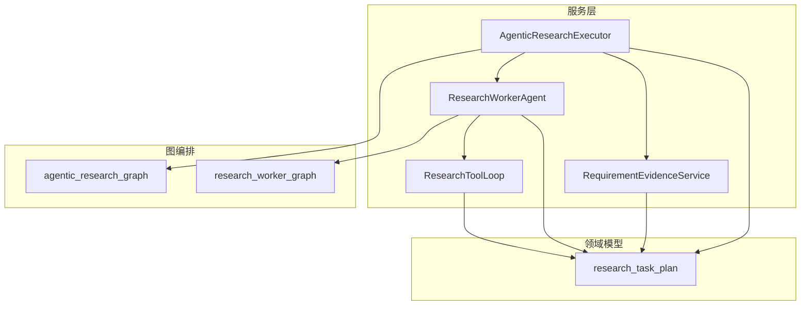
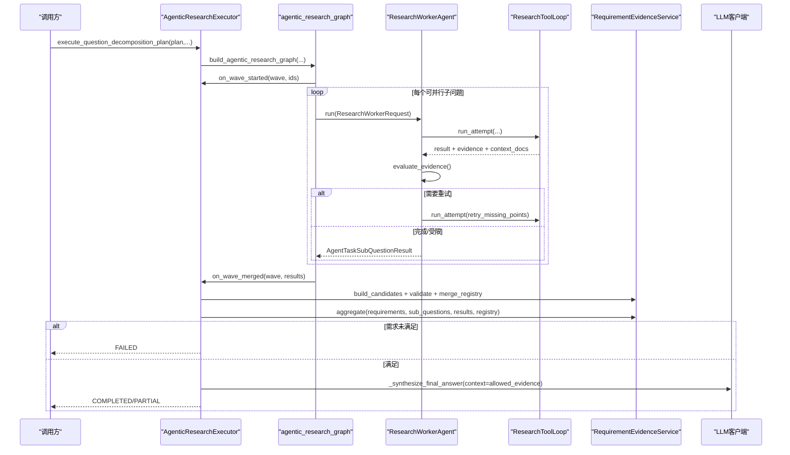
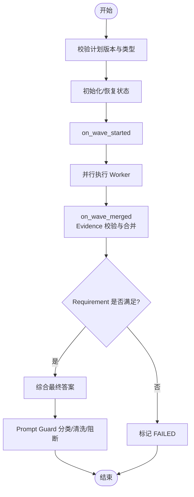
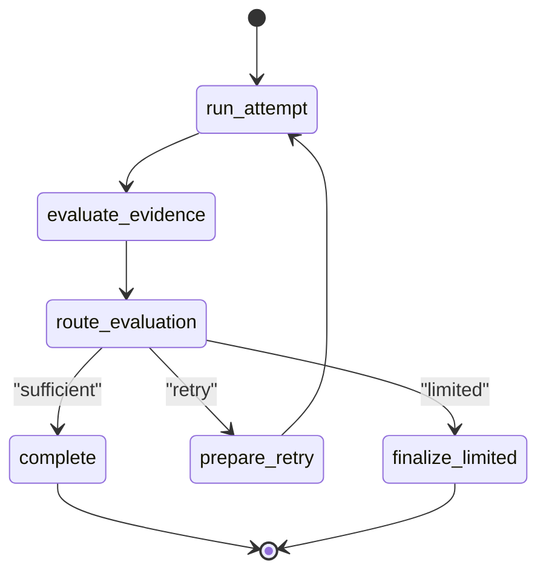
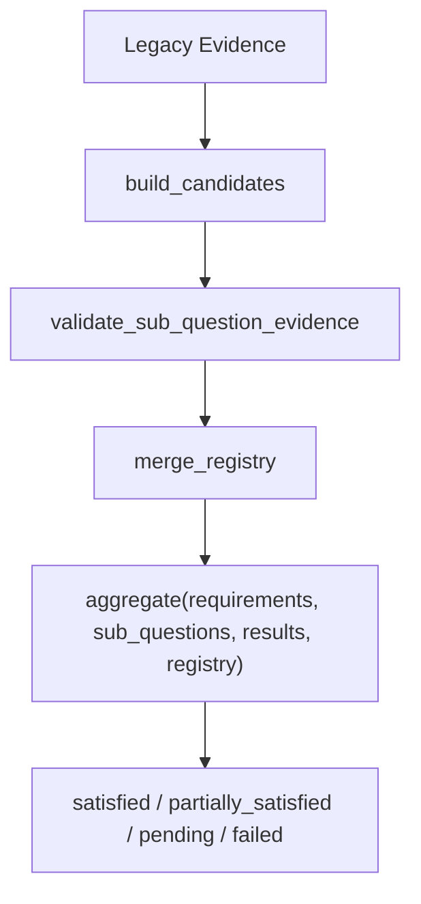
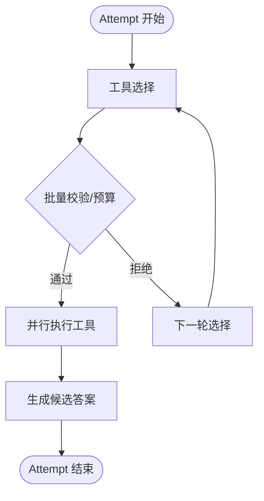
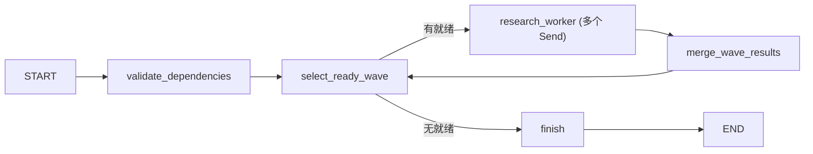
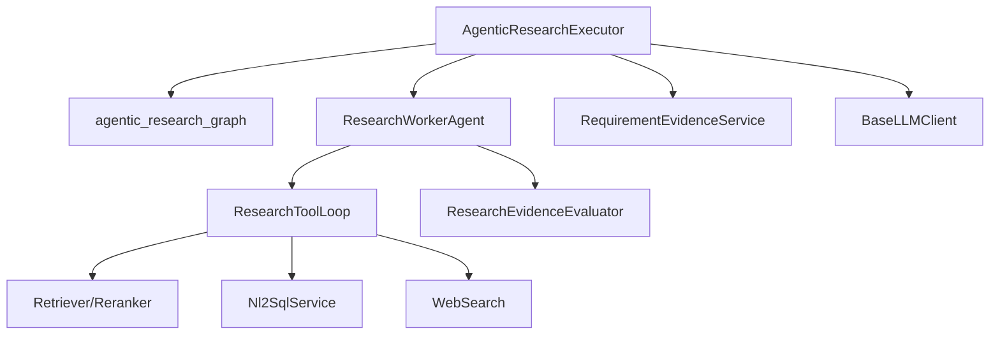

# 研究执行引擎

<cite>
**本文引用的文件**
- [agentic_research_executor.py](file://src/fast_app/services/research/agentic_research_executor.py)
- [research_worker_agent.py](file://src/fast_app/services/research/research_worker_agent.py)
- [requirement_evidence_service.py](file://src/fast_app/services/research/requirement_evidence_service.py)
- [research_task_plan.py](file://src/fast_app/domain/research_task_plan.py)
- [agentic_research_graph.py](file://src/fast_app/graph/research/agentic_research_graph.py)
- [research_worker_graph.py](file://src/fast_app/graph/research/research_worker_graph.py)
- [research_tool_loop.py](file://src/fast_app/services/research/research_tool_loop.py)
</cite>

## 目录
1. [简介](#简介)
2. [项目结构](#项目结构)
3. [核心组件](#核心组件)
4. [架构总览](#架构总览)
5. [详细组件分析](#详细组件分析)
6. [依赖关系分析](#依赖关系分析)
7. [性能与资源管理](#性能与资源管理)
8. [故障排查指南](#故障排查指南)
9. [结论](#结论)
10. [附录：使用示例与最佳实践](#附录使用示例与最佳实践)

## 简介
本文件面向“Agentic Research”研究执行引擎，系统性说明其工作流程、证据收集与分析机制、以及研究任务编排。重点解释以下核心组件的实现原理与协作方式：
- AgenticResearchExecutor：按依赖波次调度 Worker，合并证据并生成最终答案。
- ResearchWorkerAgent：封装单个子问题的工具调用、证据评估与有限纠正循环。
- RequirementEvidenceService：将旧版 Evidence 摘要转换为稳定 Typed Evidence，校验来源与契约，并按 Requirement 聚合状态。
- 研究图（LangGraph）：负责依赖验证、波次选择、并行派发与结果合并。
- 工具循环（ResearchToolLoop）：实现一次 attempt 的工具选择、并行执行、答案生成与上下文组装。

该引擎支持多步骤研究任务的分解、并行执行、证据评估和结论生成；提供进度事件、检查点持久化、错误恢复与输出安全控制。

## 项目结构
围绕研究执行的核心代码分布在 services、graph、domain 三个层次：
- services/research：执行器、Worker Agent、证据服务、工具循环等运行时逻辑。
- graph/research：基于 LangGraph 的依赖波次调度图和 Worker 内部状态机图。
- domain：TaskPlan v2 的数据模型、证据类型、Requirement 契约、进度与检查点模型。

图表来源
- [agentic_research_executor.py:57-118](file://src/fast_app/services/research/agentic_research_executor.py#L57-L118)
- [research_worker_agent.py:61-121](file://src/fast_app/services/research/research_worker_agent.py#L61-L121)
- [requirement_evidence_service.py:41-183](file://src/fast_app/services/research/requirement_evidence_service.py#L41-L183)
- [research_tool_loop.py:172-245](file://src/fast_app/services/research/research_tool_loop.py#L172-L245)
- [agentic_research_graph.py:111-276](file://src/fast_app/graph/research/agentic_research_graph.py#L111-L276)
- [research_worker_graph.py:45-79](file://src/fast_app/graph/research/research_worker_graph.py#L45-L79)
- [research_task_plan.py:787-800](file://src/fast_app/domain/research_task_plan.py#L787-L800)

章节来源
- [agentic_research_executor.py:57-118](file://src/fast_app/services/research/agentic_research_executor.py#L57-L118)
- [research_task_plan.py:787-800](file://src/fast_app/domain/research_task_plan.py#L787-L800)

## 核心组件
- AgenticResearchExecutor
  - 职责：接收 ResearchTaskPlan v2，按依赖波次调度 Worker，维护证据注册表与进度快照，最终综合生成答案并通过 Prompt Guard 输出安全控制。
  - 关键能力：
    - 波次回调：on_wave_started/on_wave_merged 更新 TaskPlan 快照与 SSE 进度。
    - 证据合并：通过 RequirementEvidenceService 将 Worker 返回的 legacy evidence 转为 Typed Evidence，校验来源与契约后幂等写入 Registry。
    - 终止条件：取消检测、超时处理、Requirement 未满足时标记失败。
    - 最终综合：仅允许使用满足契约的证据参与最终答案生成。
- ResearchWorkerAgent
  - 职责：为单个 SubQuestion 构建独立 LangGraph 状态机，驱动工具循环、证据评估与有限纠正。
  - 关键能力：
    - run_attempt：调用 ResearchToolLoop，累积 tool_calls/evidence/context_doc_groups。
    - evaluate_evidence：调用 ResearchEvidenceEvaluator，根据 verdict/confidence/recommended_action 决定 complete/retry/limited。
    - retry 准备：注入 missing_points，必要时强制 Web fallback。
    - 完成/受限：产出最终 AgentTaskSubQuestionResult。
- RequirementEvidenceService
  - 职责：Evidence 转换、校验与 Requirement 级聚合。
  - 关键能力：
    - build_candidates：把 legacy evidence 映射到 knowledge_chunk/web_citation/sql_query_result/derived_synthesis。
    - validate_sub_question_evidence：校验 sub_question 归属、依赖完整性、真实 Tool provenance。
    - merge_registry：幂等合并 Evidence，冲突即报错。
    - aggregate：按 Requirement 计算 satisfied/partially_satisfied/pending/failed，并限制仅 completed 贡献 strict/full。
- ResearchToolLoop
  - 职责：一次 attempt 的工具选择、并行执行、答案生成。
  - 关键能力：
    - 工具白名单与并行安全策略：knowledge_retrieval/web_search/nl2sql_query/mcp__fetch。
    - 结构化输出兼容：原生 ToolCall 或 JSON fallback。
    - 上下文组装：去重合并 context_doc_groups，生成候选答案。
    - 检查点上报：tool_selection/tool_execution/answer_generation 阶段事件。
- 研究图（LangGraph）
  - agentic_research_graph：依赖校验、波次选择、Send 扇出、结果合并。
  - research_worker_graph：run_attempt → evaluate_evidence → route_evaluation → prepare_retry/complete/finalize_limited。

章节来源
- [agentic_research_executor.py:86-519](file://src/fast_app/services/research/agentic_research_executor.py#L86-L519)
- [research_worker_agent.py:83-464](file://src/fast_app/services/research/research_worker_agent.py#L83-L464)
- [requirement_evidence_service.py:44-348](file://src/fast_app/services/research/requirement_evidence_service.py#L44-L348)
- [research_tool_loop.py:219-626](file://src/fast_app/services/research/research_tool_loop.py#L219-L626)
- [agentic_research_graph.py:56-276](file://src/fast_app/graph/research/agentic_research_graph.py#L56-L276)
- [research_worker_graph.py:18-79](file://src/fast_app/graph/research/research_worker_graph.py#L18-L79)

## 架构总览
下图展示了从 Executor 到 Worker、工具循环、证据服务与最终综合的整体流程。

图表来源
- [agentic_research_executor.py:86-519](file://src/fast_app/services/research/agentic_research_executor.py#L86-L519)
- [agentic_research_graph.py:111-276](file://src/fast_app/graph/research/agentic_research_graph.py#L111-L276)
- [research_worker_agent.py:83-464](file://src/fast_app/services/research/research_worker_agent.py#L83-L464)
- [research_tool_loop.py:219-626](file://src/fast_app/services/research/research_tool_loop.py#L219-L626)
- [requirement_evidence_service.py:44-348](file://src/fast_app/services/research/requirement_evidence_service.py#L44-L348)

## 详细组件分析

### AgenticResearchExecutor：波次调度、证据单写者与最终综合
- 输入校验与初始化
  - 仅接受 schema_version=2 且 task_kind="question_decomposition" 的计划。
  - 清理历史结果与证据注册表（非 resume），保留已完成项。
- 进度与检查点
  - append_progress_event：追加 ResearchProgressEvent 并持久化。
  - save_worker_checkpoint：合并 checkpoint 中的 tool_calls/evidence，更新 active_operations，上报运行中进度。
  - mark_worker_timed_out：超时记录 WORKER_TIMEOUT 并回退为 legacy result。
- 波次回调
  - on_wave_started：设置 current_wave，更新 worker 状态为 running。
  - on_wave_merged：对每个结果调用 RequirementEvidenceService.build_candidates/validate/merge_registry，并聚合 requirement 状态。
- 工作器执行
  - derived synthesis：当 information_source_hint="none" 且存在 depends_on，直接基于依赖结果合成。
  - 普通 Worker：构造 AgentResearchPolicy，传入 filters/web_policy/dataset_id/nl2sql_action，调用 ResearchWorkerAgent.run，带超时保护。
- 终止与最终答案
  - 若 Requirement 有 failed/pending，则标记 FAILED。
  - 否则综合 allowed_evidence 生成最终答案，经 Prompt Guard 分类/清洗/阻断，写入 final_output。

图表来源
- [agentic_research_executor.py:86-519](file://src/fast_app/services/research/agentic_research_executor.py#L86-L519)

章节来源
- [agentic_research_executor.py:86-519](file://src/fast_app/services/research/agentic_research_executor.py#L86-L519)

### ResearchWorkerAgent：子问题研究与纠正循环
- 状态机
  - run_attempt：调用 ResearchToolLoop，累积 tool_calls/evidence/context_doc_groups。
  - evaluate_evidence：调用 ResearchEvidenceEvaluator，记录 evaluation/attempts。
  - route_evaluation：根据 verdict/confidence/recommended_action 决定 complete/retry/limited。
  - prepare_retry：增加 attempt，注入 missing_points，必要时 force_web。
  - complete/finalize_limited：产出最终结果。
- 配置与追踪
  - 通过 langchain_config_factory 为每次 attempt 与工具调用生成唯一 trace 名称。
  - 通过 on_checkpoint/on_progress 上报阶段与进度事件。

图表来源
- [research_worker_graph.py:45-79](file://src/fast_app/graph/research/research_worker_graph.py#L45-L79)
- [research_worker_agent.py:83-464](file://src/fast_app/services/research/research_worker_agent.py#L83-L464)

章节来源
- [research_worker_agent.py:83-464](file://src/fast_app/services/research/research_worker_agent.py#L83-L464)

### RequirementEvidenceService：证据契约与聚合
- 证据转换
  - knowledge_retrieval → knowledge_chunk
  - web_search → web_citation（携带 URL）
  - nl2sql_query → sql_query_result（携带 query_id/provided_attributes）
  - derived_synthesis：当 SubQuestion 无外部来源且有依赖时生成派生证据。
- 证据校验
  - 归属校验：evidence.sub_question_id 必须匹配。
  - 派生证据依赖校验：dependency_sub_question_ids 必须等于 SubQuestion.depends_on 且全部 completed。
  - 来源真实性：source_type 必须来自 successful_tool_calls 映射。
- 注册表合并
  - 幂等合并，同 ID 不同内容视为损坏并报错。
- Requirement 聚合
  - 仅 completed 贡献 strict/full satisfaction。
  - partially_satisfied 开放当前合法部分证据，并在最终答案中说明限制。
  - security_blocked 会阻止 partial 满足。

图表来源
- [requirement_evidence_service.py:44-348](file://src/fast_app/services/research/requirement_evidence_service.py#L44-L348)

章节来源
- [requirement_evidence_service.py:44-348](file://src/fast_app/services/research/requirement_evidence_service.py#L44-L348)

### ResearchToolLoop：一次 Attempt 的工具循环
- 工具选择
  - 优先原生 ToolCall，其次 JSON fallback，最后信息源提示兜底。
  - 首轮若 SubQuestion 明确需要 Web，且可用，则强制 web_search。
  - URL 场景强制 mcp__fetch，避免误用检索工具。
- 并行执行
  - 只读工具并行安全集合：knowledge_retrieval/web_search/nl2sql_query/mcp__fetch。
  - 批量校验与预算控制：拒绝非法批次，按顺序保留前 N 个以利用剩余调用。
- 答案生成
  - 所有工具完成后，合并 context_doc_groups，生成候选答案。
  - 若无可用证据，走纯推理分支，仅依赖 dependency_results。
- 检查点
  - tool_setup/tool_selection/tool_execution/answer_generation 各阶段上报。

图表来源
- [research_tool_loop.py:219-626](file://src/fast_app/services/research/research_tool_loop.py#L219-L626)

章节来源
- [research_tool_loop.py:219-626](file://src/fast_app/services/research/research_tool_loop.py#L219-L626)

### 研究图：依赖波次与并发
- validate_dependencies：拒绝重复/缺失/循环依赖。
- select_ready_wave：根据已完成结果选择下一批可并行子问题，支持级联跳过。
- dispatch_wave：为每个子问题 Send 独立的 ResearchWorkerState。
- merge_wave_results：收集当前波次结果，排序后交给 on_wave_merged。

图表来源
- [agentic_research_graph.py:56-276](file://src/fast_app/graph/research/agentic_research_graph.py#L56-L276)

章节来源
- [agentic_research_graph.py:56-276](file://src/fast_app/graph/research/agentic_research_graph.py#L56-L276)

## 依赖关系分析
- 组件耦合
  - Executor 依赖图进行波次调度，依赖 Worker Agent 执行子问题，依赖证据服务进行证据校验与聚合。
  - Worker Agent 依赖工具循环与评估器，通过检查点回调与 Executor 共享进度。
  - 工具循环依赖检索器、重排器、NL2SQL、Web 搜索等外部能力，但通过白名单与权限控制隔离。
- 外部依赖
  - LLM 客户端：用于工具选择、答案生成、最终综合。
  - 检索与重排：知识库向量/关键词检索与文档重排。
  - NL2SQL：绑定 Dataset 的结构化查询。
  - Web 搜索：公开互联网检索。
- 潜在风险
  - 循环依赖：由 validate_research_dependencies 提前拒绝。
  - 并发竞争：通过 StateGraph reducer 与锁（snapshot_lock）保证幂等与一致性。
  - 权限越界：工具白名单与权限拒绝异常（ToolPermissionDeniedError）向上抛出，不降级。

图表来源
- [agentic_research_executor.py:57-118](file://src/fast_app/services/research/agentic_research_executor.py#L57-L118)
- [research_worker_agent.py:61-121](file://src/fast_app/services/research/research_worker_agent.py#L61-L121)
- [research_tool_loop.py:172-245](file://src/fast_app/services/research/research_tool_loop.py#L172-L245)

章节来源
- [agentic_research_executor.py:57-118](file://src/fast_app/services/research/agentic_research_executor.py#L57-L118)
- [research_worker_agent.py:61-121](file://src/fast_app/services/research/research_worker_agent.py#L61-L121)
- [research_tool_loop.py:172-245](file://src/fast_app/services/research/research_tool_loop.py#L172-L245)

## 性能与资源管理
- 并发控制
  - max_parallel_workers：限制每波次最大并行 Worker 数。
  - agent_max_parallel_tool_calls：限制单次 attempt 内工具并行度。
  - agent_max_tool_calls：全局工具调用预算，防止无限循环。
- 超时与重试
  - worker_timeout_seconds：单个 Worker 超时保护，超时记录 WORKER_TIMEOUT。
  - max_correction_rounds：限制纠正轮次数，避免过度重试。
- 证据与上下文
  - context_doc_groups 仅在 Worker 内存流转，不进入 TaskPlan 持久化，降低存储压力。
  - Evidence 幂等合并，避免重复与冲突。
- 建议调优
  - 合理设置 top_k/candidate_k/min_score，平衡召回与重排成本。
  - 对高延迟外部服务（Web/NL2SQL）启用并行与超时，提高吞吐。
  - 使用 langchain_config_factory 为关键路径创建独立 trace，便于定位瓶颈。

[本节为通用指导，无需特定文件引用]

## 故障排查指南
- 常见错误码与含义
  - WORKER_TIMEOUT：Worker 在返回完整结果前超时，检查外部服务延迟与超时配置。
  - DEPENDENCY_FAILED：前置子问题失败导致级联跳过，检查上游依赖与权限。
  - TOOL_PERMISSION_DENIED：工具权限不足，检查用户上下文与工具白名单。
  - REQUIREMENT_EVIDENCE_INSUFFICIENT：证据不足或未满足契约，检查 Requirement 的 source_policy 与 expected_evidence。
- 诊断要点
  - 查看 progress.events 与 worker_checkpoints，确认 stage/active_operations/tool_call_count/evidence_count。
  - 检查 evidence_registry 中是否存在冲突 Evidence ID。
  - 关注 Prompt Guard 的 guard_action/guard_reason_codes，判断输出是否被清洗或阻断。
- 恢复策略
  - 支持 resume：保留 completed 结果与证据注册表，重新执行未完成波次。
  - 对于 evaluator_error，Worker 仍可能产出 partial 结果，继续后续流程。

章节来源
- [agentic_research_executor.py:228-249](file://src/fast_app/services/research/agentic_research_executor.py#L228-L249)
- [agentic_research_executor.py:449-519](file://src/fast_app/services/research/agentic_research_executor.py#L449-L519)
- [research_worker_agent.py:207-315](file://src/fast_app/services/research/research_worker_agent.py#L207-L315)
- [requirement_evidence_service.py:168-284](file://src/fast_app/services/research/requirement_evidence_service.py#L168-L284)

## 结论
研究执行引擎通过“图编排 + 工作器 + 证据契约”的分层设计，实现了复杂研究任务的可控并行、可观测执行与可验证结论。Executor 负责波次调度与最终综合，Worker Agent 负责子问题研究与纠正，RequirementEvidenceService 确保证据来源真实与契约满足。结合 Prompt Guard 与检查点机制，系统在安全性与可靠性方面具备工程化保障。

[本节为总结性内容，无需特定文件引用]

## 附录：使用示例与最佳实践
- 启动研究任务
  - 构造 ResearchTaskPlan v2，包含 requirements/sub_questions/research_policy。
  - 调用 AgenticResearchExecutor.execute_question_decomposition_plan，传入 mode/top_k/candidate_k/min_score/filters/langchain_config_factory/resume。
  - 参考路径：[agentic_research_executor.py:86-118](file://src/fast_app/services/research/agentic_research_executor.py#L86-L118)
- 配置研究策略
  - research_policy.mode/top_k/candidate_k/min_score/source_path/section_path/dataset_id/nl2sql_action。
  - allow_direct_web/allow_web_fallback 控制 Web 使用策略。
  - 参考路径：[research_task_plan.py:604-629](file://src/fast_app/domain/research_task_plan.py#L604-L629)
- 监控执行进度
  - 订阅 progress.events 与 worker_checkpoints，观察 stage/active_operations/tool_call_count/evidence_count。
  - 参考路径：[research_task_plan.py:631-770](file://src/fast_app/domain/research_task_plan.py#L631-L770)
- 获取研究报告
  - 完成后读取 plan.final_output.answer/included_requirement_ids/evidence_ids/used_tools/warnings/guard_action/guard_reason_codes/completed_at。
  - 参考路径：[research_task_plan.py:772-785](file://src/fast_app/domain/research_task_plan.py#L772-L785)
- 资源管理与性能调优
  - 调整 max_parallel_workers/agent_max_tool_calls/agent_research_max_tool_calls_per_worker/agent_research_max_correction_rounds。
  - 合理设置 top_k/candidate_k/min_score，减少不必要的外部调用。
  - 参考路径：[agentic_research_executor.py:322-432](file://src/fast_app/services/research/agentic_research_executor.py#L322-L432)
- 错误恢复与重试
  - 支持 resume 模式，保留 completed 结果与证据注册表。
  - 对超时与权限拒绝进行差异化处理，避免误判为普通失败。
  - 参考路径：[agentic_research_executor.py:440-519](file://src/fast_app/services/research/agentic_research_executor.py#L440-L519)

[本节为使用指引，引用具体文件路径以便读者定位实现细节]