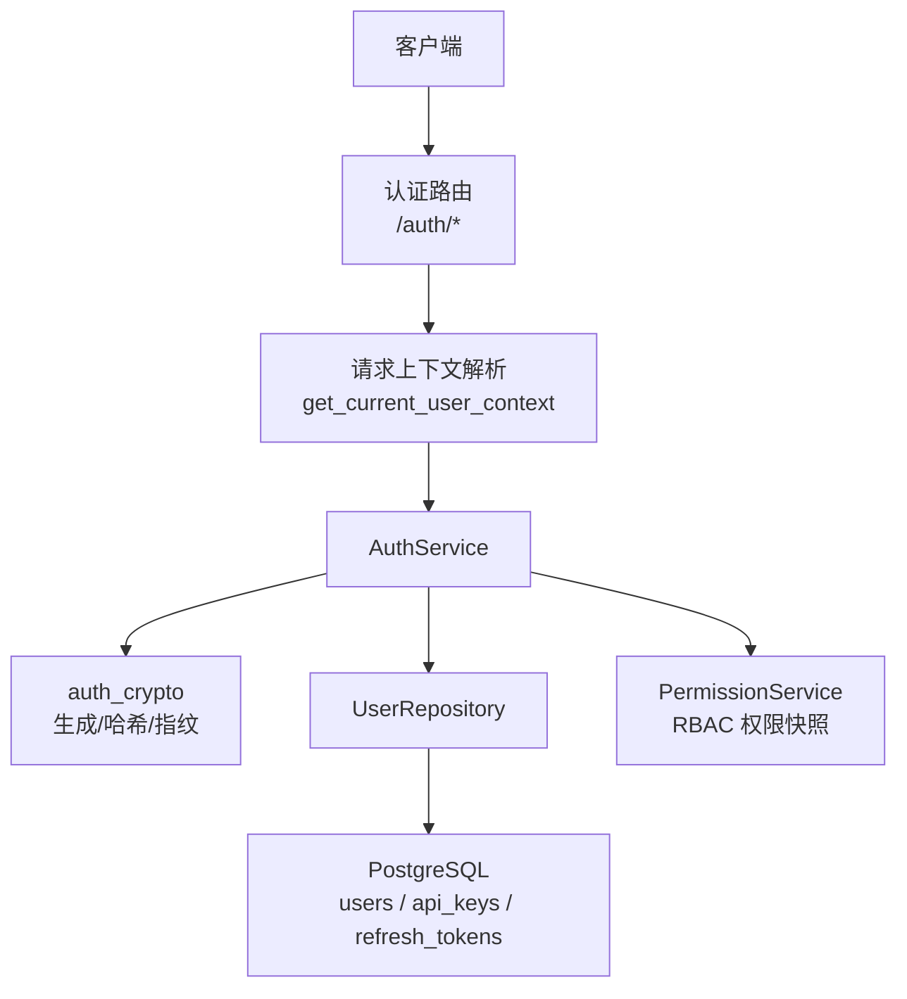
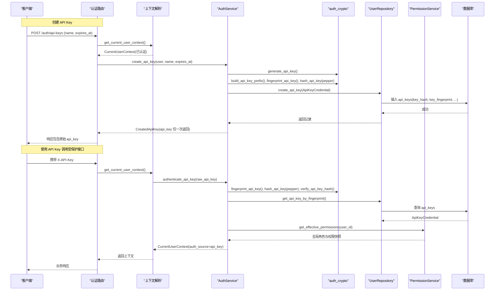
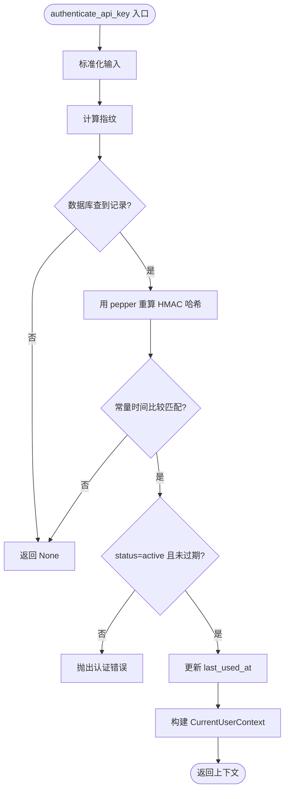
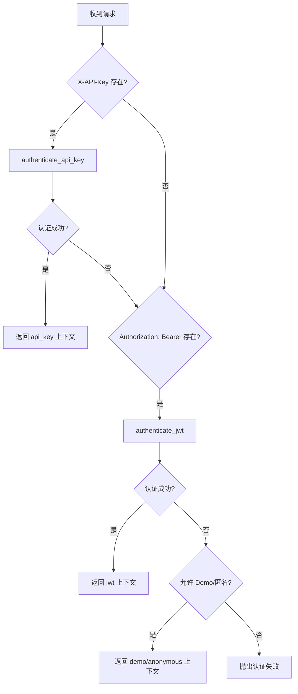
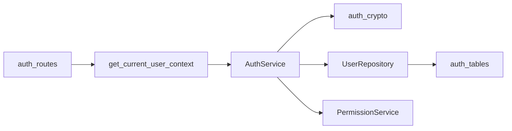

# API Key 管理

<cite>
**本文引用的文件**
- [auth_service.py](file://src/fast_app/services/auth/auth_service.py)
- [auth_crypto.py](file://src/fast_app/services/auth/auth_crypto.py)
- [auth_routes.py](file://src/fast_app/api/auth_routes.py)
- [auth_tables.py](file://src/fast_app/db/auth_tables.py)
- [user_repository.py](file://src/fast_app/services/auth/user_repository.py)
- [auth_models.py](file://src/fast_app/domain/auth_models.py)
- [auth_schema.py](file://src/fast_app/schemas/auth_schema.py)
- [user_context.py](file://src/fast_app/dependencies/user_context.py)
- [user_context_domain.py](file://src/fast_app/domain/user_context.py)
</cite>

## 目录
1. [简介](#简介)
2. [项目结构](#项目结构)
3. [核心组件](#核心组件)
4. [架构总览](#架构总览)
5. [详细组件分析](#详细组件分析)
6. [依赖关系分析](#依赖关系分析)
7. [性能与安全考虑](#性能与安全考虑)
8. [故障排查指南](#故障排查指南)
9. [结论](#结论)
10. [附录：API 与使用示例](#附录api-与使用示例)

## 简介
本文件系统性地说明 API Key 的生成、存储、验证机制，以及 AuthService 中的相关能力。重点包括：
- API Key 的创建流程与安全存储（仅保存派生值，不保存明文）
- 通过 X-API-Key 请求头进行身份认证并构建统一用户上下文
- 与 RBAC 权限体系的结合（全局角色与权限快照）
- 生命周期管理（状态、过期时间、撤销）
- 安全实践（密钥轮换、访问日志字段、异常处理）

## 项目结构
与 API Key 相关的代码分布在以下模块：
- API 路由层：提供创建、列出、撤销 API Key 的 HTTP 接口
- 服务层：AuthService 负责认证、创建、撤销等核心业务逻辑
- 加密工具：auth_crypto 提供高熵密钥生成、指纹、HMAC 哈希与常量时间比较
- 数据模型与表：domain 与 db 层定义 API Key 领域模型与持久化表结构
- 仓储层：UserRepository 封装数据库操作
- 依赖注入：user_context 解析请求头，优先尝试 API Key 认证，再尝试 JWT，最后回退到匿名或演示用户

图表来源
- [auth_routes.py:1-112](file://src/fast_app/api/auth_routes.py#L1-L112)
- [user_context.py:16-62](file://src/fast_app/dependencies/user_context.py#L16-L62)
- [auth_service.py:35-327](file://src/fast_app/services/auth/auth_service.py#L35-L327)
- [auth_crypto.py:34-71](file://src/fast_app/services/auth/auth_crypto.py#L34-L71)
- [user_repository.py:136-197](file://src/fast_app/services/auth/user_repository.py#L136-L197)
- [auth_tables.py:322-368](file://src/fast_app/db/auth_tables.py#L322-L368)

章节来源
- [auth_routes.py:1-112](file://src/fast_app/api/auth_routes.py#L1-L112)
- [user_context.py:16-62](file://src/fast_app/dependencies/user_context.py#L16-L62)
- [auth_service.py:35-327](file://src/fast_app/services/auth/auth_service.py#L35-L327)

## 核心组件
- AuthService：统一认证入口，封装 API Key/JWT 认证、令牌签发、当前用户上下文构建、RBAC 权限快照加载
- auth_crypto：安全的密钥生成、哈希、指纹与常量时间比较
- UserRepository：对 users、api_keys、refresh_tokens 表的读写封装
- 路由层：暴露 /auth/login、/auth/refresh、/auth/me、/auth/api-keys 等接口
- 领域模型与表：ApiKeyCredential、ApiKeyTable 等，确保只存派生值，不存明文
- 请求上下文：get_current_user_context 按优先级解析 X-API-Key、Bearer Token、Demo Header

章节来源
- [auth_service.py:35-327](file://src/fast_app/services/auth/auth_service.py#L35-L327)
- [auth_crypto.py:34-71](file://src/fast_app/services/auth/auth_crypto.py#L34-L71)
- [user_repository.py:136-197](file://src/fast_app/services/auth/user_repository.py#L136-L197)
- [auth_routes.py:1-112](file://src/fast_app/api/auth_routes.py#L1-L112)
- [auth_models.py:84-143](file://src/fast_app/domain/auth_models.py#L84-L143)
- [auth_tables.py:322-368](file://src/fast_app/db/auth_tables.py#L322-L368)
- [user_context.py:16-62](file://src/fast_app/dependencies/user_context.py#L16-L62)

## 架构总览
下图展示了 API Key 从创建到使用的完整链路，包括安全存储、认证、权限绑定与上下文构建。

图表来源
- [auth_routes.py:56-93](file://src/fast_app/api/auth_routes.py#L56-L93)
- [user_context.py:16-62](file://src/fast_app/dependencies/user_context.py#L16-L62)
- [auth_service.py:114-151](file://src/fast_app/services/auth/auth_service.py#L114-L151)
- [auth_service.py:172-208](file://src/fast_app/services/auth/auth_service.py#L172-L208)
- [auth_crypto.py:34-71](file://src/fast_app/services/auth/auth_crypto.py#L34-L71)
- [user_repository.py:136-197](file://src/fast_app/services/auth/user_repository.py#L136-L197)
- [auth_tables.py:322-368](file://src/fast_app/db/auth_tables.py#L322-L368)

## 详细组件分析

### AuthService 中的 API Key 功能
- 创建 API Key
  - 校验当前用户已认证且存在
  - 生成高熵原始 API Key，并计算前缀、指纹、HMAC 哈希
  - 持久化 ApiKeyCredential（不包含明文），返回仅一次的原始 key
- 认证 API Key
  - 标准化输入，计算指纹查找记录
  - 用 pepper 重新计算 HMAC 哈希并与数据库对比（常量时间比较）
  - 检查凭证状态与过期时间，更新 last_used_at
  - 加载用户 RBAC 快照，构建 CurrentUserContext
- 列出与撤销 API Key
  - 列表仅返回摘要（不含明文与 key_hash）
  - 撤销时限制只能撤销自己的 API Key，并记录撤销时间

图表来源
- [auth_service.py:114-151](file://src/fast_app/services/auth/auth_service.py#L114-L151)
- [auth_crypto.py:52-71](file://src/fast_app/services/auth/auth_crypto.py#L52-L71)
- [user_repository.py:147-181](file://src/fast_app/services/auth/user_repository.py#L147-L181)

章节来源
- [auth_service.py:114-151](file://src/fast_app/services/auth/auth_service.py#L114-L151)
- [auth_service.py:172-208](file://src/fast_app/services/auth/auth_service.py#L172-L208)
- [auth_service.py:210-234](file://src/fast_app/services/auth/auth_service.py#L210-L234)
- [auth_service.py:236-267](file://src/fast_app/services/auth/auth_service.py#L236-L267)

### 加密与存储策略
- 生成
  - 使用高熵随机源生成原始 API Key，并以固定前缀便于识别
- 存储
  - 数据库仅保存：key_prefix（展示）、key_fingerprint（审计/定位）、key_hash（HMAC+pepper）
  - 不保存明文 key，避免泄露风险
- 验证
  - 使用相同 pepper 计算 HMAC 哈希，并通过常量时间比较避免时序攻击
- 刷新与令牌
  - refresh token 同样采用 HMAC 哈希存储，支持轮换与撤销

章节来源
- [auth_crypto.py:34-71](file://src/fast_app/services/auth/auth_crypto.py#L34-L71)
- [auth_tables.py:322-368](file://src/fast_app/db/auth_tables.py#L322-L368)
- [auth_models.py:84-143](file://src/fast_app/domain/auth_models.py#L84-L143)

### 请求上下文与认证优先级
- 解析顺序
  - 优先尝试 X-API-Key 认证
  - 其次尝试 Authorization: Bearer <token>
  - 若配置允许，回退到演示用户或匿名用户
- 输出
  - 无论哪种方式，最终都产出统一的 CurrentUserContext，包含 auth_source、RBAC 快照等

图表来源
- [user_context.py:16-62](file://src/fast_app/dependencies/user_context.py#L16-L62)
- [user_context_domain.py:9-51](file://src/fast_app/domain/user_context.py#L9-L51)

章节来源
- [user_context.py:16-62](file://src/fast_app/dependencies/user_context.py#L16-L62)
- [user_context_domain.py:9-51](file://src/fast_app/domain/user_context.py#L9-L51)

### 权限绑定与访问控制
- 在构建 CurrentUserContext 时，会实时加载用户的 RBAC 全局角色与权限快照
- 后续业务可通过 CurrentUserContext.has_global_permission(permission_code) 进行细粒度访问控制
- API Key 与用户身份的关联通过 user_id 建立，所有鉴权均基于该用户上下文

章节来源
- [auth_service.py:236-267](file://src/fast_app/services/auth/auth_service.py#L236-L267)
- [user_context_domain.py:9-51](file://src/fast_app/domain/user_context.py#L9-L51)

## 依赖关系分析
- 路由层依赖上下文解析器与服务提供者
- 上下文解析器依赖 AuthService，按优先级执行认证
- AuthService 依赖加密工具、仓储与权限服务
- 仓储层依赖 SQLAlchemy 异步会话与数据库表模型

图表来源
- [auth_routes.py:1-112](file://src/fast_app/api/auth_routes.py#L1-L112)
- [user_context.py:16-62](file://src/fast_app/dependencies/user_context.py#L16-L62)
- [auth_service.py:35-327](file://src/fast_app/services/auth/auth_service.py#L35-L327)
- [auth_crypto.py:34-71](file://src/fast_app/services/auth/auth_crypto.py#L34-L71)
- [user_repository.py:1-200](file://src/fast_app/services/auth/user_repository.py#L1-L200)
- [auth_tables.py:322-368](file://src/fast_app/db/auth_tables.py#L322-L368)

章节来源
- [auth_routes.py:1-112](file://src/fast_app/api/auth_routes.py#L1-L112)
- [user_context.py:16-62](file://src/fast_app/dependencies/user_context.py#L16-L62)
- [auth_service.py:35-327](file://src/fast_app/services/auth/auth_service.py#L35-L327)

## 性能与安全考虑
- 性能
  - 认证路径中仅一次数据库查询（按指纹查找），随后常量时间哈希比较，开销低
  - last_used_at 更新用于审计与活跃度分析，可配合定期清理策略
- 安全
  - 不存储明文 API Key，仅保存派生值；验证时使用 pepper 与 HMAC
  - 使用常量时间比较防止时序侧信道攻击
  - 支持过期时间与撤销状态，降低长期凭证风险
  - 建议定期轮换 API Key，并为不同环境/用途设置独立密钥
  - 建议在网关或中间件层记录请求头（脱敏）与认证结果，便于审计

[本节为通用指导，无需具体文件引用]

## 故障排查指南
- 常见错误
  - 认证失败：检查是否提供了有效的 X-API-Key 或 Bearer Token
  - 凭证无效或已过期：检查 status 与 expires_at
  - 用户不存在：检查 API Key 归属用户是否仍有效
- 定位步骤
  - 查看 last_used_at 确认最近使用情况
  - 核对 key_fingerprint 与 key_hash 是否一致
  - 检查 pepper 配置是否正确（缺失会导致无法哈希）
- 日志建议
  - 记录认证来源（api_key/jwt/demo/anonymous）
  - 记录 API Key ID、用户 ID、请求路径、状态码（注意脱敏）

章节来源
- [auth_service.py:294-312](file://src/fast_app/services/auth/auth_service.py#L294-L312)
- [user_repository.py:173-197](file://src/fast_app/services/auth/user_repository.py#L173-L197)
- [auth_crypto.py:103-107](file://src/fast_app/services/auth/auth_crypto.py#L103-L107)

## 结论
该系统实现了安全的 API Key 全生命周期管理：创建时仅返回一次明文，数据库仅保存派生值；认证时通过指纹与 HMAC 哈希严格校验；认证成功后构建统一用户上下文并加载 RBAC 权限快照；支持过期与撤销，便于密钥轮换与风险控制。整体设计兼顾安全性、可审计性与可扩展性。

[本节为总结，无需具体文件引用]

## 附录：API 与使用示例

### 创建 API Key
- 方法：POST /auth/api-keys
- 请求体：name、expires_at（可选）
- 响应：id、name、api_key（仅一次返回）、key_prefix、key_fingerprint、expires_at
- 使用场景：为程序化访问创建凭证，妥善保存返回的 api_key

章节来源
- [auth_routes.py:56-69](file://src/fast_app/api/auth_routes.py#L56-L69)
- [auth_schema.py:65-89](file://src/fast_app/schemas/auth_schema.py#L65-L89)
- [auth_models.py:131-143](file://src/fast_app/domain/auth_models.py#L131-L143)

### 列出 API Key
- 方法：GET /auth/api-keys
- 响应：每个 API Key 的摘要信息（不含明文与 key_hash）
- 用途：管理界面展示与审计

章节来源
- [auth_routes.py:72-93](file://src/fast_app/api/auth_routes.py#L72-L93)
- [auth_schema.py:92-103](file://src/fast_app/schemas/auth_schema.py#L92-L103)

### 撤销 API Key
- 方法：DELETE /auth/api-keys/{api_key_id}
- 行为：将状态置为 revoked，记录撤销时间
- 约束：只能撤销自己的 API Key

章节来源
- [auth_routes.py:96-108](file://src/fast_app/api/auth_routes.py#L96-L108)
- [auth_service.py:221-234](file://src/fast_app/services/auth/auth_service.py#L221-L234)
- [user_repository.py:183-197](file://src/fast_app/services/auth/user_repository.py#L183-L197)

### 使用 API Key 调用受保护接口
- 请求头：X-API-Key: <your_api_key>
- 流程：上下文解析器优先尝试 API Key 认证，成功后构建 CurrentUserContext，后续业务可按权限控制访问

章节来源
- [user_context.py:16-62](file://src/fast_app/dependencies/user_context.py#L16-L62)
- [auth_service.py:114-151](file://src/fast_app/services/auth/auth_service.py#L114-L151)

### 安全最佳实践
- 密钥轮换：定期更换 API Key，旧 Key 到期或撤销后不再使用
- 最小权限：为不同用途创建独立 Key，并结合 RBAC 限制访问范围
- 审计与监控：记录认证来源、API Key ID、用户 ID、请求路径与结果
- 传输安全：在生产环境使用 HTTPS，避免明文在传输中被窃取
- 配置安全：确保 pepper 等敏感配置仅在服务端持有，不进入日志或版本库

[本节为通用指导，无需具体文件引用]