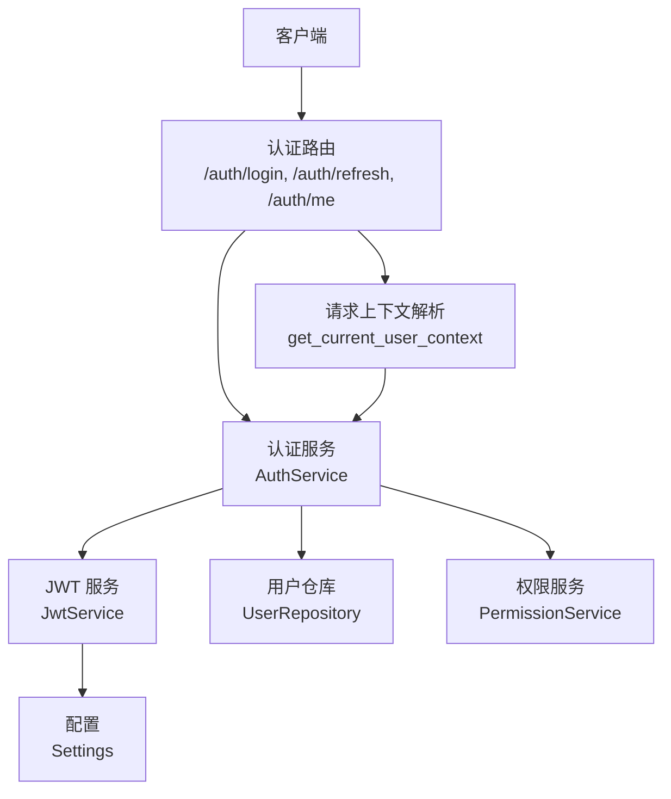
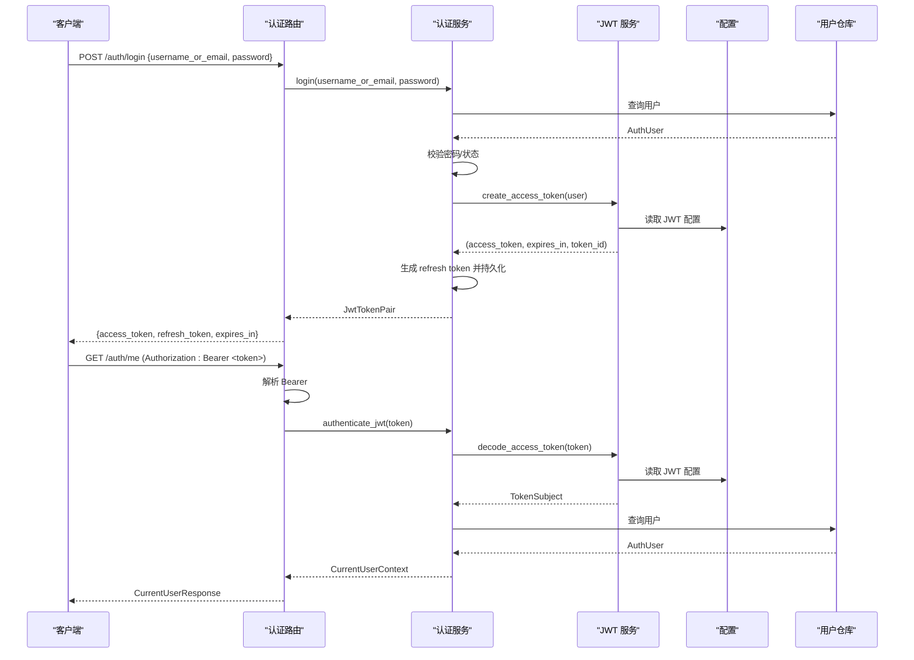
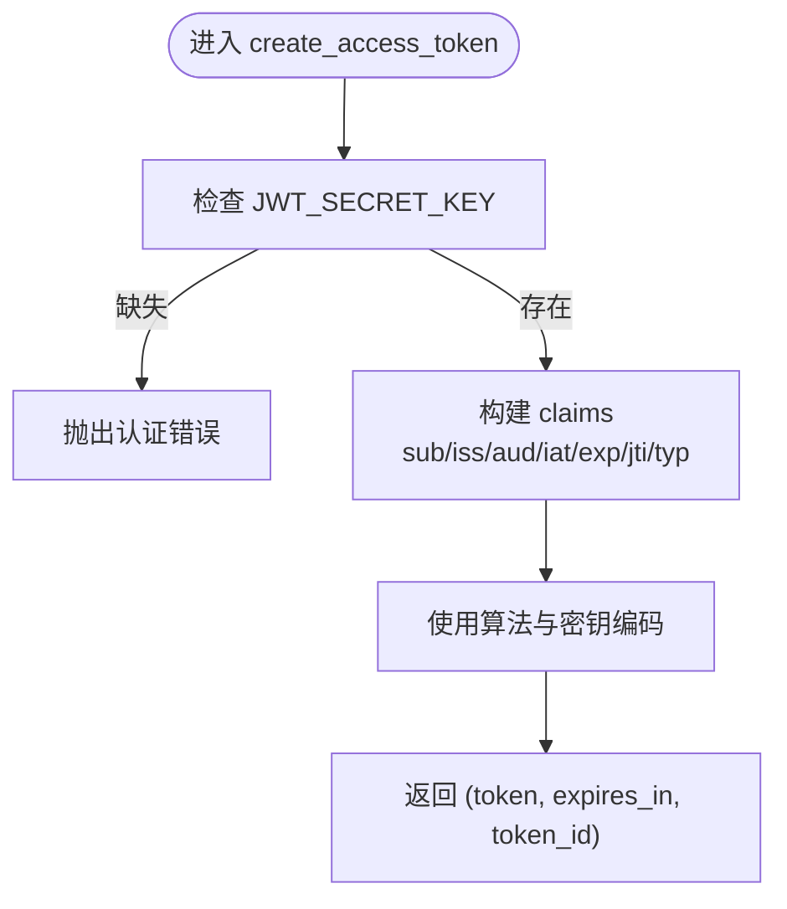
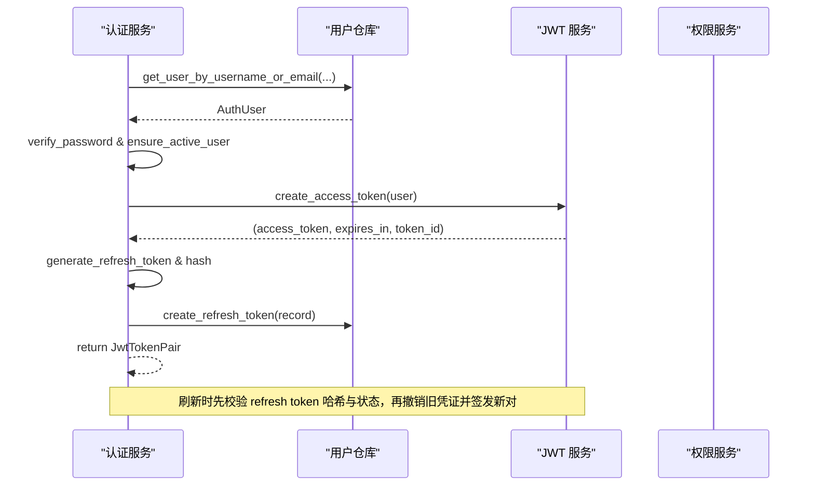
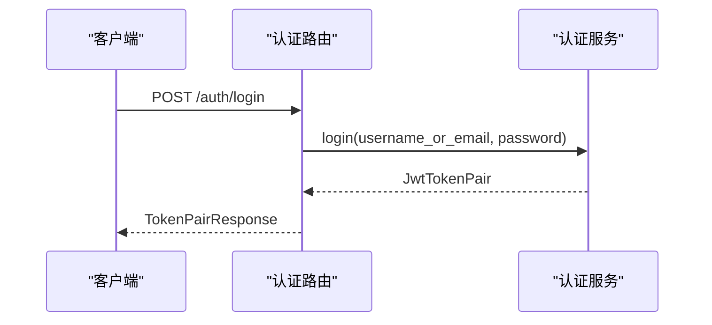
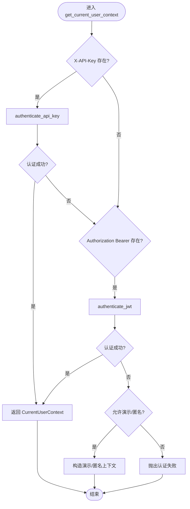
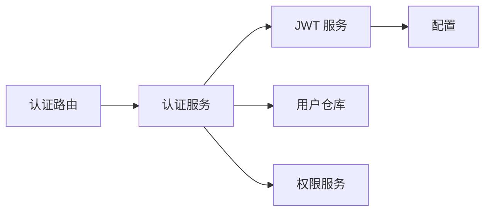

# JWT 认证机制

<cite>
**本文引用的文件**
- [jwt_service.py](file://src/fast_app/services/auth/jwt_service.py)
- [auth_routes.py](file://src/fast_app/api/auth_routes.py)
- [auth_service.py](file://src/fast_app/services/auth/auth_service.py)
- [config.py](file://src/fast_app/core/config.py)
- [auth_models.py](file://src/fast_app/domain/auth_models.py)
- [auth_schema.py](file://src/fast_app/schemas/auth_schema.py)
- [user_context.py](file://src/fast_app/dependencies/user_context.py)
</cite>

## 目录
1. [简介](#简介)
2. [项目结构](#项目结构)
3. [核心组件](#核心组件)
4. [架构总览](#架构总览)
5. [详细组件分析](#详细组件分析)
6. [依赖关系分析](#依赖关系分析)
7. [性能与扩展性](#性能与扩展性)
8. [故障排查指南](#故障排查指南)
9. [结论](#结论)
10. [附录：安全最佳实践](#附录：安全最佳实践)

## 简介
本文件围绕项目的 JWT 认证机制，系统性说明令牌的签发、校验与刷新流程，重点解析 JwtService 的实现原理（签名算法、过期时间管理、用户信息嵌入），并梳理登录接口从凭证验证到令牌生成的完整链路。同时给出中间件集成方式、请求上下文解析策略，以及令牌存储、跨域配置、防重放等安全建议。

## 项目结构
JWT 相关能力分布在以下模块：
- API 路由层：暴露登录、刷新、当前用户信息等接口
- 认证服务层：统一封装登录、刷新、JWT 认证、API Key 认证与权限上下文构建
- JWT 服务层：负责 access token 的签发与解码
- 配置层：集中管理 JWT 密钥、算法、签发者、受众、过期时间等
- 领域模型与 Schema：定义用户、令牌对、刷新记录、请求/响应结构
- 依赖注入与上下文：统一解析请求头中的 API Key 或 Bearer Token，构造当前用户上下文

图表来源
- [auth_routes.py:22-44](file://src/fast_app/api/auth_routes.py#L22-L44)
- [auth_service.py:75-112](file://src/fast_app/services/auth/auth_service.py#L75-L112)
- [jwt_service.py:19-79](file://src/fast_app/services/auth/jwt_service.py#L19-L79)
- [config.py:145-158](file://src/fast_app/core/config.py#L145-L158)
- [user_context.py:16-62](file://src/fast_app/dependencies/user_context.py#L16-L62)

章节来源
- [auth_routes.py:22-44](file://src/fast_app/api/auth_routes.py#L22-L44)
- [auth_service.py:75-112](file://src/fast_app/services/auth/auth_service.py#L75-L112)
- [jwt_service.py:19-79](file://src/fast_app/services/auth/jwt_service.py#L19-L79)
- [config.py:145-158](file://src/fast_app/core/config.py#L145-L158)
- [user_context.py:16-62](file://src/fast_app/dependencies/user_context.py#L16-L62)

## 核心组件
- JwtService：封装 access token 的创建与解码，包含签名算法、签发者、受众、过期时间、唯一 token ID 等声明处理
- AuthService：协调登录、刷新、JWT 认证、API Key 认证，并构建统一的 CurrentUserContext
- 认证路由：提供 /auth/login、/auth/refresh、/auth/me 等端点
- 配置 Settings：集中管理 JWT_SECRET_KEY、JWT_ALGORITHM、JWT_ISSUER、JWT_AUDIENCE、access/refresh 过期时间
- 领域模型与 Schema：AuthUser、TokenSubject、JwtTokenPair、RefreshTokenRecord、LoginRequest、RefreshTokenRequest、CurrentUserResponse 等
- 请求上下文解析：优先 X-API-Key，其次 Authorization Bearer，再回退演示/匿名模式

章节来源
- [jwt_service.py:13-89](file://src/fast_app/services/auth/jwt_service.py#L13-L89)
- [auth_service.py:35-327](file://src/fast_app/services/auth/auth_service.py#L35-L327)
- [auth_routes.py:22-53](file://src/fast_app/api/auth_routes.py#L22-L53)
- [config.py:145-158](file://src/fast_app/core/config.py#L145-L158)
- [auth_models.py:62-129](file://src/fast_app/domain/auth_models.py#L62-L129)
- [auth_schema.py:8-41](file://src/fast_app/schemas/auth_schema.py#L8-L41)
- [user_context.py:16-62](file://src/fast_app/dependencies/user_context.py#L16-L62)

## 架构总览
下图展示从登录到鉴权的端到端调用链：

图表来源
- [auth_routes.py:22-53](file://src/fast_app/api/auth_routes.py#L22-L53)
- [auth_service.py:75-112](file://src/fast_app/services/auth/auth_service.py#L75-L112)
- [auth_service.py:153-170](file://src/fast_app/services/auth/auth_service.py#L153-L170)
- [jwt_service.py:19-79](file://src/fast_app/services/auth/jwt_service.py#L19-L79)
- [config.py:145-158](file://src/fast_app/core/config.py#L145-L158)

## 详细组件分析

### JwtService：令牌签发与校验
- 令牌签发
  - 使用配置的算法和密钥对 claims 进行签名
  - 标准声明：sub（用户ID）、iss（签发者）、aud（受众）、iat（签发时间）、exp（过期时间）、jti（唯一 token ID）
  - 自定义声明：typ=“access”，用于区分访问令牌类型
  - 返回三元组：access_token、有效秒数、token_id
- 令牌校验
  - 校验签名、iss、aud、exp
  - 校验 typ 必须为 “access”
  - 提取 user_id、token_id、expires_at，封装为 TokenSubject
- 安全前置检查
  - 若未配置 JWT_SECRET_KEY，直接抛出认证错误

图表来源
- [jwt_service.py:19-46](file://src/fast_app/services/auth/jwt_service.py#L19-L46)
- [config.py:145-158](file://src/fast_app/core/config.py#L145-L158)

章节来源
- [jwt_service.py:19-79](file://src/fast_app/services/auth/jwt_service.py#L19-L79)
- [config.py:145-158](file://src/fast_app/core/config.py#L145-L158)

### AuthService：登录、刷新与上下文构建
- 登录流程
  - 根据用户名或邮箱查询用户
  - 校验密码与账号状态
  - 更新最后登录时间
  - 签发 access token 与 refresh token，持久化 refresh token 哈希
  - 返回 JwtTokenPair
- 刷新流程
  - 对 refresh token 计算哈希并查询记录
  - 校验状态与过期时间
  - 标记已使用并撤销原 refresh token
  - 重新签发新的 token pair
- JWT 认证
  - 解码 access token，获取 TokenSubject
  - 查询用户并校验状态
  - 构建 CurrentUserContext（含全局角色与权限快照）

图表来源
- [auth_service.py:75-112](file://src/fast_app/services/auth/auth_service.py#L75-L112)
- [auth_service.py:269-292](file://src/fast_app/services/auth/auth_service.py#L269-L292)

章节来源
- [auth_service.py:75-112](file://src/fast_app/services/auth/auth_service.py#L75-L112)
- [auth_service.py:269-292](file://src/fast_app/services/auth/auth_service.py#L269-L292)

### 登录接口工作流
- 路由定义
  - POST /auth/login：接收 LoginRequest，返回 TokenPairResponse
  - POST /auth/refresh：接收 RefreshTokenRequest，返回 TokenPairResponse
  - GET /auth/me：基于当前用户上下文返回 CurrentUserResponse
- 调用链
  - 路由层仅做参数绑定与响应转换
  - 业务逻辑委托给 AuthService
  - 最终通过 Pydantic 模型校验响应体

图表来源
- [auth_routes.py:22-33](file://src/fast_app/api/auth_routes.py#L22-L33)
- [auth_service.py:75-90](file://src/fast_app/services/auth/auth_service.py#L75-L90)
- [auth_schema.py:8-41](file://src/fast_app/schemas/auth_schema.py#L8-L41)

章节来源
- [auth_routes.py:22-53](file://src/fast_app/api/auth_routes.py#L22-L53)
- [auth_schema.py:8-41](file://src/fast_app/schemas/auth_schema.py#L8-L41)

### 请求上下文解析与中间件集成
- 解析优先级
  - 优先尝试 X-API-Key 认证
  - 其次尝试 Authorization: Bearer 认证
  - 在 AUTH_ENABLED=false 或允许演示头时，支持 X-Demo-User-Id 构造演示上下文
  - 否则在开启认证时拒绝匿名访问
- 中间件集成方式
  - 将 get_current_user_context 作为 FastAPI 依赖注入到任意路由
  - 路由中通过 Depends(get_current_user_context) 获取 CurrentUserContext
  - 后续权限判断可复用 require_permission 或直接检查上下文中的权限集合

图表来源
- [user_context.py:16-62](file://src/fast_app/dependencies/user_context.py#L16-L62)
- [auth_service.py:114-170](file://src/fast_app/services/auth/auth_service.py#L114-L170)

章节来源
- [user_context.py:16-62](file://src/fast_app/dependencies/user_context.py#L16-L62)
- [auth_service.py:114-170](file://src/fast_app/services/auth/auth_service.py#L114-L170)

### 数据模型与配置要点
- 领域模型
  - AuthUser：用户基本信息、状态、部门归属
  - TokenSubject：从 access token 解析出的身份声明
  - JwtTokenPair：登录/刷新后返回的令牌对
  - RefreshTokenRecord：刷新凭证的持久化视图（仅保存哈希）
- 配置项
  - JWT_SECRET_KEY：对称签名密钥
  - JWT_ALGORITHM：签名算法（默认 HS256）
  - JWT_ISSUER/JWT_AUDIENCE：签发者与受众校验
  - JWT_ACCESS_TOKEN_EXPIRE_MINUTES：access token 有效期（分钟）
  - JWT_REFRESH_TOKEN_EXPIRE_DAYS：refresh token 有效期（天）

章节来源
- [auth_models.py:62-129](file://src/fast_app/domain/auth_models.py#L62-L129)
- [config.py:145-158](file://src/fast_app/core/config.py#L145-L158)

## 依赖关系分析
- 组件耦合
  - 路由层仅依赖认证服务与 Pydantic 模型，保持薄控制器
  - 认证服务聚合 JWT 服务、用户仓库、权限服务，形成认证主路径
  - JWT 服务依赖配置，不感知业务细节
- 外部依赖
  - PyJWT：用于令牌编解码
  - 数据库：用户表、刷新凭证表、RBAC 权限表
- 潜在循环依赖
  - 当前分层清晰，未见循环导入；JWT 服务不反向依赖认证服务

图表来源
- [auth_routes.py:22-53](file://src/fast_app/api/auth_routes.py#L22-L53)
- [auth_service.py:35-52](file://src/fast_app/services/auth/auth_service.py#L35-L52)
- [jwt_service.py:13-17](file://src/fast_app/services/auth/jwt_service.py#L13-L17)
- [config.py:145-158](file://src/fast_app/core/config.py#L145-L158)

章节来源
- [auth_routes.py:22-53](file://src/fast_app/api/auth_routes.py#L22-L53)
- [auth_service.py:35-52](file://src/fast_app/services/auth/auth_service.py#L35-L52)
- [jwt_service.py:13-17](file://src/fast_app/services/auth/jwt_service.py#L13-L17)
- [config.py:145-158](file://src/fast_app/core/config.py#L145-L158)

## 性能与扩展性
- 令牌校验开销
  - access token 解码与签名校验为轻量操作，适合高频鉴权
  - 刷新流程涉及一次数据库查询与写入，注意索引优化
- 可扩展点
  - 可在 JwtService 中增加黑名单/撤销列表以支持即时失效
  - 可在认证服务中接入审计日志，记录 token_id 与用户行为
  - 可通过配置切换算法与密钥轮换策略

[本节为通用指导，无需具体文件引用]

## 故障排查指南
- 常见错误与定位
  - JWT_SECRET_KEY 未配置：JwtService 会直接抛出认证错误
  - 令牌类型不正确：decode 时校验 typ 必须为 “access”
  - 缺少必要声明：缺少 user_id、token_id 或 exp 会触发认证错误
  - 用户不存在或已禁用：认证服务在 JWT 认证与登录流程中均会校验
  - Refresh token 无效/过期：刷新流程会校验哈希、状态与过期时间
- 排查步骤
  - 检查环境变量是否设置 JWT_SECRET_KEY、JWT_ALGORITHM、JWT_ISSUER、JWT_AUDIENCE
  - 确认 access token 由系统签发且未被篡改
  - 核对数据库用户状态与刷新凭证记录
  - 查看请求头是否正确携带 X-API-Key 或 Authorization: Bearer

章节来源
- [jwt_service.py:81-85](file://src/fast_app/services/auth/jwt_service.py#L81-L85)
- [jwt_service.py:48-79](file://src/fast_app/services/auth/jwt_service.py#L48-L79)
- [auth_service.py:75-112](file://src/fast_app/services/auth/auth_service.py#L75-L112)
- [auth_service.py:294-312](file://src/fast_app/services/auth/auth_service.py#L294-L312)

## 结论
本项目采用标准的 JWT 方案实现无状态访问控制，并通过统一的认证服务抽象出登录、刷新与鉴权流程。JwtService 负责令牌的签发与校验，AuthService 整合用户、权限与令牌生命周期管理，路由层保持简洁。结合请求上下文解析器，系统支持 API Key、Bearer Token 与演示/匿名模式，便于开发与测试。

[本节为总结性内容，无需具体文件引用]

## 附录：安全最佳实践
- 令牌存储策略
  - 前端推荐将 access token 保存在内存中，避免 XSS 窃取
  - refresh token 建议使用 HttpOnly Cookie 或安全存储，限制跨域访问
  - 服务端仅保存 refresh token 的哈希值，不存明文
- 跨域配置
  - 严格限定允许的 Origin、方法与头部
  - 对敏感接口启用 CSRF 防护（如使用 Cookie 场景）
- 防重放攻击
  - 为关键写操作引入一次性 nonce 或请求签名
  - 结合时间窗口与 IP/设备指纹进行二次校验
- 密钥与算法
  - 生产环境使用强随机密钥，定期轮换
  - 明确配置 JWT_ISSUER 与 JWT_AUDIENCE，防止令牌被误用
- 最小权限与审计
  - 仅授予必要的 RBAC 权限
  - 记录 token_id 与用户操作，便于追踪与审计

[本节为通用指导，无需具体文件引用]